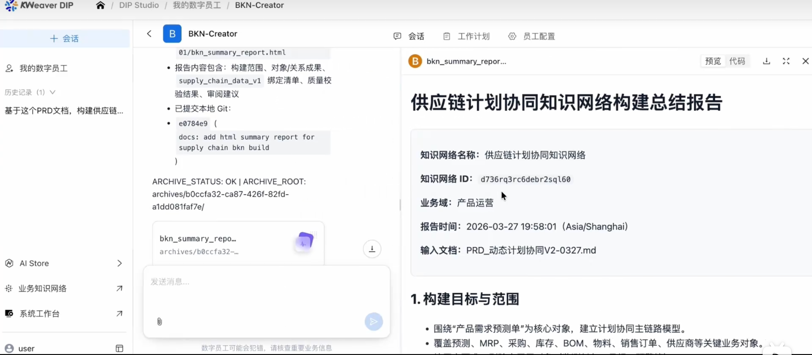

<p align="center">
  <picture>
    <source media="(prefers-color-scheme: dark)" srcset="./assets/logo/dark.png" />
    <source media="(prefers-color-scheme: light)" srcset="./assets/logo/light.png" />
    
  </picture>
</p>

[中文](README.zh.md) | English

[](LICENSE.txt) [](https://skills.sh/kweaver-ai/kweaver-sdk/kweaver-core) [](https://skills.sh/kweaver-ai/kweaver-sdk/create-bkn)

KWeaver Core is a harness-first foundation for enterprise decision agents. It turns fragmented data, knowledge, tools, and policies into governed context, safe execution, and verifiable feedback loops. With semantic modeling, real-time access, runtime control, and TraceAI, it helps AI systems reason, adapt, and act reliable in complex enterprises.

> **Note:** KWeaver Core is a **backend-only framework** — it does not include a web UI. All interactions are through the CLI, SDK, or API. If you need a graphical interface, please install [**KWeaver DIP**](https://github.com/kweaver-ai/kweaver).

## 📚 Quick Links

- 🌐 [KWeaver DIP](https://dip-poc.aishu.cn/studio/agent/development/my-agent-list) - Web UI for KWeaver (username: `kweaver`, password: `111111`)
- 🤝 [Contributing](rules/CONTRIBUTING.md) - Guidelines for contributing to the project
- 🚢 [Deployment](deploy/README.md) - One-click deploy to Kubernetes
- 📘 [Documentation](help/) - Product documentation and usage guides
- 📝 [Blog](https://kweaver-ai.github.io/kweaver-core/) - KWeaver technical articles and updates
- 🚀 [Release Guidelines](rules/RELEASE.md) - Version management and release process
- 🏗️ [Architecture](rules/ARCHITECTURE.md) - Architecture design specification
- 🧾 [Release Notes](release-notes/) - All notable changes
- 📄 [License](LICENSE.txt) - Apache License 2.0
- 🐛 [Report Bug](https://github.com/kweaver-ai/kweaver-core/issues) - Report a bug or issue
- 💡 [Request Feature](https://github.com/kweaver-ai/kweaver-core/issues) - Suggest a new feature

## 🎬 Demo Video

<div align="center">
<a href="https://www.bilibili.com/video/BV1nGXVBTEmo/?vd_source=4cdad687b2ac18a0b25e434f1fafe2f7" target="_blank">

</a>

Click the image to watch the KWeaver demo on Bilibili
</div>

## 🚀 Quick Start

1. **Source deployment**: see the [Deployment Guide](deploy/README.md).
2. **Prerequisites**: follow the prerequisites described in `deploy/README.md`.
3. **Run installation scripts**:

```bash
git clone https://github.com/kweaver-ai/kweaver-core.git
cd kweaver-core/deploy
chmod +x deploy.sh

# Full one-click deployment (recommended)
./deploy.sh kweaver-core install

# Or specify the access address and API server address explicitly
./deploy.sh kweaver-core install \
  --access_address=<your-ip> \
  --api_server_address=<your-ip>

./deploy.sh --help
```

4. **Verify the deployment**:

```bash
# Check cluster status
kubectl get nodes
kubectl get pods -A

# Check service status
./deploy.sh kweaver status
```

5. **Verify API access**:

```bash
kweaver auth login https://<node-ip> -k
kweaver bkn list
```

> **No deployment yet?** Use the [KWeaver DIP](https://dip-poc.aishu.cn/studio/agent/development/my-agent-list) web UI to try KWeaver online (username: `kweaver`, password: `111111`), or connect your CLI/SDK directly to the demo environment (see below).

### Core Subsystems

| Sub-project | Description | Repository |
| --- | --- | --- |
| **KWeaver SDK** | CLI and SDK (TypeScript/Python) for AI agents and developers to access KWeaver knowledge networks and Decision Agents programmatically | [kweaver-sdk](https://github.com/kweaver-ai/kweaver-sdk) |
| **KWeaver Core** | AI-native platform foundation — Decision Agent, AI Data Platform (BKN Engine, VEGA Engine, Context Loader, Execution Factory), Info Security Fabric, Trace AI | [kweaver-core](https://github.com/kweaver-ai/kweaver-core) (this repo) |

## KWeaver SDK

[**kweaver-sdk**](https://github.com/kweaver-ai/kweaver-sdk) gives AI agents (Claude Code, GPT, custom agents, etc.) access to KWeaver knowledge networks and Decision Agents via the `kweaver` CLI. It also provides Python and TypeScript SDKs for programmatic integration.

### AI Agent Skills

Install skills from [**kweaver-sdk**](https://github.com/kweaver-ai/kweaver-sdk) with [`npx skills`](https://www.npmjs.com/package/skills).

**Install both skills at once** (recommended):

```bash
npx skills add https://github.com/kweaver-ai/kweaver-sdk \
  --skill kweaver-core --skill create-bkn
```

- **`kweaver-core`** — full KWeaver APIs and CLI conventions so assistants can operate KWeaver on your behalf. See [skills/kweaver-core/SKILL.md](https://github.com/kweaver-ai/kweaver-sdk/blob/main/skills/kweaver-core/SKILL.md).
- **`create-bkn`** — guided workflow and tooling to create and manage **Business Knowledge Networks (BKN)** from your AI coding assistant. See [skills/create-bkn/SKILL.md](https://github.com/kweaver-ai/kweaver-sdk/blob/main/skills/create-bkn/SKILL.md).

**Install a single skill only** (optional):

```bash
npx skills add https://github.com/kweaver-ai/kweaver-sdk --skill kweaver-core
# or
npx skills add https://github.com/kweaver-ai/kweaver-sdk --skill create-bkn
```

**Before using any skill**, authenticate with your KWeaver instance:

```bash
npm install -g @kweaver-ai/kweaver-sdk
kweaver auth login https://your-kweaver-instance.com
```

> **Self-signed certificate?** If your instance uses a self-signed or untrusted TLS certificate (common for fresh deployments without a CA-issued cert), add `-k` to skip certificate verification:
>
> ```bash
> kweaver auth login https://your-kweaver-instance.com -k
> ```

### Try with Demo Environment

No deployment needed — connect your AI agent to the demo environment and start exploring immediately (for the web UI, visit [KWeaver DIP](https://dip-poc.aishu.cn/studio/agent/development/my-agent-list)):

```bash
npx skills add https://github.com/kweaver-ai/kweaver-sdk \
  --skill kweaver-core --skill create-bkn

npm install -g @kweaver-ai/kweaver-sdk
kweaver auth login https://dip-poc.aishu.cn -k
```

Then ask your AI agent (Cursor, Claude Code, etc.) using natural language:

```
List all knowledge networks
What object types are in the supply chain knowledge network?
Search the supply chain knowledge network for "supply chain risks"
Show 2 sample customer records
List all Decision Agents
Chat with Agent xxx, ask "What is the current inventory status?"
```

Or use `/kweaver-core` slash commands (the skill takes over automatically):

```
/kweaver-core List all knowledge networks
/kweaver-core What's in the supply chain knowledge network?
/kweaver-core Search knowledge network for "supply chain risks"
/kweaver-core Show 2 sample customer records from the knowledge network
/kweaver-core List all Decision Agents
/kweaver-core Chat with Agent <agent-id>, ask "What is the current inventory status?"
```

> **Demo credentials**: username `kweaver`, password `111111`

### Headless login (SSH, CI, containers — no browser)

The **npm** `kweaver` CLI can complete OAuth without a local graphical browser:

1. On a machine **with** a browser, run `kweaver auth login https://your-instance`. After success, copy the one-line command from the callback page, or run `kweaver auth export` / `kweaver auth export --json`.
2. On the **headless** host, run that command — it uses `--client-id`, `--client-secret`, and `--refresh-token` to exchange tokens and save credentials under `~/.kweaver/` as usual.

You can also run `kweaver auth login <url> --client-id … --client-secret … --refresh-token …` directly on the headless machine if you already have those values.

Full details: [kweaver-sdk — Headless / Server Authentication](https://github.com/kweaver-ai/kweaver-sdk/blob/main/packages/typescript/README.md#headless--server-authentication) (TypeScript package README). The Python `kweaver` CLI still uses interactive browser login; reuse the same `~/.kweaver/` directory copied from a machine where the Node CLI finished login, or set `KWEAVER_BASE_URL` / `KWEAVER_TOKEN` (see [kweaver-sdk Authentication](https://github.com/kweaver-ai/kweaver-sdk#authentication)).

### CLI

```bash
kweaver auth login https://your-kweaver.com     # authenticate (-k for self-signed certs)
kweaver bkn list                                 # browse knowledge networks
kweaver bkn search <kn-id> "query"              # semantic search over a BKN
kweaver bkn build <kn-id> --wait                # rebuild index and wait for completion
kweaver bkn object-type list <kn-id>            # inspect object types
kweaver bkn action-type execute <kn-id> <at-id> # execute an action
kweaver agent list                               # list Decision Agents
kweaver agent chat <agent-id> -m "Hello"        # chat with an agent
kweaver ds import-csv <ds-id> --files "*.csv"   # import CSV files into a datasource
kweaver context-loader kn-search "query"        # semantic search via Context Loader
kweaver call /api/...                            # raw API call
```

### TypeScript & Python SDK

**Simple API (recommended):**

```typescript
import kweaver from "@kweaver-ai/kweaver-sdk/kweaver";
kweaver.configure({ config: true, bknId: "your-bkn-id", agentId: "your-agent-id" });

const results = await kweaver.search("What risks exist in the supply chain?");
const reply   = await kweaver.chat("Summarise the top 3 risks");
await kweaver.weaver({ wait: true });   // rebuild BKN index
```

```python
import kweaver
kweaver.configure(config=True, bkn_id="your-bkn-id", agent_id="your-agent-id")

results = kweaver.search("What risks exist in the supply chain?")
reply   = kweaver.chat("Summarise the top 3 risks")
```

**Full client API (advanced):**

```typescript
import { KWeaverClient } from "@kweaver-ai/kweaver-sdk";
const client = new KWeaverClient();   // reads ~/.kweaver/ credentials

const kns   = await client.knowledgeNetworks.list();
const reply = await client.agents.chat("agent-id", "Hello");
await client.agents.stream("agent-id", "Hello", {
  onTextDelta: (chunk) => process.stdout.write(chunk),
});
```

```python
from kweaver import KWeaverClient, ConfigAuth
client = KWeaverClient(auth=ConfigAuth())
kns  = client.knowledge_networks.list()
msg  = client.conversations.send_message("", "Hello", agent_id="agent-id")
```

---

## KWeaver Core

**KWeaver Core** is the AI-native platform foundation for autonomous decision-making. It sits between AI Agents (above) and AI/Data infrastructure (below), with the **Business Knowledge Network (BKN)** at its center, providing unified data access, execution, and security governance for Agents.

```text
            ┌─────────────────────────────────┐
            │     AI Agents (Decision Agent,   │
            │     Data Agent, HiAgent, ...)    │
            └───────────────┬─────────────────┘
                            │
            ┌───────────────▼─────────────────┐
            │     Business Knowledge Network   │
            │         KWeaver Core             │
            └───────────────┬─────────────────┘
                            │
            ┌───────────────▼─────────────────┐
            │   AI Infrastructure & Data       │
            │   Infrastructure                 │
            └─────────────────────────────────┘
```

KWeaver Core solves two critical pain points when connecting proprietary data with autonomous AI Agents:

### Context Engineering — High-Quality Context for Agents

In long-running agent scenarios, context inevitably faces explosion, decay, pollution, and high token costs. KWeaver Core addresses these through the Business Knowledge Network:

- **Context explosion containment** — Multi-source candidates are first organized and aggregated via the BKN semantic network, then unified by Context Loader (recall → coarse ranking → fine ranking) to retain only key evidence and constraints, avoiding massive prompt fragments that cause decision drift. Overall accuracy reaches **93%+**.
- **Context decay mitigation** — Replaces long-text stacking with "real-time facts + evidence citations", keeping reasoning grounded around specific objects and reducing forgetting and hallucination risks in long inputs. Accuracy improves **15%+** over baselines across scenario types.
- **Context pollution isolation** — Builds precise enterprise digital twins through the BKN network, blocking unreliable content and potential injection risks outside the knowledge and execution boundary, ensuring a clean and controllable reasoning chain.
- **Token cost compression** — Converts multi-source materials into structured object information fetched on demand (not full-text concatenation), improving information density within the same budget. Token consumption reduced **30%+** while improving accuracy.

### Harness Engineering — Safe & Controllable Execution

Beyond "seeing more", Agents must "do it right". KWeaver Core provides constraint engineering capabilities for enterprise-grade safe execution:

- **Explainable decisions** — Uses "Object → Action → Rule → Constraint" knowledge structures to express business intent graphs, grounding tool invocation and parameter selection to explicit semantic boundaries and rule dependencies, making it clear "why this action was taken".
- **Traceable evidence chain** — From action intent → knowledge node → data source → mapping/operator → final invocation, full-chain tracing is supported. Entities and relationships can be traced back to source data and active rules, enabling audit and review.
- **Controllable execution loop** — Unifies identity and access control down to knowledge network object/action permissions, with pre-execution validation, mid-execution policy interception, and post-execution audit logging, achieving "authorizable, approvable, revocable" security loops.
- **Risk prevention mechanism** — Models risks as "Risk Types" linked to Action Types; performs risk assessment and simulation before execution, with automatic downgrade/blocking/secondary confirmation when thresholds are hit, blocking high-risk actions before they execute.

### Core Architecture

```text
┌──────────────────────── KWeaver Core ────────────────────────┐
│         │                                          │         │
│         │  Decision Agent                          │         │
│  Info   │  (Dolphin Runtime / Agent Executor)       │  Trace │
│  Secu-  │──────────────────────────────────────────│         │
│  rity   │                                          │   AI    │
│         │  AI Data Platform                        │         │
│ Fabric  │  ┌────────────────────────────────────┐  │  Obse-  │
│         │  │ Context Loader                     │  │  rvab-  │
│ (ISF)   │  │  ┌───────────┐   ┌─────────────┐  │  │  ility  │
│         │  │  │ Retrieval │ → │   Ranker    │  │  │    /    │
│ Access  │  │  └───────────┘   └─────────────┘  │  │  Evid-  │
│ Control │  ├────────────────────────────────────┤  │  ence   │
│    /    │  │ Business Knowledge Network         │  │         │
│ Secu-   │  │  ┌────────────────────────────┐    │  │         │
│  rity   │  │  │ BKN Engine                 │    │  │         │
│         │  │  │ (Data/Logic/Risk/Action)    │    │  │         │
│         │  │  └──────┬─────────────┬───────┘    │  │         │
│         │  │         ↓ mapping     ↓ mapping    │  │         │
│         │  │  ┌────────┐ ┌───────────┐ ┌──────┐ │  │         │
│         │  │  │  VEGA  │ │ Execution │ │ Data │ │  │         │
│         │  │  │ Engine │ │  Factory  │ │ flow │ │  │         │
│         │  │  └────────┘ └───────────┘ └──────┘ │  │         │
│         │  └────────────────────────────────────┘  │         │
│         │                                          │         │
└─────────┴──────────────────────────────────────────┴─────────┘
               ↕                ↕                ↕
       Multi-source & Multi-modal Data (30+ data sources)
```

| Component | Description |
| --- | --- |
| **AI Data Platform** | Non-intrusive access architecture — unified data access, unified execution, and unified security governance through the Business Knowledge Network |
| **Decision Agent** | Goal-oriented autonomous task planning — acquires high-quality context from AI Data Platform, manages runtime effectively, suppresses hallucination and context decay, invokes tools and skills under permission control, forming a safe "reason → risk-assess → execute → feedback" business loop |
| **Info Security Fabric** | Unified identity, permissions, and policies as a single entry point — end-to-end control and audit over data access, model output, and tool invocation, reducing privilege escalation, leakage, and prompt injection risks |
| **Trace AI** | Full-chain observability and evidence chain tracing — supports issue localization and automatic optimization recommendations, enabling explainable and auditable AI applications |

### BKN Lang

BKN Lang is a Markdown-based business knowledge modeling language, designed for human-machine bidirectional friendliness:

- **Easy to develop** — Based on standard Markdown syntax, eliminating code barriers entirely. Business experts write, read, and modify definitions via WYSIWYG editors, with rapid version diff and collaborative review — modifying system rules is like editing a document.
- **Easy to understand** — "Object-Relationship-Risk-Action" four-in-one model perfectly maps enterprise business models. Humans read business semantics; Agents parse precise context constraints in real-time. Logic is made explicit, rejecting black boxes, fundamentally reducing LLM reasoning hallucination and logical deviation.
- **Easy to integrate** — Definitions stored as full-text in specific database fields with no complex underlying table coupling. Context Loader dynamically loads on demand, discarding static hardcoding. Plug-and-play across systems and Agents, flowing as lightweight assets through AI Data Platform.

### Benchmarks & Experiments

See more details: [KWeaver Blog](https://kweaver-ai.github.io/kweaver-core/)

#### Unstructured Data Q&A — Cross-Platform Comparison

Based on 145 HR scenario samples (resume corpus with 118 multi-format PDFs), covering simple information lookup, cross-section experience analysis, and multi-hop comprehensive reasoning. All platforms used DeepSeek V3.2 + BGE M3-Embedding with identical data sources, tested in Agentic mode.

| Metric | KWeaver Core (v0.3.0) | BiSheng | Dify (v0.15.3) | RAGFlow (v0.17.0) |
| --- | --- | --- | --- | --- |
| **Accuracy** | **99.31%** (144/145) | 86.90% (126/145) | 96.55% (140/145) | 86.90% (126/145) |
| **Avg Latency** | 43.69s | **19.52s** | 63.82s | 71.56s |
| **P90 Latency** | 56.92s | 32.53s | 79.15s | 95.37s |
| **Avg Token** | 21.36K | **4.98K** | 36.25K | 16.28K |

KWeaver Core is the only platform that breaks the traditional RAG "performance impossible triangle" — achieving >99% accuracy while keeping inference cost and latency at production-ready levels. Dify trades high token consumption (1.7x) for decent accuracy; BiSheng sacrifices reasoning depth for speed; RAGFlow falls behind on both accuracy and latency.

#### Ablation Studies — Key Technical Levers

The following ablation experiments identify the contribution of each KWeaver Core component:

**Retrieval Depth** — Increasing retrieval limit from 10 to 20 raised accuracy from 96.67% to 100%, with only +6.48s latency. Context Loader's semantic reranking and compression enable KWeaver Core to effectively handle the increased context without "Lost in the Middle" effects.

**Schema Preloading** — With Context Loader preloading the BKN schema:

| Configuration | Accuracy | Avg Steps | Avg Token |
| --- | --- | --- | --- |
| Schema preloaded | **100.0%** | **3.2** | **20.07K** |
| No schema | 93.33% | 5.8 | 38.54K |

Schema provides Agents with a clear "map" of entity relationships, reducing reasoning steps by 44.8% and token consumption by 47.9%.

**Tool Curation** — Precise tool selection outperforms providing all available tools:

| Configuration | Accuracy | Avg Steps | Avg Token |
| --- | --- | --- | --- |
| Full toolset (6 tools) | 75.0% | 7.1 | 42.3K |
| Curated toolset (3 tools) | **100.0%** | **2.4** | **12.8K** |

With excessive tools, Agents favor "seemingly powerful" broad-search tools whose noise triggers reflection loops and path divergence. Curated tools constrain Agents onto the correct path, achieving one-shot resolution.

**Path Guidance** — Encoding domain expert experience into executable reasoning templates:

| Configuration | Path Guidance | Tools | Accuracy | Avg Latency | Avg Token |
| --- | --- | --- | --- | --- | --- |
| Explore-kn_search | Yes | 3 | **100.0%** | **37.82s** | **15,420** |
| No guidance, 2 tools | No | 2 | 100.0% | 53.06s | 23,287 |
| No guidance, 3 tools | No | 3 | 80.0% | 53.28s | 19,870 |

Path guidance tells Agents "how to walk" for efficiency; tool curation "reduces wrong turns" for stability. Combined, they deliver optimal production performance.

#### Heterogeneous Data Reasoning — F1 Bench

F1 Bench is based on the BIRD test set with the Formula-1 database mixed with 30 unstructured documents, testing Agent capabilities in structured + unstructured heterogeneous data reasoning.

| Metric | KWeaver Core | Dify Retrieval Baseline |
| --- | --- | --- |
| **Overall Accuracy** | **92.96%** | 78.87% |
| **SQL Waste Rate** | **8.2%** | 24.5% |
| **SQL Hit Efficiency** | **0.226** | 0.137 |
| **Total SQL Calls** | **292** | 408 |

### Key Value Summary

| Metric | Value |
| --- | --- |
| **Scenario Coverage** | Q&A, workflow execution, intelligence analysis, decision judgment, exploration |
| **TCO Reduction** | 70% lower with integrated platform |
| **BKN Build Efficiency** | 300% improvement in knowledge network construction |
| **Token Cost Savings** | 50% reduction through context optimization and compression |

## 💬 Community

<div align="center">


Scan to join the KWeaver community group
</div>

## Support & Contact

- **Contributing**: [Contributing Guide](rules/CONTRIBUTING.md)
- **Issues**: [GitHub Issues](https://github.com/kweaver-ai/kweaver-core/issues)
- **License**: [Apache License 2.0](LICENSE.txt)

---

More components will be open-sourced in the future. Stay tuned!
