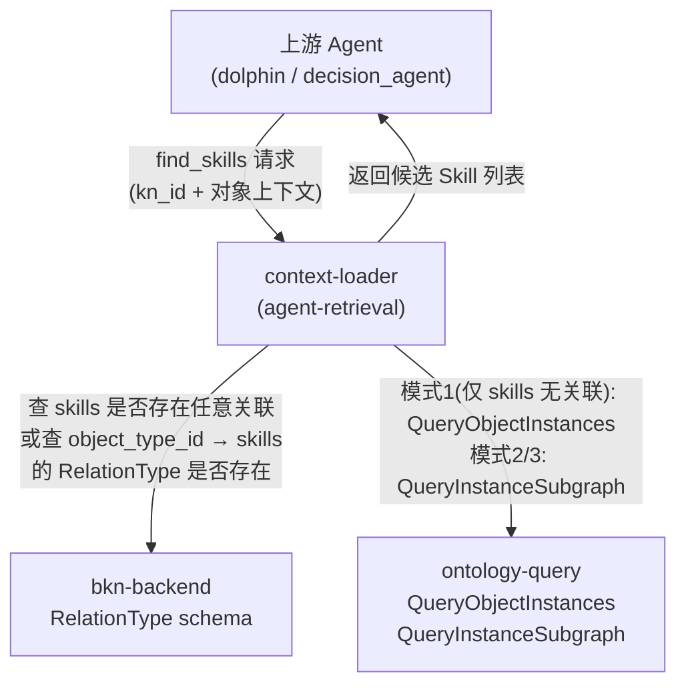
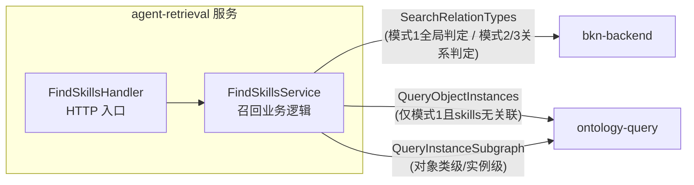
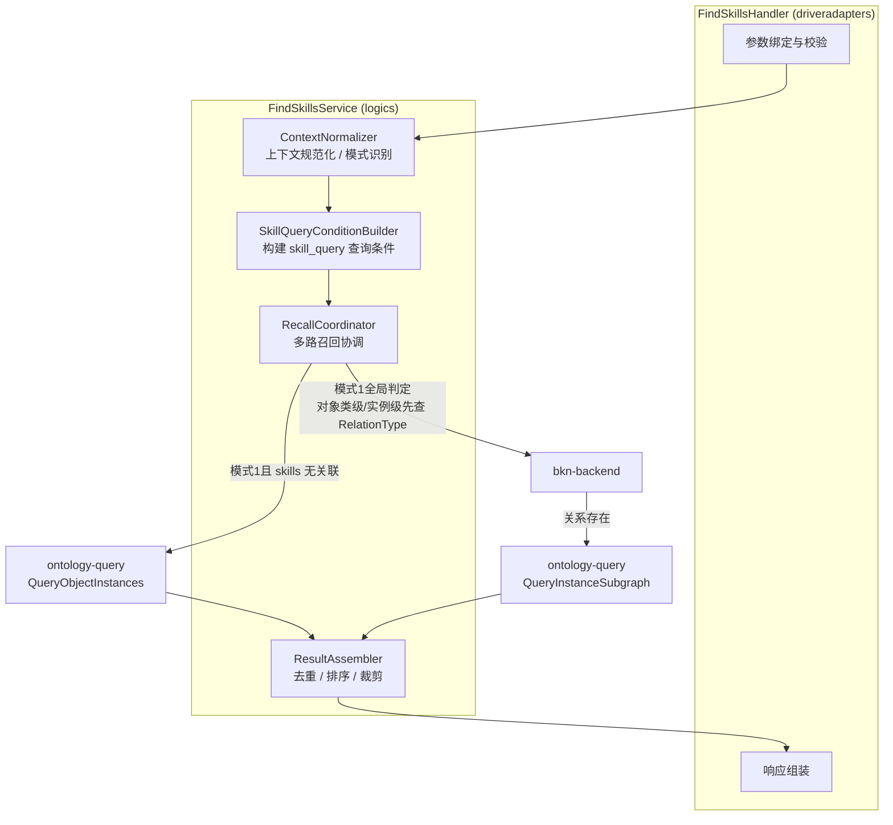
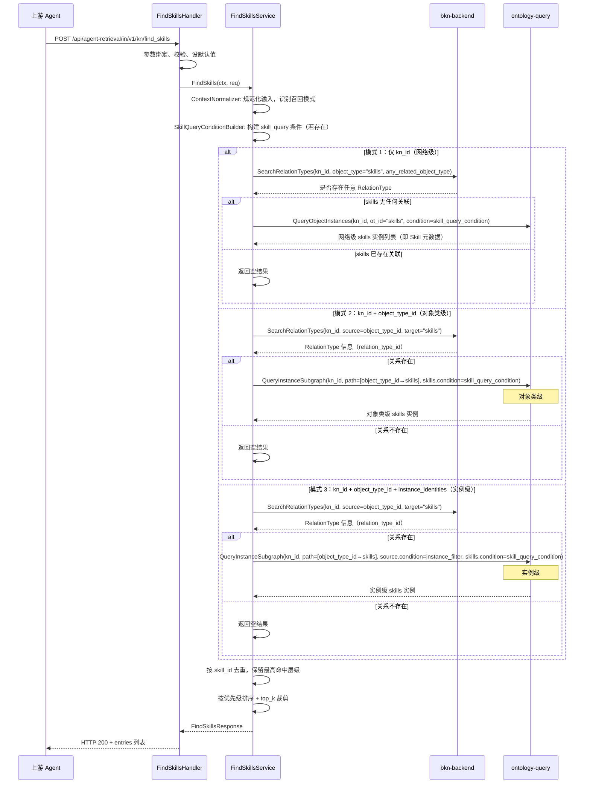
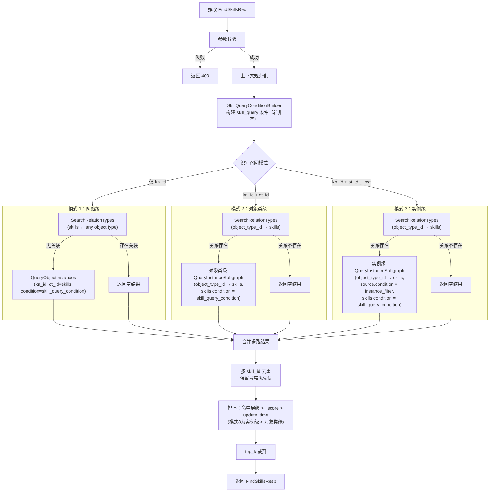
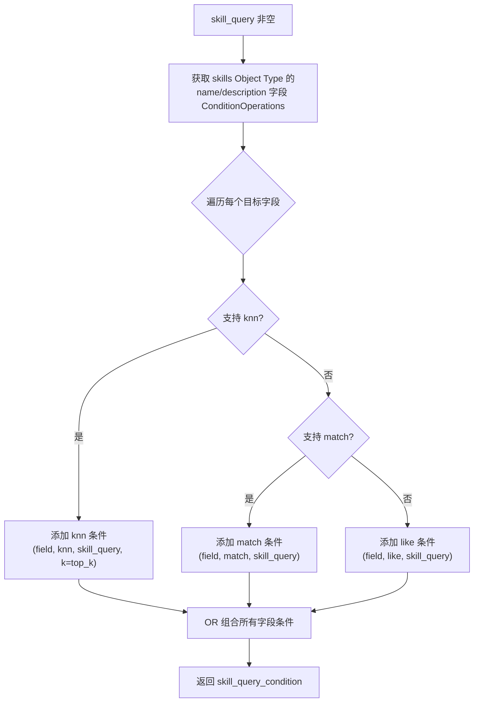

# Design Doc: ContextLoader Skill 召回

> 状态: Draft  
> 负责人: @criller  
> Reviewers: 待确认  
> 关联 PRD: ../prd/issue-109-contextloader-skill-recall-prd.md  
> 关联 Issue: #109  

---

# 1. 概述（Overview）

## 1.1 背景

- 当前现状：
  - `context-loader/agent-retrieval` 当前提供 `kn_search`、`semantic-search`、`get_action_info` 等知识网络检索与行动召回能力，但不具备 Skill 召回能力。
  - Skill 元数据由 `execution-factory` 统一管理（`t_skill_repository`），通过 BKN 中的 `skills` Object Type 共享只读视图暴露为对象实例。Skill 与业务对象的绑定关系由 `bkn` 通过 RelationType 维护。
  - 上游 Agent 在处理具体业务对象时，缺乏基于当前业务上下文自动发现适用 Skill 的机制，只能人工拼接通用 Prompt。

- 存在问题：
  - Agent 运行时没有"上下文锚点"，无法自动匹配当前业务对象应该使用哪些 Skill，导致行为一致性差、组合成本高。
  - 现有检索工具（`kn_search`、`get_action_info`）覆盖的是对象属性和行动，缺少 Skill 维度的召回入口。

- 业务 / 技术背景：
  - 本设计基于《Skill 与 BKN 业务绑定：端到端架构总览与跨模块协同方案 (RFC)》中 context-loader 的职责定义展开。
  - `context-loader` 在该方案中承担"运行时 Skill 召回器"角色，不管理 Skill 主数据，不维护绑定关系，不装载 Skill 完整内容。
  - BKN 中将内置固定的 `skills` Object Type（`object_type_id = "skills"`），该对象类的实例数据即 Skill 元数据。`context-loader` 通过 `ontology-query` 获取 Skill 元数据，不需要额外调用 `execution-factory`。

---

## 1.2 目标

- 新增 `find_skills` 内部接口，支持 Agent 在运行时基于业务上下文召回 Skill 候选。
- 支持三种召回模式，每种模式的底层查询路径不同：
  - 网络级（仅 `kn_id`）：先检查 `skills` Object Type 是否与任意其他 Object Type 存在 RelationType；仅在完全无关联时，才通过 `QueryObjectInstances` 直接查询 skills 实例
  - 对象类级（`kn_id + object_type_id`）：先查 `object_type_id` 与 `skills` 的 RelationType；仅在关系存在时，通过 `QueryInstanceSubgraph` 沿关系路径获取 skills 实例
  - 实例级（`kn_id + object_type_id + instance_identities`）：先查 `object_type_id` 与 `skills` 的 RelationType；仅在关系存在时，通过 `QueryInstanceSubgraph` 从具体实例出发获取 skills 实例
- 返回最小化 Skill 元数据（`skill_id`、`name`、`description`），不返回 Skill 完整配置包。
- 支持可选的 `skill_query`，作为 skills 实例的 `name`/`description` 字段查询条件，在各召回模式中一起下发。
- 在 `kn_schema_search`（即 `kn_search`）中默认将 `skills` Object Type 纳入 schema 召回范围。
- 保证不同知识网络之间的 Skill 召回边界隔离。
- 当前版本采用临时全局判定规则：只有当 `skills` Object Type 与其他任意 Object Type 都不存在 RelationType 时，才默认视为作用在全局网络上；一旦存在任意关联，模式 1 返回空结果，模式 2 / 模式 3 也不再降级到网络级。

---

## 1.3 非目标（Out of Scope）

- 不在本期设计 Skill 创建、删除、更新流程（归属 `execution-factory`）。
- 不在本期设计 Skill 绑定规则写入流程（归属 `bkn`）。
- 不在本期设计 Skill 完整内容装载与执行逻辑（归属 `execution-factory` + `sandbox`）。
- 不在本期引入通用资源类型统一召回框架。
- 不在本期引入复杂 selector DSL 或规则引擎。
- 不改造 `kn_search` 的核心检索逻辑，仅确保 `skills` Object Type 可被发现。

---

## 1.4 术语说明

| 术语 | 说明 |
|------|------|
| Skill | 技能包，表现为 `SKILL.md + assets` 的技能资源，由 `execution-factory` 管理 |
| BKN | 业务知识网络（Business Knowledge Network），管理对象类、关系类、行动类及业务绑定语义 |
| Skill Object Type | BKN 中固定的 `object_type_id = "skills"` 对象类，其实例数据即 Skill 元数据 |
| Skill Binding | Skill 与 BKN 业务对象之间的绑定关系，由 `bkn` 通过 RelationType 维护（`object_type_id` → `skills` 的关系） |
| 全局网络 Skill（临时规则） | 仅当 `skills` Object Type 与其他任意 Object Type 都不存在 RelationType 时，才默认视为作用在全局网络上的 Skill |
| matched_scope | 命中范围标识：`network`（网络级）、`object_type`（对象类级）、`object_selector`（实例级） |
| skill_query | 可选的 Skill 语义检索短语，作为 skills 实例查询中 `name`/`description` 的匹配条件 |
| kn_id | 知识网络 ID，所有召回请求必须限定在该网络边界内 |

---

# 2. 整体设计（HLD）

## 2.1 系统上下文（C4 - Level 1）

### 参与者
- 上游 Agent：dolphin / decision_agent，作为 `find_skills` 的调用方
- BKN Backend：提供 RelationType schema 查询（用于模式 1 的全局判定，以及确定 `object_type_id` 与 `skills` 之间是否存在绑定关系）
- Ontology Query：提供 skills 实例查询（`QueryObjectInstances`）和关系子图查询（`QueryInstanceSubgraph`）

### 系统关系



> 三种召回模式走不同的查询路径：模式 1 先检查 `skills` 是否与任意对象类存在绑定，只有在完全无关联时才走 `QueryObjectInstances`；模式 2 和模式 3 需要先确认 `object_type_id` 与 `skills` 的绑定关系存在，再走 `QueryInstanceSubgraph` 沿关系路径获取 skills 实例。

---

## 2.2 容器架构（C4 - Level 2）

`find_skills` 作为 `context-loader/agent-retrieval` 的新工具接入，复用现有服务容器，不新增独立部署单元。

| 容器 | 技术栈 | 职责 |
|------|--------|------|
| agent-retrieval | Go / Gin | 对外暴露 `find_skills` HTTP 接口，承载召回业务逻辑 |
| bkn-backend | 内部服务 | 提供 RelationType schema 查询（确认全局判定和绑定关系存在性） |
| ontology-query | 内部服务 | 提供 `QueryObjectInstances`（网络级）和 `QueryInstanceSubgraph`（对象类级/实例级） |

### 容器交互



---

## 2.3 组件设计（C4 - Level 3）

### agent-retrieval 内部组件

| 层级 | 组件 | 包路径 | 职责 |
|------|------|--------|------|
| Driver Adapter | `FindSkillsHandler` | `driveradapters/knfindskills/` | HTTP 入口，参数绑定、校验、响应组装 |
| Logic | `FindSkillsService` | `logics/knfindskills/` | 召回协调：上下文规范化、条件构建、多路召回、去重合并、排序裁剪 |
| Driven Adapter | `OntologyQuery` (复用) | `drivenadapters/` | 复用现有 `ontologyQueryClient`，调用实例查询和子图查询 |
| Driven Adapter | `BknBackendAccess` (复用) | `drivenadapters/` | 复用现有 BKN 查询能力，获取 RelationType 信息 |
| Interface | 新增接口定义 | `interfaces/` | 新增 `FindSkillsReq`、`FindSkillsResp` 等结构体 |

#### 内部逻辑分层



---

## 2.4 数据流（Data Flow）

### 主流程：find_skills 请求处理



---

## 2.5 关键设计决策（Design Decisions）

| 决策 | 选项 | 选定方案 | 原因 |
|------|------|----------|------|
| 网络级召回路径 | A. QueryInstanceSubgraph / B. QueryObjectInstances 直接查 skills 实例 | B | 模式1仅在 `skills` 无任何关联时成立，此时不涉及关系遍历，直接查 skills Object Type 实例即可 |
| 对象类级/实例级召回路径 | A. QueryObjectInstances / B. 先查 RelationType 再走 QueryInstanceSubgraph | B | 必须确认 `object_type_id` 与 `skills` 之间存在 RelationType，再沿关系路径查询绑定的 skills 实例 |
| skill_query 处理方式 | A. 后处理过滤 / B. 作为查询条件下发 | B | 网络级：作为 `QueryObjectInstances` 的 `condition`；对象类级/实例级：作为 `QueryInstanceSubgraph` 中 skills 节点的 `ObjectTypeOnPath.condition` |
| skill_query 条件类型选择 | A. 固定使用 match / B. 根据字段 ConditionOperations 动态选择 | B | 检查 `name`/`description` 字段支持的操作符，优先 `knn` > `match` > `like` |
| Skill Object Type 识别 | A. 按名称 / B. 按 tags / C. 按固定 `object_type_id` | C | `object_type_id = "skills"` 为本期唯一运行时识别键 |
| 全局网络判定 | A. 默认所有 Skill 都可网络级召回 / B. 仅当 `skills` 无任何 RelationType 时视为全局网络 | B | 当前无法准确判断单个 Skill 是否具备全局语义，因此采用保守的临时规则 |
| 多路召回并发策略 | A. 串行 / B. 按模式并发 | A（当前阶段） | 模式2只走对象类级单路；模式3只走实例级单路（当前关系类配置功能调整期，暂不同时召回对象类级） |
| 去重策略 | A. 返回所有命中记录 / B. 按 skill_id 去重保留最高优先级 | B | 同一 Skill 被多路命中时只保留一份，内部命中层级取最高优先级，对外响应不暴露 `matched_scope` |

---

## 2.6 部署架构（Deployment）

- 部署环境：复用 `agent-retrieval` 现有 K8s 部署，不新增容器或 Pod。
- Helm 配置：无需新增配置项（`bkn_backend`、`ontology_query` 连接配置已存在）。
- 新增路由：在 `restPrivateHandler.RegisterRouter` 中增加 `POST /kn/find_skills`。

---

## 2.7 非功能设计

### 性能
- 模式1会先做一次轻量级 RelationType 存在性检查；仅当 `skills` 无任何关联时才调用 `QueryObjectInstances`。
- 对象类级/实例级先查 `RelationType`（轻量 schema 查询），再走 `QueryInstanceSubgraph`（单次调用包含关系遍历和实例过滤）。
- 模式2只有单路 `QueryInstanceSubgraph`；模式3只走实例级单路 `QueryInstanceSubgraph`。
- skill_query 条件在查询阶段完成过滤，避免拉取全量数据再做后处理。
- `top_k` 默认 10，最大 20，限制返回体积。

### 可用性
- ontology-query 不可达时，`find_skills` 返回 502 错误，不降级为全局搜索。
- 模式3为实例级单路召回，失败时返回错误。
- 模式1若发现 `skills` 存在任意关联，直接返回空结果，不再执行网络级召回。
- 模式2/模式3在 RelationType 不存在时返回空结果，不报错、不降级。

### 安全
- `find_skills` 注册在内网路由 `/api/agent-retrieval/in/v1/kn/find_skills`，通过 Header 身份认证中间件保护。
- 所有召回结果限定在请求方传入的 `kn_id` 范围内，不跨网络泄漏。

### 可观测性
- tracing：主流程创建独立 span `find_skills`；RelationType 查询和每路 ontology-query 调用各创建子 span。
- logging：入口记录请求参数，出口记录返回 Skill 数量和耗时，异常路径记录完整错误。
- metrics：记录 `find_skills` 请求总数、延迟分布、各路 ontology-query 调用成功/失败计数。

---

# 3. 详细设计（LLD）

## 3.1 API 设计

### find_skills

**Endpoint:** `POST /api/agent-retrieval/in/v1/kn/find_skills`

**Headers:**

| Header | 是否必填 | 说明 |
|--------|----------|------|
| `x-account-id` | 否 | 账户 ID |
| `x-account-type` | 否 | 账户类型：`user` / `app` / `anonymous` |

**Request:**

```json
{
  "kn_id": "kn_contract",
  "object_type_id": "contract",
  "instance_identities": [
    { "contract_id": "C-2026-001" }
  ],
  "skill_query": "对赌协议回购条款审查",
  "top_k": 10
}
```

| 字段 | 类型 | 是否必填 | 默认值 | 说明 |
|------|------|----------|--------|------|
| `kn_id` | string | 是 | - | 当前业务知识网络 ID |
| `object_type_id` | string | 否 | - | 当前处理的对象类型 ID |
| `instance_identities` | array[object] | 否 | - | 当前处理的对象实例标识列表 |
| `skill_query` | string | 否 | - | Skill 语义检索短语（非用户原始问题全文） |
| `top_k` | integer | 否 | 10 | 最多返回结果数，范围 1-20 |

**Response (200):**

```json
{
  "entries": [
    {
      "skill_id": "skill_contract_review",
      "name": "合同审查",
      "description": "针对合同对象进行通用与专项审查"
    }
  ]
}
```

| 字段 | 类型 | 说明 |
|------|------|------|
| `entries` | array | 候选 Skill 列表 |
| `entries[].skill_id` | string | Skill 唯一标识 |
| `entries[].name` | string | Skill 名称 |
| `entries[].description` | string | Skill 描述摘要 |

**Error Responses:**

| HTTP Code | 错误码 | 触发条件 |
|-----------|--------|----------|
| 400 | `INVALID_REQUEST` | `kn_id` 缺失、`instance_identities` 存在但 `object_type_id` 缺失 |
| 502 | `UPSTREAM_UNAVAILABLE` | ontology-query 服务不可达 |
| 500 | `INTERNAL_ERROR` | 内部处理异常 |

---

## 3.2 数据模型

### FindSkillsRequest

```go
type FindSkillsReq struct {
    AccountID  string `header:"x-account-id"`
    AccountType string `header:"x-account-type"`

    KnID               string                   `json:"kn_id" validate:"required"`
    ObjectTypeID       string                   `json:"object_type_id"`
    InstanceIdentities []map[string]interface{} `json:"instance_identities"`
    SkillQuery         string                   `json:"skill_query"`
    TopK               int                      `json:"top_k" default:"10" validate:"min=1,max=20"`
}
```

### FindSkillsResponse

```go
type FindSkillsResp struct {
    Entries []*SkillItem `json:"entries"`
}

type SkillItem struct {
    SkillID     string `json:"skill_id"`
    Name        string `json:"name"`
    Description string `json:"description,omitempty"`
}
```

### 内部中间结构

```go
type RecallMode int

const (
    RecallModeNetwork    RecallMode = 1  // 仅 kn_id
    RecallModeObjectType RecallMode = 2  // kn_id + object_type_id
    RecallModeInstance   RecallMode = 3  // kn_id + object_type_id + instance_identities
)

type SkillMatch struct {
    SkillID      string
    Name         string
    Description  string
    MatchedScope string     // "network" / "object_type" / "object_selector"
    Priority     int        // 100=实例级, 50=对象类级, 10=网络级(仅模式1)
    Score        float64    // ontology-query 返回的 _score
    Reason       string
}
```

---

## 3.3 存储设计

`find_skills` 本身不引入新的存储。数据读取路径如下：

| 数据 | 存储位置 | 访问方式 | 涉及的召回模式 |
|------|----------|----------|----------------|
| RelationType schema | BKN 内部 | `BknBackendAccess.SearchRelationTypes` | 网络级、对象类级、实例级 |
| Skills 实例（即 Skill 元数据） | `skills` Object Type 的共享只读视图 | `OntologyQuery.QueryObjectInstances` | 网络级（仅 `skills` 完全无关联时） |
| Skills 实例（通过关系路径） | `skills` Object Type 的共享只读视图 | `OntologyQuery.QueryInstanceSubgraph` | 对象类级、实例级 |

---

## 3.4 核心流程（详细）

### find_skills 完整处理流程



### 三种召回路径的详细查询语义

#### 路径 A：网络级 — QueryObjectInstances

仅在 `skills` Object Type 与其他任意 Object Type 都不存在 RelationType 时，才允许在 `kn_id` 下直接查询 `skills` Object Type 的全部实例。不涉及关系遍历。

**Step 0：查全局适用前提**

```
SearchRelationTypes(kn_id, condition: "skills" 与任意其他 Object Type 存在 RelationType)
```

若存在任意关系，则路径 A 不执行，模式 1 直接返回空结果。

```
QueryObjectInstances(
    kn_id  = req.kn_id,
    ot_id  = "skills",
    condition = skill_query_condition（若存在）,
    limit  = top_k,
    properties = ["skill_id", "name", "description"]
)
```

- 无 `skill_query` 时：无 `condition`，返回该 KN 内所有 skills 实例。
- 有 `skill_query` 时：`condition` 为 `name`/`description` 的 match/knn/like 条件。

#### 路径 B：对象类级 — SearchRelationTypes + QueryInstanceSubgraph

先确认 `object_type_id` 与 `skills` 之间存在 RelationType，再沿关系路径查询绑定的 skills 实例。

**Step 1：查 RelationType**

```
SearchRelationTypes(kn_id, condition: source_object_type_id == object_type_id AND target_object_type_id == "skills")
```

若不存在关系，则该路返回空结果。

**Step 2：QueryInstanceSubgraph**

```json
{
  "relation_type_paths": [{
    "object_types": [
      { "id": "contract" },
      { "id": "skills", "condition": skill_query_condition, "limit": top_k }
    ],
    "relation_types": [{
      "relation_type_id": "rt_contract_skills",
      "source_object_type_id": "contract",
      "target_object_type_id": "skills"
    }]
  }]
}
```

子图查询沿 `object_type_id → skills` 的关系路径遍历，`skills` 节点上的 `condition` 承载 `skill_query` 过滤条件。

#### 路径 C：实例级 — SearchRelationTypes + QueryInstanceSubgraph（带实例过滤）

与路径 B 类似，但在起点对象类上增加 `instance_identities` 过滤条件，只从指定实例出发遍历。

**Step 1**：同路径 B，查 RelationType。

**Step 2：QueryInstanceSubgraph**

```json
{
  "relation_type_paths": [{
    "object_types": [
      {
        "id": "contract",
        "condition": {
          "operation": "in",
          "field": "contract_id",
          "value": ["C-2026-001"],
          "value_from": "const"
        }
      },
      { "id": "skills", "condition": skill_query_condition, "limit": top_k }
    ],
    "relation_types": [{
      "relation_type_id": "rt_contract_skills",
      "source_object_type_id": "contract",
      "target_object_type_id": "skills"
    }]
  }]
}
```

起点 `object_type_id` 节点增加 `instance_identities` 转换后的过滤条件，只从匹配的实例出发遍历到 skills。

### skill_query 条件构建逻辑

`skill_query` 非空时，根据 `skills` Object Type 的 `name`/`description` 字段的 `ConditionOperations` 动态选择查询条件类型。

条件选择优先级：`knn` > `match` > `like`



构建出的 `skill_query_condition` 会被注入到：
- 网络级（仅模式1且 `skills` 无关联）：`QueryObjectInstances` 的 `condition` 字段
- 对象类级/实例级：`QueryInstanceSubgraph` 中 `skills` 节点的 `ObjectTypeOnPath.condition`

---

## 3.5 关键逻辑设计

### ContextNormalizer

- 校验 `kn_id` 非空。
- 如果 `instance_identities` 非空但 `object_type_id` 为空，返回 400 错误。
- 根据参数完整度识别 `RecallMode`：
  - 仅 `kn_id` → `RecallModeNetwork`
  - `kn_id` + `object_type_id` → `RecallModeObjectType`
  - `kn_id` + `object_type_id` + `instance_identities` → `RecallModeInstance`

### SkillQueryConditionBuilder

复用 `semantic_searchable_fields.go` 的字段检测模式。

```go
func BuildSkillQueryCondition(skillQuery string, skillsObjType *interfaces.ObjectType, topK int) *interfaces.KnCondition
```

1. 从 `skills` Object Type 的 DataProperties 中筛选 `name` 和 `description` 字段。
2. 检查每个字段的 `ConditionOperations`，按 `knn > match > like` 优先级选择。
3. 将所有字段条件通过 `OR` 组合为一个复合条件。
4. 若无可用条件，返回 `nil`。

### RecallCoordinator

根据 `RecallMode` 走不同的召回路径：

**网络级：**
- 先调用 `BknBackendAccess.SearchRelationTypes` 检查 `skills` Object Type 是否与任意其他 Object Type 存在 RelationType。
- 若存在任意关联，直接返回空结果，不执行网络级召回。
- 仅当 `skills` 完全无关联时，调用 `OntologyQuery.QueryObjectInstances(kn_id, "skills", skill_query_condition)`。
- 从返回的实例数据中提取 `SkillMatch`，标记 `MatchedScope = "network"`。

**对象类级：**
1. 调用 `BknBackendAccess.SearchRelationTypes` 查询 `object_type_id → "skills"` 的 RelationType。
2. 若关系存在，仅执行对象类级：`QueryInstanceSubgraph`，构建 `RelationTypePath`。
3. 若关系不存在，返回空结果。

**实例级：**
1. 同对象类级 Step 1。
2. 若关系存在，执行实例级 `QueryInstanceSubgraph`（起点增加 `instance_identities` 过滤条件）。
3. 若关系不存在，返回空结果。

### SubgraphRequestBuilder

负责将召回参数转换为 `QueryInstanceSubgraphReq`：

```go
func BuildSubgraphRequest(
    knID string,
    objectTypeID string,
    relationType *interfaces.RelationType,       // 包含方向信息
    instanceCondition *interfaces.KnCondition,   // 实例级时非 nil
    skillQueryCondition *interfaces.KnCondition, // skill_query 条件
    topK int,
) *interfaces.QueryInstanceSubgraphReq
```

**方向处理逻辑**：`RelationType` 中的 `SourceObjectTypeID` 和 `TargetObjectTypeID` 决定了关系方向，`SubgraphRequestBuilder` 据此自动构建正确的 `TypeEdge` 和 `object_types` 顺序：

```go
isForward := relationType.SourceObjectTypeID == objectTypeID &&
             relationType.TargetObjectTypeID == skillsObjectTypeID

var sourceOTID, targetOTID string
if isForward {
    sourceOTID = objectTypeID
    targetOTID = skillsObjectTypeID
} else {
    sourceOTID = skillsObjectTypeID
    targetOTID = objectTypeID
}
```

构建 `RelationTypePath` 结构（以正向为例）：
- `object_types[0]`：起点对象类（`id = objectTypeID`，实例级时设置 `condition = instanceCondition`）
- `object_types[1]`：`skills` 对象类（`id = "skills"`，设置 `condition = skillQueryCondition`，`limit = topK`）
- `relation_types[0]`：`TypeEdge`（`relation_type_id`、`source_object_type_id = sourceOTID`、`target_object_type_id = targetOTID`）

反向时 `object_types` 顺序和 `TypeEdge` 的 `source`/`target` 自动翻转，调用方无需关心。

### ResultAssembler

```go
func Assemble(matches []SkillMatch, topK int) *FindSkillsResp
```

- 按 `skill_id` 分组，每组取 `Priority` 最高的 `MatchedScope`。
- 排序规则：
  1. 主排序：`Priority` 降序（实例级 100、对象类级 50、网络级 10）
  2. 次排序：`Score` 降序（ontology-query 返回的 `_score`）
  3. 兜底排序：`update_time` 降序
- 截取前 `top_k` 条。
- 对外响应仅填充 `skill_id`、`name`、`description`；`MatchedScope` / `Reason` 仅作为内部排序、去重和观测辅助信息。

---

## 3.6 错误处理

| 错误场景 | 错误码 | HTTP Code | 处理方式 |
|----------|--------|-----------|----------|
| `kn_id` 缺失 | `INVALID_REQUEST` | 400 | 前置校验拦截 |
| `instance_identities` 有值但 `object_type_id` 缺失 | `INVALID_REQUEST` | 400 | 前置校验拦截 |
| ontology-query 不可达 | `UPSTREAM_UNAVAILABLE` | 502 | 记录错误，不降级为全局搜索 |
| ontology-query 返回非 2xx | `UPSTREAM_ERROR` | 502 | 透传上游错误码和描述 |
| 模式1下发现 `skills` 与任意其他 Object Type 存在 RelationType | - | 200 | 直接返回空结果，不执行网络级召回 |
| `object_type_id` 与 `skills` 之间不存在 RelationType | - | 200 | 模式2/模式3返回空结果，不降级到网络级 |
| 模式3实例级召回失败 | `UPSTREAM_ERROR` | 502 | 记录错误，返回上游错误 |
| 无命中结果 | - | 200 | 正常返回空 `entries` 列表 |

---

## 3.7 配置设计

| 配置项 | 默认值 | 说明 |
|--------|--------|------|
| `find_skills.default_top_k` | 10 | 默认返回 Skill 数量 |
| `find_skills.max_top_k` | 20 | 允许的最大 top_k |
| `find_skills.recall_timeout_ms` | 5000 | 单路召回超时时间（毫秒） |
| `find_skills.total_timeout_ms` | 10000 | 整体请求超时时间（毫秒） |
| `find_skills.skills_object_type_id` | `"skills"` | Skill Object Type 的固定识别 ID |

配置项在 `config.Config` 中新增 `FindSkills` 结构体：

```go
type FindSkillsConfig struct {
    DefaultTopK        int    `yaml:"default_top_k" default:"10"`
    MaxTopK            int    `yaml:"max_top_k" default:"20"`
    RecallTimeoutMs    int    `yaml:"recall_timeout_ms" default:"5000"`
    TotalTimeoutMs     int    `yaml:"total_timeout_ms" default:"10000"`
    SkillsObjectTypeID string `yaml:"skills_object_type_id" default:"skills"`
}
```

---

## 3.8 可观测性实现

### Tracing

| Span 名称 | 位置 | 标签 |
|-----------|------|------|
| `find_skills` | `FindSkillsService.FindSkills` 入口 | `kn_id`, `recall_mode`, `has_skill_query` |
| `find_skills.search_relation_type` | RelationType 查询 | `kn_id`, `object_type_id`, `relation_found` |
| `find_skills.recall.network` | 网络级召回 (仅模式1且 `skills` 无关联时的 QueryObjectInstances) | `kn_id` |
| `find_skills.recall.object_type` | 对象类级召回 (QueryInstanceSubgraph) | `kn_id`, `object_type_id`, `relation_type_id` |
| `find_skills.recall.instance` | 实例级召回 (QueryInstanceSubgraph) | `kn_id`, `object_type_id`, `instance_count` |

### Metrics

| 指标 | 类型 | 标签 |
|------|------|------|
| `find_skills_requests_total` | Counter | `status` (success/error) |
| `find_skills_duration_ms` | Histogram | `recall_mode` |
| `find_skills_recall_count` | Histogram | `matched_scope` |
| `find_skills_oq_call_duration_ms` | Histogram | `call_type` (query_instances/subgraph) |

### Logging

- INFO：请求入口记录 `kn_id`、`recall_mode`；请求出口记录返回 Skill 数量和总耗时。
- WARN：模式2/模式3下 RelationType 不存在（返回空结果）。
- ERROR：ontology-query 不可达、内部异常。

---

# 4. 风险与权衡（Risks & Trade-offs）

| 风险 | 影响 | 解决方案 |
|------|------|----------|
| BKN 尚未实现 `skills` Object Type 和绑定 RelationType | `find_skills` 无法完成端到端测试 | 与 BKN 团队对齐落地时序；本期 `context-loader` 侧可先用 Mock 联调 |
| 共享只读 Skill 元数据视图的数据同步延迟 | 新发布的 Skill 短时间内可能搜索不到 | 同步由 `execution-factory` 负责，`context-loader` 不感知；标注为已知局限 |
| `skill_query` 条件类型依赖 skills 字段的 ConditionOperations | 若 `name`/`description` 不支持 `knn` 也不支持 `match`，退化为 `like` | 降级路径已在 `SkillQueryConditionBuilder` 中处理：`knn` > `match` > `like` |
| RelationType 方向不确定 | 绑定关系可能是 `object_type → skills`（正向）也可能是 `skills → object_type`（反向） | `SearchRelationTypes` 返回的 `RelationType` 已包含 `source_object_type_id` / `target_object_type_id`；`SubgraphRequestBuilder` 根据这两个字段判断方向，自动生成正确的 `TypeEdge` 和 `object_types` 顺序，无需硬编码方向假设 |
| 当前“无关联即全局网络”只是临时规则 | 一旦未来出现“部分 Skill 绑定对象类、部分 Skill 全局可用”的混合场景，模式1会误伤全局 Skill | 后续引入显式作用域字段（如 `scope=global`）替代推断 |
| 模式3实例级召回超时 | 请求超时 | `total_timeout_ms` 兜底 |

---

# 5. 测试策略（Testing Strategy）

### 单元测试

| 测试目标 | 覆盖范围 |
|----------|----------|
| `ContextNormalizer` | 三种模式识别、参数校验边界 |
| `SkillQueryConditionBuilder` | knn/match/like 条件选择、多字段 OR 组合、skill_query 为空时返回 nil |
| `SubgraphRequestBuilder` | RelationTypePath 结构正确性、实例过滤条件注入、skill_query 条件注入到 skills 节点 |
| `RecallCoordinator` | 模式1全局判定、对象类级两步查、模式2/3关系不存在返回空、模式3实例级单路召回 |
| `ResultAssembler` | 去重逻辑、优先级排序、top_k 裁剪、空结果 |
| `FindSkillsHandler` | 参数绑定、错误响应格式 |

### 集成测试

| 测试场景 | 验证点 |
|----------|--------|
| 仅传 `kn_id` 且 `skills` 无任何关联 | SearchRelationTypes + QueryObjectInstances 被调用，返回网络级 Skill |
| 仅传 `kn_id` 且 `skills` 存在任意关联 | SearchRelationTypes 被调用，直接返回空结果 |
| 传 `kn_id + object_type_id`，关系存在 | SearchRelationTypes + QueryInstanceSubgraph 被调用，仅返回对象类级 Skill |
| 传 `kn_id + object_type_id`，关系不存在 | 返回空结果，不降级到网络级 |
| 传完整三级参数且关系存在 | 仅实例级召回，返回实例绑定的 Skill |
| 传完整三级参数且关系不存在 | 返回空结果 |
| 同一 Skill 被多路命中 | 结果中只出现一次 |
| 传 `skill_query`（description 支持 knn） | skills 节点 condition 包含 knn 条件 |
| 传 `skill_query`（description 仅支持 match） | skills 节点 condition 包含 match 条件 |
| 传 `skill_query`（字段不支持 knn/match） | skills 节点 condition 包含 like 条件 |
| ontology-query 不可达 | 返回 502 |
| 不同 kn_id 隔离 | KN-A 的 Skill 不出现在 KN-B 结果中 |

### 压测

- 目标：P99 < 500ms（模式3实例级召回场景下）。
- 基准：RelationType 查询 P99 < 50ms，单次 ontology-query 调用 P99 < 200ms。

---

# 6. 发布与回滚（Release Plan）

### 发布步骤

1. 确认 BKN 侧 `skills` Object Type 和绑定 RelationType 已就绪（或 Mock 就绪）。
2. 合并 `find_skills` 相关代码（Handler、Service、ConditionBuilder、SubgraphRequestBuilder、Interface）。
3. 更新 `agent-retrieval.yaml` 配置文件，添加 `find_skills` 配置块。
4. 更新 OpenAPI 文档（`docs/apis/api_private/find_skills.yaml`）。
5. 执行集成测试，验证三种召回路径和边界隔离。
6. 灰度发布到 staging 环境，验证与 ontology-query 的端到端链路。
7. 正式发布。

### 回滚方案

- `find_skills` 是新增接口，不影响现有功能。回滚方式为：回退部署版本即可。
- 若仅需下线 `find_skills` 而保留其他更新，可通过移除路由注册行实现。

---

# 7. 附录（Appendix）

## 相关文档
- PRD: ../prd/issue-109-contextloader-skill-recall-prd.md
- RFC: Skill 与 BKN 业务绑定：端到端架构总览与跨模块协同方案
- API Spec: ../../docs/apis/api_private/find_skills.yaml
- Subgraph Query Spec: ../../docs/apis/api_private/query_instance_subgraph.yaml

## kn_search 中纳入 skills Object Type

`kn_search`（对应 `kn_schema_search`）需默认将 `object_type_id = "skills"` 纳入 schema 检索范围。具体改动点：

1. 在 `knsearch.localSearchImpl.Search` 中，确保 `SearchObjectTypes` 的查询条件不排除 `skills` Object Type。
2. 当前 `SearchObjectTypes` 查询未做 Object Type 过滤（查询全量），已天然包含 `skills`，只需验证 BKN 侧 `skills` Object Type 建立后能正常被检索到。
3. 如果后续需要对 `skills` 做特殊标注或排序提升，在 `ResultAssembler` 中增加对 `object_type_id == "skills"` 的识别即可。

## 代码变更文件清单

| 文件 | 变更类型 | 说明 |
|------|----------|------|
| `server/interfaces/find_skills.go` | 新增 | `FindSkillsReq`、`FindSkillsResp`、`SkillItem`、`SkillMatch` 等结构体 |
| `server/logics/knfindskills/index.go` | 新增 | `FindSkillsService` 主逻辑 |
| `server/logics/knfindskills/context_normalizer.go` | 新增 | 上下文规范化与模式识别 |
| `server/logics/knfindskills/skill_query_condition_builder.go` | 新增 | skill_query 条件构建 |
| `server/logics/knfindskills/recall_coordinator.go` | 新增 | 多路召回协调（含 RelationType 查询和 ontology-query 调用） |
| `server/logics/knfindskills/subgraph_request_builder.go` | 新增 | 构建 `QueryInstanceSubgraphReq` |
| `server/logics/knfindskills/result_assembler.go` | 新增 | 去重、排序、裁剪 |
| `server/driveradapters/knfindskills/index.go` | 新增 | HTTP Handler |
| `server/driveradapters/rest_private_handler.go` | 修改 | 注册 `find_skills` 路由 |
| `server/infra/config/config.go` | 修改 | 新增 `FindSkillsConfig` |
| `server/infra/config/agent-retrieval.yaml` | 修改 | 添加 `find_skills` 配置块 |

## 验收清单

### 功能验收

1. 仅传 `kn_id` 时，会先判断 `skills` 是否与任意其他 Object Type 存在 RelationType。
2. 仅传 `kn_id` 且 `skills` 存在任意关联时，返回空结果。
3. 仅传 `kn_id` 且 `skills` 完全无关联时，走 `QueryObjectInstances`，返回网络级 Skill。
4. 传 `object_type_id` 且关系存在时，走 `SearchRelationTypes` + `QueryInstanceSubgraph`，仅返回对象类级 Skill。
5. 传 `object_type_id` 但关系不存在时，返回空结果，不降级为网络级。
6. 传实例标识且关系存在时，仅执行实例级单路召回，返回实例绑定的 Skill。
7. 同一 Skill 被多条绑定命中时，结果只返回一次。
8. 传 `skill_query` 时，条件注入到 `QueryObjectInstances.condition`（仅模式1满足前提时）或 `ObjectTypeOnPath.condition`。
9. `kn_search` 默认可以发现 `skills` Object Type。

### 边界验收

1. 不会返回未绑定到当前 KN 的 Skill。
2. 运行时仅依赖 `object_type_id = "skills"` 做识别。
3. 不在 `context-loader` 内直接维护 binding 写入逻辑。
4. 不在 `context-loader` 内直接装载 Skill 完整配置包。
5. 不通过 `execution-factory` 获取 Skill 元数据。

## 失败条件

如果出现以下任一情况，说明方案落地偏离预期：

1. `context-loader` 通过全局 Skill 搜索替代绑定语义召回。
2. `skill_query` 可以绕过当前知识网络边界召回未绑定 Skill。
3. `skills` Object Type 的识别未固定到 `object_type_id = "skills"`。
4. `Skill Object Type` 混入 binding 关系数据。
5. 同一个 Skill 多条命中后重复出现在最终结果中。
6. 返回结果暴露过多与 Agent 挂载无关的字段。
7. `context-loader` 被迫理解 binding dataset 的底层结构细节。
8. `skill_query` 作为后处理步骤而非查询条件下发。
9. Skill 元数据通过 execution-factory 而非 ontology-query 获取。
10. 对象类级/实例级召回未先确认 RelationType 存在性就发起子图查询。
11. 模式2/模式3仍保留网络级召回或网络级兜底。
12. 文档未明确写出“只有 `skills` 无任何关联时才默认视为全局网络”的临时规则。
