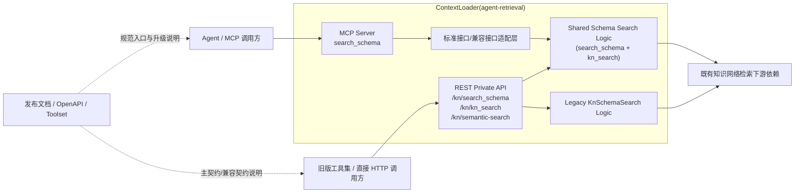
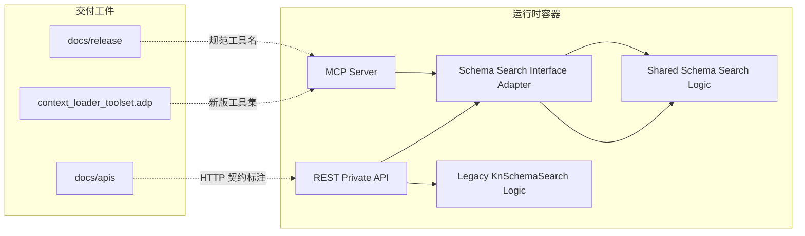
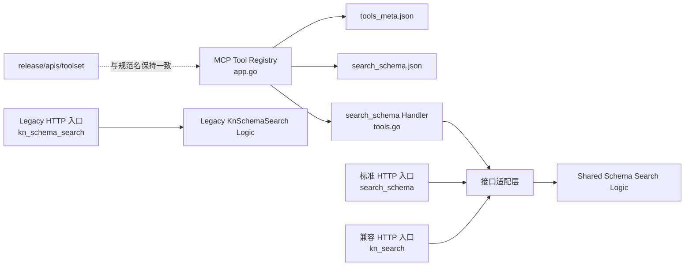
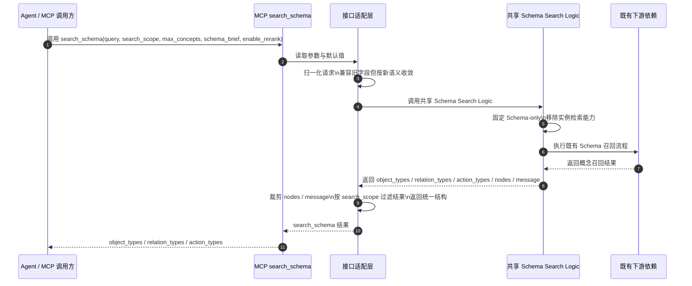
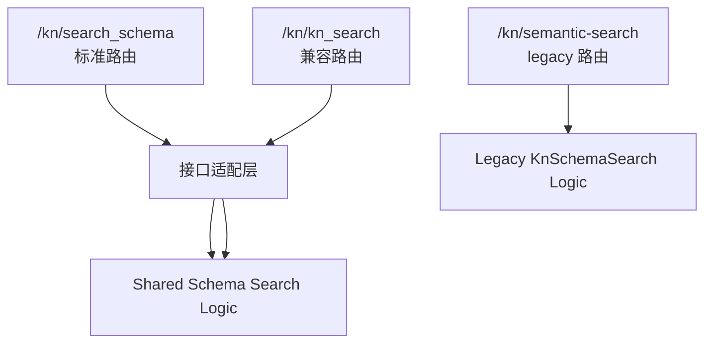
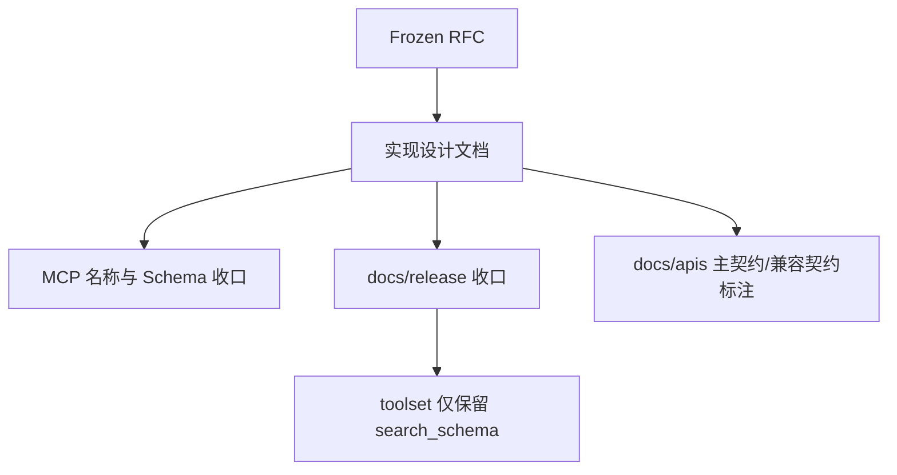

# 🏗️ Design Doc: ContextLoader Schema Search 入口统一

> 状态: Draft  
> 负责人: @criller  
> Reviewers: 待确认  
> 关联 PRD: ../prd/issue-189-contextloader-schema-search-entry-unification-rfc.md  

---

# 📌 1. 概述（Overview）

## 1.1 背景

当前 Schema Search 相关能力同时存在多种入口和多种表达方式。

在 MCP / Agent 层，当前同时暴露了 `kn_search` 和 `kn_schema_search` 两个工具。  
在 HTTP 层，当前同时存在：

- `POST /api/agent-retrieval/in/v1/kn/kn_search`
- `POST /api/agent-retrieval/in/v1/kn/semantic-search`

这几条入口都与“根据 query 探索对象类、关系类、动作类”有关，但它们并不完全等价：

- `kn_search` 的返回结构更适合下游工具继续使用，但历史上混入了实例检索相关语义。
- `kn_schema_search` 的输入更接近简单的 Schema 探索语义，但输出仍是旧的 `concepts[]` 结构。

这导致当前系统存在三个直接问题：

- Agent 侧需要先判断该用 `kn_search` 还是 `kn_schema_search`，工具选择成本高。
- Schema 探索和实例检索边界不清晰，`kn_search` 的历史能力容易让调用方误解它仍然承担实例检索职责。
- 文档、OpenAPI 和工具集发布物没有形成统一分层，用户难以理解哪个是新标准入口，哪个是兼容入口，哪个只是 legacy 入口。

本次设计基于以下前提展开：

- `search_schema` 将作为新的标准接口描述和标准 route 引入：
  - `POST /api/agent-retrieval/in/v1/kn/search_schema`
- `search_schema` 与 `kn_search` 将共用一套收敛后的 shared logic。
- `kn_schema_search` 保持现状，不进入这次 shared logic 改造范围。

因此，这次设计不只是“新增一个名字”，而是要同时解决三件事：

- 定义新的标准接口：`search_schema`
- 让 `search_schema` 与 `kn_search` 在共享 logic 上完成能力收敛
- 保持 `kn_schema_search` 作为 legacy 入口继续可用

---

## 1.2 目标

- 将 `search_schema` 定义为新版本唯一的 Schema Search 接口描述，用于指导 MCP / Agent 新接入方。
- 在 MCP / Agent 层只暴露一个 Schema Search 工具：`search_schema`。
- 新增标准 HTTP route：`POST /api/agent-retrieval/in/v1/kn/search_schema`。
- 以现有 `kn_search` 为基础，抽出与 `search_schema` 共用的收敛后 shared logic。
- 在共享 Schema Search logic 层统一完成能力收敛，而不是只在新接口层做表面裁剪。
- 将 `search_schema` 的标准 V1 契约收敛为 `query`、`search_scope`、`max_concepts`、`schema_brief`、`enable_rerank`。
- 将 `search_schema` 的 V1 输出统一为 `object_types`、`relation_types`、`action_types`。
- 从 `search_schema` 中移除 `kn_search` 原有的实例检索能力。
- 从 `search_schema` 中移除通过 `only_schema=false` 返回实例结果的行为。
- 从 `search_schema` 中移除 `nodes`、`message`、`concepts[]` 等历史输出形态。
- 从 `search_schema` 的标准输入结构中移除 `retrieval_config`、`concept_retrieval`、`rerank_action` 等底层调参形态。
- 明确 `include_sample_data` 不作为 `search_schema` V1 的有效能力。
- 在 MCP 层移除旧工具名 `kn_search`、`kn_schema_search` 的继续暴露。
- 使上述能力移除对共享 logic 层生效，因此 `kn_search` 兼容入口也不再恢复实例检索能力。
- 对历史请求字段采用“兼容接收、能力收敛、统一输出”策略：旧字段不因传入而报错，但不再改变 `search_schema` 的最终功能边界。
- 保持 `kn_schema_search` 的 legacy HTTP 路径和现有行为不变，不纳入本次 shared logic 收敛范围。
- 调整 `docs/release`、`docs/apis` 与 `docs/release/toolset`，形成一致的升级与交付表达。

---

## 1.3 非目标（Out of Scope）

- 不在本期完成 `kn_schema_search` 与 `kn_search` 底层 service 的真实合并。
- 不在本期修改 `/api/agent-retrieval/in/v1/kn/kn_search` 与 `/api/agent-retrieval/in/v1/kn/semantic-search` 现有路径的入参与返回契约。
- 不在本期改造 `query_*`、`find_*`、`get_*` 的能力边界。
- 不在本期为 `search_scope` 引入 `concept_groups` 等复杂过滤语义；V1 仅围绕对象类、关系类、动作类三类开关设计。
- 不在本期处理 Schema Search 之外的工具命名重构。
- 不在本期要求 `kn_schema_search` 的 legacy 输出形态必须与 `search_schema` 完全一致。

---

## 1.4 术语说明（Optional）

| 术语 | 说明 |
|------|------|
| `search_schema` | 新版 MCP / Agent 唯一 Schema Search 规范工具名 |
| 标准 HTTP 契约 | `POST /api/agent-retrieval/in/v1/kn/search_schema` |
| 兼容 HTTP 契约 | `POST /api/agent-retrieval/in/v1/kn/kn_search` |
| Legacy HTTP 契约 | `POST /api/agent-retrieval/in/v1/kn/semantic-search` |
| `schema_brief` | 控制返回精简 Schema 还是相对完整 Schema 的产品参数 |
| `max_concepts` | 控制 Schema 候选规模上限的产品参数，对外不暴露 `top_k` |
| Legacy Toolset | 仍引用 `kn_schema_search` / `kn_search` 的旧版发布工具集 |
| 兼容接收 | 历史字段可被请求接收，但不再承诺其旧能力继续生效 |
| 能力收敛 | 通过统一输出和固定行为，将历史复合能力收敛为 Schema-only 语义 |

---

# 🏗️ 2. 整体设计（HLD）

> 本章节关注系统“怎么搭建”，不涉及具体实现细节

---

## 🌍 2.1 系统上下文（C4 - Level 1）

### 参与者
- 用户：Agent 开发者、MCP 调用方、工具集交付使用者
- 外部系统：旧版 HTTP 调用方、旧版工具集调用方
- 第三方服务：ContextLoader 既有知识网络检索下游依赖

### 系统关系



---

## 🧱 2.2 容器架构（C4 - Level 2）

| 容器 | 技术栈 | 职责 |
|------|--------|------|
| MCP Server | Go + `mcp-go` | 暴露 `search_schema` 工具，对 Agent 提供统一入口 |
| REST Private API | Go + Gin | 对外暴露 `/kn/search_schema` 标准路由、`/kn/kn_search` 兼容路由和 `/kn/semantic-search` legacy 路由 |
| Schema Search Interface Adapter | Go | 在接口层完成 `search_schema` / `kn_search` 的参数收敛、默认值填充与输出适配 |
| Shared Schema Search Logic | Go | 在逻辑层统一执行 `search_schema` / `kn_search` 的能力收敛、Schema 召回与结果归一化 |
| Legacy KnSchemaSearch Logic | Go | 维持 `kn_schema_search` 既有逻辑与输出结构 |
| Docs Artifacts | Markdown / YAML / ADP | 提供新版发布说明、OpenAPI 主契约/兼容契约标识和新版 toolset |

### 容器交互



---

## 🧩 2.3 组件设计（C4 - Level 3）

### ContextLoader Schema Search 受影响组件

| 组件 | 职责 | 改造内容 |
|------|------|----------|
| `server/driveradapters/mcp/app.go` | MCP 工具注册入口 | 移除 `kn_search` / `kn_schema_search` 的对外注册，改为注册 `search_schema` |
| `server/driveradapters/mcp/tools.go` | MCP 工具处理逻辑 | 新增或重构 `search_schema` 处理函数，负责请求归一化与调用共享 Schema Search logic |
| `server/driveradapters/mcp/schemas/tools_meta.json` | MCP 工具元信息 | 新增 `search_schema` 元信息，删除或停用旧 MCP 工具名元信息 |
| `server/driveradapters/mcp/schemas/search_schema.json` | MCP 工具输入输出 Schema | 定义 `search_schema` 的 V1 契约 |
| `server/driveradapters/rest_private_handler.go` | HTTP 路由注册 | 新增 `/kn/search_schema` 标准路由；保留 `/kn/kn_search` 与 `/kn/semantic-search` 两条旧路由 |
| Shared Schema Search Logic | 共享逻辑层 | 统一移除 `search_schema` / `kn_search` 的实例检索、固定 Schema-only、统一输出归一化 |
| Legacy KnSchemaSearch Logic | legacy 逻辑层 | 保持 `kn_schema_search` 的当前能力与输出结构 |
| `docs/release/overview.md` | 发布概览 | 切换为以 `search_schema` 为唯一主叙事 |
| `docs/release/tool-usage-guide.md` | 工具使用指南 | 合并旧的 `kn_schema_search` / `kn_search` 章节，补升级说明 |
| `docs/release/toolset/context_loader_toolset.adp` | 发布工具集 | 新版仅保留 `search_schema` |
| `docs/apis/api_private/search_schema.yaml` | 标准 HTTP 契约说明 | 定义 `search_schema` 的标准 HTTP 接口 |
| `docs/apis/api_private/kn_search.yaml` | 兼容 HTTP 契约说明 | 标识其为 `search_schema` 的兼容 HTTP 契约 |
| `docs/apis/api_private/kn_schema_search.yaml` | Legacy HTTP 契约说明 | 保持现有说明，标识其为 legacy 路由 |

### Schema Search 组件关系



---

## 🔄 2.4 数据流（Data Flow）

### 主流程



### 子流程（路由分层）



### 子流程（文档与交付）



---

## ⚖️ 2.5 关键设计决策（Design Decisions）

| 决策 | 说明 |
|------|------|
| MCP 只保留 `search_schema` | 符合 RFC 的单一规范入口目标，避免 Agent 再承担旧工具选择成本 |
| 新增标准 HTTP route `/kn/search_schema` | 让新标准接口和兼容接口边界清晰，避免继续混用旧路径表达新语义 |
| `search_schema` 与 `kn_search` 共用收敛后的 shared logic | 共享能力边界，确保移除实例检索能力对两者同时生效 |
| `kn_schema_search` 保持现状 | 避免本期同时重写两条历史链路，控制兼容风险 |
| `search_scope` 在接口适配层实现 | V1 在接口适配层完成结果过滤，降低对共享 logic 的入侵式改造范围 |
| `max_concepts` 映射现有概念召回数量配置 | 对外保留产品语义名称，内部继续复用现有能力，不暴露 `top_k` |
| 能力移除在共享 logic 层生效 | 避免 `search_schema` 与 `kn_search` 共享同一逻辑却出现语义分叉 |
| `only_schema` 固定内置 | 所有进入共享 Schema Search logic 的请求都按 Schema-only 处理，不再把实例检索开关暴露给 Agent |
| 历史字段采用“兼容接收、能力失效” | 旧字段不报错，但不会突破 `search_schema` 的 Schema-only 边界 |
| 输入宽容兼容、输出严格收敛 | 兼容历史请求写法，但统一返回 `object_types` / `relation_types` / `action_types` |
| `docs/release` 与 `docs/apis` 分层表达 | 前者讲规范工具名和升级路径，后者讲真实 HTTP 路径与主/兼容契约 |
| Legacy HTTP 继续保留 | 新版工具集升级和旧版调用链兼容可以并行推进，降低发布风险 |

---

## 🚀 2.6 部署架构（Deployment）

- 部署环境：K8s，与现有 `agent-retrieval` 服务一致
- 拓扑结构：不新增服务、不新增数据库、不新增外部依赖
- 扩展策略：沿用现有水平扩展策略；本次改造主要是 MCP 契约与文档收口
- 发布方式：随 `agent-retrieval` 一次版本发布完成二进制与文档工件同步更新

---

## 🔐 2.7 非功能设计

### 性能
- `search_schema` 运行时主链路仍复用 `KnSearch Service`，不会新增额外的下游远程调用。
- `search_scope` 过滤在接口适配层完成，仅对返回结果做轻量裁剪，对整体延迟影响较小。

### 可用性
- HTTP 主契约与兼容契约继续保留，避免单次发布打断存量调用链。
- 旧版工具集仍可通过历史 HTTP 接口运行，降低交付期切换风险。

### 安全
- MCP 侧继续沿用 `X-Kn-ID` Header 与认证上下文注入方式。
- 本次不引入新的鉴权模型，也不改变内网 HTTP 鉴权规则。

### 可观测性
- tracing：沿用现有 MCP 工具调用链路埋点
- logging：增加 `search_schema` 调用日志，记录参数默认值使用情况与结果规模摘要
- metrics：建议补充 `search_schema` 请求量、失败量、按 `search_scope` 的调用分布

---

# 🔧 3. 详细设计（LLD）

> 本章节关注“如何实现”，开发可直接参考

---

## 🌐 3.1 API 设计

### `search_schema` 标准接口契约

**Endpoint:** `POST /api/agent-retrieval/in/v1/kn/search_schema`

**Request:**

```json
{
  "query": "客户 合同 订单 之间是什么关系",
  "search_scope": {
    "include_object_types": true,
    "include_relation_types": true,
    "include_action_types": true
  },
  "max_concepts": 10,
  "schema_brief": true,
  "enable_rerank": true
}
```

**Response:**

```json
{
  "object_types": [],
  "relation_types": [],
  "action_types": []
}
```

补充说明：

- `search_schema` 同时作为 MCP 工具名和标准 HTTP 接口描述存在。
- `response_format` 继续作为 MCP 通用传输参数保留，不计入 `search_schema` 的产品参数集。
- `kn_id` 继续沿用 `X-Kn-ID` Header 优先、arguments 兜底的运行时模式，但不进入 `search_schema` 的产品参数主叙事。
- `search_schema` 返回结果中不包含 `nodes`、`message`、`concepts[]`。

### `search_schema` 兼容输入规则

`search_schema` 作为新版本接口描述，只对外主推标准 V1 参数；但运行时需要兼容历史请求字段，不因旧写法直接报错。

兼容规则如下：

| 历史字段 / 结构 | 兼容方式 | 说明 |
|------|----------|------|
| `only_schema` | 接收但忽略 | 实际行为固定为 Schema-only；传 `false` 也不返回 `nodes` |
| `retrieval_config.concept_retrieval.top_k` | 兼容映射 | 仅在顶层 `max_concepts` 未传时可映射为候选规模 |
| `retrieval_config.concept_retrieval.schema_brief` | 兼容映射 | 仅在顶层 `schema_brief` 未传时可映射 |
| `enable_rerank` | 继续保留 | 仍作为有效参数生效 |
| `rerank_action` | 接收但忽略 | 不再作为 `search_schema` 的有效控制项 |
| `retrieval_config.concept_retrieval.include_sample_data` | 接收但忽略 | V1 不纳入产品能力 |
| `semantic_instance_retrieval` 相关配置 | 接收但忽略 | 不再触发实例检索 |
| `property_filter` 相关配置 | 接收但忽略 | 不再影响 `search_schema` 返回 |

补充约束：

- 兼容接收不等于兼容旧能力。
- 历史字段即使被传入，也不能使 `search_schema` 返回实例数据或恢复旧输出形态。
- 当标准字段与历史字段同时存在时，标准字段优先。
- `/kn/kn_search` 兼容入口同样复用共享 logic，因此也不再恢复实例检索能力。
- `/kn/semantic-search` legacy 入口不使用这套共享 logic，保持现状。

### `search_schema` 统一输出规则

无论请求中是否携带历史字段，`search_schema` 的输出都统一收敛为：

- `object_types`
- `relation_types`
- `action_types`

以下历史输出不再返回：

- `nodes`
- `message`
- `concepts[]`

### HTTP / OpenAPI 表达调整

**标准 HTTP 契约:** `POST /api/agent-retrieval/in/v1/kn/search_schema`

**兼容 HTTP 契约:** `POST /api/agent-retrieval/in/v1/kn/kn_search`

**Legacy HTTP 契约:** `POST /api/agent-retrieval/in/v1/kn/semantic-search`

OpenAPI 调整要求：

- `search_schema.yaml`
  - 定义 `search_schema` 的标准 HTTP 契约
  - 作为新版文档与新接入方的主参考
- `kn_search.yaml`
  - `summary` / `description` 明确其为兼容 HTTP 契约
  - 明确其与 `search_schema` 共用收敛后的 shared logic
- `kn_schema_search.yaml`
  - 标记为 legacy endpoint
  - 说明其保持现状，不进入 shared logic 收敛范围

---

## 🗂️ 3.2 数据模型

### SearchSchemaRequest

| 字段 | 类型 | 说明 |
|------|------|------|
| `query` | `string` | 用户问题或关键词，必填 |
| `search_scope.include_object_types` | `boolean` | 是否包含对象类，默认 `true` |
| `search_scope.include_relation_types` | `boolean` | 是否包含关系类，默认 `true` |
| `search_scope.include_action_types` | `boolean` | 是否包含动作类，默认 `true` |
| `max_concepts` | `integer` | 候选规模上限，默认 `10` |
| `schema_brief` | `boolean` | 是否返回精简 Schema，默认 `true` |
| `enable_rerank` | `boolean` | 是否启用重排，默认 `true` |

设计约束：

- `search_scope` 的 V1 结构仅保留三类布尔开关。
- `concept_groups` 不进入 `search_schema` 的 V1 MCP 契约。

### SearchSchemaResponse

| 字段 | 类型 | 说明 |
|------|------|------|
| `object_types` | `array<object>` | 对象类候选列表 |
| `relation_types` | `array<object>` | 关系类候选列表 |
| `action_types` | `array<object>` | 动作类候选列表 |

设计约束：

- 返回结构始终采用分组数组，不回退到 `concepts[]`。
- `schema_brief=false` 时字段边界沿用现有 `kn_search` 的完整 Schema 返回模式，具体字段集合以实现时的 schema 文件为准。

### SearchSchemaRuntimeMapping

| 输入 / 语义 | 运行时映射 |
|------------|-----------|
| `max_concepts` | 映射到现有概念召回数量配置 |
| `schema_brief` | 映射到现有概念召回精简 Schema 配置 |
| `enable_rerank` | 映射到现有关系重排开关 |
| `search_scope` | 在接口适配层做返回结果过滤 |
| Schema-only 语义 | 固定 `only_schema=true` |

### SearchSchemaCompatibilityMatrix

| 历史能力 / 字段 | 在 `search_schema` 中的处理 |
|----------------|-----------------------------|
| `kn_search` MCP 工具名 | 下线，不再暴露 |
| `kn_schema_search` MCP 工具名 | 下线，不再暴露 |
| `/kn/search_schema` | 新增标准 HTTP 契约 |
| `kn_search` 兼容 HTTP 入口 | 保留请求兼容，但共享 logic 不再返回实例检索结果 |
| `kn_schema_search` legacy HTTP 入口 | 保持现状，不进入 shared logic 收敛 |
| `retrieval_config` | 仅兼容接收部分字段，不再作为标准输入结构 |
| `concept_retrieval` | 不再作为标准输入结构 |
| `only_schema` | 接收但忽略，行为固定为 `true` |
| `rerank_action` | 接收但忽略 |
| `include_sample_data` | 接收但忽略，V1 不生效 |
| `semantic_instance_retrieval` | 接收但忽略，实例检索能力移除 |
| `property_filter` | 接收但忽略 |
| `nodes` | 输出移除 |
| `message` | 输出移除 |
| `concepts[]` | 输出移除，改为分组结构 |

---

## 💾 3.3 存储设计

- 存储类型：无新增持久化存储
- 数据分布：
  - MCP 工具 Schema 文件继续以 `server/driveradapters/mcp/schemas/*.json` 形式存在，并通过 `go:embed` 编译进二进制
  - 发布文档与 OpenAPI 文件继续作为仓库工件存储在 `docs/release` 与 `docs/apis`
- 索引设计：无新增数据库索引需求

需要变更的工件类型：

| 工件 | 路径 | 变更类型 |
|------|------|----------|
| MCP 元信息 | `server/driveradapters/mcp/schemas/tools_meta.json` | 新增 `search_schema`，移除旧 MCP 名主暴露 |
| MCP 工具 Schema | `server/driveradapters/mcp/schemas/search_schema.json` | 新增 |
| 标准 HTTP OpenAPI | `docs/apis/api_private/search_schema.yaml` | 新增 |
| 发布说明 | `docs/release/*` | 更新主叙事和升级说明 |
| OpenAPI | `docs/apis/api_private/*.yaml` | 标注主契约 / 兼容契约 |
| 发布工具集 | `docs/release/toolset/context_loader_toolset.adp` | 收口到 `search_schema` |

---

## 🔁 3.4 核心流程（详细）

### `search_schema` 标准调用流程

1. `server/driveradapters/rest_private_handler.go` 新增 `POST /kn/search_schema` 标准路由。
2. `search_schema` Handler 在接口层读取 `query`、`search_scope`、`max_concepts`、`schema_brief`、`enable_rerank`，并填充默认值。
3. Handler 继续沿用 `X-Kn-ID` Header 优先、arguments 兜底的方式获取 `kn_id`。
4. Handler 组装运行时请求：
   - 将历史字段吸收到兼容输入模型
   - 将 `max_concepts`、`schema_brief`、`enable_rerank` 转为共享 logic 可识别的运行时配置
5. 调用共享 Schema Search logic 获取 Schema 召回结果。
6. 共享 logic 统一执行：
   - 固定 Schema-only 语义
   - 移除实例检索能力
   - 不产出 `nodes`、`message`
7. 在 Handler / 接口适配层执行：
   - 裁剪 `nodes`、`message`
   - 按 `search_scope` 过滤 `object_types`、`relation_types`、`action_types`
8. 将归一化结果返回给标准 HTTP 调用方与 MCP 调用方。

### 发布与文档切换流程

1. `docs/release/overview.md` 与 `tool-usage-guide.md` 切换到 `search_schema` 主叙事。
2. `docs/release/toolset/context_loader_toolset.adp` 仅保留 `search_schema`。
3. `docs/apis/api_private/search_schema.yaml` 标记为标准 HTTP 契约。
4. `docs/apis/api_private/kn_search.yaml` 标记为兼容 HTTP 契约。
5. `docs/apis/api_private/kn_schema_search.yaml` 标记为 legacy HTTP 契约。
6. 发布说明中增加升级矩阵，明确 MCP 用户必须升级、HTTP 用户可暂不升级。

---

## 🧠 3.5 关键逻辑设计

### 工具注册收口逻辑
- 在 `app.go` 中新增 `toolKeySearchSchema` 常量与注册逻辑。
- `tools_meta.json` 新增 `search_schema` 描述，旧工具名不再参与 MCP 构建。
- `search_schema.json` 成为新的 MCP 输入输出 Schema 文件。

### 路由分层逻辑
- `search_schema` 作为标准路由，对应新版本标准接口描述。
- `kn_search` 作为兼容路由，请求方式兼容，但共享能力边界与 `search_schema` 一致。
- `kn_schema_search` 作为 legacy 路由，保持现有逻辑与返回结构，不进入本次 shared logic 改造。

### 共享 logic 收敛逻辑
- 共享 Schema Search logic 统一承担以下收敛动作：
  - 固定 Schema-only 行为
  - 不再触发实例检索流程
  - 不再生成 `nodes`
  - 不再生成 `message`
- 这样 `search_schema` 与 `kn_search` 兼容入口不会因为共用实现而产生不同能力边界。
- `kn_schema_search` 不进入该 shared logic，继续保持原有独立行为。

### 请求归一化逻辑
- `query` 为唯一业务必填参数。
- `search_scope` 不传时默认三类全开。
- `max_concepts` 默认 `10`。
- `schema_brief` 默认 `true`。
- `enable_rerank` 默认 `true`。
- `kn_id` 继续走 Header 优先、arguments 兼容兜底。
- 历史请求字段在运行时可被接收，但仅作为兼容输入处理：
  - 顶层标准字段优先
  - 被收敛或移除的历史字段不报错，但不再改变最终功能边界

### 结果归一化逻辑
- MCP 返回结构统一为：
  - `object_types`
  - `relation_types`
  - `action_types`
- 不返回：
  - `nodes`
  - `message`
  - `concepts[]`
- 若 `search_scope` 某一类开关为 `false`，对应数组在返回中应为空数组或省略字段，具体以最终 schema 文件定义为准，建议保持字段存在但数组为空以降低 Agent 解析分支。
- 对 `kn_search` 兼容入口，若继续沿用旧 HTTP 路径，则由接口层决定是否保留旧响应壳层；但共享 logic 本身不再提供实例检索结果。
- 对 `kn_schema_search` legacy 入口，输出适配维持现状，不在本期收敛到分组结构。

### 能力收敛矩阵

| 历史能力 | `search_schema` 中的处理 | 落点模块 |
|----------|-------------------------|----------|
| Schema 概念召回 | 保留 | 接口适配层 + 共享 Schema Search logic |
| 按对象类/关系类/动作类控制范围 | 保留 | 接口适配层 |
| 精简 Schema | 保留 | 运行时配置映射 |
| 关系重排 | 保留 | 运行时配置映射 |
| 实例检索 | 移除 | 共享 Schema Search logic 固定 `only_schema=true` |
| 实例相关过滤配置 | 移除但兼容接收 | 接口适配层兼容输入处理 |
| 旧扁平 `concepts[]` 输出 | `search_schema` 中移除 | 接口适配层输出归一化 |
| `message` 输出 | 移除 | 共享 logic + 接口适配层 |
| `include_sample_data` | V1 暂不纳入，兼容接收但忽略 | 接口适配层兼容输入处理 |

### 兼容性矩阵

| 层 | 是否兼容旧形态 | 处理方式 |
|----|----------------|----------|
| MCP 工具名 | 否 | 只暴露 `search_schema` |
| `search_schema` 请求参数 | 是 | 接受历史字段，但按新语义收敛 |
| `search_schema` 输出结构 | 否 | 始终返回统一分组结构 |
| `kn_search` 共享能力 | 否 | 与 `search_schema` 共用收敛后的 Schema Search logic，不再保留实例检索 |
| 标准 HTTP 路径 | 新增 | 提供 `/kn/search_schema` 作为新版标准接口 |
| `kn_search` HTTP 路径 | 是 | 保留 `/kn/kn_search` 作为兼容入口 |
| `kn_schema_search` HTTP 路径 | 是 | 保留 `/kn/semantic-search` 作为 legacy 入口，现状不变 |
| 旧版工具集 | 是 | 继续通过历史 HTTP 路径运行 |
| 发布文档 | 否 | 只以 `search_schema` 为主叙事 |
| OpenAPI 文件 | 是 | 保留真实文件名和路径，但标明主契约 / 兼容契约 |

### Legacy 兼容逻辑
- MCP 层不再兼容旧工具名，旧 MCP 调用会直接表现为工具不存在。
- HTTP 层保持：
  - `/kn/search_schema` 作为标准契约
  - `/kn/kn_search` 作为兼容契约
  - `/kn/semantic-search` 作为 legacy 契约
- `kn_search` 兼容入口继续接受历史请求写法，但其底层共享能力已经收敛，不再恢复实例检索。
- `kn_schema_search` 兼容入口继续接受历史请求写法，输出适配是否维持 legacy 壳层由兼容接口层决定。
- 旧版工具集兼容性依赖历史 HTTP 路径，不依赖新版 MCP 注册结果。

### 待确认项
- 若 `search_scope` 三个开关全为 `false`，当前设计建议按参数错误处理；若产品希望返回空结果，可在实现前再确认。
- `schema_brief=false` 时是否需要进一步裁剪现有完整 Schema 的大字段，当前设计沿用 `kn_search` 既有能力，不在本期新增字段裁剪规则。

---

## ❗ 3.6 错误处理

- 参数错误：
  - `query` 为空时返回参数校验错误
  - `kn_id` 无法从 Header 或 arguments 获取时返回参数校验错误
  - `max_concepts <= 0` 时返回参数校验错误
  - `search_scope` 全部关闭时，按当前设计返回参数校验错误（待确认）
  - 历史字段存在但已被移除时，不作为参数错误处理

- 运行时错误：
  - `KnSearch Service` 调用失败时，沿用现有错误传递模式返回
  - 下游依赖超时或失败时，保持现有错误码与消息风格，不在本期重构

- 兼容迁移错误：
  - 旧 MCP 调用方继续调用 `kn_search` / `kn_schema_search` 时，会在 MCP 层得到“tool not found”类错误
  - 该类错误不通过运行时兜底解决，而通过发布说明和升级文档解决
  - 对于 `only_schema=false`、实例配置、属性过滤配置等历史写法，运行时不报错，但共享 logic 仍保持 Schema-only

---

## ⚙️ 3.7 配置设计

| 配置项 | 默认值 | 说明 |
|--------|--------|------|
| `search_scope.include_object_types` | `true` | 默认返回对象类 |
| `search_scope.include_relation_types` | `true` | 默认返回关系类 |
| `search_scope.include_action_types` | `true` | 默认返回动作类 |
| `max_concepts` | `10` | 默认候选规模上限 |
| `schema_brief` | `true` | 默认返回精简 Schema |
| `enable_rerank` | `true` | 默认启用重排 |
| `X-Kn-ID` | 无 | MCP 调用时优先使用的知识网络上下文 Header |

---

## 📊 3.8 可观测性实现

- tracing：
  - 在 `search_schema` Handler 入口记录独立 span
  - 在调用 `KnSearch Service` 前后增加子 span，便于区分“请求归一化”和“后端召回”

- metrics：
  - `search_schema_requests_total`
  - `search_schema_errors_total`
  - `search_schema_result_concepts_total`
  - `search_schema_scope_usage_total`

- logging：
  - 记录工具名、是否走默认值、结果规模摘要
  - 避免输出完整 Schema 大字段与潜在敏感上下文
