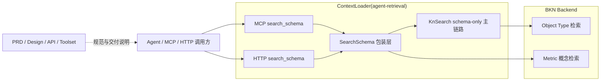
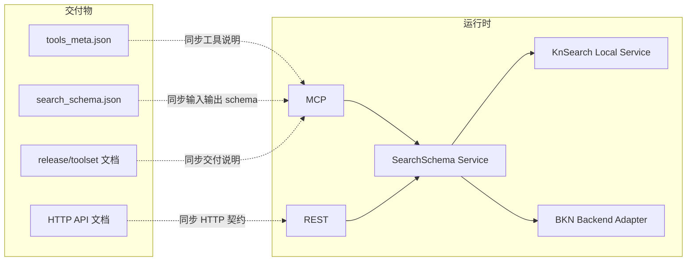
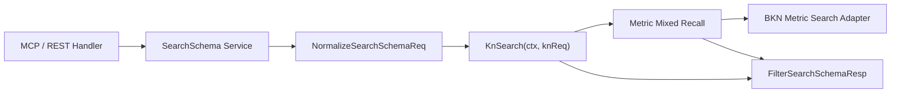
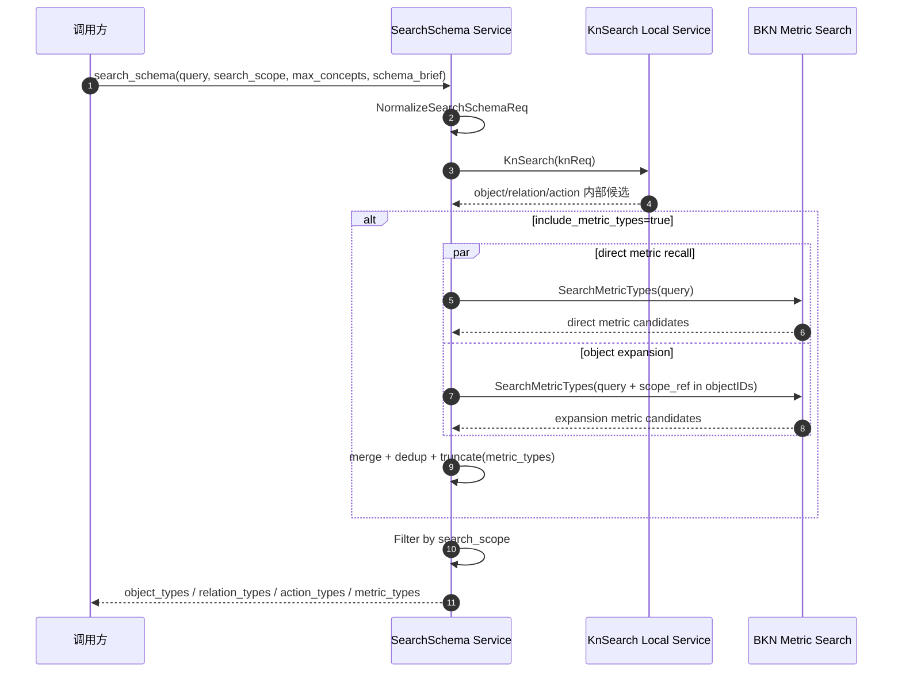
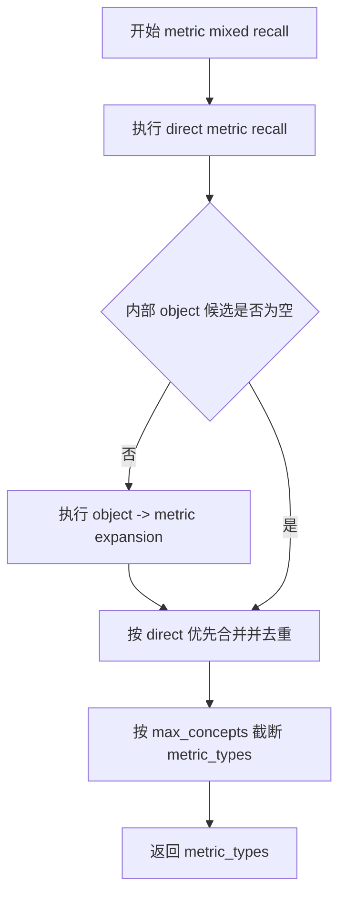

# 🏗️ Design Doc: ContextLoader `search_schema` Metric Schema 召回设计

> 状态: In Review
> 负责人: 待确认
> Reviewers: 待确认
> 关联 PRD: ../prd/issue-234-contextloader-search-schema-metric-schema-recall-prd.md

---

# 📌 1. 概述（Overview）

## 1.1 背景

- 当前现状：
  - `search_schema` 已在 ContextLoader 中落地为标准 schema 探索入口，当前输入输出只覆盖 `object_types`、`relation_types`、`action_types`。
  - 当前 `SearchSchema` 的实现方式是：将 `SearchSchemaReq` 归一化为 `KnSearchReq`，复用现有 `KnSearch` schema-only 能力，再按 `search_scope` 过滤输出。
  - BKN 已提供指标概念检索 API，指标在 BKN 中是独立概念，但必须绑定 `object_type`。

- 存在问题：
  - `search_schema` 当前无法返回 `metric_types`，Agent 第一跳探索无法直接发现 metric schema。
  - 若直接将 BKN `MetricDefinition` 全量透传给 `search_schema`，会让 schema 探索接口退化成指标定义详情接口。
  - 若首版同时引入 `metric -> object` 反向补齐和跨资源联动，会显著提高实现复杂度，且超出 `#234` 的当前产品边界。

- 业务 / 技术背景：
  - `#234` 的产品结论已经收敛为：本期 mixed recall 仅作用于 `metric_types`。
  - `metric_types` 采用两条召回路径：
    - 基于 query 的 direct metric recall
    - 基于系统内部 object 候选的 metric expansion
  - `search_scope` 仅控制输出，不阻断内部 object 候选参与 `metric_types` 召回。

---

## 1.2 目标

- 在 `search_schema` 中新增第四类输出 `metric_types`。
- 在 `search_scope` 中新增 `include_metric_types`，默认行为与现有三类资源一致。
- 以最小改动复用现有 `SearchSchema -> KnSearch -> Filter` 主链路，在 `SearchSchema` 包装层新增 metric mixed recall。
- 复用 BKN 现有指标概念检索能力，不新增独立 metric 搜索工具。
- 同步落地 MCP 工具契约、HTTP 契约、设计文档与发布文档。

---

## 1.3 非目标（Out of Scope）

- 不在本期实现 metric 数据查询或 dry-run。
- 不在本期接入 BKN metric CRUD 全链路。
- 不在本期实现 `metric -> object` 反向补齐。
- 不在本期让 `metric_types` 去影响 `relation_types`、`action_types` 等其他资源桶。
- 不在本期引入复杂排序策略、质量评分目标或额外召回配置项。
- 不在本期区分 `schema_brief=true/false` 的不同字段集；V1 先复用同一字段集。

---

## 1.4 术语说明（Optional）

| 术语 | 说明 |
|------|------|
| `metric_types` | `search_schema` 新增的第四类 schema 输出桶 |
| direct metric recall | 基于 query 直接调用 BKN metric 概念检索获得候选 |
| metric expansion | 基于系统内部 object 候选，再次检索其绑定的 metric 候选 |
| 内部 object 候选 | `KnSearch` 在输出过滤前产生的 object schema 候选，不要求最终出现在响应中 |
| mixed recall | direct metric recall + metric expansion 两条路径并行执行，结果合并去重 |
| BKN `MetricDefinition` | BKN 原生指标定义实体，不能原样作为 `search_schema.metric_types` 透传输出 |

---

# 🏗️ 2. 整体设计（HLD）

> 本章节关注系统“怎么搭建”，不涉及具体实现细节

---

## 🌍 2.1 系统上下文（C4 - Level 1）

### 参与者
- 用户：Agent、MCP 调用方、HTTP 调用方
- 外部系统：BKN Backend
- 第三方服务：无新增第三方服务，沿用现有 ContextLoader 依赖

### 系统关系



---

## 🧱 2.2 容器架构（C4 - Level 2）

| 容器 | 技术栈 | 职责 |
|------|--------|------|
| MCP Server | Go + `mcp-go` | 暴露 `search_schema` 工具并承接 metric schema 扩展后的输入输出契约 |
| REST Handler | Go + Gin | 暴露 `search_schema` HTTP 路由并承接参数绑定、校验与响应返回 |
| SearchSchema Service | Go | 归一化请求、调用 `KnSearch`、执行 metric mixed recall、聚合最终响应 |
| KnSearch Local Service | Go | 保持既有 object / relation / action schema 召回逻辑不变，继续产出内部 object 候选 |
| BKN Backend Adapter | Go + HTTP Client | 提供 object/relation/action 检索，并新增 metric 概念检索适配 |
| Docs / Toolset | Markdown / JSON / YAML | 同步对外说明、工具元数据与接口契约 |

### 容器交互



---

## 🧩 2.3 组件设计（C4 - Level 3）

### SearchSchema 相关组件

| 组件 | 职责 |
|------|------|
| `server/interfaces/search_schema.go` | 扩展 `SearchSchemaScope` 与 `SearchSchemaResp`，新增 metric 相关字段 |
| `server/logics/knsearch/search_schema.go` | 在现有 `SearchSchema` 包装层中编排 metric mixed recall |
| `server/logics/knsearch/metric_retrieval.go` | 新增 metric 检索构建、合并、去重、字段转换逻辑 |
| `server/interfaces/driven_bkn_backend.go` | 新增 `MetricType` / `MetricTypeConcepts` / `SearchMetricTypes` 接口定义 |
| `server/drivenadapters/bkn_backend.go` | 实现 BKN `/metrics` 概念检索适配 |
| `server/driveradapters/mcp/schemas/search_schema.json` | 新增 `include_metric_types` 与 `metric_types` 输出定义 |
| `server/driveradapters/mcp/tools.go` | 透传新的 `search_scope` 字段并返回 `metric_types` |
| `server/driveradapters/knsearch/index.go` | HTTP 请求绑定与返回结构自动承接新字段 |

### 组件关系



---

## 🔄 2.4 数据流（Data Flow）

### 主流程



### 子流程（可选）



---

## ⚖️ 2.5 关键设计决策（Design Decisions）

| 决策 | 说明 |
|------|------|
| metric mixed recall 只放在 `SearchSchema` 包装层 | 保持 `kn_search` 外部契约不变，避免将 metric 逻辑扩散到整个共享链路 |
| object expansion 使用内部 object 候选 | 与 `search_scope` 仅控制输出的产品规则一致，保证 `include_object_types=false` 时 mixed recall 仍可工作 |
| mixed recall 仅增强 `metric_types` | 将复杂度锁定在新增资源桶，不在本期引入跨资源联动 |
| direct 结果优先，expansion 结果补位 | 在不承诺复杂排序质量的前提下，提供稳定且可解释的合并顺序 |
| `schema_brief` V1 先复用同一字段集 | 当前缺少稳定场景约束，先保证接口能力落地，后续再做字段精简 |
| BKN `MetricDefinition` 不直接透传 | `search_schema` 是探索接口，不承载完整指标定义详情 |

---

## 🚀 2.6 部署架构（Deployment）

- 部署环境：沿用当前 ContextLoader 部署方式（K8s）
- 拓扑结构：无新增独立服务或存储
- 扩展策略：沿用现有 `agent-retrieval` 水平扩展方式

---

## 🔐 2.7 非功能设计

### 性能
- 不新增独立缓存或异步链路
- mixed recall 仅在 `include_metric_types=true` 时执行
- object expansion 使用 `KnSearch` 已生成的内部 object 候选，避免重复 object 检索

### 可用性
- `include_metric_types=false` 时完全跳过 metric 链路
- object expansion 仅作为 metric 召回增强路径，不改变其他资源桶结果

### 安全
- 沿用现有 header 透传和鉴权上下文
- BKN metric 检索沿用现有内部服务调用链路

### 可观测性
- 为 direct metric recall、object expansion、merge/dedup 增加日志与 span
- 记录 direct 命中数、expansion 命中数、merge 后数量、最终截断数量

---

# 🔧 3. 详细设计（LLD）

> 本章节关注“如何实现”，开发可直接参考

---

## 🌐 3.1 API 设计

### `search_schema` HTTP

**Endpoint:** `POST /api/agent-retrieval/v1/kn/search_schema`  
**兼容入口:** `POST /api/agent-retrieval/in/v1/kn/search_schema`

**Request:**

```json
{
  "query": "查看 pod cpu 使用率相关指标",
  "search_scope": {
    "include_object_types": true,
    "include_relation_types": false,
    "include_action_types": false,
    "include_metric_types": true
  },
  "max_concepts": 10,
  "schema_brief": true,
  "enable_rerank": true
}
```

**Response:**

```json
{
  "object_types": [],
  "relation_types": [],
  "action_types": [],
  "metric_types": [
    {
      "id": "metric_cpu_usage",
      "name": "cpu_usage",
      "comment": "CPU 使用率",
      "unit_type": "percent",
      "unit": "%",
      "metric_type": "atomic",
      "scope_type": "object_type",
      "scope_ref": "ot_pod",
      "time_dimension": {
        "property": "@timestamp",
        "default_range_policy": "last_1h"
      },
      "calculation_formula": {
        "aggregation": {
          "property": "cpu_usage",
          "aggr": "avg"
        }
      },
      "analysis_dimensions": [
        {
          "name": "namespace",
          "display_name": "命名空间"
        }
      ]
    }
  ]
}
```

### MCP `search_schema`

**Tool Name:** `search_schema`

**输入新增：**
- `search_scope.include_metric_types`

**输出新增：**
- `metric_types`

---

## 🗂️ 3.2 数据模型

### `SearchSchemaScope`

| 字段 | 类型 | 说明 |
|------|------|------|
| `include_object_types` | `*bool` | 现有字段，默认 `true` |
| `include_relation_types` | `*bool` | 现有字段，默认 `true` |
| `include_action_types` | `*bool` | 现有字段，默认 `true` |
| `include_metric_types` | `*bool` | 新增字段，默认 `true` |

### `SearchSchemaResp`

| 字段 | 类型 | 说明 |
|------|------|------|
| `object_types` | `[]any` | 现有输出 |
| `relation_types` | `[]any` | 现有输出 |
| `action_types` | `[]any` | 现有输出 |
| `metric_types` | `[]any` | 新增输出 |

### `MetricSchemaItem`（V1 候选）

| 字段 | 类型 | 说明 |
|------|------|------|
| `id` | `string` | metric 唯一标识，映射 BKN `MetricDefinition.id` |
| `name` | `string` | metric 名称，映射 BKN `MetricDefinition.name` |
| `comment` | `string` | metric 说明，映射 BKN `MetricDefinition.comment` |
| `unit_type` | `string` | 单位类型，映射 BKN `unit_type` |
| `unit` | `string` | 单位，映射 BKN `unit` |
| `metric_type` | `string` | BKN 指标类型，当前主要为 `atomic` |
| `scope_type` | `string` | 统计主体类型，V1 主要为 `object_type`，保留 BKN 原始语义 |
| `scope_ref` | `string` | 统计主体引用，V1 不映射为 `object_type_id`，直接保留 BKN 原始字段 |
| `time_dimension` | `object` | 时间维度定义，直接复用 BKN 原始结构 |
| `calculation_formula` | `object` | 指标计算公式，直接复用 BKN 原始结构 |
| `analysis_dimensions` | `array` | 分析维度定义，直接复用 BKN 原始结构 |

> 说明：V1 采用“少映射、轻裁剪”策略，尽量复用 BKN `MetricDefinition` 的原始业务字段，仅排除治理字段。

### `BKN MetricType`（适配层内部结构）

| 字段 | 类型 | 说明 |
|------|------|------|
| `ID` | `string` | 映射 BKN `id` |
| `KnID` | `string` | 映射 BKN `kn_id` |
| `Branch` | `string` | 映射 BKN `branch` |
| `Name` | `string` | 映射 BKN `name` |
| `Comment` | `string` | 映射 BKN `comment` |
| `MetricType` | `string` | 映射 BKN `metric_type` |
| `ScopeType` | `string` | 映射 BKN `scope_type` |
| `ScopeRef` | `string` | 映射 BKN `scope_ref` |
| `UnitType` | `string` | 映射 BKN `unit_type` |
| `Unit` | `string` | 映射 BKN `unit` |
| `TimeDimension` | `map[string]any` | 映射 BKN `time_dimension` |
| `CalculationFormula` | `map[string]any` | 映射 BKN `calculation_formula` |
| `AnalysisDimensions` | `[]map[string]any` | 映射 BKN `analysis_dimensions` |

---

## 💾 3.3 存储设计

- 存储类型：无新增存储
- 数据分布：ContextLoader 不落库，所有 metric 概念数据来自 BKN Backend
- 索引设计：沿用 BKN `/metrics` 检索能力，不在 ContextLoader 新建索引

---

## 🔁 3.4 核心流程（详细）

### `SearchSchema` mixed recall 流程

1. 通过 `NormalizeSearchSchemaReq` 解析请求默认值，并生成 `KnSearchReq` 与 `SearchSchemaScope`
2. 调用现有 `KnSearch(ctx, knReq)` 获取 object / relation / action 内部候选
3. 若 `include_metric_types=false`，直接进入现有过滤流程并返回
4. 若 `include_metric_types=true`：
   - 构建 direct metric recall 请求
   - 调用 BKN `SearchMetricTypes`
   - 从 `KnSearch` 的内部 object 候选中提取 object IDs
   - 若 object IDs 非空，则构建带 `scope_ref in objectIDs` 条件的 expansion 请求
   - 再次调用 BKN `SearchMetricTypes`
5. 使用“direct 优先、expansion 补位”的策略合并 metric 结果，并按 metric ID 去重
6. 按 `max_concepts` 截断 `metric_types`
7. 将 metric 结果转换为 `SearchSchemaResp.metric_types`
8. 对四类资源统一应用 `search_scope` 过滤，并返回最终响应

---

## 🧠 3.5 关键逻辑设计

### metric direct recall
- 使用与现有 coarse recall 一致的语义查询形态：`OR(knn(*, query), match(*, query))`
- 排序沿用 BKN 返回顺序，默认按 `_score desc`
- 请求体复用 `QueryConceptsReq`

### object -> metric expansion
- 输入为 `KnSearch` 输出过滤前的内部 object 候选 ID 集合
- 请求条件为：`AND(scope_ref in objectIDs, OR(knn(*, query), match(*, query)))`
- 若内部 object 候选为空，则跳过该路径

### merge + dedup
- 先保留 direct metric recall 结果顺序
- 再追加 expansion 结果中未出现的 metric
- 去重键为 metric ID
- 合并后按 `max_concepts` 截断

### 字段转换
- 使用 BKN 适配层结构承接 `MetricDefinition` 业务字段
- 响应转换时遵循“少映射、轻裁剪”策略，保留 BKN 原始业务字段命名
- 不执行 `scope_ref -> object_type_id` 映射
- 不新增 `object_type_name` 等派生字段
- 明确排除 `kn_id`、`branch`、`creator`、`updater`、时间戳等治理字段
- `schema_brief=true/false` 在 V1 先走同一转换逻辑

### 失败处理策略
- `KnSearch` 主链路失败：整体失败，保持现有行为
- direct metric recall 失败：当 `include_metric_types=true` 时整体失败，因为基础 metric 能力不可用
- object expansion 失败：记录 warning，降级为仅返回 direct metric recall 结果

---

## ❗ 3.6 错误处理

- `search_scope` 四个开关同时为 `false`：返回 400，提示至少开启一种资源类型
- BKN `/metrics` 请求失败：返回标准 HTTPError，或在 expansion 路径降级并记录日志
- metric 返回结构反序列化失败：返回 500，并附带标准错误包装
- metric 字段转换失败：按空列表处理不安全，本设计选择显式报错，避免静默丢失结果

---

## ⚙️ 3.7 配置设计

| 配置项 | 默认值 | 说明 |
|--------|--------|------|
| `search_scope.include_metric_types` | `true` | 新增 scope 开关 |
| `max_concepts` | `10` | 继续作为每类资源输出上限 |
| `schema_brief` | `false` | 参数语义兼容；V1 对 metric 先复用同一字段集 |
| `enable_rerank` | `true` | 保持原有参数；本期不新增 metric 专属 rerank 配置 |

---

## 📊 3.8 可观测性实现

- tracing：
  - 在 `SearchSchema` 中新增 `metric_direct_recall` span
  - 在 `SearchSchema` 中新增 `metric_expansion_recall` span
  - 在合并阶段新增 `metric_merge_dedup` span

- metrics：
  - `search_schema_metric_direct_count`
  - `search_schema_metric_expansion_count`
  - `search_schema_metric_final_count`
  - `search_schema_metric_expansion_fallback_total`

- logging：
  - 记录 `kn_id`、query、metric direct 命中数、expansion 命中数、去重后数量
  - expansion 失败时记录 warning，不改变 direct 结果日志

---

# ⚠️ 4. 风险与权衡（Risks & Trade-offs）

| 风险 | 影响 | 解决方案 |
|------|------|----------|
| BKN `/metrics` 概念检索的条件表达与 object 检索存在差异 | object expansion 可能无法直接复用现有 `QueryConceptsReq` 结构 | 设计阶段按复用 `QueryConceptsReq` 假设推进，联调时若存在差异，以适配层局部转换修正 |
| `metric_types` 详细字段尚未最终冻结 | 设计实现存在字段改动风险 | 在 LLD 中先给出 V1 候选字段，并将最终字段命名标记为待确认项 |
| direct 与 expansion 的排序质量不稳定 | mixed recall 结果顺序可能不够理想 | V1 明确不承诺复杂排序，只保证 deterministic merge |
| 将 mixed recall 扩散到其他资源桶 | 需求复杂度失控 | 在 PRD 与设计中明确 mixed recall 仅作用于 `metric_types` |

---

# 🧪 5. 测试策略（Testing Strategy）

- 单元测试：
  - `NormalizeSearchSchemaReq` 默认填充 `include_metric_types=true`
  - `FilterSearchSchemaResp` 支持过滤 `metric_types`
  - direct + expansion 合并去重逻辑
  - `include_object_types=false` 时仍允许使用内部 object 候选做 metric expansion
  - `schema_brief=true/false` 对 metric 走同一字段集

- 集成测试：
  - BKN `/metrics` 适配层请求头、路径、Body 映射
  - HTTP `search_schema` 返回 `metric_types`
  - MCP `search_schema` 输出包含 `metric_types`
  - expansion 路径失败时降级为 direct recall

- 压测：
  - 本期不新增独立压测目标，沿用 `search_schema` 当前基线做回归验证

---

# 📅 6. 发布与回滚（Release Plan）

### 发布步骤
1. 更新 `SearchSchemaReq` / `SearchSchemaResp` / MCP schema / HTTP 文档
2. 落地 BKN metric 检索适配层与 `SearchSchema` mixed recall
3. 补齐单元测试、集成测试和文档
4. 发布包含 `metric_types` 的 `search_schema` 新版本

### 回滚方案
- 若 metric mixed recall 存在联调问题，可回滚至不包含 `metric_types` 的上一版本
- 若仅 expansion 路径存在问题，可通过代码回滚或临时关闭 expansion 逻辑恢复 direct-only 版本

---

# 🔗 7. 附录（Appendix）

## 相关文档
- PRD: ../prd/issue-234-contextloader-search-schema-metric-schema-recall-prd.md
- 参考设计: ./issue-189-contextloader-schema-search-entry-unification-design.md

## 参考资料
- `adp/docs/design/bkn/features/bkn_native_metrics/DESIGN.md`
- `adp/docs/api/bkn/bkn-backend-api/bkn-metrics.yaml`
