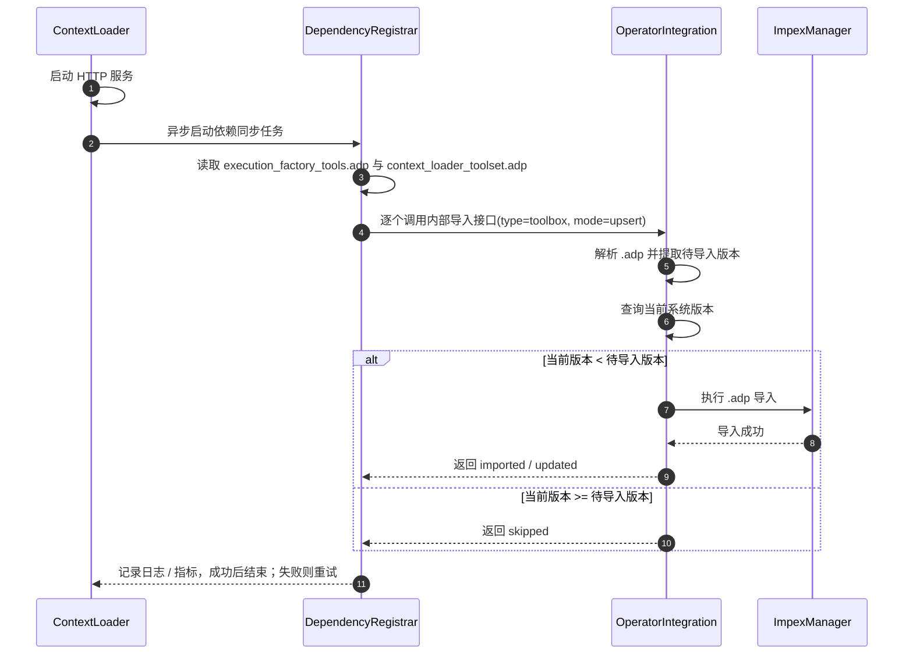

# 🏗️ Design Doc: ContextLoader 依赖工具包自动导入执行工厂

> 关联 Issue: https://github.com/kweaver-ai/kweaver-core/issues/243

---

# 📌 1. 概述（Overview）

## 1.1 背景

- 当前现状：
  - `context-loader/agent-retrieval` 的交付包中已经包含执行工厂依赖工具快照 `docs/release/tool-deps/execution_factory_tools.adp`。
  - 用户在使用 `context-loader` 提供的部分工具能力前，需要先手工将该 `.adp` 文件导入 `execution-factory/operator-integration`。
  - `context-loader` 当前运行时只依赖执行工厂的“查工具详情 / 调工具”接口，不具备启动时自动导入依赖工具包的能力。
  - 执行工厂现有“内置工具箱注册”接口 `CreateInternalToolBox` 只支持 `openapi/function` 元数据，不支持 `.adp` 导入包。
  - 执行工厂现有公共 `impex/import/:type` 已具备 `.adp` 导入能力，但接口语义偏人工导入，不适合作为服务间自动同步入口。

- 存在问题：
  - `context-loader` 的交付完整性依赖额外人工操作，增加接入门槛和遗漏风险。
  - `.adp` 依赖包属于“导入语义”，若强行复用内置注册链路，会混淆“元数据注册”和“配置包导入”的职责边界。
  - 系统中同时存在“自动导入”和“人工导入”两个写入口，但当前没有一条简单、稳定的更新判定规则。

- 业务 / 技术背景：
  - `.adp` 文件本质上是执行工厂 `impex` 体系消费的组件快照格式，天然属于“导入语义”。
  - `context-loader` 镜像构建时会把 `docs/release/` 一并打入容器，因此运行时具备读取本地依赖包的条件。
  - 当前交付包中的 toolbox 名称已带版本信息，人工导入后的资源也会在执行工厂中保留对应版本信息，因此可基于版本做自动更新判定。

---

## 1.2 目标

- 让 `context-loader` 在服务启动后自动将 `execution_factory_tools.adp` 与 `context_loader_toolset.adp` 同步到执行工厂，不再依赖用户手工导入。
- 明确采用“导入语义”而非“内置工具注册语义”，避免扩展 `CreateInternalToolBox` 支持 `.adp`。
- 在执行工厂中新增面向内部服务的依赖包自动导入接口，底层复用现有 `impex import` 能力。
- 建立基于版本的单向升级策略：仅当当前系统版本低于待导入版本时才执行更新。
- 保证自动导入失败不会阻塞 `context-loader` 主服务启动，并支持后台重试补偿。

---

## 1.3 非目标（Out of Scope）

- 不改造 `context-loader` 的对外工具调用接口和业务返回结构。
- 不修改执行工厂现有公共 `impex/import/:type` 的用户侧语义。
- 不将 `.adp` 导入能力直接接入执行工厂 `tool-box/intcomp` 内置工具注册接口。
- 不额外引入新的“托管/脱管”状态模型或独立仲裁存储。
- 不解决“同版本但内容不同”的复杂仲裁问题，本期只基于版本做更新判定。

---

## 1.4 术语说明（Optional）

| 术语 | 说明 |
|------|------|
| ContextLoader | `context-loader/agent-retrieval` 服务 |
| 执行工厂 | `execution-factory/operator-integration` 服务 |
| `.adp` | 执行工厂 `impex` 消费的组件导入导出快照格式 |
| 依赖工具包 | `context-loader` 运行所依赖、需预先存在于执行工厂中的工具箱快照 |
| 自动导入 | `context-loader` 启动后主动调用执行工厂内部接口执行 `.adp` 同步 |
| 当前系统版本 | 执行工厂中已存在资源的版本 |
| 待导入版本 | 当前 `.adp` 依赖包中携带的版本 |

---

# 🏗️ 2. 整体设计（HLD）

> 本章节关注系统“怎么搭建”，不涉及具体实现细节

---

## 🌍 2.1 系统上下文（C4 - Level 1）

### 参与者
- 用户：Agent 开发者、接入方运维人员
- 外部系统：执行工厂

### 系统关系

    [Agent / 接入方]
        → [ContextLoader]
        → [执行工厂 Toolbox / Tool 查询与调用能力]

    [ContextLoader 启动任务]
        → [执行工厂内部导入接口]
        → [执行工厂 impex / toolbox import]

---

## 🧱 2.2 容器架构（C4 - Level 2）

| 容器 | 技术栈 | 职责 |
|------|--------|------|
| ContextLoader API Service | Go + Gin | 对外提供知识检索、行动召回、MCP 等能力 |
| ContextLoader Dependency Registrar | Go | 启动后异步读取本地 `.adp` 并触发自动导入 |
| Operator Integration API Service | Go + Gin | 对外提供工具箱、工具、MCP、导入导出等能力 |
| Operator Integration Internal Impex Adapter | Go | 新增内部依赖包导入入口，复用现有 `impex` 逻辑 |

---

## 🧩 2.3 组件设计（C4 - Level 3）

### ContextLoader 侧组件

| 组件 | 职责 |
|------|------|
| `DependencyRegistrar` | 启动后触发依赖导入，处理文件读取、重试、日志与指标 |
| `DrivenOperatorIntegration` | 扩展内部导入接口调用能力 |
| `Bootstrap Hook` | 在 `main()` 启动 HTTP 服务后异步启动导入流程 |

### 执行工厂侧交互组件

| 组件 | 职责 |
|------|------|
| Internal Impex Route | 提供内部 `.adp` 导入入口，底层复用执行工厂公共导入逻辑 |
| Impex Manager | 复用现有 `.adp` 解析与导入事务逻辑 |
| Toolbox Query / Import Service | 读取当前版本并在必要时完成 toolbox/operator 依赖导入 |

---

## 🔄 2.4 数据流（Data Flow）

### 核心时序

### 主流程

    ContextLoader 启动
      → 启动 HTTP 服务
      → 异步触发 DependencyRegistrar
      → 读取本地依赖包 execution_factory_tools.adp 与 context_loader_toolset.adp
      → 逐个调用执行工厂内部导入接口
      → 执行工厂解析 .adp 并读取当前系统版本
      → 仅当当前版本低于待导入版本时执行 import/upsert
      → 返回 imported / updated / skipped
      → ContextLoader 记录状态并结束或重试

### 子流程（可选）

    执行工厂未就绪
      → DependencyRegistrar 调用失败
      → 按退避策略重试
      → 执行工厂恢复后补偿成功

---

## ⚖️ 2.5 关键设计决策（Design Decisions）

| 决策 | 说明 |
|------|------|
| 采用“导入语义”而非“内置注册语义” | `.adp` 天然是 `impex` 快照格式，语义与导入一致 |
| 新增内部导入接口，不复用 `tool-box/intcomp` | 避免把 openapi/function 元数据注册与 `.adp` 包导入混在一起 |
| 内部接口底层复用现有 `impex import` | 减少重复实现，复用现有校验、事务和依赖导入能力 |
| `context-loader` 启动后异步导入 | 不阻塞主服务启动，避免执行工厂可用性反向影响主服务 |
| 导入模式使用 `upsert` | 满足首次导入和版本升级的统一幂等语义 |
| 自动更新只基于版本做单向升级 | 不引入新的仲裁模型，规则简单且与现有人工导入兼容 |
| 当前版本大于或等于待导入版本时直接跳过 | 避免自动任务覆盖更高版本或同版本的已有资源 |
| 首版允许通过 `box_name` 解析版本 | 当前交付包已满足命名约定，后续再逐步演进为结构化版本字段 |

---

## 🚀 2.6 部署架构（Deployment）

- 部署环境：K8s
- 拓扑结构：`context-loader` 与执行工厂通过集群内 HTTP 通信完成依赖同步
- 扩展策略：导入任务为无状态后台逻辑，随 `context-loader` 实例启动；首版允许多实例并发触发，依赖执行工厂侧版本判定和导入幂等控制

---

## 🔐 2.7 非功能设计

### 性能
- 自动导入仅在启动后执行，不进入主请求链路。
- `.adp` 导入底层复用现有事务逻辑，不新增复杂仲裁流程。

### 可用性
- 自动导入失败不会阻塞 `context-loader` 主服务启动。
- 对执行工厂暂时不可用场景采用后台退避重试。

### 安全
- 自动导入仅通过执行工厂内部接口触发，不暴露到公共人工导入入口。
- 通过“仅升级不回滚”的版本规则降低误覆盖风险。

### 可观测性
- `context-loader` 记录自动导入的成功、跳过和失败日志。
- 建议补充 metric：`tool_dep_sync_attempt_total`、`tool_dep_sync_success_total`、`tool_dep_sync_skip_total`。

---

# 🔧 3. 详细设计（LLD）

> 本章节关注“如何实现”，开发可直接参考

---

## 🌐 3.1 API 设计

### 内部依赖包导入接口

**Endpoint:** `POST /api/agent-operator-integration/internal-v1/impex/intcomp/import/:type`

其中：

- `:type` 当前支持 `toolbox`

**Content-Type:** `multipart/form-data`

**Form Fields:**

| 字段 | 必填 | 说明 |
|------|------|------|
| `data` | 是 | `.adp` 文件内容 |
| `mode` | 否 | 导入模式，默认 `upsert` |

**Response:** 成功时以 HTTP 2xx 表示导入请求已被执行工厂接受并处理；当前复用公共导入 handler，通常返回 `201` 空响应体。`context-loader` 不依赖响应 body，只按 HTTP 状态判断成功或失败。

---

## 🧠 3.2 ContextLoader 启动任务设计

### 新增组件

建议新增组件：

- `server/logics/dependencysync/`

建议职责拆分：

| 组件 | 职责 |
|------|------|
| `DependencyRegistrar` | 统一启动依赖同步主流程 |
| `PackageLoader` | 读取 `.adp` 文件 |
| `RetryPolicy` | 控制退避与重试停止条件 |

### 启动时机

在 `server/main.go` 中：

1. 初始化配置
2. 启动 HTTP 服务
3. 异步调用 `DependencyRegistrar.RegisterToolDependencies()`

设计要求：

- 不阻塞 `s.Start()`
- 不影响对外健康检查与业务接口启动

### 文件定位

镜像内固定内容通过 `go:embed` 固化到二进制：

- `server/bootstrap/tool_dependencies/execution_factory_tools.adp`
- `server/bootstrap/tool_dependencies/context_loader_toolset.adp`

---

## 🧾 3.3 版本设计

### 版本来源

首版不额外传递 `package_version` 字段。`context-loader` 只向执行工厂内部导入接口提交 `.adp` 内容，待导入版本由执行工厂从 `.adp` 包内元数据或当前约定的 toolbox 命名中解析。

执行工厂负责：

1. 从 `.adp` 包内解析待导入版本
2. 查询当前系统中已存在 toolbox 的版本
3. 仅在 `current_version < package_version` 时执行更新

### 版本规则

对包内每个 toolbox 资源按以下规则处理：

1. 当前资源不存在：
   - 执行导入，状态记为 `imported`
2. 当前资源已存在：
   - 若 `current_version < package_version`，执行更新，状态记为 `updated`
   - 若 `current_version == package_version`，跳过，状态记为 `skipped`
   - 若 `current_version > package_version`，跳过，状态记为 `skipped`

### 设计原因

- 不需要公共人工导入接口额外写入仲裁状态
- 能避免自动任务回滚更高版本的人工导入结果
- 规则简单，便于测试和运维理解

---

## ⏱️ 3.4 重试与失败处理

### 重试条件

对以下场景进行重试：

- 网络错误
- 执行工厂 5xx
- 执行工厂未就绪 / 连接失败

对以下场景不重试：

- 4xx 参数错误
- 本地依赖包缺失且确认非临时问题

### 建议退避策略

- 初始延迟：5s
- 后续：15s / 30s / 60s
- 上限：60s

### 配置边界

`tool_dependency_sync` 仅保留：

- `enabled`
- `initial_retry_interval_seconds`
- `max_retry_interval_seconds`

不对外暴露以下配置：

- 依赖包路径
- 版本文件路径

原因：

- 这两个文件属于镜像交付内容，不是部署环境差异
- 若允许配置覆盖，会削弱“发布包自带依赖快照”的约束

### 日志建议

- `INFO`: imported / updated / skipped
- `WARN`: retrying
- `ERROR`: invalid package / permanent failure

---

## 🧪 3.5 测试设计

### ContextLoader 单测

- 内嵌依赖包加载成功
- 内部导入接口调用成功
- 网络失败后按策略重试
- 配置关闭时不启动导入任务

### 集成测试

- 空库启动后自动导入成功
- 重启后导入结果为 `skipped`
- 执行工厂晚于 `context-loader` 启动时最终导入成功
- 执行工厂中存在更高版本资源时自动导入跳过

---

# 🧱 4. 改动清单（Implementation Scope）

## 4.1 ContextLoader

建议涉及文件 / 模块：

- `server/main.go`
- `server/interfaces/driven_operator_integration.go`
- `server/drivenadapters/operator_integration.go`
- `server/infra/config/config.go`
- 新增 `server/logics/dependencysync/`

## 4.2 执行工厂

建议涉及文件 / 模块：

- `server/driveradapters/rest_private_handler.go`
- 新增内部导入路由
- `server/logics/impex/index.go`
- `server/logics/toolbox/` 查询当前资源版本所需能力

---

# ⚠️ 5. 风险与回滚

## 5.1 主要风险

- 当前版本仅能从 `box_name` 命名约定中解析时，命名不规范会导致版本判断失真
- 同版本但内容不同的场景，本期会被统一视为 `skipped`
- 多实例并发启动时会产生重复调用，但不应导致重复资源

## 5.2 回滚策略

- 可通过配置关闭 `dependency_sync.enabled`
- 执行工厂内部导入接口可保留但不被调用
- 已导入资源可按现有 toolbox 管理和导入导出能力人工回滚

---

# ✅ 6. 验收标准（DoD）

- [ ] `context-loader` 启动后无需人工操作即可触发 `execution_factory_tools.adp` 自动导入
- [ ] 自动导入失败不会阻塞 `context-loader` 主服务启动
- [ ] 执行工厂新增内部导入接口，并复用现有 `impex import` 逻辑
- [ ] 同版本重复启动不会产生重复资源，结果为 `skipped`
- [ ] 新版本依赖包可自动更新旧版本资源
- [ ] 当前系统版本大于待导入版本时，自动导入会跳过，不做回滚
