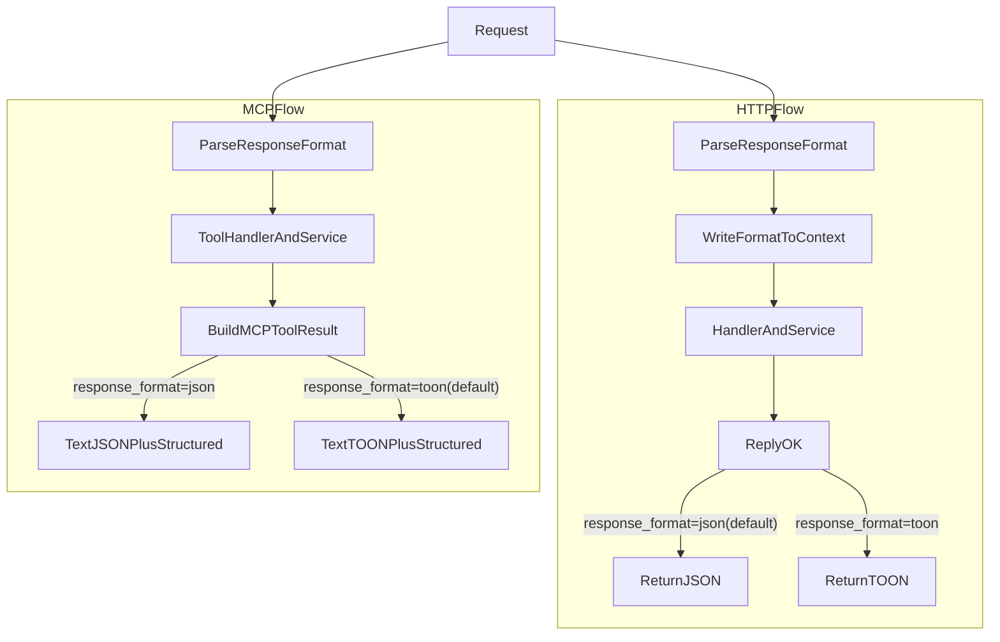

# Context-Loader TOON 压缩能力设计与实现方案

## 一、需求背景

当前 Context-Loader 对外接口主要返回原始 JSON / 文本内容。在面向大模型的消费场景中，这类响应通常存在以下问题：

- **响应内容偏大**：上下文字段较多时，响应体体积和 token 消耗较高。
- **传输与解析成本较高**：在多轮调用、多智能体并发场景下，较大的原始响应会带来额外网络与序列化开销。
- **缺少统一压缩输出能力**：当前接口缺少一种标准的、可按需启用的紧凑表示方式。

因此，本期聚焦一个明确目标：**利用 TOON 为 Context-Loader 提供正式的压缩能力**，在保持现有业务语义和默认行为不变的前提下，为调用方增加一种可选的压缩输出格式。

**参考**：[TOON 官方实现列表](https://toonformat.dev/ecosystem/implementations)

---

## 二、需求定位与范围

### 2.1 需求定位

本期需求定位为：围绕 `TOON` 为 Context-Loader 提供正式的压缩能力。

其核心含义是：

- 目标是让接口支持 `TOON` 这种更紧凑的响应表示。
- 重点是“压缩能力建设”和“接口可选输出”。
- 不将本期定义为试点、PoC 或效果验证项目。
- 不将 Agent 友好结构设计纳入本期范围。

### 2.2 本期目标

- 为 Context-Loader 增加可选的 `TOON` 响应输出格式。
- 在不破坏现有调用方能力的前提下提供压缩能力。
- 降低响应体积与 token 消耗。
- 覆盖 HTTP 与 MCP 两类主要消费链路。
- 保持默认行为与现有接口兼容。

### 2.3 本期强调点

- 核心目标是提供 `TOON` 压缩能力。
- 在现有接口上增加可选格式参数，而不是新增独立接口。
- 默认行为保持兼容，未显式请求 `TOON` 时继续返回现有格式。
- HTTP 与 MCP 两条链路都纳入能力建设范围。
- 验收重点是能力可用、接口契约清晰、可灰度、可测试。

### 2.4 非目标

- 不承诺“准确率一定提升”。
- 不引入新的 Agent 友好结构。
- 不重做现有返回 schema。
- 不改变现有业务字段语义。
- 不纳入新的检索、排序或 rerank 优化。

---

## 三、TOON 格式调研结论

### 3.1 什么是 TOON

**TOON**（Token-Oriented Object Notation）是一种面向 token 的对象表示法：

- **定位**：为 LLM 设计的、紧凑且人类可读的 JSON 数据模型编码。
- **数据模型**：与 JSON 一致（数组、对象、字符串/数字/布尔/null），**无损往返**。
- **规范**：[github.com/toon-format/spec](https://github.com/toon-format/spec)，语言无关，有 conformance tests。

### 3.2 核心特性（作为压缩格式选型依据）

| 特性 | 说明 | 对 Context-Loader 的价值 |
|------|------|---------------------------|
| **Token 效率** | 混合结构下约 **40% 更少 token**（官方 benchmark） | 有助于降低单次请求的上下文成本 |
| **显式 [N] 与 {fields}** | 数组长度、表头明确声明 | 有利于模型更稳定地解析结构 |
| **表格数组** | 同构对象数组压成「表头 + 行」形式 | 检索结果、知识概念列表等场景较适合 |
| **可选 Key Folding** | 深层单键链可压成 `a.b.c: val` | 可进一步压缩冗余 key |
| **多语言实现** | 官方/社区多语言，含 Go | 便于在现有 Go 服务中集成 |

### 3.3 官方 Benchmark 摘要（与 JSON 对比）

- **Efficiency Ranking（Accuracy per 1K Tokens）**：TOON 27.7 acc%/1K tok，JSON 16.4。
- **Token 量**：同一数据集 TOON 约 2,759 tokens，JSON 约 4,587 tokens（约 **-40%**）。
- **多模型**：在 claude-haiku、gemini-3-flash、gpt-5-nano、grok 等模型上，TOON 在多数场景优于或持平 JSON。

以上 benchmark 说明 TOON 具有较好的 token 效率和 LLM 适配性，适合作为本项目压缩输出格式的优先选型依据。  
本期将其作为**压缩能力选型依据**，而非业务准确率提升的硬性承诺。

### 3.4 格式示例（与当前 JSON 对比）

当前接口返回的「知识概念列表」多为同构对象，例如：

**JSON：**
```json
{
  "concepts": [
    { "concept_type": "object_type", "concept_id": "ot_1", "concept_name": "公司", "intent_score": 0.95 },
    { "concept_type": "object_type", "concept_id": "ot_2", "concept_name": "产品", "intent_score": 0.88 }
  ],
  "hits_total": 2
}
```

**TOON（表格数组 + 显式长度）：**
```text
concepts[2]{concept_type,concept_id,concept_name,intent_score}:
  object_type,ot_1,公司,0.95
  object_type,ot_2,产品,0.88
hits_total: 2
```

该示例说明：在保持原始业务语义不变的前提下，TOON 可通过更紧凑的表示方式压缩结构化响应内容。

---

## 四、Go 生态与 `toon-go`

- **仓库**：[github.com/toon-format/toon-go](https://github.com/toon-format/toon-go)
- **状态**：官方页面标注为 "In Development"，但 pkg.go.dev 上已有可用 API（Marshal/Unmarshal/Decode）。
- **API 要点**：
  - `toon.Marshal(in, toon.WithLengthMarkers(true))`：编码为 TOON。
  - `toon.Unmarshal(encoded, &out)`：解码到结构体或 `map[string]any`。
  - `toon.Decode(raw)`：无结构体时的动态解码。
  - 支持 struct tag `toon:"field"`；若仅保留现有 `json` tag，可通过「先 JSON 再 map 再 TOON」或后续补充 `toon` tag 的方式兼容。

结论：现有 Go 生态已具备可接入的 TOON 编码实现，可作为本期压缩能力建设的技术基础。

**建议**：在 `agent-retrieval` 中引入 `github.com/toon-format/toon-go`，在序列化层做「按需 TOON」适配；若后续发现 `toon-go` 对复杂嵌套或边界情况支持不足，可再评估使用 conformance tests 做校验，或对高频 DTO 做定向优化。

---

## 五、实现方案

### 5.1 设计原则

1. **兼容现有行为**：默认仍返回 JSON，不破坏现有调用方。
2. **按需启用 TOON**：仅在调用方显式请求时返回 TOON。
3. **不改变业务语义**：本期只改变响应编码表示，不重构业务字段。
4. **统一序列化抽象**：在 infra 层封装「响应格式选择 + 序列化」，避免各 handler 散落 if/else。
5. **可灰度、可测试、可观测**：支持开关控制、基础测试与运行指标对比。

### 5.2 接口形式选择

为避免协议复杂化，本期统一采用单一参数名进行响应格式协商：

- 参数名：`response_format`
- 枚举值：`json | toon`
- 非法值：返回 `400 Bad Request`

说明：

- **HTTP 接口**：通过 Query 参数传递 `response_format`，默认值为 `json`。
- **MCP Tool**：通过 tool arguments 传递 `response_format`，默认值为 `toon`。
- 本期不使用 `format` 作为参数名，避免与其他业务语义混淆。
- `Accept` / 自定义 Header 等内容协商方式不纳入本期，可作为后续扩展能力。

### 5.3 覆盖范围

本期优先覆盖**直接面向 LLM / Agent 消费**的接口，不扩展到纯内部管理类接口。

- **HTTP**：`get_action_info`、`get_logic_properties_values`、`kn_schema_search`、`kn_search`、`query_object_instance`、`query_instance_subgraph`。
- **MCP**：对应 Tool 的 `CallToolResult` 返回内容。
- **不纳入本期**：健康检查、管理类、纯内部调用链路。

### 5.4 序列化层抽象

本节的核心原则是：**不改变业务层返回的响应对象，只在成功响应的最后一步统一决定输出为 JSON 还是 TOON。**

换言之：

- 业务 handler 仍按现有方式绑定请求、调用 service、拿到 `resp`
- 业务 service 不感知 `response_format`
- 真正变化的是“响应出口如何序列化 `resp`”

#### 5.4.1 统一响应格式抽象

在 `server/utils` 或 `server/infra/rest` 中新增统一的格式与编码能力：

- 定义 `ResponseFormat`：`JSON` | `TOON`
- 实现统一方法 `MarshalResponse(format ResponseFormat, body interface{}) (contentType string, bodyBytes []byte, err error)`
  - `JSON`：沿用现有 `sonic`/`jsoniter`，`Content-Type: application/json`
  - `TOON`：使用 `toon-go` 编码，`Content-Type: application/toon`

说明：

- 若当前 struct 仅有 `json` tag，可采用「struct -> JSON -> map -> TOON」的兼容路径
- 后续可再为关键 DTO 增加 `toon` tag，以获得更好的压缩效果

#### 5.4.2 HTTP 链路实现逻辑

HTTP 链路的实现重点不是改业务 DTO，而是把 `response_format` 作为**协议层参数**处理。

建议流程如下：

1. **解析请求参数**
   - 在 middleware 或公共 helper 中读取 Query 参数 `response_format`
   - 若未传，则默认 `json`
   - 若取值非法，则直接返回 `400`

2. **写入上下文**
   - 将解析后的 `ResponseFormat` 写入 `gin.Context` 或 `context.Context`
   - 后续业务 handler 无需关心格式细节

3. **业务处理保持不变**
   - handler 继续按当前逻辑绑定 Header / Query / JSON Body
   - 调用 service 获取原始业务响应对象 `resp`
   - 仍然调用统一出口：`rest.ReplyOK(c, http.StatusOK, resp)`

4. **在响应出口统一序列化**
   - 扩展现有 `rest.ReplyOK(c, statusCode, body)`
   - 若格式为 `json`：保持当前行为，返回 JSON
   - 若格式为 `toon`：调用 `MarshalResponse(TOON, body)`，返回纯 TOON 内容

HTTP 的 `toon` 模式定义为**纯 TOON 响应**：

- `Content-Type: application/toon`
- body 为 TOON 文本
- 不额外包裹 JSON envelope

错误响应继续统一使用 JSON，避免异常链路复杂化。

#### 5.4.3 MCP 链路实现逻辑

MCP 链路与 HTTP 的差异在于：其返回结构本身包含 `content` 与 `structuredContent` 两部分，因此更适合通过统一 helper 收口。

建议流程如下：

1. **解析 tool arguments**
   - 从 tool arguments 中读取 `response_format`
   - 若未传，则默认 `toon`

2. **业务处理保持不变**
   - 各 tool handler 继续完成参数绑定、鉴权、service 调用
   - 拿到原始业务响应对象 `resp`

3. **统一构造 MCP 返回结果**
   - 不再在各 handler 中直接写 `mcp.NewToolResultStructured(resp, utils.ObjectToJSON(resp))`
   - 抽取统一 helper，例如：
     - `getMCPResponseFormat(req)`：解析 `response_format`
     - `buildMCPToolResult(resp, format)`：统一构造 tool 返回结果

4. **根据格式决定文本内容**
   - `response_format=json`
     - 文本内容返回 JSON
     - 保持现有 `structuredContent`
   - `response_format=toon`
     - 文本内容返回 TOON
     - 本期仍保留 `structuredContent`，以保证与现有 MCP 客户端的兼容性

本期仍保留 `mcp.NewToolResultStructured(...)` 的使用方式，但通过统一 helper 收口，避免各 tool handler 重复实现。  
本期不调整 Agent 侧消费模型；后续可根据实际消费情况再评估是否进一步瘦身 `structuredContent`。

#### 5.4.4 这一层改动的边界

本节方案的边界需要明确：

- 改动的是**响应序列化层**
- 不改变现有业务请求 DTO
- 不改变现有业务响应对象的语义
- 不在本期设计新的 Agent 友好 schema

因此，HTTP 和 MCP 两条链路虽然默认值不同，但本质上复用的是同一套“格式解析 + 统一编码 + 响应出口”的设计思路。

#### 5.4.5 HTTP / MCP 流程图

以下流程图用于帮助快速理解两条链路的差异与共性：HTTP 与 MCP 都复用统一编码能力，但默认值和最终返回出口不同。



### 5.5 依赖与版本

- 在 `agent-retrieval/go.mod` 中增加：
  - `github.com/toon-format/toon-go`
- 依赖版本需要锁定，避免上游实现变化影响本期交付。
- 若 `toon-go` 对「任意 struct -> TOON」支持不完善，可先用「struct -> JSON -> map -> TOON」保证正确性，再逐步为高频、大体积 DTO 做优化。

### 5.6 配置与开关

配置开关不是协议能力本身的必需项，但**建议保留**，作为上线与灰度控制手段，尤其用于控制 HTTP `application/toon` 的发布风险以及 `toon-go` 兼容性风险。

- 建议增加全局开关，例如 `response.toon_enabled: true/false`，支持环境级启停。
- 如有需要，可增加接口白名单，仅对指定 HTTP 接口或 MCP Tool 开启 TOON。
- 若项目希望先缩小实现范围，配置开关可降级为“发布阶段建议项”，不阻塞核心编码能力落地。

### 5.7 错误处理与兼容性策略

- HTTP 不传 `response_format` 时，接口行为与当前版本保持一致，默认返回 JSON。
- MCP 不传 `response_format` 时，默认返回 TOON 文本内容。
- 当 `response_format=toon` 且编码成功时，返回 TOON 内容。
- HTTP 的 TOON 响应 `Content-Type` 为 `application/toon`。
- 当 `response_format=toon` 但编码失败时，返回明确错误，不做静默降级。
- 错误响应统一继续返回 JSON，便于排查与兼容现有错误处理逻辑。

### 5.8 文档与发布

- 在接口文档中补充：
  - `response_format=toon` 的使用方式；
  - `application/toon` 的响应说明；
  - raw / TOON 请求响应示例；
  - 默认兼容行为与错误处理策略。
- 在 MCP 使用说明中补充：
  - 如何显式请求 TOON；
  - TOON 返回内容的基本说明。

---

## 六、测试与验收标准

### 6.1 测试建议

- **单元测试**：对 `MarshalResponse(TOON, body)` 做 round-trip（TOON -> Unmarshal -> 再 Marshal 为 JSON），与原始 JSON 结构做对比，保证语义一致。
- **参数解析测试**：校验 `response_format=json|toon` 在 HTTP 与 MCP 两条链路上的默认值、正常值与异常分支。
- **HTTP 集成测试**：对关键接口带 `response_format=toon` 调用，断言 `Content-Type=application/toon`，且 body 为合法 TOON；不传参数时仍返回 JSON。
- **MCP 集成测试**：校验所有目标 tool 在默认情况下返回 TOON 文本，显式传 `response_format=json` 时返回 JSON 文本，并验证统一 helper 的构造逻辑。
- **可选测试**：用 toon-format 官方 [conformance tests](https://github.com/toon-format/spec/tree/main/tests) 进一步校验兼容性。

### 6.2 验收标准

- [ ] 不传 `response_format` 时，接口行为与当前版本保持一致。
- [ ] HTTP 不传 `response_format` 时默认返回 JSON；MCP 不传 `response_format` 时默认返回 TOON。
- [ ] 传 `response_format=toon` 时，HTTP 与 MCP 的目标接口都能返回合法 TOON 内容。
- [ ] HTTP 的 TOON 模式返回 `application/toon`，且不额外包裹 JSON。
- [ ] 默认行为、非法参数、TOON 编码失败等场景有明确处理策略。
- [ ] 文档中提供至少 1 组完整的 raw / TOON 请求响应示例。
- [ ] 具备基础测试覆盖与配置开关能力。

说明：  
本期验收以**压缩能力建设完成**为主，不将业务准确率提升作为硬性验收指标。若条件允许，可补充 raw / TOON 样本响应大小或 token 的对比数据，作为辅助说明。

---

## 七、实施阶段建议

| 阶段 | 内容 |
|------|------|
| **阶段 1：基础能力建设** | 引入 `toon-go`；实现 `ResponseFormat` 与 `MarshalResponse(JSON/TOON)`；完成 `response_format` 参数解析。 |
| **阶段 2：链路接入** | 接入 HTTP 与 MCP 的目标接口；补充 raw / TOON 示例与使用说明。 |
| **阶段 3：上线准备** | 增加配置开关、补齐测试、完成样本响应大小对比与灰度方案。 |

---

## 八、风险与缓解

| 风险 | 缓解 |
|------|------|
| `toon-go` 仍为 In Development，API 或行为可能变动 | 锁版本、加集成测试；必要时结合 conformance tests 做校验。 |
| 部分复杂嵌套 / 自定义类型的 TOON 支持不足 | 通过「JSON -> map -> TOON」兜底；优先保障核心返回 DTO。 |
| 调用方未适配 TOON | 默认保持 JSON，TOON 仅按需启用；文档明确说明。 |
| 格式协商方式过多导致实现与接入复杂 | 本期仅支持 `response_format` 单一协商方式。 |

---

## 九、后续演进

以下内容不纳入本期，可作为后续独立需求评估：

- 面向 Agent 的友好结构设计（如 summary、evidence、importance 等语义层重组）
- 不同压缩策略或视图（如 `toon_minimal`、`toon_full`）
- 更细粒度的业务效果评估，包括准确率与端到端时延对比
- 针对高频 DTO 的定制编码优化

---

## 十、参考资料

- [TOON 官网](https://toonformat.dev/)
- [TOON 实现列表](https://toonformat.dev/ecosystem/implementations)
- [Format Overview](https://toonformat.dev/guide/format-overview.html)（语法、表格数组、key folding）
- [Benchmarks](https://toonformat.dev/guide/benchmarks.html)（token 与准确率）
- [toon-go](https://github.com/toon-format/toon-go) / [pkg.go.dev](https://pkg.go.dev/github.com/toon-format/toon-go)
- [TOON Spec](https://github.com/toon-format/spec)

---

**文档版本**：v2  
**日期**：2025-03-09
