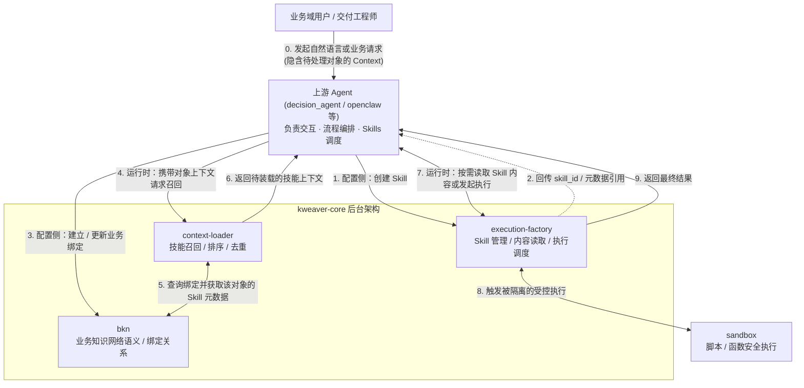
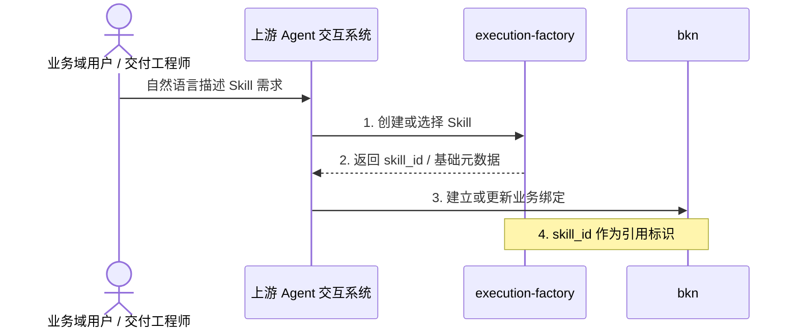
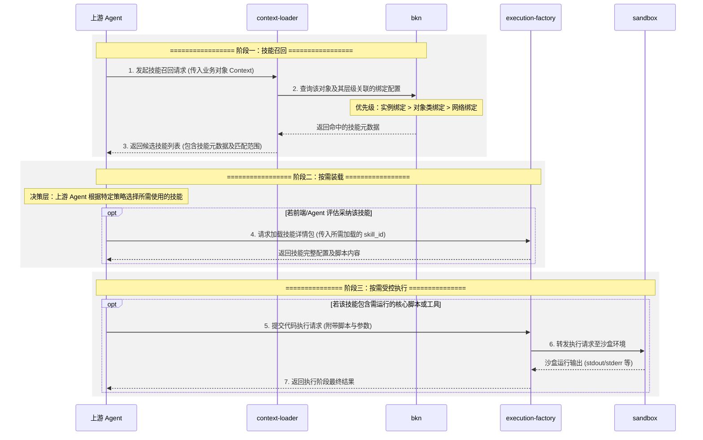

# Skill 与 BKN 业务绑定：端到端架构总览与跨模块协同方案 (RFC)

> **文档定位**：端到端产品架构预审稿 / 跨模块协同与边界契约 (RFC)
> **编写目的**：梳理各模块配合打通“Agent 业务技能绑定”的核心产品链路，明确各模块的职责边界（做什么、不做什么）。本方案为**定边界**，不讨论具体接口定义；模块负责人达成共识后，将以此为输入，分头输出各模块的详细技术方案 (TDD)。
> **相关资料**：原 Brainstorming 文档及周边参考构想。

---

## 第一部分：业务原始需求与背景（Why 为什么要做）

对于未参与前期脑暴的各模块负责人，以下为您还原该方案的原始业务诉求与设计初衷。

### 1. 业务层原始需求
当前的 `Skill`（通常表现为 `SKILL.md + assets` 的技能包）是作为脱离具体业务对象的底层能力进行管理的，无法与具体的业务数据和实例连接。核心的原始需求是：
1. 用户在平台中创建管理的 Skill，能够与 BKN (业务知识网络) 建立直接的语义关联。
2. Skill 能够直接挂载到不同粒度的业务对象层级上（知识网络级、对象类级、对象实例级）。
3. 当上游大模型/Agent 处理某个业务实例时，系统能够顺着这层语义关联，**自动召回并推荐该对象专属的业务 Skill** 给 Agent 进行上下文挂载。

### 2. 需求背景与产品约束
*   **痛点**：当前 Agent 处理业务对象时没有“上下文锚点”，不知该挂载什么业务准则，只能通过人工临时拼接通用 Prompt 解决，导致行为一致性差且组合成本极高。
*   **kweaver-core 作为开源基座的独立自洽性 constraint**：此打通方案需深入底层基座。即便脱离了上层的 Agent 平台和最终的用户 UI，`kweaver-core` 本身也必须有一套完整的底层解释逻辑，能够解释“为什么当前业务对象能提取出这几个 Skill 的索引”，业务关系本身也必须能持久化。

### 3. 需求价值与用户故事
该特性的最终目标是让业务知识网络不再只“死板”地记录业务对象属性，而是能决定 Agent 在面对当前对象时该具备什么能力。
*   **【知识工程师】**：“我希望把某项业务处理技能 (Skill) 绑定到‘合同’这个对象类上，让 Agent 遇到任何合同都会自动考虑挂载它。同时，针对某个极特殊的‘万科对赌协议’实例对象，我还能为它单独绑定另一个专属的、只针对它生效的处理策略 (专属 Skill)。”
*   **【Agent 运行时】**：“当我接收到处理该‘万科对赌协议’实例的任务上下文时，系统已经自动召回了该对象专属以及其对象类（合同）通用的候选 Skill 元数据。我只需要基于当前上下文决定最终装载哪几个，而不用再自己在全局寻找。”
*   **【业务用户】**：“我发现 Agent 在处理这个特定的业务实例时，表现出了非常契合该对象业务背景的行为方式，而不是像个机器一样使用千篇一律的通用处理流程。”
*   **【平台管理员】**：“如果有问题排查，我现在能根据日志明确解释‘为什么 Agent 刚才处理这个对象实例时召回了这个 Skill’，也能清晰追溯它是通过实例级绑定上的、还是通过网络级默认带上的，整个闭环具备了可解释性。”

---

## 第二部分：端到端全局产品架构（What 整体长什么样）

### 1. 核心交互链路大图

这张全局图展示了系统流转在全生命周期中扮演的角色，以及大致的数据与控制流向：

### 2. 核心业务动作对齐

*   **Skill 绑定 (Binding)**：对应配置侧（步骤 3）。指将 Skill 的主键（skill_id）与 BKN 中的特定业务对象（某个知识网络、对象类、或其实例）建立关联配置。
*   **技能召回 (Recall)**：对应运行时阶段（步骤 4-7）。当 Agent 带着具体的处理对象时，通过 `context-loader` 探查 BKN 中挂载的绑定关系，提前“嗅探”出适用的候选 Skill 列表（极轻量级的元数据）。
*   **按需装载 (Load)**：对应运行时统筹决定与资源补齐阶段（步骤 7）。上游 Agent 在自主决策后，主动对接 `execution-factory` 接口完成 Skill 的**渐进式加载**（即：只有决定采纳的技能，才会去查取大体积的配置包和提示词体）。
*   **受控执行 (Sandbox Execute)**：对应最终调用层（步骤 8-9）。当装载的 Skill 内含必须运行指令（如运行 Script 或 Tool）时，由 `execution-factory` 代理对接 `sandbox` 服务环境完成执行，并将结果返回上游 Agent。

### 3. 配置侧：创建 Skill 与业务绑定

本阶段定义了配置期（Configuration Phase）的系统交互链路。核心边界目标是完成 Skill 能力底座的落库建档，并将其语义确权至业务知识网络体系（BKN）内对应的对象边界（网络、类或实例）下。

在该阶段中，`Skill` 元数据的权威来源始终为 `execution-factory`。为支持同一批 Skill 被多个知识网络共享复用，同时避免各知识网络重复持有一份 Skill 元数据副本所带来的冗余与一致性问题，系统应默认通过一层基于 `execution-factory` 的**共享只读元数据视图/镜像**来承接 Skill 资源；`BKN` 配置侧维护的是 Skill 与知识网络、对象类、对象实例之间的**业务绑定关系**，而不是 Skill 主数据本身。

> **👉 架构时序图补充说明**：为了使 Skill 能被业务流程顺畅绑定与排查，上述时序中隐藏了一个前置约定：即 BKN 需预先内置定义好一层固定结构的 `skills` Object Type，作为全网唯一合法承接这类资源的“业务实体”，从而支撑后续复用原生的 BKN 关系运算引擎。此部分具体开发落地边界将在后文的【第三部分：模块边界划分】展开。
>
> 同时需进一步明确：该 `skills` Object Type 默认承接的是一层跨知识网络共享的 Skill 元数据只读视图/镜像，而非在每个知识网络中各自复制一份 Skill 元数据；知识网络内部真正需要被配置与持久化的，是 Skill 与业务对象边界之间的绑定语义。

### 4. 运行时：召回、装载与执行

本阶段定义了运行期（Runtime Phase）的系统调度链路。核心业务目标是规范实际任务执行流中，基于即时业务上下文实现高内聚的组件探查召回、资源的稳态渐进式装载以及底层沙箱物理隔离执行的标准范式。

> **👉 架构时序图补充说明**：上述调用流将信息的流转划分为三个独立阶段：**阶段一（技能召回）**由 `context-loader` 返回候选技能列表；**阶段二（按需装载）**由 `execution-factory` 提供完整配置及脚本内容；**阶段三（按需受控执行）**由 `execution-factory` 代理调用 `sandbox` 运行代码。上述阶段二与阶段三的操作，均由上游 Agent 视情况按需发起请求。各模块的具体落实细节，将在后文的【第三部分：模块边界划分】详细说明。

---

## 第三部分：各模块需配合实现的核心功能

本部分基于当前产品架构方案，说明各参与模块需要配合补齐的核心功能，作为后续详细技术设计的输入。本部分只回答“需要实现什么功能”，不展开具体实现方式。

### 1. `bkn`
* 内置固定的 `skills` Object Type，作为 Skill 在业务知识网络中的统一承接面。
* 提供默认承接机制：`skills` Object Type 默认绑定到基于 `execution-factory` Skill 元数据形成的跨知识网络共享只读视图，使知识网络创建后即可直接使用 Skill 元数据，而无需在各知识网络内重复复制一份副本。
* 提供自定义承接机制：在保持 `skills` Object Type 固定不变的前提下，允许用户替换其绑定的数据视图，以适配不同的 Skill 元数据范围或扩展字段。
* 负责维护 Skill 与知识网络、对象类、对象实例之间的业务绑定关系；上述绑定关系与 Skill 元数据承接面是两层不同语义，不应混用。
* 提供 Skill 与知识网络、对象类之间的绑定能力，并持久化上述绑定关系，为运行时召回与可解释性提供依据。

### 2. `context-loader`
* 提供暂命名为 `find_skills` 的技能召回能力。
* 基于业务对象上下文查询 BKN 中的 Skill 绑定关系，返回最小化的候选 Skill 元数据。
* 在 `kn_schema_search` 中，默认将 `skills` Object Type 纳入 schema 召回范围。

### 3. `execution-factory`
* 提供 Skill 的创建、选择、查询和管理能力，作为 `skill_id` 与 Skill 资产的统一入口，并作为 Skill 元数据的权威来源。
* 对外提供或同步一层可被 BKN 默认承接的共享只读 Skill 元数据视图/镜像，以支持多个知识网络复用同一批 Skill。
* 提供 Skill 渐进式披露的相关工具，使上游能够按需读取 `SKILL.md` 与关联文件内容，而不是一次性拉取全部内容。
* 不负责定义 Skill 在各知识网络中的业务绑定语义；绑定关系的配置、持久化与解释边界归属 `bkn`。
* 在需要执行脚本或工具时，作为统一接入方对接 `sandbox`，转发执行请求并返回结果。

### 4. `sandbox`
* 提供脚本和工具的受控执行环境。
* 承接来自 `execution-factory` 的实际执行请求。
* 提供执行隔离、依赖安装、工具注册和结果回传能力。

### 5. `decision_agent`
* 作为 `kweaver-core` 中的 Agent 平台，承接业务任务入口、会话交互和流程编排。
* 对接 `dolphin`，把 Skill 绑定能力接入实际 Agent 工作流。
* 承接技能装载反馈、运行状态和结果呈现等平台侧接入能力。

### 6. `dolphin`
* 作为类 LangChain 的 Agent 框架层，直接对接 `context-loader` 和 `execution-factory`。
* 先获取候选 Skill 元数据，再按需装载真正使用的 Skill 内容。
* 在需要执行脚本或工具时，通过 `execution-factory -> sandbox` 链路发起受控执行。
