# MongoDB到MariaDB数据库迁移 - 设计文档

## 一、需求分析

### 1.1 需求背景

#### 需求号
【dataflow】mongo存储切换为mariadb存储[https://github.com/kweaver-ai/adp/issues/262]

#### 需求来源
技术改进

#### 需求方
内部技术团队

#### 需求场景
Dataflow 工作流自动化系统目前使用 MongoDB 作为数据存储。随着项目开源计划的推进，需要优化系统架构，尽可能减少外部服务依赖，使开源版本具备最小化的服务依赖和更简单的部署环境

#### 用户期望
1. 无缝迁移现有MongoDB数据到MariaDB，保证数据完整性和一致性
2. 业务代码改动最小化，保持API接口兼容
3. 提供完整的迁移工具和验证机制

## 二、业务功能设计

### 2.1 概念与术语

| 中文 | 英文 | 定义 |
|------|------|------|
| 工作流系统 | Flow_System | 负责管理和执行DAG工作流的自动化系统 |
| 查询适配器 | Query_Adapter | 将MongoDB BSON查询语法转换为SQL查询的转换器 |
| 有向无环图 | DAG | Directed Acyclic Graph，表示工作流定义的数据结构 |
| DAG实例 | DAG_Instance | 工作流的一次具体执行实例 |
| 任务实例 | Task_Instance | 工作流中单个任务的执行实例 |


### 2.2 业务用例图

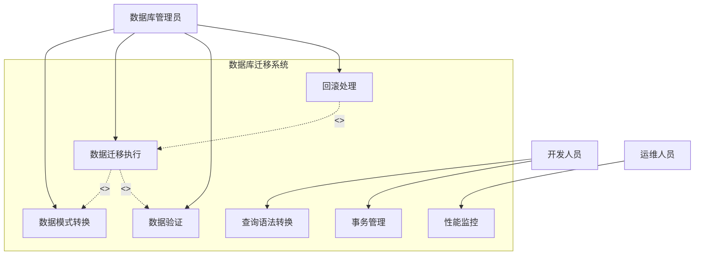

### 2.3 业务功能定义

| 模块 | 功能点 | 业务规则说明 |
|------|--------|-------------|
| 数据模式转换 | MongoDB集合转MariaDB表 | 将MongoDB的10个集合迁移到10张主表，并在迁移过程中拆分生成4张派生关系表，共14张业务表 |
| | 字段名转换 | camelCase/PascalCase → f_snake_case（如userId → f_user_id） |
| | 数据类型映射 | ObjectId → BIGINT UNSIGNED，嵌套对象/数组 → TEXT、MEDIUMTEXT 或 LONGTEXT(JSON) |
| | 索引创建 | 索引在 MariaDB DDL 中随建表语句一并创建，覆盖主键、高频查询和组合查询场景 |
| 查询语法转换 | BSON查询转SQL | 支持$eq, $ne, $gt, $gte, $lt, $lte, $in, $nin等操作符 |
| | 逻辑操作符转换 | $and → AND, $or → OR, $not → NOT |
| | 正则表达式转换 | $regex → LIKE模式匹配 |
| | 复杂查询支持 | 支持嵌套查询、分页、排序、聚合 |
| 数据迁移执行 | 按脚本映射顺序迁移 | 按 `dag → dag_version → dag_instance → task_instance → token → inbox → client → switch → log → outbox` 顺序迁移，其中 `dag` 和 `dag_instance` 会同步拆分子表 |
| | 批量数据迁移 | 使用固定批大小1000读取 MongoDB，并通过 `executemany` 批量写入 MariaDB |
| | 进度跟踪 | 按表输出 `scanned / inserted / skipped / failed` 统计日志 |
| | 幂等重入 | 写入前按主键查询已存在记录，重复执行时自动跳过已迁移数据 |
| 事务支持 | ACID事务 | 支持BEGIN、COMMIT、ROLLBACK操作 |
| | 多表原子操作 | 在同一事务中创建DAG实例和关联记录 |
| | 事务超时处理 | 超时自动回滚 |
| 数据验证 | 数据总数验证 | 验证迁移前后记录数一致 |
| | 字段值验证 | 对比关键字段的数据值 |
| | 外键完整性验证 | 验证关联关系完整性 |
| | JSON结构验证 | 验证JSON字段的结构完整性 |

### 2.4 功能流程图

#### 2.4.1 数据迁移主流程

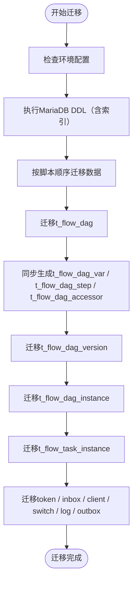

#### 2.4.2 查询转换流程

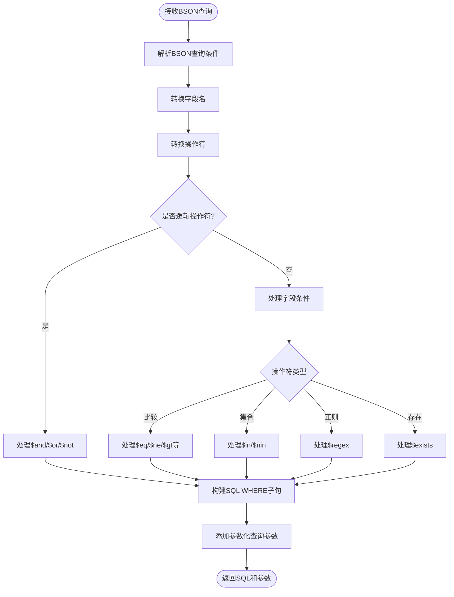

#### 2.4.3 事务处理流程

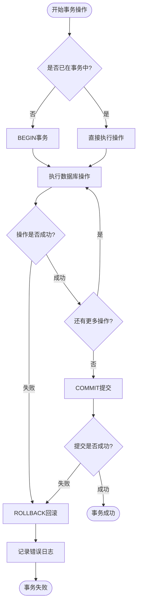

## 三、模块(服务)设计

### 3.1 集成架构设计(Context)

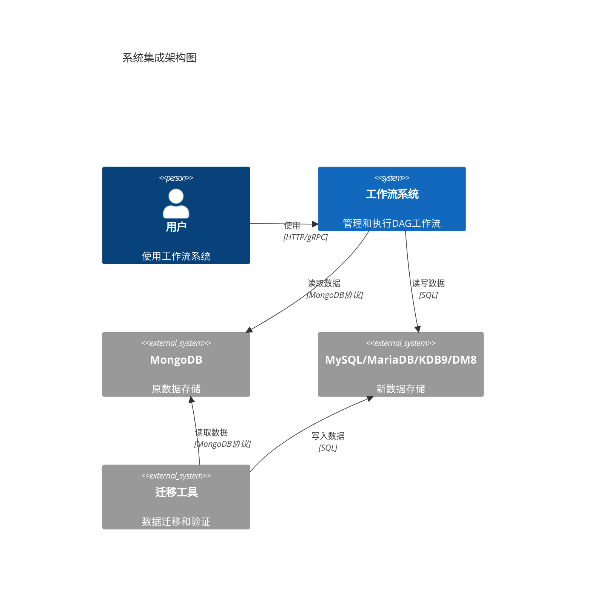

### 3.2 服务架构设计(Container)

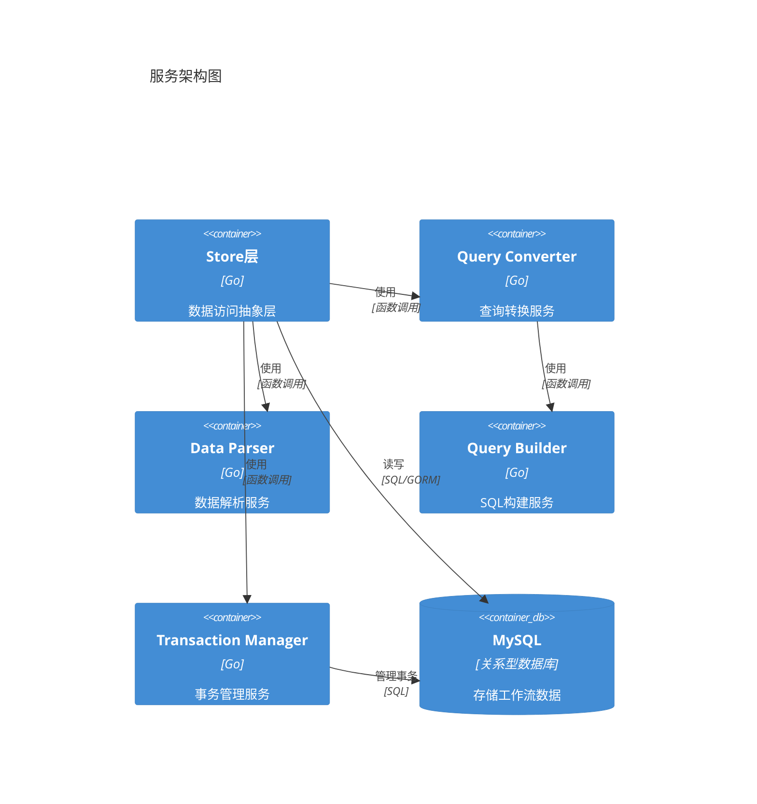

### 3.3 组件设计(Component)

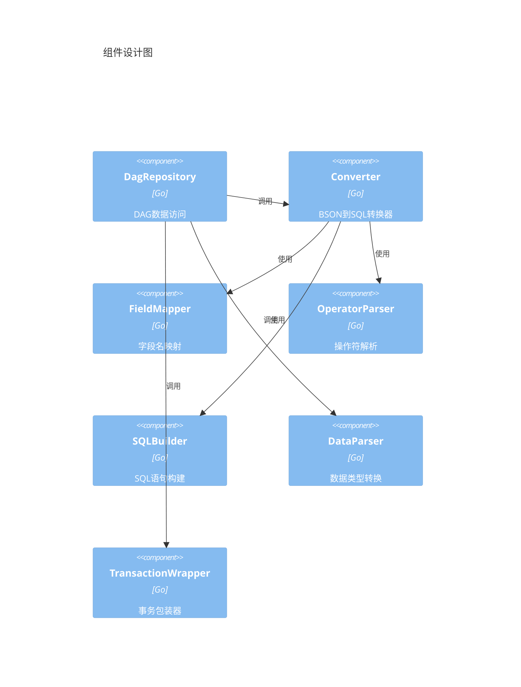

**核心组件说明：**

1. **Converter（查询转换器）**

   - 职责：将MongoDB BSON查询转换为SQL查询
   - 输入：bson.M / map[string]interface{}
   - 输出：SQL字符串 + 参数列表
   - 关键方法：
     - `Convert(query interface{}) (*Result, error)` - 转换完整查询
     - `ConvertConds(query interface{}) (*Result, error)` - 仅转换条件部分
     - `parseCondition()` - 解析查询条件
     - `parseOperator()` - 解析操作符
2. **FieldMapper（字段映射器）**

   - 职责：将MongoDB字段名转换为MariaDB字段名
   - 转换规则：camelCase → f_snake_case
   - 示例：userId → f_user_id, createdAt → f_created_at
   - 支持自定义映射表
3. **DataParser（数据解析器）**

   - 职责：在Entity和Model之间转换数据
   - 关键方法：
     - `ToDagModel()` - Entity转Model
     - `ToEntity()` - Model转Entity
     - `copyFields()` - 字段复制和类型转换
   - 支持JSON序列化/反序列化
4. **TransactionWrapper（事务包装器）**

   - 职责：管理数据库事务
   - 关键方法：
     - `WithTransaction()` - 执行事务
     - `Begin()` - 开始事务
     - `Commit()` - 提交事务
     - `Rollback()` - 回滚事务

### 3.4 关键流程设计（Sequence）

#### 3.4.1 查询转换时序图

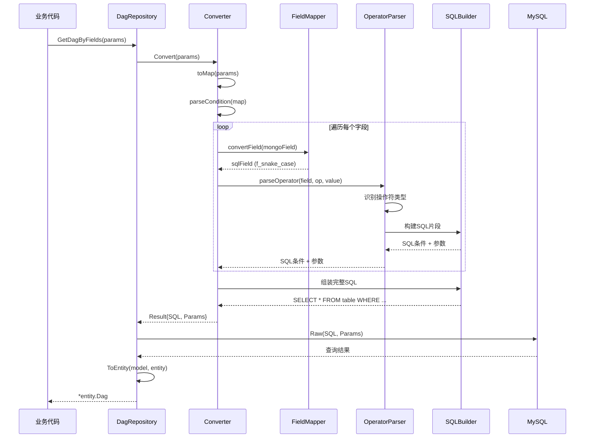

#### 3.4.2 事务处理时序图

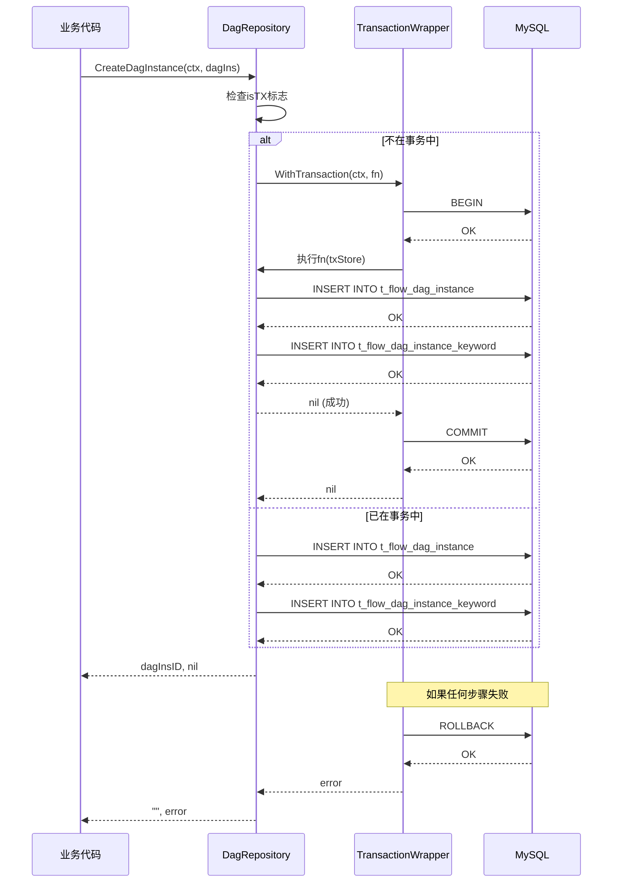

#### 3.4.3 数据迁移时序图

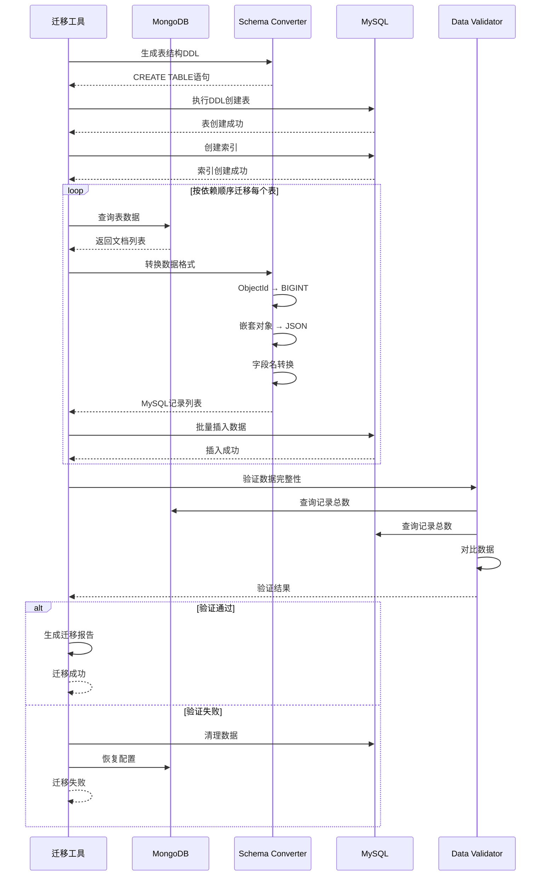

## 四、接口设计

### 4.1 Store接口定义

```go
// Store 数据访问接口
type Store interface {
    	Closer
	WithTransaction(ctx context.Context, fn func(context.Context, Store) error) error
	CreateToken(token *entity.Token) error
	UpdateToken(token *entity.Token) error
	DeleteToken(id string) error
	GetTokenByUserID(userID string) (*entity.Token, error)
	CreateClient(clientName, clientID, clientSecret string) error
	GetClient(clientName string) (client *entity.Client, err error)
	RemoveClient(clientName string) (err error)
	CreateDag(ctx context.Context, dag *entity.Dag) (string, error)
	BatchCreateDag(ctx context.Context, dags []*entity.Dag) ([]*entity.Dag, error)
	CreateDagIns(ctx context.Context, dagIns *entity.DagInstance) (string, error)
	BatchCreateDagIns(ctx context.Context, dagIns []*entity.DagInstance) ([]*entity.DagInstance, error)
	BatchDeleteDagIns(ctx context.Context, ids []string) error
	CreateTaskIns(ctx context.Context, taskIns *entity.TaskInstance) error
	BatchCreateTaskIns(ctx context.Context, taskIns []*entity.TaskInstance) ([]*entity.TaskInstance, error)
	PatchTaskIns(ctx context.Context, taskIns *entity.TaskInstance) error
	PatchDagIns(ctx context.Context, dagIns *entity.DagInstance, mustsPatchFields ...string) error
	UpdateDag(ctx context.Context, dagIns *entity.Dag) error
	UpdateDagIncValue(ctx context.Context, dagId string, incKey string, incValue any) error
	UpdateDagIns(ctx context.Context, dagIns *entity.DagInstance) error
	UpdateTaskIns(ctx context.Context, taskIns *entity.TaskInstance) error
	BatchUpdateDagIns(ctx context.Context, dagIns []*entity.DagInstance) error
	BatchUpdateTaskIns(taskIns []*entity.TaskInstance) error
	BatchDeleteTaskIns(ctx context.Context, ids []string) error
	GetTaskIns(ctx context.Context, taskIns string) (*entity.TaskInstance, error)
	GetDag(ctx context.Context, dagId string) (*entity.Dag, error)
	GetDagByFields(ctx context.Context, params map[string]interface{}) (*entity.Dag, error)
	GetDagWithOptionalVersion(ctx context.Context, dagID, versionID string) (*entity.Dag, error)
	GetDagInstance(ctx context.Context, dagInsId string) (*entity.DagInstance, error)
	GetDagInstanceByFields(ctx context.Context, params map[string]interface{}) (*entity.DagInstance, error)
	ListDag(ctx context.Context, input *ListDagInput) ([]*entity.Dag, error)
	ListDagByFields(ctx context.Context, filter bson.M, opt options.FindOptions) ([]*entity.Dag, error)
	ListDagInstance(ctx context.Context, input *ListDagInstanceInput) ([]*entity.DagInstance, error)
	DisdinctDagInstance(input *ListDagInstanceInput) ([]interface{}, error)
	ListTaskInstance(ctx context.Context, input *ListTaskInstanceInput) ([]*entity.TaskInstance, error)
	Marshal(obj interface{}) ([]byte, error)
	Unmarshal(bytes []byte, ptr interface{}) error
	BatchDeleteDagWithTransaction(ctx context.Context, ids []string) error
	GetDagCount(ctx context.Context, params map[string]interface{}) (int64, error)
	ListDagCount(ctx context.Context, input *ListDagInput) (int64, error)
	ListDagCountByFields(ctx context.Context, filter bson.M) (int64, error)
	GetDagInstanceCount(ctx context.Context, params map[string]interface{}) (int64, error)
	CreateInbox(ctx context.Context, msg *entity.InBox) error
	DeleteInbox(ctx context.Context, ids []string) error
	GetInbox(ctx context.Context, id string) (*entity.InBox, error)
	ListInbox(ctx context.Context, input *ListInboxInput) ([]*entity.InBox, error)
	GetSwitchStatus() (bool, error)
	SetSwitchStatus(status bool) error
	CreateLogs(ctx context.Context, ossLogs []*entity.Log) error
	ListHistoryDagIns(ctx context.Context, params map[string]interface{}, dataChannel chan []bson.M) error
	ListHistoryTaskIns(ctx context.Context, params map[string]interface{}, dataChannel chan []bson.M) error
	DeleteDagInsByID(ctx context.Context, params map[string]interface{}) error
	DeleteTaskInsByID(ctx context.Context, params map[string]interface{}) error
	DeleteTaskInsByDagInsID(ctx context.Context, dagInsID string) error
	GetTaskInstanceCount(ctx context.Context, params map[string]interface{}) (int64, error)
	CreatOutBoxMessage(ctx context.Context, outBox *entity.OutBox) error
	BatchCreatOutBoxMessage(ctx context.Context, outBox []*entity.OutBox) error
	DeleteOutBoxMessage(ctx context.Context, ids []string) error
	ListOutBoxMessage(ctx context.Context, input *entity.OutBoxInput) ([]*entity.OutBox, error)
	ListDagInstanceInRangeTime(ctx context.Context, status string, begin, end int64) ([]*entity.DagInstance, error)
	ListExistDagInsID(ctx context.Context, dagInsIDs []string) ([]string, error)
	ListExistDagID(ctx context.Context, dagIDs []string) ([]string, error)
	GroupDagInstance(ctx context.Context, input *GroupInput) ([]*entity.DagInstanceGroup, error)
	RetryDagIns(ctx context.Context, dagInsID string, taskInsIDs []string) error

	DeleteDag(ctx context.Context, id ...string) error
	CreateDagVersion(ctx context.Context, dagVersion *entity.DagVersion) (string, error)
	ListDagVersions(ctx context.Context, input *ListDagVersionInput) ([]entity.DagVersion, error)
	GetHistoryDagByVersionID(ctx context.Context, dagID, versionID string) (*entity.DagVersion, error)
}
```

### 4.2 查询转换器接口

```go
// Converter BSON查询转SQL转换器
type Converter struct {
    tableName   string
    fieldMap    map[string]string
    autoConvert bool
}

// Result 转换结果
type Result struct {
    SQL    string          // 完整SQL语句
    Conds  string          // WHERE条件部分
    Params []interface{}   // 参数化查询参数
}

// Convert 转换完整查询（包含SELECT）
func (c *Converter) Convert(query interface{}) (*Result, error)

// ConvertConds 仅转换条件部分
func (c *Converter) ConvertConds(query interface{}) (*Result, error)
```

### 4.3 查询输入参数定义

```go
// ListDagInput DAG列表查询参数
type ListDagInput struct {
    UserID         string                 // 用户ID
    Accessors      []string               // 访问者列表
    Scope          string                 // 查询范围：all/user
    Filter         map[string]interface{} // BSON过滤条件
    Sort           map[string]int         // 排序：1升序，-1降序
    Limit          int64                  // 分页大小
    Offset         int64                  // 偏移量
    ProjectFields  []string               // 投影字段
}

// ListDagInstanceInput DAG实例列表查询参数
type ListDagInstanceInput struct {
    DagID          string                 // DAG ID
    UserID         string                 // 用户ID
    Status         []string               // 状态列表
    Filter         map[string]interface{} // BSON过滤条件
    Sort           map[string]int         // 排序
    Limit          int64                  // 分页大小
    Offset         int64                  // 偏移量
}
```

## 五、数据库设计

### 5.1 表结构定义

#### 5.1.1 t_flow_dag（工作流定义表）

| 字段名 | 类型 | 约束 | 说明 |
|--------|------|------|------|
| f_id | BIGINT UNSIGNED | PRIMARY KEY | 主键ID |
| f_created_at | BIGINT | NOT NULL DEFAULT 0 | 创建时间（Unix时间戳） |
| f_updated_at | BIGINT | NOT NULL DEFAULT 0 | 更新时间（Unix时间戳） |
| f_user_id | VARCHAR(40) | NOT NULL, INDEX | 用户ID |
| f_name | VARCHAR(255) | NOT NULL, INDEX | 工作流名称 |
| f_desc | VARCHAR(310) | NOT NULL DEFAULT '' | 描述 |
| f_trigger | VARCHAR(20) | NOT NULL DEFAULT '', INDEX | 触发器类型 |
| f_cron | VARCHAR(64) | | Cron表达式 |
| f_vars | MEDIUMTEXT | | 变量定义（JSON） |
| f_status | VARCHAR(16) | NOT NULL DEFAULT '' | 状态 |
| f_tasks | MEDIUMTEXT | | 任务列表（JSON） |
| f_steps | MEDIUMTEXT | | 步骤列表（JSON） |
| f_description | VARCHAR(310) | NOT NULL DEFAULT '' | 详细描述 |
| f_shortcuts | TEXT | | 快捷方式（JSON） |
| f_accessors | TEXT | | 访问者列表（JSON） |
| f_type | VARCHAR(32) | NOT NULL DEFAULT '', INDEX | 类型 |
| f_policy_type | VARCHAR(32) | | 策略类型 |
| f_appinfo | TEXT | | 应用信息（JSON） |
| f_priority | VARCHAR(16) | | 优先级 |
| f_removed | BOOLEAN | NOT NULL DEFAULT 0 | 是否删除 |
| f_emails | TEXT | | 邮件列表（JSON） |
| f_template | VARCHAR(32) | | 模板 |
| f_published | BOOLEAN | NOT NULL DEFAULT 0 | 是否发布 |
| f_trigger_config | TEXT | | 触发器配置详情（JSON） |
| f_sub_ids | TEXT | | 子流程ID列表（JSON） |
| f_exec_mode | VARCHAR(8) | | 执行模式 |
| f_category | VARCHAR(64) | | 分类 |
| f_outputs | MEDIUMTEXT | | 输出定义（JSON） |
| f_instructions | MEDIUMTEXT | | 指令（JSON） |
| f_operator_id | VARCHAR(40) | | 操作者ID |
| f_inc_values | VARCHAR(4096) | | 增量值 |
| f_version | VARCHAR(64) | | 版本信息 |
| f_version_id | VARCHAR(20) | | 版本ID |
| f_modify_by | VARCHAR(40) | | 修改者 |
| f_is_debug | BOOLEAN | NOT NULL DEFAULT 0 | 是否调试模式 |
| f_debug_id | VARCHAR(20) | | 调试ID |
| f_biz_domain_id | VARCHAR(40) | INDEX | 业务域ID |

**索引：**

- PRIMARY KEY (f_id)
- INDEX idx_dag_user_id (f_user_id)
- INDEX idx_dag_type (f_type)
- INDEX idx_dag_trigger (f_trigger)
- INDEX idx_dag_name (f_name)
- INDEX idx_dag_biz_domain (f_biz_domain_id)

#### 5.1.2 t_flow_dag_instance（工作流实例表）

| 字段名 | 类型 | 约束 | 说明 |
|--------|------|------|------|
| f_id | BIGINT UNSIGNED | PRIMARY KEY | 主键ID |
| f_created_at | BIGINT | NOT NULL DEFAULT 0 | 创建时间 |
| f_updated_at | BIGINT | NOT NULL DEFAULT 0 | 更新时间 |
| f_dag_id | BIGINT UNSIGNED | NOT NULL, INDEX | DAG ID（外键） |
| f_trigger | VARCHAR(20) | NOT NULL DEFAULT '' | 触发方式 |
| f_worker | VARCHAR(32) | NOT NULL DEFAULT '', INDEX | 执行节点 |
| f_source | TEXT | | 来源 |
| f_vars | MEDIUMTEXT | | 变量（JSON） |
| f_keywords | TEXT | | 关键词（JSON） |
| f_event_persistence | TINYINT UNSIGNED | NOT NULL DEFAULT 0 | 事件持久化 |
| f_event_oss_path | VARCHAR(255) | | 事件OSS路径 |
| f_share_data | MEDIUMTEXT | | 共享数据（JSON） |
| f_share_data_ext | MEDIUMTEXT | | 共享数据扩展（JSON） |
| f_status | VARCHAR(32) | NOT NULL, INDEX | 状态 |
| f_reason | TEXT | | 失败原因 |
| f_cmd | TEXT | | 命令（JSON） |
| f_has_cmd | BOOLEAN | NOT NULL DEFAULT 0 | 是否有命令 |
| f_batch_run_id | VARCHAR(20) | INDEX | 批次运行ID |
| f_user_id | VARCHAR(40) | NOT NULL, INDEX | 用户ID |
| f_ended_at | BIGINT | NOT NULL DEFAULT 0 | 结束时间 |
| f_dag_type | VARCHAR(32) | | DAG类型 |
| f_policy_type | VARCHAR(32) | | 策略类型 |
| f_appinfo | TEXT | | 应用信息（JSON） |
| f_priority | VARCHAR(16) | | 优先级 |
| f_mode | TINYINT UNSIGNED | NOT NULL DEFAULT 0 | 模式 |
| f_dump | LONGTEXT | | 转储信息 |
| f_dump_ext | LONGTEXT | | 转储扩展（JSON） |
| f_success_callback | VARCHAR(1024) | | 成功回调 |
| f_error_callback | VARCHAR(1024) | | 错误回调 |
| f_call_chain | TEXT | | 调用链（JSON） |
| f_resume_data | TEXT | | 恢复数据 |
| f_resume_status | VARCHAR(64) | | 恢复状态 |
| f_version | VARCHAR(64) | | 版本 |
| f_version_id | VARCHAR(20) | | 版本ID |
| f_biz_domain_id | VARCHAR(40) | | 业务域ID |

**索引：**

- PRIMARY KEY (f_id)
- INDEX idx_dag_ins_dag_status (f_dag_id, f_status)
- INDEX idx_dag_ins_status_upd (f_status, f_updated_at)
- INDEX idx_dag_ins_status_user_pri (f_status, f_user_id, f_priority)
- INDEX idx_dag_ins_user_id (f_user_id)
- INDEX idx_dag_ins_batch_run (f_batch_run_id)
- INDEX idx_dag_ins_worker (f_worker)

#### 5.1.3 t_flow_task_instance（任务实例表）

| 字段名 | 类型 | 约束 | 说明 |
|--------|------|------|------|
| f_id | BIGINT UNSIGNED | PRIMARY KEY | 主键ID |
| f_created_at | BIGINT | NOT NULL DEFAULT 0 | 创建时间 |
| f_updated_at | BIGINT | NOT NULL DEFAULT 0 | 更新时间 |
| f_expired_at | BIGINT | NOT NULL DEFAULT 0 | 过期时间 |
| f_task_id | VARCHAR(64) | NOT NULL | 任务ID |
| f_dag_ins_id | BIGINT UNSIGNED | NOT NULL, INDEX | DAG实例ID（外键） |
| f_name | VARCHAR(255) | | 任务名称 |
| f_depend_on | VARCHAR(255) | | 依赖关系 |
| f_action_name | VARCHAR(255) | INDEX | 动作名称 |
| f_timeout_secs | BIGINT | | 超时时间（秒） |
| f_params | MEDIUMTEXT | | 参数（JSON） |
| f_traces | MEDIUMTEXT | | 追踪信息（JSON） |
| f_status | VARCHAR(32) | NOT NULL | 状态 |
| f_reason | MEDIUMTEXT | | 失败原因 |
| f_pre_checks | TEXT | | 前置检查（JSON） |
| f_results | MEDIUMTEXT | | 结果（JSON） |
| f_steps | MEDIUMTEXT | | 步骤（JSON） |
| f_last_modified_at | BIGINT UNSIGNED | | 最后修改时间 |
| f_rendered_params | LONGTEXT | | 渲染后参数（JSON） |
| f_hash | VARCHAR(64) | INDEX | 哈希值 |
| f_settings | LONGTEXT | | 设置（JSON） |
| f_metadata | LONGTEXT | | 元数据（JSON） |

**索引：**

- PRIMARY KEY (f_id)
- INDEX idx_task_ins_dag_ins_id (f_dag_ins_id)
- INDEX idx_task_ins_hash (f_hash)
- INDEX idx_task_ins_action (f_action_name)
- INDEX idx_task_ins_status_expire (f_status, f_expired_at)
- INDEX idx_task_ins_status_upd_id (f_status, f_updated_at, f_id)

#### 5.1.4 t_flow_dag_var（DAG变量表）

| 字段名 | 类型 | 约束 | 说明 |
|--------|------|------|------|
| f_id | BIGINT UNSIGNED | PRIMARY KEY | 主键ID |
| f_dag_id | BIGINT UNSIGNED | NOT NULL, INDEX | DAG ID（外键） |
| f_var_name | VARCHAR(255) | NOT NULL | 变量名 |
| f_default_value | TEXT | | 默认值 |
| f_var_type | VARCHAR(16) | | 变量类型 |
| f_description | TEXT | | 描述 |

**索引：**

- PRIMARY KEY (f_id)
- INDEX idx_dag_vars_dag_id (f_dag_id)

#### 5.1.5 其他辅助表

**t_flow_dag_version（DAG版本表）**

- f_id (BIGINT UNSIGNED, PRIMARY KEY)
- f_created_at (BIGINT)
- f_updated_at (BIGINT)
- f_dag_id (VARCHAR(20))
- f_user_id (VARCHAR(40))
- f_version (VARCHAR(64))
- f_version_id (VARCHAR(20))
- f_change_log (VARCHAR(512))
- f_config (LONGTEXT) - 完整DAG配置JSON
- f_sort_time (BIGINT)
- INDEX idx_dag_versions_dag_version (f_version_id, f_dag_id)
- INDEX idx_dag_versions_dag_sort (f_dag_id, f_sort_time)

**t_flow_dag_step（DAG步骤索引表）**

- f_id (BIGINT UNSIGNED, PRIMARY KEY)
- f_dag_id (BIGINT UNSIGNED)
- f_operator (VARCHAR(255))
- f_source_id (TEXT)
- f_has_datasource (BOOLEAN)
- INDEX idx_dag_step_op (f_operator)
- INDEX idx_dag_step_op_dag (f_dag_id, f_operator)
- INDEX idx_dag_step_has_ds_dag (f_dag_id, f_has_datasource)

**t_flow_dag_accessor（DAG访问者表）**

- f_id (BIGINT UNSIGNED, PRIMARY KEY)
- f_dag_id (BIGINT UNSIGNED)
- f_accessor_id (VARCHAR(40))
- INDEX idx_dag_accessor_id_dag (f_accessor_id, f_dag_id)

**t_flow_dag_instance_keyword（实例关键词表）**

- f_id (BIGINT UNSIGNED, PRIMARY KEY)
- f_dag_ins_id (BIGINT UNSIGNED)
- f_keyword (VARCHAR(255))
- INDEX idx_dag_ins_kw (f_dag_ins_id, f_keyword)

**t_flow_inbox（入站消息表）**

- f_id (BIGINT UNSIGNED, PRIMARY KEY)
- f_created_at (BIGINT)
- f_updated_at (BIGINT)
- f_msg (MEDIUMTEXT)
- f_topic (VARCHAR(128))
- f_docid (VARCHAR(512))
- f_dag (TEXT)
- INDEX idx_inbox_docid (f_docid)
- INDEX idx_inbox_topic_created (f_topic, f_created_at)

**t_flow_outbox（出站消息表）**

- f_id (BIGINT UNSIGNED, PRIMARY KEY)
- f_created_at (BIGINT)
- f_updated_at (BIGINT)
- f_msg (MEDIUMTEXT)
- f_topic (VARCHAR(128))
- INDEX idx_outbox_created (f_created_at)

**t_flow_token（令牌表）**

- f_id (BIGINT UNSIGNED, PRIMARY KEY)
- f_created_at (BIGINT)
- f_updated_at (BIGINT)
- f_user_id (VARCHAR(40))
- f_user_name (VARCHAR(255))
- f_refresh_token (TEXT)
- f_token (TEXT)
- f_expires_in (INT)
- f_login_ip (VARCHAR(64))
- f_is_app (BOOLEAN)
- INDEX idx_token_user_id (f_user_id)

**t_flow_client（客户端表）**

- f_id (BIGINT UNSIGNED, PRIMARY KEY)
- f_created_at (BIGINT)
- f_updated_at (BIGINT)
- f_client_name (VARCHAR(64))
- f_client_id (VARCHAR(40))
- f_client_secret (VARCHAR(16))
- INDEX idx_client_name (f_client_name)

**t_flow_switch（开关表）**

- f_id (BIGINT UNSIGNED, PRIMARY KEY)
- f_created_at (BIGINT)
- f_updated_at (BIGINT)
- f_name (VARCHAR(255))
- f_status (BOOLEAN)
- INDEX idx_switch_name (f_name)

**t_flow_log（日志表）**

- f_id (BIGINT UNSIGNED, PRIMARY KEY)
- f_created_at (BIGINT)
- f_updated_at (BIGINT)
- f_ossid (VARCHAR(64))
- f_key (VARCHAR(40))
- f_filename (VARCHAR(255))

### 5.2 字段命名规范

**转换规则：**

1. MongoDB字段名（camelCase/PascalCase）→ MariaDB字段名（f_snake_case）
2. 所有字段名添加 `f_` 前缀
3. 驼峰命名转下划线分隔

**转换示例：**

- `_id` → `f_id`
- `userId` → `f_user_id`
- `createdAt` → `f_created_at`
- `batchRunID` → `f_batch_run_id`
- `HTMLParser` → `f_html_parser`
- `dagInsID` → `f_dag_ins_id`

**当前迁移脚本实现方式：**

- 当前 `migrations/mariadb/0.4.0/pre/02-mongodb_to_mysql_migration.py` 未采用运行时通用字段名转换器
- 迁移脚本通过 `build_*_row` / `build_*_rows` 函数对每张表做显式字段映射，确保 MariaDB 列名、默认值和派生字段与 DDL 保持一致
- `_id`、`dagId`、`dagInsId` 等主键或关联键在无法直接转成无符号整数时，会基于稳定哈希生成 `BIGINT UNSIGNED` 主键值

### 5.3 数据类型映射规则

| MongoDB类型 | MariaDB类型 | 说明 |
|------------|-----------|------|
| ObjectId | BIGINT UNSIGNED | 转换为数值ID |
| String (短) | VARCHAR(16/20/32/40/64/128/255/512/1024) | 按字段语义和实际长度精确收敛 |
| String (长) | TEXT / MEDIUMTEXT / LONGTEXT | 按真实内容长度选择，避免统一使用LONGTEXT |
| Number (整数) | INT / BIGINT | 根据范围选择 |
| Number (浮点) | DOUBLE | 浮点数 |
| Boolean | BOOLEAN / TINYINT(1) | 布尔值 |
| Date | BIGINT | Unix时间戳（毫秒） |
| Array | TEXT / MEDIUMTEXT / LONGTEXT | JSON格式存储 |
| Object (嵌套) | TEXT / MEDIUMTEXT / LONGTEXT | JSON格式存储 |
| Binary | BLOB | 二进制数据 |
| Null | NULL | 空值 |

**JSON字段处理：**

- 嵌套对象和数组按实际体量选择 TEXT、MEDIUMTEXT 或 LONGTEXT，不再统一使用 LONGTEXT
- 迁移脚本使用 Python `json.dumps(..., ensure_ascii=False, default=str)` 将对象、数组、集合统一序列化为 JSON 字符串
- 目标库保留文本型 JSON 存储方式，便于兼容现有 MariaDB DDL

**时间戳处理：**

- MongoDB的Date类型转换为Unix时间戳（毫秒）
- 存储为BIGINT类型
- 便于范围查询和排序

### 5.4 索引设计

**索引设计原则：**

1. 为所有主键创建PRIMARY KEY索引
2. 为外键字段创建普通索引
3. 为高频查询字段创建索引
4. 为组合查询创建复合索引
5. 避免创建冗余索引

**关键索引列表：**

**t_flow_dag表：**

- PRIMARY KEY (f_id)
- INDEX idx_dag_user_id (f_user_id) - 按用户查询
- INDEX idx_dag_type (f_type) - 按类型查询
- INDEX idx_dag_trigger (f_trigger) - 按触发方式查询
- INDEX idx_dag_name (f_name) - 按名称查询
- INDEX idx_dag_biz_domain (f_biz_domain_id) - 按业务域查询

**t_flow_dag_instance表：**

- PRIMARY KEY (f_id)
- INDEX idx_dag_ins_dag_status (f_dag_id, f_status) - 按DAG和状态查询实例
- INDEX idx_dag_ins_status_upd (f_status, f_updated_at) - 按状态和更新时间拉取任务
- INDEX idx_dag_ins_status_user_pri (f_status, f_user_id, f_priority) - 按状态、用户和优先级筛选
- INDEX idx_dag_ins_user_id (f_user_id) - 按用户查询
- INDEX idx_dag_ins_batch_run (f_batch_run_id) - 批次查询
- INDEX idx_dag_ins_worker (f_worker) - 按执行节点查询

**t_flow_task_instance表：**

- PRIMARY KEY (f_id)
- INDEX idx_task_ins_dag_ins_id (f_dag_ins_id) - 按DAG实例查询任务
- INDEX idx_task_ins_hash (f_hash) - 按哈希值查询
- INDEX idx_task_ins_action (f_action_name) - 按动作名称查询
- INDEX idx_task_ins_status_expire (f_status, f_expired_at) - 按状态和过期时间清理查询
- INDEX idx_task_ins_status_upd_id (f_status, f_updated_at, f_id) - 按状态和更新时间分页扫描

**t_flow_dag_step表：**

- PRIMARY KEY (f_id)
- INDEX idx_dag_step_op (f_operator) - 按操作符查询
- INDEX idx_dag_step_op_dag (f_dag_id, f_operator) - 按DAG和操作符查询
- INDEX idx_dag_step_has_ds_dag (f_dag_id, f_has_datasource) - 按是否含数据源查询

**t_flow_dag_instance_keyword表：**

- PRIMARY KEY (f_id)
- INDEX idx_dag_ins_kw (f_dag_ins_id, f_keyword) - 按实例和关键词联合查询

## 六、质量目标

### 6.1 可靠性

| 目标 | 指标 |
|------|------|
| 数据不丢失 | 迁移后数据总数与MongoDB一致，误差率0% |
| 事务ACID | 所有事务操作满足原子性、一致性、隔离性、持久性 |
| 故障恢复 | 支持自动回滚，迁移失败后可恢复到原始状态 |
| 连接可靠性 | 数据库连接断开时自动重连，最多重试3次 |
| 数据一致性 | 外键关联关系完整性100% |

### 6.2 性能

接口性能依照实际情况考虑，下表仅参考
| 场景 | 配置 | 目标 |
|------|------|------|
| 列表查询 | 数据量<10000条 | 响应时间 ≤ 500ms |
| 单条查询 | 按主键查询 | 响应时间 ≤ 50ms |
| 创建DAG实例 | 单条插入 | 响应时间 ≤ 200ms |
| 批量创建实例 | 100条批量插入 | 响应时间 ≤ 2s |
| 复杂查询 | 多条件+排序+分页 | 响应时间 ≤ 1s |
| 数据迁移 | 10万条记录 | 迁移时间 ≤ 10分钟 |
| 并发查询 | 100并发 | TPS ≥ 200 |

### 6.3 兼容性

**数据库兼容性：**

- MariaDB 10.3+
- KDB9（人大金仓）
- DM8（达梦数据库）

**系统架构：**

- x86_64
- ARM64

**操作系统：**

- Linux (CentOS 7+, Ubuntu 18.04+)
- Windows Server 2016+

**编程语言：**

- Go 1.24+

### 6.4 安全性

| 维度 | 要求 |
|------|------|
| SQL注入防护 | 100%使用参数化查询，禁止字符串拼接SQL |
| 密码存储 | 数据库密码加密存储，不得明文记录 |
| 权限管理 | 使用最小权限原则，应用账号仅授予必要权限 |
| 审计日志 | 记录所有数据库操作的审计日志，包含用户、时间、操作类型 |
| 数据传输 | 支持SSL/TLS加密连接 |
| 敏感数据 | 迁移日志中不输出敏感数据（密码、密钥等） |

### 6.5 可观测性

**日志规范：**

- 程序日志记录完整，包含关键操作的输入输出
- 错误日志包含完整堆栈信息
- 日志级别：DEBUG、INFO、WARN、ERROR
- 日志格式：结构化JSON格式


**链路跟踪：**

- 支持OpenTelemetry链路跟踪
- 记录每个数据库操作的Span
- 包含SQL语句、参数、执行时间

### 6.6 可扩展性

| 维度 | 支持方式 |
|------|---------|
| 新增操作符 | 在Converter中添加新的parseOperator分支 |
| 新增数据库类型 | 实现数据库方言适配器接口 |
| 新增表结构 | 定义Model结构体和转换函数 |
| 自定义字段映射 | 通过WithFieldMap选项配置 |

## 七、部署&升级设计

### 7.1 部署架构

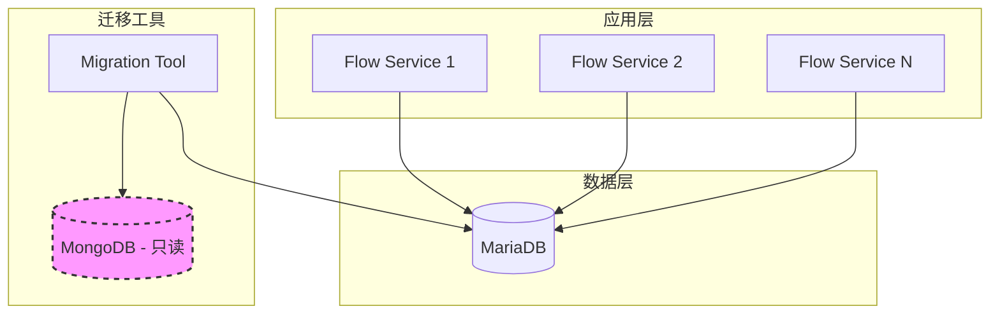

### 7.2 部署交付物

**应用程序：**

- dataflow:   服务包

**迁移工具：**

- `migrations/mariadb/0.4.0/pre/02-mongodb_to_mysql_migration.py` 迁移脚本
- `migrations/mariadb/0.4.0/pre/01-add-table-and-data.sql` 业务表 DDL
- `migrations/mariadb/0.4.0/pre/init.sql` MariaDB 初始化基线 DDL

**文档：**

- 部署指南
- 迁移操作手册
- 故障排查手册

### 7.3 迁移脚本配置

迁移脚本通过环境变量读取 MongoDB 和 MariaDB 连接信息，不再依赖独立的 `migration-config.yaml`。

| 变量名 | 是否必填 | 说明 |
|--------|----------|------|
| `MONGODB_HOST` | 是 | MongoDB 主机 |
| `MONGODB_PORT` | 是 | MongoDB 端口 |
| `MONGODB_USER` | 是 | MongoDB 用户 |
| `MONGODB_PASSWORD` | 是 | MongoDB 密码 |
| `MONGODB_AUTH_SOURCE` | 是 | MongoDB 认证库 |
| `MONGODB_DATABASE` | 否 | 源库名，默认 `automation` |
| `MONGODB_PREFIX` | 否 | 集合名前缀，默认 `flow` |
| `DB_HOST` | 是 | MariaDB 主机 |
| `DB_PORT` | 是 | MariaDB 端口 |
| `DB_USER` | 是 | MariaDB 用户 |
| `DB_PASSWD` | 是 | MariaDB 密码 |
| `DB_NAME` | 否 | 目标库名，默认 `adp` |

说明：

- `MONGODB_DATABASE` 兼容 `MONGO_DATABASE`
- `MONGODB_PREFIX` 兼容 `MONGO_PREFIX`、`STORE_PREFIX`
- `DB_NAME` 兼容 `DB_DATABASE`、`MYSQL_DATABASE`
- 脚本默认批量大小固定为 `1000`

执行示例：

```bash
export MONGODB_HOST=127.0.0.1
export MONGODB_PORT=28000
export MONGODB_USER=anyshare
export MONGODB_PASSWORD='***'
export MONGODB_AUTH_SOURCE=anyshare
export DB_HOST=127.0.0.1
export DB_PORT=3306
export DB_USER=root
export DB_PASSWD='***'
python3 migrations/mariadb/0.4.0/pre/02-mongodb_to_mysql_migration.py
```


## 八、评审记录

评审：待评审

| 评审人 | 点评 | 评审结论 | 评审时间 |
|--------|------|---------|---------|
| | | | |
| | | | |
| | | | |

---

## 附录

### A. MongoDB操作符支持列表

| 操作符 | SQL转换 | 支持状态 |
|--------|---------|---------|
| $eq | = | ✓ |
| $ne | != | ✓ |
| $gt | > | ✓ |
| $gte | >= | ✓ |
| $lt | < | ✓ |
| $lte | <= | ✓ |
| $in | IN | ✓ |
| $nin | NOT IN | ✓ |
| $and | AND | ✓ |
| $or | OR | ✓ |
| $not | NOT | ✓ |
| $nor | NOT (... OR ...) | ✓ |
| $exists | IS NULL / IS NOT NULL | ✓ |
| $regex | LIKE | ✓ |
| $mod | % = | ✓ |
| $size | JSON_LENGTH | ✓ |
| $elemMatch | JSON查询 | 部分支持 |

### B. 字段名转换示例

| MongoDB字段名 | MariaDB字段名 | 说明 |
|--------------|-------------|------|
| _id | f_id | 去除下划线前缀 |
| id | f_id | 直接添加前缀 |
| name | f_name | 简单字段 |
| userId | f_user_id | 驼峰转下划线 |
| createdAt | f_created_at | 驼峰转下划线 |
| batchRunID | f_batch_run_id | 连续大写处理 |
| HTMLParser | f_html_parser | 连续大写处理 |
| myHTTPServer | f_my_http_server | 连续大写处理 |
| user_name | f_user_name | 已有下划线保持 |
| f_existing | f_existing | 已有f_前缀不重复 |

### C. 数据迁移依赖顺序

```
1. flow_dag -> t_flow_dag
   ├── 派生 t_flow_dag_var
   ├── 派生 t_flow_dag_step
   └── 派生 t_flow_dag_accessor

2. flow_dag_version -> t_flow_dag_version

3. flow_dag_instance -> t_flow_dag_instance
   └── 派生 t_flow_dag_instance_keyword

4. flow_task_instance -> t_flow_task_instance
5. flow_token -> t_flow_token
6. flow_inbox -> t_flow_inbox
7. flow_client -> t_flow_client
8. flow_switch -> t_flow_switch
9. flow_log -> t_flow_log
10. flow_outbox -> t_flow_outbox

说明：
- 默认集合名前缀为 `flow`，实际读取集合名为 `${MONGODB_PREFIX}_<suffix>`
- 当前 MariaDB 基准结构未单独创建 `t_flow_dag_trigger_config` 表，其数据保留在 `t_flow_dag.f_trigger_config` 字段中
- 写入前会按主键检查目标表，重复执行脚本时会跳过已迁移记录
```

### D. 参考文档

- [GORM文档](https://gorm.io/docs/)
- [MongoDB查询操作符](https://docs.mongodb.com/manual/reference/operator/query/)

```

```
