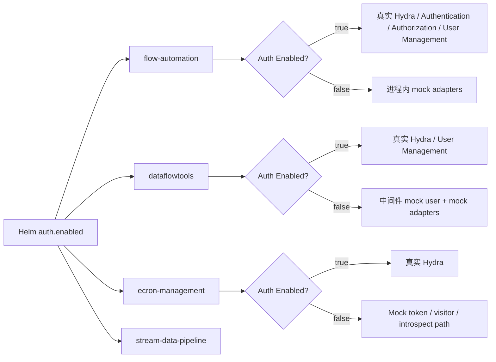
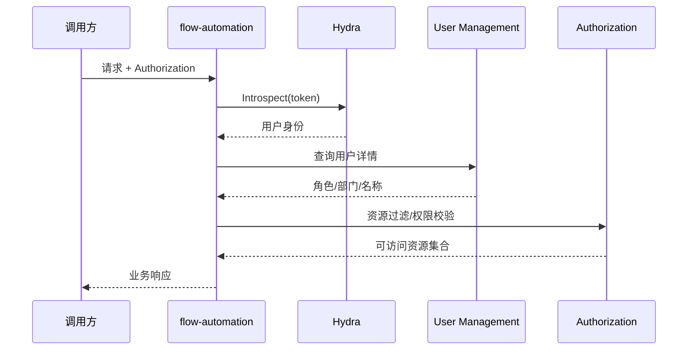
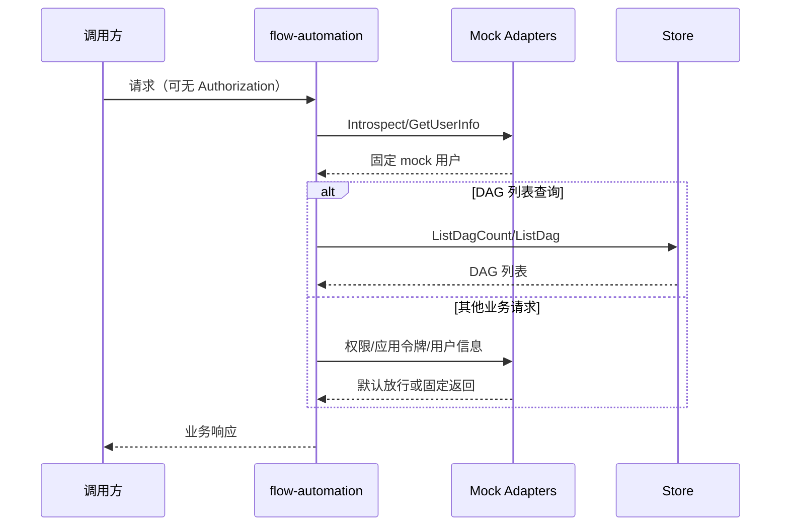

# #273 Dataflow解耦ISF 设计文档

## 1. 文档说明

- 需求名称：Dataflow 解耦 ISF 服务
- 对应提交：`6b5c278c1038d36a1a09b8b44431488a2cad003e`
- 提交时间：2026-03-18
- 适用范围：`flow-automation`、`coderunner/dataflowtools`、`pkg/ecron`、Helm 部署配置

本文统一将 Hydra、Authentication、Authorization、User Management 等认证与权限相关依赖统称为“ISF 服务”。

## 2. 背景与问题

Dataflow 当前在运行期强依赖 ISF 服务：

1. HTTP 请求入口需要依赖 Hydra 做 token introspection，并依赖 User Management 补全用户信息。
2. 数据流列表、资源操作、应用令牌申请依赖 Authorization、Authentication、Hydra。
3. `dataflowtools` 中间件和审计日志依赖 Hydra、User Management。
4. `ecron-management` 需要依赖 Hydra 进行 token 校验和版本探测。

这种强依赖会带来三个直接问题：

1. 本地开发、单机部署、开源最小化部署必须同时拉起整套 ISF 服务，启动成本高。
2. 任何一个身份服务不可用都会导致 Dataflow 核心链路不可用，系统韧性差。
3. 对于不需要多租户与细粒度权限的场景，Dataflow 无法以“最小依赖模式”独立运行。

## 3. 设计目标与非目标

### 3.1 设计目标

1. 通过单一开关控制 Dataflow 是否依赖 ISF。
2. 在关闭鉴权模式时，Dataflow 仍可完成基本的创建、查询、执行、定时任务等核心能力。
3. 默认行为保持兼容，未显式关闭时仍走原有真实 ISF 链路。
4. 不新增新的外部 mock 服务，优先在进程内通过 adapter 选择真实实现或 mock 实现。

### 3.2 非目标

1. 不重构现有认证鉴权体系，不改动对外 API 协议。
2. 不在关闭鉴权模式下继续保证原有的权限隔离与业务域隔离能力。
3. 不引入可配置的多用户、多角色 mock 数据模型，本次仅提供稳定的固定身份返回。

## 4. 总体方案

本次方案的核心是增加统一开关，并在各服务的 outbound adapter 层做运行时分流：

1. Helm 新增 `auth.enabled`，默认值为 `true`。
2. 该配置分别下发到：
   - `flow-automation`：`SERVER_AUTH_ENABLED`
   - `dataflowtools`：`AUTH_ENABLED`
   - `ecron-management`：`auth_enabled`
   - `flow-stream-data-pipeline`：`AUTH_ENABLED`
3. `flow-automation`、`dataflowtools`、`ecron` 在读取到“关闭鉴权”后，不再访问真实 ISF，而是返回固定 mock 数据。
4. 涉及权限过滤的查询场景，在关闭鉴权模式下直接走数据存储查询，绕过基于 ISF 的资源过滤。

## 5. 配置设计

### 5.1 配置项映射

| 模块 | 配置来源 | 运行时键 | 默认行为 |
|------|----------|----------|----------|
| Helm `dataflow` | `auth.enabled` | `SERVER_AUTH_ENABLED` | 默认 `true` |
| Helm `coderunner` | `auth.enabled` | `AUTH_ENABLED` | 默认 `true` |
| ecron yaml | `auth_enabled` | `ConfigLoader.AuthEnabled` | 未配置时按开启处理 |
| 本地开发 | `.env.local` | `SERVER_AUTH_ENABLED=false` | 本地默认关闭鉴权 |

### 5.2 默认值策略

本次提交里三个模块的默认值策略并不完全一致：

1. `flow-automation` 的 `IsAuthEnabled()` 将空值视为开启。
2. `pkg/ecron` 的 `authDisabled()` 仅在值为 `"false"` 时关闭。
3. `dataflowtools` 的 `is_auth_enable()` 将空值视为关闭。

因此部署层必须显式下发开关，不能依赖各语言实现的隐式默认值。这也是 Helm 模板同步补齐环境变量的原因。

## 6. 详细设计

### 6.1 flow-automation：通过 driven adapter 实现 ISF 旁路

#### 6.1.1 配置入口

`common/config.go` 在 `Server` 中新增 `AuthEnabled` 字段，并提供 `Config.IsAuthEnabled()`：

1. `true / 1 / yes / on / 空值` 视为开启。
2. 其他值视为关闭。

这样可以兼容历史配置，避免老部署因未配置新字段而被意外切到无鉴权模式。

#### 6.1.2 适配器分流

以下构造函数改为依据 `IsAuthEnabled()` 选择真实实现或 mock 实现：

1. `NewHydraAdmin()`
2. `NewHydraPublic()`
3. `NewAuthentication()`
4. `NewAuthorization()`
5. `NewUserManagement()`

关闭鉴权后的 mock 行为如下：

| 适配器 | 关闭鉴权后的行为 |
|--------|------------------|
| `mockHydraAdmin` | `Introspect` 恒返回 `active=true`、`mock-user-id`、`mock-client-id` |
| `mockHydraPublic` | 申请 token、refresh token、register client 全部返回固定 mock 数据 |
| `mockAuthentication` | `ConfigAuthPerm` 直接成功，`GetAssertion` 返回固定 JWT |
| `mockAuthorization` | 策略增删改直接成功，资源/操作校验默认放行 |
| `mockUserManagement` | 返回固定管理员用户、部门、应用、群组等信息 |

#### 6.1.3 HTTP 中间件链路的影响

`driveradapters/middleware/middleware.go` 本次没有直接修改，但由于底层适配器已被切换为 mock：

1. `TokenAuth()` 即使请求头中没有 `Authorization`，也能通过 mock introspection 拿到有效用户。
2. `UserManagement.GetUserInfo()` 会返回固定用户信息，保证 `user` 上下文可继续下传。
3. `CheckAdmin()`、`CheckAdminOrKnowledgeManager()` 依赖的角色信息来自 mock 用户，等效于默认管理员身份。

这意味着 `flow-automation` 入口没有显式“跳过中间件”，而是通过 adapter 透明降级。

#### 6.1.4 DAG 列表与权限过滤降级

`logics/mgnt/list.go` 增加了 `AuthEnable` 配置，并新增 `listDagsDirectly()`：

1. 开启鉴权时，继续走 `WithBizDomainFilter`、`WithPermissionFilter`、`WithExistenceFilter` 等过滤器链。
2. 关闭鉴权时，直接调用 `store.ListDagCount` 和 `store.ListDag`，跳过全部基于 ISF 的过滤器。

该设计的目的，是在没有真实用户、资源授权信息的情况下仍能完成 DAG 列表查询。

需要注意：

1. 关闭鉴权后，列表查询仍保留类型、关键字、排序、分页等数据层过滤。
2. 但业务域过滤和资源权限过滤会被一并旁路，适用于单租户或本地调试场景，不适用于生产安全场景。

### 6.2 dataflowtools：显式短路中间件与审计依赖

#### 6.2.1 配置入口

`common/configs.py` 新增 `is_auth_enable()`，读取 `AUTH_ENABLED`。

#### 6.2.2 Hydra 与 User Management 适配器

1. `drivenadapters/hydra.py` 在关闭鉴权时直接返回 mock introspection 结果。
2. `drivenadapters/user_management.py` 在关闭鉴权时返回固定用户、部门、联系人、应用名称集合。

#### 6.2.3 middleware 行为

`driveradapters/middleware.py` 在关闭鉴权时采取显式短路：

1. `CheckToken.check_token()` 不再要求 `Authorization` 请求头，直接构造固定 `UserInfo`。
2. `CheckAutomationAdmin.check_automation_admin()` 直接返回 `True`，不再访问自动化管理员服务。

相比 `flow-automation` 的“适配器透明降级”，这里采用的是“中间件显式短路”，因为 Python 侧原中间件会先校验请求头，如果不提前返回仍会在入口失败。

#### 6.2.4 审计日志兼容

`drivenadapters/log.py` 将 `build_audit_log` 改为异步，并在缺少 `parent_deps` 时通过 `await UserManagement().get_user_info()` 获取补充信息。

这样在关闭鉴权模式下，审计日志仍可用 mock 用户构造出稳定字段，避免日志链路报错。

### 6.3 pkg/ecron：调度子系统脱离 Hydra

#### 6.3.1 配置入口

`pkg/ecron/common/common.go` 的 `ConfigLoader` 新增 `AuthEnabled` 字段，对应 `cronsvr.yaml` 中的 `auth_enabled`。

#### 6.3.2 OAuthClient 降级

`pkg/ecron/utils/auth.go` 在关闭鉴权时提供以下能力：

1. `RequestToken()` 直接返回固定 token 和 1 小时有效期。
2. `VerifyToken()` 直接返回固定 `Visitor`，避免调用 Hydra introspect。
3. `VerifyHydraVersion()` 直接返回新版本 introspect 路径，避免做在线探测。

这保证了 ecron 在最小依赖模式下仍可完成任务调度、回调与内部授权判断。

## 7. 关键流程

### 7.1 鉴权开启流程

### 7.2 鉴权关闭流程

## 8. 兼容性与影响分析

### 8.1 兼容性

1. Helm 默认 `auth.enabled=true`，线上默认行为保持不变。
2. 旧环境若未下发新配置，`flow-automation` 与 `ecron` 仍按开启鉴权处理，不会破坏原链路。
3. 本地开发通过 `.env.local` 显式设置 `SERVER_AUTH_ENABLED=false`，可直接进入最小依赖模式。

### 8.2 影响

1. 关闭鉴权后，Dataflow 不再依赖 Hydra、Authentication、Authorization、User Management 即可启动核心链路。
2. 关闭鉴权后，用户身份、客户端、权限结果、应用令牌均为固定 mock 数据。
3. 关闭鉴权后，DAG 列表接口不再具备原有业务域与权限隔离能力。
4. 审计、日志、管理员判断将基于 mock 用户，适合开发、演示、开源版场景，不适合有安全边界要求的生产环境。
