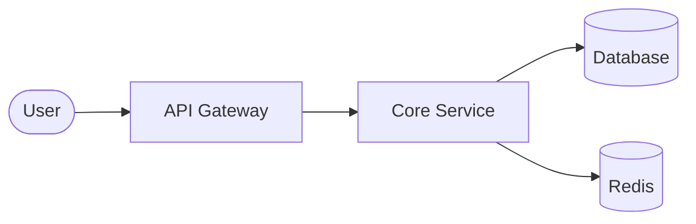

# [Project/Feature Name] Design Specification

> **Status**: [Draft / Under Review / Approved / Superseded]  
> **Author**: @username  
> **Date**: 202X-MM-DD  
> **Reference**: [Link to Jira/GitHub Issue/Ticket]

---

## 1. Context & Objectives
Briefly describe the problem we are solving. Why are we doing this now?

- **Goals**: 2-3 core objectives we aim to achieve.
- **Non-Goals**: Explicitly state what is *out of scope* to prevent scope creep.

## 2. High-Level Design
A bird's-eye view of the proposed solution.

### 2.1 Architecture Overview
Provide a high-level diagram or description of how components interact.

## 3. Detailed Design
The "How-To" section. This is the core of the document.

### 3.1 Core Logic & Workflows
Explain the primary algorithms or business logic.

Sequence Diagrams: Interaction between different services/modules.

State Machines: If the feature involves complex status transitions (e.g., Order Status).

### 3.2 Data Schema Changes
Detail any database migrations or new storage structures:

New tables or fields.

Indexing strategies.

Data retention policies.

### 3.3 Interface & Contract
Link this to your existing API documentation:

REST/gRPC: See docs/api/xxx.yaml for full spec.

Message Schema: Definition for Event-Driven messages (e.g., Kafka/RabbitMQ).

## 4. Edge Cases & Constraints
Concurrency: How do we handle race conditions or data consistency?

Backward Compatibility: Will this break existing clients or require data migration?

Observability: What metrics or logs will we track to ensure health?

## 5. Alternatives Considered
Documentation of the "Road Not Taken."

Alternative A: Pros/Cons. Why was it rejected? (e.g., "Too much operational overhead").

Final Decision: Rationale for the current chosen path.

## 6. Implementation Plan (Milestones)
[ ] Phase 1: Infrastructure & Schema setup.

[ ] Phase 2: Core feature development & Unit tests.

[ ] Phase 3: Integration testing & Staging deployment.