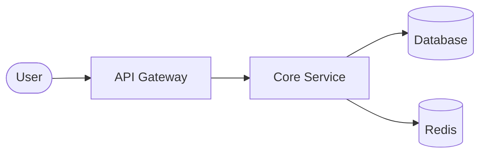

# [方案名称] 技术设计文档

> **状态**：[草案 / 评审中 / 已通过 / 已废弃]  
> **负责人**：@您的名字  
> **日期**：202X-MM-DD  
> **相关 Ticket**：[Link to Jira/GitHub Issue]

---

## 1. 背景与目标 (Context & Goals)
简述为什么要进行这项改动。解决了什么痛点？

- **目标**：明确我们要实现的 2-3 个核心点。
- **非目标 (Non-Goals)**：明确哪些内容不在本次讨论/实现范围内，防止需求蔓延。

## 2. 方案概览 (High-Level Design)
从宏观角度描述实现思路。

### 2.1 系统架构图
使用 Mermaid 描述核心流程（GitHub/GitLab/VS Code 均原生支持）：

## 3. 详细设计 (Detailed Design)
这是文档的核心部分，说明“怎么做”。

### 3.1 核心逻辑 (Core Logic)
描述关键算法或业务处理流程。

时序图：描述不同组件间的调用顺序。

状态机：如果涉及复杂的订单或任务状态。

### 3.2 数据模型变更 (Data Schema)
如果涉及数据库改动，请列出：

新增字段/表结构。

索引优化建议。

数据保留策略。

### 3.3 接口定义 (Interface Definition)
与 docs/api/ 目录关联：

新增 API：请参考 docs/api/xxx.yaml。

内部 RPC/消息队列：定义消息格式。

## 4. 边界情况与风险 (Edge Cases & Risks)
并发冲突：如何处理高并发下的数据一致性？

向后兼容性：旧版本数据如何平滑迁移？

性能影响：是否会显著增加接口延迟或 CPU 负担？

## 5. 替代方案 (Alternatives Considered)
记录你考虑过但放弃的选择。

方案 A：优点...，缺点...，结论：太复杂。

结论：为什么最终选择当前方案。

## 6. 任务拆分 (Milestones)
[ ] 第一阶段：数据库变更与基础框架。

[ ] 第二阶段：核心逻辑开发。

[ ] 第三阶段：集成测试与上线。