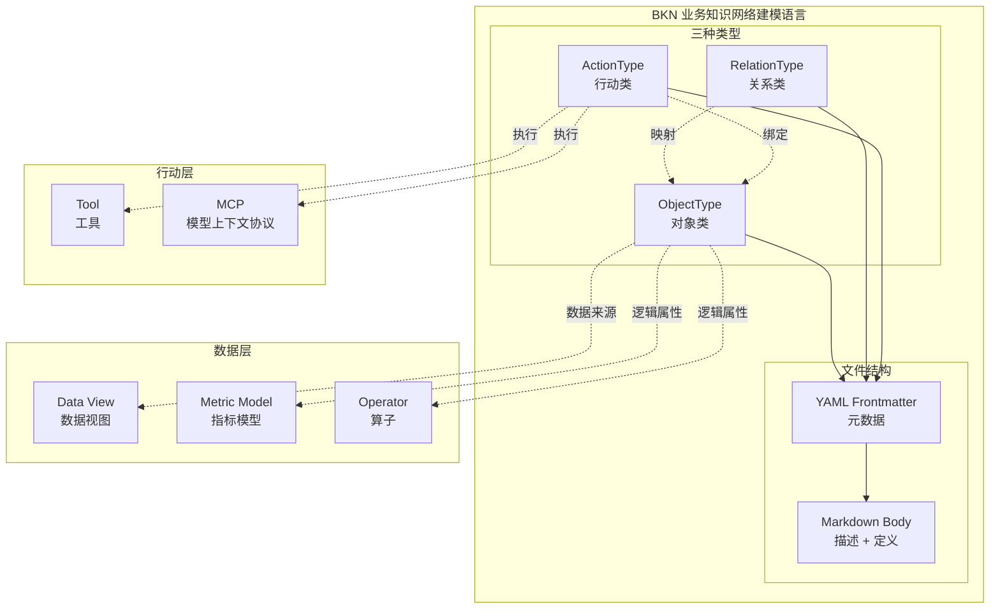
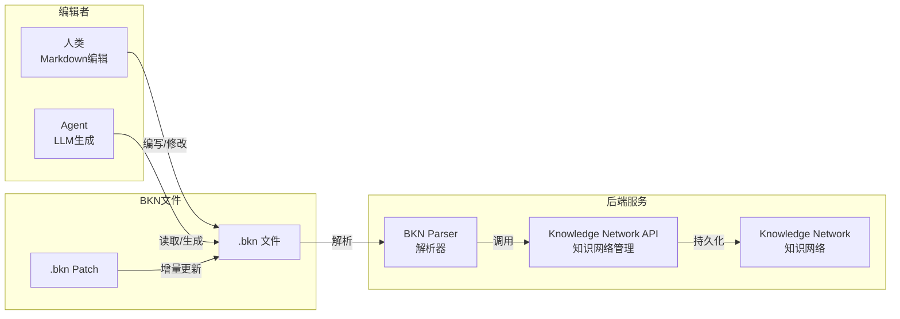
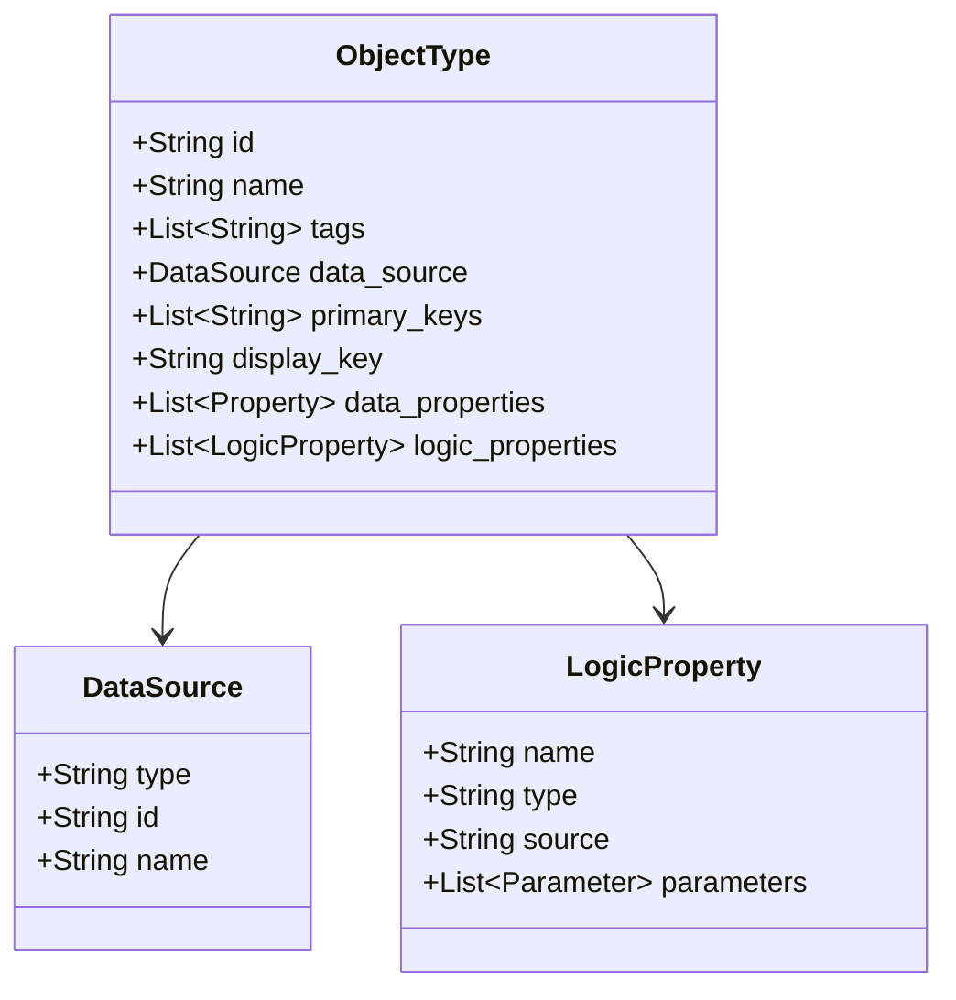
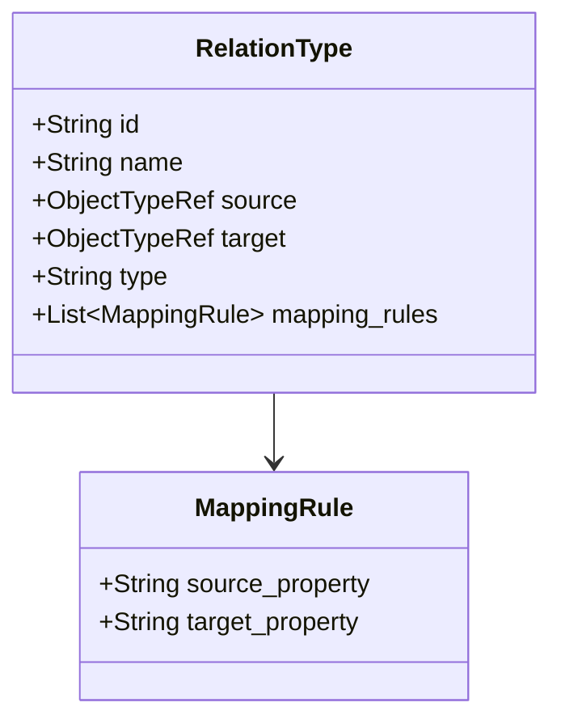
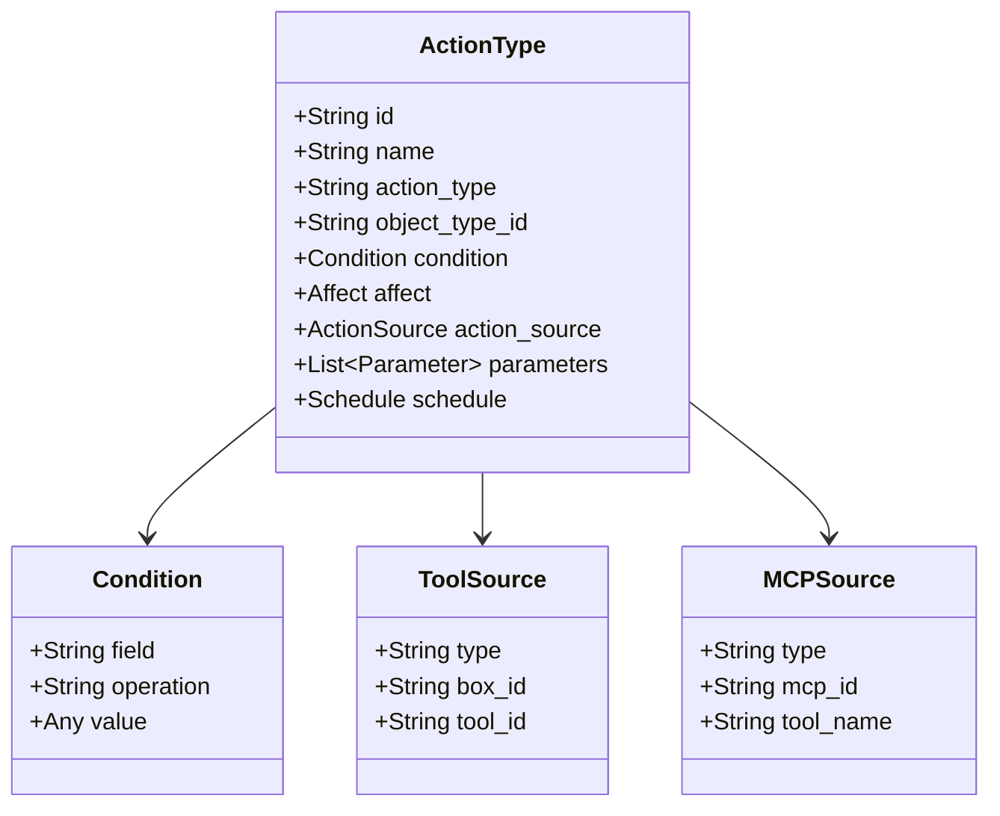
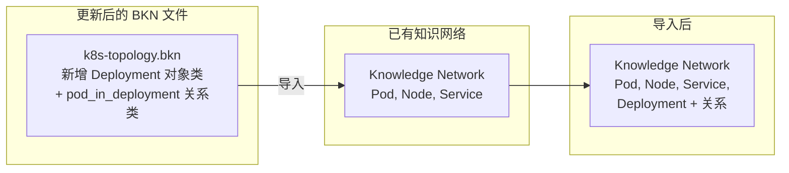

# BKN 架构设计

BKN (Business Knowledge Network) 是一种 Markdown-based 的业务知识网络建模语言，用于描述业务知识网络中的对象类、关系类和行动类。

## 设计理念

- **人类可读**: 使用 Markdown 语法，业务人员也能理解和编辑
- **Agent 友好**: 结构化的 YAML frontmatter + 语义化的 section，便于 LLM 解析和生成
- **增量导入**: 任何 `.bkn` 文件可直接导入到已有的知识网络，支持动态更新
- **单文件维护**: 仅维护单一 `.bkn` 文件，文件内容可以是完整的知识网络，也可以是部分混合内容

## 架构概览



## 工作流



## 三种类型

### 对象类 (ObjectType)

描述业务对象，如 Pod、Node、Service 等。

**核心特性**:
- 直接映射数据视图，自动继承字段
- 可选的属性覆盖配置
- 支持逻辑属性（指标、算子等）



### 关系类 (RelationType)

描述两个对象类之间的关联关系。

**核心特性**:
- 定义起点和终点对象类
- 支持直接映射和视图映射
- 声明属性映射规则



### 行动类 (ActionType)

描述可执行的操作，绑定工具或 MCP。

**核心特性**:
- 绑定目标对象类
- 定义触发条件
- 配置执行工具和参数
- 支持调度配置



## 文件组织

BKN 采用**单文件**组织模式：仅维护一个 `.bkn` 文件，文件内容可以是完整的知识网络定义，也可以是部分混合内容（包含任意组合的对象类、关系类、行动类）。

```
k8s-topology.bkn                 # 单个 .bkn 文件，包含所有定义
```

文件内部结构示例：

```markdown
---
id: k8s-topology
name: Kubernetes拓扑网络
---

# Kubernetes 拓扑网络

## ObjectType: pod
...

## ObjectType: node
...

## RelationType: pod_belongs_node
...

## ActionType: restart_pod
...
```

**优势**：
- 所有定义集中在一个文件，整体视图清晰
- 便于版本管理和 review（单文件 diff）
- 导入时一次性处理，保证定义间引用一致性
- 支持增量更新：修改文件后重新导入，系统自动识别变更

## 增量导入机制

BKN 的核心特性是支持**动态增量导入**：任何 `.bkn` 文件可直接导入到已有的知识网络。



### 导入行为

| 场景 | 行为 |
|------|------|
| ID 不存在 | 新增定义 |
| ID 已存在 | 更新定义（覆盖） |
| 删除定义 | 使用 `type: delete` 标记 |

### 典型工作流

1. **初始化**: 编写 `.bkn` 文件，定义完整知识网络（对象类、关系类、行动类），导入系统
2. **扩展**: 在 `.bkn` 文件中新增定义，重新导入，系统自动识别新增部分
3. **修改**: 修改 `.bkn` 文件中已有定义，重新导入，系统自动覆盖变更部分
4. **删除**: 从 `.bkn` 文件中移除定义，通过 delete 标记显式声明删除

## 与 知识网络管理 API 的映射

> 说明：接口路径仅用于表达 BKN 概念与系统 API 的对应关系，具体实现路径以实际部署为准。

| BKN 概念 | API 端点 |
|----------|----------|
| ObjectType | `/api/knowledge-networks/{kn_id}/object-types` |
| RelationType | `/api/knowledge-networks/{kn_id}/relation-types` |
| ActionType | `/api/knowledge-networks/{kn_id}/action-types` |

## 参考

- [BKN 语言规范](./SPECIFICATION.md)
- [BKN vs RESTful API 对比](./BKN_vs_REST_API.md)
- 样例：
  - [K8s 拓扑网络](./examples/k8s-topology.bkn) - 单文件包含完整知识网络定义
