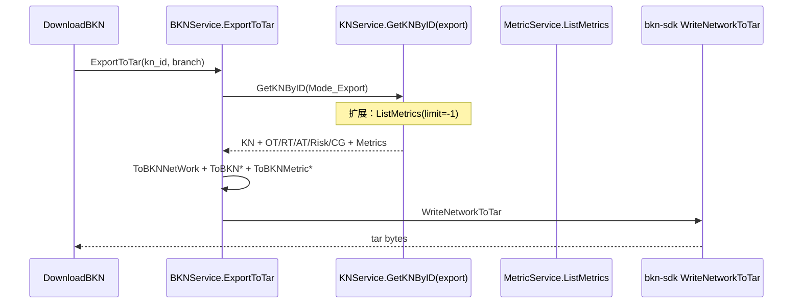
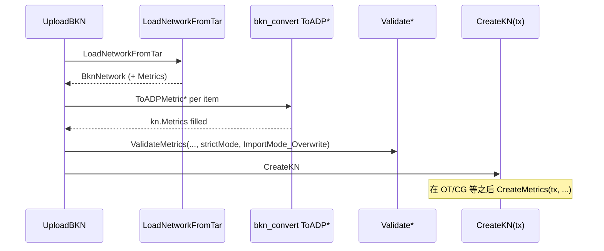

# BKN 范式指标：导入 / 导出 — 设计草案

> **状态**：草案（头脑风暴沉淀 + 实现导向）  
> **日期**：2026-05-07  
> **相关 Ticket**：#377

---

## 1. 头脑风暴流程纪要

### 1.1 意图澄清（我们要解决什么？）

| 问题 | 收敛结论 |
| ---- | -------- |
| **用户/系统到底要什么？** | 与同一份 **BKN 规范包**（tar）兼容：`UploadBKN` / `DownloadBKN`（及内部 `ExportToTar` / `LoadNetworkFromTar`）在 **指标** 上与 **bkn-specification** 一致；导出包可被 CLI/他环境再导入且不丢指标。 |
| **和 REST 指标 CRUD 的关系？** | 导入导出是 **批量的、事务内** 的路径，语义上应复用 **同一套校验**（`strict_mode`、scope 与对象类、`importMode` 等），而不是另起一套规则。 |
| **成功标准是什么？** | （1）含指标的 tar 可导入且库表与概念索引一致；（2）导出 tar 含全部 `MetricDefinition`；（3）与 `feature/7-issue` SDK 编译通过且 `SerializeBknNetwork` / `WriteNetworkToTar` 行为与规范一致。 |

### 1.2 现状盘点（bkn-backend 今天缺什么？）

- **SDK**：当前 `go.mod` 引用 `bkn-specification/sdk/golang v0.1.3`；`go doc` 下 `BknNetwork` **尚无** `Metrics` 字段；开发阶段通过 **`replace` 指向本地 `bkn-specification` 的 spec 分支（如 `feature/7-issue`）下的 `sdk/golang`** 构建后，才会出现 **BKN 侧指标结构体**（名称以规范为准，下文暂记为 `BknMetricDefinition` / `Metrics []*…`）。
- **导出**：`GetKNByID(..., Mode_Export)` 只拉取概念分组、对象类、关系类、行动类、风险类，**未** `ListMetrics`；`bkn_service.ExportToTar` 只拼装 OT/RT/AT/Risk/CG，**未**追加指标。
- **导入**：`bkn_handler.UploadBKN` 在解析 tar 后只转换 OT/RT/AT/Risk/CG，**未**遍历网络中的指标；`CreateKN` 事务内创建上述实体后也 **未**调用 `MetricService.CreateMetrics`。
- **领域模型**：`interfaces.KN` **无** `Metrics []*MetricDefinition` 字段；批处理索引 `batchindex.CollectKNFromPayload` **未**纳入指标 ID 与 scope 依赖（若校验需要「同批次对象类存在」，需扩展或在校验阶段显式依赖 OT 列表）。
- **与现有设计的一致性**：[`bkn_native_metrics/DESIGN.md`](../bkn_native_metrics/DESIGN.md) 已写明导入导出应包含指标及概念分组约束（组内指标 `scope_ref` 须为组内对象类）。当前实现尚未贯通 **BKN 文件化路径**，仅 REST CRUD 与库表较完整。

### 1.3 已采纳方案：贯通 KN 载荷（方案 A）

本实现唯一采用 **方案 A**：在 `interfaces.KN` 上增加 `Metrics`；导入时在解析 tar 后填充 `kn.Metrics`，`CreateKN` 在 OT/CG 等就绪后于 **同一事务内** 调用 `CreateMetrics`；导出时在 `GetKNByID(..., Mode_Export)` 中拉取全量指标，`ToBKNMetric*` 写入 `bknNetwork` 并由 SDK `WriteNetworkToTar` 落 tar。校验路径复用 `ValidateKN` 编排（含 `ValidateMetrics`），与 REST 批量语义对齐。

**实现侧注意**：改动触及 `KN` 与多处服务；需与规范/SDK 对账 `SerializeBknNetwork` 是否会自动包含新增的指标切片字段，以及 round-trip 完整性。

### 1.4 风险与开放问题

| 项 | 说明 |
| -- | ---- |
| **顺序依赖** | 指标 `scope_ref` 指向对象类（及未来子图）：**必须先** 持久化/可见对象类，再 `CreateMetrics`；概念分组若约束「组内 scope」，需在 **同一 `strict_mode` / importMode** 下与 CG 校验顺序对齐（可参考现有 `CreateMetrics` + `ValidateMetrics` 实现）。 |
| **ID 与覆盖策略** | `ImportMode_Overwrite` 下指标是「 upsert / 先删后建 / 按 id 冲突」需与 OT 等行为一致；需对账 `metric_service` 现有 `importMode` 语义。 |
| **SDK 版本** | 使用本地 spec 分支 SDK（`replace`）后，`SerializeBknNetwork`、`WriteNetworkToTar`、`LoadNetworkFromTar` 是否 **自动** 输出/解析指标；若 frontmatter 与 body 分片，需确认 round-trip 不丢字段。 |
| **校验复用** | `UploadBKN` 当前手写多段 `ValidateObjectTypes` 等；指标应补充 **`ValidateMetrics`**（或与 `ValidateKN` 合并路径），避免导入与 API 行为分叉。 |
| **batchindex** | 若 `ValidateConceptGroups` / 指标组内约束依赖「本批次 OT/CG 集合」，可能需要给 `BatchIDIndex` 增加 `MetricIDs` 或从 `kn.Metrics` 推导 scope 合法性（视现有 `ValidateMetrics` 内部是否已读库）。 |
| **概念索引** | `CreateKN` 末尾 `InsertDatasetData` 是否已覆盖指标；否则需确认 worker `concept_syncer` 能否在导入后触达一致状态（与 `bkn_native_metrics/DESIGN.md` 第 3.1 节一致）。 |

### 1.5 待与规范/SDK 对账的问题（实施前确认）

1. `feature/7-issue` 中 tar 内指标文件命名、`metric` 块语法与 `BknNetwork` 字段名（Go 结构体导出名）。  
2. `BknMetricDefinition` 与 `interfaces.MetricDefinition` 字段 1:1 映射表（含 omitempty、嵌套 `calculation_formula`）。  
3. 导入时 **`comment`/`tags`/`unit`/`analysis_dimensions`** 等是否在规范中全部出现，避免静默截断。

---

## 2. 目标架构（实现视图）

### 2.1 导出路径

### 2.2 导入路径

---

## 3. 建议改动的模块清单（实现阶段）

| 模块 | 改动要点 |
| ---- | -------- |
| **依赖** | `go.mod`：**不依赖远端发版**；使用 `replace` 将 `bkn-specification/sdk/golang` 指到 **本机** `bkn-specification` 仓库中 **`feature/7-issue`（spec 指标分支）** 下的 `sdk/golang` 模块路径，在该分支上本地构建/测试。示例：`replace <module> => /绝对或相对路径/bkn-specification/sdk/golang`（路径以开发者 clone 为准）。待规范合并发版后再改为正式版本号并移除 `replace`。 |
| **`interfaces/knowledge_network.go`** | `KN` 增加 `Metrics []*MetricDefinition`（json/mapstructure 标签与 OpenAPI / 设计文档对齐）。 |
| **`logics/bkn_convert.go`** | `ToBKNMetricDefinition`、`ToADPMetricDefinition`（或等价命名）；与 `ToBKNObjectType` 风格一致。 |
| **`logics/knowledge_network/knowledge_network_service.go`** | `GetKNByID` export 模式：`ms.ListMetrics`；`CreateKN` / `UpdateKN`：`CreateMetrics` 插入点与 importMode；`ValidateKN`：`ValidateMetrics`。 |
| **`driveradapters/bkn_handler.go`** | 解析 tar 后组装 `kn.Metrics`；补校验调用（若未全部进 `ValidateKN`）。 |
| **`logics/bkn/bkn_service.go`** | `ExportToTar`：追加 metrics 到 `bknNetwork`（假设 SDK 已支持切片字段）。 |
| **`logics/batchindex`**（按需） | 若校验需要，收集 `MetricDefinition.id` 与 scope 引用完整性。 |
| **测试** | 扩展 `integration_tests/bkn/bkn_test.go`：构造含指标的示例目录或 tar；导入后 `GET .../metrics` 对账；导出再导入 round-trip。 |

---

## 4. 验收标准（建议）

1. **编译与单测**：`bkn-backend` 在 `replace` 至本地 spec 分支 SDK 后 `go test ./...` 通过（含必要 mock 更新）。  
2. **集成**：含 1+ 个 `MetricDefinition` 的 BKN tar，`POST .../bkns` 返回 200，且库内指标条数与定义内容一致。  
3. **导出**：对上述 KN 执行 `GET .../bkns/download`，解压后 SDK `LoadNetworkFromTar` 能读出指标且字段与导入前一致（允许归一化字段顺序差异，不允许语义丢失）。  
4. **约束**：`strict_mode` 下非法 `scope_ref`、禁止的 `data_view` 对象类等行为与 REST 批量创建一致（错误码与消息可对齐现有指标 API）。  

---

## 5. 文档索引

- **细粒度任务清单**：[TASKS.md](./TASKS.md)（建议实现按 Phase 勾选）
- 产品/语义主线：[BKN 原生指标 DESIGN](../bkn_native_metrics/DESIGN.md)  
- 任务级拆分：[IMPLEMENTATION_PLAN](../bkn_native_metrics/IMPLEMENTATION_PLAN.md)（可将「导入导出」从 Task 中单独勾子项指向本文档）  
- 现有导出实现参考：`bkn-backend/server/logics/bkn/bkn_service.go`（`ExportToTar`）、`GetKNByID` export 分支、`driveradapters/bkn_handler.go`（`UploadBKN`）。
