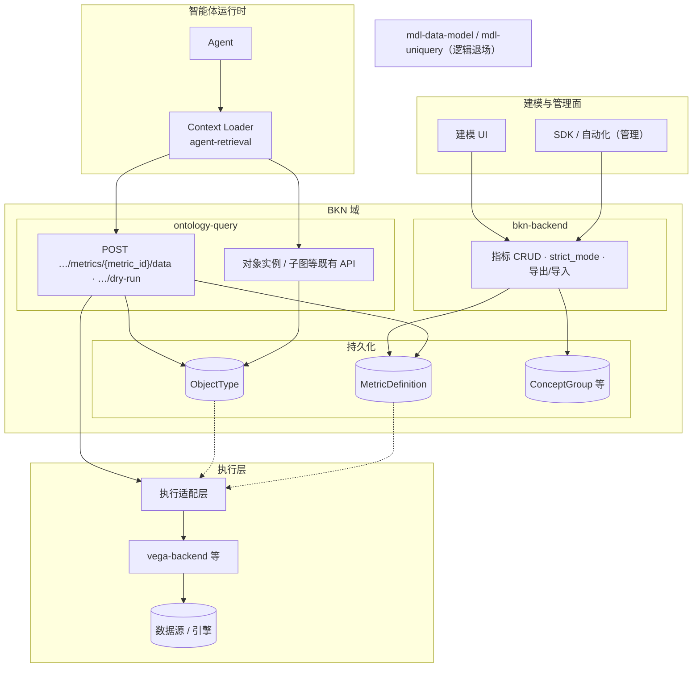
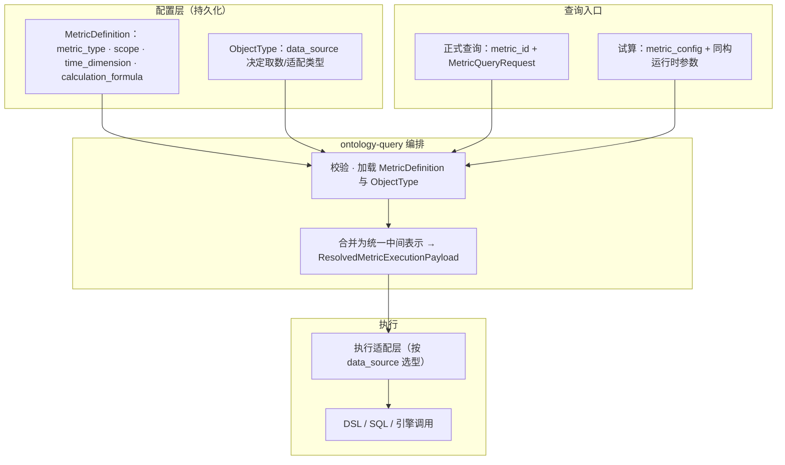

# BKN 原生指标（脱离指标模型 / 统一查询语义）技术设计文档

> **状态**：草案  
> **版本**：0.9.9  
> **日期**：2026-04-15  
> **相关 Ticket**：#198

**怎么读**：先看 **§2** 建立全貌（指标独立、Resource 在对象类不在指标、执行在适配层；**§2.2.1** 含 **Agent / Context Loader** 查数路径），再读 **§3** 看字段与流程；需要 JSON/OpenAPI 对齐时查 **附录 B**。下文 **「统一中间表示」** 指与 SQL/DSL 无关的结构化语义（主要由 `time_dimension`、`calculation_formula` 等体现），执行层再翻译成具体引擎调用。

---

## 1. 背景与目标 (Context & Goals)

### 1.0 术语与约定

**统一中间表示**：用结构化字段描述「统计什么、怎么过滤/聚合、时间怎么用」，**不**绑死某一种 SQL 或 DSL。BKN 与客户端只维护这一套；**vega** 负责翻译成真实调用。合并运行时参数后的结果可称为 **解析后的执行载荷**（如 `ResolvedMetricExecutionPayload`）。

### 1.1 背景

**现状**：指标挂在对象类 **逻辑属性（metric）** 上，引用 **data-model 指标模型**；查询经 **uniquery**。建模在 BKN，定义与执行却在外部服务，边界不清。

**方向**：指标为 **BKN 独立概念**；`scope` 先绑 **对象类**，以后可 **子图**；建模与 API **只保留一套**查询语义（不拆 DSL/SQL 双入口）。

### 1.2 目标

1. **独立概念**：指标与对象类、关系类等并列；对象类 **不再** 提供 metric 逻辑属性。
2. **归属 BKN**：在知识网络内配置指标，**不再** 绑定外部「指标模型 ID」。
3. **统计主体**：`scope` 当前为 **对象类**，未来可 **子图**（同一套字段扩展）。
4. **取数路径**：指标 **不配 Resource ID**；由 **scope 所指对象类的 `data_source`** 决定（如 vega `resource`）。见 [数据绑定 Vega Resource](../BKN%E6%95%B0%E6%8D%AE%E7%BB%91%E5%AE%9A%E6%94%AF%E6%8C%81resource/DESIGN.md)。`**data_view` 源的对象类不支持定义指标**。
5. **一套语义**：对外 **一套** 指标定义 + 查询请求，客户端 **不** 再选「DSL 版 / SQL 版」。
6. **指标试算**：不落库，用配置 + 运行时参数跑一遍计算，与正式查询 **同一执行链路**。
7. **平台一致**：校验走 `**strict_mode`**（见 [依赖校验策略](../%E4%BE%9D%E8%B5%96%E6%A0%A1%E9%AA%8C%E7%AD%96%E7%95%A5/DESIGN.md)）；业务知识网络、概念分组导入导出 **包含指标**；见分组下的指标，其 `scope_ref` 须是 **组内对象类**（§3.2.5、§3.2.6）。

### 1.3 非目标

- 不规定 **vega-backend** 内部如何用 DSL/SQL 下发到具体引擎（以 vega Resource 及连接器实现为准）。  
- 不替代 vega-backend 在非 BKN 场景下的其它能力。  
- 本文不展开 **BKN Markdown 语言（`.bkn`）** 的全文法修改细节；若后续将 `MetricType` 纳入文件化建模，以独立 SPEC 增量说明。

---

## 2. 方案概览 (High-Level Design)

### 2.1 核心思路

1. **独立概念 `MetricDefinition`**：与 `kn_id + branch` 绑定；含 **`metric_type`**（指标类型）、`scope`、`time_dimension`（可选）、`calculation_formula`、`analysis_dimensions`（可选）等（§3.2）。**指标上不配 Resource ID**；对象类 **不再有** `type == metric` 的逻辑属性。
2. **统计主体 `scope`**：当前 `**scope_type = object_type**`，指向一个对象类；取数走 **该对象类的 `data_source`**。未来可 `**subgraph**` + `scope_ref` 指子图。
3. **谁做什么**：**bkn-backend** 做指标 CRUD、校验、导入导出；**ontology-query** 做查询/**试算**：拉 **MetricDefinition** + **对象类**，按 `data_source` 下发 **统一中间表示** + 运行时参数；**不调** uniquery metric-models。
4. **DSL/SQL**：只在 **适配层** 出现；建模与 API **只有** `calculation_formula` 与统一查询体。

### 2.2 总体架构

**一句话**：**建模** 走 **bkn-backend**；**查数** 走 **ontology-query**（人机与 SDK 可直接调；**Agent 在平台托管模式下优先经 Context Loader**，见 §2.2.1）。数据落在 **MetricDefinition / ObjectType**；真正跑 SQL/DSL 在 **执行层**（由对象类 `data_source` 选型）。细分见 §3.1。




#### 2.2.1 Context Loader 与 Agent 查数

与 [BKN 总览](../bkn_docs/DESIGN.md)（§3.6 Agent 消费模式）、[SYSTEM_DESIGN](../bkn_docs/SYSTEM_DESIGN.md) 一致：**平台托管** 场景下 Agent **通过 Context Loader** 访问 BKN Engine（含检索、鉴权上下文等）；指标查数 **不拼 SQL/DSL**，只传 **与 §3.3 一致的请求体**。


| 路径     | 说明                                                                                 |
| ------ | ---------------------------------------------------------------------------------- |
| **推荐** | **Agent → Context Loader → ontology-query** → 适配层 → 数据源（租户/审计与 `kn_search` 等工具同轨）。 |
| **可选** | **直连 ontology-query**：少一跳，无 CL 检索等增强；鉴权/审计 **自负**。                                 |


**CL 侧工具（示例名，以实现为准）**


| 能力      | 示例                | 后端                                                       |
| ------- | ----------------- | -------------------------------------------------------- |
| 查指标     | `query_metric_data`    | `POST .../metrics/{metric_id}/data` + `MetricQueryRequest`（§3.3.1） |
| 试算      | `dry_run_metric`  | `POST .../metrics/dry-run`，`MetricDryRun`（§3.3.3、附录 B.4） |
| 元数据（可选） | 只读列表或 `kn_search` | bkn-backend / Engine                                     |


**建议在 Context Loader 暴露的工具**（名称以实现为准）：


| 能力       | 工具示例                                      | 后端对齐                                                     |
| -------- | ----------------------------------------- | -------------------------------------------------------- |
| 查已保存指标   | `query_metric`（示例名）                       | `POST .../metrics/{metric_id}/data`；`MetricQueryRequest`（§3.3.1） |
| 试算       | `dry_run_metric` / `evaluate_metric`（示例名） | `POST .../metrics/dry-run`；`MetricDryRun`（§3.3.3、附录 B.4） |
| 解析定义（可选） | 只读指标元数据或沿用 `kn_search` 命中指标               | bkn-backend 只读或 Engine 列表                                |


**典型场景**：

（1）对话中查数：选定 `metric_id`、时间窗、可选 **`condition`** / **`limit`** 等 → 调 **query_metric**（**不含** `scope_context`，见 §3.3.1）。

（2）保存前试算：调 **dry_run_metric**，带 `**metric_config`** + 运行时块（与正式查询同构，见 §3.3.3）。

（3）需要下钻到具体实例维度时：用 **query_object_instance** / **kn_search** 查对象；指标结果中的 **序列** 由 **`condition`**、**`group_by`** / 分析维度等表达，**不** 通过请求体传实例数组。

### 2.3 关键决策


| #   | 决策               | 说明                                                                                 |
| --- | ---------------- | ---------------------------------------------------------------------------------- |
| 1   | 指标独立             | 与对象类并列；**不**用 `logic_properties` 承载指标。                                             |
| 2   | 存 BKN            | `MetricDefinition` 跟 KN/branch。                                                    |
| 3   | `scope`          | 对象类 → 子图；同模型扩展枚举。                                                                  |
| 4   | 无外部指标模型          | **不**引用 data-model 指标 ID。                                                          |
| 5   | 无 Resource on 指标 | 配置仅 `scope` + `time_dimension?` + `calculation_formula`；取数由 **对象类 `data_source`**。 |
| 6   | 一套对外模型           | 客户端 **不** 分叉 DSL/SQL。                                                              |
| 7   | 方言下沉             | 适配层映射到 DSL/SQL；BKN **不**以原始 SQL 为唯一真相（默认）。                                         |
| 8   | `strict_mode`    | 与全平台一致；**试算**可走同校验（若启用）。                                                           |
| 9   | 分组与导入导出          | 成员/清单/顺序与 `strict_mode` 协同。                                                        |
| 10  | 组内指标             | `scope_ref` 须为 **组内对象类**（§3.2.6）。                                                  |
| 11  | Agent 路径         | **推荐** CL → ontology-query（§2.2.1）；直连则自管鉴权审计。                                      |


---

## 3. 详细设计 (Detailed Design)

> **前提**：指标独立存；对象类无 metric 逻辑属性；`scope` 先绑对象类，未来可子图。

### 3.1 逻辑设计 (Logic Design)

#### 3.1.0 逻辑设计图

**三件事**：

（1）**配置** 只写「对谁统计、时间语义、公式」，**取数路径** 只看 **对象类 `data_source`**。

（2）**ontology-query** 把定义 + 对象类 + **MetricQueryRequest**（或 **试算** 请求体里的 `metric_config`）合成 **ResolvedMetricExecutionPayload**，交给适配层。

（3）**正式查询** 与 **指标试算** 共用 **解析 → 适配 → 执行**，差别是试算 **不从库读** `metric_id`（§3.1.2、§3.3.3）。下图与 §3.1.1、§3.1.2 对应。




**对应步骤**：**V→R** ≈ §3.1.2 第 2～4 步；**R→A→E** ≈ 第 4～5 步；试算在 **V** 前 **不读** `metric_id`。

#### 3.1.1 职责划分


| 层级                   | 职责                                                                                                                   |
| -------------------- | -------------------------------------------------------------------------------------------------------------------- |
| **MetricDefinition** | 存语义、**`metric_type`**、`scope`、`time_dimension`、`calculation_formula`；**无** Resource；**不** 持久化概念分组字段；`strict_mode` 校验；参与导入导出。 |
| **ObjectType**       | `scope_ref` 指向它；`**data_source` 决定怎么执行**；无 metric 逻辑属性。                                                              |
| **ConceptGroup**     | 可含指标成员；组内指标的 `scope_ref` 须是 **组内对象类**（§3.2.6）。                                                                       |
| **bkn-backend**      | CRUD、校验、导入导出；**不** 校验指标上的 Resource；**不** 调 data-model 指标接口。                                                          |
| **ontology-query**   | 查询/**试算**：拼 **MetricDefinition + ObjectType.data_source + 请求体**（§3.3），下发适配层。                                         |
| **vega-backend 等**   | `data_source` 为 resource 时走 Resource 查询；**Resource ID 来自对象类**。                                                       |


#### 3.1.2 核心流程（指标查询）

1. **请求**：**`POST .../metrics/{metric_id}/data`**；请求体带时间、**`condition`**、可选 **`limit`**（仅返回前 **`limit`** 条 **序列**，见 §3.3.1）等；**不含** **`scope_context`**。
2. **校验定义**：加载 **MetricDefinition**，核对 KN/branch；**`metric_type`** 须为当前允许值（**仅 `atomic`**，见 §3.2.1）；**`scope_ref`** 与指标定义一致。
3. **解析执行端**：加载 **ObjectType**，读 `**data_source`**；合并 `time_dimension`、`calculation_formula` 与运行时参数。
4. **下发**：生成 **ResolvedMetricExecutionPayload**，调适配层（如 Resource 时 `POST .../resources/{id}/data`）。
5. **响应**：映射为指标查询结果；若请求含 **`limit`**，**`MetricData.datas`** 仅保留 **前 `limit` 个** **`Data` 序列**（截断规则以实现为准，宜与 `order_by` / 引擎稳定序一致）；**主路径** 不再用「读逻辑属性当指标」。

#### 3.1.3 DSL / SQL 统一策略（逻辑）

- **原则**：建模侧只有 `**time_dimension` + `calculation_formula`**（`condition` 等同 BKN `Condition`），**不** 提供「DSL 模式 / SQL 模式」双入口。
- **执行**：适配层把 **统一中间表示** 译成 DSL/SQL；错误 **透传**。
- **迁移**：无迁移，老的指标模型不迁移到bkn的指标下。

### 3.2 指标定义的信息模型 (Information Model)

以下字段为 **逻辑模型**；实际持久化可为 JSON 列 + 关系表字段，表名与主键在实现阶段确定。

#### 3.2.1 MetricDefinition（核心）


| 字段                          | 类型     | 必填  | 说明                                                                                   |
| --------------------------- | ------ | --- | ------------------------------------------------------------------------------------ |
| `id`                        | string | 是   | 指标 ID，在 `(kn_id, branch)` 内唯一。                                                       |
| `kn_id`                     | string | 是   | 知识网络 ID。                                                                             |
| `branch`                    | string | 是   | 分支。                                                                                  |
| `name`                      | string | 是   | 名称。                                                                                  |
| `comment`                   | string | 否   | 描述。                                                                                  |
| `unit_type` / `unit`        | string | 否   | 单位。                                                                                  |
| `metric_type`               | string | 是   | **指标类型**：`atomic`（**原子指标**）、`derived`（**衍生**）、`composite`（**复合**）。**当前需求仅支持 `atomic`**；其余枚举值为预留，`strict_mode=true` 时须拒绝创建/更新非 `atomic`（或按团队策略返回明确错误）。 |
| `scope_type`                | string | 是   | 统计主体类型：**当前** 取 `object_type`；**未来** 扩展 `subgraph`（子图就绪后启用）。                         |
| `scope_ref`                 | string | 是   | 与 `scope_type` 对应：当前为 **对象类 ID**（`object_type_id`）；未来为 **子图 ID / 模式 ID**（以子图产品定义为准）。 |
| `calculation_formula`       | object | 是   | **指标计算公式**（见 §3.2.3），与 DSL/SQL 解耦。                                                   |
| `time_dimension`            | object | 否   | **时间维度**（见 §3.2.2）：指标统计所依据的时间字段语义。                                                   |
| `analysis_dimensions`       | array  | 否   | 分析维度字段列表（名称 + 可选类型），用于 UI 与动态下钻。                                                     |
| `creator` / `updater` / 时间戳 | —      | 否   | 与对象类一致治理。                                                                            |


**小结**：`scope` = 对谁统计；**去哪取数** 看 **该对象类的 `data_source`**，指标上 **不配 Resource**。**`metric_type`** 标明语义类别（**当前仅 `atomic`**；衍生/复合为后续能力预留）。概念分组与指标的关联由 **`t_concept_group_relation` 等**维护，**不在 MetricDefinition 上存分组字段**；若指标作为分组成员，其 `scope_ref` 仍须满足 **组内对象类** 约定（§3.2.6）。

#### 3.2.2 时间维度 `time_dimension`（可选）

**定义里**：用哪条时间语义、默认时间策略。**请求里**：本次查询的时间窗（`time.start/end` 等）。二者不要混。


| 子字段                    | 说明                                                                                                                                             |
| ---------------------- | ---------------------------------------------------------------------------------------------------------------------------------------------- |
| `property`             | 时间列或事件时间字段名（语义字段，对象类上的时间属性，由执行适配层映射到物理列/键）。                                                                                                    |
| `default_range_policy` | 未传入 dynamic 时间时的默认策略（如 `last_1h`、`last_24h`、`calendar_day`、`none`）；`none` 表示必须由请求显式给出时间窗。未配置 `time_dimension` 时，仅依赖请求体 `time` / 即时查询（instant）。 |


#### 3.2.3 calculation_formula（指标计算公式，与方言无关）

`calculation_formula` 描述 **过滤、聚合、分组、排序、HAVING**（**时间列语义** 在 `time_dimension`，不塞在公式里），**不是** 直接把某引擎的 SQL 字符串存进来。

**注**：`aggregation` 是 **单个对象**；**一个指标 = 一项聚合**（`property` + `aggr`）。要多项统计就 **建多个指标**。


| 字段                    | 说明                                                                                                                                                |
| --------------------- | ------------------------------------------------------------------------------------------------------------------------------------------------- |
| `condition`           | 与 **BKN `Condition`** 同构（OpenAPI / `CondCfg`）。**持久化公式里** 只用字面量或可枚举常量，**不写** `${…}` 占位符；运行时维度过滤放在 **请求** 的 **`condition`**（见 §3.3.1）。 |
| `aggregation`         | **一项**：`property` + `aggr`（`count_distinct` / `sum` / `max` / `min` / `avg` / `count`）。                                                           |
| `group_by`            | 每项用 `property`（不用 `field`）；可与 `analysis_dimensions` 对齐。                                                                                           |
| `order_by` / `having` | 可选。`order_by` 用 `property`。`having` 对聚合结果，字段固定 `__value`（附录 B.1）；与请求体 `having` 同构。                                                                |


#### 3.2.4 对象类逻辑属性中「指标」的移除与迁移


| 现网                                                            | 目标                                                                     |
| ------------------------------------------------------------- | ---------------------------------------------------------------------- |
| `logic_properties` 中存在 `type == metric`，引用 data-model 指标模型 ID | **删除**该建模方式；对象类 **不再** 包含 metric 逻辑属性。                                 |
| 客户端通过「对象实例 + 逻辑属性名」取指标值                                       | 改为 **显式指标查询 API**：指定 **metric_id** + **时间 / `condition` / `limit` 等**（与指标绑定的对象类由 `scope_ref` 决定，**不** 在指标查询体传 `scope_context`）。 |


**迁移**：存量 **迁** 到独立 `MetricDefinition`（`scope_ref` 指原对象类）；**禁止** 新建/保存仍带 metric 逻辑属性；调用改 **指标查询 API**（§4.2）。

#### 3.2.5 `strict_mode` 与指标校验

写指标、导入、（可选）**试算** 路径上的校验与全平台一致，见 [依赖校验策略](../%E4%BE%9D%E8%B5%96%E6%A0%A1%E9%AA%8C%E7%AD%96%E7%95%A5/DESIGN.md)。


| `strict_mode`  | 指标侧（摘要）                                                                                                                    |
| -------------- | -------------------------------------------------------------------------------------------------------------------------- |
| `**true`（默认）** | 校验 `scope_ref` 对象类存在且属本分支；**`metric_type`** 须为 **`atomic`**（当前）；`time_dimension` / `calculation_formula` 形状合法；`data_source` 可解析。 |
| `**false`**    | 跳过存在性/归属类校验（便于先导入后补依赖）；**不** 默认可放宽 JSON 语法，除非另约定。 **`metric_type` 非 `atomic`** 仍建议拒绝或告警，与产品策略一致。                                                                          |


接口上传 `**strict_mode`** 的方式与 **其他 BKN 资源** 一致。

#### 3.2.6 概念分组、导出/导入与「组下指标」语义

- **分组**：指标可作为分组成员（类型 `metric` 或等价，以实现为准）；**成员关系** 在概念分组侧（如 `t_concept_group_relation`），**不在 MetricDefinition 上存 `concept_group_ids`**。
- **组下指标**：`scope_ref` 须是 **该组内的对象类**；取数仍只走 **该对象类 `data_source`**。
- **校验**：当校验「指标—分组」一致性时，以 **relation 表** 中的组与成员为准；`strict_mode=true` 强校验，`false` 可降级告警。

**导出 / 导入**

- **导出**：清单里要有指标；按分组导出时，组内列出指标及依赖对象类 ID。
- **导入**：顺序一般为 **对象类 → 分组与成员 → 指标**；可与 `strict_mode` 配合「先骨架后补全」。
- **跨环境**：ID/名称映射可与对象类 **同一套** batch 预检思路（见依赖校验策略）。

### 3.3 指标查询的请求体 (Metric Query Request)

**ontology-query** 上指标查询用 **统一请求体**（字段名与 OpenAPI 最终稿对齐）。**不再** 用「对象实例 + 逻辑属性名」当查询语义。**成功时的响应体** 为 **`MetricData`**，与 **uniquery** 查询指标数据返回结构一致，见 **§3.3.1.2**。

**正式查询 HTTP 定义**：**`POST .../metrics/{metric_id}/data`**（`{metric_id}` 为 BKN 内指标 ID；服务前缀以 OpenAPI 为准）。

#### 3.3.1 建议结构：`MetricQueryRequest`

**路径参数**：`metric_id`（必填）— 与 URL **`/metrics/{metric_id}/data`** 一致。

**请求体**（摘要）：


| 字段                    | 类型       | 必填  | 说明                                                                                   |
| --------------------- | -------- | --- | ------------------------------------------------------------------------------------ |
| `time`                | object   | 条件  | 时间窗：`start` / `end` / `instant` / `step`（与历史 `MetricQuery` 一致，`start`/`end` 为毫秒时间戳）。 |
| `condition`           | object   | 否   | 与对象查询 `**Condition`** 同构；与定义里 `calculation_formula.condition` **AND** 叠加。            |
| `analysis_dimensions` | string[] | 否   | 同历史 `MetricQuery`。                                                                   |
| `order_by`            | array    | 否   | 语义同 `order_by_fields`；本 API 字段名 `**order_by`**。                                      |
| `having`              | object   | 否   | 对聚合结果过滤，与公式内 `having` 同构（§3.2.3、附录 B.1）；旧名 `having_condition` 不再用。                   |
| `metrics`             | object   | 否   | 同环比 / 占比，见 §3.3.1.1、附录 B.3。                                                          |
| `limit`               | integer  | 否   | **仅返回前 `limit` 条** **`MetricData.datas`** 中的 **序列**（每个 `Data` 为一条序列）；未传或 `0` 表示不截断（由引擎默认上限约束，若有）。 |


#### 3.3.1.1 `metrics`（`Metrics` / `SameperiodConfig`）

与 **uniquery** `MetricQuery.metrics` 对齐，形态以 `**ontology-query` OpenAPI** `components.schemas.Metrics` / `SameperiodConfig` 为准（见仓库内 `adp/docs/api/bkn/ontology-query-ai/ontology-query.yaml`；实现参考 `adp/bkn/ontology-query/server/interfaces/uniquery_access.go` 中 `Metrics`、`SameperiodConfig`）。

`**Metrics`**（请求体字段名 `metrics`）：


| 字段                  | 类型     | 必填  | 说明                                                                   |
| ------------------- | ------ | --- | -------------------------------------------------------------------- |
| `type`              | string | 是   | `sameperiod`（同环比）或 `proportion`（占比）。                                 |
| `sameperiod_config` | object | 否   | 当 `type == sameperiod` 时使用；**占比** 时通常省略。结构与下表 `SameperiodConfig` 一致。 |


`**SameperiodConfig`**（嵌套于 `metrics.sameperiod_config`）：


| 字段                 | 类型       | 必填  | 说明                                                                                           |
| ------------------ | -------- | --- | -------------------------------------------------------------------------------------------- |
| `method`           | string[] | 否   | 计算方法；元素为 `growth_value`（增长值）、`growth_rate`（增长率）。OpenAPI 默认等价于 `[growth_value, growth_rate]`。 |
| `offset`           | integer  | 是   | 偏移量。                                                                                         |
| `time_granularity` | string   | 是   | 时间粒度：`day`、`month`、`quarter`、`year`。                                                         |


**示例**：

```json
{
  "type": "sameperiod",
  "sameperiod_config": {
    "method": ["growth_value", "growth_rate"],
    "offset": 1,
    "time_granularity": "day"
  }
}
```

```json
{
  "type": "proportion"
}
```

#### 3.3.1.2 成功响应：`MetricData`（与 uniquery 一致）

**HTTP 200** 成功体为 **`MetricData`**，与 **uniquery** `GetMetricDataByID` 返回结构一致（Go：`interfaces.MetricData`，见 `adp/bkn/ontology-query/server/interfaces/uniquery_access.go`）。**正式查询**与 **试算（§3.3.3）** 成功时均返回此结构。OpenAPI `components.schemas` 名称建议 **`MetricData`**；**附录 B.5** 给出 JSON Schema 草案。

| 字段              | 类型      | 说明                                                                 |
| --------------- | ------- | ------------------------------------------------------------------ |
| `model`         | object  | 可选；单位信息，与 **`MetricModel`** 一致：`unit_type`、`unit`。                |
| `datas`         | array   | 时序结果行列表；元素为下表 **`Data`**。若请求体含 **`limit`**，**`datas` 长度** 至多 **`limit`**。 |
| `step`          | string  | 步长（如 `60s`），与历史 uniquery 字段 `step` 语义一致。                            |
| `is_variable`   | boolean | 是否变步长等与引擎相关的标志（与 uniquery 一致）。                                      |
| `is_calendar`   | boolean | 是否按日历对齐等（与 uniquery 一致）。                                            |

**`datas[]` 元素（`Data`）**：

| 字段               | 类型    | 说明                                                                                    |
| ---------------- | ----- | ------------------------------------------------------------------------------------- |
| `labels`         | object | 字符串键值对，标识该序列的维度标签（`map[string]string`）。                                         |
| `times`          | array  | 时间点序列；元素类型以引擎为准（与历史 uniquery 一致，常为 unix 毫秒或字符串）。                              |
| `values`         | array  | 与 `times` 对齐的取值序列。                                                                   |
| `growth_values`  | array  | 可选；请求体含同环比（`metrics.type == sameperiod`）等时由引擎填充，与 uniquery `Data.growth_values` 一致。 |
| `growth_rates`   | array  | 可选；同上。                                                                                |
| `proportions`    | array  | 可选；占比分析时由引擎填充，与 uniquery `Data.proportions` 一致。                                  |

**兼容性**：BKN 原生指标 API **不** 再包一层与上述字段冲突的外壳；适配层（vega 等）归一化后应 **直接映射** 为 `MetricData`，OpenAPI 中 **`POST .../metrics/{metric_id}/data`** 与 **`POST .../metrics/dry-run`** 的 **200 响应** 宜 **`$ref: '#/components/schemas/MetricData'`**（或与现网组件名显式 `allOf` 对齐）。

**服务端内部**：合并 **MetricDefinition**（`**calculation_formula` 无占位符**）、**scope 所指 ObjectType.data_source** 与上述请求体，生成 **ResolvedMetricExecutionPayload**；再映射到 **具体适配层**（例如对象类为 `resource` 时映射为 **vega** `ResourceDataQueryParams`）；在返回前按 **`limit`** 对 **`datas`** 截断。**附录 B.3** 给出请求体 JSON Schema 草案；**附录 B.5** 给出响应体 JSON Schema 草案。

#### 3.3.2 与执行层（含 vega）的边界

- 仅 `**data_source.type == resource`** 的对象类可配指标；`**data_view`** **不支持**。
- 若请求体与现有 Resource Data API 不一致：可扩字段或另附契约；**指标仍不配 Resource ID**。

**vega–BKN**：冻结 **统一中间表示 → Resource 请求体**（附录或对接文档）。

#### 3.3.3 指标试算（MetricDryRun）

**用途**：保存前或临时验证：提交 **与落库指标同构的 `metric_config`**（**不写库**），执行链路与 §3.1.2 **相同**。


| 维度          | 说明                                                                                                                         |
| ----------- | -------------------------------------------------------------------------------------------------------------------------- |
| **vs 正式查询** | 正式：路径带 `metric_id`，从库读定义。试算：**不带**（或忽略）`metric_id`，用体里的 `**metric_config`**（等同 `MetricDefinition` 中 scope、时间、公式等，可无 `id`）。 |
| **请求体**     | Schema：`**MetricDryRun`**（附录 B.4）。含 `metric_config` + 与 §3.3.1 相同的运行时字段（`time`、`condition`、`limit`、`metrics`…）；**无** `scope_context`。              |
| **服务端**     | 按与创建指标 **相同规则校验** → 内存里当 **MetricDefinition** 用 → 合并参数 → 调适配层；**不落库**；实体变更审计可不记（可另记 **试算** 操作审计）。                          |
| **响应**      | 与正式查询 **成功体** 同结构（**`MetricData`**，§3.3.1.2、附录 B.5），前端可复用组件。                                                          |
| **路由**      | 试算：**`POST .../metrics/dry-run`**；正式查询：**`POST .../metrics/{metric_id}/data`**（服务前缀以 OpenAPI 为准）。                               |


### 3.4 对客户端的影响 (Client Impact)

#### 3.4.1 OpenAPI / 字段级


| 区域                 | 影响                                                          |
| ------------------ | ----------------------------------------------------------- |
| **对象类 API**        | 去掉逻辑属性里 **metric** 类型及相关示例。                                 |
| **指标 API**         | CRUD/列表/详情（**`metric_type`**，当前仅 **`atomic`**）；查询 **`POST .../metrics/{metric_id}/data`**（**`limit`**、**无** `scope_context`）；试算 **`POST .../metrics/dry-run`**；分组含 **metric**；导入导出含指标。 |
| **schema**         | 以 BKN `**metric_id` + `MetricDefinition`** 为准。              |
| **ontology-query** | 废弃「实例 + 逻辑属性取数」；上新指标查询；弱化 uniquery 依赖说明。                    |
| **Context Loader** | 增加指标 **查询 / 试算** 工具，转发至 ontology-query（§2.2.1）。             |
| **错误码**            | 补充：指标不存在、scope 不符、数据源不可用、适配失败等（实现定码）。                       |


#### 3.4.2 行为与产品

- 指标走 **独立入口**；对象类页 **不再** 配指标逻辑属性；保存前可 **试算**（产品决定是否强制）。
- 旧调用须迁到 **指标查询 API**（§4.2）。
- 客户端 **一套** JSON；**试算** 与正式只差 **是否已有 `metric_id`**。

#### 3.4.3 SDK、Agent、Context Loader 与文档

- **SDK**：CRUD → bkn-backend；查询/试算 → **§3.3** / OpenAPI。
- **Agent**：**推荐** CL 工具（§2.2.1），**不**在工具层拼 SQL/DSL；**metric_id** + **时间 / `condition` / `limit`** 等与正式查询一致（**无** `scope_context`）。
- **直连**：自负 **鉴权、租户、审计**。
- **Context Loader**：新增 query/dry-run 工具，对接 ontology-query；与 `kn_search` 等 **同发布节奏**。
- 文档：指标为 **BKN 实体**；工具说明对齐 §3.3 字段。

---

## 4. 风险与边界 (Risks & Edge Cases)

- **表达**：极复杂 SQL 可能无法无损映射 → 适配层或 vega 约定。
- **可用性**：依赖 `data_source` / vega → **超时、熔断、可观测**。
- **迁移**：不迁移存量逻辑属性指标到独立metric中。
- **权限**：指标可读、`scope` 对象类、Resource **一并收口**。
- **分支**：Metric 与 ObjectType 的 `branch` 一致。
- **子图**：首版 Schema 可 **仅 `object_type`**。

### 4.2 迁移与兼容（摘要）

1. 存量逻辑属性 metric：可查；**禁止** 新建/保存仍带该形态；新指标在 **独立 Metric**；断 data-model/uniquery；调用改 **指标查询 API**。
2. `**subgraph`**：子图就绪后开放枚举与校验。

## 6. 任务拆分 (Milestones)

- 冻结 **MetricDefinition（含 `metric_type`）/ calculation_formula / MetricQueryRequest（含 `limit`，无 `scope_context`）/ MetricDryRun / MetricData（200 响应）** 与 OpenAPI。
- **bkn-backend**：存储 + CRUD + `strict_mode` + 导入导出；去 metric 逻辑属性；去 `GetMetricModelByID`（可开关）。
- **ontology-query**：**`POST .../metrics/{metric_id}/data`** + **`POST .../metrics/dry-run`**；合并 `data_source` 与公式；下线 uniquery 与逻辑属性取数。
- **Context Loader**：query / dry-run 工具（§2.2.1）。
- **vega**：Resource Data API 承载统一中间表示。
- **后续**：`scope_type = subgraph` 联调。

---

## 7. 参考

- [BKN 业务知识网络建模语言 技术设计文档](../bkn_docs/DESIGN.md)（Agent 与 Context Loader：§3.6）  
- [BKN SYSTEM_DESIGN](../bkn_docs/SYSTEM_DESIGN.md)（Context Loader 与 Engine 关系）  
- [依赖校验策略（`strict_mode`）](../%E4%BE%9D%E8%B5%96%E6%A0%A1%E9%AA%8C%E7%AD%96%E7%95%A5/DESIGN.md)  
- [BKN 数据绑定支持 Vega Resource 技术设计文档](../BKN%E6%95%B0%E6%8D%AE%E7%BB%91%E5%AE%9A%E6%94%AF%E6%8C%81resource/DESIGN.md)  
- `adp/docs/api/bkn/ontology-query-ai/ontology-query.yaml`（指标相关 schema，待本需求改版）  
- `bkn-backend`：`interfaces/data_model_access.go`、`drivenadapters/data_model`（退场参考）  
- `ontology-query`：`drivenadapters/uniquery`（退场参考）

---

## 附录 A：与「BKN 不含执行」表述的关系

指标定义是 **声明**；**执行** 由 **对象类 `data_source`** 决定，**不** 在指标上写 Resource。**ontology-query** 合并定义 + `**MetricQueryRequest`**（时间、`condition`、`limit` 等）+ 数据源再下发。

---

## 附录 B：JSON Schema 示例（草案级，供 OpenAPI / 校验对齐）

> **说明**：下列 Schema 使用 **JSON Schema draft 2020-12**（`$defs`）；实现阶段可与 OpenAPI 3.1 的 `schema` 双向映射。字段命名与正文 §3.2（含 **`metric_type`**）、§3.3（**`limit`**，**无** `scope_context`）、**§3.3.1.2（`MetricData` 响应）**、**§3.3.3（`MetricDryRun`）** 一致（含 `scope_type` / `scope_ref`）；`additionalProperties` 策略可按团队规范收紧。  
> **示例实例**（minimal）附于各 Schema 代码块后，便于联调与单元测试。

### B.1 `calculation_formula`（指标计算公式）

`**condition` 规范来源**：不在本附录重复定义 AST；**以** `adp/docs/api/bkn/ontology-query-ai/ontology-query.yaml` **中的** `components/schemas/Condition` **为单一事实来源**（与 `bkn-backend` 中 `common/condition.CondCfg` 的 JSON 序列化一致）。附录内 JSON Schema 通过 `$ref` 引用该定义；合并为单文件 Schema 时需将 `Condition` 及其 `condition`_* 片段一并 bundle。

```json
{
  "$schema": "https://json-schema.org/draft/2020-12/schema",
  "$id": "https://adp.kweaver.ai/schemas/bkn/metric-calculation-formula.json",
  "title": "MetricCalculationFormula",
  "description": "与 DSL/SQL 方言无关的指标计算公式；方言下沉至执行适配层（由对象类 data_source 解析）。",
  "type": "object",
  "required": ["aggregation"],
  "properties": {
    "condition": {
      "$ref": "../../../../docs/api/bkn/ontology-query-ai/ontology-query.yaml#/components/schemas/Condition"
    },
    "aggregation": {
      "type": "object",
      "description": "单一聚合：一个指标定义仅一项 property + aggr。",
      "required": ["property", "aggr"],
      "properties": {
        "property": {
          "type": "string",
          "description": "聚合属性：被聚合的数据字段名或语义字段（由执行适配层映射到物理列/键）。"
        },
        "aggr": {
          "type": "string",
          "enum": ["count_distinct", "sum", "max", "min", "avg", "count"],
          "description": "聚合方式。"
        }
      },
      "additionalProperties": false
    },
    "group_by": {
      "type": "array",
      "items": {
        "type": "object",
        "required": ["property"],
        "properties": {
          "property": { "type": "string" },
          "description": { "type": "string" }
        },
        "additionalProperties": false
      }
    },
    "order_by": {
      "type": "array",
      "items": {
        "type": "object",
        "required": ["property", "direction"],
        "properties": {
          "property": { "type": "string" },
          "direction": { "type": "string", "enum": ["asc", "desc"] }
        },
        "additionalProperties": false
      }
    },
    "having": {
      "type": "object",
      "properties": {
        "field": { "type": "string", "const": "__value" },
        "operation": {
          "type": "string",
          "enum": ["==", "!=", ">", ">=", "<", "<=", "in", "not_in", "range", "out_range"]
        },
        "value": {}
      },
      "additionalProperties": false
    }
  },
  "additionalProperties": false
}
```

**示例实例（`calculation_formula`）**：

以下为 **较完整** 示例（含 `group_by` / `order_by` / `having`）；仅需要过滤 + 聚合时，可只保留 `condition`、`aggregation`。

```json
{
  "condition": {
    "operation": "and",
    "sub_conditions": [
      {
        "field": "cluster",
        "operation": "==",
        "value": "cluster-a"
      },
      {
        "field": "namespace",
        "operation": "in",
        "value": ["prod", "staging"]
      }
    ]
  },
  "aggregation": { "property": "cpu_usage", "aggr": "avg" },
  "group_by": [
    { "property": "namespace", "description": "命名空间" },
    { "property": "pod" }
  ],
  "order_by": [
    { "property": "namespace", "direction": "asc" },
    { "property": "pod", "direction": "desc" }
  ],
  "having": {
    "field": "__value",
    "operation": ">=",
    "value": 0.5
  }
}
```

### B.2 `MetricDefinition`（持久化实体，JSON 视图）

```json
{
  "$schema": "https://json-schema.org/draft/2020-12/schema",
  "$id": "https://adp.kweaver.ai/schemas/bkn/metric-definition.json",
  "title": "MetricDefinition",
  "type": "object",
  "required": ["id", "kn_id", "branch", "name", "metric_type", "scope_type", "scope_ref", "calculation_formula"],
  "properties": {
    "id": { "type": "string", "minLength": 1 },
    "kn_id": { "type": "string" },
    "branch": { "type": "string" },
    "name": { "type": "string", "pattern": "^[a-z0-9][a-z0-9_-]*$" },
    "comment": { "type": "string" },
    "unit_type": { "type": "string" },
    "unit": { "type": "string" },
    "metric_type": {
      "type": "string",
      "description": "指标类型：atomic=原子；derived=衍生；composite=复合。当前仅允许 atomic。",
      "enum": ["atomic", "derived", "composite"]
    },
    "scope_type": {
      "type": "string",
      "description": "统计主体类型：当前 object_type；未来 subgraph。",
      "enum": ["object_type", "subgraph"]
    },
    "scope_ref": {
      "type": "string",
      "description": "与 scope_type 对应：object_type 时为 object_type_id；subgraph 时为子图 ID（未来）。取数路径不在此配置，由该对象类 data_source 决定。"
    },
    "time_dimension": {
      "type": "object",
      "description": "可选。时间维度：指标统计使用的时间字段语义；不属于 calculation_formula。",
      "required": ["property"],
      "properties": {
        "property": {
          "type": "string",
          "description": "时间列或事件时间字段名（语义字段，由执行适配层映射到物理列/键）。"
        },
        "default_range_policy": {
          "type": "string",
          "enum": ["last_1h", "last_24h", "calendar_day", "none"],
          "description": "未传入 dynamic 时间时的默认策略；none 表示必须由请求显式给时间。"
        }
      },
      "additionalProperties": false
    },
    "calculation_formula": { "$ref": "metric-calculation-formula.json" },
    "analysis_dimensions": {
      "type": "array",
      "items": {
        "type": "object",
        "required": ["name"],
        "properties": {
          "name": { "type": "string" },
          "display_name": { "type": "string" }
        },
        "additionalProperties": false
      }
    },
    "created_at": { "type": "string", "format": "date-time" },
    "updated_at": { "type": "string", "format": "date-time" }
  },
  "additionalProperties": false
}
```

> **注**：上文中 `calculation_formula` 使用 `{ "$ref": "metric-calculation-formula.json" }` 仅为分拆引用；合并到单一文件时可改写为内嵌 `calculation_formula` 的完整 JSON 或采用 bundler 打包。  
> **首版实现**：若子图未就绪，可将 `scope_type` 的 `enum` **暂时仅保留 `object_type`**，与 §4 风险中的「防止误用 `subgraph`」一致。

**示例实例（`MetricDefinition` 片段）**：

```json
{
  "id": "md_cpu_pod",
  "kn_id": "kn_supply",
  "branch": "main",
  "name": "cpu_pod_avg",
  "comment": "按 Pod 聚合的 CPU 使用率均值，供监控与下钻",
  "unit_type": "percent",
  "unit": "%",
  "metric_type": "atomic",
  "scope_type": "object_type",
  "scope_ref": "ot_pod",
  "time_dimension": {
    "property": "@timestamp",
    "default_range_policy": "last_1h"
  },
  "calculation_formula": {
    "condition": {
      "operation": "and",
      "sub_conditions": [
        {
          "field": "namespace",
          "operation": "==",
          "value": "prod"
        }
      ]
    },
    "aggregation": { "property": "cpu_usage", "aggr": "avg" },
    "group_by": [{ "property": "pod" }],
    "order_by": [{ "property": "pod", "direction": "asc" }],
    "having": {
      "field": "__value",
      "operation": ">=",
      "value": 0.1
    }
  },
  "analysis_dimensions": [
    { "name": "namespace", "display_name": "命名空间" },
    { "name": "pod", "display_name": "Pod" }
  ]
}
```

> **说明**：若 `ot_pod` 的 `data_source.type == resource`，则执行时使用的 **Resource ID** 来自 **该对象类** 的 `data_source.id`，**不** 出现在 `MetricDefinition` 中。

### B.3 `MetricQueryRequest`（ontology-query 指标查询统一请求体）

**说明**：`**metric_id`** 在 **HTTP 路径** **`.../metrics/{metric_id}/data`** 中传递；**本 Schema 仅描述请求体**，故 **不包含** `metric_id` 属性。与 **§3.3.1** 对齐：**时间 / 分析 / 排序等** 与 uniquery `**MetricQuery`** 对齐；**运行时追加过滤** 使用 `**condition`**（不使用历史 `**MetricQuery.filters`**），与 `**Condition**` 同构；**`limit`** 截断 **`MetricData.datas`** 序列条数；**不含** **`scope_context`**。

```json
{
  "$schema": "https://json-schema.org/draft/2020-12/schema",
  "$id": "https://adp.kweaver.ai/schemas/bkn/metric-query-request.json",
  "title": "MetricQueryRequestBody",
  "description": "POST .../metrics/{metric_id}/data 的请求体（metric_id 在路径）；与 uniquery MetricQuery 对齐的时间/分析等 + BKN condition + limit（截断 datas 序列条数）；无 scope_context。",
  "type": "object",
  "properties": {
    "time": {
      "type": "object",
      "properties": {
        "start": { "type": "integer", "description": "unix ms，与 MetricQuery.start 一致" },
        "end": { "type": "integer", "description": "unix ms，与 MetricQuery.end 一致" },
        "instant": { "type": "boolean", "description": "与 MetricQuery.instant 一致" },
        "step": { "type": "string", "description": "与 MetricQuery.step 一致，如 60s、5m" }
      },
      "additionalProperties": false
    },
    "condition": {
      "description": "可选。与基于对象类查询对象数据的 Condition 同构（ontology-query components/schemas/Condition）。",
      "$ref": "https://adp.kweaver.ai/schemas/ontology-query/Condition.json"
    },
    "analysis_dimensions": {
      "type": "array",
      "items": { "type": "string" }
    },
    "order_by": {
      "type": "array",
      "items": {
        "type": "object",
        "required": ["name", "direction"],
        "properties": {
          "name": { "type": "string" },
          "type": {
            "type": "string",
            "description": "可选。与 MetricQuery.OrderField.type / 维度类型对齐（若引擎需要）。"
          },
          "direction": { "type": "string", "enum": ["asc", "desc"] }
        },
        "additionalProperties": false
      }
    },
    "having": {
      "type": "object",
      "description": "与 `calculation_formula.having` 同构（附录 B.1）；对聚合结果值的过滤。",
      "properties": {
        "field": { "type": "string", "const": "__value" },
        "operation": {
          "type": "string",
          "enum": ["==", "!=", ">", ">=", "<", "<=", "in", "not_in", "range", "out_range"]
        },
        "value": {}
      },
      "additionalProperties": false
    },
    "metrics": {
      "type": "object",
      "description": "与 uniquery MetricQuery.metrics / OpenAPI Metrics 一致（§3.3.1.1）。",
      "required": ["type"],
      "properties": {
        "type": {
          "type": "string",
          "enum": ["sameperiod", "proportion"],
          "description": "同环比：sameperiod；占比：proportion"
        },
        "sameperiod_config": {
          "type": "object",
          "description": "同环比配置；type 为 sameperiod 时使用。",
          "required": ["offset", "time_granularity"],
          "properties": {
            "method": {
              "type": "array",
              "items": {
                "type": "string",
                "enum": ["growth_value", "growth_rate"]
              },
              "description": "可选。默认等价于 [growth_value, growth_rate]（见 OpenAPI）。"
            },
            "offset": { "type": "integer", "description": "偏移量" },
            "time_granularity": {
              "type": "string",
              "enum": ["day", "month", "quarter", "year"],
              "description": "时间粒度"
            }
          },
          "additionalProperties": false
        }
      },
      "additionalProperties": false
    },
    "limit": {
      "type": "integer",
      "minimum": 1,
      "description": "仅返回前 limit 条 Data 序列（MetricData.datas）；未传表示不截断（引擎默认上限若有则另述）。"
    }
  },
  "additionalProperties": false
}
```

**示例实例（`MetricQueryRequest` 请求体）**：

下例在 **时间窗、条件、分析维度、排序、HAVING、同环比、limit** 上尽量写全；实际调用可按需省略 `order_by` / `having` / `metrics` / `limit` 等。

```json
{
  "time": {
    "start": 1744502400000,
    "end": 1744588800000,
    "instant": false,
    "step": "60s"
  },
  "condition": {
    "operation": "and",
    "sub_conditions": [
      { "field": "namespace", "operation": "==", "value": "prod" },
      {
        "field": "cluster",
        "operation": "in",
        "value": ["c1", "c2"]
      }
    ]
  },
  "analysis_dimensions": ["namespace", "pod"],
  "order_by": [
    { "name": "namespace", "type": "string", "direction": "asc" },
    { "name": "pod", "type": "string", "direction": "desc" }
  ],
  "having": {
    "field": "__value",
    "operation": ">=",
    "value": 0.1
  },
  "metrics": {
    "type": "sameperiod",
    "sameperiod_config": {
      "method": ["growth_value", "growth_rate"],
      "offset": 1,
      "time_granularity": "day"
    }
  },
  "limit": 50
}
```

### B.4 `MetricDryRun`（指标试算请求体）

与 **§3.3.3** 对应：提交 **配置快照** + **运行时参数**，不落库。

```json
{
  "$schema": "https://json-schema.org/draft/2020-12/schema",
  "$id": "https://adp.kweaver.ai/schemas/bkn/metric-dry-run.json",
  "title": "MetricDryRun",
  "description": "指标试算：metric_config 与 MetricDefinition 同构（可省略 id/kn_id/branch）；与正式查询共用执行路径。对应 HTTP POST .../metrics/dry-run。",
  "type": "object",
  "required": ["metric_config"],
  "properties": {
    "metric_config": {
      "type": "object",
      "description": "指标配置快照，字段与 MetricDefinition 对齐；至少含 metric_type、scope_type、scope_ref、calculation_formula。",
      "required": ["metric_type", "scope_type", "scope_ref", "calculation_formula"],
      "properties": {
        "name": { "type": "string" },
        "unit_type": { "type": "string" },
        "unit": { "type": "string" },
        "metric_type": {
          "type": "string",
          "enum": ["atomic", "derived", "composite"],
          "description": "当前试算仅 atomic 有效。"
        },
        "scope_type": { "type": "string" },
        "scope_ref": { "type": "string" },
        "time_dimension": {
          "type": "object",
          "description": "可选。与 MetricDefinition.time_dimension 同构。"
        },
        "calculation_formula": { "$ref": "metric-calculation-formula.json" },
        "analysis_dimensions": { "type": "array" }
      },
      "additionalProperties": true
    },
    "time": {
      "type": "object",
      "properties": {
        "start": { "type": "integer" },
        "end": { "type": "integer" },
        "instant": { "type": "boolean" },
        "step": { "type": "string" }
      },
      "additionalProperties": false
    },
    "condition": {
      "description": "可选。与 MetricQueryRequestBody.condition 同构。",
      "$ref": "https://adp.kweaver.ai/schemas/ontology-query/Condition.json"
    },
    "analysis_dimensions": { "type": "array", "items": { "type": "string" } },
    "order_by": { "type": "array", "items": { "type": "object", "additionalProperties": true } },
    "having": {
      "type": "object",
      "description": "与 `calculation_formula.having` 同构（附录 B.1）；与 MetricQueryRequestBody.having 一致。",
      "properties": {
        "field": { "type": "string", "const": "__value" },
        "operation": {
          "type": "string",
          "enum": ["==", "!=", ">", ">=", "<", "<=", "in", "not_in", "range", "out_range"]
        },
        "value": {}
      },
      "additionalProperties": false
    },
    "metrics": {
      "type": "object",
      "description": "与 uniquery MetricQuery.metrics / OpenAPI Metrics 一致（§3.3.1.1）。",
      "required": ["type"],
      "properties": {
        "type": {
          "type": "string",
          "enum": ["sameperiod", "proportion"],
          "description": "同环比：sameperiod；占比：proportion"
        },
        "sameperiod_config": {
          "type": "object",
          "description": "同环比配置；type 为 sameperiod 时使用。",
          "required": ["offset", "time_granularity"],
          "properties": {
            "method": {
              "type": "array",
              "items": {
                "type": "string",
                "enum": ["growth_value", "growth_rate"]
              },
              "description": "可选。默认等价于 [growth_value, growth_rate]（见 OpenAPI）。"
            },
            "offset": { "type": "integer", "description": "偏移量" },
            "time_granularity": {
              "type": "string",
              "enum": ["day", "month", "quarter", "year"],
              "description": "时间粒度"
            }
          },
          "additionalProperties": false
        }
      },
      "additionalProperties": false
    },
    "limit": {
      "type": "integer",
      "minimum": 1,
      "description": "与 MetricQueryRequestBody.limit 同构：截断返回序列条数。"
    }
  },
  "additionalProperties": false
}
```

**示例实例（`MetricDryRun`）**：

与正式查询共用 **运行时块**；`metric_config` 与落库指标同构（此处无 `id` / `kn_id` / `branch`）。下例覆盖 **配置快照 + 运行时** 的常见组合。

```json
{
  "metric_config": {
    "name": "cpu_dry_run",
    "comment": "试算用临时配置",
    "unit_type": "percent",
    "unit": "%",
    "metric_type": "atomic",
    "scope_type": "object_type",
    "scope_ref": "ot_pod",
    "time_dimension": {
      "property": "@timestamp",
      "default_range_policy": "last_1h"
    },
    "calculation_formula": {
      "condition": {
        "operation": "and",
        "sub_conditions": [
          { "field": "namespace", "operation": "==", "value": "prod" }
        ]
      },
      "aggregation": { "property": "cpu_usage", "aggr": "avg" },
      "group_by": [{ "property": "pod" }],
      "order_by": [{ "property": "pod", "direction": "asc" }],
      "having": {
        "field": "__value",
        "operation": ">=",
        "value": 0
      }
    },
    "analysis_dimensions": [
      { "name": "namespace", "display_name": "命名空间" },
      { "name": "pod", "display_name": "Pod" }
    ]
  },
  "time": {
    "start": 1744502400000,
    "end": 1744588800000,
    "instant": false,
    "step": "60s"
  },
  "condition": {
    "operation": "and",
    "sub_conditions": [
      { "field": "namespace", "operation": "==", "value": "prod" },
      { "field": "cluster", "operation": "==", "value": "c1" }
    ]
  },
  "analysis_dimensions": ["namespace", "pod"],
  "order_by": [{ "name": "pod", "type": "string", "direction": "asc" }],
  "having": {
    "field": "__value",
    "operation": ">=",
    "value": 0.05
  },
  "metrics": {
    "type": "proportion"
  },
  "limit": 20
}
```

### B.5 `MetricData`（指标查询 / 试算成功响应体）

与 **§3.3.1.2** 及 **uniquery** `interfaces.MetricData` / `Data` / `MetricModel` 对齐；**`POST .../metrics/{metric_id}/data`** 与 **`POST .../metrics/dry-run`** 的 **HTTP 200** 成功体均用此结构。

```json
{
  "$schema": "https://json-schema.org/draft/2020-12/schema",
  "$id": "https://adp.kweaver.ai/schemas/bkn/metric-data.json",
  "title": "MetricData",
  "description": "与 uniquery GetMetricDataByID 返回一致；BKN 原生指标查询 200 响应体。",
  "type": "object",
  "required": ["datas", "step", "is_variable", "is_calendar"],
  "properties": {
    "model": {
      "type": "object",
      "description": "可选；单位信息。",
      "properties": {
        "unit_type": { "type": "string" },
        "unit": { "type": "string" }
      },
      "additionalProperties": false
    },
    "datas": {
      "type": "array",
      "description": "时序序列列表，与 uniquery Data 数组一致。",
      "items": {
        "type": "object",
        "required": ["labels", "times", "values"],
        "properties": {
          "labels": {
            "type": "object",
            "additionalProperties": { "type": "string" },
            "description": "维度标签，与 uniquery Data.labels 一致。"
          },
          "times": {
            "type": "array",
            "description": "时间点序列；元素类型以引擎为准（与 uniquery 一致）。",
            "items": {}
          },
          "values": {
            "type": "array",
            "description": "与 times 对齐的取值。",
            "items": {}
          },
          "growth_values": {
            "type": "array",
            "items": {},
            "description": "可选；同环比等分析时填充。"
          },
          "growth_rates": {
            "type": "array",
            "items": {},
            "description": "可选。"
          },
          "proportions": {
            "type": "array",
            "items": {},
            "description": "可选；占比分析时填充。"
          }
        },
        "additionalProperties": false
      }
    },
    "step": { "type": "string", "description": "步长，如 60s、5m。" },
    "is_variable": { "type": "boolean" },
    "is_calendar": { "type": "boolean" }
  },
  "additionalProperties": false
}
```

**示例实例（`MetricData` 响应体）**：

```json
{
  "model": {
    "unit_type": "percent",
    "unit": "%"
  },
  "datas": [
    {
      "labels": {
        "namespace": "prod",
        "pod": "api-7d8f9"
      },
      "times": [1744502400000, 1744502460000],
      "values": [12.3, 11.9]
    }
  ],
  "step": "60s",
  "is_variable": false,
  "is_calendar": false
}
```

### B.6 合并为单一文件时的 `$defs` 引用提示

若使用 **单文件 JSON Schema**，可将 **附录 B.1** 中 `MetricCalculationFormula` 整体移入 **B.2 / B.3 / B.4** 的顶级 `$defs`，并将 `calculation_formula.condition` **解析为** 已内联的 **ontology-query `Condition`**（或等价 `$ref`），将 `MetricDefinition.properties.calculation_formula` 写为 `{ "$ref": "#/$defs/MetricCalculationFormula" }`；`**time_dimension**` 可内联或与 `MetricDefinition.properties.time_dimension` 共用 `$defs`，避免循环引用。**附录 B.3 与 B.4** 中 **`time` / `condition` / `analysis_dimensions` / `order_by` / `having` / `metrics` / `limit`** 等（其中 **`condition`** 与对象查询 **`Condition`** 共用 `$ref`），可抽成 **`$defs/MetricRuntimeQuery`**（或等价命名），由 **`MetricQueryRequestBody`** 与 **`MetricDryRun`** 通过 `{ "$ref": "#/$defs/MetricRuntimeQuery" }` 复用，仅 **B.4** 额外包含 `metric_config`。**`MetricRuntimeQuery.properties.having`** 与 **`MetricCalculationFormula.properties.having`** 同构，合并时可将二者 **指向同一 `$defs` 条目**（或等价内联）。**`metrics`** 可与 OpenAPI `Metrics` / `SameperiodConfig` 共用 `$defs`。**指标查询成功响应** 使用 **B.5 `MetricData`**，在 OpenAPI 中与 **`POST .../metrics/{metric_id}/data`**、**`POST .../metrics/dry-run`** 的 **200** 响应 **`$ref`** 对齐。实现 repo 可用 **go-jsonschema**、**spectral** 或 OpenAPI generator 从合并 Schema 生成校验代码。