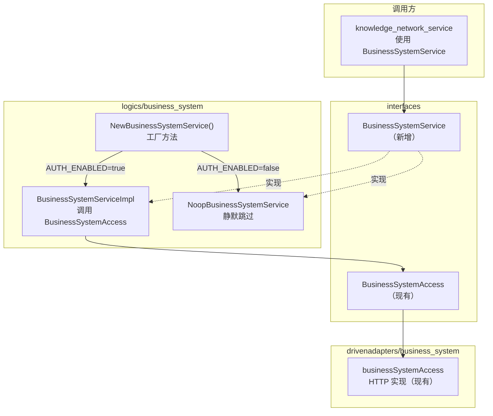
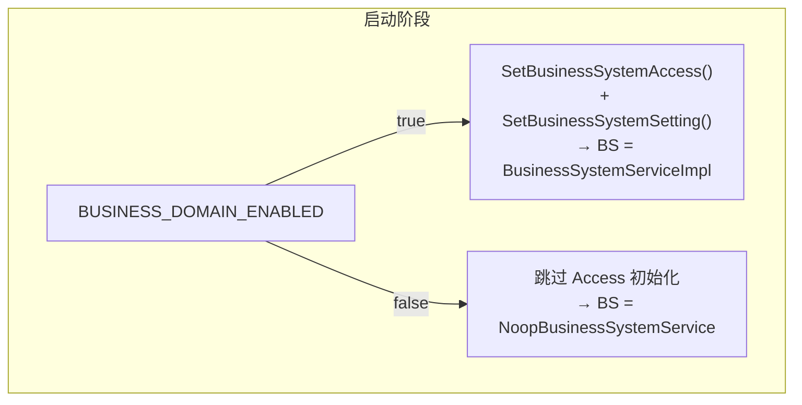
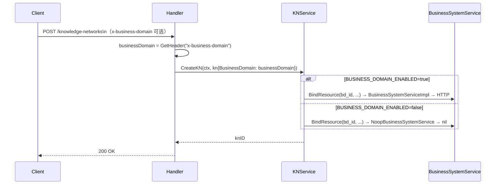

# bkn-backend 业务域（business-domain）解耦技术设计文档

> **状态**：已完成
> **负责人**：@
> **日期**：2026-03-24
> **相关 Ticket**：[#177](https://github.com/kweaver-ai/adp/issues/177)

---

## 1. 背景与目标 (Context & Goals)

### 背景

bkn-backend 创建/删除知识网络时，强依赖 `business-system` 服务完成业务域绑定（`BindResource`）和解绑（`UnbindResource`）。同时，创建和列表接口要求调用方必须传入 `x-business-domain` Header，为空即返回 400。

`AUTH_ENABLED=false` 解耦了认证与权限后，`business-system` 成为残留的 ISF 强依赖：服务在非 ISF 环境中仍无法独立运行。

当前架构中，`knowledge_network_service` 直接依赖 `BusinessSystemAccess` 接口，缺少 Service 层抽象，与 Auth/Permission 的分层规范不一致。

### 目标

1. 引入 `BusinessSystemService` 接口，补齐 Service 层，`BusinessSystemAccess` 仅由 Impl 调用
2. 引入独立的 `BUSINESS_DOMAIN_ENABLED` 环境变量，与 `AUTH_ENABLED` 解耦，独立控制业务域功能
3. 开关关闭时，`BindResource` / `UnbindResource` 调用静默跳过，不发起网络请求
4. 开关关闭时，`x-business-domain` Header 不再强制校验

### 非目标 (Non-Goals)

- 不将业务域开关与认证开关绑定，两者可独立配置
- 不修改 `business-system` 服务本身的任何逻辑
- 不改变 `BUSINESS_DOMAIN_ENABLED=true` 时的任何现有行为

---

## 2. 方案概览 (High-Level Design)

### 2.1 系统架构图

完全对齐 Auth/Permission 的分层模式：





---

## 3. 详细设计 (Detailed Design)

### 3.1 核心逻辑 (Core Logic)

#### 新增：BusinessSystemService 接口

```go
// interfaces/business_system_service.go
//go:generate mockgen -source ../interfaces/business_system_service.go -destination ../interfaces/mock/mock_business_system_service.go
type BusinessSystemService interface {
    BindResource(ctx context.Context, bd_id string, rid string, rtype string) error
    UnbindResource(ctx context.Context, bd_id string, rid string, rtype string) error
}
```

#### 新增：BusinessSystemServiceImpl

```go
// logics/business_system/business_system_service_impl.go
type BusinessSystemServiceImpl struct {
    bsa interfaces.BusinessSystemAccess
}

func NewBusinessSystemServiceImpl(appSetting *common.AppSetting) interfaces.BusinessSystemService {
    return &BusinessSystemServiceImpl{bsa: logics.BSA}
}

func (s *BusinessSystemServiceImpl) BindResource(ctx context.Context, bd_id, rid, rtype string) error {
    return s.bsa.BindResource(ctx, bd_id, rid, rtype)
}

func (s *BusinessSystemServiceImpl) UnbindResource(ctx context.Context, bd_id, rid, rtype string) error {
    return s.bsa.UnbindResource(ctx, bd_id, rid, rtype)
}
```

#### 新增：NoopBusinessSystemService

```go
// logics/business_system/noop_business_system_service.go
type NoopBusinessSystemService struct{}

func NewNoopBusinessSystemService(appSetting *common.AppSetting) interfaces.BusinessSystemService {
    return &NoopBusinessSystemService{}
}

func (n *NoopBusinessSystemService) BindResource(ctx context.Context, bd_id, rid, rtype string) error {
    return nil // 静默跳过
}

func (n *NoopBusinessSystemService) UnbindResource(ctx context.Context, bd_id, rid, rtype string) error {
    return nil // 静默跳过
}
```

#### 新增：GetBusinessDomainEnabled

```go
// common/setting.go
func GetBusinessDomainEnabled() bool {
    envVal := os.Getenv("BUSINESS_DOMAIN_ENABLED")
    // 仅当显式设置为 false 或 0 时禁用
    return envVal != "false" && envVal != "0"
}
```

与 `GetAuthEnabled()` 保持相同约定：不设置时默认 `true`，安全优先。

#### 新增：NewBusinessSystemService 工厂方法

```go
// logics/business_system/business_system_service.go
var (
    bsServiceOnce sync.Once
    bsService     interfaces.BusinessSystemService
)

func NewBusinessSystemService(appSetting *common.AppSetting) interfaces.BusinessSystemService {
    bsServiceOnce.Do(func() {
        if !common.GetBusinessDomainEnabled() {
            bsService = NewNoopBusinessSystemService(appSetting)
        } else {
            bsService = NewBusinessSystemServiceImpl(appSetting)
        }
    })
    return bsService
}
```

#### 改造：main.go 初始化

`BusinessSystemAccess` 由独立开关控制，与 `AUTH_ENABLED` 块分开：

```go
// main.go
if common.GetAuthEnabled() {
    logics.SetAuthAccess(auth.NewHydraAuthAccess(appSetting))
    logics.SetPermissionAccess(permission.NewPermissionAccess(appSetting))
    logics.SetUserMgmtAccess(user_mgmt.NewUserMgmtAccess(appSetting))
}
if common.GetBusinessDomainEnabled() {
    logics.SetBusinessSystemAccess(business_system.NewBusinessSystemAccess(appSetting))
}
// ...
logics.SetBusinessSystemService(business_system.NewBusinessSystemService(appSetting))
```

#### 改造：SetBusinessSystemSetting 条件化

```go
// common/setting.go
func SetBusinessSystemSetting() {
    if !GetBusinessDomainEnabled() {
        logger.Info("Business domain disabled via BUSINESS_DOMAIN_ENABLED env, skipping business-system configuration")
        return
    }
    // 现有逻辑不变
}
```

#### 改造：knowledge_network_service 替换依赖

`kns.bsa`（`BusinessSystemAccess`）替换为 `kns.bs`（`BusinessSystemService`），调用方式不变：

```go
// 改造前
type knowledgeNetworkService struct {
    bsa interfaces.BusinessSystemAccess
    // ...
}
kns.bsa.BindResource(ctx, kn.BusinessDomain, kn.KNID, interfaces.MODULE_TYPE_KN)
kns.bsa.UnbindResource(ctx, kn.BusinessDomain, kn.KNID, interfaces.RESOURCE_TYPE_KN)

// 改造后
type knowledgeNetworkService struct {
    bs interfaces.BusinessSystemService
    // ...
}
kns.bs.BindResource(ctx, kn.BusinessDomain, kn.KNID, interfaces.MODULE_TYPE_KN)
kns.bs.UnbindResource(ctx, kn.BusinessDomain, kn.KNID, interfaces.RESOURCE_TYPE_KN)
```

#### 改造：Handler 中移除 Header 强制校验

`x-business-domain` 改为可选字段。Service 层根据 `BUSINESS_DOMAIN_ENABLED` 决定是否实际使用该值。

Handler 读取逻辑：

```go
businessDomain := c.GetHeader(interfaces.HTTP_HEADER_BUSINESS_DOMAIN)
```



涉及改动点（移除必填校验）：
- `driveradapters/knowledge_network_handler.go` → `CreateKN`
- `driveradapters/knowledge_network_handler.go` → `ListKNsByEx`
- `driveradapters/bkn_handler.go` → `UploadBKN`

### 3.2 数据模型变更 (Data Schema)

不涉及数据库 Schema 变更。

`x-business-domain` 改为可选后，`f_business_domain` 字段可能存储空字符串，数据库列已允许为空，无需 migration。`ListKNsByEx` 已有 `if query.BusinessDomain != ""` 短路判断，Header 未传时自动跳过业务域过滤条件。

### 3.3 接口定义 (Interface Definition)

新增文件：

| 文件 | 说明 |
|------|------|
| `interfaces/business_system_service.go` | `BusinessSystemService` 接口定义 |
| `interfaces/mock/mock_business_system_service.go` | mockgen 生成的 mock |
| `logics/business_system/business_system_service.go` | 工厂方法（读取 `BUSINESS_DOMAIN_ENABLED`） |
| `logics/business_system/business_system_service_impl.go` | Impl，调用 `BusinessSystemAccess` |
| `logics/business_system/noop_business_system_service.go` | Noop 实现 |

改动文件：

| 文件 | 改动 |
|------|------|
| `logics/driven_access.go` | 新增 `BS BusinessSystemService` 及 `SetBusinessSystemService()` |
| `main.go` | `SetBusinessSystemAccess` 移入 `if GetBusinessDomainEnabled()` 块；新增 `SetBusinessSystemService` |
| `common/setting.go` | 新增 `GetBusinessDomainEnabled()`；`SetBusinessSystemSetting()` 增加短路 |
| `logics/knowledge_network/knowledge_network_service.go` | `bsa BusinessSystemAccess` → `bs BusinessSystemService` |
| `driveradapters/knowledge_network_handler.go` | `CreateKN` / `ListKNsByEx` 移除 `x-business-domain` 必填校验 |
| `driveradapters/bkn_handler.go` | `UploadBKN` 移除 `x-business-domain` 必填校验 |
| `helm/bkn-backend/values.yaml` | 新增 `businessDomain.enabled` 配置项 |
| `helm/bkn-backend/templates/deployment.yaml` | 注入 `BUSINESS_DOMAIN_ENABLED` 环境变量 |

---

## 4. 边界情况与风险 (Edge Cases & Risks)

**`BUSINESS_DOMAIN_ENABLED=false` 时 `logics.BSA` 为 nil**

`SetBusinessSystemAccess` 移入 `if common.GetBusinessDomainEnabled()` 块，禁用时 `logics.BSA` 保持 nil。架构约束：禁止绕过 `BusinessSystemService` 直接调用 `logics.BSA`，违反此约束将导致 nil dereference panic。


**`BUSINESS_DOMAIN_ENABLED` 仅在首次部署时设置，后续不可更改**

`sync.Once` 保证工厂方法全生命周期只初始化一次，后续变更需重新部署，后果由部署方自行负责。

---

## 5. 任务拆分 (Milestones)

**Step 1 — 配置层**
- [x] `common/setting.go`：新增 `GetBusinessDomainEnabled()`
- [x] `common/setting.go`：`SetBusinessSystemSetting()` 增加 `BUSINESS_DOMAIN_ENABLED` 短路

**Step 2 — 接口层**
- [x] 新增 `interfaces/business_system_service.go`：定义 `BusinessSystemService` 接口及 `go:generate` 指令

**Step 3 — 逻辑层**
- [x] 新增 `logics/business_system/noop_business_system_service.go`
- [x] 新增 `logics/business_system/business_system_service_impl.go`
- [x] 新增 `logics/business_system/business_system_service.go`：工厂方法

**Step 4 — Mock 生成**
- [x] 运行 `go generate ./interfaces/...`，生成 `interfaces/mock/mock_business_system_service.go`

**Step 5 — 注入层**
- [x] `logics/driven_access.go`：新增 `BS BusinessSystemService` 及 `SetBusinessSystemService()`
- [x] `main.go`：`SetBusinessSystemAccess` 移入 `if GetBusinessDomainEnabled()` 块；新增 `SetBusinessSystemService`

**Step 6 — Service 层改造**
- [x] `logics/knowledge_network/knowledge_network_service.go`：`bsa BusinessSystemAccess` → `bs BusinessSystemService`

**Step 7 — Handler 层**
- [x] `driveradapters/knowledge_network_handler.go`：`CreateKN` / `ListKNsByEx` 移除 `x-business-domain` 必填校验
- [x] `driveradapters/bkn_handler.go`：`UploadBKN` 移除 `x-business-domain` 必填校验

**Step 8 — Helm**
- [x] `helm/bkn-backend/values.yaml`：新增 `businessDomain.enabled: true`
- [x] `helm/bkn-backend/templates/deployment.yaml`：注入 `BUSINESS_DOMAIN_ENABLED` 环境变量

**Step 9 — 测试**
- [x] 新增 `logics/business_system/` 下 Noop 和 Impl 的单元测试
- [x] 更新 `driveradapters/knowledge_network_handler_test.go`：mock 由 `BusinessSystemAccess` 改为 `BusinessSystemService`，移除必填 Header 断言
- [x] 更新 `driveradapters/bkn_handler_test.go`：同上
- [x] 更新 `logics/knowledge_network/knowledge_network_service_test.go`：注入字段由 `bsa` 改为 `bss`
