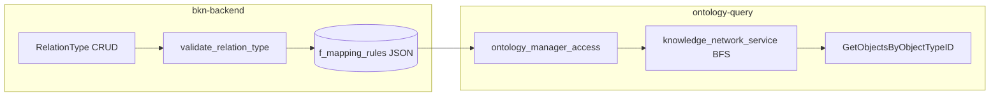

# filtered_cross_join 代码实现计划

依据 [DESIGN.md](/home/workspaces/ADP/kweaver-core/adp/docs/design/bkn/features/filtered_cross_join/DESIGN.md)，实现不引入 SQL planner，核心落在 **ontology-query 子图扩展** 与 **bkn-backend 建模校验/存取**。

## 架构与数据流

- **配额 `Q`**：仅由 ontology-query 在「单关系边、单子图请求」的扩展步骤读取；全局路径配额 [PathQuotaManager](adp/bkn/ontology-query/server/interfaces/knowledge_network.go) 保持独立，不与设计中的 `max_edge_expand` 混用。

## 1. 接口与类型定义（双服务对齐）

| 文件                                                                                                          | 变更                                                                                                                                                                                                                                                  |
| ----------------------------------------------------------------------------------------------------------- | --------------------------------------------------------------------------------------------------------------------------------------------------------------------------------------------------------------------------------------------------- |
| [ontology-query/.../interfaces/relation_type.go](adp/bkn/ontology-query/server/interfaces/relation_type.go) | 新增常量 `RELATION_TYPE_FILTERED_CROSS_JOIN = "filtered_cross_join"`；新增独立结构体（建议名 `FilteredCrossJoinMapping`），字段 `SourceCondition *cond.CondCfg`、`TargetCondition *cond.CondCfg`，JSON 名与设计一致：`source_condition`、`target_condition`（与现有 `CondCfg` 序列化一致）。 |
| [bkn-backend/.../interfaces/relation_type.go](adp/bkn/bkn-backend/server/interfaces/relation_type.go)       | 同上常量与结构体（若 bkn-backend 的 `interfaces` 不引用 `cond` 包，可用与现有 [action_type.go CondCfg](adp/bkn/bkn-backend/server/interfaces/action_type.go) 一致的嵌入方式，或抽成与 ontology-query 相同的 `cond` 依赖，避免两套字段名）。                                                         |

**原则**：`MappingRules` 仍为 `any`，但 **仅在** `type == filtered_cross_join` 时反序列化为新结构体，与 `[]Mapping` / `InDirectMapping` 三分支并列，避免 mapstructure/json 混用。

## 2. bkn-backend：校验与入参规范化

| 文件                                                                                                                        | 变更                                                                                                                                                                                                                                                                                              |
| ------------------------------------------------------------------------------------------------------------------------- | ----------------------------------------------------------------------------------------------------------------------------------------------------------------------------------------------------------------------------------------------------------------------------------------------- |
| [driveradapters/validate_relation_type.go](adp/bkn/bkn-backend/server/driveradapters/validate_relation_type.go)           | `ValidateRelationType` 中允许第三类型；`validateMappingRules` 增加 `case RELATION_TYPE_FILTERED_CROSS_JOIN`。                                                                                                                                                                                              |
| 新增 `validateFilteredCrossJoinMappingRules`                                                                                | `mapstructure.Decode` 到新结构体；`source_condition` / `target_condition` 非空；调用与 [object_type_service 中 `cond.NewCondition](adp/bkn/ontology-query/server/logics/object_type/object_type_service.go)` **等价**的校验链（bkn-backend 侧若已有 condition 校验工具则复用，否则引入 `common/condition` 中与解析一致的校验入口），确保可解析为合法条件树。 |
| [logics/relation_type/relation_type_service.go](adp/bkn/bkn-backend/server/logics/relation_type/relation_type_service.go) | 在现有 `switch relationType.Type`（displayName 补全约 396 行、属性存在性校验约 1196 行）中增加分支：对 `FilteredCrossJoinMapping` **不再校验** property 映射对；改为校验条件树中 **field** 均落在对应侧 `ObjectType.PropertyMap`（及平台协议允许的 meta 字段，与现有 object 查询对齐）。`strictMode`/数据源规则与 `data_view` 一致处理。                                        |

## 3. bkn-backend：持久化读写

[drivenadapters/relation_type/relation_type_access.go](adp/bkn/bkn-backend/server/drivenadapters/relation_type/relation_type_access.go) 中所有按 `RELATION_TYPE_DIRECT` / `DATA_VIEW` 分支 `sonic.Unmarshal` / `Marshal` 的位置（grep 显示约 282、431、552、946 行等簇）增加第三分支，序列化类型为 `FilteredCrossJoinMapping`。

## 4. ontology-query：从 ontology-manager 拉取关系类时的反序列化

[drivenadapters/ontology_manager/ontology_manager_access.go](adp/bkn/ontology-query/server/drivenadapters/ontology_manager/ontology_manager_access.go) 内三处 `switch Type`（路径列表、单个关系类、列表）各增加 `RELATION_TYPE_FILTERED_CROSS_JOIN`，`json.Marshal` → `Unmarshal` 到 `FilteredCrossJoinMapping`（与现有 direct/data_view 模式一致）。

## 5. ontology-query：子图扩展核心逻辑（最高风险块）

主入口：[knowledge_network_service.go](adp/bkn/ontology-query/server/logics/knowledge_network/knowledge_network_service.go) 的 `getNextObjectsBatchByRelation`、`buildBatchConditions`、`mapResultsToObjects`、`isObjectRelated`。

**5.1 识别新类型并旁路旧逻辑**

- 在 `getNextObjectsBatchByRelation` **开头**（或在调用 `buildBatchConditions` 之前）判断 `edge.RelationType.Type == RELATION_TYPE_FILTERED_CROSS_JOIN`（或同时对 `MappingRules` 做 type assert），走专用函数，**不要**走「无 conditions 则返回 nil」的现有分支。

**5.2 语义（与设计 2.1 对齐）**

- **正向边**（`DIRECTION_FORWARD`）：当前层对象为起点类实例集合 `batch`；侧条件取 `SourceCondition` / `TargetCondition`（相对关系定义下的 source/target 对象类）。
  - 仅保留满足 `SourceCondition` 的当前层对象（对 `batch` 内数据用 [EvaluateInstanceAgainstCondition](adp/bkn/ontology-query/server/logics/common.go) 或已有内存求值，需加载对应 `ObjectType`）。
  - 查询目标类：**一次** `GetObjectsByObjectTypeID`，`ActualCondition = TargetCondition`（并与 `objectType` 上 path 条件 AND），排序键采用 **主键/稳定 id 升序**（与对象类 `PrimaryKeys` 或平台统一 id 字段一致，在设计中写死并加注释）。
  - 双重循环：`batch` 内源实例按稳定 id **升序**，目标集合同序；生成 `(s,t)` 边，将 `t` 归入 `result[s.ObjectID]`，直至本边本次扩展累计边数达到配置上限 `Q`（**静默截断**）。
- **反向边**：交换源/目标对象类 ID 与侧条件角色（`SourceCondition` 作用在「关系语义上的 source 侧对象类」实例，而非遍历方向），保证与「有向边 s→t」一致。

**5.3 与 `mapResultsToObjects` / `isObjectRelated`**

- 方案 A（推荐）：filtered 分支直接构建最终 `map[string]Objects`，不调用通用 `mapResultsToObjects`；`isObjectRelated` 对新类型或恒真/省略（因配对已在专用函数完成）。
- 若保留统一出口：为 `isObjectRelated` 增加 `FilteredCrossJoinMapping` 分支（例如恒为 true，当配对逻辑仅在查询层完成时）。

**5.4 基于对象的子图 API**

- [matchRelationsForPair](adp/bkn/ontology-query/server/logics/knowledge_network/knowledge_network_service.go) / [buildBatchConditionsForObjects](adp/bkn/ontology-query/server/logics/knowledge_network/knowledge_network_service.go)：增加第三分支：对输入 `sourceObjects` / `targetObjects` 分别按侧条件过滤后做笛卡尔积，**同一截断规则与排序**，上限仍用配置 `Q`。

**5.5 其它引用 `MappingRules.(type)` 处**

- 对 [common.go](adp/bkn/ontology-query/server/logics/common.go) 中依赖 `[]Mapping` / `InDirectMapping` 的函数（如路径校验）逐个排查；对 `filtered_cross_join` **跳过键映射**逻辑或单独处理。

## 6. 配置

- 在 [ontology-query/.../config/ontology-query-config.yaml](adp/bkn/ontology-query/server/config/ontology-query-config.yaml)（及对应 Go struct 装载处）增加项，例如 `filtered_cross_join.max_edge_expand`，默认 **10000**。
- Helm/ConfigMap 模板若存在 ontology-query 部署片段，同步文档化键名（实现阶段搜 `ontology-query-config`）。

**说明**：按设计，**bkn-backend 可不读该配额**；若运维要求双服务配置对齐，可仅写注释或相同默认常量，避免在 backend 误用。

## 7. BKN 文件 / SDK / OpenAPI（按需）

- [bkn_convert.go](adp/bkn/bkn-backend/server/logics/bkn_convert.go)：`Endpoint.Type` 与支持的结构若需从 BKN YAML 导入导出，则为 `bknsdk` 增加并列规则类型（否则导入会丢 `mapping_rules`）。
- OpenAPI YAML（若在 [adp/docs](adp/bkn) 或子模块维护）：为关系类 `type` 枚举与 `mapping_rules` oneOf 增加第三变体。

## 8. 测试建议

| 范围                          | 要点                               |
| --------------------------- | -------------------------------- |
| `validate_relation_type`    | 非法 condition、缺字段、类型错误；合法最小 JSON。 |
| `relation_type_access`      | 新类型 round-trip DB JSON。          |
| `knowledge_network_service` | `                                |
| 回归                          | 现有 direct/data_view 不被破坏。        |

---

## 验收清单（对齐设计 / 文档第五节与清单）

- `type == filtered_cross_join` 时 `mapping_rules` 为独立结构，与 direct/data_view 互不串型。
- 子图扩展在 N>Q 时**至多 Q 条边、不报错误**；N \le Q 不截断。
- 配额可通过配置修改且子图行为随之变化。
- **非**子图展开路径不应用该截断。
- 关系类仍**无**物化边存储（仅存 JSON 规则）。

## 失败条件

- N>Q 时返回错误 → 不通过。
- 截断顺序非确定性 → 不通过。
- 非子图 API（列表/详情/其它查询）错误套用 `max_edge_expand` → 不通过。

