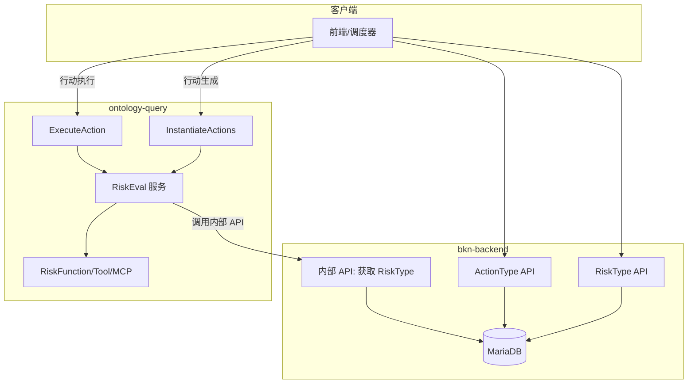
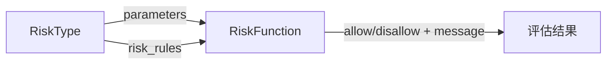
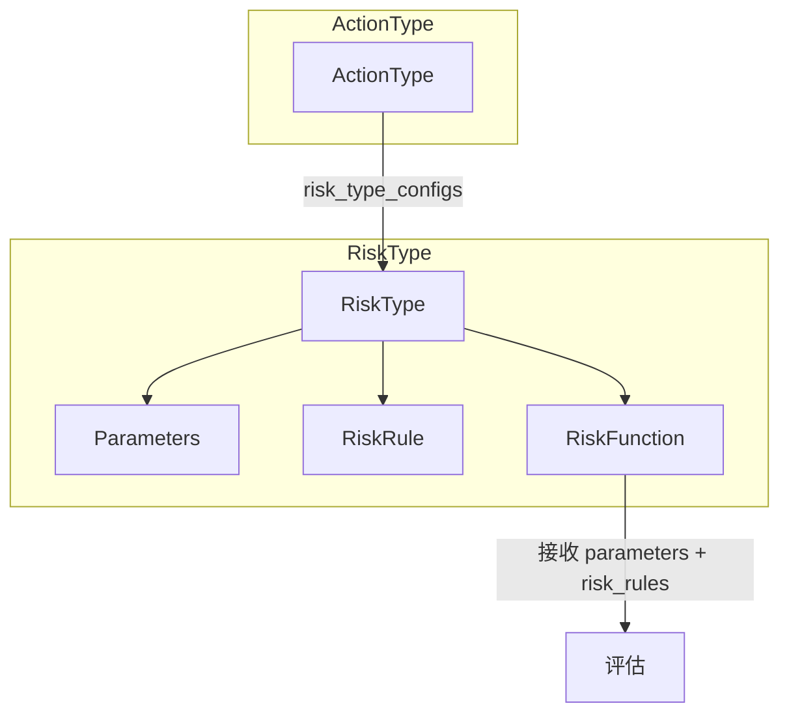
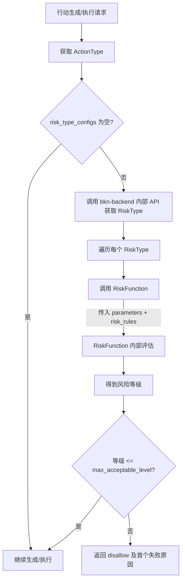

# BKN Risk Type 技术设计文档

> **状态**：草案
> **版本**：0.1.0
> **日期**：2026-03-18
> **相关 Ticket**：#337

---

## 1. 背景与目标 (Context & Goals)

当前 ADP 通过 BKN Engine 管理业务知识网络，行动类（ActionType）支持定义触发条件、工具配置与参数绑定，但在行动生成与执行前缺少统一的风险评估机制：

- **风险建模缺失**：无法显式表达时间窗口、前置校验、安全限制等多维度风险检查。
- **规则与实现耦合**：风险判断逻辑分散在业务代码中，难以配置和复用。
- **放行策略不统一**：缺少基于风险等级的放行阈值与多 Rule 合并策略。

**目标**：在 bkn-backend 中引入 **Risk Type（风险类）**，支持在行动生成与执行前进行多维度风险评估，通过 RiskType、RiskRule、RiskFunction 的组合实现可配置、可复用的风险检查机制。

**非目标**：不替换现有 ActionType 模型。

### 1.1 作用

- **前置拦截**：在行动生成（实例化）和行动执行两个关键节点进行风险校验
- **多维度检查**：一个 Action 可绑定多个 RiskType，从时间窗口、前置校验、安全限制等不同维度并行评估
- **统一放行策略**：仅当所有绑定的 RiskType 评估等级均不超过其 max_acceptable_level 时，才允许生成或执行行动

### 1.2 价值

- **降低误操作风险**：封网期、核心表变更等场景可自动拦截
- **可配置、可复用**：RiskType 独立定义，可被多个 ActionType 复用
- **规则与实现分离**：RiskRule 定义业务规则，RiskFunction 提供执行逻辑，便于扩展和维护

---

## 2. 方案概览 (High-Level Design)

### 2.1 核心思路

- **RiskType**：风险检查维度，定义参数、规则与绑定的 RiskFunction。
- **RiskRule**：具体规则，包含 when（命中条件）、decision（满足时的风险等级）、message。
- **RiskFunction**：可执行的风险评估逻辑（Tool/MCP），接收 parameters 和 risk_rules，返回各 Rule 的风险等级。
- **ActionType** 通过 `risk_type_configs` 绑定 RiskType 并配置参数值；仅当所有 RiskType 的评估等级均不超过其 `max_acceptable_level` 时，才允许行动生成或执行。

### 2.2 总体架构



- **bkn-backend**：RiskType 的 CRUD、ActionType 的 risk_type_configs 配置、概念同步、提供相应的内部 API。
- **ontology-query**：在 InstantiateActions 和 ExecuteAction 前调用 RiskEval，通过 bkn-backend 内部 API 获取 RiskType，调用 RiskFunction 完成评估。

### 2.3 关键决策

1. **风险等级驱动**：采用 5 级风险（safe/low/medium/high/critical），Rule 满足 when 时输出 decision 等级，不满足时默认 safe；多 Rule 合并取最高等级。
2. **RiskType 配置放行阈值**：`max_acceptable_level` 表示最高可接受等级，评估结果高于此则 Action 不执行。
3. **规则与实现分离**：RiskRule 定义业务规则（when、decision），RiskFunction 提供执行逻辑，便于扩展和维护。
4. **参数双轨**：RiskType 定义扁平参数（name 唯一）；RiskFunction 定义 API 参数（按 path/query/header/body 分组，body 支持 JSON path 嵌套）。

---

## 3. 详细设计
### 3.1 概念定义与模型关系

#### 3.1.1 风险等级定义

系统定义 5 个风险等级，数值越大风险越高：

| 等级 | 枚举值 | 说明 |
|------|--------|------|
| 1 | safe | 安全，可接受 |
| 2 | low | 低风险，可接受 |
| 3 | medium | 中风险，需关注 |
| 4 | high | 高风险，警告 |
| 5 | critical | 严重，禁止 |

**比较规则**：`critical > high > medium > low > safe`


#### 3.1.2 RiskRule 与 RiskFunction 的关系



#### 3.1.3 模型关系




- **ActionType**：系统能力（如 execute_ddl、restart_service）
- **RiskType**：检查维度，包含 parameters、risk_rules、绑定的 risk_function
- **RiskRule**：具体禁止/允许规则，作为配置传入 RiskFunction
- **RiskFunction**：评估实现，接收 parameters 和 risk_rules，返回评估结果

---

#### 3.1.4 RiskType 数据模型

```yaml
RiskType:
  id: string                    # 风险类 ID
  name: string                  # 风险类名称
  tags: [string]               # 标签
  description: string          # 描述
  icon: string                 # 图标
  color: string                 # 颜色
  kn_id: string                 # 业务知识网络 ID
  branch: string                # 分支
  max_acceptable_level: string  # 最高可接受的风险等级（safe/low/medium/high/critical）
  parameters: [ParamDef]        # 风险类参数定义，name 在当前 RiskType 下唯一
  risk_rules: [RiskRule]        # 风险规则列表
  risk_function: RiskFunction  # 绑定的风险评估函数（含 parameters 定义）
  # CommonInfo: creator, create_time, updater, update_time
```

**max_acceptable_level 语义**：若 Rules 合并后的评估结果**高于**此等级，则 Action 不执行。例如 `max_acceptable_level: medium` 表示可接受 safe、low、medium；若结果为 high 或 critical 则禁止执行。

**ParamDef**（RiskType 参数，扁平列表）：

```yaml
ParamDef:
  name: string         # 参数名，当前 RiskType 下唯一
  type: string         # string, number, integer, boolean, array, object
  required: boolean
  description: string
  default: any         # 可选
```


#### 3.1.5 RiskRule 数据模型

```yaml
RiskRule:
  id: string
  name: string
  description: string          # 规则描述
  when: RiskRuleWhen           # 命中条件，支持结构化 condition 与自然语言
  decision: string             # 满足条件时的风险等级（safe/low/medium/high/critical）
  message: string              # 提示信息
```

**decision 语义**：当 `when` 条件**满足**时，该 Rule 的风险等级为 decision；**不满足**时，默认等级为 safe（1）。

**多 Rule 合并**：多个 RiskRule 评估后，取**最高**等级作为该 RiskType 的最终评估结果。

##### 3.1.5.1 RiskRuleWhen（命中条件）

支持两种表达方式，并可**绑定 RiskType 参数**：

```yaml
RiskRuleWhen:
  type: condition | natural_language
  # 当 type=condition 时使用
  condition: CondCfg           # 复用 CondCfg 结构，见下方扩展
  # 当 type=natural_language 时使用
  natural_language: string     # 自然语言描述，用 {{param_name}} 引用参数
```

**1. 结构化 condition（CondCfg）**

复用 ActionType 的 CondCfg 结构，扩展 `value_from` 支持参数引用：


| value_from | 说明                                            |
| ---------- | --------------------------------------------- |
| const      | 常量，value 为字面值                                 |
| param      | **新增**：参数，value 为 RiskType 参数名（ParamDef.name） |


**参数引用示例**：当参数 `time_window` 等于 `month_end_finance` 且 `systems` 包含 `ERP核心库` 时命中：

```yaml
when:
  type: condition
  condition:
    operation: and
    sub_conditions:
      - field: time_window
        operation: "=="
        value_from: const
        value: month_end_finance
      - field: systems
        operation: contain
        value_from: const
        value: ERP核心库
```

`field` 为 RiskType 参数名（ParamDef.name），评估时从 RiskTypeConfig.parameters 取值。比较参数与另一参数时用 `value_from: param`：

```yaml
- field: time_window
  operation: "=="
  value_from: param
  value: allowed_window
```

**2. 自然语言**

用 `{{param_name}}` 引用参数，由 RiskFunction 或下游解析：

```yaml
when:
  type: natural_language
  natural_language: "当 {{time_window}} 为月末封网且 {{systems}} 包含 ERP核心库 时命中"
```

或更简形式：

```yaml
natural_language: "时间窗口为 month_end_finance 且系统列表包含 ERP核心库 时禁止执行"
```

**评估时**：将 RiskTypeConfig.parameters 注入上下文，condition 中 `value_from: param` 的 value 从 parameters 取值；natural_language 中的 `{{name}}` 替换为对应参数值后，交由 RiskFunction 或 LLM 解析。

#### 3.1.6 RiskFunction 数据模型（绑定方式 + 参数定义）

RiskFunction 中配置 parameters，**标记位置**（path/query/header/body），body 的 `name` 支持 **JSON path**（`a.b.c`）以支持 object 多层级嵌套。无需 parameter_mapping。

```yaml
RiskFunction:
  type: tool
  box_id: string
  tool_id: string
  mcp_id: string
  tool_name: string
  parameters:   # tool 所需参数
    - name: string
      type: string
      source: string
      value_from: const | param   # value_from来自于常量或者是 risk type 中的定义的参数
      value: any  # 参数值，当 value from 为 const 时，需要为具体值
      required: boolean
      comment: string
      default: any
```

**RiskFunction 返回**：每个 Rule 满足 when 时返回 decision 作为等级；不满足时返回 safe（1）。或由 RiskFunction 统一返回各 Rule 的等级。

**示例**：

```yaml
parameters:
  body:
    - name: request.filters.time_window
      type: string
      required: true
    - name: request.filters.systems
      type: array
      required: true
    - name: request.options.strict
      type: boolean
      default: false
```

#### 3.1.7 ActionType 扩展

```yaml
ActionType:
  # ... 现有字段 ...
  risk_type_configs: [RiskTypeConfig]   # 绑定的风险类及参数配置
```

```yaml
RiskTypeConfig:
  risk_type_id: string         # 绑定的 RiskType ID
  parameters: object            # RiskType 参数的实际值，key 为 RiskType ParamDef.name
```

**ActionType 绑定 RiskType 时**：为 RiskType 中定义的 parameters 配置具体值，key 为参数 name，value 为传入值。

#### 3.1.8 参数流程示例

**1. RiskFunction 定义 parameters**（按位置分组，body 的 name 为 JSON path）：

```yaml
risk_function:
  type: mcp
  mcp_id: risk-eval-mcp
  tool_name: check_time_window
  parameters:
    body:
      - name: request.filters.time_window
        type: string
        required: true
      - name: request.filters.systems
        type: array
        required: true
      - name: request.options.strict
        type: boolean
        default: false
```

**2. ActionType 绑定 RiskType 时配置参数值**（key 与 RiskFunction parameters 的 name 一致）：

```yaml
risk_type_configs:
  - risk_type_id: rt_window
    parameters:
      request.filters.time_window: month_end_finance
      request.filters.systems: [ERP核心库, WMS核心库]
      request.options.strict: true
```

**3. 组装调用**：按 parameters 定义的位置和 name，将 RiskTypeConfig.parameters 的值写入 path/query/header/body；body 的 name 按点号拆分写入嵌套对象。

---
 
### 3.2 数据库设计

#### 3.2.1 新增表：t_risk_type


| 字段                                       | 类型            | 说明                          |
| ---------------------------------------- | ------------- | --------------------------- |
| f_id                                     | VARCHAR(40)   | 风险类 ID                      |
| f_name                                   | VARCHAR(40)   | 风险类名称                       |
| f_description                            | VARCHAR(1000) | 描述                          |
| f_tags                                   | VARCHAR(255)  | 标签                          |
| f_icon                                   | VARCHAR(255)  | 图标                          |
| f_color                                  | VARCHAR(40)   | 颜色                          |
| f_comment                                | VARCHAR(1000) | 备注                          |
| f_kn_id                                  | VARCHAR(40)   | 业务知识网络 ID                   |
| f_branch                                 | VARCHAR(40)   | 分支                          |
| f_max_acceptable_level                   | VARCHAR(20)   | 最高可接受的风险等级（safe/low/medium/high/critical） |
| f_parameters                             | TEXT          | 参数定义 JSON（ParamDef 数组）      |
| f_risk_rules                             | TEXT          | 风险规则 JSON                   |
| f_risk_function                          | TEXT          | 风险评估函数配置 JSON（含 parameters） |
| f_creator, f_creator_type, f_create_time | -             | 审计字段                        |
| f_updater, f_updater_type, f_update_time | -             | 审计字段                        |


主键：`(f_kn_id, f_branch, f_id)`  
唯一键：`(f_kn_id, f_branch, f_name)`

#### 3.2.2 扩展表：t_action_type

新增字段：


| 字段                  | 类型   | 说明                    |
| ------------------- | ---- | --------------------- |
| f_risk_type_configs | TEXT | RiskTypeConfig[] JSON |


---

### 3.3 RiskEval 评估流程

#### 3.3.1 评估逻辑

```
1. 收到行动生成/执行请求
2. 获取 ActionType 及其 risk_type_configs
3. 若 risk_type_configs 为空 → 直接放行
4. 通过 bkn-backend 内部 API 获取各 RiskType 详情（含 risk_function、risk_rules、max_acceptable_level）
5. 遍历每个 risk_type_config：
   a. 调用 RiskFunction（传入 parameters、risk_rules、执行上下文）
   b. 各 Rule 评估：满足 when → 等级为 decision；不满足 → 等级为 safe
   c. 多 Rule 合并：取最高等级作为该 RiskType 的最终评估结果
   d. 若 最终等级 > RiskType.max_acceptable_level → 该 RiskType 不通过
6. 若任一 RiskType 不通过 → 整体 disallow，返回最高等级及错误信息
7. 全部通过 → 继续行动生成/执行
```

#### 3.3.2 集成点


| 场景   | 服务             | 集成位置                                                                                                                                                         |
| ---- | -------------- | ------------------------------------------------------------------------------------------------------------------------------------------------------------ |
| 行动生成 | ontology-query | [action_type_service.go InstantiateActions](adp/bkn/ontology-query/server/logics/action_type/action_type_service.go) 获取对象后、返回 actions 前                      |
| 行动执行 | ontology-query | [action_scheduler_service.go ExecuteAction](adp/bkn/ontology-query/server/logics/action_scheduler/action_scheduler_service.go) 获取 instances 后、创建 execution 前 |


#### 3.3.3 流程图




---

### 3.4 API 设计

#### 3.4.1 RiskType CRUD（bkn-backend）

- `GET /api/bkn-backend/v1/knowledge-networks/{kn_id}/risk-types` - 列表
- `POST /api/bkn-backend/v1/knowledge-networks/{kn_id}/risk-types` - 创建
- `PUT /api/bkn-backend/v1/knowledge-networks/{kn_id}/risk-types/{id}` - 更新
- `DELETE /api/bkn-backend/v1/knowledge-networks/{kn_id}/risk-types/{id}` - 删除
- `GET /api/bkn-backend/v1/knowledge-networks/{kn_id}/risk-types/{id}` - 详情

#### 3.4.2 内部 API（供 ontology-query 调用）

- `GET /api/bkn-backend/in/v1/knowledge-networks/{kn_id}/risk-types` - 按 ID 列表批量获取 RiskType 详情  
请求参数：`risk_type_ids`（逗号分隔或数组）、`branch`  
返回：RiskType 完整信息（含 max_acceptable_level、parameters、risk_rules、risk_function）

路径前缀 `/api/bkn-backend/in/v1/` 与现有内部接口约定一致，跳过 OAuth 认证。

#### 3.4.3 ActionType 扩展

创建/更新 ActionType 时，请求体支持 `risk_type_configs` 字段：

```json
{
  "name": "执行DDL",
  "risk_type_configs": [
    {
      "risk_type_id": "rt_window",
      "parameters": {
        "filters.time_window": "month_end_finance",
        "filters.systems": ["ERP核心库"]
      }
    },
    {
      "risk_type_id": "rt_precheck",
      "parameters": {
        "valid_snapshot_within_60m": true
      }
    }
  ]
}
```

---

### 3.5 实现要点

#### 3.5.1 bkn-backend 改动

- 新增 `RiskType` 接口、Access、Service、Handler、Validate
- 新增 `t_risk_type` 表及迁移
- 扩展 `ActionType` 结构体与 `t_action_type` 表
- 新增内部 API：按 ID 列表批量获取 RiskType（供 ontology-query 调用）
- 扩展 [bkn_convert.go](adp/bkn/bkn-backend/server/logics/bkn_convert.go) 中 ToADPActionType/ToBKNActionType 以支持 risk_type_configs
- 概念同步 [concept_syncer.go](adp/bkn/bkn-backend/server/worker/concept_syncer.go) 同步 RiskType 到 DataSet

#### 3.5.2 ontology-query 改动

- 新增 RiskEval 服务：通过 bkn-backend 内部 API 获取 RiskType，调用 RiskFunction（传入 parameters + risk_rules）
- 在 InstantiateActions 中，返回 actions 前调用 RiskEval
- 在 ExecuteAction 中，创建 execution 前调用 RiskEval
- RiskFunction 调用方式可复用 AgentOperatorAccess（类似 Tool/MCP 执行）

#### 3.5.3 BKN SDK 扩展

若使用 bkn-specification，需在 BKN 模型中增加 RiskType、RiskRule、RiskFunction 及 ActionType 的 risk_type_configs 定义。

---

## 4. 示例

### 4.1 RiskType 示例

```yaml
id: rt_window
name: 时间窗口
description: 时间/维护窗口限制
tags: [window, time]
icon: clock
color: #FFA500
max_acceptable_level: medium
parameters:
  - name: time_window
    type: string
    required: true
    description: 时间窗口标识
  - name: systems
    type: array
    required: true
    description: 适用的系统列表
risk_function:
  type: mcp
  mcp_id: risk-eval-mcp
  tool_name: check_time_window
  parameters:
    body:
      - name: filters.time_window
        type: string
        required: true
        description: 时间窗口标识
      - name: filters.systems
        type: array
        required: true
        description: 适用的系统列表
risk_rules:
  - id: rule_month_end_finance_freeze
    name: 月末财务绝对封网
    description: 月末封网期间禁止对财务核心系统执行DDL
    when:
      type: condition
      condition:
        operation: and
        sub_conditions:
          - field: time_window
            operation: "=="
            value_from: const
            value: month_end_finance
          - field: systems
            operation: contain
            value_from: const
            value: ERP核心库
    decision: high
    message: 月末封网窗口内禁止执行DDL
risk_function:
  type: mcp
  mcp_id: risk-eval-mcp
  tool_name: check_time_window
  parameters:
    body:
      - name: filters.time_window
        type: string
        required: true
      - name: filters.systems
        type: array
        required: true
```

### 4.2 ActionType 绑定示例

```yaml
id: act_execute_ddl
name: 执行DDL
risk_type_configs:
  - risk_type_id: rt_window
    parameters:
      filters.time_window: month_end_finance
      filters.systems: [ERP核心库]
  - risk_type_id: rt_precheck
    parameters:
      valid_snapshot_within_60m: true
```

