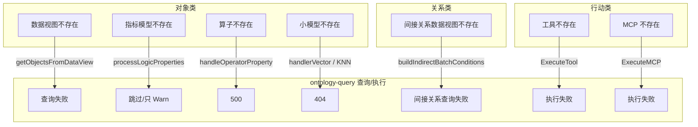

# BKN 概念依赖校验 技术设计文档

> **状态**：草案
> **版本**：0.1.0
> **日期**：2026-03-24
> **相关 Ticket**：#352

---

## 1. 背景与目标 (Context & Goals)

BKN 中对象类、关系类、行动类、概念分组之间存在多种依赖关系，既有对平台外部资源（数据视图、小模型、算子、指标、工具、MCP）的依赖，也有对知识网络内部资源（对象类、概念分组）的依赖。当前校验策略不一致：

- 部分依赖受 `validate_dependency` 参数控制（如对象类数据视图、关系类间接数据视图）
- 部分依赖始终强制校验，不受参数控制（如关系类起终点对象类、行动类绑定对象类、概念分组与对象类互引用）
- 部分依赖未做存在性校验（如行动类影响对象类、逻辑属性算子/指标、行动类工具/MCP）

这导致存在「影响对象类未校验」等漏洞，且无法满足导入等场景下先保存、后补全依赖的灵活需求。

**目标**：

- 统一依赖校验策略，引入 `strict_mode` 参数，使所有依赖的存在性校验均可控
- 运行期在 ontology-query 查视图、KNN、逻辑属性、行动详情、执行行动前对缺失依赖做明确报错
- bkn-backend 的构建对象索引任务在视图或小模型不存在时报错
- 兼容原导入业务知识网络的接口的参数 `validate_dependency`
- **提供接口对各个概念进行有效性校验，仅校验不保存**，便于导入前预检、批处理前自检等场景

**非目标**：不改变现有 API 契约（除参数重命名），不替换 ontology-query 的核心查询逻辑。

---

## 2. 方案概览 (High-Level Design)

### 2.1 核心思路

采用方案一——统一策略，所有依赖均由 `strict_mode` 控制；将原有 `validate_dependency` 参数重命名为 `strict_mode`。

### 2.2 总体架构

沿用现有 bkn-backend + ontology-query 架构：

- **保存期**：在创建/更新路径增加 `strict_mode` 参数传递链，KN 创建、概念分组创建/更新、单独创建行动类时均支持该参数
- **运行期**：ontology-query 在查视图实例、按 KNN 过滤、查逻辑属性、查行动详情、执行行动前校验依赖存在；bkn-backend 构建索引任务在视图或小模型不存在时报错
- **校验期**：提供对象类、关系类、行动类、概念分组、业务知识网络各自的有效性校验接口，仅校验不保存，支持导入前预检、编辑前自检等场景

### 2.3 关键决策

1. **参数命名**：`strict_mode`（query 参数与代码变量统一）
2. **不区分内外依赖**：关系类起终点、行动类绑定/影响对象类、概念分组与对象类互引用均受 `strict_mode` 控制
3. **运行期校验**：查视图、KNN、逻辑属性、行动详情、执行行动前校验依赖；构建索引任务在视图或小模型不存在时报错
4. **校验专用接口**：提供各概念的有效性校验接口，仅校验不保存，与创建/更新接口共享校验逻辑

---

## 3. 详细设计 (Detailed Design)

### 3.1 依赖关系与当前校验现状

#### 3.1.1 外部资源依赖

下列依赖在 **`strict_mode=true`** 时做存在性或可用性校验；**`strict_mode=false`** 时对应逻辑跳过，**允许引用尚不存在或不可用** 的外部资源先行落库（运行期 / 构建索引等另见后文）。

| 概念 | 外部依赖 | strict=true 时是否校验 | 实现要点（bkn-backend） | strict=false |
|------|----------|------------------------|-------------------------|--------------|
| **对象类** | 主数据视图 (DataSource.ID) | 是 | `object_type_service.validateObjectTypeStrictExternalDeps`；创建 / 更新 / `ValidateObjectTypes` 在 `strictMode` 下调用 | 不校验 |
| **对象类** | 逻辑属性 · 算子 (LogicProperty → operator) | 是 | 同上；`AgentOperatorAccess.GetAgentOperatorByID` | 不校验 |
| **对象类** | 逻辑属性 · 指标 (LogicProperty → metric) | 是 | 同上；`DataModelAccess.GetMetricModelByID` | 不校验 |
| **对象类** | 数据属性向量索引小模型 (IndexConfig.VectorConfig.ModelID) | 是 | 同上；对提交的 `DataProperties` 中「向量索引开启且 ModelID 非空」项校验小模型为元数据服务中的 embedding 模型 | 不校验 |
| **关系类** | 间接关系 backing 数据视图 (InDirectMapping.BackingDataSource) | 是 | `relation_type_service.validateDependency` 中间接关系分支；`GetDataViewByID` | 不校验 |
| **行动类** | 工具 (ActionSource.BoxID / ToolID，`type=tool`) | 是 | `validateActionSourceStrict`；internal `GET .../tool-box/{box_id}/tool/{tool_id}`（依赖配置项 `AgentOperatorUrl`） | 不校验 |
| **行动类** | MCP 工具 (McpID / ToolName，`type=mcp`) | 是 | 同上；`GET .../mcp/proxy/{mcp_id}/tools` 并在返回列表中匹配 `tool_name` | 不校验 |

#### 3.1.2 内部资源依赖

关系类 **`validateDependency` 在 `strict_mode=false` 时直接返回**，因此起终点对象类、映射字段与间接视图相关校验 **整段不执行**（与「仅外部依赖受 strict 控制」的常见误解不同）。

| 概念 | 内部依赖 | strict=true 时是否校验 | 实现要点 | strict=false |
|------|----------|------------------------|----------|--------------|
| **关系类** | 起点 / 终点对象类存在性；直连 / 间接映射（属性是否在 OT、字段是否在视图） | 是 | `validateDependency`；预检可带 `BatchIDIndex`，批内 OT 仅含 ID 无数据属性时映射校验按设计降级 | **整段跳过** |
| **行动类** | 绑定对象类 ObjectTypeID；Affect.ObjectTypeID | 是 | `CreateActionTypes` / `UpdateActionType` / `ValidateActionTypes`；`GetObjectTypeByID`；预检可用 `BatchIDIndex` 覆盖同批未落库的 OT | 不校验 |
| **概念分组** | 要关联的对象类 ID | 是 | `AddObjectTypesToConceptGroup`：`ListObjectTypes` 结果数量与请求的 OT ID 数量一致 | 不校验 |
| **对象类** | ConceptGroups[].CGID | 是 | `handleGroupRelations` / `syncObjectGroups`：`GetConceptGroupsByIDs` | 不校验 |

**用户要求（产品 / 架构目标）**：不区分内外部依赖，**凡存在性校验均应可通过 `strict_mode` 关闭**，以支持导入、分批建模等先落库后补依赖的场景；**默认 `strict_mode=true`** 保证建模期尽可能早发现坏引用。

**补充说明（与上表一致）**：

- 关系类：`validateDependency` 首行 `if !strictMode { return nil }`，故 **起终点、映射、间接视图** 均只在 strict 打开时 enforced。
- 行动类：`Affect.ObjectTypeID` 与 `ObjectTypeID` 同样在 `strictMode` 下校验；历史上若文档写「影响对象类未校验」，指 **旧实现**；当前实现与绑定对象类一致。
- 概念分组：`AddObjectTypesToConceptGroup` 仅在 `strictMode` 为真时做 OT 存在性计数校验。
- 对象类绑 CG：仅在 `strictMode` 为真时要求 `GetConceptGroupsByIDs` 全部命中。

#### 3.1.3 实现细节引用

**对象类**：

- 数据视图：创建时校验，受 `strict_mode` 控制  
  位置：[object_type_service.go:146-158](../../../../../bkn/bkn-backend/server/logics/object_type/object_type_service.go)
- 小模型：仅在 Update 路径校验，Create 路径未校验  
  位置：[object_type_service.go:645-667, 798-821](../../../../../bkn/bkn-backend/server/logics/object_type/object_type_service.go)
- 逻辑属性算子/指标：创建和更新时均未做存在性校验，仅做 format/type 校验  
  位置：[validate_object_type.go:199-222](../../../../../bkn/bkn-backend/server/driveradapters/validate_object_type.go)

**关系类**：

- 起终点对象类：在 `validateDependency` 中始终调用 `GetObjectTypeByID`，尚未改由 `strict_mode` 控制  
  位置：[relation_type_service.go:1184-1196](../../../../../bkn/bkn-backend/server/logics/relation_type/relation_type_service.go)
- 间接关系数据视图：仅在 `strict_mode=true` 时校验  
  位置：[relation_type_service.go:1221-1230](../../../../../bkn/bkn-backend/server/logics/relation_type/relation_type_service.go)

**行动类**：

- 绑定/影响对象类：`strict_mode=true` 时校验 `ObjectTypeID`、`Affect.ObjectTypeID` 存在性（`GetObjectTypeByID`）。  
  位置：[action_type_service.go](../../../../../bkn/bkn-backend/server/logics/action_type/action_type_service.go) 中 `CreateActionTypes`、`UpdateActionType`、`ValidateActionTypes`。
- 工具 / MCP：`strict_mode=true` 且 `action_source.type` 为 `tool`（且 `box_id`、`tool_id` 非空）或 `mcp`（且 `mcp_id`、`tool_name` 非空）时，经 `AgentOperatorAccess` 请求 agent-operator-integration internal-v1 接口校验存在性；`strict_mode=false` 不调用外部校验。  
  位置：同上文件中 `validateActionSourceStrict`；适配器：[agent_operator_access.go](../../../../../bkn/bkn-backend/server/drivenadapters/agent_operator/agent_operator_access.go)；配置：`AppSetting.AgentOperatorUrl`（单一 internal-v1 根 URL，见 `bkn-backend-config` 中 agent-operator-integration depService）。

**概念分组与对象类**：

- 概念分组添加对象类：AddObjectTypesToConceptGroup 通过 GetObjectTypesByIDs 校验对象类存在，`len(objectTypes) != len(otIDs)` 时报错  
  位置：[concept_group_service.go:1065-1076](../../../../../bkn/bkn-backend/server/logics/concept_group/concept_group_service.go)
- 对象类绑定概念分组：handleGroupRelations、syncObjectGroups 通过 GetConceptGroupsByIDs 校验概念分组存在，`len(conceptGroups) != len(cgIDs)` 时报错  
  位置：[object_type_service.go:1909, 1969](../../../../../bkn/bkn-backend/server/logics/object_type/object_type_service.go)

#### 3.1.4 预检与事务一致性（BatchIDIndex）

**问题**：单独调用各概念的「仅校验」接口时，依赖存在性仅靠 `Get*ByID` 等读库；而创建路径在同一事务内先插入子实体再校验，未提交行对已打开事务可见，导致「同批新建、库中尚无」的引用在预检(strict)下失败，在落库路径下却能通过。

**策略**：在 logic 层为预检增加 **BatchIDIndex**（`interfaces/batch_preflight.go`）：由当前请求体**已有字段**收集本批次的 OT/RT/AT/CG ID 及对象类载荷指针；`strict_mode=true` 时，对内部依赖先做「是否在批次中」判断，命中则不再要求必须先落库，否则再查库。外部资源（数据视图、指标、算子等）仍始终走原存在性校验，不纳入批次索引。

- **ValidateKN**：`CollectKNFromPayload` 遍历顶层四桶与 `concept_groups[]` 嵌套桶，构造全局索引；按与 `CreateKN` 一致的顺序调用 `ValidateConceptGroups` → `ValidateObjectTypes` → `ValidateRelationTypes` → `ValidateActionTypes`，并**透传同一索引**。
- **ValidateConceptGroups**：若调用方未传入父级索引（单接口预检），则仅根据本次 `entries` 对应的 `concept_groups[]` 树收集索引；若由 `ValidateKN` 调用则使用整包索引，使嵌套 RT/AT 可引用顶层或他组载荷中的 OT。
- **单资源 validate**（object/relation/action 独立接口）：调用方仍传 `batch=nil`，行为与历史一致——body 仅含单类条目、无法附带被引用方定义时，strict 下仍只认 DB。**产品侧**若需「同批未落库」预检，应使用 **`ValidateKN` 或 `ValidateConceptGroups` 的聚合 body**（与创建/导入同源结构），不扩展 JSON 字段。
- **映射规则**：关系类 `validateDependency` 需起终点 OT 的 `PropertyMap`（由数据属性推导）。若某 OT **仅在批次中声明了 ID**、载荷中无 `data_properties`，则视为预检**最低载荷不足**：存在性仍判通过，**映射字段存在性校验降级跳过**（与事务内全量校验可能不完全等价；完整映射预检须在包内提供对应 OT 定义）。
- **重复 ID**：同一 OT ID 在包内出现两次且 `ObjectTypeWithKeyField` 序列化不一致时，`CollectKNFromPayload` / `CollectFromConceptGroups` 返回错误，避免默认真值歧义。

---

### 3.2 允许依赖不存在时保存的影响

#### 3.2.1 外部依赖不存在时的运行期影响

| 依赖类型 | ontology-query 表现 |
|----------|---------------------|
| 对象类数据视图 | 查询对象实例时 `getObjectsFromDataView` 会失败 |
| 对象类指标模型 | processObjectTypeDetails 中 Warn 后跳过 |
| 对象类算子 | handleOperatorProperty 调用 GetAgentOperatorByID 失败返回 500 |
| 对象类小模型 | handlerVector KNN 查询时 404 |
| 关系类数据视图 | 间接关系子图查询失败 |
| 行动类工具/MCP | ExecuteTool/ExecuteMCP 执行失败 |

#### 3.2.2 内部依赖不存在时的运行期影响

- **关系类起终点对象类**：已强制校验，不会保存不存在的引用
- **行动类绑定对象类**：已强制校验
- **行动类影响对象类**：未校验，影响如下：
  - 执行影响对象类相关逻辑时，可能引用不存在的 ObjectTypeID
  - 列表/详情接口中 Affect.ObjectType 为空，前端显示异常
  - 影响对象类被删除后，行动类仍保留引用，产生「孤儿引用」
- **概念分组添加对象类**：已校验（AddObjectTypesToConceptGroup 中 GetObjectTypesByIDs 数量不匹配即报错），`strict_mode=false` 时需支持跳过
- **对象类绑定概念分组**：已校验（handleGroupRelations、syncObjectGroups 中 GetConceptGroupsByIDs 数量不匹配即报错），`strict_mode=false` 时需支持跳过

---

### 3.3 运行期依赖缺失的说明

**要求**：外部依赖不存在时，ontology-query 在查视图实例、按 KNN 过滤、查逻辑属性、查行动详情、执行行动前应检查依赖资源是否存在，不存在则报错；bkn-backend 的构建对象索引任务在视图或小模型不存在时应报错。

#### 3.3.1 ontology-query 运行期校验点

| 场景 | 依赖 | 当前位置 | 当前行为 | 改进 |
|------|------|----------|----------|------|
| 查视图实例 | 数据视图 | getObjectsFromDataView | 仅校验 DataSource.ID 非空，直接调用 GetViewDataByID，失败时错误较泛化 | 调用前显式检查视图存在；若不可行，至少对 404 做专项转换，返回「数据视图[%s]不存在」 |
| 按 KNN 过滤 | 小模型 | handlerVector | 已校验，model 为 nil 时返回 404 | 已满足，可优化错误码/文案为「小模型[%s]不存在」 |
| 查逻辑属性 | 算子 | handleOperatorProperty | GetAgentOperatorByID 失败即报错 | 已满足，可对 404 做专项提示「算子[%s]不存在」 |
| 查逻辑属性 | 指标模型 | handleMetricProperty | GetMetricDataByID 失败即报错 | 已满足，可对 404 做专项提示「指标模型[%s]不存在」 |
| 查行动详情 | 工具/MCP | ListActionTypes/GetActionTypes | 未检查 | 返回行动详情前校验 ActionSource 对应工具/MCP 是否存在，不存在则返回明确错误 |
| 执行行动 | 工具/MCP | ExecuteAction → ExecuteTool/ExecuteMCP | 执行时失败 | 执行前校验工具/MCP 是否存在，不存在则返回「工具/MCP[%s]不存在」 |

**文件路径**：ontology-query 位于 `adp/bkn/ontology-query/server/`。

#### 3.3.2 ontology-query 间接关系子图

- 关系类数据视图：`buildIndirectBatchConditions` → `batchGetViewData` → `GetViewDataByID`
- 建议：与查视图实例一致，对 404 做专项错误转换，或增加视图存在性预检。

#### 3.3.3 bkn-backend 构建对象索引任务

- 位置：[object_type_task.go](../../../../../bkn/bkn-backend/server/worker/object_type_task.go)
- 数据视图：173-179 行已调用 `GetDataViewByID`，`dataView == nil` 时返回错误
- 小模型：111-117 行已对 VectorConfig 启用属性调用 `GetModelByID`，`model == nil` 时返回错误
- **结论**：视图和小模型不存在时已报错；建议补充 `dataSource == nil` 或 `dataSource.ID == ""` 的早期校验，避免空指针并返回明确错误。

#### 3.3.4 实施要点汇总

**ontology-query 需新增/强化的校验**：

1. **查视图实例**：在调用 `GetViewDataByID` 前，若无法做显式预检，则需在 uniquery_access 中对 `respCode == 404` 做专项处理，返回「数据视图[%s]不存在」。
2. **KNN / 逻辑属性**：handlerVector、handleOperatorProperty、handleMetricProperty 已在校验路径上，重点优化 404 的错误文案（小模型/算子/指标模型不存在）。
3. **查行动详情、执行行动**：需在 action_type_service 与 action_scheduler_service 中，根据 ActionSource 类型在返回详情或执行前调用 AgentOperatorAccess 校验工具/MCP 是否存在（需确认 agent-operator 是否提供存在性接口）。

**bkn-backend 构建索引任务**：已在视图、小模型不存在时报错，仅需在任务入口增加 `dataSource == nil` 的防护。

---

### 3.4 参数控制范围与传递链

**参数定义**：

- Query 参数名：`strict_mode`（如 `?strict_mode=true`）
- 代码变量名：`strictMode`（bool）
- 常量：`QueryParam_StrictMode = "strict_mode"`
- 默认值：`true`

**语义**：不区分内外部依赖，所有依赖的存在性校验均由 `strict_mode` 控制。

- `strict_mode=true`（默认）：执行完整依赖校验，依赖不存在则报错
- `strict_mode=false`：跳过依赖校验，允许保存依赖不存在的配置（适用于导入等场景）

**控制范围对比**：

| 阶段 | 当前控制 | 实施后控制 |
|------|----------|------------|
| 对象类数据视图 | 受 validate_dependency 控制 | 受 strict_mode 控制 |
| 关系类间接数据视图 | 受 validate_dependency 控制 | 受 strict_mode 控制 |
| 关系类起终点对象类 | 始终校验，未受控 | 受 strict_mode 控制 |
| 行动类绑定/影响对象类 | 绑定始终校验，影响未校验 | 均受 strict_mode 控制 |
| 概念分组添加对象类 | 始终校验，未受控 | 受 strict_mode 控制 |
| 对象类绑定概念分组 | 始终校验，未受控 | 受 strict_mode 控制 |
| 对象类小模型、逻辑属性 | 部分/未校验 | 受 strict_mode 控制 |
| 行动类工具/MCP | 未校验 | 受 strict_mode 控制 |

**参数传递链**：KN 创建、概念分组创建、概念分组更新将 `strict_mode` 一路传至 CreateObjectTypes、CreateRelationTypes、CreateActionTypes；单独创建行动类的接口支持 `strict_mode` query 参数。

---

### 3.5 改进项实现汇总

#### 3.5.1 内部依赖改进

| 依赖类型 | 改进项 | 实现 |
|----------|--------|------|
| 关系类起终点对象类 | 改由 strict_mode 控制 | 在 relation `validateDependency` 中，仅当 `strictMode=true` 时调用 `GetObjectTypeByID` 并做属性映射校验；`false` 时直接 `return nil`，跳过全部校验 |
| 行动类绑定对象类 | 改由 strict_mode 控制 | CreateActionTypes 增加 `strictMode` 参数；仅当 `true` 时校验 `ObjectTypeID` 存在性 |
| 行动类影响对象类 | 新增校验并受控 | 同上，仅当 `strictMode=true` 时校验 `Affect.ObjectTypeID` 存在性 |
| 概念分组添加对象类 | 改由 strict_mode 控制 | AddObjectTypesToConceptGroup 增加 `strictMode` 参数；仅当 `true` 时校验对象类存在性 |
| 对象类绑定概念分组 | 改由 strict_mode 控制 | handleGroupRelations、syncObjectGroups 增加 `strictMode` 入参；仅当 `true` 时校验概念分组存在性 |

#### 3.5.2 外部依赖改进

| 依赖类型 | 改进项 | 实现 |
|----------|--------|------|
| 对象类数据视图 | 参数重命名 | 已有逻辑，将参数由 `validateDependency` 改为 `strictMode` |
| 对象类小模型 | 创建路径校验并受控 | 在 CreateObjectTypes / UpdateObjectType 中，仅当 `strictMode=true` 时校验 |
| 对象类逻辑属性 | 新增校验并受控 | 仅当 `strictMode=true` 时校验算子/指标存在性 |
| 关系类间接数据视图 | 参数重命名 | 已有逻辑，将参数改为 `strictMode` |
| 行动类工具/MCP | 新增校验并受控 | 仅当 `strictMode=true` 时校验（需接入对应 API） |

#### 3.5.3 关键代码修改点

**参数重命名**：

- interfaces/common.go：`QueryParam_ValidateDependency` → `QueryParam_StrictMode = "strict_mode"`
- knowledge_network_handler.go、concept_group_handler.go、action_type_handler.go：解析 `strict_mode`，变量 `validateDependency` → `strictMode`
- 各 service 方法签名：`validateDependency bool` → `strictMode bool`

**内部依赖**：relation_type_service、action_type_service、concept_group_service、object_type_service 中相关方法增加 `strictMode` 参数，并按参数决定是否执行校验。

**外部依赖**：object_type_service 中 VectorConfig 小模型、逻辑属性算子/指标校验均受 `strictMode` 控制；行动类工具/MCP 校验受 `strictMode` 控制。

---

### 3.6 概念有效性校验接口（仅校验不保存）

#### 3.6.1 功能说明

提供接口对各个概念（对象类、关系类、行动类、概念分组、业务知识网络）进行有效性校验，**仅执行校验逻辑，不落库保存**。适用于：

- 导入前预检：在批量导入前先校验配置是否合法、依赖是否完整，失败时提前发现问题
- 编辑前自检：前端在提交前调用校验接口，给用户即时反馈
- CI/批处理：在自动化流程中先校验再决定是否执行保存

#### 3.6.2 接口设计

**方案**：为各类概念提供独立的校验接口，复用现有 Validate* 逻辑及依赖存在性校验逻辑，但**不调用 Create/Update**。

| 接口 | 方法 | 路径 | 说明 |
|------|------|------|------|
| 对象类校验 | POST | `/api/bkn-backend/v1/knowledge-networks/:kn_id/object-types/validation` | 校验对象类配置及依赖，body 同创建接口 |
| 关系类校验 | POST | `/api/bkn-backend/v1/knowledge-networks/:kn_id/relation-types/validation` | 校验关系类配置及依赖，body 同创建接口 |
| 行动类校验 | POST | `/api/bkn-backend/v1/knowledge-networks/:kn_id/action-types/validation` | 校验行动类配置及依赖，body 同创建接口 |
| 概念分组校验 | POST | `/api/bkn-backend/v1/knowledge-networks/:kn_id/concept-groups/validation` | 校验概念分组配置及依赖，body 同创建接口 |
| 业务知识网络校验 | POST | `/api/bkn-backend/v1/knowledge-networks/:kn_id/validation` | 校验业务知识网络的配置及依赖，body 同创建接口 |

**Query 参数**：

- `strict_mode`（bool，默认 true）：是否校验依赖存在性，与创建/更新接口语义一致

**请求体**：与对应概念的创建接口相同（支持单条或批量，视现有创建接口而定）。

**响应**：

- **成功**：HTTP 200，返回 `{ "valid": true }` 或 `{ "valid": true, "message": "校验通过" }`
- **失败**：HTTP 400，返回与创建/更新接口一致的错误结构，包含具体校验失败原因（如「数据视图[xxx]不存在」「起点对象类[xxx]不存在」等）

**与创建接口的校验一致性**：校验接口执行的校验逻辑应与创建/更新接口在 `strict_mode=true` 时完全一致，包括格式校验、必填校验、引用存在性校验。不执行数据库写操作。

#### 3.6.3 实现要点

- 复用现有 `ValidateObjectType`、`ValidateRelationType`、`ValidateActionType`、`ValidateConceptGroup` 等驱动层校验函数
- 复用并抽取 service 层的依赖存在性校验逻辑（如 relation 的 `validateDependency`、object_type 的数据视图/小模型/逻辑属性校验等），封装为「仅校验」的纯函数或内部方法，供校验接口调用
- 校验接口**不开启事务**、**不写入数据库**、**不触发索引构建**，仅返回校验结果
- 批量校验时，可采用「遇错即返」或「收集全部错误后一次性返回」两种策略，建议采用后者以便用户一次性修正多处问题

#### 3.6.4 与知识网络整体导入的关系

若知识网络创建接口支持一次性提交 KN + ObjectTypes + RelationTypes + ActionTypes + ConceptGroups，可考虑：

- 调用 `POST /knowledge-networks/{kn_id}/validation` 接口：对完整的 KN 载荷进行整体校验，仅校验不保存

---

## 4. 风险与边界 (Risks & Edge Cases)

- **strict_mode=false 下的孤儿引用**：允许保存依赖不存在的配置后，可能产生孤儿引用（如影响对象类被删除后行动类仍保留引用）。运行期需在 ontology-query 等路径对缺失依赖做明确报错，避免静默失败。
- **运行期 404 与导入场景**：导入时 `strict_mode=false` 可跳过校验，但运行期若依赖缺失仍会失败。需在文档和错误提示中明确：保存期校验与运行期校验的职责分离，用户需在运行前补全依赖。
- **参数传递遗漏**：CreateActionTypes、AddObjectTypesToConceptGroup、handleGroupRelations 等需全线传递 `strictMode`，遗漏会导致行为不一致。实施时需系统梳理调用链。
- **ontology-query 与 bkn-backend 的职责边界**：保存期由 bkn-backend 控制；运行期由 ontology-query（查视图/KNN/逻辑属性/行动）和 bkn-backend 构建索引任务各自校验，二者需保持一致的行为预期。
- **校验接口与创建接口的同步**：有效性校验接口的校验逻辑需与创建/更新接口保持一致，任何新增的校验规则需同步到两处，否则可能出现「校验通过但创建失败」或「校验失败但创建成功」的不一致。

---

## 5. 替代方案 (Alternatives Considered)

### 方案 A（已选用）：统一策略，所有依赖由 strict_mode 控制

不区分内外依赖，所有依赖的存在性校验均由 `strict_mode` 控制。满足用户对导入灵活性与校验可控性的统一需求。

### 方案 B：保持现状 + 文档与告警

适用于暂不改动校验逻辑、优先保证导入灵活性的场景：在文档中明确哪些依赖可缺失、哪些会引发运行期错误；在 ontology-query 中对依赖缺失场景做更明确的错误提示。缺点：无法支持「先保存后补全」的导入流程，与用户要求不符。

### 方案 C（已废弃）：分层策略

原「内部依赖始终校验、外部依赖受控」的策略与用户要求「不区分内外依赖」不符，不再采用。

### 最终选择

采用方案 A——统一策略，所有依赖均由 `strict_mode` 控制，并将 `validate_dependency` 重命名为 `strict_mode`。

---

## 6. 任务拆分 (Milestones)

- [ ] **param-rename-strict-mode**：将 `validate_dependency` 参数重命名为 `strict_mode`（QueryParam、变量、接口）
- [ ] **strict-mode-unified**：关系类起终点对象类、行动类绑定/影响对象类改由 strict_mode 控制
- [ ] **action-type-strict-param**：CreateActionTypes 增加 strictMode 参数，KN/概念分组/handler 传递
- [ ] **cg-ot-strict-mode**：概念分组添加对象类、对象类绑定概念分组的校验改由 strict_mode 控制
- [ ] 对象类创建时对 VectorConfig 小模型的存在性校验（受 strict_mode 控制）
- [ ] 对象类逻辑属性（算子/指标）存在性校验（受 strict_mode 控制）
- [ ] 行动类工具/MCP 存在性校验（受 strict_mode 控制）
- [ ] **ontology-query-view-check**：ontology-query 查视图实例前校验数据视图存在，或对 404 返回「数据视图不存在」
- [ ] **ontology-query-knn-logic-err**：ontology-query KNN/逻辑属性 404 错误文案优化
- [ ] **ontology-query-action-check**：ontology-query 查行动详情、执行行动前校验工具/MCP 存在
- [ ] **bkn-backend-task-datasource**：bkn-backend 构建索引任务增加 dataSource 空指针防护
- [ ] **依赖校验 API**：对象类 / 关系类 / 行动类 / 概念分组 / 整包 KN 的 validate 路径已写入对应 OpenAPI 分文件（`object-type.yaml`、`relation-type.yaml`、`action-type.yaml`、`concept-group.yaml`、`business-knowledge-network.yaml`），支持 strict_mode 参数
- [ ] 可选：ontology-query 中依赖缺失场景的错误信息优化

**推荐实施顺序**：参数重命名 → 内部依赖改由 strict_mode 控制 → CreateActionTypes 增加 strictMode → 概念分组与对象类 → 对象类小模型与逻辑属性 → 行动类工具/MCP → 运行期校验与错误优化 → 概念有效性校验接口。

---

## 参考

- [DESIGN.md](../DESIGN.md)（主设计文档）
- [SPECIFICATION.md](../SPECIFICATION.md)
- bkn_依赖校验分析与方案_2541c7a6（分析方案）
