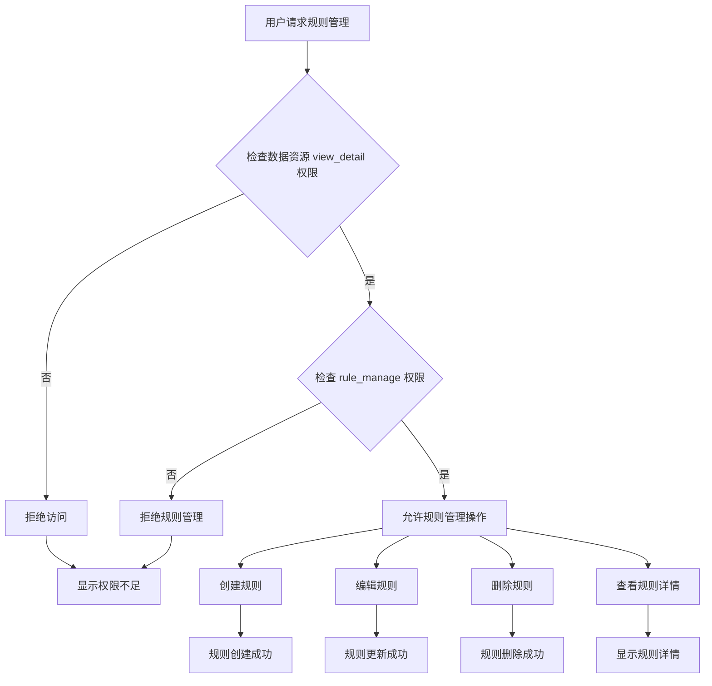
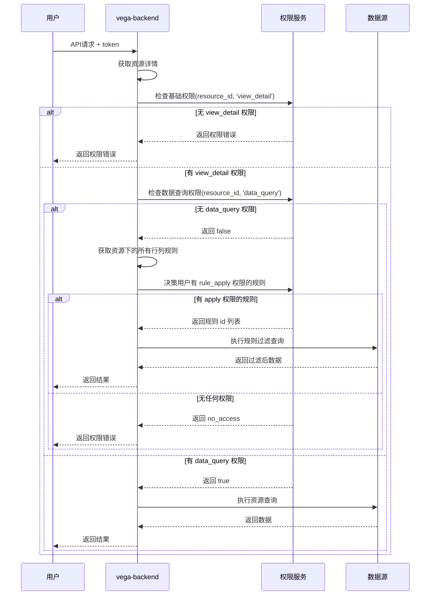

# VEGA Part 9: Resource 行列规则权限设计

---

## 一、需求分析

### 1.1 需求背景

数据资源需要具备细粒度的数据访问控制能力，保证数据安全。在 VEGA 资源管理层级架构中，Resource 作为具体的数据资产实体，需要支持行列级别的权限管控。

### 1.2 设计目标

1. **功能实现**：设计一套标准化接口，覆盖上层业务对于组织和人数据权限的使用。
2. **功能优化**：对现有授权功能进行梳理，识别并剥离不合理的功能，精简设计复杂度，提升可维护性。
3. **架构统一**：将行列规则权限能力从特定视图类型扩展到所有 Resource 类型。

### 1.3 需求价值

1. **降低维护成本**：通过剥离冗余功能，简化系统架构，减少潜在的维护问题和故障点，提升系统稳定性。
2. **数据安全管控**：构建完善的数据访问控制能力，保障核心数据资产安全。
3. **统一权限模型**：为所有 Resource 类型提供一致的行列规则权限管理能力。

### 1.4 业务目标

1. 实现对 Resource 行列级权限的支持。
2. 基于统一的权限框架建立统一的用户和部门操作鉴权体系。

---

## 二、设计方案

### 2.1 授权概念定义

| 概念 | 描述 |
|------|------|
| **授权** | 能够授权给别人行列规则、查看行列规则、新建、编辑、删除已有的行列规则。 |
| **授权仅分配** | 能够授权给别人行列规则、查看行列规则、不能新建、编辑、删除已有的行列规则。 |

### 2.2 权限点设计

Resource 权限点列表（加粗为新增）：
- 新建、编辑、删除、查看、权限管理、数据查询、导入、导出、**行列规则管理**、**行列规则授权**

### 2.3 规则应用范围

创建行列规则时授权范围可选择 Resource，支持复制已有行列规则模板功能。

---

## 三、资源类型定义

### 3.1 权限码

#### 3.1.1 Resource 权限码

| 序号 | 操作 | 编码（唯一标识） | 说明 |
|------|------|------------------|------|
| 1 | 查看 | view_detail | 获取资源的信息、具体的配置等 |
| 2 | 新建 | create | 生成一个新的资源实例 |
| 3 | 编辑 | modify | 更新已有资源的内容或属性 |
| 4 | 删除 | delete | 删除已存在的资源 |
| 5 | 数据查询 | data_query | 数据资源对象的数据内容查询 |
| 6 | 权限管理 | authorize | 赋予用户或角色对资源的操作权限 |
| 7 | 导入 | import | 导入资源 |
| 8 | 导出 | export | 导出资源 |
| 9 | **行列规则管理** | **rule_manage** | **对资源行列规则增删改查** |
| 10 | **行列规则授权** | **rule_authorize** | **赋予用户或角色对资源行列规则的操作权限** |

#### 3.1.2 Resource 行列规则权限码

| 序号 | 操作 | 编码（唯一标识） | 说明 |
|------|------|------------------|------|
| 1 | 规则应用 | rule_apply | 在数据查询时应用该规则 |

### 3.2 资源类型列表

| 菜单 | 模块 | 资源类型中文名 | 资源类型id | 备注 |
|------|------|----------------|------------|------|
| 数据资源 | 数据资源 | 数据资源 | resource | 涵盖 table、index、file、fileset、logicview 等类别 |
| \-- | \-- | 资源行列规则 | resource_row_column_rule | 资源行列规则在单独的授权页面，不会在信息安全管理的菜单显示 |

### 3.3 资源类型初始化

#### 3.3.1 Resource 资源初始化

```json
{
    "id": "resource",
    "name": "数据资源",
    "description": "数据资源的配置信息",
    "instance_url": "GET /api/vega-backend/v1/resources",
    "data_struct": "string",
    "operation": [
        {
            "id": "view_detail",
            "name": [
                {"language": "zh_cn", "value": "查看"},
                {"language": "en_us", "value": "view_detail"},
                {"language": "zh_tw", "value": "查看"}
            ],
            "description": "查看数据资源",
            "scope": ["type", "instance"]
        },
        {
            "id": "create",
            "name": [
                {"language": "zh_cn", "value": "新建"},
                {"language": "en_us", "value": "create"},
                {"language": "zh_tw", "value": "新建"}
            ],
            "description": "新建数据资源",
            "scope": ["type"]
        },
        {
            "id": "modify",
            "name": [
                {"language": "zh_cn", "value": "编辑"},
                {"language": "en_us", "value": "modify"},
                {"language": "zh_tw", "value": "編輯"}
            ],
            "description": "编辑数据资源",
            "scope": ["type", "instance"]
        },
        {
            "id": "delete",
            "name": [
                {"language": "zh_cn", "value": "删除"},
                {"language": "en_us", "value": "delete"},
                {"language": "zh_tw", "value": "刪除"}
            ],
            "description": "删除数据资源",
            "scope": ["type", "instance"]
        },
        {
            "id": "data_query",
            "name": [
                {"language": "zh_cn", "value": "数据查询"},
                {"language": "en_us", "value": "data_query"},
                {"language": "zh_tw", "value": "數據查詢"}
            ],
            "description": "数据资源数据查询",
            "scope": ["type", "instance"]
        },
        {
            "id": "authorize",
            "name": [
                {"language": "zh_cn", "value": "权限管理"},
                {"language": "en_us", "value": "authorize"},
                {"language": "zh_tw", "value": "權限管理"}
            ],
            "description": "数据资源权限管理",
            "scope": ["type", "instance"]
        },
        {
            "id": "import",
            "name": [
                {"language": "zh_cn", "value": "导入"},
                {"language": "en_us", "value": "import"},
                {"language": "zh_tw", "value": "导入"}
            ],
            "description": "导入数据资源",
            "scope": ["type"]
        },
        {
            "id": "export",
            "name": [
                {"language": "zh_cn", "value": "导出"},
                {"language": "en_us", "value": "export"},
                {"language": "zh_tw", "value": "导出"}
            ],
            "description": "导出数据资源",
            "scope": ["type"]
        },
        {
            "id": "rule_manage",
            "name": [
                {"language": "zh_cn", "value": "行列规则管理"},
                {"language": "en_us", "value": "rule_manage"},
                {"language": "zh_tw", "value": "行列規則管理"}
            ],
            "description": "数据资源行列规则管理",
            "scope": ["type", "instance"]
        },
        {
            "id": "rule_authorize",
            "name": [
                {"language": "zh_cn", "value": "行列规则授权"},
                {"language": "en_us", "value": "rule_authorize"},
                {"language": "zh_tw", "value": "行列規則授權"}
            ],
            "description": "数据资源行列规则授权",
            "scope": ["type", "instance"]
        }
    ]
}
```

#### 3.3.2 Resource 行列规则资源初始化

```json
{
    "id": "resource_row_column_rule",
    "name": "资源行列规则",
    "description": "资源行列规则的配置信息",
    "instance_url": "GET /api/vega-backend/v1/resource-row-column-rules",
    "data_struct": "string",
    "operation": [
        {
            "id": "rule_apply",
            "name": [
                {"language": "zh_cn", "value": "规则应用"},
                {"language": "en_us", "value": "rule_apply"},
                {"language": "zh_tw", "value": "規則應用"}
            ],
            "description": "在数据查询时应用该规则",
            "scope": ["type", "instance"]
        }
    ]
}
```

---

## 四、数据平台角色权限初始化

### 4.1 数据平台系统角色

| 资源类型 | 超级管理员 | 系统管理员（三权） | 安全管理员（三权） | 组织管理员 | 组织审计员 |
|----------|------------|-------------------|-------------------|------------|------------|
| 数据资源 | ☑️ 查看 | ☑️ 查看 | | | |
| | ☑️ 新建 | ☑️ 新建 | | | |

### 4.2 数据平台业务角色的默认权限

| 资源分类 | 资源类型 | 数据管理员 | AI管理员 | 应用管理员 | 业务用户 | 备注 |
|----------|----------|------------|----------|------------|----------|------|
| 数据资源 | 数据资源(resource) | ☑️ 查看 | ☑️ 查看 | ☑️ 查看 | ☐ 查看 | |
| | | ☑️ 新建 | ☑️ 新建 | ☑️ 新建 | ☐ 新建 | |
| | | ☑️ 编辑 | ☐ 编辑 | ☐ 编辑 | ☐ 编辑 | |
| | | ☑️ 删除 | ☐ 删除 | ☐ 删除 | ☐ 删除 | |
| | | ☑️ 数据查询 | ☑️ 数据查询 | ☑️ 数据查询 | ☐ 数据查询 | |
| | | ☑️ 权限管理 | ☐ 权限管理 | ☐ 权限管理 | ☐ 权限管理 | |
| | | ☑️ 导入 | ☑️ 导入 | ☑️ 导入 | ☐ 导入 | |
| | | ☑️ 导出 | ☑️ 导出 | ☑️ 导出 | ☐ 导出 | |
| | | ☑️ 行列规则管理 | ☐ 行列规则管理 | ☐ 行列规则管理 | ☐ 行列规则管理 | |
| | | ☑️ 行列规则授权 | ☐ 行列规则授权 | ☐ 行列规则授权 | ☐ 行列规则授权 | |

### 4.3 业务角色初始化配置

数据平台业务角色权限初始化配置需为 `resource` 类型添加 `rule_manage` 和 `rule_authorize` 权限。
```json
[
    {
        "expires_at": "1970-01-01T08:00:00+08:00",
        "resource": {
            "id": "*",
            "type": "resource",
            "name": "数据资源"
        },
        "accessor": {
            "id": "00990824-4bf7-11f0-8fa7-865d5643e61f",
            "type": "role",
            "name": "数据管理员"
        },
        "operation": {
            "allow": [
                {
                    "id": "view_detail"
                },
                {
                    "id": "create"
                },
                {
                    "id": "modify"
                },
                {
                    "id": "delete"
                },
                {
                    "id": "data_query"
                },
                {
                    "id": "authorize"
                },
                {
                    "id": "import"
                },
                {
                    "id": "export"
                },
                {
                    "id": "rule_manage"
                },
                {
                    "id": "rule_authorize"
                }
            ],
            "deny": []
        }
    },
    {
        "expires_at": "1970-01-01T08:00:00+08:00",
        "resource": {
            "id": "*",
            "type": "resource",
            "name": "数据资源"
        },
        "accessor": {
            "id": "3fb94948-5169-11f0-b662-3a7bdba2913f",
            "type": "role",
            "name": "AI管理员"
        },
        "operation": {
            "allow": [
                {
                    "id": "view_detail"
                },
                {
                    "id": "create"
                },
                {
                    "id": "data_query"
                },
                {
                    "id": "import"
                },
                {
                    "id": "export"
                }
            ],
            "deny": []
        }
    },
    {
        "expires_at": "1970-01-01T08:00:00+08:00",
        "resource": {
            "id": "*",
            "type": "resource",
            "name": "数据资源"
        },
        "accessor": {
            "id": "1572fb82-526f-11f0-bde6-e674ec8dde71",
            "type": "role",
            "name": "应用管理员"
        },
        "operation": {
            "allow": [
                {
                    "id": "view_detail"
                },
                {
                    "id": "create"
                },
                {
                    "id": "data_query"
                },
                {
                    "id": "import"
                },
                {
                    "id": "export"
                }
            ],
            "deny": []
        }
    }
]
```

---

## 五、功能逻辑设计

### 5.1 创建资源行列规则参数

| 字段 | 类型 | 描述 | 备注 | 格式示例 |
|------|------|------|------|----------|
| id | string | 行列规则 id | 支持自定义，若未自定义系统自动生成；新建后不可更改；只能包含小写英文字母、数字、下划线、连字符，且不能以下划线和连字符开头 | |
| name | string | 行列规则名称 | 唯一；长度不超过255字符 | |
| resource_id | string | 资源 id | 必填 | |
| tags | []string | 标签 | | |
| description | string | 备注 | | |
| fields | []string | 列 | 字段name列表 | |
| row_filters | condCfg | 行过滤规则 | 支持单层及多层嵌套 | 见下文示例 |

#### 5.1.1 行过滤规则格式

**单层级**：
```json
{
    "operation": "==",
    "field": "f4",
    "value_from": "const",
    "value": "group"
}
```

**多层级 and/or 嵌套**：
```json
{
    "operation": "and",
    "sub_conditions": [
        {
            "operation": "or",
            "sub_conditions": [
                {
                    "operation": "==",
                    "field": "f1",
                    "value_from": "const",
                    "value": "123"
                },
                {
                    "operation": "!=",
                    "field": "f2",
                    "value_from": "field",
                    "value": "f3"
                }
            ]
        },
        {
            "operation": "==",
            "field": "f4",
            "value_from": "const",
            "value": "group"
        }
    ]
}
```

### 5.2 规则管理流程图



### 5.3 数据查询时序图



**规则应用逻辑**：多个行列规则之间是 `OR` 的关系。

---

## 六、API 设计要求

### 6.1 新增接口

| API | 方法 | Public URL | Private URL | 备注 |
|-----|------|------------|-------------|------|
| 创建/导入资源行列规则 | POST | `/api/vega-backend/v1/resource-row-column-rules` | `/api/vega-backend/in/v1/resource-row-column-rules` | 批量接口，传对象数组 |
| 更新资源行列规则 | PUT | `/api/vega-backend/v1/resource-row-column-rules/{id}` | `/api/vega-backend/in/v1/resource-row-column-rules/{id}` | 单个更新 |
| 删除资源行列规则 | DELETE | `/api/vega-backend/v1/resource-row-column-rules/{ids}` | `/api/vega-backend/in/v1/resource-row-column-rules/{ids}` | 批量 |
| 根据资源id查询行列规则 | GET | `/api/vega-backend/v1/resource-row-column-rules/resource/{resource_id}` | `/api/vega-backend/in/v1/resource-row-column-rules/resource/{resource_id}` | |
| 查询资源行列规则列表 | GET | `/api/vega-backend/v1/resource-row-column-rules` | `/api/vega-backend/in/v1/resource-row-column-rules` | |

### 6.2 接口详细设计

#### 6.2.1 创建资源行列规则

**POST** `/api/vega-backend/v1/resource-row-column-rules`

**请求体**：
| 字段 | 类型 | 说明 |
|------|------|------|
| id | string | 行列规则 id（可选） |
| name | string | 行列规则名称 |
| resource_id | string | 资源 id |
| tags | []string | 标签 |
| description | string | 备注 |
| fields | []string | 列 |
| row_filters | condCfg | 过滤条件 |

**返回体**：
```json
[
    {"id": "d1d6k3akt9di3drg156g"}
]
```
状态码：201 Created

#### 6.2.2 资源数据查询（支持行列规则过滤）

**POST** `/api/vega-backend/v1/resources/{resource_id}/data`

**请求体**：
和当前资源数据查询请求体相同，查询时会根据资源下的所有行列规则进行过滤。
详细接口可参考 [当前资源数据查询接口](https://github.com/kweaver-ai/kweaver-core/blob/feature/315-issue/adp/docs/api/vega/vega-backend/resource.yaml)。

**返回体**：
```json
{
    "entries": [
        {
            "field1": "value1",
            "field2": "value2"
        }
    ],
    "total_count": 1000
}
```

| 字段 | 类型 | 说明 |
|------|------|------|
| entries | []map[string]any | 查询结果数据列表 |
| total_count | int64 | 总数（仅当 need_total=true 时返回） |

**状态码**：200 OK

---

## 七、数据库设计

### 7.1 建表语句

```sql
USE vega;

-- 资源行列规则表
CREATE TABLE IF NOT EXISTS t_resource_row_column_rule (
    f_id VARCHAR(40) NOT NULL DEFAULT '' COMMENT '资源行列规则 id',
    f_name VARCHAR(255) NOT NULL COMMENT '资源行列规则名称',
    f_resource_id VARCHAR(40) NOT NULL COMMENT '资源 id',
    f_tags VARCHAR(255) NOT NULL DEFAULT '' COMMENT '标签',
    f_description VARCHAR(1000) NOT NULL DEFAULT '' COMMENT '备注',
    f_fields TEXT NOT NULL COMMENT '列',
    f_row_filters TEXT NOT NULL COMMENT '行过滤规则',
    f_creator VARCHAR(128) NOT NULL DEFAULT '' COMMENT '创建者id',
    f_creator_type VARCHAR(20) NOT NULL DEFAULT '' COMMENT '创建者类型',
    f_create_time BIGINT(20) NOT NULL DEFAULT 0 COMMENT '创建时间',
    f_updater VARCHAR(128) NOT NULL DEFAULT '' COMMENT '更新者id',
    f_updater_type VARCHAR(20) NOT NULL DEFAULT '' COMMENT '更新者类型',
    f_update_time BIGINT(20) NOT NULL DEFAULT 0 COMMENT '更新时间',
    PRIMARY KEY (f_id),
    UNIQUE KEY uk_f_name (f_name, f_resource_id),
    INDEX idx_f_resource_id (f_resource_id)
) ENGINE = InnoDB DEFAULT CHARSET = utf8mb4 COLLATE = utf8mb4_bin COMMENT = '资源行列规则';
```

### 7.2 数据库升级

#### 7.2.1 表结构

新增表 `t_resource_row_column_rule`

#### 7.2.2 数据升级

1. 资源类型为 `resource` 的对象，新增权限操作 `rule_manage`、`rule_authorize`。
2. 新增资源类型 `resource_row_column_rule`。
3. 数据平台业务角色（数据管理员、AI管理员、应用管理员、业务用户）的默认权限操作新增：
    - 行列规则管理（rule_manage）
    - 行列规则授权（rule_authorize）
4. 已有的资源实例，对于其中有授权权限的资源，给其加上行列规则管理和行列规则授权的权限。

---


## 八、质量目标

### 8.1 功能性目标

- 数据资源支持行列级权限管控

### 8.2 非功能性目标

- 兼容性：支持 x64 和 arm64
- 安全性：接口鉴权，镜像无高级及以上漏洞

---

## 九、部署需求说明


| 交付物名字 | 部署方式 | 交付方式 |
|------------|----------|----------|
| vega-backend 服务 chart 包 | VEGA 部署时安装 | 离线安装包 |
| vega-backend 服务镜像 | \-- | 离线安装包 |

---

## 十、技术限制说明

无

---

## 十一、参考资料

- [VEGA 资源管理层级关系](resource-management-hierarchy.md)
- [VEGA Part 1: Top Level Design](VEGA_Part1_TopLevelDesign.md)
