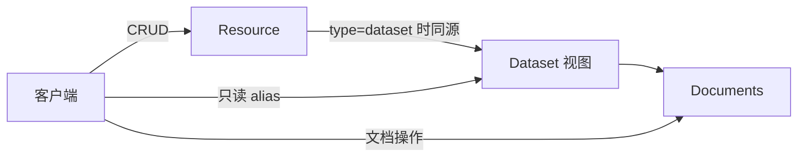

# Dataset URI 剥离与文档操作端点重构 技术设计文档

> **状态**：草案
> **负责人**：@待补
> **日期**：2026-04-30
> **相关 Ticket**：待补

---

## 1. 背景与目标

### 背景

vega-backend 把 dataset 的"文档管理"端点直接展开在 `/resources/dataset/{id}/docs/...` 下，而 9 种 resource 类型（table / file / fileset / api / metric / topic / index / logicview / dataset）中**只有 dataset 在 URI 上展开了子端点**。这造成两个问题：

1. **URI 风格分裂**：`/resources/{type}/{id}/...` 的形态只对 dataset 一种类型生效，未来若其它类型也要展开（如 table 的 schema 历史、index 的 mapping 编辑），不得不沿用同一前缀模式，整套 `/resources/...` 路径就会被 type 维度撕裂；现状是设计未完成的中间态。
2. **`POST .../docs/query` 是 delete-by-query**（写操作），路径以 `/query` 结尾让人误以为是读，是 RESTful 设计上的反模式。

### 目标

1. 把 dataset 的文档操作端点从 `/resources/dataset/{id}/docs/...` 升格为 `/datasets/{id}/docs/...`，与 `/resources` 平级。
2. 提供只读 alias view `/datasets` / `/datasets/{id}`，便于客户端按"dataset 类资源"集合定位。
3. 修复 `POST .../docs/query` 的命名反模式，使写 / 读语义在 URI 上一目了然。

### 非目标

- **不改数据模型**：dataset 仍是 `Resource` 的一个 type，存于 `t_resource` 表；service 层 `DatasetService` 与 `Resource` 共用同一份持久化与权限模型。
- **不改 dataset 的 CRUD**：`POST/GET/PUT/DELETE /resources` 仍是 dataset 实体的写入入口；`/datasets/{id}` 仅是只读视图。
- **不改其它 resource 类型**：本次只剥离 dataset；其它 type 的子资源是否平级化是各自独立议题。
- **不改 dataset 文档的内部存储**：`DatasetService` 接口与文档存储方案保持不变。

## 2. 方案概览

### 2.1 资源关系图



`/datasets` 是 `/resources?type=dataset` 的别名视图，提供更直观的入口；写操作仍走 `/resources`。文档操作（CRUD + delete-by-query）的唯一入口是 `/datasets/{id}/docs/...`。

### 2.2 端点变化总览

#### 新增

```
GET    /api/vega-backend/v1/datasets                     # 只读视图，等价 /resources?type=dataset
GET    /api/vega-backend/v1/datasets/{id}                # 只读视图，等价 /resources/{id} 且校验 type=dataset

POST   /api/vega-backend/v1/datasets/{id}/docs                       # 创建文档（批量）
PUT    /api/vega-backend/v1/datasets/{id}/docs                       # 全量替换 / upsert（批量）
DELETE /api/vega-backend/v1/datasets/{id}/docs/{doc_ids}             # 按 ID 批量删除
POST   /api/vega-backend/v1/datasets/{id}/docs/_delete-by-query      # 按条件批量删除（命名修正）
```

#### 弃用

```
- POST   /resources/dataset/{id}/docs
- PUT    /resources/dataset/{id}/docs
- DELETE /resources/dataset/{id}/docs/{ids}
- POST   /resources/dataset/{id}/docs/query     # 命名反模式：实质 delete-by-query
```

#### 保留不变

```
GET    /resources                       # dataset 与其它 type 同列
POST   /resources                       # 创建 dataset 仍走此处（body 含 type=dataset）
GET    /resources/{ids}
PUT    /resources/{id}
DELETE /resources/{ids}
```

## 3. 详细设计

### 3.1 `/datasets` 视图的语义

**只读 alias，不暴露写入**：

- `GET /datasets`：等价 `GET /resources?type=dataset`。响应体形态与 `/resources` 一致（字段、分页参数、过滤参数对齐）。
- `GET /datasets/{id}`：先按 id 取 Resource，若 `type != dataset` 返回 404 `VegaBackend.Dataset.NotFound`（不暴露其它 type 的存在）。

**为什么不暴露 POST/PUT/DELETE 在 `/datasets/{id}`**：

- `POST /datasets` 与 `POST /resources?type=dataset` 是双写入入口，会出现"两条路同结果"的契约维护负担。
- 单一写入入口（`/resources`）让权限、审计、connector 校验逻辑集中。
- 客户端建 dataset 时多写一行 `type: "dataset"` 不是负担。

### 3.2 `/datasets/{id}/docs/...` 的边界约束

- **dataset 必须存在且 type=dataset**：所有文档端点首先校验，不存在 → 404 `VegaBackend.Dataset.NotFound`；存在但类型错 → 同一错误码（不区分细节，避免类型枚举泄露）。
- **批量语义**：
  - `POST /docs`：body 是文档数组；返回新建文档 ID 数组。
  - `PUT /docs`：body 是文档数组；按文档自带 ID upsert（service 层 `UpsertDocuments`）。
  - `DELETE /docs/{doc_ids}`：path 上以英文逗号分隔多个 ID。
- **delete-by-query 路径形态**：`POST /datasets/{id}/docs/_delete-by-query`，body 是过滤条件（`FilterCondCfg` 结构）。下划线前缀避免与单条文档 ID 冲突，且与 OpenSearch `_delete_by_query` 风格相通，meaning 一目了然。
- **响应**：所有写操作返回 200 + 影响计数（`{ affected: N, ids?: [...] }`），不用 204，方便客户端做批量结果展示。

### 3.3 命名归属

| 概念 | 路径前缀 | 备注 |
|---|---|---|
| Resource 集合 | `/resources` | dataset 与其它 type 共享 |
| Dataset 只读视图 | `/datasets` | type=dataset 的 Resource 子集 |
| Dataset 文档管理 | `/datasets/{id}/docs` | 唯一文档操作入口 |

未来如有别的 resource type 需要展开子资源（如 LogicView 的 SQL 编辑），按同模子做（`/logic-views/{id}/sql`），而非继续往 `/resources/{type}/{id}/...` 下塞。

### 3.4 错误码

新增（与现有 connector-type / catalog 风格一致）：

```
VegaBackend.Dataset.NotFound                        # dataset 不存在或 type 不是 dataset
VegaBackend.Dataset.InvalidParameter.DocID
VegaBackend.Dataset.InvalidParameter.Documents
VegaBackend.Dataset.InternalError
VegaBackend.Dataset.InternalError.CreateDocsFailed
VegaBackend.Dataset.InternalError.UpdateDocsFailed
VegaBackend.Dataset.InternalError.DeleteDocsFailed
```

中英文 i18n 同步补充。

### 3.5 数据模型变更

**无**。dataset 仍是 `t_resource` 表中 `type=dataset` 的行，文档存于 OpenSearch / 文件存储等（由 `DatasetService` 内部决定）。

## 4. 边界情况与风险

| 类型 | 描述 | 应对 |
|---|---|---|
| 兼容性 | 弃用旧路由会破坏现有客户端 | 与外部依赖方对齐时间窗，发布时通知 + 版本记录；本次设计**不**保留旧路由作 deprecated 别名 |
| 类型校验性能 | `/datasets/{id}/...` 每次都要先取 Resource 校验 type=dataset | 走 service 层缓存或一次 GetByID，与原 `/resources/dataset/{id}/...` 行为等价，无新增开销 |
| 路径前缀冲突 | `/datasets/{id}/docs/_delete-by-query` 与 `/datasets/{id}/docs/{doc_ids}` 在路由匹配上需要区分 | 下划线前缀保证字面量段优先；gin 路由器按字面量优先于参数路径，无歧义 |
| 视图与写入分裂 | 客户端可能困惑"为什么 GET 走 /datasets 但 POST 走 /resources" | 文档清晰说明；`/datasets` 是只读 view，dataset 不是独立写入资源 |

## 5. 替代方案

### 方案 B：Dataset 完全顶级化

把 dataset 升格为与 Resource 平级的顶级资源，自有 CRUD + 文档管理；`t_resource` 表不再含 dataset 类型，单独一张 `t_dataset` 表。

**优点**：URI 与数据模型完全对齐，没有"既是 Resource 又是 Dataset"的语义重叠。
**缺点**：

- 数据模型大改，DB 迁移成本高。
- 凡是按 type 维度做的 Resource 抽象（连接器路由、权限模型、查询统一接口）都要分叉处理 dataset。
- 与 service 层现状（`DatasetService.Create(*Resource)`）冲突。

**结论**：放弃。dataset 在业务上是"带文档的资源"，与"它是 Resource 的一种"这个抽象一致；URI 层做剥离已经足够解决问题。

### 方案 C：在 `/resources/{type}/{id}/...` 下展开所有 type 的子资源

为所有 9 种 type 都设计一套子资源端点（哪怕暂时是空的），保持 URI 形态对称。

**优点**：URI 模式完全统一。
**缺点**：

- 大多数 type 没有特殊子资源（table/file/api 等的所有操作都是统一 Resource API），强行展开是 over-engineering。
- 仍然把 type 嵌进 URI，未来 type 集合变化时（增删）路径也要变。

**结论**：放弃。设计应只承认现有的"特殊性"（dataset 有文档），不为虚构的对称性付代价。

### 最终方案：URI 剥离 + 数据模型不动

详见第 2、3 节。

## 6. 任务拆分

按 [adp/CLAUDE.md](../../../../../CLAUDE.md) 规则 5 拆分：

- [ ] **批 1：错误码 + i18n + service 接口契约**
  - `errors/dataset.go` 新建错误码常量
  - `locale/dataset.zh-CN.toml` / `dataset.en-US.toml`
  - 错误码 register

- [ ] **批 2：handler 与路由（新增端点）**
  - `driveradapters/dataset_handler.go` 新建
  - `validate_dataset.go` 校验
  - router 挂载新路径
  - service 层不动

- [ ] **批 3：弃用旧路由**
  - 删除 `/resources/dataset/{id}/docs/...` 旧路由
  - handler 中废弃方法移除
  - CHANGELOG 标注 BREAKING

- [ ] **批 4：OpenAPI yaml 生成**
  - `adp/docs/api/vega/vega-backend-api/dataset.yaml`

每批前按 CLAUDE.md 规则 1 单独描述方案待批准。

## 7. 待团队确认的开放问题

1. **delete-by-query 路径形态**：当前提议 `POST /datasets/{id}/docs/_delete-by-query`，下划线前缀。备选：
   - `POST /datasets/{id}/docs:delete-by-query`（Google API Design Guide custom method 风格，gin 路由不冲突）
   - `POST /datasets/{id}/docs/bulk-delete`（语义稍弱，但更简洁）

2. **`/datasets` 视图过滤参数**：是否支持 catalog_id / 创建时间 等过滤？建议与 `/resources` 完全对齐（同一份 `ResourceQueryParams`），客户端心智一致。

3. **是否补 `GET /datasets/{id}/docs`** 和 `GET /datasets/{id}/docs/{doc_id}`？service 层 `ListDocuments` / `GetDocument` 已实现，HTTP 没暴露。建议**本次同时补**——既然要 review 重构，缺端点一次补齐。

4. **批量响应体形态**：`POST /docs` 返回 `{ ids: [...] }` 还是 `{ affected: N, ids: [...] }`？建议后者，便于通用错误处理。
