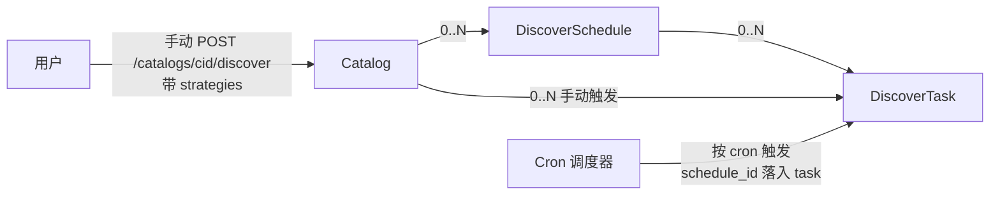

# DiscoverSchedule 顶层资源化与 API 重构 技术设计文档

> **状态**：草案（2026-05-07 状态对账更新；范围聚焦剩余的 schedule 重构）
> **负责人**：@待补
> **日期**：2026-05-07
> **相关 Ticket**：待补
>
> **完成进度（截至 2026-05-07）**
>
> | 项 | 状态 | 备注 |
> |---|---|---|
> | `DiscoverTask.scheduled_id` → `schedule_id`（Go / JSON） | ✅ 已完成 | discover-task PR 阶段；DB 列名 `f_scheduled_id` 保留未改 |
> | `DiscoverTaskQueryParams.ScheduleID` 字段 | ✅ 已完成 | 同上 |
> | `discover-tasks` 路由形态规范化（`/by-id` / `/by-schedule` 移除） | ✅ 已完成 | discover-task PR 阶段 |
> | `?schedule_id=` filter | ✅ 已完成 | 同上 |
> | DiscoverSchedule 顶层资源化（service + handler + router） | ❌ 未做 | 本设计批 1 |
> | 弃用旧 `/catalogs/{cid}/scheduled-discover/...` 路由 | ❌ 未做 | 本设计批 2 |
> | OpenAPI yaml | 🟡 discover-task.yaml 已写；discover-schedule.yaml 待 | 本设计批 3 |

---

## 1. 背景与目标

### 背景

vega-backend 当前 `scheduled-discover`（catalog 资源发现的定时调度）模块在 HTTP 层与底层数据模型之间存在明显错位：

- **数据模型**：`ScheduledDiscoverTask` 拥有全局唯一主键 `id`，service 接口（`GetByID/Update/Delete/Enable/Disable`）只用 `id` 定位，独立 DB 表，与 catalog 是 N:1 关系。
- **HTTP 层**：路由强制挂在 `/catalogs/{id}/scheduled-discover/{tid}/...` 下，要求双主键 path，且把"列出全部调度"端点（实质跨 catalog）`GET /catalogs/scheduled-discover` 也挂在 catalog 子路径，URI 形态与功能错位。
- **词典撕裂**：service 层用 `Enable / Disable`，handler 包装成 `start / stop`，与仓库内其它资源（ConnectorType 用 enable/disable）不一致。
- **缺端点**：service 提供了 `Delete` / `GetByID`，HTTP 没暴露。

> 关于 `DiscoverTask.scheduled_id` 字段命名以及 `discover-tasks` 路由形态规范化的两个相关问题，已在 discover-task PR 阶段完成（Go 层 / JSON tag / list filter / 路由路径），见上方"完成进度"表。本设计仅聚焦 DiscoverSchedule 顶层化剩余范围。

### 目标

1. 把"发现调度配置"建模为顶层独立资源 `DiscoverSchedule`，URI、service 主键对齐（DB 列名 `f_scheduled_id` 保留不改，HTTP/Go ↔ DB 命名差异隔离在数据访问层）。
2. 状态切换统一为动作端点 `enable / disable`，与 ConnectorType 风格一致；幂等语义（已 enable 再 enable → 204）。
3. 暴露 service 已有但未挂 HTTP 的能力：`Delete` / `GetByID`。

### 非目标

- 不抽象成"通用 Schedule + target_type"模型（业务确认非 discover 的周期任务不会出现，其它任务管理走自己的属性）。
- 不引入 schedule 模板（多 catalog 复用同一调度）能力。
- 不重做 cron 调度引擎（仍用 `worker.Scheduler` + `robfig/cron/v3`）。
- 不改 catalog / connector-type 等其它资源的 API 形态。
- 不改一次性发现入口 `POST /catalogs/{cid}/discover` 的路径或行为。

## 2. 方案概览

### 2.1 资源关系图



`DiscoverSchedule` 是纯**配置**资源（cron + strategies + 起止时间 + 启停状态），不直接承载执行。`DiscoverTask` 是执行实例集合，由两个入口产出：

- **手动触发**：`POST /catalogs/{cid}/discover`，task.schedule_id 为空。
- **cron 自动触发**：调度器到点产出，task.schedule_id 指向触发它的 schedule。

### 2.2 端点变化总览

#### 新增

```
POST   /api/vega-backend/v1/discover-schedules                  # 创建
GET    /api/vega-backend/v1/discover-schedules                  # ?catalog_id= ?enabled= 过滤
GET    /api/vega-backend/v1/discover-schedules/{sid}            # 详情
PUT    /api/vega-backend/v1/discover-schedules/{sid}            # 严格全量替换；不修改 enabled
DELETE /api/vega-backend/v1/discover-schedules/{sid}            # 删除调度，不影响已产生的 DiscoverTask
POST   /api/vega-backend/v1/discover-schedules/{sid}/enable     # 启用
POST   /api/vega-backend/v1/discover-schedules/{sid}/disable    # 停用

GET    /api/vega-backend/v1/catalogs/{cid}/discover-schedules   # 便利只读视图，等价 ?catalog_id={cid}
```

#### 已完成（discover-task PR 阶段）

```
GET    /discover-tasks/by-id/{id}             →  GET /discover-tasks/{id}        ✅
GET    /discover-tasks/by-schedule/{sid}      →  GET /discover-tasks?schedule_id={sid}  ✅

字段重命名（Go / JSON）:
DiscoverTask.scheduled_id                     →  schedule_id   ✅
DiscoverTaskQueryParams.ScheduleID            ✅

DB 列名 f_scheduled_id：保留不改（隔离在数据访问层 mapping）
```

#### 弃用

```
- POST   /catalogs/{cid}/scheduled-discover
- POST   /catalogs/{cid}/scheduled-discover/{tid}/start
- POST   /catalogs/{cid}/scheduled-discover/{tid}/stop
- PUT    /catalogs/{cid}/scheduled-discover/{tid}
- GET    /catalogs/scheduled-discover
```

#### 保留不变

```
POST   /api/vega-backend/v1/catalogs/{cid}/discover    # 手动触发，唯一手动入口
```

## 3. 详细设计

### 3.1 核心约束

#### 3.1.1 PUT 严格语义

`PUT /discover-schedules/{sid}` 是**全量替换**，但只允许变更"配置"字段。下表的"只读字段"如果在 body 中携带且与当前值不一致，返回 409。

| 字段 | 类型 | 可改 |
|---|---|---|
| `id` | string | 只读，与 path 不一致 → 409 `*.IdMismatch` |
| `catalog_id` | string | 只读（schedule 创建后归属不可改）→ 409 `*.CatalogMismatch` |
| `cron_expr` | string | 可改 |
| `strategies` | string[] | 可改 |
| `start_time` | int64 | 可改 |
| `end_time` | int64 | 可改 |
| `enabled` | bool | 只读（状态切换走 enable/disable） → 409 `*.EnabledFieldNotAllowed` |
| `last_run` / `next_run` | int64 | 只读（系统维护），携带时静默忽略 |
| `creator` / `create_time` / `updater` / `update_time` | - | 只读（系统维护），携带时静默忽略 |

#### 3.1.2 状态切换的唯一入口

`enabled` 字段在响应里只读返回；变更走 `POST .../enable` `POST .../disable`。
- **幂等**：对已 enable 的资源再 enable 返回 204；同理 disable。配置开关语义自然幂等，客户端不需要先读取状态。
- 与 ConnectorType 风格一致，避免仓库内启停命名词典分裂。

#### 3.1.3 DELETE 与执行历史的解耦

`DELETE /discover-schedules/{sid}`：

- 从 cron 引擎摘除该 schedule 的注册条目。
- DB 中删除 schedule 记录。
- **不删除已有 DiscoverTask 历史记录**——schedule_id 字段保留为孤儿引用，便于审计追溯"该 schedule 历史触发了哪些任务"。
- 不影响正在执行（status=running）的 DiscoverTask；任务执行时已经持有所需上下文，不再依赖 schedule 配置。

### 3.2 数据模型变更

#### 3.2.1 DiscoverSchedule 表（沿用现有 t_scheduled_discover_task）

字段不变（已有 `id / catalog_id / cron_expr / strategies / start_time / end_time / enabled / last_run / next_run / creator / create_time / updater / update_time`），仅 service / handler / 路由层做调整。

**表名不重命名**（决议）。HTTP 层资源名 (`discover-schedules`) 与表名 (`t_scheduled_discover_task`) 之间的命名差异隔离在数据访问层 mapping，避免线上 schema migration 风险。

#### 3.2.2 错误码新增

```
DiscoverSchedule.NotFound
DiscoverSchedule.InvalidCronExpr
DiscoverSchedule.InvalidStrategies
DiscoverSchedule.IdMismatch
DiscoverSchedule.CatalogMismatch
DiscoverSchedule.EnabledFieldNotAllowed
```

不引入 `AlreadyEnabled` / `AlreadyDisabled`——enable/disable 幂等返回 204，无需向客户端暴露状态冲突。

中英文 i18n 同步补充。

### 3.3 接口定义

OpenAPI yaml 草稿待生成（路径 `adp/docs/api/vega/vega-backend-api/discover-schedule.yaml`、`discover-task.yaml`），格式延续 `connector-type.yaml` / `query.yaml` 的风格：

- OpenAPI 3.1.1
- 共用 `Error` schema 与 responses 块
- 内部接口前缀 `/api/vega-backend/in/v1` 在 `info.description` 中统一描述，不重复列出 path

### 3.4 cron 引擎集成

- `Create` / `Update` / `Enable` / `Disable` / `Delete` 均触发 `Scheduler.Reload()`（或局部 add/remove 单条），保证 cron 注册与 DB 状态实时一致。当前实现需 review 是否已经做到。
- 多实例部署时同一 schedule 会被多副本注册，由 catalog 级互斥（README 已声明"每个 catalog 同一时间只能有一个发现任务在执行"）防重。本次重构不改这一行为。

## 4. 边界情况与风险

| 类型 | 描述 | 应对 |
|---|---|---|
| 并发 | schedule.enabled 状态在两次请求间被改 | enable/disable 端点幂等；客户端不需要先读取状态 |
| 并发 | 删除 schedule 时正好 cron 触发 | 删除时先从 cron 引擎注销，再从 DB 删除；已经在执行的 task 不受影响 |
| 数据一致性 | DB 删 schedule 但 cron 引擎未刷新 | 启动时 `Scheduler.Start()` 重载所有 enabled schedule；变更时 `Reload()` |
| 字段重命名 | `scheduled_id` 与 `schedule_id` 双客户端同时调用 | 不做兼容期：本次发布作为破坏性版本；前端 / 调用方一次性切换 |
| DB 迁移 | 重命名列时锁表 | 表规模评估；数据量大时可拆为"新增列 + 双写 + 切流 + 删旧列"三步迁移（看 DBA 建议） |
| 向后兼容 | 弃用旧路径会破坏现有客户端 | 与外部依赖方对齐时间窗，通知 + 双发布期；本次设计**不**保留旧路由作 deprecated 别名 |
| 性能 | `GET /discover-tasks?schedule_id=` 查询性能 | DB 列上加索引（与原 `f_scheduled_id` 索引同步迁移） |

## 5. 替代方案

### 方案 A：保持 catalog 子资源，仅修内部问题

将 `start/stop` 改为 `enable/disable`，路径仍为 `/catalogs/{cid}/scheduled-discover-tasks/{tid}/...`，跨 catalog 列表剥离到 `/scheduled-discover-tasks`。

**优点**：URI 表达"任务从属于 catalog"的归属关系。
**缺点**：双主键 path 冗余（task_id 已经全局唯一）；同一资源的"列表 vs 单条操作"路径风格分裂；本质上仍是顶层资源被强行嵌套。

**结论**：放弃。归属关系靠资源字段 `catalog_id` 表达即可，不需要 URI 来表达。

### 方案 B：把多份调度合并为 catalog 上的"rules 数组"属性

每个 catalog 上挂一个 `discover_schedule.rules[]` JSON 数组，元素含 cron / strategies / enabled。

**优点**：路径形态最简，仅 `/catalogs/{cid}/discover-schedule`。
**缺点**：

- 数组元素需要独立的 URI / 状态 / 历史 / 审计，最终被迫在元素上造 `rule_id` 字段，等于把 1:N 模型藏进数组里、丢掉 REST 的所有好处。
- 并发编辑（两人同时操作不同 rule）会触发数组级 last-write-wins，必须额外引入 ETag。
- 无法简洁表达"按 rule 反查 task"。

**结论**：放弃。详细论证见前期讨论稿。

### 方案 C：通用 `Schedule` + `target_type/target_id` 抽象

把 schedule 抽成一个能调度任意 target（discover / sync / health-check / ...）的顶层概念。

**优点**：未来扩展性最强。
**缺点**：业务确认非 discover 的周期任务不会出现，过度抽象会引入没用的多态字段。

**结论**：放弃。

### 最终方案：DiscoverSchedule 顶层独立资源 + 字段命名规范化

详见第 2、3 节。

## 6. 剩余批次（基于 2026-05-07 状态对账）

按 [adp/CLAUDE.md](../../../../../CLAUDE.md) 规则 5 拆为 3 批。已完成项见文档顶部"完成进度"表，此处不再重复。每批前按规则 1 描述细节方案 + 验收清单 + 失败条件待批准。

- [ ] **批 1：DiscoverSchedule 顶层资源（service + handler + router + 错误码 + i18n）**
  - 重命名 `interfaces/scheduled_discover_task_service.go` → `interfaces/discover_schedule_service.go`
    - 接口名 `ScheduledDiscoverTaskService` → `DiscoverScheduleService`
    - 类型 `ScheduledDiscoverTask` → `DiscoverSchedule`
    - service 已有方法（Create/GetByID/List/Update/Delete/Enable/Disable/...）保持
  - 重命名 `logics/scheduled_discover_task/` → `logics/discover_schedule/`
  - 新增 `driveradapters/discover_schedule_handler.go`，挂顶层 `/discover-schedules` 路由：
    - POST 创建、GET 列表（filter: catalog_id / enabled）、GET/PUT/DELETE 单条、POST `:id/enable` `:id/disable`
    - PUT 严格全量替换：携带 `enabled` 与当前不一致 → 409 `EnabledFieldNotAllowed`
    - PUT 携带 `id` / `catalog_id` 与现状不一致 → 409 `IdMismatch` / `CatalogMismatch`
    - enable/disable **幂等**返回 204
  - `errors/discover_schedule.go`：新增错误码常量
  - `locale/*.toml`：i18n
  - mock 同步
  - **新旧路由并存**（旧 `/catalogs/{cid}/scheduled-discover/...` 5 条暂留，批 2 删）

- [ ] **批 2：弃用旧 `/catalogs/{cid}/scheduled-discover/...` 路由 + handler**
  - router：删 5 条旧路由（外/内 = 10 条）
  - `driveradapters/catalog_handler.go`：移除 10 个 ScheduledDiscoverTask handler 函数
  - CHANGELOG 在 PR description 标注 BREAKING

- [ ] **批 3：OpenAPI yaml**
  - 新增 `adp/docs/api/vega/vega-backend-api/discover-schedule.yaml`
  - 调整 `discover-task.yaml` 顶部 description 中对 ScheduledDiscoverTask 的提及（应改为 DiscoverSchedule）
  - `catalog.yaml` 已经引用 `discover-schedule.yaml`，无需改

## 7. 已决定事项 / 开放问题

**已决定（2026-05-07 之前）：**

1. **DB 列 `f_scheduled_id` 不改**：保留 `t_discover_task.f_scheduled_id` 列名，HTTP/Go ↔ DB 命名差异隔离在数据访问层 mapping。已在 discover-task PR 阶段实施。
2. **DB 表名 `t_scheduled_discover_task` 不重命名**：迁移代价 vs 收益不划算；HTTP 层资源名 (`discover-schedules`) 与表名命名差异可接受。
3. **enable/disable 幂等**：对已 enable 的资源再 enable 返回 204；同理 disable。不引入 `AlreadyEnabled` / `AlreadyDisabled` 错误码。
4. **旧路由不保留 deprecated 别名**：与 build-task / discover-task / dataset 三次重构一致，一次性 BREAKING。

**仍待团队确认：**

无。所有结构性决策已锁定。
