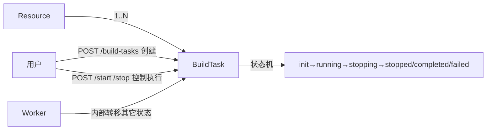

# BuildTask 顶层资源化与 API 重构 技术设计文档

> **状态**：草案
> **负责人**：@待补
> **日期**：2026-04-30
> **相关 Ticket**：待补

---

## 1. 背景与目标

### 背景

vega-backend 当前 BuildTask（资源构建任务，对资源做 streaming / batch / embedding 构建）的 HTTP 端点存在多重设计问题：

- **命名风格分裂**：路径用 `/resources/buildtask/...`（无连字符、单数），与同仓 `/discover-tasks` `/scheduled-discover` `/test-connection` `/health-status` 的"连字符 + 复数"约定冲突。
- **URI 寻址方式分裂**：创建 / 详情 / 更新走 `/buildtask/{resource_id}/{task_id}/...`（双主键 path），列表 / 删除走 `/buildtask` 与 `/buildtask/{task_ids}`（单 task_id）。同一资源的端点用了两套寻址，OpenAPI 难表达，SDK 难生成。
- **双主键 path 冗余**：`BuildTask.ID` 全局唯一，service 层 `GetByID / UpdateStatus / Delete` 仅用 `id` 定位，path 上的 `resource_id` 是装饰；但 list / delete 又跳过 `resource_id`，自我矛盾。
- **状态切换错位为通用 PUT**：`PUT .../{task_id}/status` body `{status: ...}` 看似支持任意状态修改，实质 `UpdateBuildTaskStatusRequest` 把允许的 status 限定为 `running` / `stopped`——业务真正暴露的就是 **start / stop** 两个动作，handler 用通用 PUT 是没必要的泛化，也让客户端误以为能改成 completed / failed 等。

外部仅可触发 start / stop；其它状态（init / running / stopping / completed / failed）由 worker 内部转移，外部只读。

### 目标

1. 把 BuildTask 升格为顶级独立资源，URI 改为 `/build-tasks`，与 `/discover-tasks` 形态对称。
2. 单主键 path 寻址（`/build-tasks/{id}`），消除 `resource_id` 装饰。
3. 状态切换从 `PUT .../status` 改为 `POST /start` `POST /stop` 动作端点，与 service 真实语义对齐，避免误导。
4. 跨 resource / catalog / status 的过滤通过 query string 表达，统一寻址。
5. mode 枚举对外完整暴露 `streaming / batch / embedding` 三值（旧 handler binding 误限定为两值，本次纠正）。

### 非目标

- **不改 worker 与状态机**：`BuildTaskStatusInit / Running / Stopping / Stopped / Completed / Failed` 状态枚举不变；状态转移逻辑（worker 内部）不动。
- **不改 task type / mode 枚举值集合**：`streaming / batch / embedding`、`incremental / full` 不变（仅修正 binding 校验范围）。
- **不改任务执行流程**：service.Create / service.UpdateStatus 内部行为不变。
- **不改其它 task 资源**（DiscoverTask 走自己的 redesign）。

## 2. 方案概览

### 2.1 资源关系图



BuildTask 是 Resource 的子任务（每条 task 关联 1 个 resource），但实体本身已是独立资源（全局唯一 ID、独立状态机、独立查询）。HTTP 层应当承认这个独立性。

### 2.2 端点变化总览

#### 新增

```
POST   /api/vega-backend/v1/build-tasks                         # 创建（body 含 resource_id、mode 等）
GET    /api/vega-backend/v1/build-tasks                         # ?resource_id= ?catalog_id= ?status= ?mode= 过滤
GET    /api/vega-backend/v1/build-tasks/{id}                    # 详情
DELETE /api/vega-backend/v1/build-tasks/{id}                    # 删除单条
DELETE /api/vega-backend/v1/build-tasks                         # ?ids=a,b,c 批量删除

POST   /api/vega-backend/v1/build-tasks/{id}/start              # 启动（init / stopped → running）
POST   /api/vega-backend/v1/build-tasks/{id}/stop               # 停止（running → stopping）
```

便利只读视图：

```
GET    /api/vega-backend/v1/resources/{id}/build-tasks          # 等价 /build-tasks?resource_id={id}
```

#### 弃用

```
- POST   /resources/buildtask/{id}
- GET    /resources/buildtask/{id}/{taskid}
- PUT    /resources/buildtask/{id}/{taskid}/status
- GET    /resources/buildtask
- DELETE /resources/buildtask/{taskids}
```

#### 保留不变

无。本次重构覆盖 BuildTask 全部 HTTP 端点。

## 3. 详细设计

### 3.1 端点边界与状态机契约

#### POST `/build-tasks`

- body：`BuildTaskRequest`（沿用现有结构）+ 必填字段 `resource_id`；`mode ∈ { streaming, batch, embedding }`。
- 创建时初始 status = `init`（与现状一致）。
- 返回：201 + `{ id: "...", resource_id: "...", status: "init" }`。
- 400：参数非法（mode 不在枚举内 / resource_id 不存在 / 缺必填）。

#### GET `/build-tasks`

支持过滤：

| 参数 | 说明 |
|---|---|
| `resource_id` | 按 resource 归属 |
| `catalog_id` | 按 catalog 归属 |
| `status` | 按状态过滤（init / running / stopping / stopped / completed / failed） |
| `mode` | `streaming` / `batch` / `embedding` |
| `offset / limit / sort / direction` | 分页与排序 |

#### GET `/build-tasks/{id}`、DELETE `/build-tasks/{id}`、DELETE `/build-tasks?ids=...`

- GET：404 `VegaBackend.BuildTask.NotFound` 当不存在。
- DELETE 单条：
  - 204：成功
  - 404 `VegaBackend.BuildTask.NotFound`：不存在
  - 409 `VegaBackend.BuildTask.HasRunningExecution`：task 当前 status ∈ {`running`, `stopping`}，需先 stop
- DELETE 批量：返回 200 + `{ affected: N, ids: [实际删除的], failed: [{ id, code, message }] }`。部分不存在或处于 running 等不可删状态时**不抛 4xx**，但必须把失败原因放进 `failed` 数组返回——失败原因不能被服务端吞掉。

#### POST `/build-tasks/{id}/start`

合法转移：`status ∈ {init, stopped}` → `running`。

```
- 404 task 不存在
- 409 VegaBackend.BuildTask.InvalidStateTransition  当 status ∈ {running, stopping, completed, failed}
- 200 + 任务体
```

> **响应 status 滞后**：HTTP 200 表示"启动指令已被服务端接受并入队"，**不**表示 status 已切换到 `running`。响应体里的 `status` 可能仍是 `init` 或 `stopped`——状态写为 `running` 是 worker 实际执行任务时完成的。客户端如需感知"已开始执行"，应轮询 `GET /build-tasks/{id}` 直到 status 变为 `running` 或终态。
>
> **非幂等**：对已经 running 的 task 再次 start 返回 409，不是 200 no-op——避免客户端误以为重复 start 是无副作用的。

#### POST `/build-tasks/{id}/stop`

合法转移：`status == running` → `stopping`。

```
- 404 task 不存在
- 409 VegaBackend.BuildTask.InvalidStateTransition  当 status != running
- 200 + 任务体
```

> **响应 status 滞后**：HTTP 200 表示"停止指令已被记录"。响应体里的 `status` 可能仍是 `running`——`running → stopping → stopped` 由 worker 异步推进。客户端可轮询 GET 拿最新 status。
>
> `stopping` 是一个**对客户端可见**的过渡态：客户端轮询时会看到 `running → stopping → stopped` 三段，体验比"瞬间从 running 跳到 stopped"更准确。

#### 状态机外部 vs 内部约束

| 状态转移 | 触发方 |
|---|---|
| → `init` | POST `/build-tasks` 创建 |
| `init` → `running`, `stopped` → `running` | POST `/start` |
| `running` → `stopping` | POST `/stop` |
| `stopping` → `stopped` | worker 内部 |
| `running` → `completed` / `failed` | worker 内部 |

**任何外部端点都不能直接置 status 为 stopped / completed / failed**——这些只能由 worker 内部转移产生，避免数据状态与实际执行状态分裂。

### 3.2 错误码

| HTTP | errcode | 触发场景 |
|---|---|---|
| 400 | `VegaBackend.BuildTask.InvalidParameter.ResourceID` | 创建时 `resource_id` 为空或不存在 |
| 400 | `VegaBackend.BuildTask.InvalidParameter.Mode` | `mode` 不在 `{streaming, batch, embedding}` 内 |
| 400 | `VegaBackend.BuildTask.InvalidStatus` | list 过滤参数 `status` 不在合法集内 |
| 400 | `VegaBackend.BuildTask.InvalidExecuteType` | start 的 `execute_type` 不在 `{incremental, full}` 内 |
| 404 | `VegaBackend.BuildTask.NotFound` | 单条 GET / DELETE / start / stop 找不到 task |
| 409 | `VegaBackend.BuildTask.InvalidStateTransition` | start/stop 时当前 status 不允许该转移（含重复 start） |
| 409 | `VegaBackend.BuildTask.HasRunningExecution` | DELETE 时 task status ∈ {running, stopping}，需先 stop |
| 500 | `VegaBackend.BuildTask.InternalError.CreateFailed` | 创建失败 |
| 500 | `VegaBackend.BuildTask.InternalError.GetFailed` | 查询失败 |
| 500 | `VegaBackend.BuildTask.InternalError.UpdateFailed` | 更新失败 |
| 500 | `VegaBackend.BuildTask.InternalError.DeleteFailed` | 删除失败 |

注意：旧代码使用 `VegaBackend.Task.NotFound` 表示 build task 找不到，本次改为 `VegaBackend.BuildTask.NotFound`，所有 service 层引用同步替换。中英文 i18n 同步补充。

### 3.3 数据模型变更

**无**。`BuildTask` 表结构与现有字段（`ID / ResourceID / CatalogID / Status / Mode / ...`）不变。

`UpdateBuildTaskStatusRequest` 在 service 层保留（worker 也走它），但 handler 层不再直接暴露该 DTO ——HTTP 入口只有 start / stop 动作端点。

### 3.4 与 DiscoverTask 的对称性

重构后两类 task 的 URI 形态完全对齐：

| 操作 | DiscoverTask（重构后） | BuildTask（重构后） |
|---|---|---|
| 创建 | `POST /catalogs/{cid}/discover`（手动触发） | `POST /build-tasks` |
| 列表 | `GET /discover-tasks?...` | `GET /build-tasks?...` |
| 详情 | `GET /discover-tasks/{id}` | `GET /build-tasks/{id}` |
| 删除单条 | （未规划） | `DELETE /build-tasks/{id}` |
| 启停 | （discover 无外部启停） | `POST /build-tasks/{id}/start` `/stop` |

差异仅来自业务语义：discover 没有外部启停、没有按 task 删除（schedule 与 task 解耦，task 历史保留）；build-task 有显式启停且历史可清理。

## 4. 边界情况与风险

| 类型 | 描述 | 应对 |
|---|---|---|
| 并发 | 两个请求同时 POST `/start` 或 `/stop` | service 层用 DB CAS 或事务保证状态转移原子性；handler 不需特殊处理 |
| 状态机一致性 | 客户端 stop 后立刻 start，但 worker 还在 stopping 中 | start 此时 status=stopping → 409 `InvalidStateTransition`；客户端轮询到 stopped 后再 start |
| 兼容性 | 弃用旧路由会破坏现有客户端 | 与外部依赖方对齐时间窗，发布时通知 + 版本记录 |
| 数据迁移 | 无 schema 变更，无迁移 | — |
| 性能 | 新增过滤组合查询 | DB 索引按 `f_resource_id` / `f_catalog_id` / `f_status` 已基本覆盖，按需补 composite 索引 |
| 审计 | start / stop 是高频运维操作，应当审计 | 沿用 `audit.NewInfoLog`，与 ConnectorType enable/disable 同套路 |

## 5. 替代方案

### 方案 A：保留 `/resources/buildtask` 路径前缀，仅修内部问题

只把 `buildtask` → `build-tasks`（连字符 + 复数）、`PUT status` 改为 `start/stop`、寻址方式统一为单主键。

**优点**：URI 表达"任务从属于 resource"。
**缺点**：

- 双主键 path 冗余的根因没解决（task_id 已经全局唯一）。
- 与 schedule 重构的"顶层化"思路不对称，仓库内 task 类资源会出现两套形态。
- "便利视图 `/resources/{id}/build-tasks`"和"主操作路径 `/resources/buildtask/{rid}/{tid}`"各占一份，OpenAPI 表达分裂。

**结论**：放弃。归属关系靠 task 实体的 `resource_id` 字段表达即可，不需要 URI 表达。

### 方案 B：保留 PUT status 通用更新

允许客户端 PUT 任意合法转移，不分裂为 start / stop 端点。

**优点**：端点数量少。
**缺点**：

- service 层已经把允许的 status 限定为 `running / stopped`，PUT 任意值的语义是假的；客户端会按"我能 PUT 任意 status"去试，得到 400 / 409 才发现不支持。
- 状态切换是高粒度业务事件（start / stop 用于调度策略变更、运维介入），动作端点的审计 / metrics 更精确。
- 与 connector-type / discover-schedule 的"动作化"风格不一致。

**结论**：放弃。

### 最终方案：顶层 `/build-tasks` + 单主键 + start/stop 动作端点

详见第 2、3 节。

## 6. 任务拆分

按 [adp/CLAUDE.md](../../../../../CLAUDE.md) 规则 5 拆分。每批 ≤3 文件、单独提交、单独评审。每批前按规则 1 描述细节方案 + 验收清单 + 失败条件待批准。

- [ ] **批 1a：错误码补全 + i18n**
  - `errors/task.go`：新增 `VegaBackend.BuildTask.NotFound`，确认 `InvalidStateTransition` / `HasRunningExecution` 已存在
  - `locale/task.en-US.toml` / `locale/task.zh-CN.toml`：补 `BuildTask.NotFound` 条目
  - 范围：仅常量与 i18n，不改任何调用点

- [ ] **批 1b：service 层错误码与状态语义修正**
  - `logics/build_task/...`（旧文件路径或新建 `logics/build_task/`）：把 4 处 `VegaBackend_Task_NotFound` 替换为 `VegaBackend_BuildTask_NotFound`
  - `DeleteBuildTask` 在 task 处于 `running`/`stopping` 时，从 400 + `Running` 改为 **409 + `HasRunningExecution`**
  - 不改 handler 不改 router

- [ ] **批 2：service 暴露 Start / Stop 包装方法**
  - 新建 `interfaces/build_task_service.go`：定义 `BuildTaskService` 接口（包含已有方法 + 新增 `Start(ctx, id, executeType)` / `Stop(ctx, id)`）
  - service 实现 `Start` / `Stop`：内部调用现有 `UpdateBuildTaskStatus`；不改 worker 协议
  - 新方法返回的 `*BuildTask` 来自 DB，调用方需理解"status 滞后"语义

- [ ] **批 3：handler 与路由（新增顶层端点，旧路由暂留）**
  - 新建 `driveradapters/build_task_handler.go`，包含 7 个端点（External + Internal 双套）：`POST /build-tasks`、`GET /build-tasks`、`GET /build-tasks/{id}`、`DELETE /build-tasks/{id}`、`DELETE /build-tasks?ids=`、`POST /build-tasks/{id}/start`、`POST /build-tasks/{id}/stop`
  - 便利只读视图：`GET /resources/{id}/build-tasks`
  - 创建 body 直接嵌入 `interfaces.BuildTaskRequest`，`mode` binding 改为 `oneof=streaming batch embedding`
  - `router.go` 挂载新路由；旧 `/resources/buildtask/...` 路由暂留
  - 批量删除响应包含 `failed` 数组

- [ ] **批 4：弃用旧路由**
  - `router.go` 删除 `/resources/buildtask/...` 旧路由
  - 旧 handler 方法移除（`CreateBuildTaskByEx/In`、`GetBuildTaskByEx/In`、`UpdateBuildTaskStatusByEx/In`、`ListBuildTasksByEx/In`、`DeleteBuildTasksByEx/In`）
  - service 层移除冗余的 `GetBuildTasks`（被 `ListBuildTasks` 替代）
  - CHANGELOG 标注 BREAKING

- [ ] **批 5：OpenAPI yaml 生成**
  - `adp/docs/api/vega/vega-backend-api/build-task.yaml`

## 7. 已决定事项（原开放问题）

1. **批量删除路径形态**：定为 `DELETE /build-tasks?ids=a,b,c`（query string）。响应 `{ affected, ids, failed: [{id, code, message}] }`，失败原因不能吞。

2. **start / stop 幂等性**：**非幂等**。对已 running 的 task 再 start 返回 409 `InvalidStateTransition`；对已非 running 的 task 再 stop 同理。

3. **`POST /build-tasks/{id}/cancel`**：本次**不加**。stop 是软停（worker 收到信号后自然推进到 stopped），业务有"硬取消"需求再补。

4. **DELETE 与 running 任务**：**不允许直接删** running / stopping 的 task，返回 409 `BuildTask.HasRunningExecution`。批量删除时同样跳过这些 task 并放进 `failed` 数组返回。

5. **`stopping` 是否对客户端暴露**：**暴露**。`status` 枚举对外完整：`init / running / stopping / stopped / completed / failed`，客户端轮询时能看到 `running → stopping → stopped` 三段过渡。

6. **start/stop 响应语义**：HTTP 200 表示"指令被接受"，**不**表示 status 已切换。响应体里的 `status` 是 DB 当前值，可能仍是旧态——状态写入由 worker 在实际执行时完成。客户端如需确认，应轮询 GET。该选择避免了 handler 与 worker 重复写 DB / 协议复杂化。
