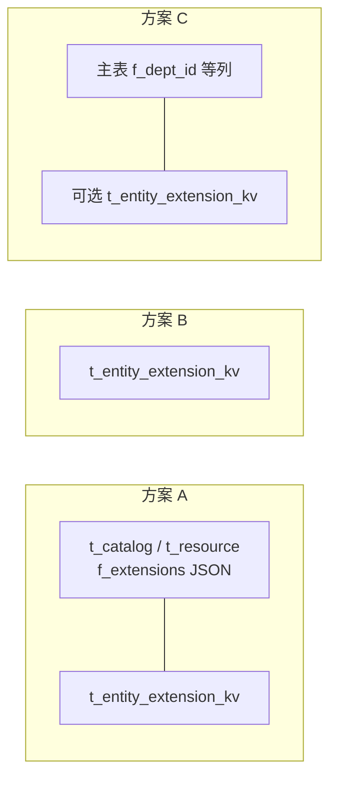
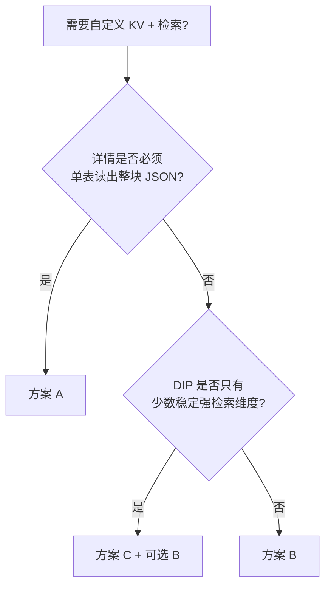

# VEGA Catalog / Resource 自定义扩展与检索 — 方案设计

> **状态**：草案  
> **日期**：2026-05-08  
> **相关 Issue**：[#382 【VEGA】catalog/resource 支持自定义扩展资源，以支持 DIP 的业务使用](https://github.com/kweaver-ai/kweaver-core/issues/382)（Issue 原文用语为「扩展」；**OpenAPI 与 HTTP 请求/响应仅使用 `extensions`**；存储层命名见各方案。）  
> **实现代码预期路径**：`adp/vega/vega-backend`（迁移脚本、领域模型、HTTP 层）

---

## 1. 背景与目标

### 1.1 背景

DIP 等业务需要在 VEGA 的 **Catalog** 与 **Resource** 上挂载**不属于 VEGA 内置模型**的外部信息（例如部门、信息系统、责任主体等）。Issue #382 要求：

- 提供 **扁平 KV（`extensions`）** 能力，允许用户自定义内容；
- 支持 **检索 / 筛选**（列表与查询场景）。

当前 `vega-backend` 已在主表使用 `MEDIUMTEXT` 存储 JSON（如 `t_catalog.f_metadata`、`t_resource.f_source_metadata`），但 **MariaDB / DM8 不作为 JSON 路径查询的依赖**（不假设 `JSON_EXTRACT` / 生成列等能力），筛选应落在**可索引的关系结构**上。

### 1.2 目标

- 为 `catalog` 与 `resource` 提供统一的「**自定义扩展**」语义（**`extensions` 字段**）。
- 列表与搜索接口支持按 **key / value**（及多条件组合）过滤，查询计划可走 **B-Tree 索引**，避免对大 JSON 做运行时全表扫描。

### 1.3 非目标（Non-Goals）

- **不引入** OpenSearch、Elasticsearch 等**独立搜索中间件**；列表与筛选的演进**限定在 MariaDB 与 DM8** 的关系模型与索引能力内（亦不假设业务库升级即可获得 JSON 路径索引等新能力）。若产品需要「更强文本能力」，须在**当前库**边界内另行论证（例如：可枚举 token 列、前缀索引、`LIKE 'prefix%'` 约束、或应用层归一化后再写入可索引列），本文不展开。
- 不把 DIP 主数据系统做成 VEGA 内唯一权威源（若选外置权威源，见 Issue 讨论中的方案 E，本文不展开实现）。
- 不规定具体 OpenAPI YAML 的最终路径与字段命名（实现阶段与 `adp/docs/api/vega/vega-backend-api` 对齐即可）。

---

## 2. 术语与约束

| 术语 | 含义 |
|------|------|
| **实体（Entity）** | `catalog` 或 `resource`，由 `scope` 区分。 |
| **扩展项（Extension KV）** | 一条 `(scope, entity_id, key, value)` 语义的数据；可多行表示同一 key 多值。 |
| **OpenAPI 字段** | 请求/响应体 **仅** **`extensions`**（扁平 object，`string`→`string`）。**写入**：根对象出现 **`extensions` 键**（含 `{}`）即触发该实体整包 KV 更新；未出现则不修改。列表筛选使用 **`extension_key` / `extension_value`**（多对 AND）。存储层不依赖 JSON 路径查询。 |

**数据库与平台约束（MariaDB / DM8）**

- 业务持久化与列表筛选**仅**使用 **MariaDB** 与 **DM8**（与 `vega-backend` 迁移目录一致）；**不依赖**独立搜索集群，**不假设**为获得 JSON 索引而升级数据库大版本。
- 扩展的「可检索面」落在**独立表**的 `VARCHAR`（或有限长度 `TEXT`）列上，通过普通/联合/前缀索引支持等值与前缀类查询。
- 主表上的大块 JSON（若存在）仅用于**完整快照**或**与外部系统对齐的序列化视图**，不作为 WHERE 条件依据。

---

## 3. 方案总览

本文档细化三类方案，对应此前讨论中的 **A / B / C**：

| 方案代号 | 名称 | 核心结构 | 适用场景 |
|----------|------|----------|----------|
| **A** | 主表 JSON 快照 + EAV 副表 | `t_catalog` / `t_resource` 增加 `f_extensions`（JSON 文本）+ `t_entity_extension_kv` | **快落地** + 需要「一次读回整块 **extensions** 快照」+ 与业界资源元数据（K8s labels 等）**概念类比** |
| **B** | 纯 EAV 副表 | 仅 `t_entity_extension_kv`，无主表大块 JSON | **几乎只关心筛选**；列表可不返回 extensions 或按需聚合 |
| **C** | 固定列 + 可选长尾 KV | DIP 高频维度提升为真实列 + 索引；其余可走 B 或极小 JSON | **少数固定维度要强检索**（部门、信息系统等） |



---

## 4. 方案 A：主表 JSON 快照 + EAV 副表（快落地 + extensions + 搜索）

### 4.1 设计意图

- **产品/API**：对外 **仅** **`extensions`**；写入/读取/筛选规则见 §2 术语表；存储仍只落一套 KV / 快照。
- **检索**：所有列表筛选条件只命中 **EAV 副表**，与主表 JSON **解耦**；MariaDB / DM8 无需 JSON 函数参与 WHERE。

### 4.2 数据模型

**（1）主表新增字段**

- `t_catalog.f_extensions`：`MEDIUMTEXT NOT NULL`，默认 `'{}'`，存 UTF-8 JSON 对象（仅约定，不做 DB 层 JSON 校验）。
- `t_resource.f_extensions`：同上。

> 说明：与现有 `f_metadata`、`f_source_metadata` 类型一致，迁移与序列化路径可复用。

**（2）副表：`t_entity_extension_kv`（建议命名，实现时可微调）**

| 列名 | 类型 | 说明 |
|------|------|------|
| `f_id` | `BIGINT` 自增或 `VARCHAR(40)` | 行主键 |
| `f_scope` | `VARCHAR(16)` NOT NULL | `catalog` \| `resource` |
| `f_entity_id` | `VARCHAR(40)` NOT NULL | 对应 `t_catalog.f_id` 或 `t_resource.f_id` |
| `f_key` | `VARCHAR(128)` NOT NULL | 命名建议：`dip:department_id` 式前缀，避免与将来内置 key 冲突 |
| `f_value` | `VARCHAR(512)` NOT NULL | 统一字符串；若需结构化，约定为 JSON 字符串 |
| `f_ordinal` | `SMALLINT NOT NULL DEFAULT 0` | 同一 `(scope, entity_id, key)` 多值时排序 |
| `f_create_time` / `f_update_time` | `BIGINT` | 可选，便于审计 |

**唯一性与多值**

- **单值语义**：`UNIQUE (f_scope, f_entity_id, f_key)`，更新时 UPSERT 一行。
- **多值语义**（同一 key 多个 value）：去掉上述唯一，改为 `UNIQUE (f_scope, f_entity_id, f_key, f_ordinal)` 或 `UNIQUE (f_scope, f_entity_id, f_key, f_value)`（按产品是否允许重复 value 选择）。

**索引（检索导向）**

- `INDEX idx_scope_entity (f_scope, f_entity_id)`：按实体拉全量 KV。
- `INDEX idx_scope_key_value (f_scope, f_key, f_value)`：按 key + 等值 value 筛实体列表（最常见）。
- 若 value 很长且只需前缀匹配：`f_value` 前缀索引或缩短 `f_value` 最大长度并在应用层哈希冗余列 `f_value_prefix`（按需）。

### 4.3 写入路径与一致性

**推荐事务顺序（同一 `entity` 一次提交）**

1. 解析请求体中的 **`extensions`** 对象。
2. **先**删除或对比差异更新 `t_entity_extension_kv` 中该 `(f_scope, f_entity_id)` 的旧行，再插入新行（或 MERGE 策略）。
3. **再**更新主表 `f_extensions` 为与 KV **完全一致**的 JSON 序列化结果（或由 KV 在应用层生成）。

**一致性原则**

- **以 KV 表为检索真源**；主表 JSON 为 **展示快照**。若两步间失败，应回滚事务，避免「能搜到但与详情 JSON 不一致」。

### 4.4 查询模式（列表示例）

筛选「`dip:department_id = 'D001'` 的 resource」：

```sql
SELECT r.*
FROM t_resource r
INNER JOIN t_entity_extension_kv k
  ON k.f_scope = 'resource' AND k.f_entity_id = r.f_id
WHERE k.f_key = 'dip:department_id' AND k.f_value = 'D001';
```

多条件 AND：对同一 `k` 表多次 JOIN（别名 `k1`, `k2`）或 `EXISTS` 子查询；**避免**对 `f_extensions` 使用 `LIKE '%...%'` 作为唯一筛选手段。

### 4.5 API 形态（草案）

- **写入**：请求体可选 **`extensions`**（object；整包语义见 §4.3）。
- **读取**：详情返回 **`extensions`**。
- **列表**：查询参数 **`extension_key` / `extension_value`**；多条件 AND 规则不变。

### 4.6 优点 / 缺点

| 优点 | 缺点 |
|------|------|
| 与现有 JSON 列风格一致；详情一次 IO 可读全量 | 双写维护成本；存储冗余 |
| 检索不依赖 JSON 函数；快落地 | 若 JSON 与 KV 不同步会产生歧义（靠事务规避） |

---

## 5. 方案 B：纯 EAV 副表（仅筛选，不存大块 JSON）

### 5.1 设计意图

- **不做**主表 `f_extensions` 列（或仅保留极短占位，不推荐）。
- 所有标签数据**仅**存在于 `t_entity_extension_kv`；**列表筛选**与 **详情中的 **`extensions`** 区块** 均通过 **KV 查询或聚合** 得到。

### 5.2 数据模型

与方案 A 中 **副表定义相同**（`f_scope`, `f_entity_id`, `f_key`, `f_value`, …），主表**不增加** `f_extensions`。

### 5.3 读取策略

| 场景 | 策略 |
|------|------|
| 列表（不需返回 extensions） | 仅按 `JOIN` / `EXISTS` 过滤，SELECT 主表列，性能最优。 |
| 列表（需返回部分 extensions） | 限制展示的 key 白名单；使用 `GROUP_CONCAT` 或对 `entity_id IN (...)` 二次批量查询 KV 表。 |
| 详情 | `SELECT * FROM t_entity_extension_kv WHERE f_scope=? AND f_entity_id=?`，在应用层组装为 `map[string]string` 或 `[]ExtensionEntry`。 |

### 5.4 写入路径

- 仅维护 `t_entity_extension_kv`；逻辑简单，**无 JSON 与 KV 双写一致性问题**。

### 5.5 优点 / 缺点

| 优点 | 缺点 |
|------|------|
| 数据单源；一致性强 | 详情与「带 extensions 的列表」需额外查询或聚合 |
| 存储无冗余 | 若一次加载大量实体且每实体 KV 很多，需注意 N+1（应用层批量 IN 查询缓解） |

### 5.6 何时选 B 而非 A

- 产品明确 **不需要** 在 DB 主表存「整块 **extensions** JSON 快照」；
- 标签项数量可控，且愿意在应用层做 **KV → JSON** 的组装。

---

## 6. 方案 C：固定列强检索 + 可选长尾 KV（DIP 少数维度）

### 6.1 设计意图

对 DIP 已确认的少数高基、高频筛选维度（例如 **`department_id`**、**`information_system_id`**），在 `t_catalog` / `t_resource` 上增加 **真实列**（`VARCHAR` / `CHAR`），并建 **B-Tree 索引**；等值、IN 查询性能与语义最清晰。

其余长尾、偶发、试验性字段仍可用 **方案 B 的 KV 表**（或极简 `f_extensions` 只读快照列，不参与 WHERE）。

### 6.2 数据模型示例（列名仅为示例）

**Catalog 侧（示例）**

| 新增列 | 类型 | 索引 |
|--------|------|------|
| `f_dip_department_id` | `VARCHAR(64) NOT NULL DEFAULT ''` | `INDEX (f_dip_department_id)` |
| `f_dip_information_system_id` | `VARCHAR(64) NOT NULL DEFAULT ''` | `INDEX (f_dip_information_system_id)` |

**Resource 侧**：同上或按业务只挂在 resource 上（以 DIP 实际绑定粒度为准）。

**组合索引**：若常见查询为「部门 + 信息系统」同时过滤，可加 `INDEX (f_dip_department_id, f_dip_information_system_id)`。

### 6.3 与 KV 的关系

推荐组合：**C + B（子集）**

- **C**：负责少数「一等公民」维度，迁移、监控、权限策略可单独演进。
- **B**：负责其余 `dip:*` 或业务自定义 KV，避免 DDL 爆炸。

不推荐：**C + A 大块 JSON** 且无 KV —— 会重新引入「JSON 内筛选困难」问题。

### 6.4 API 形态（草案）

- 列表查询：`department_id=`、`information_system_id=` 作为 **一等查询参数**（与 **`extension_key` / `extension_value`** 类参数并存亦可）。
- 写入：请求体顶层字段与 **`extensions`** 并存时，**必须定义优先级**（建议：**顶层固定列覆盖同义 KV**，或禁止同义双写，在文档与校验层写死）。

### 6.5 优点 / 缺点

| 优点 | 缺点 |
|------|------|
| 最热路径查询最简单、可预期 | 每增一固定维度需迁移与发版 |
| 与审计、权限、统计报表对接直观 | 灵活性低于纯 KV |

---

## 7. 三方案对比与选型建议

### 7.1 对比表

| 维度 | A（JSON + KV） | B（纯 KV） | C（固定列 ± KV） |
|------|----------------|------------|------------------|
| 落地速度 | 快 | 快 | 中（需定列名与迁移） |
| 详情读全量 extensions | 优（单表读） | 中（额外查询） | 优（固定列）+ 中（其余 KV） |
| 列表筛选性能 | 优（走 KV 索引） | 优 | 优（固定列更优） |
| 存储冗余 | 有 | 无 | 低 |
| 一致性复杂度 | 中高 | 低 | 低（固定列）+ 低（KV） |
| 维度演进（新增业务 key） | 高：仅插 KV + 同步 JSON | 高：仅插 KV | 中：长尾仍走 KV；若升格为列需迁移 |
| **后期扩展：新增可检索维度** | **高**（无 DDL）；检索面始终在 KV 索引策略内演进 | **高** | **中～高**：热点可走新列，其余 KV |
| **后期扩展：维度「升格」为一等列** | **中**：从 KV 读出回填新列，可渐进停写 JSON 中同义键 | **中**：与 A 类似，无 JSON 包袱 | **低**：已是列；再增列仍要 DDL |
| **后期扩展：新实体类型挂载可检索标签** | **高**：EAV 增加 `scope` 枚举即可（如未来 `dataset`） | **高** | **中**：KV 易扩展；固定列需每张业务主表加列 |
| **后期扩展：审计 / 导出 / 只读分析（仍在本库体系内）** | **高**：以 **KV 表 + 固定列** 为稳定、可导出的「事实面」；同库可增加审计表、汇总表或走只读副本（若基础设施已具备） | **高**（单一面更清晰） | **高**：固定列与 KV 并存时需约定**筛选与导出**以谁为准（建议 KV + 列为联合真源） |
| **后期扩展：API 与契约稳定性** | **中**：客户端易依赖「整块 JSON」任意形状，长期易产生隐式耦合 | **高**：对外仍可用 object 组装，存储不绑 blob | **高**：顶层查询参数稳定，利于多团队对接 |
| **后期扩展：类型化 / 注册表（key 元数据）** | **中～高**：可旁路增加 `t_extension_key_registry`，与 A 无冲突 | **高** | **高**：固定列强类型天然；KV 仍可挂 registry |
| **后期扩展：多租户 / 隔离策略** | **高**：副表可加 `f_tenant_id` 或 key 前缀约定，不改主表 JSON 语义也可 | **高** | **中**：列级租户少见，多在应用层过滤 |
| **长期技术债与重构** | **中**：双写若长期存在，易出现「只改 JSON」的旁路；需规范与 CI 校验 | **优**：单真源，易收缩复杂度 | **中**：列过多时宽表与迁移成本上升；应用 **C + B 上限策略**（见 §7.4） |

### 7.2 决策树（简）



### 7.3 综合推荐（可并行分期）

1. **第一期（快落地、对齐 Issue）**：实现 **方案 A 的副表 + 列表筛选**；主表 `f_extensions` 可与副表同步上线，降低前端改造压力。
2. **若确认不需要主表 JSON**：第二期去掉 `f_extensions` 或停止写入，即 **退化为 B**，减少冗余。
3. **DIP 维度稳定后**：将 Top N 维度 **提升为方案 C 的固定列**，原 KV 中同义 key 做数据迁移与写入双写兼容期。

### 7.4 后期扩展性维度（细析）

以下从「上线后持续演进」角度说明三类方案的差异，与 **§7.1 对比表** 中「后期扩展」行互为补充。

#### 7.4.1 扩展性要解决的问题（抽象）

| 演进诉求 | 含义 |
|----------|------|
| **维度膨胀** | 业务侧不断新增标签类字段，不能每次发版都改核心宽表。 |
| **检索升级（同库内）** | 在等值 / 前缀 / `IN` 基础上，通过**组合索引、覆盖索引、查询拆分、（可选）规范化可索引列**演进；**不**承诺全文检索与重分词级模糊检索（仍限定在 MariaDB/DM8 能力内）。 |
| **契约与治理** | key 命名、值格式、敏感级别、审批流随时间规范化。 |
| **平台化** | 同一套扩展机制挂到更多实体（不止 catalog / resource）。 |
| **观测与导出** | 审计、报表导出、只读分析等消费稳定的「扩展事实面」（KV + 固定列）；**不依赖**库外搜索索引。 |

#### 7.4.2 方案 A 的扩展性特点

- **优势**：新 key **零 DDL**；对外「大块 JSON」便于快速对接多种客户端；检索面在 KV 表，后续加 **组合索引、覆盖索引** 主要动副表即可。  
- **风险**：若团队习惯直接改 `f_extensions` 而不同步 KV，会破坏「KV 为检索真源」的一致性；长期建议 **禁止绕过仓储写 JSON**，或通过 DB 触发器/批校（成本较高）兜底。  
- **演进路径**：后期可 **关闭主表 JSON 写入**（API 仍返回 object，由 KV 组装），无损退化为 B 的存储形态，扩展性不因去掉 JSON 而下降。

#### 7.4.3 方案 B 的扩展性特点

- **优势**：**单一真源**，最适合作为「**可检索扩展**」平台底座：新增 scope、加 `f_tenant_id`、挂 registry、或旁路写审计表 **都只触一张副表**（仍落在 MariaDB/DM8 内）。  
- **代价**：若未来强需求「单表 ROW 即含完整 extensions blob」（例如离线导出只扫主表），需接受 **应用层组装** 或 **只读物化列**（可选，非必选）。  
- **演进路径**：与 C 组合时，**从 KV 提拔热 key 到固定列** 的路径清晰；无 JSON 双写，迁移脚本更简单。

#### 7.4.4 方案 C 的扩展性特点

- **优势**：对 **已冻结的少数维度**，后续在权限、报表、JOIN、监控上的扩展成本最低；对外 API 字段稳定。  
- **风险**：**固定列无上限**会导致宽表与迁移频繁，反噬扩展性。  
- **建议策略（与 §7.1、§7.3 一致）**：书面约定 **「一等公民」列上限**（例如每实体 ≤3～5 个）；超出部分 **一律 KV**，形成 **C + B** 的稳定扩展边界。

#### 7.4.5 检索能力在 MariaDB / DM8 内向「上」扩展时的共性

无论 A / B / C，**可索引筛选**的根基仍是 **关系化的 KV 行或固定列**。在**不引入**独立搜索中间件、**不假设**升级 JSON 索引能力的前提下，演进手段主要包括：

- **索引与 SQL**：增加/调整 `(f_scope, f_key, f_value)` 与固定列上的联合索引、覆盖索引；控制多 `EXISTS` 个数与结果集；必要时对极高频筛选键走 **方案 C** 的列化。  
- **一致性面**：以 **`t_entity_extension_kv` 的变更**（及固定列变更）为筛选与导出的权威来源；A 方案中 **`f_extensions` 不宜作为唯一事实源**（易产生与线上一致性争议）。  
- **契约**：为 key 预留 **命名空间与前缀规范**，便于应用层、报表与审计消费同一套语义。

#### 7.4.6 与分期推荐的衔接

- **第一期用 A**：扩展性已足够，但需在工程规范上 **锁死「KV 为真源」**，为后期退化为 B 或叠加 C 留门。  
- **长期以 B 为底座、C 收敛热点**：扩展性在「维度无限 + 检索可演进」上最优；C 只服务 **经评审冻结** 的少量维度。

---

## 8. 统一检索语义（A / B / C 共用）

### 8.1 建议的过滤语义

- **单条件**：`extension_key` + `extension_value`（等值）；可选 `extension_op`：`eq`（默认） / `prefix`（若支持前缀索引或 `LIKE 'v%'`）。
- **多条件 AND**：多个 `(key, value)` 对；实现为多次 `EXISTS` 或多次 `INNER JOIN`（注意 JOIN 放大与去重）。
- **固定列（方案 C）**：独立 query 参数，与 **extensions** 筛选 **AND** 组合。

### 8.2 安全与配额

- 限制 `f_key` / `f_value` 最大长度；单实体最大 KV 条数；禁止用户自定义 key 以 `vega_` 前缀开头（保留内置命名空间）。
- 所有拼接进 SQL 的值使用参数绑定，禁止字符串拼接 SQL。

---

## 9. 与 `vega-backend` 落地的对应关系

| 层面 | 说明 |
|------|------|
| 迁移 | `adp/vega/vega-backend/migrations/mariadb/<version>/` 与 `dm8` 若需同源结构则同步变更 |
| 领域模型 | `server/interfaces/catalog.go`、`resource.go` 等增加 `Extensions map[string]string` 或结构化类型 |
| 持久化 | `server/drivenadapters/catalog`、`resource` 访问层增加 KV 读写与列表 JOIN |
| API 文档 | `adp/docs/api/vega/vega-backend-api/` 下 catalogs / resources 相关 YAML |
| 设计文档索引 | 总览：本文档；**方案 A 落地**：[catalog-resource-labels-scheme-a-design.md](./catalog-resource-labels-scheme-a-design.md)；**方案 B 落地**：[catalog-resource-labels-scheme-b-design.md](./catalog-resource-labels-scheme-b-design.md) |

---

## 10. 风险与缓解

| 风险 | 缓解 |
|------|------|
| JOIN 次数多导致计划变差 | 优先 `EXISTS`；控制 **extensions** 筛选条件个数上限；热点路径用固定列（C） |
| key 命名混乱 | 文档约定 `dip:`、`org:` 前缀；可选后续增加注册表（registry） |
| 数据迁移 | 新表 + 默认空；老数据无扩展不影响；若有 JSON 遗留需一次性脚本导入 KV |

---

## 11. 里程碑（建议）

- [ ] 评审确定 A / B / C 组合与第一期范围  
- [ ] MariaDB（及如需 DM8）迁移：副表 + 索引；可选主表列  
- [ ] 领域模型与仓储：事务内写 KV（+ 可选 JSON）  
- [ ] 列表 API：**extensions**（`extension_key`/`extension_value`）过滤 + 单测 + 性能用例（大数据量 entity）  
- [ ] API 文档与 DIP 联调验收  

---

## 12. 业界参考与其他边界说明

除本文 **A / B / C** 外，业界在「可扩展元数据 + 可检索」上还有多种成熟套路。下列对照**仅作概念参考**；**落地时检索与持久化仍以 MariaDB / DM8 为唯一业务库**，不引入独立搜索集群。

### 12.1 与本设计思路的对应关系

| 业界常见模式 | 核心做法 | 与本文 A / B / C 的对应 |
|--------------|----------|-------------------------|
| **EAV /「自定义字段」模型** | 实体 + 属性名 + 值多行存储；报表侧常做透视或同库汇总表 | 等价 **B**（及 **A** 中的副表面） |
| **Labels / Tags 与 Annotations 分离**（Kubernetes、[GCP 资源标签](https://cloud.google.com/resource-manager/docs/creating-managing-labels) 等） | **Labels**：短、有格式约束、用于**选择器 / 策略绑定**；**Annotations**：大段非索引元数据 | **KV/固定列** ≈ 可检索扩展（本仓库 OpenAPI 字段名为 **`extensions`**）；**主表 JSON / annotations** ≈ A 中 `f_extensions` 快照列或现有 `metadata`（不参与 WHERE） |
| **云厂商资源标签**（[AWS Tagging](https://docs.aws.amazon.com/tagging/latest/userguide/tagging-best-practices.html)、Azure 等） | 键值对 + 强配额 + 与账单/策略集成；检索走标签索引或专用 API | 类似 **B + 治理**（配额、命名、审计）；热点维度可 **C** |
| **支付 / SaaS 对象 `metadata`**（如 [Stripe Metadata](https://docs.stripe.com/api/metadata)） | 扁平 KV、**条数与长度上限**、不参与复杂联表；复杂筛选多在应用层或**同库**报表 SQL 完成 | 接近 **B**；强调 **产品层限额** 与「不在 SQL 里解析 blob」 |
| **JSONB + GIN / 表达式索引**（PostgreSQL 生态） | 半结构化一列搞定，**索引可走 JSON 路径** | **非当前选型**：业务库为 MariaDB / DM8 且不假设升级；本文以关系 KV 为主 |
| **生成列 / 函数索引**（部分 MySQL / MariaDB 对 JSON 的索引能力） | 从 JSON 派生可索引列 | 与 **A** 类似，但派生列替代手写双写；需 **MariaDB/DM8 具体版本能力对齐** 后再单独立项 |
| **检索与事务分离（CQRS / 读模型，同库）** | 写 OLTP；读路径使用**同库**物化汇总表、定时刷新统计表、或只读副本上的查询（若运维已提供） | 仍在 **MariaDB/DM8** 内完成；KV 表或主表固定列为读模型的**投影源** |
| **元数据注册表（Schema Registry）** | 定义 key 的类型、是否可筛、是否敏感；写入前校验 | 可与 **B / C** 叠加，降低「任意 key」带来的契约腐化 |
| **外置目录（Data Catalog）** | [Apache Atlas](https://atlas.apache.org/)、[DataHub](https://datahubproject.io/) 等：分类、血缘、搜索自成体系 | 若企业已部署，可走 **API 集成**；**本文**仍要求 VEGA 侧权威筛选数据落在 **MariaDB/DM8**，不把目录产品当作业务库替代品 |

### 12.2 在「仅 MariaDB / DM8」下的演进手段（不引入新中间件）

- **更强筛选**：组合索引、覆盖索引、热点维度 **C 列化**、控制 `JOIN`/`EXISTS` 深度与分页。  
- **报表与统计**：同库汇总表 / 定时任务刷新、或与现有 BI 通过**只读账号**直连同一库（权限与负载隔离由运维策略决定）。  
- **复杂文本需求**：在**不升级**、**不外挂搜索**前提下，优先 **产品降维**（可枚举分类、规范化 token 写入可索引列）或 **前缀类** 检索；超出关系库舒适区的需求需产品层面重新界定范围。

### 12.3 边界说明（与 §12.1 不重复展开）

- **外置主数据仅引用 ID**：VEGA 存引用，详情走 DIP（网络依赖与缓存策略需单独设计）。  
- **不把第三方目录或搜索产品写进本期必选架构**；若后续企业统一采购，再单独做集成设计，**不改变**本期「业务库仅 MariaDB/DM8」的约束。

---

## 13. 文档修订记录

| 版本 | 日期 | 说明 |
|------|------|------|
| 0.1 | 2026-05-08 | 初稿：细化方案 A / B / C 与选型 |
| 0.2 | 2026-05-08 | 增加「后期扩展性」对比行与 §7.4 细析，并与分期推荐衔接 |
| 0.3 | 2026-05-08 | §12 扩充为业界参考与边界对照 |
| 0.4 | 2026-05-08 | 明确平台约束：仅 MariaDB / DM8，不引入独立搜索中间件；§1、§7、§12 相应收敛；文档置于 `adp/docs/design/vega/features/vega-backend/` |
| 0.5 | 2026-05-08 | 设计文档迁至 `adp/docs/design/vega/features/vega-backend/`；存储草案含 EAV 副表 |
| 0.6 | 2026-05-08 | （过渡稿）曾并列 `labels` / `extensions`；已废止 |
| 0.7 | 2026-05-08 | **对外仅 `extensions`**；列表 query 仅 `extension_*`；方案 B 表 **`t_entity_extension`**；方案 A **`f_extensions` + `t_entity_extension_kv`** |
