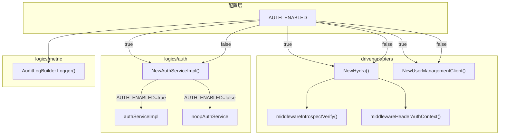

# execution-factory ISF 解耦（AUTH_ENABLED）技术设计文档

> **状态**：已完成
> **负责人**：
> **日期**：2026-03-26
> **相关需求**：[execution-factory 与 ISF 解耦](https://github.com/kweaver-ai/adp/issues/249)

---

## 1. 背景与目标 (Context & Goals)

### 背景

`execution-factory/operator-integration` 原先在运行时强依赖 ISF 能力：

- `hydra`：公共接口 Bearer Token 校验与访问者身份解析
- `authorization`：资源级权限判断与列表过滤
- `user_management`：用户/应用展示名查询
- 审计日志：通过 MQ/outbox 发送安全审计事件

这类强依赖在以下场景中会带来明显问题：

- **本地开发 / 单元测试**：需要准备完整 ISF 环境才能跑通接口
- **私有化部署**：目标环境不包含 Hydra / authorization / user-management 时，服务无法独立运行
- **联调 / 冒烟验证**：即使业务逻辑与 ISF 无关，接口也会因认证入口失败而整体不可用

### 目标

1. 引入 `AUTH_ENABLED` 作为 ISF 能力总开关
2. 开关关闭时，服务不再依赖 `hydra`、`authorization`、`user_management`
3. 开关关闭时，服务仍可在最小身份模型下独立运行
4. 开关默认为 `true`，保持生产环境安全优先

### 非目标 (Non-Goals)

- 不拆分 Hydra / authorization / user-management 的独立子开关
- 不支持运行时动态切换，需重启服务生效
- 不修改 ISF 外部系统自身逻辑
- 不在 `AUTH_ENABLED=false` 时模拟完整审计与真实权限模型

---

## 2. 方案概览 (High-Level Design)

### 2.1 系统架构图



### 2.2 核心思路

整体沿用 BKN 的“工厂返回 real/noop 实现”模式，但结合 `operator-integration` 的现有架构做了三层收口：

1. **驱动适配层收口外部依赖**
   - `hydra`、`user_management` 由工厂统一决定 real/noop
2. **逻辑层收口权限语义**
   - `logics/auth` 在开关关闭时返回 `noopAuthService`
3. **入口层收口最小身份模型**
   - 公共接口与内部接口都由中间件统一构造访问者上下文

这样业务模块不再依赖真实 ISF 是否存在，只依赖已经稳定适配后的接口。

---

## 3. 详细设计 (Detailed Design)

### 3.1 开关读取

```go
// server/infra/config/config.go
func GetAuthEnabled() bool {
    envVal := os.Getenv("AUTH_ENABLED")
    return envVal != "false" && envVal != "0"
}
```

默认不设置等同于开启，只有显式 `false` / `0` 才关闭。

### 3.2 Hydra 解耦

`server/drivenadapters/hydra.go`

- `NewHydra()`：
  - `AUTH_ENABLED=true` 返回真实 Hydra client
  - `AUTH_ENABLED=false` 返回 `noopHydra`
- `noopHydra.Introspect(c)`：
  - 不调用外部 Hydra
  - 直接基于请求头构造最小 `TokenInfo`
- `noopHydra.GenerateVisitor(c)`：
  - 读取 `x-account-id`
  - 读取 `x-account-type`
  - 缺失身份时默认生成匿名访问者

#### 最小身份模型

关闭 auth 后，访问者身份规则为：

1. 以 `x-account-id` 作为身份来源
2. `x-account-type` 为空时默认 `user`
3. 若没有 `x-account-id`，则视为匿名账号
4. 中间件统一回填 `user_id` header，供后续 `ShouldBindHeader` 使用

### 3.3 入口中间件解耦

`server/driveradapters/middleware.go`

#### 公共接口

`middlewareIntrospectVerify(hydra)`：

- `AUTH_ENABLED=true`
  - 调用真实 `hydra.Introspect`
- `AUTH_ENABLED=false`
  - 调用 `noopHydra.Introspect`
  - 不再依赖 Bearer Token

两种情况下都统一补齐：

- `AccountAuthContext`
- `TokenInfo`
- `user_id` header
- `IsPublic`

#### 内部接口

`middlewareHeaderAuthContext(hydra)`：

- 统一调用 `hydra.GenerateVisitor(c)`
- 从 `x-account-id/x-account-type` 构造访问者
- 开关关闭时，无身份则落成匿名访问者，而不是报错

### 3.4 Auth Service 解耦

`server/logics/auth/index.go`

- `NewAuthServiceImpl()`：
  - `AUTH_ENABLED=true` 返回真实实现
  - `AUTH_ENABLED=false` 返回 `noopAuthService`

`noopAuthService` 关键语义：

- `OperationCheck` / `OperationCheckAll`：直接放行
- `CreatePolicy` / `DeletePolicy` / `UpdatePolicy`：静默成功
- `ResourceListIDs()`：返回 `[]string{interfaces.ResourceIDAll}`

最后一点是关键设计：在查询侧，`AUTH_ENABLED=false` 代表“跳过权限过滤”，而不是“没有任何可见资源”。

### 3.5 User Management 解耦

`server/drivenadapters/user_management.go`

- `NewUserManagementClient()`：
  - `AUTH_ENABLED=true` 返回真实 client
  - `AUTH_ENABLED=false` 返回 `noopUserManagementClient`

展示语义：

- 有 `user_id`：直接显示 `user_id`
- `user_id == system`：显示 `system`
- 没有 `user_id`：显示 `unknown`

### 3.6 审计日志关闭

`server/logics/metric/audit_log.go`

`AuditLogBuilder.Logger()` 在 `AUTH_ENABLED=false` 时直接返回，不再发送 MQ/outbox 审计事件。

原因：

- 业务可运行需要最小身份上下文
- 审计属于安全合规能力，不应在 auth off 模式下伪运行

---

## 4. 降级语义 (Degrade Semantics)

### 4.1 身份

- 身份来源：`x-account-id`
- 默认类型：`user`
- 缺失身份：匿名访问者
- `user_id`：由入口中间件统一回填

### 4.2 权限

- auth off 时，视为全量权限
- 通过 `ResourceIDAll` 表达“跳过权限过滤”
- 绝不能返回空资源集，否则查询会被误判成“无权限”

### 4.3 展示

- 用户展示：`user_id -> unknown`
- 不允许出现因为关闭 ISF 而导致的大面积空展示字段

### 4.4 审计

- auth off 时，不发送审计日志

---

## 5. 关键改动点 (Key Changes)

| 文件 | 说明 |
|------|------|
| `server/infra/config/config.go` | 新增 `GetAuthEnabled()` |
| `server/drivenadapters/hydra.go` | Hydra real/noop 工厂与访问者生成 |
| `server/drivenadapters/user_management.go` | user-management real/noop 工厂 |
| `server/driveradapters/middleware.go` | 公共/内部接口统一注入最小身份上下文 |
| `server/logics/auth/index.go` | auth real/noop 工厂与全量权限语义 |
| `server/logics/auth/query_builder.go` | 识别 `ResourceIDAll`，避免查询被误清空 |
| `server/logics/metric/audit_log.go` | auth off 时关闭审计发送 |

---

## 6. 边界情况与风险 (Edge Cases & Risks)

### 6.1 auth off 下的匿名访问

匿名访问不等于所有接口都应成功。设计上仅保证：

- 入口不会因缺失 Hydra 而整体不可用
- 允许匿名的接口可继续运行

若某些业务接口仍显式要求 `user_id`，它们会继续在自身校验处失败，这是业务约束，不是认证链路故障。

### 6.2 不能绕过工厂直接使用外部 client

关闭 auth 后，真实 Hydra / authorization / user-management client 不应再被直接初始化或调用。所有业务逻辑必须通过现有工厂获取能力。

### 6.3 开关是部署时静态配置

real/noop 实现通过单例工厂初始化，变更开关需重启服务，不支持热切换。

---

## 7. 验收清单 (Acceptance Criteria)

- `AUTH_ENABLED=false` 时，服务不再请求 `hydra`、`authorization`、`user_management`
- 公共接口与内部接口都能构造最小身份上下文
- 无身份请求默认视为匿名访问
- 查询不再因 auth off 被误清空
- 用户展示遵循 `user_id -> unknown` 规则
- auth off 时不发送审计日志
- `AUTH_ENABLED=true` 时，现有行为保持不变
