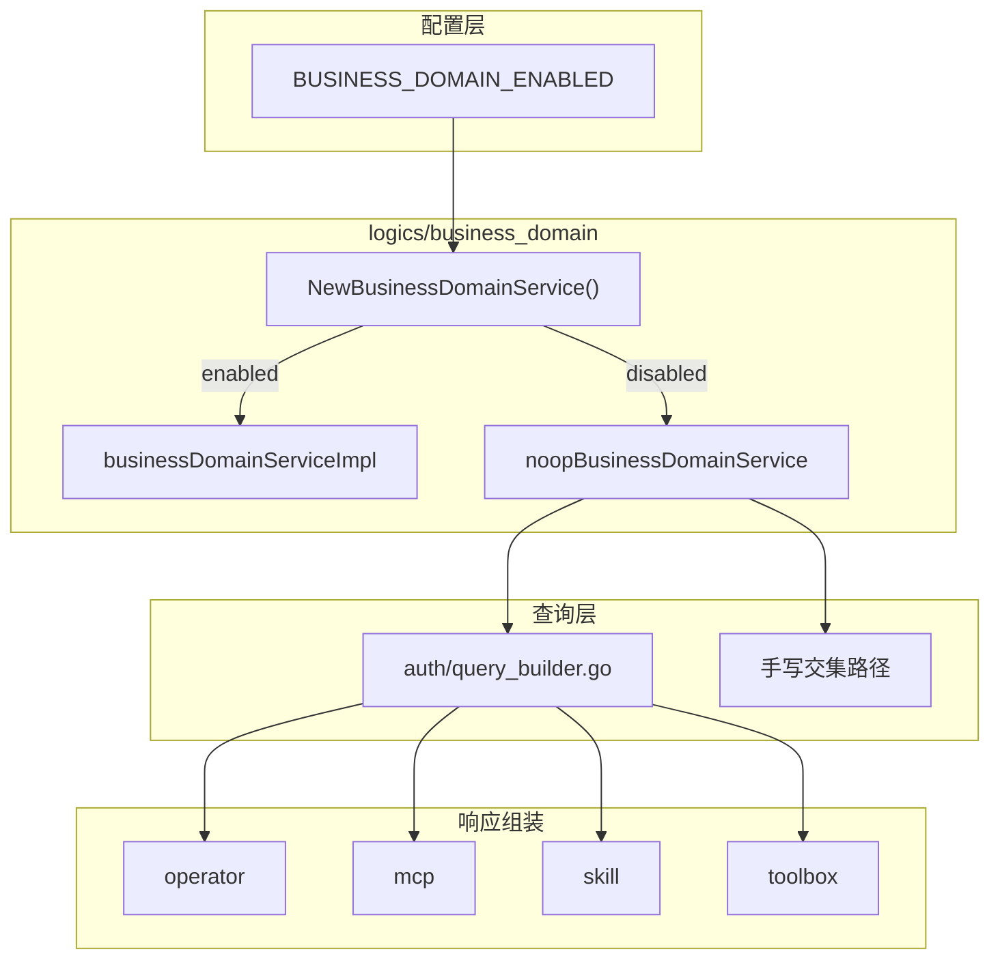

# execution-factory 业务域解耦（BUSINESS_DOMAIN_ENABLED）技术设计文档

> **状态**：已完成
> **负责人**：
> **日期**：2026-03-26
> **相关需求**：[execution-factory 与业务域解耦](https://github.com/kweaver-ai/adp/issues/379)

---

## 1. 背景与目标 (Context & Goals)

### 背景

`execution-factory/operator-integration` 原先在两类场景中强依赖业务域能力：

1. **写路径**
   - 注册、发布、删除等流程会调用业务域服务进行资源绑定/解绑
2. **读路径**
   - 列表查询会把业务域资源集与权限资源集做交集
   - 结果展示会从业务域映射中回填 `BusinessDomainID`

如果在没有业务域服务的环境中直接关闭真实依赖，系统会出现两个典型问题：

- 写路径初始化或调用时失败
- 读路径把“业务域不可用”误解成“没有任何可见资源”

### 目标

1. 引入 `BUSINESS_DOMAIN_ENABLED` 作为业务域能力独立开关
2. 开关关闭时，不再依赖真实业务域服务
3. 写路径中的绑定/解绑操作静默跳过
4. 读路径中的业务域过滤改为 bypass，而不是空结果
5. 响应里的 `BusinessDomainID` 不出现空值歧义

### 非目标 (Non-Goals)

- 不修改业务域外部系统自身逻辑
- 不改变开关开启时的现有行为
- 不伪造资源真实所属业务域

---

## 2. 方案概览 (High-Level Design)

### 2.1 系统架构图



### 2.2 核心思路

延续 BKN 的 real/noop 工厂模式，但围绕 `operator-integration` 的查询框架额外补齐两层协议：

1. **过滤协议**
   - `ResourceIDAll` 代表“跳过业务域过滤”
   - 不是普通资源 ID
2. **响应协议**
   - `BusinessDomainID` 真实映射优先
   - 无真实映射时回退请求业务域
   - 不允许返回空字符串造成歧义

---

## 3. 详细设计 (Detailed Design)

### 3.1 开关读取

```go
// server/infra/config/config.go
func GetBusinessDomainEnabled() bool {
    envVal := os.Getenv("BUSINESS_DOMAIN_ENABLED")
    return envVal != "false" && envVal != "0"
}
```

默认不设置等同于开启。

### 3.2 Business Domain Service 解耦

`server/logics/business_domain/index.go`

- `NewBusinessDomainService()`：
  - `BUSINESS_DOMAIN_ENABLED=true` 返回真实实现
  - `BUSINESS_DOMAIN_ENABLED=false` 返回 `noopBusinessDomainService`

`server/logics/business_domain/noop_business_domain.go`

#### 写路径语义

- `AssociateResource(...)`：返回 `nil`
- `DisassociateResource(...)`：返回 `nil`
- `BatchDisassociateResource(...)`：返回 `nil`
- `ValidateBusinessDomain(...)`：返回 `nil`

关闭业务域后，写路径不再因绑定/解绑失败而中断。

#### 读路径语义

- `ResourceList(...)` 返回 `[]string{interfaces.ResourceIDAll}`
- `BatchResourceList(...)` 返回 `map[string]string{interfaces.ResourceIDAll: ""}`

这里的 `ResourceIDAll` 是 bypass 协议哨兵，含义是“关闭业务域过滤”，不是一个真实资源 ID。

### 3.3 入口业务域处理

`server/driveradapters/middleware.go`

`middlewareBusinessDomain(...)`：

- 负责为公共/内置路径补默认业务域 `bd_public`
- 将请求业务域写入上下文
- 再调用 `ValidateBusinessDomain(ctx)`

当 `BUSINESS_DOMAIN_ENABLED=false` 时：

- `ValidateBusinessDomain` 走 noop
- 不再因为业务域外部系统缺失而拦截请求

### 3.4 查询过滤 bypass

#### QueryBuilder 路径

`server/logics/auth/query_builder.go`

查询侧显式识别业务域服务返回的 `ResourceIDAll`，语义为：

- 跳过业务域过滤
- 若 auth 是全量权限，结果保持全量
- 若 auth 是有限权限，结果仅受 auth 过滤约束

绝不能把 `[]` 或空 map 当作 noop 返回值，否则查询会被错误短路为空结果。

#### 手写交集路径

部分路径未走 `QueryBuilder`，需要显式兼容 `ResourceIDAll`：

- `server/logics/toolbox/release.go`

该路径在业务域返回 `*` 时：

- auth 全量：返回 `ResourceIDAll`
- auth 有限：直接使用 auth 资源集
- 不与 `*` 做普通集合交集

### 3.5 响应 `BusinessDomainID` 回填

业务域关闭后，系统已无法得到“资源真实归属业务域”。因此响应层采用统一回填策略：

1. 若 `resourceToBdMap[resourceID]` 命中真实映射，优先返回真实值
2. 若未命中，回退到请求业务域

这样可以避免两种错误：

- 返回空字符串，产生空值歧义
- 伪造一个默认业务域，误导调用方认为那是资源真实归属

当前已在以下模块同步：

- `operator`
- `mcp`
- `skill`
- `toolbox`

---

## 4. 降级语义 (Degrade Semantics)

### 4.1 写路径

- 绑定/解绑：静默跳过
- 校验：默认通过

### 4.2 读路径

- `ResourceIDAll`：表示 bypass
- auth 全量 + bd bypass：查询全量
- auth 有限 + bd bypass：仅应用 auth 过滤

### 4.3 响应层

- `BusinessDomainID`：
  - 真实映射优先
  - 缺失时回退请求业务域
- 不允许返回空字符串造成歧义

---

## 5. 关键改动点 (Key Changes)

| 文件 | 说明 |
|------|------|
| `server/infra/config/config.go` | 新增 `GetBusinessDomainEnabled()` |
| `server/logics/business_domain/index.go` | business-domain real/noop 工厂 |
| `server/logics/business_domain/noop_business_domain.go` | 写路径静默成功，读路径返回 bypass 哨兵 |
| `server/driveradapters/middleware.go` | 请求业务域上下文注入与校验入口 |
| `server/logics/auth/query_builder.go` | 识别业务域 `ResourceIDAll` bypass |
| `server/logics/operator/query.go` | 响应 `BusinessDomainID` 回退请求业务域 |
| `server/logics/operator/market.go` | 响应 `BusinessDomainID` 回退请求业务域 |
| `server/logics/mcp/manage.go` | 响应 `BusinessDomainID` 回退请求业务域 |
| `server/logics/mcp/mcp_release.go` | 响应 `BusinessDomainID` 回退请求业务域 |
| `server/logics/skill/registry.go` | 响应 `BusinessDomainID` 回退请求业务域 |
| `server/logics/toolbox/query.go` | 响应 `BusinessDomainID` 回退请求业务域 |
| `server/logics/toolbox/release.go` | 手写交集兼容 `ResourceIDAll`，响应回退请求业务域 |

---

## 6. 边界情况与风险 (Edge Cases & Risks)

### 6.1 `ResourceIDAll` 是协议，不是数据

如果某个消费方把 `*` 当作普通资源 ID 参与交集或组装，就会重新引入空结果或错误展示。

因此所有消费 `resourceToBdMap` 的路径都必须理解这条协议。

### 6.2 关闭业务域后，响应业务域不是“真实归属”

回退请求业务域只是为了避免空值歧义，并保持响应可解释；它表达的是“请求上下文业务域”，不是资源事实归属。

### 6.3 开关是部署时静态配置

Business-domain real/noop 仍通过工厂初始化，变更配置需重启服务。

---

## 7. 验收清单 (Acceptance Criteria)

- `BUSINESS_DOMAIN_ENABLED=false` 时，不再依赖真实业务域服务
- 绑定/解绑调用静默成功，不影响写路径主流程
- 列表查询不再因业务域关闭而被误清空
- 手写交集路径正确识别 `ResourceIDAll`
- `BusinessDomainID` 不再出现空值歧义
- 开关开启时，现有行为保持不变
