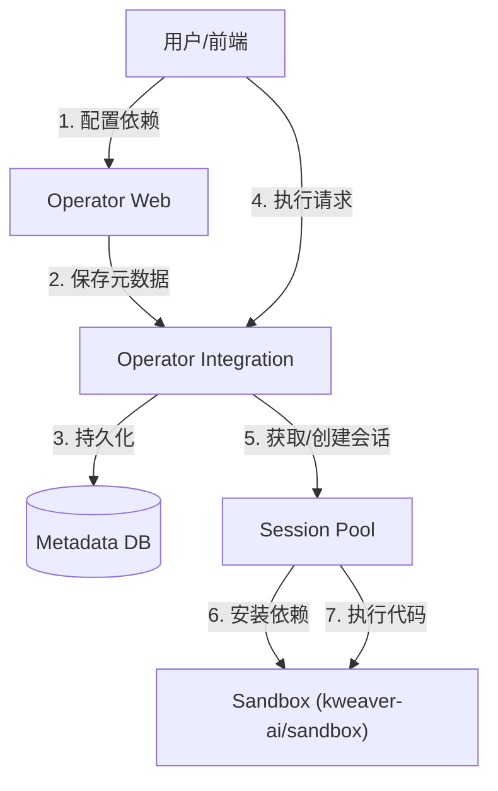
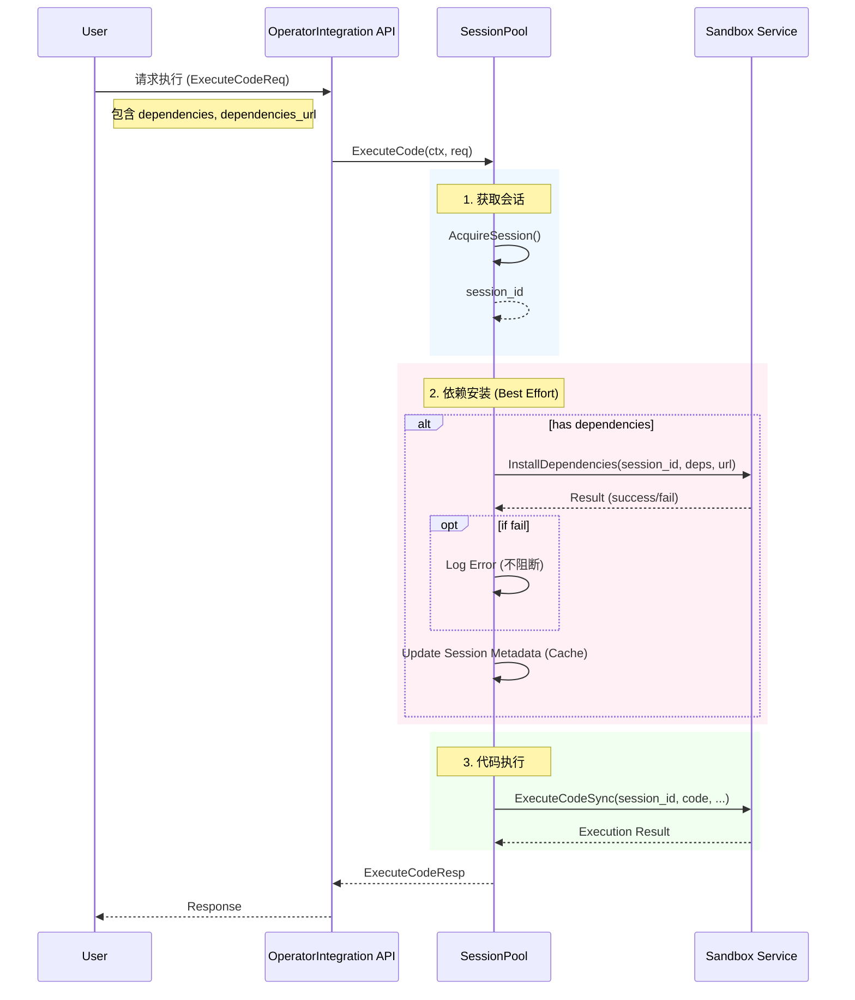

# 函数依赖库安装（Function Dependency Library Install）实现设计

## 1. 概述

本设计旨在为执行工厂（Execution Factory）的 Python 函数算子提供动态依赖安装能力。允许用户在定义函数时指定所需的第三方 Python 库（如 `pandas`, `requests`）及安装源（如 PyPI 官方源或企业内网镜像），系统将在沙箱执行代码前自动完成环境准备。

## 2. 架构设计

### 2.1 系统上下文



### 2.2 核心组件交互

- **Operator Integration**:
    - **Metadata Service**: 负责存储和读取函数的依赖配置。
    - **Session Pool**: 负责沙箱会话的生命周期管理，并在执行前触发依赖安装。
    - **Sandbox Control Plane**: 封装与底层沙箱服务的 API 交互。
- **Sandbox**:
    - 提供 Python 运行时环境，支持通过 `pip` 动态安装依赖。

## 3. 详细设计

### 3.1 数据模型设计

在 `t_metadata_function` 表中增加以下字段：

| 字段名 | 类型 | 描述 | 备注 |
| :--- | :--- | :--- | :--- |
| `f_dependencies` | `TEXT` | 依赖列表 JSON 数组 | 例：`["pandas==1.5.2", "requests"]` |
| `f_dependencies_url` | `TEXT DEFAULT ''` | PyPI 索引源 URL | 例：`https://pypi.org/simple` |

### 3.2 接口设计

#### 3.2.1 算子/工具管理接口（变更）
涉及函数类型算子/工具的元数据管理，需在 Request/Response Body 的 `content` 字段中增加依赖配置。

**涉及接口**:
- 创建算子: `POST /api/agent-operator-integration/v1/operator`
- 更新算子: `PUT /api/agent-operator-integration/v1/operator/:id`
- 创建工具: `POST /api/agent-operator-integration/v1/toolbox`
- 更新工具: `PUT /api/agent-operator-integration/v1/toolbox/:id`
- 获取详情: `GET .../:id`

**Payload 变更示例 (FunctionInput)**:

```go
// FunctionInput 函数输入定义
type FunctionInput struct {
    // 基础信息
    Name        string `json:"name" form:"name"`                         // 函数名称
    Description string `json:"description,omitempty" form:"description"` // 函数描述
    // 参数定义
    Inputs  []*ParameterDef `json:"inputs,omitempty" form:"inputs"`   // 输入参数列表
    Outputs []*ParameterDef `json:"outputs,omitempty" form:"outputs"` // 输出参数列表
    // 代码相关
    ScriptType      ScriptType        `json:"script_type" form:"script_type" default:"python" validate:"required,oneof=python"` // 脚本类型
    Code            string            `json:"code" form:"code"`                                                                 // Python 代码（必填）
    Dependencies    []*DependencyInfo `json:"dependencies,omitempty" form:"dependencies"`                                       // 依赖库列表 (新增)
    DependenciesURL string            `json:"dependencies_url,omitempty" form:"dependencies_url"`                               // 依赖库安装源地址 (新增)
}

// DependencyInfo 依赖库信息
type DependencyInfo struct {
    Name    string `json:"name"`    // 库名
    Version string `json:"version"` // 版本约束 (如 "1.5.2" 或 ">=2.0")
}
```

#### 3.2.2 公共执行接口 （变更）
**POST** `/api/agent-operator-integration/v1/function/execute`

支持在请求体中携带依赖信息，用于调试或临时执行。

- **Request Body 变更**:
  ```json
  {
    "code": "import pandas...",
    "script_type": "python",
    "dependencies": [{"name": "pandas", "version": "1.5.2"}],
    "dependencies_url": "https://pypi.org/simple"
    // ... 其他原有字段
  }
  ```

#### 3.2.3 内部执行接口 （变更）
**POST** `/api/agent-operator-integration/internal-v1/function/exec/:version`

- **逻辑变更**:
    1. 根据 `version` 读取函数元数据。
    2. 从元数据中提取 `f_dependencies` 和 `f_dependencies_url`。
    3. 将依赖信息注入到后续的沙箱执行请求中。

#### 3.2.4 依赖版本查询辅助接口 （新增）
**GET** `/api/agent-operator-integration/v1/function/dependency-versions/:package_name`

- **Path Param**: `package_name` (必填)
- **Query Param**: `python_version` (可选，默认 `3.10`), `pypi_repo_url` (可选，默认 PyPI 官方 `https://pypi.org/simple`)
- **Response**:
  ```json
  {
    "package_name": "pandas",
    "versions": ["1.0.0", "1.0.1", "2.0.0"]
  }
  ```
- **说明**: 仅支持符合 PEP 503 且提供 JSON API (`/pypi/{package}/json`) 的镜像源（如 PyPI 官方、清华源）。

#### 3.2.5 查询已安装依赖接口

**GET** `/api/agent-operator-integration/v1/function/dependencies`

查询当前环境中已安装的依赖库列表。
- **Response**:
  ```json
  {
    "dependencies": [
      {
        "name": "pandas",
        "version": "1.5.2"
      }
    ],
    "session_id": "session_id"
  }
  ```
- **说明**: 返回沙箱预置的公共依赖库或当前会话已安装的库。

#### 3.2.6 沙箱内部接口 (Sandbox Control Plane)

**POST** `/sessions/{session_id}/install-dependencies` (拟定对接接口)

- **Request**:
  ```json
  {
    "dependencies": [{"name": "pandas", "version": "1.5.2"}],
    "python_package_index_url": "https://pypi.org/simple"
  }
  ```
- **Response**:
  ```json
  {
    "success": true,
    "logs": "Successfully installed..."
  }
  ```

### 3.3 核心逻辑与时序

#### 3.3.1 执行流程



#### 3.3.2 依赖安装策略
1.  **触发条件**: 请求中 `dependencies` 非空。
2.  **错误处理 (Best Effort)**:
    - 若 `InstallDependencies` 失败（如网络超时、包不存在），**仅记录错误日志**，不返回错误给前端，继续尝试执行用户代码。
    - **理由**: 避免因镜像源偶发波动导致核心业务不可用；且用户代码可能做了 try-import 兼容。
3.  **缓存优化 (Future)**:
    - 当前设计为每次执行请求都触发检查。
    - 沙箱侧应实现幂等性：若已安装满足版本的包，应直接返回成功（pip 本身具备此特性）。

## 4. 异常处理

| 异常场景 | 处理行为 | 对用户影响 |
| :--- | :--- | :--- |
| 依赖包名/版本不存在 | 记录日志，继续执行 | 代码执行时抛出 `ModuleNotFoundError`，用户需检查配置 |
| 依赖源无法访问 (Timeout) | 记录日志，继续执行 | 同上，执行失败 |
| 沙箱服务不可用 | 返回 503 Service Unavailable | 无法执行 |

## 5. 测试计划

1.  **单元测试**:
    - 测试 `SessionPool.ExecuteCode` 在有无依赖参数时的逻辑分支。
    - 测试 `py_func_parser` 正确解析元数据中的依赖字段。
2.  **集成测试**:
    - 配合 Mock Sandbox 服务，验证依赖安装请求是否正确发出。
    - 验证安装失败后，执行流程是否继续。
3.  **端到端测试 (E2E)**:
    - 真实连接沙箱，配置 `requests` 库，验证代码能否成功 import 并发起网络请求。
