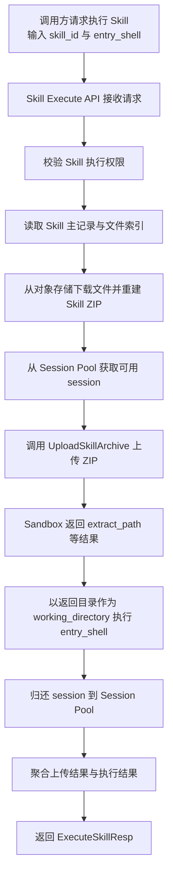
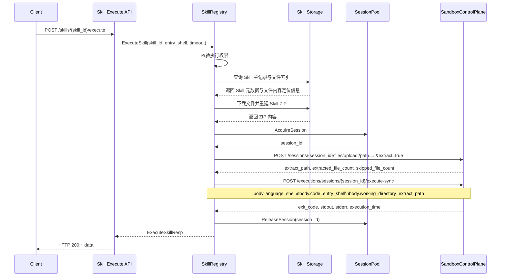

# Skill 执行接口与 Sandbox 编排设计

> 状态: Draft
> 负责人: 待确认
> Reviewers: 待确认

## 1. 概述

### 1.1 背景

- 执行工厂当前已经具备 Skill 的注册、查询、读取、下载等资源管理能力。
- 新需求要求执行工厂提供一个 Skill 执行接口，用于将 Skill 压缩包上传至 Sandbox 会话后执行指定 shell 命令。
- 当前 Sandbox 上传与执行协议尚未完全提供，因此首版需要在执行工厂内先完成编排逻辑，并通过 mock 方式打通端到端链路。

### 1.2 目标

- 提供私有 Skill 执行接口，支持调用方指定 Skill 与启动命令。
- 执行工厂通过 Session Pool 复用可用 Sandbox 会话，按真实 Sandbox REST 协议完成 Skill 压缩包上传、自动解压和 shell 执行编排。
- 将 mock 逻辑收敛在 Sandbox driven adapter，避免污染 Skill 业务层。
- 为真实 Sandbox 接口接入预留清晰替换边界。

### 1.3 非目标

- 不在本期新增 Session Pool 的新复用策略、预热策略或会话回收策略。
- 不在本期支持 Skill 在线编辑、增量上传或回写。
- 不在本期实现 shell 白名单、运行时资源隔离策略或审计增强。
- 不在本期实现真实 Sandbox 上传协议联调。

## 2. 接口设计

### 2.1 私有接口

- 方法: `POST /api/agent-operator-integration/internal-v1/skills/{skill_id}/execute`
- 作用: 执行指定 Skill，并在 Sandbox 中运行调用方提供的入口命令。

### 2.2 请求参数

请求头:

- `x-business-domain`: 业务域 ID
- `x-account-id`: 调用方 ID
- `x-account-type`: 调用方类型

路径参数:

- `skill_id`: Skill ID

请求体:

```json
{
  "entry_shell": "bash run.sh",
  "timeout": 15
}
```

字段说明:

- `entry_shell`: 调用方明确指定的启动命令，例如 `bash run.sh`、`python main.py`
- `timeout`: 可选，执行超时时间，单位秒

### 2.3 响应结果

```json
{
  "skill_id": "skill-123",
  "session_id": "sess_aoi_0",
  "work_dir": "skills/sess_aoi_0/demo-skill",
  "file_name": "demo-skill.zip",
  "mode": "archive_extract",
  "uploaded_path": "skills/sess_aoi_0/demo-skill",
  "extracted_file_count": 12,
  "skipped_file_count": 0,
  "command": "bash run.sh",
  "exit_code": 0,
  "stdout": "ok",
  "stderr": "",
  "execution_time": 8,
  "mocked": true
}
```

字段说明:

- `session_id`: 从 Session Pool 获取的 Sandbox 会话 ID
- `work_dir`: Sandbox 上传接口返回的解压目录，相对于 workspace 根目录
- `uploaded_path`: Sandbox 上传接口返回的路径；自动解压时与 `work_dir` 一致
- `command`: 实际执行的入口命令
- `mocked`: 当前是否来自 mock Sandbox 实现

## 3. 整体流程

### 3.1 主流程



补充说明:

- `entry_shell` 由调用方明确指定。
- `work_dir` 以 Sandbox 上传接口返回结果为准。
- 上传时通过 `extract=true` 自动解压 ZIP。
- 当前 Sandbox 侧能力先通过 mock 打通主流程。
- Session Pool 负责会话分配与归还，Skill 执行逻辑不直接创建会话。

### 3.2 时序说明



补充说明:

- 当前实现中，Skill 执行通过 `SessionPool` 获取与归还会话，上传压缩包和执行 shell 通过 `SandboxControlPlane` adapter 调用。
- 后续接入真实 Sandbox 时，优先保持该时序不变，仅替换 adapter 内部协议实现。

## 4. 详细设计

### 4.1 Skill 侧职责

`skillRegistry.ExecuteSkill` 承担以下职责:

- 校验 Skill 执行权限
- 读取 Skill 主记录
- 查询 Skill 文件索引
- 从对象存储下载文件内容
- 重建 Skill ZIP 包
- 从 Session Pool 获取可用会话
- 调用 Sandbox adapter 完成上传、自动解压和执行
- 执行完成后归还会话到 Session Pool
- 聚合执行结果并返回统一响应

### 4.2 ZIP 重建策略

- 不直接依赖原始上传 ZIP 回传。
- 下载逻辑复用现有 Skill 下载能力的思路:
  - 读取 Skill 主记录中的 `SKILL.md` 内容
  - 读取文件索引中的附件
  - 重新打包为 ZIP
- 这样可以保证 Skill 执行和 Skill 下载使用相同的数据来源与一致性模型。

### 4.3 Sandbox Adapter 职责

Sandbox driven adapter 新增两个执行相关能力:

- `UploadSkillArchive`
- `ExecuteShell`

职责边界如下:

- Skill 逻辑层只关心“上传成功/返回目录/执行结果”
- Sandbox adapter 负责对接具体协议
- mock 与真实接口切换仅发生在 adapter 内
- Session Pool 负责会话获取、复用和归还

真实 Sandbox 协议映射如下:

- `UploadSkillArchive`
  - 对接 `POST /api/v1/sessions/{session_id}/files/upload`
  - 使用 `multipart/form-data`
  - query 参数:
    - `path`
    - `extract=true`
    - `overwrite=false`
  - 自动解压时优先消费响应中的 `extract_path`
- `ExecuteShell`
  - 对接 `POST /api/v1/executions/sessions/{session_id}/execute-sync`
  - 请求体:
    - `language=shell`
    - `code=entry_shell`
    - `working_directory=extract_path`

## 5. Mock 方案

### 5.1 当前 mock 范围

当前 mock 仅存在于 `server/drivenadapters/sandbox_control_plane.go` 中:

- `UploadSkillArchive`: 模拟返回上传后的 `work_dir`、`uploaded_path`
- `ExecuteShell`: 模拟返回执行结果

### 5.2 Mock 目标

- 先打通 Skill 执行主流程
- 让 API 契约、业务逻辑和测试先稳定
- 避免在真实 Sandbox 协议未准备完成前阻塞开发

### 5.3 后续替换方式

真实 Sandbox 能力到位后，仅需替换以下实现:

- `UploadSkillArchive`
- `ExecuteShell`

若 Session Pool 对外接口保持不变，Skill handler、Skill registry 和私有 API 契约不应再发生结构性变化。

## 6. 关键设计决策

### 6.1 复用 Session Pool

- 当前仓库已经存在稳定的 Session Pool 机制，用于会话预热、复用、并发分配与健康检查。
- Skill 执行复用统一会话池，避免引入第二套独立的会话创建与回收逻辑。
- Skill 逻辑只依赖 `AcquireSession / ReleaseSession` 最小能力，不反向耦合 Pool 内部实现细节。

### 6.2 `entry_shell` 由调用方指定

- 调用方明确知道 Skill 包的启动方式。
- 执行工厂只负责运行编排，不负责推断 Skill 内部入口。
- 这样可以保持接口职责简单直接。

### 6.3 `work_dir` 以上传结果为准

- 工作目录属于 Sandbox 侧运行时结果。
- 执行工厂不应在业务层硬编码最终目录含义。
- 后续真实接口若调整目录生成策略，只要上传响应语义不变，Skill 执行流程无需改动。
- 当前为避免同一 Session 内不同 Skill 执行相互污染，请求上传时会显式传入隔离目录前缀，如 `skills/{session_id}/{skill_id}`。
- 真实执行时使用相对于 workspace 根目录的路径，而不是伪造绝对路径。

### 6.4 mock 收敛在 adapter

- 业务层不感知 mock 细节。
- 测试可直接验证调用顺序为 `AcquireSession -> UploadSkillArchive -> ExecuteShell -> ReleaseSession`。
- 降低未来替换真实协议时的改动面。

## 7. 风险与约束

### 7.1 上传后是否自动解压

- 当前设计假设 Sandbox 上传接口能为后续执行提供可用目录。
- 若真实协议要求显式解压，则需要在 adapter 层补一个解压动作或新增接口。

### 7.2 Session 生命周期

- 本期复用现有 Session Pool，仅覆盖获取与归还。
- 会话预热、复用、健康检查和回收策略继续由 Session Pool 负责。

### 7.3 Shell 安全性

- 当前 `entry_shell` 为调用方直接输入。
- 后续如需面向更广泛调用场景，应考虑命令白名单、路径限制和运行时审计。

### 7.4 失败语义

- HTTP 成功不等于业务执行成功。
- shell 执行失败时，接口仍可返回 200，但需通过 `exit_code`、`stderr` 表达失败细节。

## 8. 测试方案

### 8.1 单元测试

需要覆盖以下场景:

- Skill 执行请求绑定成功
- 缺失 `entry_shell` 时参数校验失败
- Skill ZIP 打包成功
- 从 Session Pool 成功获取 session 后才允许上传
- `UploadSkillArchive` 成功且返回解压目录后才允许执行 shell
- 调用顺序必须为 `AcquireSession -> Upload -> Execute -> ReleaseSession`
- shell 执行结果正确映射到响应

### 8.2 集成测试

真实 Sandbox 接入后需要补充:

- 上传协议、query 参数和 `multipart/form-data` 验证
- `extract_path -> working_directory` 映射验证
- shell 执行协议验证
- 失败分支与超时分支验证

## 9. 后续演进

- 对接真实 Sandbox 上传与 shell 执行接口
- 评估是否需要在 Session Pool 侧增加目录清理策略
- 增加 shell 安全控制与审计日志
- 明确上传后解压协议
- 视需要为 Skill 执行增加更细粒度的会话隔离策略
