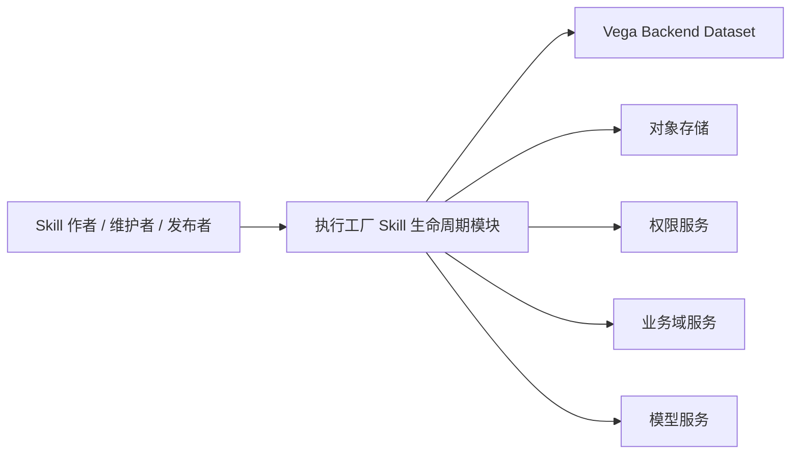
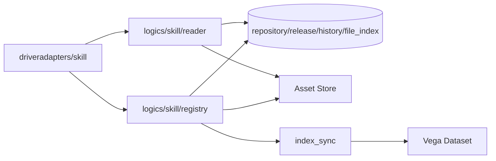
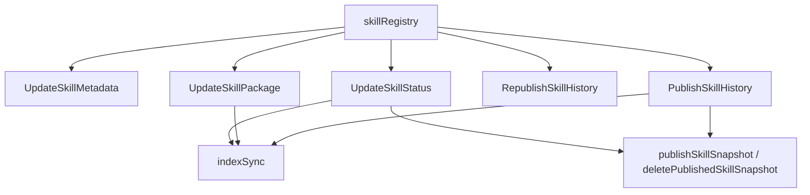
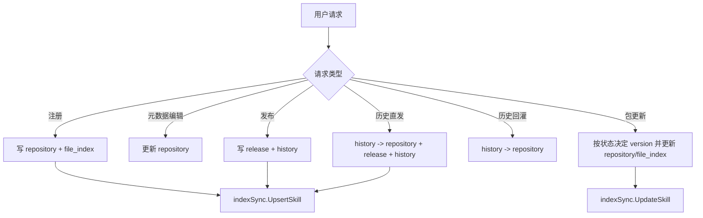
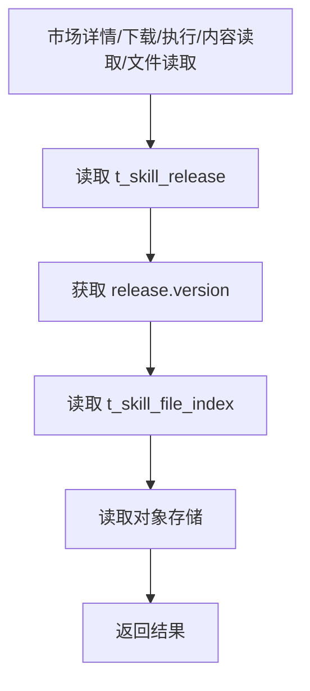
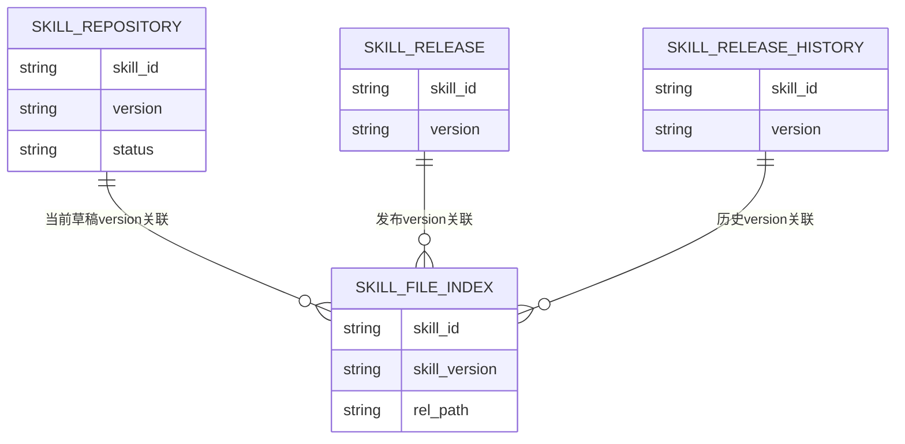
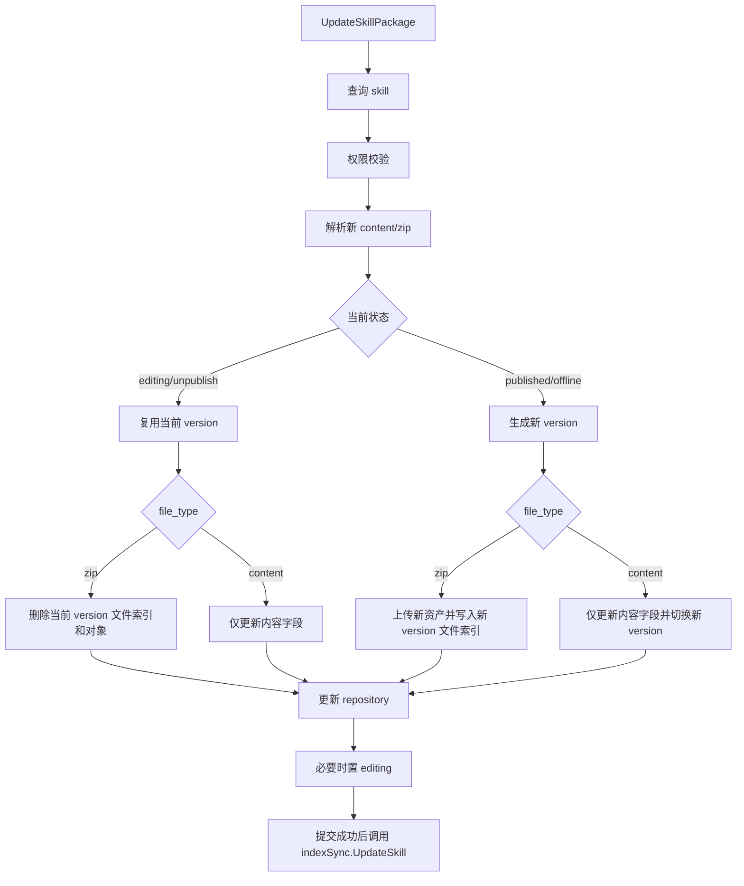
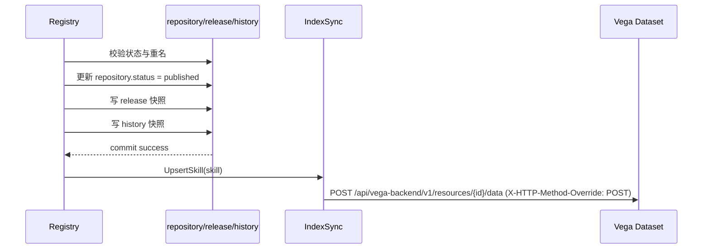
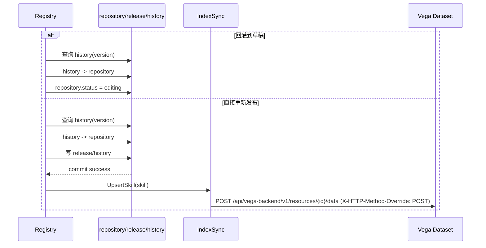

# 🏗️ Design Doc: Skill 包级更新与元数据维护

> 关联 PRD: ../../product/prd/skill_package_lifecycle_management.md

---

# 📌 1. 概述（Overview）

## 1.1 背景

- 业务与技术背景：
  - Skill 生命周期需要覆盖注册、草稿维护、发布、下架、历史回放、发布态读取等完整链路。
  - 本方案采用三层数据模型：`repository`、`release`、`history`。
  - 本方案统一复用 `t_skill_file_index`，通过 `skill_id + version` 寻址文件。
  - 本方案要求市场详情、下载、执行、内容读取、文件读取统一走 `release` 读取链路。
  - 本方案要求 Skill dataset 同步区分创建、更新、删除三类动作。

- 存在问题：
  - 旧文档结构不符合统一模板，章节边界不清晰。
  - 早期方案残留与本需求目标方案存在偏差，尤其在版本策略、状态流转和 dataset create/update 语义上。
  - 生命周期逻辑较复杂，需要通过统一的 HLD/LLD 文档稳定后续演进。

- 业务 / 技术背景：
  - 目标是支撑 Skill 的持续维护能力，提升生命周期管理效率与可维护性。
  - 关键技术问题包括：版本策略、发布快照、历史回放、文件索引复用、dataset 同步动作拆分。

---

## 1.2 目标

- 建立与本需求目标方案一致的 Skill 生命周期设计文档。
- 用统一模板清晰区分 HLD 与 LLD。
- 固化以下关键技术约束：
  - `repository / release / history` 三层职责
  - `t_skill_file_index` 统一按版本管理文件
  - 包更新按状态分支决定版本策略
  - Skill dataset 创建走 `POST`，更新走 `PUT`，删除走 `DELETE`

---

## 1.3 非目标（Out of Scope）

- 不设计单文件粒度补丁编辑方案。
- 不设计旧版本对象存储自动回收机制。
- 不设计版本对比界面和批量回滚产品能力。
- 不补充前端视觉稿或交互稿。

---

## 1.4 术语说明（Optional）

| 术语 | 说明 |
|------|------|
| repository | Skill 当前草稿态主表 |
| release | Skill 当前发布态快照 |
| history | Skill 发布历史快照 |
| file index | `t_skill_file_index`，统一文件索引表 |
| dataset | Vega Backend 中的 Skill 索引数据集 |

---

# 🏗️ 2. 整体设计（HLD）

> 本章节关注系统“怎么搭建”，不涉及具体实现细节

---

## 🌍 2.1 系统上下文（C4 - Level 1）

### 参与者
- 用户：Skill 作者、维护者、发布者
- 外部系统：Vega Backend Dataset
- 第三方服务：对象存储
- 内部系统：权限服务、业务域服务、模型服务

### 系统关系



---

## 🧱 2.2 容器架构（C4 - Level 2）

| 容器 | 技术栈 | 职责 |
|------|--------|------|
| Driver Adapters | Gin / HTTP | 对外暴露 Skill 生命周期接口 |
| Skill Registry | Go Logic | 草稿维护、发布、历史回放、索引同步编排 |
| Skill Reader | Go Logic | 发布态读取、历史读取 |
| DB Layer | MariaDB / DAO | 持久化 `repository/release/history/file_index` |
| Asset Store | OSS Gateway | Skill 文件上传、下载、删除 |
| Index Sync | Vega Client | 创建、更新、删除 dataset 文档 |

### 容器交互



---

## 🧩 2.3 组件设计（C4 - Level 3）

### Skill 生命周期组件

| 组件 | 职责 |
|------|------|
| RegisterSkill | 创建草稿与首个索引文档 |
| UpdateSkillMetadata | 编辑元数据，不变更版本 |
| UpdateSkillPackage | 更新包内容，按状态决定版本策略 |
| UpdateSkillStatus | 发布或下架 |
| RepublishSkillHistory | 历史版本回灌到草稿 |
| PublishSkillHistory | 历史版本直接重新发布 |
| SkillReader | 发布态详情、下载、执行、内容读取 |
| SkillIndexSync | dataset 创建、更新、删除 |



---

## 🔄 2.4 数据流（Data Flow）

### 主流程



### 子流程：发布态读取



---

## ⚖️ 2.5 关键设计决策（Design Decisions）

| 决策 | 说明 |
|------|------|
| 三层数据模型 | 用 `repository/release/history` 分离草稿、发布、历史，避免编辑污染线上态 |
| 文件索引复用 | 不新增发布态文件索引表，统一复用 `t_skill_file_index` |
| 状态驱动版本策略 | 包更新根据当前状态决定覆盖当前版本还是派生新版本 |
| dataset 动作拆分 | 创建与更新分别使用 `POST` 与 `PUT`，避免协议语义混淆 |
| 发布后再同步索引 | 先提交主事务，再同步外部 dataset，避免外部副作用早于事务完成 |

---

## 🚀 2.6 部署架构（Deployment）

- 部署环境：K8s，待确认
- 拓扑结构：执行工厂服务实例 + MariaDB + OSS + Vega Backend
- 扩展策略：服务水平扩展，外部依赖按现有平台能力扩展

---

## 🔐 2.7 非功能设计

### 性能
- 包更新与发布主流程不依赖 dataset 同步成功返回。
- 读取链路直接走 `release + file_index`，避免在读取时混入版本决策。

### 可用性
- dataset 同步失败不阻塞主流程。
- 发布与历史快照写入绑定事务，避免线上态和历史态分离。

### 安全
- 复用现有权限模型。
- 管理态与发布态读取边界固定。
- 日志不记录敏感存储凭据。

### 可观测性
- tracing：关键生命周期接口均已埋点
- logging：关键失败路径记录日志
- metrics：待确认是否补专门指标

---

# 🔧 3. 详细设计（LLD）

> 本章节关注“如何实现”，开发可直接参考

---

## 🌐 3.1 API 设计

### UpdateSkillMetadata

**Endpoint:** `PUT /skills/:skill_id/metadata`

**Request:**

```json
{
  "name": "demo-skill",
  "description": "new description",
  "category": "other_category",
  "extend_info": {
    "foo": "bar"
  }
}
```

**Response:**

```json
{
  "skill_id": "skill-1",
  "version": "v1",
  "status": "editing"
}
```

### UpdateSkillPackage

**Endpoint:** `PUT /skills/:skill_id/package`

**Request:**

```json
{
  "file_type": "zip|content",
  "file": "binary or content"
}
```

**Response:**

```json
{
  "skill_id": "skill-1",
  "version": "v2",
  "status": "editing"
}
```

### GetSkillReleaseHistory

**Endpoint:** `GET /skills/:skill_id/history`

### RepublishSkillHistory

**Endpoint:** `POST /skills/:skill_id/history/republish`

### PublishSkillHistory

**Endpoint:** `POST /skills/:skill_id/history/publish`

---

## 🗂️ 3.2 数据模型

### SkillRepository

| 字段 | 类型 | 说明 |
|------|------|------|
| skill_id | string | Skill 稳定业务主键 |
| version | string | 当前草稿版本 |
| status | string | 草稿当前状态 |
| name | string | 名称 |
| description | string | 描述 |
| skill_content | string | 技能内容 |
| dependencies | string | 依赖 |
| extend_info | string | 扩展信息 |
| file_manifest | string | 文件清单摘要 |

### SkillRelease

| 字段 | 类型 | 说明 |
|------|------|------|
| skill_id | string | Skill 主键 |
| version | string | 当前发布版本 |
| skill_release | snapshot | 当前发布快照字段集合 |

### SkillReleaseHistory

| 字段 | 类型 | 说明 |
|------|------|------|
| skill_id | string | Skill 主键 |
| version | string | 历史发布版本 |
| skill_release | snapshot | 历史快照 |

### SkillFileIndex

| 字段 | 类型 | 说明 |
|------|------|------|
| skill_id | string | Skill 主键 |
| skill_version | string | 版本号 |
| rel_path | string | 相对路径 |
| storage_id | string | 存储桶 |
| storage_key | string | 对象键 |

---

## 💾 3.3 存储设计

- 存储类型：
  - 主数据：MariaDB
  - 文件资产：对象存储
  - 检索索引：Vega Dataset

- 数据分布：
  - `repository` 保存当前草稿
  - `release` 保存当前发布快照
  - `history` 保存历史发布快照
  - `file_index` 保存所有版本的文件索引

- 索引设计：
  - 文件读取通过 `skill_id + version + rel_path`
  - 发布态读取先查 `release.version`，再查 `file_index`



---

## 🔁 3.4 核心流程（详细）

### 包更新流程



### 发布流程



### 历史回放流程



---

## 🧠 3.5 关键逻辑设计

### 版本策略
- 元数据编辑不变更 `version`
- `editing / unpublish` 包更新复用当前版本
- `published / offline` 包更新生成新草稿版本

### 读取策略
- 管理态详情读 `repository`
- 发布态详情、下载、执行、内容读取、文件读取读 `release`
- 历史查询读 `history`

### dataset 同步策略
- 注册创建：`UpsertSkill -> POST`
- 内容更新：`UpdateSkill -> PUT`
- 下架删除：`DeleteSkill -> DELETE`

---

## ❗ 3.6 错误处理

- Skill 不存在：返回 `404`
- 权限不足：返回 `403`
- 名称冲突：返回业务错误
- 包解析失败：直接返回，不进入事务
- 当前版本旧文件删除失败：直接返回错误
- 主事务失败：回滚数据库修改
- dataset 同步失败：记录日志，不回滚主流程

---

## ⚙️ 3.7 配置设计

| 配置项 | 默认值 | 说明 |
|--------|--------|------|
| Vega Dataset ID | `kweaver_execution_factory_skill_dataset` | Skill 索引数据集 |
| Embedding Model | `SmallModelTypeEmbedding` | 构建索引向量 |
| Asset Storage | 待确认 | Skill 文件对象存储 |

---

## 📊 3.8 可观测性实现

- tracing：
  - 注册、包更新、元数据编辑、发布、历史回放接口均埋点
  - 索引同步独立打点

- metrics：
  - 待确认是否增加包更新成功率、发布成功率、历史回放频次指标

- logging：
  - 记录事务失败
  - 记录 dataset 同步失败
  - 记录对象存储删除失败

---

# ⚠️ 4. 风险与权衡（Risks & Trade-offs）

| 风险 | 影响 | 解决方案 |
|------|------|----------|
| 对象存储删除成功但数据库失败 | 存储与索引不一致 | 后续补偿机制待单独设计 |
| 旧版本文件误删 | 破坏发布态或历史态读取 | 只在覆盖当前草稿版本时删除旧文件 |
| dataset 同步语义混淆 | 创建与更新动作混乱 | 固定拆分为 POST / PUT / DELETE |
| 文件索引统一复用 | 版本引用关系复杂 | 由 `version` 驱动读取，延后处理自动回收 |

---

# 🧪 5. 测试策略（Testing Strategy）

- 单元测试：
  - 元数据编辑
  - 包更新的双分支版本策略
  - 发布、下架、历史回灌、历史直发
  - `UpsertSkill / UpdateSkill / DeleteSkill` 的 dataset 动作语义

- 集成测试：
  - 发布态读取链路
  - 包更新后数据与文件一致性
  - 历史回放后的草稿与发布态隔离

- 压测：
  - 待确认是否需要针对大包上传或高频索引更新做专项压测

---

# 📅 6. 发布与回滚（Release Plan）

### 发布步骤
1. 评审 PRD 与设计文档
2. 合并生命周期主链实现
3. 完成回归测试
4. 发布到目标环境

### 回滚方案
- 若业务逻辑异常，回滚应用版本
- 若文档与实现不一致，以实现为准并重新同步文档
- 若 dataset 索引异常，可通过重新发布或重新同步修复

---

# 🔗 7. 附录（Appendix）

## 相关文档
- PRD: ../../product/prd/skill_package_lifecycle_management.md
- Vega Backend API: `/Users/chenshu/Code/github.com/kweaver-ai/kweaver-core/adp/docs/api/vega/vega-backend/vega-backend.yaml`

## 参考资料
- `server/logics/skill/registry.go`
- `server/logics/skill/reader.go`
- `server/logics/skill/index_sync.go`

---