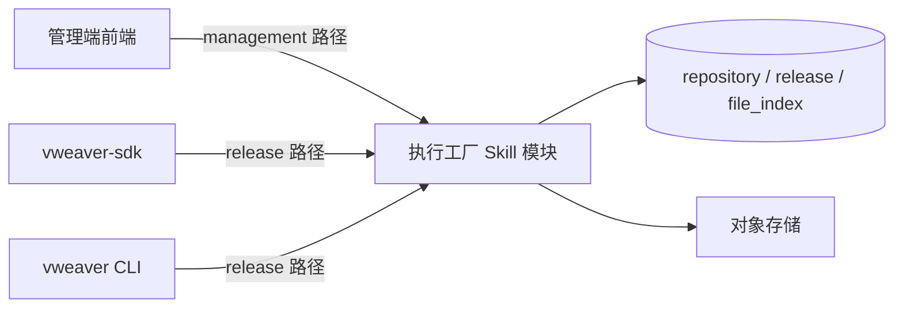
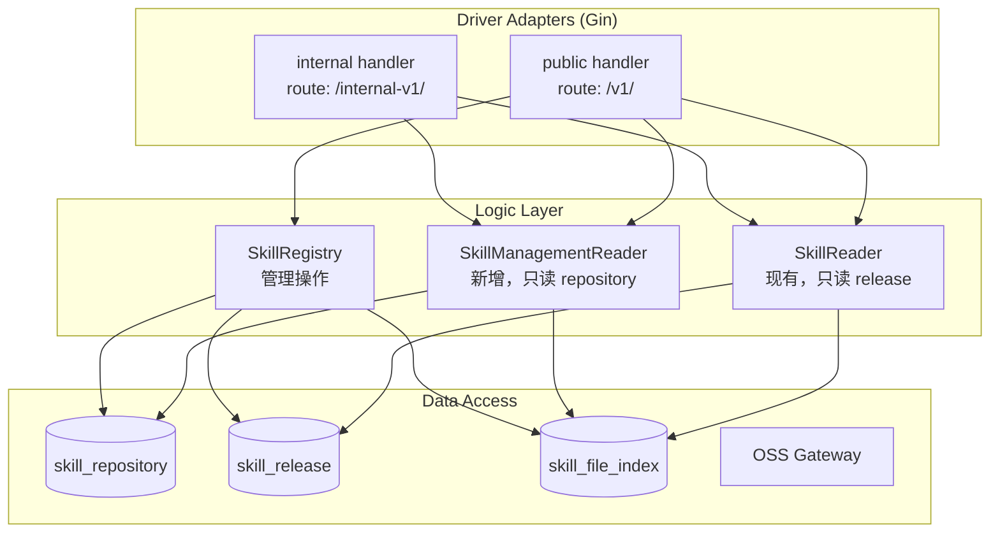
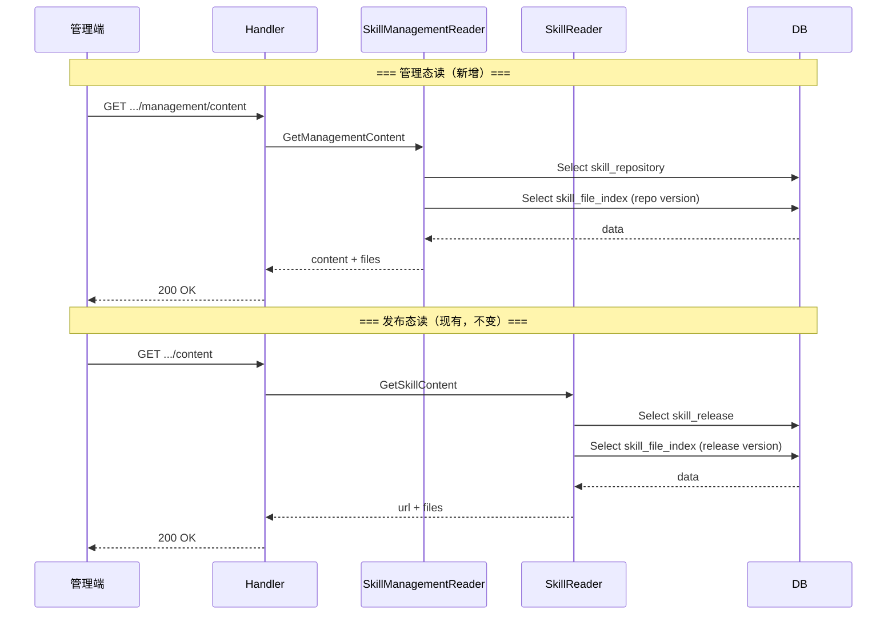
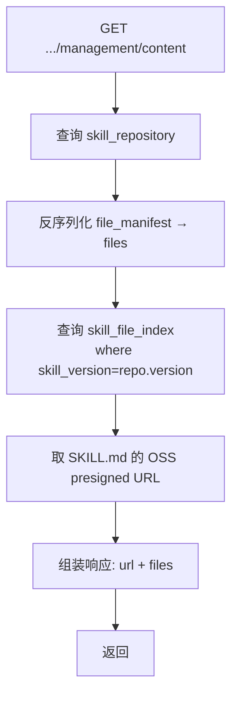
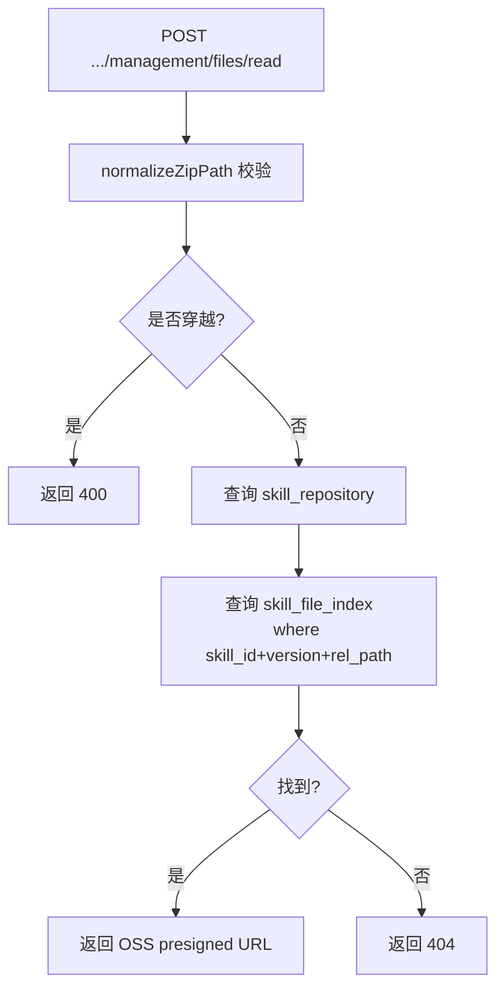

# Skill 内容管理读取 设计

## 文档信息

- Status: Draft
- Owner: @chenshu-zhao
- Last Updated: 2026-04-29

## 关联需求

- PRD: [Skill 内容管理读取 PRD](../../product/prd/skill_content_management_read.md)
- Issue: [#302 Skill 内容管理能力完善](https://github.com/kweaver-ai/kweaver-core/issues/302)

---

## 1. 概述

### 1.1 背景

执行工厂当前 Skill 的读能力集中在"已发布内容"场景：`GetSkillContent` 和 `ReadSkillFile` 读取 `skill_release` 快照，管理端无法查看正在编辑中的草稿内容。本方案新增一套**管理态读路径**，与现有发布态读路径完全解耦。

### 1.2 目标

- 新增 4 个独立管理端读接口，从 `skill_repository` 读取当前编辑态内容
- 新增 `SkillManagementReader` 独立逻辑接口，`SkillReader` 不改一行代码
- 统一 `content` 与 `zip` 注册类型的管理端读体验
- 权限、业务域隔离、删除态处理、路径安全校验全部复用现有机制
- 已有发布态接口不受任何影响

### 1.3 非目标

- 管理前端 UI 开发
- SDK/CLI 包装实现
- 历史版本差异对比
- 存量 content 注册数据的 OSS 补齐 migration（惰性补齐）

---

### 1.4 术语说明

| 术语 | 说明 |
|------|------|
| repository | `t_skill_repository`，Skill 当前编辑态主表 |
| release | `t_skill_release`，Skill 发布态快照 |
| file_index | `t_skill_file_index`，按版本管理的文件索引 |
| management path | 新增的管理态读路径前缀 `/management/` |
| file_manifest | `repository` 表中的 JSON 字段，注册时的文件摘要 |

---

## 2. 整体设计（HLD）

### 2.1 系统上下文



### 2.2 容器架构



### 2.3 组件交互

**新增管理态读路径（蓝色）与现有发布态读路径（灰色）对比：**



### 2.4 数据流

#### 管理态 SKILL.md 读取



#### 注：FR-5 + FR-6 实现后，content 注册和 zip 注册走完全一致的读路径——都从 `skill_file_index` 查询，都返回 OSS presigned URL。

#### 管理态文件读取



### 2.5 关键设计决策

| 决策 | 说明 |
|------|------|
| 独立路由而非参数复用 | 已有服务零影响，权限链可路由层分离，OpenAPI 文档无交叉 |
| 独立 Logic 接口 | `SkillReader` 不改一行，新增 `SkillManagementReader` |
| content 注册 OSS 补齐（FR-5） | content 注册时将原始 SKILL.md 写入 OSS，读路径统一走 OSS |
| OSS SKILL.md 同步重写（FR-6） | 元数据编辑时重写 OSS 中 SKILL.md 的 name/desc，确保 OSS 内容与 DB 一致 |
| 版本键取值 | 管理态始终取 `repository.version`，与 `release.version` 解耦 |
| 权限校验复用 | 管理态走 `view` / `modify` 权限，现有 `Execute` / `PublicAccess` 不变 |

---

## 3. 详细设计（LLD）

### 3.1 接口设计

#### 新增 `SkillManagementReader` 接口

**文件：** `server/interfaces/logics_skill.go`

```go
// SkillManagementReader Skill 管理态只读接口
type SkillManagementReader interface {
    // GetManagementContent 获取管理态 SKILL.md 内容
    // 从 skill_repository 读取，含 SKILL.md 下载URL（zip）或全文（content）
    GetManagementContent(ctx context.Context, req *GetManagementContentReq) (*GetManagementContentResp, error)


    // ReadManagementFile 读取管理态指定文件
    // 从 skill_file_index 以 repository.version 为版本键查询
    ReadManagementFile(ctx context.Context, req *ReadManagementFileReq) (*ReadManagementFileResp, error)

    // DownloadManagementSkill 下载管理态完整包
    // 从 skill_repository + skill_file_index 构建 ZIP
    DownloadManagementSkill(ctx context.Context, req *DownloadManagementSkillReq) (*DownloadSkillResp, error)
}
```

#### 新增 Request/Response 结构体

**文件：** `server/interfaces/logics_skill.go`

```go
// === GetManagementContent ===

type GetManagementContentReq struct {
    BusinessDomainID string `header:"x-business-domain" validate:"required"`
    UserID           string `header:"user_id"`
    SkillID          string `uri:"skill_id" validate:"required"`
    ResponseMode     string `form:"response_mode"`    // url(默认) | content
}

type GetManagementContentResp struct {
    SkillID     string              `json:"skill_id"`
    Name        string              `json:"name"`
    Description string              `json:"description"`
    Version     string              `json:"version"`
    Status      BizStatus           `json:"status"`
    Source      string              `json:"source"`
    FileType    string              `json:"file_type"`
    URL         string              `json:"url"`
    Content     string              `json:"content,omitempty"`
    Files       []*SkillFileSummary `json:"files"`
}

// === ReadManagementFile ===

type ReadManagementFileReq struct {
    BusinessDomainID string `header:"x-business-domain" validate:"required"`
    UserID           string `header:"user_id"`
    SkillID          string `uri:"skill_id" validate:"required"`
    RelPath          string `json:"rel_path" validate:"required"`
}

type ReadManagementFileResp struct {
    SkillID  string `json:"skill_id"`
    RelPath  string `json:"rel_path"`
    URL      string `json:"url"`       // 无 OSS 文件时返回空字符串
    MimeType string `json:"mime_type"`
    FileType string `json:"file_type"`
    Size     int64  `json:"size"`
}

// === DownloadManagementSkill ===

type DownloadManagementSkillReq struct {
    BusinessDomainID string `header:"x-business-domain" validate:"required"`
    UserID           string `header:"user_id"`
    SkillID          string `uri:"skill_id" validate:"required"`
}

// 复用已有 DownloadSkillResp
```

### 3.2 路由与 Handler

#### 路由注册

**文件：** `server/driveradapters/skill_handler.go`

新增路由注册代码：

```go
// 管理态读接口（新增，挂载在相同 engine group 下）
v1.GET("/skills/:skill_id/management/content", middleware(...), h.GetManagementContent)
v1.POST("/skills/:skill_id/management/files/read", middleware(...), h.ReadManagementFile)
v1.GET("/skills/:skill_id/management/download", middleware(...), h.DownloadManagementSkill)

// 同样注册到 internal-v1
internal.GET("/skills/:skill_id/management/content", h.GetManagementContent)
internal.POST("/skills/:skill_id/management/files/read", h.ReadManagementFile)
internal.GET("/skills/:skill_id/management/download", h.DownloadManagementSkill)
```

#### middleware 差异

| 接口路径 | 公共 API middleware | 内部 API middleware |
|---------|-------------------|-------------------|
| `/v1/skills/{id}/content` | `middlewareIntrospectVerify` + `middlewareBusinessDomain(checkPermission=true)` | `middlewareHeaderAuthContext` + `middlewareBusinessDomain(checkPermission=false)` |
| `/v1/skills/{id}/management/content` | `middlewareIntrospectVerify` + `middlewareBusinessDomain(checkPermission=true)` | 同上 |
| `/internal-v1/skills/{id}/management/content` | — | `middlewareHeaderAuthContext` + `middlewareBusinessDomain(checkPermission=false)` |

**注意：** 管理态路由的 middleware 链与发布态路由完全一致，区别在 handler 内权限校验的 `AuthOperationType` 不同（`view`/`modify` vs `execute`/`public_access`）。

#### Handler 结构体扩展

**文件：** `server/driveradapters/skill/skill.go` → `skill_handler.go`

```go
type skillHandler struct {
    Registry     interfaces.SkillRegistry
    Market       interfaces.SkillMarket
    Reader       interfaces.SkillReader
    MgmtReader   interfaces.SkillManagementReader  // 新增
    IndexBuilder interfaces.SkillIndexBuildService
}
```

初始化注入：

```go
// 在 NewSkillHandler 或 main.go 中
h := &skillHandler{
    Registry:     skill.NewSkillRegistry(),
    Market:       skill.NewSkillRegistry(),   // 同一实现
    Reader:       skill.NewSkillReader(),
    MgmtReader:   skill.NewSkillManagementReader(),  // 新增单例
    IndexBuilder: skill.NewSkillIndexBuildService(),
}
```

#### Handler 实现示例

**文件：** `server/driveradapters/skill/mgmt_reader.go`（新增）

```go
package skill

import (
    "net/http"

    "github.com/gin-gonic/gin"
    "github.com/go-playground/validator/v10"
    "github.com/kweaver-ai/adp/execution-factory/operator-integration/server/infra/errors"
    "github.com/kweaver-ai/adp/execution-factory/operator-integration/server/infra/rest"
    "github.com/kweaver-ai/adp/execution-factory/operator-integration/server/interfaces"
)

func (h *skillHandler) GetManagementContent(c *gin.Context) {
    req := &interfaces.GetManagementContentReq{}
    if err := c.ShouldBindHeader(req); err != nil {
        rest.ReplyError(c, errors.DefaultHTTPError(c.Request.Context(), http.StatusBadRequest, err.Error()))
        return
    }
    if err := c.ShouldBindUri(req); err != nil {
        rest.ReplyError(c, errors.DefaultHTTPError(c.Request.Context(), http.StatusBadRequest, err.Error()))
        return
    }
    if err := validator.New().Struct(req); err != nil {
        rest.ReplyError(c, err)
        return
    }
    resp, err := h.MgmtReader.GetManagementContent(c.Request.Context(), req)
    if err != nil {
        rest.ReplyError(c, err)
        return
    }
    rest.ReplyOK(c, http.StatusOK, resp)
}

func (h *skillHandler) ReadManagementFile(c *gin.Context) {
    // 类似模式，body 用 GetBindJSONRaw 绑定
}

func (h *skillHandler) DownloadManagementSkill(c *gin.Context) {
    // 类似模式，返回 ZIP 二进制
}
```

### 3.3 Logic 实现

#### SkillManagementReader 结构体

**文件：** `server/logics/skill/mgmt_reader.go`（新增）

```go
package skill

import (
    "context"
    "fmt"
    "net/http"
    "sync"

    "github.com/kweaver-ai/adp/execution-factory/operator-integration/server/dbaccess"
    "github.com/kweaver-ai/adp/execution-factory/operator-integration/server/infra/common"
    "github.com/kweaver-ai/adp/execution-factory/operator-integration/server/infra/config"
    "github.com/kweaver-ai/adp/execution-factory/operator-integration/server/infra/errors"
    "github.com/kweaver-ai/adp/execution-factory/operator-integration/server/infra/telemetry"
    "github.com/kweaver-ai/adp/execution-factory/operator-integration/server/interfaces"
    "github.com/kweaver-ai/adp/execution-factory/operator-integration/server/interfaces/model"
    "github.com/kweaver-ai/adp/execution-factory/operator-integration/server/logics/auth"
    "github.com/kweaver-ai/adp/execution-factory/operator-integration/server/logics/business_domain"
    "github.com/kweaver-ai/adp/execution-factory/operator-integration/server/utils"
    o11y "github.com/kweaver-ai/kweaver-go-lib/observability"
)

type skillManagementReader struct {
    skillRepo             model.ISkillRepository
    fileRepo              model.ISkillFileIndex
    assetStore            skillAssetStore
    AuthService           interfaces.IAuthorizationService
    BusinessDomainService interfaces.IBusinessDomainService
    Logger                interfaces.Logger
}

var (
    mgmtReaderOnce sync.Once
    mgmtReaderInst interfaces.SkillManagementReader
)

func NewSkillManagementReader() interfaces.SkillManagementReader {
    mgmtReaderOnce.Do(func() {
        conf := config.NewConfigLoader()
        mgmtReaderInst = &skillManagementReader{
            skillRepo:             dbaccess.NewSkillRepositoryDB(),
            fileRepo:              dbaccess.NewSkillFileIndexDB(),
            assetStore:            newOSSGatewaySkillAssetStore(),
            AuthService:           auth.NewAuthServiceImpl(),
            BusinessDomainService: business_domain.NewBusinessDomainService(),
            Logger:                conf.GetLogger(),
        }
    })
    return mgmtReaderInst
}
```

**关键区别与 `skillReader` 的对比：**

| 维度 | `skillReader`（现有） | `skillManagementReader`（新增） |
|------|---------------------|------------------------------|
| 依赖 releaseRepo | ✅ | ❌ |
| 数据源查询 | `getPublishedSkill()` → release | `skillRepo.SelectSkillByID()` → repository |
| 版本键 | `release.Version` | `repository.Version` |
| 权限校验（公共 API） | `execute` / `view` / `public_access` | `view` / `modify` |
| SKILL.md 来源 | OSS（必须） | OSS（FR-5 后 content 注册也有 OSS 记录） |

#### GetManagementContent 核心逻辑

```go
func (r *skillManagementReader) GetManagementContent(ctx context.Context, req *interfaces.GetManagementContentReq) (
    resp *interfaces.GetManagementContentResp, err error) {

    ctx, _ = o11y.StartInternalSpan(ctx)
    defer o11y.EndSpan(ctx, err)
    telemetry.SetSpanAttributes(ctx, map[string]interface{}{
        "skill_id": req.SkillID,
    })

    // 1. 从 skill_repository 查询
    skill, err := r.skillRepo.SelectSkillByID(ctx, nil, req.SkillID)
    if err != nil {
        return nil, err
    }
    if skill == nil || skill.IsDeleted {
        return nil, errors.DefaultHTTPError(ctx, http.StatusNotFound,
            fmt.Sprintf("skill not found: %s", req.SkillID))
    }

    // 2. 权限校验（公共 API）
    if common.IsPublicAPIFromCtx(ctx) {
        accessor, err := r.AuthService.GetAccessor(ctx, req.UserID)
        if err != nil {
            return nil, err
        }
        authorized, err := r.AuthService.OperationCheckAny(ctx, accessor, req.SkillID,
            interfaces.AuthResourceTypeSkill,
            interfaces.AuthOperationTypeView,
            interfaces.AuthOperationTypeModify)
        if err != nil {
            return nil, err
        }
        if !authorized {
            return nil, errors.NewHTTPError(ctx, http.StatusForbidden,
                errors.ErrExtCommonOperationForbidden,
                fmt.Sprintf("user has no permission to view skill %s", req.SkillID))
        }
    }

    // 3. 组装响应
    resp = &interfaces.GetManagementContentResp{
        SkillID:     skill.SkillID,
        Name:        skill.Name,
        Description: skill.Description,
        Version:     skill.Version,
        Status:      interfaces.BizStatus(skill.Status),
        Source:      skill.Source,
        FileType:    detectSkillFileType(skill),
    }

    // 3a. 反序列化文件清单
    resp.Files = utils.JSONToObject[[]*interfaces.SkillFileSummary](skill.FileManifest)
    if resp.Files == nil {
        resp.Files = []*interfaces.SkillFileSummary{}
    }

    // 3b. 统一从 skill_file_index 查询 SKILL.md 的 OSS presigned URL
    // FR-5 保证 content 注册也有 SKILL.md 的 OSS 记录
    // FR-6 保证 OSS 中 SKILL.md 的 name/desc 与 DB 一致
    skillFile, err := r.fileRepo.SelectSkillFileByPath(ctx, nil,
        skill.SkillID, skill.Version, SkillMD)
    if err != nil {
        return nil, err
    }
    if skillFile != nil {
        downloadURL, err := r.assetStore.GetDownloadURL(ctx, &interfaces.OssObject{
            StorageID:  skillFile.StorageID,
            StorageKey: skillFile.StorageKey,
        })
        if err != nil {
            return nil, err
        }
        resp.URL = downloadURL
    }

    return resp, nil
}
```

#### ReadManagementFile 核心逻辑

```go
func (r *skillManagementReader) ReadManagementFile(ctx context.Context, req *interfaces.ReadManagementFileReq) (
    resp *interfaces.ReadManagementFileResp, err error) {

    ctx, _ = o11y.StartInternalSpan(ctx)
    defer o11y.EndSpan(ctx, err)
    telemetry.SetSpanAttributes(ctx, map[string]interface{}{
        "skill_id": req.SkillID,
        "rel_path": req.RelPath,
    })

    // 1. 查询 skill_repository
    skill, err := r.skillRepo.SelectSkillByID(ctx, nil, req.SkillID)
    if err != nil {
        return nil, err
    }
    if skill == nil || skill.IsDeleted {
        return nil, errors.DefaultHTTPError(ctx, http.StatusNotFound,
            fmt.Sprintf("skill not found: %s", req.SkillID))
    }

    // 2. 权限校验（与 GetManagementContent 相同模式）

    // 3. 路径安全校验
    relPath, err := normalizeZipPath(req.RelPath)
    if err != nil {
        return nil, errors.DefaultHTTPError(ctx, http.StatusBadRequest, err.Error())
    }

    // 4. 查询 skill_file_index（FR-5 保证 content 注册也有记录，FR-6 保证 name/desc 一致）
    file, err := r.fileRepo.SelectSkillFileByPath(ctx, nil,
        req.SkillID, skill.Version, relPath)
    if err != nil {
        return nil, err
    }
    if file == nil {
        return nil, errors.DefaultHTTPError(ctx, http.StatusNotFound,
            fmt.Sprintf("file not found: %s", relPath))
    }
    downloadURL, err := r.assetStore.GetDownloadURL(ctx, &interfaces.OssObject{
        StorageID:  file.StorageID,
        StorageKey: file.StorageKey,
    })
    if err != nil {
        return nil, err
    }

    return &interfaces.ReadManagementFileResp{
        SkillID:  req.SkillID,
        RelPath:  relPath,
        URL:      downloadURL,
        MimeType: file.MimeType,
        FileType: file.FileType,
        Size:     file.Size,
    }, nil
}
```

#### DownloadManagementSkill 核心逻辑

```go
func (r *skillManagementReader) DownloadManagementSkill(ctx context.Context, req *interfaces.DownloadManagementSkillReq) (
    resp *interfaces.DownloadSkillResp, err error) {

    // 1. 查询 skill_repository（同前，略）
    // 2. 权限校验（同前，略）

    // 3. 查询当前版本的文件索引
    files, err := r.fileRepo.SelectSkillFileBySkillID(ctx, nil, req.SkillID, skill.Version)
    if err != nil {
        return nil, err
    }

    // 4. 构建 ZIP（复用 registry 的 buildSkillArchiveFromSnapshot 或类似逻辑）
    return r.buildSkillArchiveFromSnapshot(ctx, skill, files)
}
```

#### 辅助函数

```go
// detectSkillFileType 从 repository 记录推断注册类型
// 仅用于响应中的 file_type 字段标记，读路径不依赖此判断
func detectSkillFileType(skill *model.SkillRepositoryDB) string {
    manifest := utils.JSONToObject[[]*interfaces.SkillFileSummary](skill.FileManifest)
    if len(manifest) > 0 {
        return "zip"
    }
    // 无 file_manifest 但有 skill_content → content 注册
    if skill.SkillContent != "" {
        return "content"
    }
    return "content"
}
```

### 3.4 数据模型

不需要新增表或字段。现有 `skill_repository` 和 `skill_file_index` 已满足管理态读需求。

#### 读取路径说明

| 接口 | 查询的表 | 版本键来源 | 依赖关系 |
|------|---------|-----------|---------|
| `GetManagementContent` | `skill_repository` + `skill_file_index` | `repository.version` | 无 |
| `ReadManagementFile` | `skill_repository` + `skill_file_index` | `repository.version` | 无 |
| `DownloadManagementSkill` | `skill_repository` + `skill_file_index` | `repository.version` | 无 |

### 3.5 权限设计

| 场景 | 权限检查（公共 API） | 说明 |
|------|-------------------|------|
| 管理端读 content/files | `view` OR `modify` | 有查看或编辑权限即可读取管理态内容 |
| 管理端读文件 | `view` OR `modify` | 同上 |
| 管理端下载 | `view` OR `modify` | 同上 |

**内部 API：** 不走精细权限校验（现有机制，依赖 header auth context）

### 3.6 错误处理

| 错误场景 | HTTP Status | Error Code | 说明 |
|---------|-------------|-----------|------|
| Skill 不存在 | 404 | — | `is_deleted=true` 也返回 404 |
| 权限不足（公共 API） | 403 | `ErrExtCommonOperationForbidden` | 复用现有错误码 |
| 路径穿越 | 400 | — | `normalizeZipPath` 拦截 |
| OSS 记录缺失 | 500 | — | 数据不一致（FR-5 实现后 content 注册也有记录） |
| 请求参数不合法 | 400 | — | validate tag 校验 |
| FR-6 OSS 重写失败 | 仅日志 | — | 不阻塞元数据编辑主流程 |

### 3.7 content 注册的 OSS 补齐（FR-5）

#### 设计说明

**方案：** 在注册/更新 content 类型的 Skill 时，也将其原始 SKILL.md 写入 OSS 并建立 `skill_file_index` 记录。

#### 改动范围

**parser.go（`parseRegisterReq` content 分支）：**

```go
case "content":
    rawContent := string(req.File)  // 原始请求的完整 SKILL.md（含 frontmatter）
    // ... 解析 frontmatter ...（保持现有解析逻辑不变）

    // 新增：为 SKILL.md 生成 asset 和 file_summary
    assets = append(assets, &skillAsset{
        RelPath:  SkillMD,
        FileType: detectFileType(SkillMD),
        MimeType: detectMimeType(SkillMD),
        Content:  []byte(rawContent),  // 写入 OSS 时用原始完整内容
    })
    files = append(files, &interfaces.SkillFileSummary{
        RelPath:  SkillMD,
        FileType: detectFileType(SkillMD),
        Size:     int64(len(rawContent)),
        MimeType: detectMimeType(SkillMD),
    })
```

**registry.go（`RegisterSkill` / `UpdateSkillPackage`）：**

content 分支也会通过 `persistSkillAssets` 写入 OSS 和 `skill_file_index`，不再需要单独区分处理。

**效果：**

```
改造前:  skill_repository.skill_content = "body text"           (仅 DB)
          skill_repository.file_manifest = null                  (空)
          skill_file_index = []                                  (无记录)
          OSS = {}                                               (无文件)

改造后:  skill_repository.skill_content = "body text"           (DB，不变)
          skill_repository.file_manifest = [...]                 (含 SKILL.md 摘要)
          skill_file_index = [{rel_path: SKILL.md, ...}]         (有 OSS 记录)
          OSS = { SKILL.md: <原始完整内容> }                      (有文件)
```

所有读路径（包括现有的发布态 `GetSkillContent`）对 content 注册的 Skill 都能正常工作。

#### 存量处理

- 新注册 content：注册时自动写入 OSS ✅
- 存量 content：惰性补齐。`GetManagementContent` 检测到 `file_manifest` 为空但 `skill_content` 非空时，将 SKILL.md 写入 OSS 并建立 file_index 记录

---

### 3.8 元数据编辑时 OSS SKILL.md 同步重写（FR-6）

#### 设计说明

**方案：** `UpdateSkillMetadata` 成功提交事务后，同步或异步重写 OSS 中当前版本 SKILL.md 的 frontmatter，将其中的 `name` 和 `description` 更新为 DB 中的最新值，其余自定义 YAML 字段保持不动。

#### 改动范围

**registry.go（`UpdateSkillMetadata`）：**

在事务提交成功后，新增 OSS 重写步骤：

```go
func (r *skillRegistry) UpdateSkillMetadata(ctx context.Context, req *interfaces.UpdateSkillMetadataReq) (
    resp *interfaces.UpdateSkillMetadataResp, err error) {

    // ... 现有逻辑：校验、更新 DB、提交事务 ...

    // 新增：事务提交成功后，异步重写 OSS SKILL.md 的 frontmatter
    if err == nil {
        if rewriteErr := r.rewriteSkillMDFrontmatter(ctx, skill.SkillID, skill.Version,
            req.Name, req.Description); rewriteErr != nil {
            // 只记录日志，不阻塞主流程返回
            r.Logger.WithContext(ctx).Errorf("rewrite SKILL.md frontmatter failed, skill_id=%s, err=%v",
                skill.SkillID, rewriteErr)
        }
    }

    return &interfaces.UpdateSkillMetadataResp{...}, nil
}

// rewriteSkillMDFrontmatter 重写 OSS 中 SKILL.md 的 name/description
func (r *skillRegistry) rewriteSkillMDFrontmatter(ctx context.Context, skillID, version, newName, newDesc string) error {
    // 1. 查询 file_index 获取 SKILL.md 的 OSS 定位信息
    skillFile, err := r.fileRepo.SelectSkillFileByPath(ctx, nil, skillID, version, SkillMD)
    if err != nil {
        return err
    }
    if skillFile == nil {
        return fmt.Errorf("SKILL.md not found in file_index: skill_id=%s, version=%s", skillID, version)
    }

    // 2. 从 OSS 下载原始 SKILL.md
    content, err := r.assetStore.Download(ctx, &interfaces.OssObject{
        StorageID:  skillFile.StorageID,
        StorageKey: skillFile.StorageKey,
    })
    if err != nil {
        return err
    }

    // 3. 解析并重写 frontmatter
    newContent, err := updateFrontmatterNameDesc(string(content), newName, newDesc)
    if err != nil {
        return err
    }

    // 4. 重新上传到同一路径（覆盖）
    _, _, err = r.assetStore.Upload(ctx, skillID, version, SkillMD, []byte(newContent))
    return err
}
```

**OOS SKILL.md frontmatter 重写函数：**

```go
// updateFrontmatterNameDesc 只替换 YAML frontmatter 中的 name 和 description
// 其余所有自定义字段保持不动
func updateFrontmatterNameDesc(rawMD, newName, newDesc string) (string, error) {
    parts := strings.SplitN(rawMD, "---", 3)
    if len(parts) < 3 {
        return "", fmt.Errorf("invalid SKILL.md format: missing frontmatter")
    }

    frontmatter := make(map[string]interface{})
    if err := yaml.Unmarshal([]byte(parts[1]), &frontmatter); err != nil {
        return "", fmt.Errorf("failed to unmarshal frontmatter: %w", err)
    }

    // 只替换 name 和 description
    if newName != "" {
        frontmatter["name"] = newName
    }
    if newDesc != "" {
        frontmatter["description"] = newDesc
    }

    newFrontmatter, err := yaml.Marshal(frontmatter)
    if err != nil {
        return "", fmt.Errorf("failed to marshal frontmatter: %w", err)
    }

    // 重建完整的 SKILL.md：frontmatter + body
    return "---\n" + string(newFrontmatter) + "---\n" + strings.TrimPrefix(parts[2], "\n"), nil
}
```

#### 注意事项

| 场景 | 行为 |
|------|------|
| SKILL.md 在 OSS 中不存在 | 记录日志，跳过重写 |
| YAML frontmatter 格式不合法 | 记录日志，跳过重写 |
| OSS 写入失败 | 记录日志，不影响元数据编辑结果 |
| `name/description` 在 frontmatter 中原本不存在 | 新增这两个字段 |
| frontmatter 中的自定义字段 | 全部保留，不删除不改动 |

#### 与 `UpdateSkillPackage` 的关系

`UpdateSkillPackage` 不需要做 OSS 重写，因为用户上传了新的完整 SKILL.md，其中的 name/desc 就是用户期望的值，不存在不一致问题。

### 3.8 OpenAPI 文档

#### 公共 API 文档

**文件：** `docs/apis/api_public/skill.yaml`

新增 path 条目：

```yaml
/skills/{skill_id}/management/content:
  get:
    summary: 获取 Skill 管理态内容
    description: 读取当前编辑态的 SKILL.md 内容（含文件清单）
    tags: [Skill - Management Read]
    parameters:
      - $ref: '#/components/parameters/X-Business-Domain'
      - $ref: '#/components/parameters/Authorization'
      - $ref: '#/components/parameters/SkillID'
    responses:
      '200':
        description: OK
        content:
          application/json:
            schema:
              $ref: '#/components/schemas/GetManagementContentResponse'
      '404':
        description: Skill not found
      '403':
        description: Forbidden

/skills/{skill_id}/management/files:
  get:
    summary: 获取管理态文件清单
    # ... 类似模式 ...

/skills/{skill_id}/management/files/read:
  post:
    summary: 读取管理态指定文件
    # ... 类似模式 ...

/skills/{skill_id}/management/download:
  get:
    summary: 下载管理态 Skill 包
    # ... 类似模式 ...
```

Schema 定义：

```yaml
components:
  schemas:
    GetManagementContentResponse:
      type: object
      properties:
        skill_id:
          type: string
        name:
          type: string
        description:
          type: string
        version:
          type: string
        status:
          type: string
        source:
          type: string
        file_type:
          type: string
          enum: [zip, content]
        url:
          type: string
          nullable: true
          description: SKILL.md 预签名下载 URL（zip 注册），null 表示 content 注册
        content:
          type: string
          nullable: true
          description: 完整 SKILL.md 文本（content 注册），null 表示 zip 注册
        files:
          type: array
          items:
            $ref: '#/components/schemas/SkillFileSummary'
```

**私有 API 文档**同样更新。

---

## 4. 文件变更清单

| 文件 | 操作 | 说明 |
|------|------|------|
| `server/interfaces/logics_skill.go` | 修改 | 新增 `SkillManagementReader` 接口及 Request/Response 结构体 |
| `server/interfaces/model/skill.go` | 不改 | 无需新增模型 |
| `server/driveradapters/skill_handler.go` | 修改 | 新增 4 条管理态路由注册 |
| `server/driveradapters/skill/skill.go` | 修改 | 扩展 `skillHandler` 结构体，增加 `MgmtReader` 字段 |
| `server/driveradapters/skill/mgmt_reader.go` | **新增** | 4 个 handler 方法 |
| `server/logics/skill/mgmt_reader.go` | **新增** | `skillManagementReader` 完整实现 |
| `server/logics/skill/parser.go` | 修改 | `parseRegisterReq` content 分支补齐 OSS 写入（FR-5） |
| `server/dbaccess/skill_repository.go` | 不改 | 已有 `SelectSkillByID` 满足需求 |
| `server/dbaccess/skill_file_index.go` | 不改 | 已有 `SelectSkillFileByPath` 满足需求 |
| `docs/apis/api_public/skill.yaml` | 修改 | 新增 4 个 management API 端点 + schema |
| `docs/apis/api_private/skill.yaml` | 修改 | 新增 4 个 management API 端点 |

---

## 5. 测试策略

### 5.1 单元测试

| 测试用例 | 覆盖目标 |
|---------|---------|
| `GetManagementContent` zip 注册 | 返回正确的 SKILL.md URL 和文件清单 |
| `GetManagementContent` content 注册 | 返回重构的完整 SKILL.md 和空文件清单 |
| `GetManagementContent` 已删除 Skill | 返回 404 |
| `ReadManagementFile` zip 注册有效路径 | 返回 OSS presigned URL |
| `ReadManagementFile` content 注册 SKILL.md | 返回重构内容 |
| `ReadManagementFile` content 注册非 SKILL.md | 返回 404 |
| `ReadManagementFile` 路径穿越 | `normalizeZipPath` 拦截返回 400 |
| `reconstructSkillMD` | 从 DB 字段正确重构完整 YAML frontmatter + body |
| `detectSkillFileType` | 正确推断 zip / content |

### 5.2 集成测试

| 测试场景 | 验证点 |
|---------|--------|
| 管理态读 vs 发布态读隔离 | 同时读同一 Skill，管理态返回编辑内容，发布态返回 release 内容 |
| content 注册的 Skill 发布后管理态读取 | 管理态始终可读，不依赖 release |
| 权限隔离 | 只有 view/modify 权限的用户可读管理态，只有 execute 权限的用户只能读发布态 |

### 5.3 回归测试

| 回归点 | 验证 |
|--------|------|
| 现有 `GetSkillContent` | 响应体与之前完全一致 |
| 现有 `ReadSkillFile` | 响应体与之前完全一致 |
| 现有 `DownloadSkill` | 构建的 ZIP 内容与之前一致 |
| 现有 `GetSkillReleaseHistory` | 不变 |

---

## 6. 风险与权衡

| 风险 | 影响 | 缓解措施 |
|------|------|---------|
| `reconstructSkillMD` 与原始 SKILL.md 格式不一致 | 管理端看到的内容与注册时提交的不同 | 验证 content 注册时保留原始内容；重构函数覆盖所有字段 |
| content 注册 OSS 补齐（FR-5）后，存量 content Skill 无 OSS 记录 | 管理读时 zip 分支走不通 | 惰性补齐：检测 OSS 无记录时回退到重构路径 |
| `detectSkillFileType` 推断不准确（如 zip 注册但 file_manifest 为空） | 错误地按 content 类型处理 | 增加 `skill_file_index` 存在性兜底检查 |
| 路径增加 `/management/` 前缀后在网关/权限服务中未同步 | 请求被网关拦截 | 提前与管理端网关对齐路由白名单 |

### 替代方案

**不做 FR-5（content OSS 补齐）：**
- 管理端 reader 需要永久保留 content/zif 两个分支
- `GetManagementContent` 和 `ReadManagementFile` 中 content 分支逻辑均需单独处理
- 代码复杂度增加但架构灵活性更高
- **权衡：** 推荐做 FR-5，读路径统一带来的长期维护收益大于短期改动成本

## 7. 附录

### 相关文件

- PRD: `../../product/prd/skill_content_management_read.md`
- 现有 Reader: `server/logics/skill/reader.go`
- 现有 Registry: `server/logics/skill/registry.go`
- 现有 Parser: `server/logics/skill/parser.go`
- 现有 Handler: `server/driveradapters/skill/skill.go`
- 路由注册: `server/driveradapters/skill_handler.go`
- 公共 API 文档: `docs/apis/api_public/skill.yaml`
- 私有 API 文档: `docs/apis/api_private/skill.yaml`
