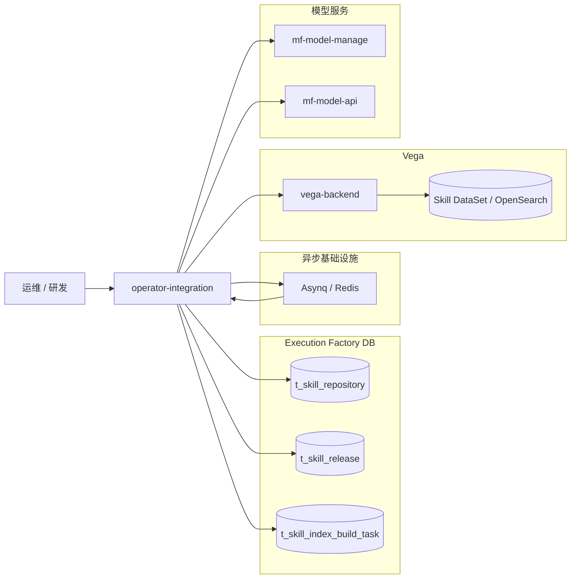
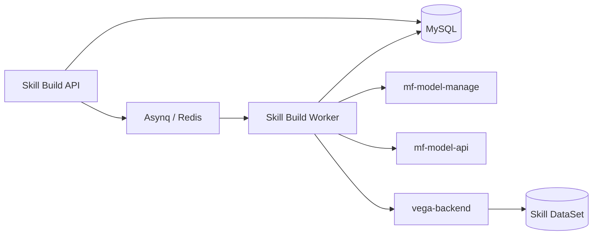
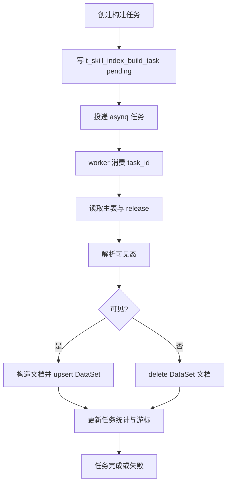
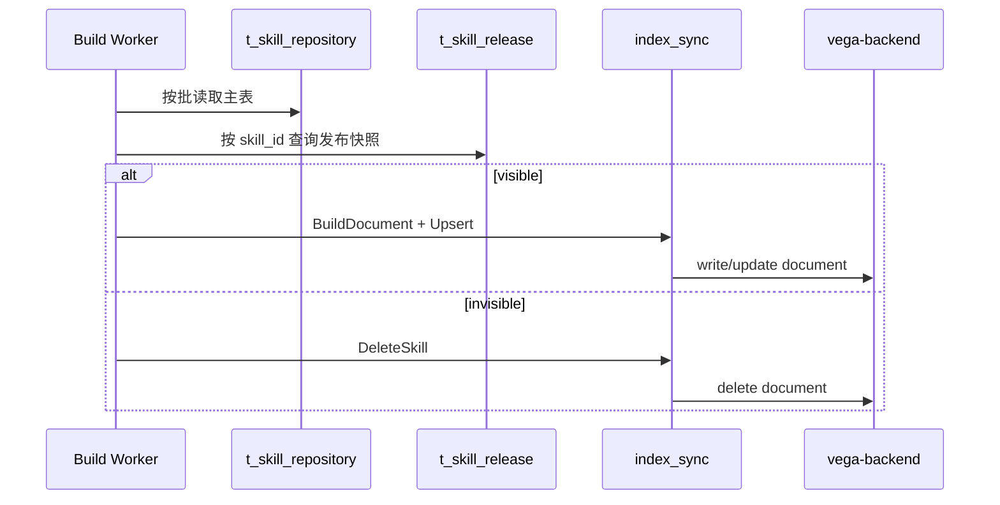

# 🏗️ Design Doc: Skill DataSet 重建与增量构建

> 状态: In Review  
> 负责人: 待确认  
> Reviewers: 待确认  
> 关联 PRD: ../../product/prd/skill_dataset_rebuild_and_incremental_build.md  

---

# 📌 1. 概述（Overview）

## 1.1 背景

- 当前现状：
  - `operator-integration` 已支持 Skill 在线双写 Vega Skill DataSet。
  - Skill DataSet 当前由 `vega-backend` 承载，底层索引存储为 OpenSearch。
  - Skill 发布态快照保存在 `t_skill_release`，当前主表保存在 `t_skill_repository`。

- 存在问题：
  - 在线双写失败后没有统一的离线补偿能力。
  - 历史存量 Skill 无法一次性回灌到 Skill DataSet。
  - 下架漏删场景下，仅依赖 `t_skill_release` 无法识别应删除的 Skill。
  - `editing` 场景如果直接按主表状态删除，会误删仍有发布快照的 Skill 文档。

- 业务 / 技术背景：
  - 本需求需要提供可落地的 Skill DataSet `full` / `incremental` 构建能力。
  - 离线构建必须以 `t_skill_repository` 为扫描源，并结合 `t_skill_release` 做可见态判定。
  - 任务状态必须落到 `t_skill_index_build_task`，Redis 不作为任务真相源。

---

## 1.2 目标

- 新增 Skill DataSet `full` 和 `incremental` 构建任务能力。
- 新增 `t_skill_index_build_task` 任务表，持久化任务状态、游标和统计信息。
- 确保 `editing + release存在` 时使用发布快照构建，不误删 DataSet 文档。
- 确保 `offline/unpublish/is_deleted=true` 场景可通过离线构建补删 DataSet 文档。
- 复用现有 `index_sync` 中的 DataSet 初始化、向量生成和文档写入能力。

---

## 1.3 非目标（Out of Scope）

- 不替代现有在线双写逻辑。
- 不复用或改造 Vega 通用 DataSet build task。
- 不提供任务暂停接口。
- 不新增 Skill DataSet 多版本索引能力。
- 不实现前台页面，仅提供内部 API。

---

## 1.4 术语说明（Optional）

| 术语 | 说明 |
|------|------|
| Skill DataSet | Skill 在 Vega/OpenSearch 中的统一检索索引 |
| Full 构建 | 全量扫描 `t_skill_repository` 并逐条对齐 DataSet |
| Incremental 构建 | 基于 `(f_update_time, f_skill_id)` 游标扫描增量变更 |
| 发布快照 | `t_skill_release` 中的当前对外可见 Skill 版本 |
| 任务表 | `t_skill_index_build_task`，用于持久化离线构建任务状态 |

---

# 🏗️ 2. 整体设计（HLD）

> 本章节关注系统“怎么搭建”，不涉及具体实现细节

---

## 🌍 2.1 系统上下文（C4 - Level 1）

### 参与者
- 用户：运维人员、执行工厂研发
- 外部系统：无
- 第三方服务：无

### 系统关系



---

## 🧱 2.2 容器架构（C4 - Level 2）

| 容器 | 技术栈 | 职责 |
|------|--------|------|
| Skill Build API | Go + Gin | 创建任务、列表查询、详情查询、取消任务、重试任务 |
| Skill Build Worker | Go + Asynq | 执行 full/incremental 构建逻辑 |
| Skill Registry DB | MySQL | 存储主表、发布快照、构建任务 |
| Vega Backend | Go | 写入、更新、删除 Skill DataSet 文档 |
| Model Services | Go/Python | 提供 embedding 维度和向量生成能力 |
| Redis/Asynq | Redis | 异步任务队列与 worker 调度 |

---

### 容器交互



---

## 🧩 2.3 组件设计（C4 - Level 3）

### Skill Build 组件

| 组件 | 职责 |
|------|------|
| Build Handler | 解析 header、uri、json，调用 service |
| Build Service | 创建任务、查询任务、取消任务、重试任务、校验并发互斥 |
| Build Worker | 执行离线构建任务，并将 Asynq 重试信息回写任务表 |
| Visible Resolver | 解析主表状态和 release 快照，计算可见态 |
| Document Builder | 根据 repository/release 构造 DataSet 文档 |
| Index Sync | 调用 vega 与模型服务，执行 upsert / delete |
| BuildTask Repo | 维护 `t_skill_index_build_task` |
| Asynq Inspector | 查询队列状态，支持取消和删除队列任务 |

---

## 🔄 2.4 数据流（Data Flow）

### 主流程



### 子流程（可选）



---

## ⚖️ 2.5 关键设计决策（Design Decisions）

| 决策 | 说明 |
|------|------|
| 扫描源使用 `t_skill_repository` | 能覆盖下架漏删和主表变更场景 |
| `editing` 必须查 `t_skill_release` | 避免误删仍有发布快照的 Skill 文档 |
| 任务状态落 MySQL 任务表 | 需要可查询、可审计、可恢复的任务实体 |
| Redis 不作为任务真相源 | Redis-only 无法表达完整任务生命周期 |
| `full` 采用逐条 reconcile | 避免先清空再回灌带来的检索空窗 |
| 增量游标使用 `(f_update_time, f_skill_id)` | 保证稳定排序与断点续跑 |
| 复用现有 `index_sync` | 避免重复实现 embedding 和 Vega 写入逻辑 |

---

## 🚀 2.6 部署架构（Deployment）

- 部署环境：K8s
- 拓扑结构：`operator-integration` API 与 worker 运行在同一服务镜像中，通过 Asynq/Redis 解耦任务执行
- 扩展策略：API 水平扩展；worker 逻辑通过单任务互斥避免并发构建冲突

---

## 🔐 2.7 非功能设计

### 性能
- 单批处理数量固定为 `200`
- 增量扫描通过主表排序字段和游标实现稳定断点续跑
- 单条失败不阻断整批任务

### 可用性
- 任务状态持久化到 MySQL
- 在线双写与离线构建解耦

### 安全
- 权限模型：沿用内部接口现有 `x-business-domain` 和 `user_id` 校验机制
- 数据保护：不新增敏感字段；沿用现有 Skill 索引字段

### 可观测性
- tracing：支持
- logging：支持
- metrics：支持

---

# 🔧 3. 详细设计（LLD）

> 本章节关注“如何实现”，开发可直接参考

---

## 🌐 3.1 API 设计

### 创建 Skill DataSet 构建任务

**Endpoint:** `POST /api/agent-operator-integration/internal-v1/skills/index/build`

**Headers:**

- `x-business-domain`: required
- `user_id`: optional
- `x-account-id`: optional
- `x-account-type`: optional

**Request:**

```json
{
  "execute_type": "full"
}
```

**Response:**

```json
{
  "task_id": "skill-index-build-xxx",
  "status": "pending",
  "execute_type": "full"
}
```

**HTTP Status:**

- `200`: success
- `400`: invalid header or body
- `409`: running task exists
- `500`: internal error

---

### 查询 Skill DataSet 构建任务列表

**Endpoint:** `GET /api/agent-operator-integration/internal-v1/skills/index/build`

**Headers:**

- `x-business-domain`: required
- `user_id`: optional

**Query:**

- `page`
- `page_size`
- `all`
- `sort_by`: `create_time` / `update_time` / `name`
- `sort_order`: `asc` / `desc`
- `status`: `pending` / `running` / `completed` / `failed`
- `execute_type`: `full` / `incremental`
- `create_user`

**Response:**

```json
{
  "total": 2,
  "page": 1,
  "page_size": 10,
  "total_pages": 1,
  "has_next": false,
  "has_prev": false,
  "data": [
    {
      "task_id": "task-1",
      "status": "pending",
      "execute_type": "full",
      "queue_state": "pending",
      "retry_count": 0,
      "max_retry": 10
    }
  ]
}
```

**HTTP Status:**

- `200`: success
- `400`: invalid header or query
- `500`: internal error

---

### 查询 Skill DataSet 构建任务详情

**Endpoint:** `GET /api/agent-operator-integration/internal-v1/skills/index/build/{task_id}`

**Headers:**

- `x-business-domain`: required
- `user_id`: required

**Response:**

```json
{
  "task_id": "skill-index-build-xxx",
  "status": "running",
  "execute_type": "incremental",
  "queue_state": "active",
  "total_count": 120,
  "success_count": 100,
  "delete_count": 18,
  "failed_count": 2,
  "retry_count": 1,
  "max_retry": 10,
  "cursor_update_time": 1760000000000000000,
  "cursor_skill_id": "skill-123",
  "error_msg": "",
  "create_time": 1760000000000000000,
  "update_time": 1760000001000000000,
  "last_finished_time": 0
}
```

**HTTP Status:**

- `200`: success
- `400`: invalid header or path param
- `404`: task not found
- `500`: internal error

---

### 取消 Skill DataSet 构建任务

**Endpoint:** `POST /api/agent-operator-integration/internal-v1/skills/index/build/{task_id}/cancel`

**Headers:**

- `x-business-domain`: required
- `user_id`: required

**Response:**

```json
{
  "task_id": "skill-index-build-xxx",
  "action": "delete_queue_task",
  "queue_state": "pending"
}
```

**HTTP Status:**

- `200`: success
- `400`: invalid header or path param
- `404`: task not found
- `409`: task is not cancellable
- `500`: internal error

---

### 重试 Skill DataSet 构建任务

**Endpoint:** `POST /api/agent-operator-integration/internal-v1/skills/index/build/{task_id}/retry`

**Headers:**

- `x-business-domain`: required
- `user_id`: required

**Response:**

```json
{
  "source_task_id": "skill-index-build-xxx",
  "task_id": "skill-index-build-new",
  "status": "pending",
  "execute_type": "incremental"
}
```

**HTTP Status:**

- `200`: success
- `400`: invalid header or path param
- `404`: task not found
- `409`: only failed task can be retried
- `500`: internal error

---

## 🗂️ 3.2 数据模型

### CreateSkillIndexBuildTaskReq

| 字段 | 类型 | 说明 |
|------|------|------|
| `business_domain_id` | string | 来源于 `x-business-domain` |
| `user_id` | string | 来源于 `user_id` |
| `execute_type` | string | `full` 或 `incremental` |

### GetSkillIndexBuildTaskReq

| 字段 | 类型 | 说明 |
|------|------|------|
| `business_domain_id` | string | 来源于 `x-business-domain` |
| `user_id` | string | 来源于 `user_id` |
| `task_id` | string | 路径参数 |

### QuerySkillIndexBuildTaskListReq

| 字段 | 类型 | 说明 |
|------|------|------|
| `business_domain_id` | string | 来源于 `x-business-domain` |
| `user_id` | string | 来源于 `user_id` |
| `status` | string | 可选，`pending/running/completed/failed` |
| `execute_type` | string | 可选，`full/incremental` |
| `create_user` | string | 可选 |
| `page` | int | 页码 |
| `page_size` | int | 每页数量 |
| `all` | bool | 是否全量返回 |
| `sort_by` | string | `create_time/update_time/name` |
| `sort_order` | string | `asc/desc` |

### CancelSkillIndexBuildTaskReq / RetrySkillIndexBuildTaskReq

| 字段 | 类型 | 说明 |
|------|------|------|
| `business_domain_id` | string | 来源于 `x-business-domain` |
| `user_id` | string | 来源于 `user_id` |
| `task_id` | string | 路径参数 |

### SkillIndexBuildTaskDB

| 字段 | 类型 | 说明 |
|------|------|------|
| `f_id` | bigint | 自增主键 |
| `f_task_id` | varchar(64) | 任务 ID |
| `f_status` | varchar(32) | `pending/running/completed/failed` |
| `f_execute_type` | varchar(32) | `full/incremental` |
| `f_total_count` | bigint | 已扫描总数 |
| `f_success_count` | bigint | upsert 成功数 |
| `f_delete_count` | bigint | delete 成功数 |
| `f_failed_count` | bigint | 失败数 |
| `f_retry_count` | bigint | 当前 Asynq 重试次数 |
| `f_max_retry` | bigint | Asynq 最大重试次数 |
| `f_cursor_update_time` | bigint | 当前游标时间 |
| `f_cursor_skill_id` | varchar(64) | 当前游标 skill_id |
| `f_error_msg` | text | 任务错误信息 |
| `f_create_user` | varchar(64) | 触发用户 |
| `f_create_time` | bigint | 创建时间 |
| `f_update_time` | bigint | 更新时间 |
| `f_last_finished_time` | bigint | 最近一次结束时间 |

### SkillIndexBuildTaskMessage

| 字段 | 类型 | 说明 |
|------|------|------|
| `task_id` | string | Asynq payload 中唯一字段 |
| `business_domain_id` | string | 从上下文透传的业务域 |
| `account_id` | string | 从上下文透传的账号 ID |
| `account_type` | string | 从上下文透传的账号类型 |

---

## 💾 3.3 存储设计

- 存储类型：MySQL + OpenSearch + Redis
- 数据分布：
  - `t_skill_repository`：Skill 主表
  - `t_skill_release`：发布态快照
  - `t_skill_index_build_task`：离线构建任务
  - Skill DataSet：OpenSearch 中的 Vega DataSet
- 索引设计：
  - `t_skill_index_build_task`：
    - `uk_task_id(f_task_id)`
    - `idx_status_create_time(f_status, f_create_time)`
    - `idx_exec_status_finish_time(f_execute_type, f_status, f_last_finished_time)`

任务表 DDL：

```sql
CREATE TABLE `t_skill_index_build_task` (
  `f_id` bigint NOT NULL AUTO_INCREMENT,
  `f_task_id` varchar(64) NOT NULL,
  `f_status` varchar(32) NOT NULL,
  `f_execute_type` varchar(32) NOT NULL,
  `f_total_count` bigint NOT NULL DEFAULT 0,
  `f_success_count` bigint NOT NULL DEFAULT 0,
  `f_delete_count` bigint NOT NULL DEFAULT 0,
  `f_failed_count` bigint NOT NULL DEFAULT 0,
  `f_retry_count` bigint NOT NULL DEFAULT 0,
  `f_max_retry` bigint NOT NULL DEFAULT 0,
  `f_cursor_update_time` bigint NOT NULL DEFAULT 0,
  `f_cursor_skill_id` varchar(64) NOT NULL DEFAULT '',
  `f_error_msg` text,
  `f_create_user` varchar(64) NOT NULL DEFAULT '',
  `f_create_time` bigint NOT NULL,
  `f_update_time` bigint NOT NULL,
  `f_last_finished_time` bigint NOT NULL DEFAULT 0,
  PRIMARY KEY (`f_id`),
  UNIQUE KEY `uk_task_id` (`f_task_id`),
  KEY `idx_status_create_time` (`f_status`, `f_create_time`),
  KEY `idx_exec_status_finish_time` (`f_execute_type`, `f_status`, `f_last_finished_time`)
) ENGINE=InnoDB DEFAULT CHARSET=utf8mb4;
```

---

## 🔁 3.4 核心流程（详细）

### 创建构建任务流程

1. Handler 绑定 header 和 json。
2. Service 通过 Redis 锁保护“查运行中任务 + 插入任务”临界区。
3. Service 校验 `execute_type`。
4. 查询是否已有 `pending/running` 任务。
5. 创建 `t_skill_index_build_task`，状态为 `pending`。
6. 投递 `SkillIndexBuildTaskMessage{task_id, business_domain_id, account_id, account_type}` 到 Asynq。
7. Asynq 使用 `task_id` 作为唯一任务 ID 入队。
8. 返回 `task_id`。

### 列表与详情查询流程

1. Handler 绑定 header、query 或 path。
2. Service 读取 `t_skill_index_build_task`。
3. 若需要返回 `queue_state`，通过 Asynq Inspector 查询对应任务状态。
4. Service 组装分页结果或详情结果返回。

### 取消任务流程

1. Handler 绑定 header 和 `task_id`。
2. Service 查询任务表和 Asynq 任务状态。
3. 若状态为 `active`，调用 `CancelProcessing(task_id)`。
4. 若状态为 `pending/scheduled/retry/archived`，调用 `DeleteTask(queue, task_id)`。
5. 对于从队列删除的任务，将任务表状态更新为 `failed`，并记录取消原因。

### 重试任务流程

1. Handler 绑定 header 和 `task_id`。
2. Service 查询原任务。
3. 校验原任务状态必须为 `failed`。
4. 复用原任务的 `execute_type` 创建新任务。
5. 返回 `source_task_id` 和新的 `task_id`。

### Full 构建流程

1. Worker 根据 `task_id` 读取任务并改为 `running`。
2. 调用 `EnsureInitialized` 确保 Skill DataSet 已存在。
3. 按 `ORDER BY f_update_time ASC, f_skill_id ASC` 分页扫描全量 `t_skill_repository`。
4. 对每条 Skill 查询 `t_skill_release`。
5. 执行可见态解析。
6. 可见则构建文档并 `upsert`，不可见则 `delete`。
7. 每批结束更新统计和游标。
8. 扫描完成后更新任务为 `completed`。

### Incremental 构建流程

1. Worker 根据 `task_id` 读取任务并改为 `running`。
2. 查询最近一次 `completed` 且 `execute_type=incremental` 的任务作为起始游标。
3. 按 `(f_update_time, f_skill_id)` 过滤条件扫描 `t_skill_repository`。
4. 对每条 Skill 查询 `t_skill_release`。
5. 执行可见态解析。
6. 可见则 `upsert`，不可见则 `delete`。
7. 每批结束更新统计和游标。
8. 扫描完成后更新任务为 `completed`。

---

## 🧠 3.5 关键逻辑设计

### 可见态解析逻辑
- 若 `is_deleted=true`，直接不可见。
- 若 `status=offline` 或 `status=unpublish`，直接不可见。
- 若 `status=editing`：
  - release 存在：可见，内容来源为 release。
  - release 不存在：不可见。
- 若 `status=published`：
  - release 存在：可见，内容来源为 release。
  - release 不存在：可见，内容来源为 repository 兜底。

### 增量游标逻辑
- 主游标：`f_update_time`
- 次游标：`f_skill_id`
- 增量条件：
  - `f_update_time > cursor_update_time`
  - 或 `f_update_time = cursor_update_time AND f_skill_id > cursor_skill_id`

### 文档构建逻辑
- `_id = skill_id`
- 若来源为 release，则使用 release 的名称、描述、版本等字段
- 若来源为 repository，则使用主表字段
- embedding 输入统一由最终写入的 `name + description` 生成

### 任务推进逻辑
- `pending -> running`
- `running -> completed`
- `running -> failed`
- `pending/running -> failed`（取消或入队失败）
- 已结束任务不复用，重试通过创建新任务实现

---

## ❗ 3.6 错误处理

- 参数校验失败：返回 `400`
- 运行中任务冲突：返回 `409`
- 任务不存在：返回 `404`
- release 查询失败：当前 Skill 记失败，不执行 delete
- embedding 调用失败：当前 Skill 记失败
- vega 写入失败：当前 Skill 记失败
- 批次级异常：任务置为 `failed`，写入 `error_msg`

---

## ⚙️ 3.7 配置设计

| 配置项 | 默认值 | 说明 |
|--------|--------|------|
| `skill_index_build_batch_size` | `200` | 构建任务单批处理数量 |
| `skill_index_build_queue_name` | `skill_index_build` | Asynq 队列名 |
| `skill_index_build_task_type` | `skill:index:build` | Asynq task type |

---

## 📊 3.8 可观测性实现

- tracing：
  - 在创建任务、worker 执行、单批扫描、单条写入/删除处打点
  - span 包含 `task_id`、`execute_type`、`skill_id`

- metrics：
  - `skill_index_build_task_created_total`
  - `skill_index_build_task_completed_total`
  - `skill_index_build_task_failed_total`
  - `skill_index_build_record_upsert_total`
  - `skill_index_build_record_delete_total`
  - `skill_index_build_record_failed_total`

- logging：
  - 结构化日志字段包含：
    - `task_id`
    - `execute_type`
    - `skill_id`
    - `repository_status`
    - `visible_source`
    - `cursor_update_time`
    - `cursor_skill_id`

---

# ⚠️ 4. 风险与权衡（Risks & Trade-offs）

| 风险 | 影响 | 解决方案 |
|------|------|----------|
| `t_skill_release` 查询异常 | `editing` 场景误判风险 | 查询失败记单条失败，不按无 release delete |
| `mf-model-api` 抖动 | 单条 upsert 失败 | 记录失败数，支持后续增量补偿 |
| `vega-backend` 抖动 | DataSet 写入或删除失败 | 记录失败数，任务可重试 |
| 全量任务耗时长 | 对排障时效有影响 | 采用任务化、分批执行、任务状态可查询 |
| Redis-only 无法承载任务语义 | 无法审计与排障 | 采用 `t_skill_index_build_task` 作为真相源 |

---

# 🧪 5. 测试策略（Testing Strategy）

- 单元测试：
  - 可见态解析
  - 增量游标过滤
  - 任务状态推进
  - 文档构建来源切换

- 集成测试：
  - 创建 `full` 任务
  - 创建 `incremental` 任务
  - 冲突任务返回 `409`
  - 查询任务返回完整字段
  - worker 扫描主表并调用 `index_sync`

- 压测：
  - 验证 `batch_size=200` 下批次处理耗时
  - 验证长任务执行过程中任务状态持续更新

---

# 📅 6. 发布与回滚（Release Plan）

### 发布步骤
1. 执行数据库变更，创建 `t_skill_index_build_task`
2. 发布 `operator-integration` 新版本
3. 验证内部接口可创建和查询任务
4. 触发一次测试环境 `full` 构建
5. 验证任务状态、DataSet 变更和日志指标

### 回滚方案
- 若接口或 worker 异常，回滚 `operator-integration` 版本
- 保留任务表不删，不影响旧逻辑
- 由于在线双写链路未替换，回滚不会影响已有在线同步能力

---

# 🔗 7. 附录（Appendix）

## 相关文档
- PRD: ../../product/prd/skill_dataset_rebuild_and_incremental_build.md
- 其他设计: ../../design/features/skill_write_vega_dataset.md

## 参考资料
- issue: `kweaver-core#187`

---
