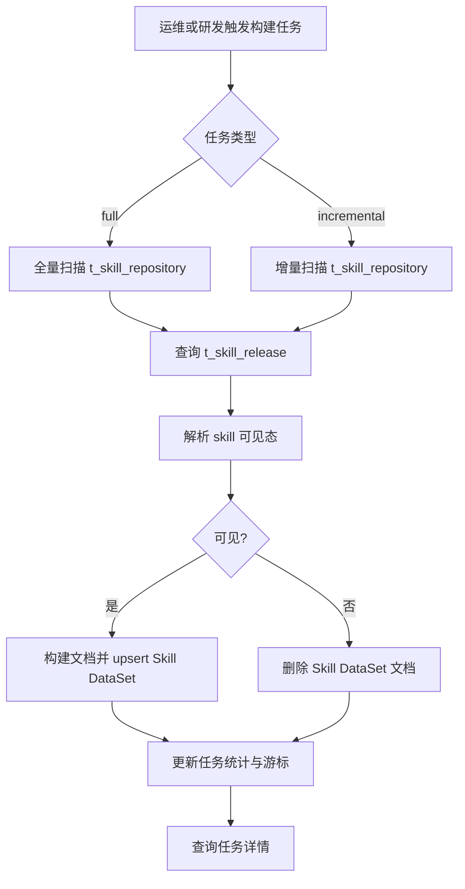

# 🧩 PRD: Skill DataSet 重建与增量构建

> 状态: In Review  
> 负责人: 待确认  
> 更新时间: 2026-04-17  

---

## 📌 1. 背景（Background）

- 当前现状：
  - 执行工厂已经支持 Skill 发布、更新、下架时在线双写 Vega Skill DataSet。
  - Skill DataSet 当前承担 Skill 检索与召回的数据来源职责。
  - 现有能力以在线双写为主，缺少离线修复入口。

- 存在问题：
  - 在线双写失败后，缺少批量补偿机制，无法修复漏写和漏删。
  - 历史存量 Skill 无法通过统一入口一次性回灌到 Skill DataSet。
  - 下架漏删场景下，仅依赖 `t_skill_release` 无法识别应删除的 Skill。
  - `editing` 状态下，如果直接按主表状态删除，会误删仍有发布快照的 Skill 文档。

- 触发原因 / 业务背景：
  - issue `kweaver-core#187` 需要补齐 Skill 双写 DataSet 场景下的重建与增量构建能力。
  - 上游 Skill 检索与召回依赖 Skill DataSet 的完整性和一致性。
  - 运维和研发需要一个可手动触发、可查询、可补偿的离线构建能力。

---

## 🎯 2. 目标（Objectives）

- 业务目标：
  - 将 Skill DataSet 的最终状态与“当前对外可见发布态 Skill 集合”的一致性提升到可通过离线任务恢复。
  - 使运维和研发能够在一次人工触发内完成 Skill DataSet 的全量对齐或增量补偿。

- 产品目标：
  - 支持 `full` 和 `incremental` 两种构建任务类型。
  - 支持查询每次构建任务的状态、游标、成功数、删除数和失败数。
  - 对 `editing + release存在` 的 Skill，离线构建误删率为 0。
  - 对 `offline/unpublish/is_deleted=true` 的 Skill，离线构建能够执行删除补偿。

---

## 👤 3. 用户与场景（Users & Scenarios）

### 3.1 用户角色

| 角色 | 描述 |
|------|------|
| 运维人员 | 手动触发全量或增量构建，排查漏写漏删问题 |
| 执行工厂研发 | 通过构建任务修复 Skill DataSet，并定位同步异常 |
| 上游检索/召回服务维护者 | 依赖 Skill DataSet 的完整性保证线上检索效果 |

---

### 3.2 用户故事（User Story）

- 作为运维人员，我希望手动触发 Skill DataSet 全量重建，从而在历史脏数据出现时快速完成整体对齐。
- 作为执行工厂研发，我希望触发 Skill DataSet 增量构建，从而补偿在线双写失败导致的漏写和漏删。
- 作为上游检索能力维护者，我希望 `editing` 状态下仍有发布快照的 Skill 不会被误删，从而保证召回侧数据稳定。

---

### 3.3 使用场景

- 场景1：Skill 发布或更新时在线双写失败，运维触发 `incremental` 构建进行补写。
- 场景2：Skill 下架时在线删除 DataSet 文档失败，运维触发 `incremental` 或 `full` 构建进行补删。
- 场景3：能力首次上线后，研发触发 `full` 构建回灌历史 Skill 数据。
- 场景4：服务异常或依赖抖动后，运维查询任务记录并重新触发构建补偿。

---

## 📦 4. 需求范围（Scope）

### ✅ In Scope

- 新增 Skill DataSet 全量重建能力。
- 新增 Skill DataSet 增量构建能力。
- 新增离线构建任务表 `t_skill_index_build_task`。
- 新增内部接口用于创建、列表查询、详情查询、取消和重试构建任务。
- 统一以 `t_skill_repository` 作为扫描数据源。
- 在 `editing` 状态下增加 `t_skill_release` 校验逻辑。
- 构建任务支持 `upsert` 和 `delete` 两种 DataSet 动作。
- 任务执行通过 Asynq/Redis 异步调度，任务状态以 MySQL 任务表为准。

### ❌ Out of Scope

- 不替代现有在线双写链路。
- 不改造 Vega 通用 DataSet build task。
- 不增加 Skill DataSet 的多版本索引能力。
- 不新增前台检索页面或召回编排逻辑。
- 不实现任务暂停能力。

---

## ⚙️ 5. 功能需求（Functional Requirements）

### 5.1 功能结构

    Skill DataSet 构建
    ├── 构建任务创建
    ├── 构建任务列表查询
    ├── 构建任务查询
    ├── 构建任务取消
    ├── 构建任务重试
    ├── Full 全量重建
    ├── Incremental 增量构建
    ├── 可见态解析
    └── DataSet 文档 upsert / delete

---

### 5.2 详细功能

#### 【FR-1】创建 Skill DataSet 构建任务

**描述：**  
系统提供内部接口创建 Skill DataSet 离线构建任务，任务类型仅支持 `full` 和 `incremental`。

**用户价值：**  
让运维和研发能够通过统一入口发起数据修复任务，而不是依赖临时脚本。

**交互流程：**
1. 调用方调用 `POST /api/agent-operator-integration/internal-v1/skills/index/build`。
2. 系统校验请求头和请求体。
3. 系统检查是否已有 `pending` 或 `running` 任务。
4. 若不存在运行中任务，系统创建 `t_skill_index_build_task` 记录并投递异步任务。
5. 系统返回 `task_id`。

**业务规则：**
- `execute_type` 必填，枚举值仅允许 `full`、`incremental`。
- 同一时刻只允许一个构建任务处于 `pending` 或 `running`。
- 任务创建成功后必须落库，再投递异步消息。

**边界条件：**
- 首次执行 `incremental` 时，如果不存在历史成功游标，系统从零游标开始扫描。
- 构建任务不能复用旧 `task_id`。

**异常处理：**
- 参数非法时返回 `400`。
- 已有运行中任务时返回 `409`。
- 任务落库或消息投递失败时返回 `500`。

---

#### 【FR-2】查询 Skill DataSet 构建任务列表

**描述：**  
系统提供内部接口分页查询构建任务列表，支持按状态、执行类型和创建人过滤。

**用户价值：**  
让运维和研发能够快速定位失败任务、查看历史执行记录，并选择后续取消或重试动作。

**交互流程：**
1. 调用方调用 `GET /api/agent-operator-integration/internal-v1/skills/index/build`。
2. 系统校验请求头和查询参数。
3. 系统按过滤条件查询 `t_skill_index_build_task`。
4. 系统返回任务列表、分页信息和每个任务的 `queue_state`。

**业务规则：**
- 支持按 `status`、`execute_type`、`create_user` 过滤。
- 支持按 `create_time`、`update_time`、`task_id` 排序。
- 返回结果必须包含任务状态、类型、统计信息、游标、重试信息和 Asynq 队列状态。

**异常处理：**
- 参数非法时返回 `400`。
- 查询异常时返回 `500`。

---

#### 【FR-3】查询 Skill DataSet 构建任务详情

**描述：**  
系统提供内部接口查询指定构建任务的状态和执行进度。

**用户价值：**  
让运维和研发能够查看任务是否成功、失败原因以及最后游标。

**交互流程：**
1. 调用方调用 `GET /api/agent-operator-integration/internal-v1/skills/index/build/:task_id`。
2. 系统校验请求头和路径参数。
3. 系统按 `task_id` 查询 `t_skill_index_build_task`。
4. 系统返回任务详情。

**业务规则：**
- 查询结果必须包含任务状态、类型、统计信息、游标、错误信息、重试信息、队列状态、创建时间和更新时间。
- `task_id` 必须全局唯一。

**边界条件：**
- 历史已完成任务也必须可查询。

**异常处理：**
- 参数非法时返回 `400`。
- 任务不存在时返回 `404`。
- 查询异常时返回 `500`。

---

#### 【FR-4】取消与重试构建任务

**描述：**  
系统提供取消任务和基于失败任务创建新任务的重试能力。

**用户价值：**  
让运维和研发在发现错误任务后可立即停止，或在失败后通过标准接口重新执行，而不是依赖手工修库或临时脚本。

**交互流程：**
1. 调用方调用 `POST /api/agent-operator-integration/internal-v1/skills/index/build/:task_id/cancel` 取消任务。
2. 系统读取任务详情和 Asynq 队列状态。
3. `active` 任务调用 `CancelProcessing`；`pending/scheduled/retry/archived` 任务从队列删除并更新任务表。
4. 调用方调用 `POST /api/agent-operator-integration/internal-v1/skills/index/build/:task_id/retry` 重试失败任务。
5. 系统校验原任务状态为 `failed`，并创建新任务，不复用原 `task_id`。

**业务规则：**
- 仅 `failed` 任务允许重试。
- 重试必须创建新任务，原任务仅作为历史记录保留。
- 取消接口必须返回当前队列状态和本次执行动作。

**异常处理：**
- 任务不存在时返回 `404`。
- 任务状态不允许取消或重试时返回 `409`。
- Asynq 操作失败时返回 `500`。

---

#### 【FR-5】Skill DataSet 全量重建

**描述：**  
系统支持扫描全量 `t_skill_repository`，逐条对齐 Skill DataSet。

**用户价值：**  
在历史数据缺失或脏数据较多时，能够一次性恢复 Skill DataSet 的整体正确性。

**交互流程：**
1. 任务启动后按 `f_update_time ASC, f_skill_id ASC` 分页扫描 `t_skill_repository`。
2. 对每条 Skill 查询同 `skill_id` 的 `t_skill_release`。
3. 根据状态和发布快照存在性判定可见态。
4. 可见 Skill 执行 `upsert`，不可见 Skill 执行 `delete`。
5. 每批处理后更新任务统计和当前游标。
6. 扫描完成后将任务置为 `completed`。

**业务规则：**
- `full` 不依赖历史游标启动。
- `full` 运行时仍记录游标，用于失败排查。
- `full` 不是“先清空再回灌”，而是逐条 reconcile。

**边界条件：**
- `published` 但不存在 release 快照时，允许使用主表数据兜底 upsert。
- `editing` 且不存在 release 快照时，必须执行 delete。

**异常处理：**
- 单条 Skill 处理失败时，记录失败数并继续处理后续数据。
- 任务级失败时，将状态置为 `failed` 并记录 `error_msg`。

---

#### 【FR-6】Skill DataSet 增量构建

**描述：**  
系统支持基于主表更新时间游标扫描 `t_skill_repository` 的变更数据，并执行补写或补删。

**用户价值：**  
在在线双写失败后，以较低成本完成补偿，而不必每次都跑全量。

**交互流程：**
1. 任务启动前读取最近一次 `completed` 的 `incremental` 任务游标。
2. 按 `(f_update_time, f_skill_id)` 作为游标继续扫描 `t_skill_repository`。
3. 对每条命中数据执行可见态解析。
4. 可见 Skill 执行 `upsert`，不可见 Skill 执行 `delete`。
5. 每批处理后更新任务统计和游标。
6. 扫描结束后将任务状态置为 `completed`。

**业务规则：**
- 增量游标由任务表提供，Redis 不是真相来源。
- 排序固定为 `ORDER BY f_update_time ASC, f_skill_id ASC`。
- 过滤条件固定为：
  - `f_update_time > cursor_update_time`
  - 或 `f_update_time = cursor_update_time AND f_skill_id > cursor_skill_id`

**边界条件：**
- 首次执行 `incremental` 时，从零游标开始。
- 同一 `update_time` 下有多条 Skill 变更时，必须通过 `skill_id` 保证稳定顺序。

**异常处理：**
- release 查询失败时，记为失败，不允许按“无 release”直接 delete。
- DataSet 写入或删除失败时，记为失败并继续后续记录。

---

#### 【FR-7】可见态解析

**描述：**  
系统根据 `t_skill_repository` 和 `t_skill_release` 的组合状态，决定某个 `skill_id` 是否对外可见，以及 DataSet 文档来源。

**用户价值：**  
避免误删正常对外可见的 Skill，并确保 DataSet 内容与发布态一致。

**交互流程：**
1. 读取一条主表记录。
2. 判断 `is_deleted`。
3. 查询 `t_skill_release`。
4. 根据状态表规则返回 `visible=true/false` 和 `source=release/repository/none`。

**业务规则：**
- `published + release存在`：`upsert`，内容来源为 `t_skill_release`。
- `published + release不存在`：`upsert`，内容来源为 `t_skill_repository`。
- `editing + release存在`：`upsert`，内容来源为 `t_skill_release`。
- `editing + release不存在`：`delete`。
- `offline/unpublish/is_deleted=true`：`delete`。

**边界条件：**
- `editing + release存在` 时禁止使用主表草稿内容覆盖 DataSet。

**异常处理：**
- release 查询异常时，当前 Skill 记失败，不执行 delete。

---

## 🔄 6. 用户流程（User Flow）

---

## 🎨 7. 交互与体验（UX/UI）

### 7.1 页面 / 模块
- 内部任务触发接口
- 内部任务列表查询接口
- 内部任务查询接口
- 内部任务取消接口
- 内部任务重试接口

### 7.2 交互规则
- 点击行为：不涉及前台页面交互，由内部调用方通过 API 触发。
- 状态变化：任务状态支持 `pending`、`running`、`completed`、`failed`。
- 提示文案：
  - 创建成功：返回 `task_id`
  - 已有运行中任务：返回冲突错误
  - 任务不存在：返回 `404`
  - 取消成功：返回实际队列动作和 `queue_state`
  - 重试成功：返回新 `task_id` 和原 `source_task_id`

---

## 🚀 8. 非功能需求（Non-functional Requirements）

### 8.1 性能
- 单批处理大小固定为 `200`。
- 增量扫描必须支持基于 `(f_update_time, f_skill_id)` 的稳定断点续跑。
- 单条失败不能阻断整批任务继续执行。

### 8.2 可用性
- 任务状态必须持久化到 MySQL，服务重启后可查询历史任务。
- 在线双写与离线构建分离，离线任务失败不阻塞在线主链路。

### 8.3 安全
- 权限控制：沿用现有内部接口 header 校验和业务域校验机制。
- 数据保护：不新增敏感数据字段，沿用现有 Skill 索引字段和调用链路。

### 8.4 可观测性
- 支持 tracing
- 支持结构化日志
- 支持任务级与批次级指标监控

---

## 📊 9. 埋点与分析（Analytics）

| 事件 | 目的 |
|------|------|
| `skill_index_build_task_created` | 统计任务创建次数与类型 |
| `skill_index_build_task_completed` | 统计任务完成次数与耗时 |
| `skill_index_build_task_failed` | 统计任务失败次数与失败原因 |
| `skill_index_build_record_upsert` | 统计 DataSet 补写量 |
| `skill_index_build_record_delete` | 统计 DataSet 补删量 |
| `skill_index_build_record_failed` | 统计单条失败量 |

---

## ⚠️ 10. 风险与依赖（Risks & Dependencies）

### 风险
- `t_skill_release` 查询异常会影响 `editing` 场景的正确判定。
- `mf-model-api` 或 `vega-backend` 抖动会增加单条失败数。
- 全量任务执行时间可能较长，需要通过任务化和批量更新控制风险。

### 依赖
- 外部系统：无第三方外部系统依赖。
- 内部服务：`vega-backend`、`mf-model-manage`、`mf-model-api`、`Asynq/Redis`。

---

## 📅 11. 发布计划（Release Plan）

| 阶段 | 时间 | 内容 |
|------|------|------|
| 需求评审 | 待确认 | PRD 与实现设计评审 |
| 开发 | 待确认 | 任务表、接口、service、worker 开发 |
| 测试 | 待确认 | 单元测试、集成测试、回归测试 |
| 发布 | 待确认 | 数据库变更、服务发布、任务联调 |

---

## ✅ 12. 验收标准（Acceptance Criteria）

- Given 不存在运行中的 Skill DataSet 构建任务  
  When 调用 `POST /api/agent-operator-integration/internal-v1/skills/index/build` 且 `execute_type=full`  
  Then 系统创建一条 `t_skill_index_build_task` 记录并返回 `task_id`

- Given 已存在 `pending` 或 `running` 状态的 Skill DataSet 构建任务  
  When 再次创建构建任务  
  Then 系统返回 `409`

- Given 已存在多条历史 Skill DataSet 构建任务  
  When 调用任务列表接口并指定分页参数  
  Then 系统返回分页结果、过滤后的任务列表以及每条任务的 `queue_state`

- Given 一条处于 `failed` 状态的 Skill DataSet 构建任务  
  When 调用重试接口  
  Then 系统创建新的构建任务，返回新的 `task_id`，且原任务保持不变

- Given 一条仍在 Asynq 队列中的 Skill DataSet 构建任务  
  When 调用取消接口  
  Then 系统返回取消动作，并将对应任务从队列取消或删除

- Given 一条 `editing` 状态的主表 Skill 且存在同 `skill_id` 的发布快照  
  When 构建任务处理该 Skill  
  Then 系统执行 `upsert` 且文档内容来源为 `t_skill_release`

- Given 一条 `editing` 状态的主表 Skill 且不存在同 `skill_id` 的发布快照  
  When 构建任务处理该 Skill  
  Then 系统执行 `delete`

- Given 一条 `offline`、`unpublish` 或 `is_deleted=true` 的主表 Skill  
  When 构建任务处理该 Skill  
  Then 系统执行 `delete`

- Given 一条 `published` 状态的主表 Skill 且存在发布快照  
  When 构建任务处理该 Skill  
  Then 系统执行 `upsert` 且文档内容来源为 `t_skill_release`

- Given 增量任务已存在最近一次成功游标  
  When 触发新的 `incremental` 任务  
  Then 系统从最近一次 `completed` 的 `incremental` 任务游标继续扫描

- Given 构建任务中的单条 Skill 写入或删除失败  
  When 当前批次继续执行  
  Then 系统记录失败数并继续处理后续 Skill

---

## 🔗 附录（Optional）

- 相关文档：
  - [实现设计](../../design/features/skill_dataset_rebuild_and_incremental_build.md)
  - [已有 Skill DataSet 双写 PRD](./skill_write_vega_dataset.md)

- 参考资料：
  - issue: `kweaver-core#187`

---
