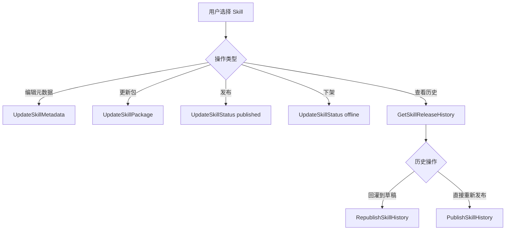

# 🧩 PRD: Skill 包级更新与元数据维护

> 状态: Draft  
> 负责人: 待确认  
> 更新时间: 2026-04-15  

---

## 📌 1. 背景（Background）

- 业务现状：
  - 执行工厂需要支持 Skill 的注册、查询、发布、下架、下载与删除全生命周期。
  - Skill 生命周期管理需要明确草稿态、发布态、历史态、文件索引和搜索索引之间的职责边界。
  - 本需求需要统一 Skill 包更新、元数据维护、发布、历史回放和索引同步的业务规则。

- 存在问题：
  - 注册后的 Skill 缺少统一的持续维护规则，包内容、元数据、发布、历史回放容易分散在不同流程中。
  - Skill 包更新在不同状态下的版本策略不清晰，容易把“覆盖当前草稿”和“从稳定版本派生新草稿”混为一谈。
  - 搜索索引 dataset 的创建、更新、删除动作缺少统一定义，容易把创建语义和更新语义混淆。

- 触发原因 / 业务背景：
  - 需求目标是提升 Skill 生命周期管理效率与可维护性，支持包级更新、替换与发布，以及原数据编辑与维护。

---

## 🎯 2. 目标（Objectives）

- 业务目标：
  - 使 Skill 具备从注册、草稿维护、发布、历史回放到重新发布的完整生命周期闭环。
  - 将 Skill 维护从“删除重建”转为“持续演进”，降低维护成本与误操作风险。

- 产品目标：
  - 支持 Skill 元数据编辑，且编辑后不改变 `version`。
  - 支持 Skill 包更新，并按状态执行不同版本策略：
    - `editing / unpublish`：复用当前 `version`，覆盖当前草稿快照。
    - `published / offline`：生成新草稿 `version`。
  - 支持历史查询、历史回灌到草稿、按历史版本直接重新发布。
  - 保证线上读取链路始终只读取 `release`。
  - 保证 Skill dataset 索引同步具备明确动作：
    - 创建走 `POST /resources/dataset/{id}/docs`
    - 更新走 `PUT /resources/dataset/{id}/docs`
    - 删除走 `DELETE /resources/dataset/{id}/docs/{doc_id}`

---

## 👤 3. 用户与场景（Users & Scenarios）

### 3.1 用户角色

| 角色 | 描述 |
|------|------|
| Skill 作者 | 维护 Skill 内容、依赖、资产文件 |
| Skill 维护者 | 维护元数据、修订草稿、处理历史版本 |
| Skill 发布者 | 执行发布、下架、历史版本直接重新发布 |

---

### 3.2 用户故事（User Story）

- 作为 Skill 作者，我希望在不重新注册的情况下更新 Skill 包内容，从而持续维护同一个 Skill 资产。
- 作为 Skill 维护者，我希望编辑名称、描述、分类和扩展信息，从而提升 Skill 的可发现性与可维护性。
- 作为 Skill 发布者，我希望能基于草稿重新发布，或直接重发历史版本，从而降低回退和修复成本。

---

### 3.3 使用场景

- 场景1：未发布或编辑中的 Skill 更新包内容，系统覆盖当前草稿版本。
- 场景2：已发布或已下架的 Skill 更新包内容，系统派生新的草稿版本而不影响当前发布版本。
- 场景3：只更新元数据，不替换 Skill 包内容。
- 场景4：将草稿内容发布为当前线上版本，并写入发布历史。
- 场景5：将某个历史版本回灌到草稿态继续编辑。
- 场景6：将某个历史版本直接重新发布。

---

## 📦 4. 需求范围（Scope）

### ✅ In Scope

- Skill 元数据编辑
- Skill 包级更新与整包替换
- 编辑态、发布态、历史态三层模型
- 历史查询
- 历史回灌到草稿
- 按历史版本直接重新发布
- Skill dataset 的创建、更新、删除同步

### ❌ Out of Scope

- 单文件粒度的增量补丁编辑
- 历史版本差异对比界面
- 跨 Skill 批量编辑
- 旧版本对象存储资产自动回收
- 独立的前端交互稿、视觉稿和 Figma 链接

---

## ⚙️ 5. 功能需求（Functional Requirements）

### 5.1 功能结构

    Skill 生命周期管理
    ├── 草稿维护
    │   ├── UpdateSkillMetadata
    │   └── UpdateSkillPackage
    ├── 发布管理
    │   ├── UpdateSkillStatus(published/offline)
    │   ├── RepublishSkillHistory
    │   └── PublishSkillHistory
    ├── 发布态读取
    │   ├── GetSkillMarketDetail
    │   ├── DownloadSkill
    │   ├── ExecuteSkill
    │   ├── GetSkillContent
    │   └── ReadSkillFile
    └── 索引同步
        ├── UpsertSkill -> POST
        ├── UpdateSkill -> PUT
        └── DeleteSkill -> DELETE

---

### 5.2 详细功能

#### 【FR-1】元数据编辑

**描述：**  
允许基于 `skill_id` 编辑名称、描述、分类、扩展信息等结构化字段。

**用户价值：**  
在不替换 Skill 包的前提下维护展示信息和管理信息。

**交互流程：**
1. 查询 Skill 当前草稿态。
2. 校验权限、存在性、删除状态。
3. 如名称变化，执行发布态重名校验。
4. 更新 `repository` 中的元数据字段。
5. 若原状态为 `published`，将草稿态置为 `editing`。

**业务规则：**
- 元数据编辑不变更 `version`。
- 名称唯一性校验以发布态 Skill 为主。
- 删除中的 Skill 不允许编辑。

**边界条件：**
- 无权限用户不可编辑。
- 不允许通过该接口直接变更发布态。

**异常处理：**
- Skill 不存在返回 `404`。
- 权限不足返回 `403`。
- 名称冲突返回业务错误。

---

#### 【FR-2】包更新与整包替换

**描述：**  
允许基于 `skill_id` 以 `content` 或 `zip` 方式更新 Skill 内容与资产文件。

**用户价值：**  
在保持 Skill 身份不变的情况下，持续维护执行内容和文件资源。

**交互流程：**
1. 查询 Skill 当前草稿态。
2. 校验权限、存在性、删除状态。
3. 解析新 `content` 或 `zip`。
4. 根据当前状态决定版本策略。
5. 更新 `repository`、`file_index` 和对象存储。
6. 成功后更新 dataset 索引文档。

**业务规则：**
- `editing / unpublish`：复用当前 `version`，先删除后上传，覆盖当前草稿版本。
- `published / offline`：生成新草稿 `version`，不覆盖旧发布版本文件。
- `published / offline` 更新包后，草稿态统一进入 `editing`。
- `content` 更新不处理文件索引。
- `zip` 更新会更新 `skill_content`、`dependencies`、`file_manifest` 和资产文件集合。

**边界条件：**
- 当前版本覆盖更新时，必须先删旧文件索引和对象，再重建同一版本文件集合。
- 新版本派生时，旧版本文件必须保留给 `release/history` 读取。

**异常处理：**
- 解析失败直接返回，不更新数据库。
- 旧文件删除失败直接返回错误，避免形成半更新草稿。
- dataset 更新失败只记录日志，不影响主流程成功返回。

---

#### 【FR-3】发布与下架

**描述：**  
通过状态接口完成草稿发布和已发布 Skill 下架。

**用户价值：**  
确保发布态、历史态和线上读取链路一致。

**交互流程：**
1. 查询当前草稿。
2. 执行权限校验、重名校验、状态流转校验。
3. 发布时将草稿快照写入 `release` 和 `history`。
4. 下架时删除当前 `release`。
5. 事务提交后同步 dataset。

**业务规则：**
- 发布是快照复制动作，不是简单状态翻转。
- 发布后线上读取只走 `release`。
- 下架后删除 dataset 文档。

**边界条件：**
- 发布必须在事务提交成功后再做索引同步。
- 历史写入失败时发布整体回滚。

**异常处理：**
- `release/history` 任一步写失败，整笔发布回滚。
- dataset 同步失败只记录日志，不回滚主事务。

---

#### 【FR-4】历史查询与回放

**描述：**  
支持查询历史发布版本、回灌历史版本到草稿、按历史版本直接重新发布。

**用户价值：**  
降低修复回退成本，支持基于历史版本继续维护。

**交互流程：**
1. 查询 `history` 列表。
2. 用户选择历史版本。
3. 执行回灌到草稿或直接重新发布。

**业务规则：**
- `RepublishSkillHistory` 只更新 `repository`，状态置为 `editing`。
- `PublishSkillHistory` 会更新 `repository`、`release`，并同步索引。
- 历史版本不改变 `skill_id`。

**边界条件：**
- 历史版本不存在时返回 `404`。
- 非法历史快照返回内部错误。

**异常处理：**
- 历史反序列化失败返回内部错误。
- 直接重发历史版本时，若名称冲突则返回业务错误。

---

## 🔄 6. 用户流程（User Flow）

---

## 🎨 7. 交互与体验（UX/UI）

### 7.1 页面 / 模块
- Skill 管理详情页
- Skill 编辑页
- Skill 历史版本列表
- Skill 发布操作区

### 7.2 交互规则
- 点击行为：
  - 保存元数据后刷新草稿信息
  - 更新包后返回新草稿版本与状态
  - 发布后刷新线上状态
  - 历史回灌后停留在草稿态
- 状态变化：
  - `loading / success / error`
  - 已发布或已下架 Skill 更新包后，草稿显示为 `editing`
- 提示文案：
  - 版本冲突、权限不足、名称冲突、历史版本不存在等错误需提供明确提示

---

## 🚀 8. 非功能需求（Non-functional Requirements）

### 8.1 性能
- 待确认：单次包更新接口响应时间目标
- 待确认：dataset 更新可接受的最大延迟

### 8.2 可用性
- 主事务成功与外部索引同步解耦，避免索引失败阻塞主流程
- 待确认：SLA 目标

### 8.3 安全
- 权限控制沿用现有授权体系
- 对外读取与管理态读取严格区分
- 不在日志中记录敏感对象存储凭据

### 8.4 可观测性
- 支持 tracing
- 支持日志
- 支持指标监控

---

## 📊 9. 埋点与分析（Analytics）

| 事件 | 目的 |
|------|------|
| skill_metadata_updated | 统计元数据维护频率 |
| skill_package_updated | 统计包更新频率与类型 |
| skill_published | 统计发布成功量 |
| skill_history_republished | 统计历史回灌使用情况 |
| skill_history_published | 统计历史直发使用情况 |

---

## ⚠️ 10. 风险与依赖（Risks & Dependencies）

### 风险
- 对象存储删除成功但数据库事务失败，会出现存储与索引不一致风险。
- 旧版本文件若在仍被 `release/history` 引用时被清理，会破坏发布态或历史态读取。
- 名称、描述来自 `SKILL.md` 与元数据接口时，需要持续保持单一事实来源约束。

### 依赖
- 外部系统：Vega Backend dataset API
- 内部服务：权限服务、业务域服务、对象存储、模型服务

---

## 📅 11. 发布计划（Release Plan）

| 阶段 | 时间 | 内容 |
|------|------|------|
| 需求评审 | 待确认 | PRD 与设计评审 |
| 测试 | 待确认 | 回归与查缺补漏 |
| 发布 | 待确认 | 按环境计划执行 |

---

## ✅ 12. 验收标准（Acceptance Criteria）

- Given 一个已存在 Skill，When 用户更新元数据，Then 系统更新 `repository` 中的元数据字段且不变更 `version`。
- Given 一个 `editing` 或 `unpublish` 状态的 Skill，When 用户更新 zip 包，Then 系统复用当前 `version` 并以先删除后上传的方式覆盖当前草稿文件集合。
- Given 一个 `published` 或 `offline` 状态的 Skill，When 用户更新 zip 包，Then 系统生成新的草稿 `version` 且不覆盖旧发布版本文件。
- Given 一个已发布 Skill，When 用户完成包更新，Then 草稿态状态变为 `editing` 且线上读取仍继续读取旧 `release`。
- Given 一个 Skill 被首次注册，When 系统同步 dataset，Then 系统调用 `POST /resources/dataset/{id}/docs` 创建索引文档。
- Given 一个已存在 Skill 发生内容更新，When 系统同步 dataset，Then 系统调用 `PUT /resources/dataset/{id}/docs` 更新索引文档。
- Given 一个已发布 Skill 被下架，When 系统同步 dataset，Then 系统调用 `DELETE /resources/dataset/{id}/docs/{doc_id}` 删除索引文档。
- Given 一个历史版本存在，When 用户执行历史回灌，Then 系统将该历史版本恢复到草稿态且不直接覆盖当前 `release`。
- Given 一个历史版本存在，When 用户执行历史直接重新发布，Then 系统用该历史快照覆盖当前 `release` 并保持发布链路可用。

---

## 🔗 附录（Optional）

- 相关文档：
  - [设计文档](../../design/features/skill_package_lifecycle_management.md)

- 参考资料：
  - `/Users/chenshu/Code/github.com/kweaver-ai/kweaver-core/adp/docs/api/vega/vega-backend/vega-backend.yaml`

---
