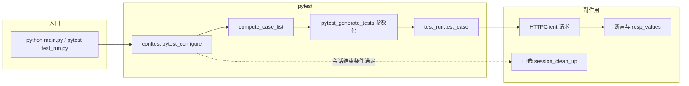
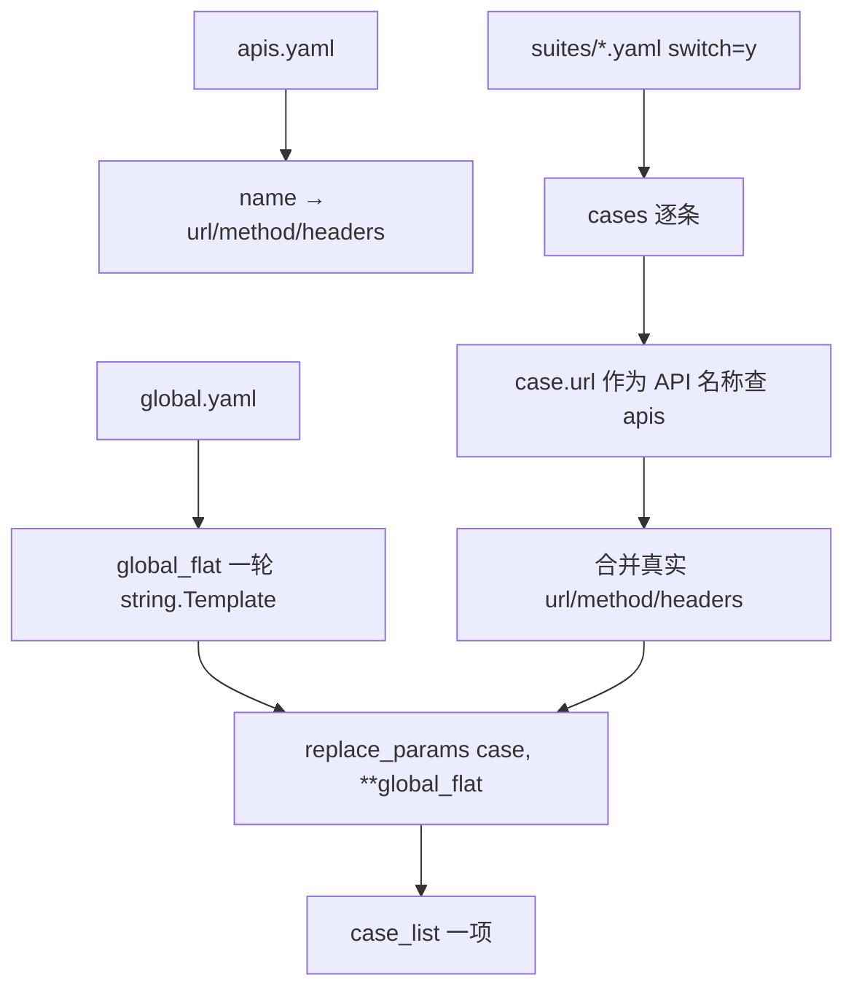
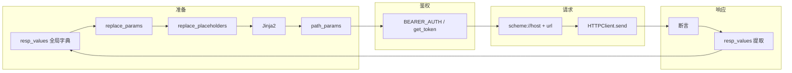

# API 自动化测试框架说明

本文基于本仓库**当前实现**整理，覆盖目录结构、执行流程、数据流、配置与扩展点。运行命令与环境变量详见 [执行命令与环境变量说明.md](./执行命令与环境变量说明.md)。

---

## 1. 框架定位

- **输入**：各业务模块目录下的 YAML（`apis.yaml`、`global.yaml`、`suites/*.yaml`）。
- **执行**：`pytest` 驱动 `test_run.py`，按用例列表逐条发 HTTP 请求并断言。
- **输出**：控制台 / Allure / JUnit（由 `main.py` 或自行传入 pytest 参数决定）。

框架与具体业务解耦：**模块 = `testcase/<模块名>/` 目录**，通过 `--case-file` 或 `CASE_FILE` / `AT_CASE_FILE` 指向该目录。

---

## 2. 仓库目录结构

### 2.1 顶层一览

```
项目根目录/
├── config/
│   └── config.ini              # 全局运行配置（server、test_data 等）
├── common/
│   ├── at_env.py               # 环境变量与 config 的统一读取（鉴权、Host、case_file、清理开关）
│   ├── constant.py             # 报告路径（JUnit、Allure xml/html）
│   ├── func.py                 # YAML 加载、get_cases、参数替换、占位符、genson
│   └── hooks.py                # 动态加载模块 framework_hooks.session_clean_up
├── request/
│   └── http_client.py          # requests 封装（HTTPS 默认 verify=False）
├── src/
│   ├── auth/                   # OAuth/登录相关（供 token_provider 使用）
│   ├── common/                 # token_provider、logger、utils 等
│   └── config/                 # 兼容旧版 setting（token_provider 回退）
├── testcase/
│   ├── _config/
│   │   └── spec/               # 框架级规范：case_schema、suite_schema、hooks 模板
│   ├── etrino/                 # 示例/业务模块之一
│   ├── vega/                   # 示例子树（data-connection、mdl-data-model 等）
│   └── bkn/                    # 等业务模块；部分含 _legacy 旧 pytest 用例
├── tests/                      # 框架自测（不加载业务 YAML）
├── scripts/                    # extract_cases、validate_module 等 CLI
├── report/                     # 报告输出（xml、html、junit）
├── conftest.py                 # pytest 钩子：用例列表、BEARER_AUTH、会话清理
├── test_run.py                 # 单条用例：参数处理 → HTTP → 断言 → 提取变量
├── main.py                     # 封装 pytest + allure generate
├── pytest.ini
└── requirement.txt
```

### 2.2 单个 YAML 模块（推荐形态）

每个可执行模块是一个**目录**（如 `testcase/etrino`），框架只认该目录路径，不要求目录名固定。

```
testcase/<模块>/
├── _config/
│   ├── apis.yaml               # 接口清单：name → url、method、headers
│   ├── global.yaml             # 全局变量（支持 ${var} 互相引用一轮展开）
│   ├── global_manifest.yaml    # 可选：变量清单（智能体/提取用）
│   ├── path_scope_mapping.yaml # 可选：scope id → tags（按提交筛选）
│   ├── suite_manifest.yaml     # 可选：套件说明
│   └── framework_hooks.py      # 可选：见下文「会话钩子」
├── suites/
│   ├── *.yaml                  # 套件：feature、story、switch、cases[]
└── framework_hooks.py          # 可选：若放在模块根目录，供会话清理加载
```

说明：

- **`_config/framework_hooks.py` 与根目录 `framework_hooks.py`**：`common/hooks.py` 在**模块根目录**查找 `framework_hooks.py`。若仅存在 `_config/framework_hooks.py`，需自行复制或调整路径习惯，以仓库中**实际存在文件为准**。
- 部分模块另有 `data/`、`_legacy/`（旧版 pytest），**当前主流程以 `suites/*.yaml` + `_config/apis.yaml` 为准**。

### 2.3 框架级规范文件（只读契约）

| 文件 | 作用 |
|------|------|
| `testcase/_config/spec/case_schema.yaml` | 单条 case 字段说明、与 OpenAPI 概念对齐 |
| `testcase/_config/spec/suite_schema.yaml` | 套件字段、`switch` 语义 |
| `testcase/_config/spec/framework_hooks.template.py` | 会话清理函数签名示例 |

---

## 3. 核心组件职责

| 组件 | 职责 |
|------|------|
| `conftest.py` | 加载 `config.ini`；计算默认 `Authorization`（`BEARER_AUTH`）；`pytest_addoption` 注册筛选参数；`compute_case_list()` 延迟加载用例；`pytest_configure` 把 CLI 写进环境变量；会话级 `clean_up` fixture |
| `test_run.py` | `pytest_generate_tests` 参数化 `test_case`；单条用例内：替换变量 → 拼 URL → `HTTPClient.send` → 断言 → `resp_values` 写回全局 `resp_values` |
| `common/func.py` | `load_case` / `load_case_from_yaml`：读 YAML → 合并 API → 打平 global → `get_cases` 筛选 |
| `common/at_env.py` | 静态 Token、`AT_AUTH_SOURCE`、Host/Scheme、默认 case 目录、清理开关 |
| `request/http_client.py` | `requests.Session.request`，忽略 SSL 校验告警 |
| `src/common/token_provider.py` | `get_token(user, pwd)`：OAuth 登录链，带缓存 |

---

## 4. 执行流程（从命令行到单条用例）

### 4.1 总览



### 4.2 步骤说明

1. **启动**  
   - `python -m pytest test_run.py [选项]` 或 `python main.py [选项]`（后者额外执行 `allure generate`）。

2. **`pytest_configure`（`conftest.py`）**  
   - 解析 `--case-file`：有则作为模块目录，否则 `at_env.default_case_file(config)`（`AT_CASE_FILE` → `CASE_FILE` → 默认 `./testcase/etrino`）。  
   - 将 `--scope`、`--tags`、`--suite` 等写入对应环境变量，保证与仅设环境变量的行为一致。

3. **用例列表 `compute_case_list()`**  
   - 读环境变量：`SCOPE`、`TAGS`、`API_NAME`、`API_PATH`、`CASE_NAMES`、`SUITE`。  
   - 若存在 `CASE_NAMES`：按 name 精确筛选（或全量 `load_case`）。  
   - 否则若有任一筛选条件：调用 `get_cases(...)`。  
   - 否则：`load_case(_case_file)` 全量加载。

4. **收集与参数化**  
   - `pytest_generate_tests` 只对函数 `test_case` 生效，把 `compute_case_list()` 的每条 case 展开为 `(feature, story, case_name, case_info)`。

5. **单条执行 `test_case`（`test_run.py`）**  
   - 处理 `prev_case`：递归执行前置用例（同名取第一个）。  
   - 处理 `next_case`：当前用例执行完毕后递归执行后置用例（同名取第一个，失败不影响当前用例）。  
   - 参数流水线见下一节「数据流」。  
   - 发送请求后：`code_check`、`resp_headers_check`、`resp_check`、`resp_schema`（genson）、`resp_values`。

6. **会话清理（可选）**  
   - 仅当本会话**确实收集到** `test_run.py` 中的用例；且 `AT_CLEAN_UP=1`；且 `AT_CLEAN_UP_MODULE` 为空或与当前模块目录名一致。  
   - 动态加载 `testcase/<模块>/framework_hooks.py` 中的 `session_clean_up(config, allure)`。

---

## 5. 数据流（单条用例）

### 5.1 加载阶段（`load_case_from_yaml`）



要点：

- 用例里 **`url` 字段表示接口名称**（与 `apis.yaml` 的 `name` 一致），加载后会被替换为真实 **路径** 存于 `case["url"]`，原名称在 `case["api_name"]`。  
- **`switch` 不为 `y` 的整套件不进入用例池**。  
- 引用未在 `apis.yaml` 定义的接口：默认 **告警并跳过**；`AT_STRICT_LOAD_APIS=1` 时 **加载失败**。

### 5.2 执行阶段（`test_run.test_case`）

顺序与 `case_schema.yaml` 中 `substitution_order` 一致思想：

1. **`replace_params(case_info, **resp_values)`**  
   用**前置用例已提取**的键值替换 `$var` / `${var}`（`string.Template.safe_substitute`）。

2. **`replace_placeholders`**  
   处理 `${uuid}`、`${random_str(...)}` 等动态占位（见 `common/func.replace_placeholders`）。

3. **`_render_jinja_fields`**  
   对 case 中**字符串字段**做 Jinja2 渲染（如套件内 `random_string`）。

4. **`path_params`**  
   JSON 解析后再次 `replace_params`，填充 URL 路径占位。

5. **请求头**  
   合并：`apis` 的 `headers` JSON + 用例 `header_params`，并设置 **`Authorization`**：  
   - 默认使用模块级 **`BEARER_AUTH`**（`conftest` 启动时根据 `AT_AUTH_SOURCE` 与静态 Token 生成）。  
   - 若套件/用例声明 `token_source` 为 login 类：`test_run._resolve_authorization` 可再调 `get_token`，失败则回退 `BEARER_AUTH`。

6. **URL 拼接**  
   `scheme://host + case_info["url"]`，其中 `scheme` 与 `host` 来自 `at_env.resolve_request_target(config)`。

7. **响应**  
   - `HTTPClient` 使用 `resp.json()` 作为 body（非 JSON 接口需自行注意）。  
   - 断言通过后，`resp_values` 中 jsonpath 提取结果写入模块级 **`resp_values` 字典**，供后续用例使用。



---

## 6. 筛选逻辑（`get_cases`）

在 `load_case_from_yaml` 全量列表之上，支持：

| 参数 | 行为 |
|------|------|
| `names` | 只保留 `name` 在列表中的用例（**优先**，直接返回） |
| `scope` | 查 `path_scope_mapping.yaml` 得 tags，与 case 的 `tags` 求交 |
| `tags` | 逗号或列表，与 case 的 `tags` 求交 |
| `suite` | `story` 或文件名（去 `.yaml`）匹配 |
| `name` | 单条 name 精确匹配 |
| `api_name` | 与加载时保存的 `api_name` 一致 |
| `api_path` | 子串匹配真实 url |

`scope` 与 `tags` 会合并为 `requested_tags` 后再过滤。

---

## 7. 配置体系

### 7.1 `config/config.ini`

由 `load_sys_config` 读成**嵌套 dict**（无 `[env]` 段设计）。框架侧常用：

- **`[server]`**：`host`、`base_url`（用于在未设 `AT_REQUEST_SCHEME` 时从 URL 推导协议）。  
- **`[test_data]`**：`application_token`、`admin_user`、`admin_password` 等。

### 7.2 环境变量（摘要）

完整表格见 [执行命令与环境变量说明.md](./执行命令与环境变量说明.md)。与执行强相关：

- **鉴权**：`API_ACCESS_TOKEN`、`AT_AUTH_SOURCE`、`AT_ADMIN_USER` / `AT_ADMIN_PASSWORD`  
- **请求目标**：`AT_SERVER_HOST`、`AT_REQUEST_SCHEME`  
- **模块路径**：`CASE_FILE`、`AT_CASE_FILE`  
- **清理**：`AT_CLEAN_UP`、`AT_CLEAN_UP_MODULE`  
- **严格加载**：`AT_STRICT_LOAD_APIS`

---

## 8. 报告与产物

| 路径 | 说明 |
|------|------|
| `report/xml` | Allure 原始结果（`main.py` 中 `--alluredir`） |
| `report/html` | `allure generate` 输出 |
| `report/junit_report.xml` | JUnit（`main.py` 传入 `--junit-xml`） |

常量定义见 `common/constant.py`。

---

## 9. 工具脚本（`scripts/`）

| 脚本 | 作用 |
|------|------|
| `extract_cases.py` | 按条件列出用例或全局变量，供流水线/智能体 |
| `validate_module.py` | 校验模块目录是否可被加载（可选 `--strict-apis`） |

---

## 10. 框架自测

```bash
python -m pytest tests/
```

不加载业务 YAML，不依赖 `test_run` 会话清理路径，用于验证框架自身逻辑。

---

## 11. 与其它文档的关系

| 文档 | 内容 |
|------|------|
| [执行命令与环境变量说明.md](./执行命令与环境变量说明.md) | 安装、命令、环境变量、常见问题 |
| [README.md](../README.md) | 总览、智能体筛选示例、目录说明 |
| `testcase/_config/spec/*.yaml` | case/suite 字段级契约 |

---

## 12. 附录：关键源码索引

| 需求 | 首选阅读 |
|------|----------|
| 用例如何加载 | `common/func.py` → `load_case_from_yaml`、`get_cases` |
| 单条如何执行 | `test_run.py` → `test_case`、`_resolve_authorization`、`_parse_check_expression` |
| Host/Token 从哪来 | `common/at_env.py` |
| pytest 与清理 | `conftest.py` |
| HTTP 行为 | `request/http_client.py` |
| 登录 Token | `src/common/token_provider.py`、`src/auth/login.py` |

---

## 13. 附录：resp_check 表达式语法

`resp_check` 支持多种表达式格式，用于灵活的响应断言：

### 13.1 精确匹配

```yaml
resp_check: |
  {
    "$.code": 0,
    "$.data.name": "x",
    "$.success": true
  }
```

值可为任意 JSON 类型（字符串、数字、布尔、null），与 jsonpath 提取结果精确比较。

### 13.2 比较操作符

支持 `>`、`<`、`>=`、`<=`、`!=`、`==`：

```yaml
resp_check: |
  {
    "$.count": ">0",
    "$.size": "<10",
    "$.age": ">=18",
    "$.score": "<=100",
    "$.status": "!=null"
  }
```

### 13.3 contains 检查

检查数组中是否包含元素，或字符串是否包含子串：

```yaml
# 数组包含元素
resp_check: |
  {
    "$.items": "contains('skill')"
  }

# 字符串包含子串
resp_check: |
  {
    "$.message": "contains('success')"
  }
```

对于对象数组，会自动检查每个对象的 `stage` 字段（常用于可观测性 progress 验证）。

### 13.4 exists 检查

检查字段是否存在（非空）：

```yaml
resp_check: |
  {
    "$.data.id": "exists"
  }
```

### 13.5 regex 正则匹配

```yaml
resp_check: |
  {
    "$.id": "regex('^abc.*')"
  }
```

### 13.6 type 类型检查

支持类型：`string`、`integer`、`float`、`boolean`、`array`、`object`、`null`：

```yaml
resp_check: |
  {
    "$.data": "type('array')",
    "$.count": "type('integer')"
  }
```

### 13.7 综合示例

验证 Agent 技能调用场景：

```yaml
resp_check: |
  {
    "$.tool_call_count": ">0",
    "$.progress": "contains('skill')"
  }
```

表示：`tool_call_count` 大于 0，且 `progress` 数组中包含 `stage='skill'` 的记录。

---

*文档生成自仓库结构及源码，若实现变更请以代码为准并同步更新本节。*
