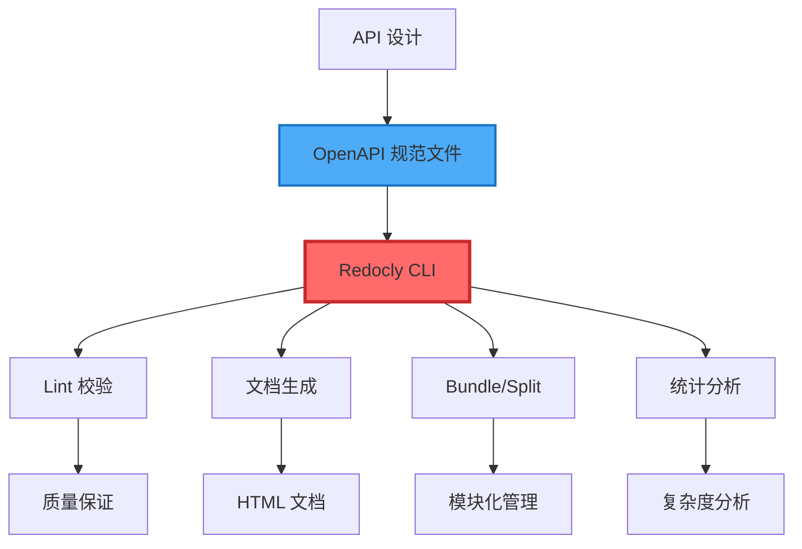
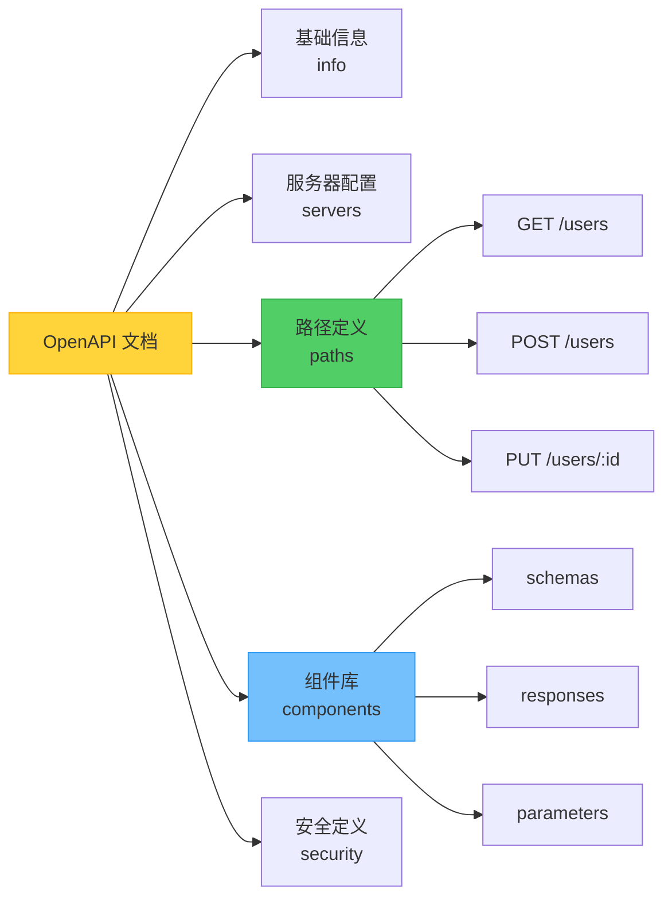
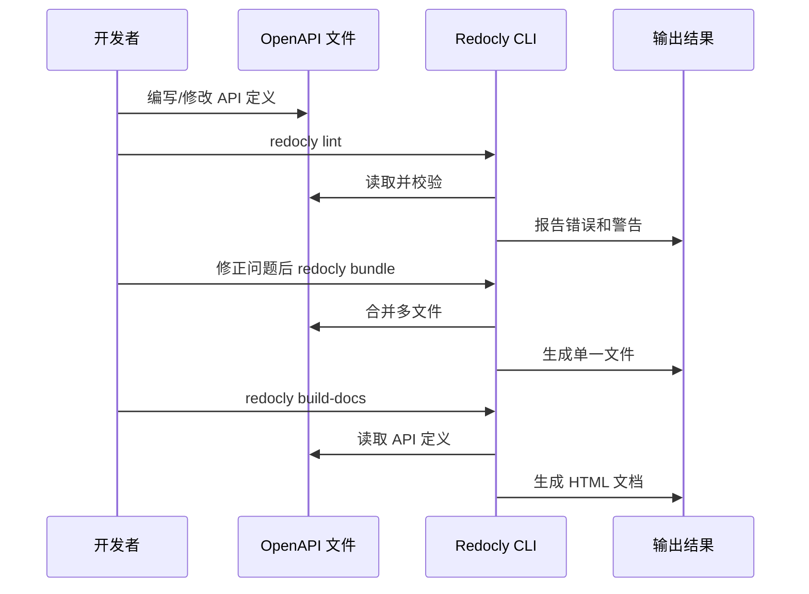
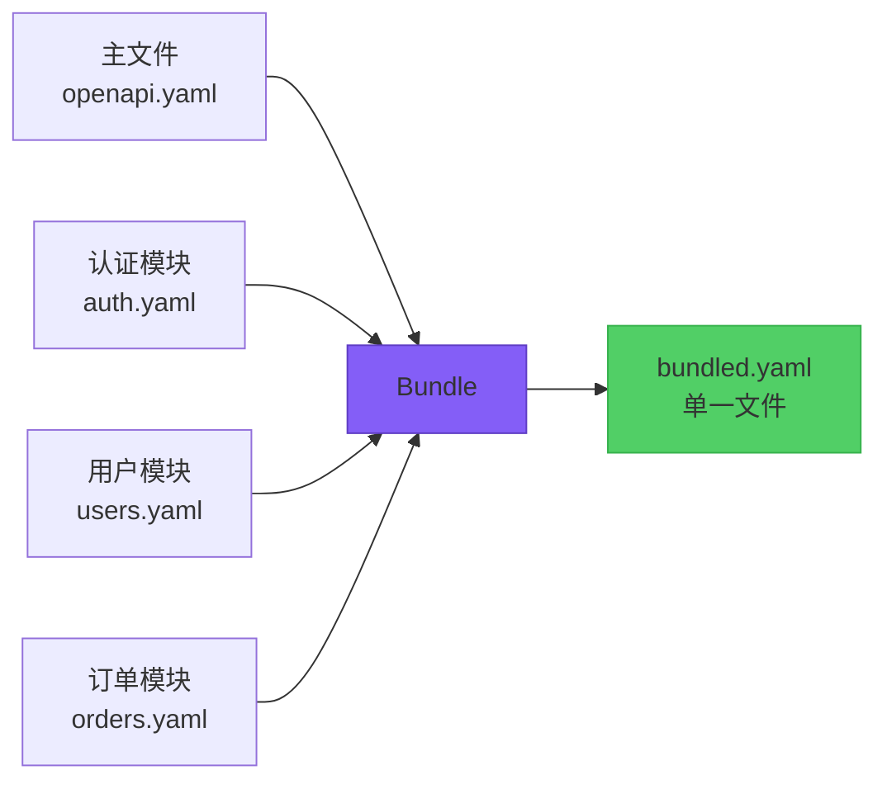
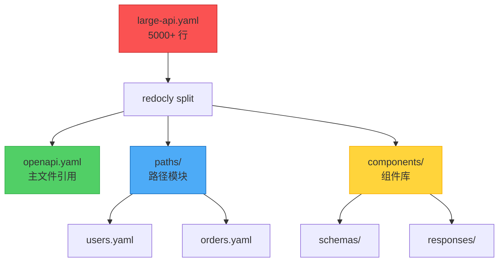
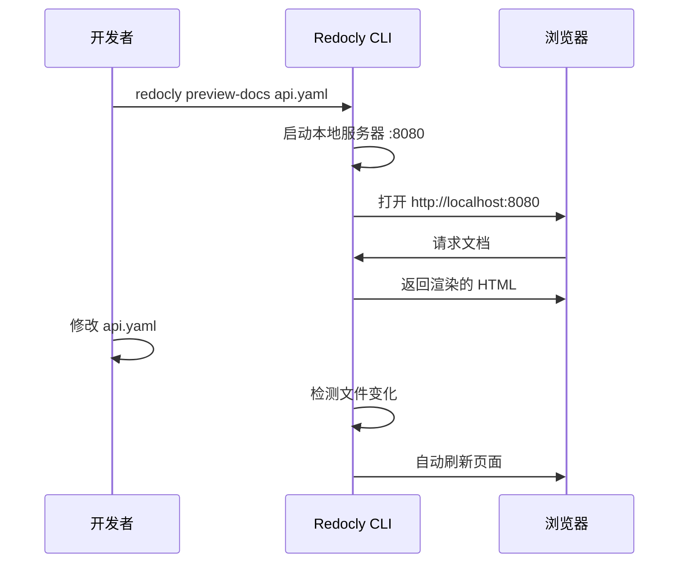
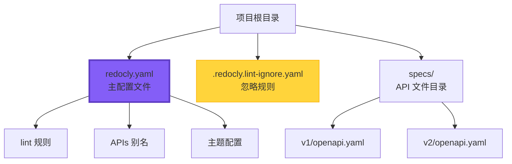
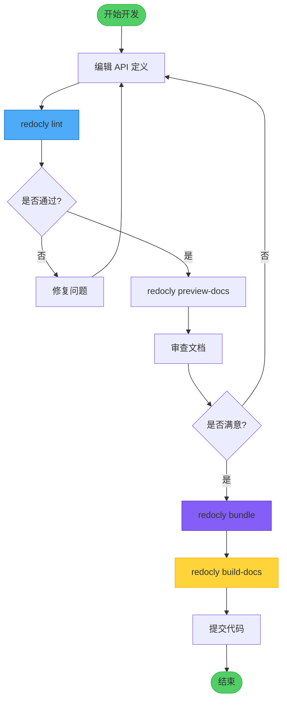
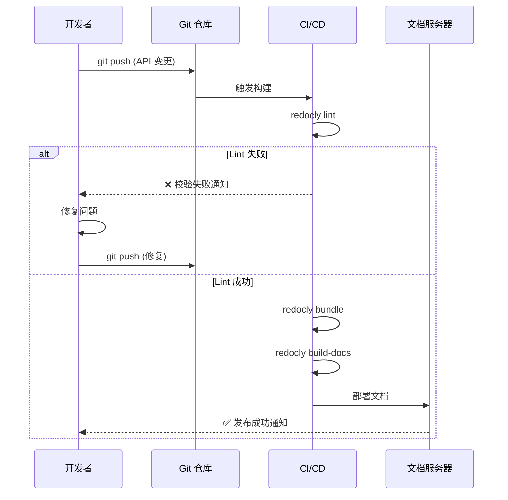

# Redocly CLI 使用手册

## 目录

1. [简介](#简介)
2. [安装与版本管理](#安装与版本管理)
3. [核心概念](#核心概念)
4. [主要命令详解](#主要命令详解)
5. [配置文件](#配置文件)
6. [实战示例](#实战示例)
7. [工作流程](#工作流程)
8. [最佳实践](#最佳实践)
9. [常见问题](#常见问题)

---

## 简介

**Redocly CLI** 是一个功能强大的 OpenAPI 工具集，用于构建、管理、改进和质量检查 OpenAPI 描述文档（API Description Documents）。它提供了从 API 设计到文档发布的完整工具链。

### 主要特性

- **Lint 校验（Linting）**：验证 OpenAPI 规范合规性
- **文档生成（Documentation）**：生成美观的 API 文档
- **Bundle 打包（Bundling）**：合并多文件 API 定义
- **Split 拆分（Splitting）**：将大文件拆分为模块化结构
- **Stats 统计（Statistics）**：分析 API 复杂度和规模
- **预览（Preview）**：本地实时预览文档

### 技术栈位置



---

## 安装与版本管理

### 当前系统状态

```bash
# 已安装版本（通过 Homebrew）
$ redocly --version
2.6.0

# 安装位置
$ which redocly
/opt/homebrew/bin/redocly
```

### 更新 Redocly

```bash
# 方式 1：通过 Homebrew 更新（推荐）
brew upgrade redocly-cli

# 方式 2：使用 npx（无需安装）
npx @redocly/cli@latest --version
```

### 版本选择建议

| 使用场景 | 推荐方式 | 版本选择 | 说明 |
|---------|---------|---------|------|
| 本地开发（需要热重载） | npx | `@redocly/cli@1` | v1 支持 `preview-docs` 热重载 |
| 本地开发（仅构建文档） | Homebrew | 最新版本 | 启动快，无需每次下载 |
| CI/CD | npx | `@redocly/cli@latest` | 始终使用最新版本 |
| 临时使用 | npx | 根据需求选择 | 不污染全局环境 |

### 版本差异对照

| 功能 | v1.x (≤1.34.5) | v2.x (≥2.0.0) |
|-----|---------------|---------------|
| `preview-docs` 命令 | ✅ 支持 | ❌ 已移除 |
| 热重载预览 | ✅ 支持 | ❌ 不支持 |
| 直接预览单文件 | ✅ 支持 | ❌ 需要项目结构 |
| `build-docs` 命令 | ✅ 支持 | ✅ 支持 |
| `lint` 命令 | ✅ 支持 | ✅ 支持（更强大） |
| `bundle` 命令 | ✅ 支持 | ✅ 支持 |

---

## 核心概念

### OpenAPI 文档结构



### Redocly 工作流程



---

## 主要命令详解

### 1. lint - API 校验

**用途**：检查 OpenAPI 文档的规范合规性和最佳实践。

**基本语法**：
```bash
redocly lint <api-file>
```

**常用示例**：

```bash
# 基础校验
redocly lint openapi.yaml

# 指定配置文件
redocly lint openapi.yaml --config=redocly.yaml

# 限制显示的问题数量
redocly lint openapi.yaml --max-problems=10

# 输出 JSON 格式（便于 CI/CD 集成）
redocly lint openapi.yaml --format=json

# 生成忽略文件
redocly lint openapi.yaml --generate-ignore-file

# 校验多个文件
redocly lint api-v1.yaml api-v2.yaml
```

**输出示例**：
```
validating /path/to/openapi.yaml...
[1] paths./users.get.responses.200.description: Description is required
[2] components.schemas.User.properties.email: Email format should be validated

OpenAPI 3.0 specification: INVALID
❌ Validation failed with 2 errors
```

---

### 2. build-docs - 生成文档

**用途**：将 OpenAPI 文件转换为静态 HTML 文档。

**基本语法**：
```bash
redocly build-docs <api-file> [options]
```

**常用示例**：

```bash
# 基础文档生成
redocly build-docs openapi.yaml

# 指定输出文件名
redocly build-docs openapi.yaml --output=api-docs.html

# 禁用搜索功能
redocly build-docs openapi.yaml --theme.openapi.disableSearch

# 使用自定义模板
redocly build-docs openapi.yaml --template custom.hbs

# 设置模板选项
redocly build-docs openapi.yaml \
  --template custom.hbs \
  --templateOptions.metaDescription "API Documentation" \
  --templateOptions.title "My API"
```

**生成的文档特性**：
- 📱 响应式设计（支持移动端）
- 🔍 全文搜索（可选）
- 🎨 主题定制
- 📖 代码示例（多语言）
- 🔗 深度链接

---

### 3. bundle - 合并文件

**用途**：将多文件 OpenAPI 定义合并为单一文件。

**基本语法**：
```bash
redocly bundle <api-file> [options]
```

**常用示例**：

```bash
# 基础打包
redocly bundle openapi.yaml -o bundled.yaml

# 移除未使用的组件
redocly bundle openapi.yaml \
  --remove-unused-components \
  -o clean-api.yaml

# 输出为 JSON 格式
redocly bundle openapi.yaml -o api.json --ext json

# 处理多个入口文件
redocly bundle main-api.yaml auth-api.yaml -o combined.yaml
```

**使用场景**：



---

### 4. split - 拆分文件

**用途**：将单一大文件拆分为模块化的多文件结构。

**基本语法**：
```bash
redocly split <api-file> --outDir=<directory>
```

**示例**：

```bash
# 基础拆分
redocly split large-api.yaml --outDir=./api-components

# 拆分后的目录结构示例
# api-components/
# ├── openapi.yaml          # 主文件
# ├── paths/                # 路径定义
# │   ├── users.yaml
# │   ├── orders.yaml
# │   └── products.yaml
# └── components/           # 组件定义
#     ├── schemas/
#     │   ├── User.yaml
#     │   ├── Order.yaml
#     │   └── Product.yaml
#     └── responses/
#         └── Error.yaml
```

**拆分流程**：



---

### 5. join - 合并多个 API

**用途**：将多个独立的 OpenAPI 文件合并为一个。

**基本语法**：
```bash
redocly join <api1> <api2> ... [options]
```

**示例**：

```bash
# 合并两个 API
redocly join api-v1.yaml api-v2.yaml

# 指定输出文件
redocly join api-v1.yaml api-v2.yaml -o combined-api.yaml

# 使用文件名前缀标签
redocly join api-v1.yaml api-v2.yaml --prefix-tags-with-filename

# 使用通配符合并
redocly join ./apis/*.yaml -o all-apis.yaml
```

**对比：bundle vs join**

| 特性 | bundle | join |
|-----|--------|------|
| 输入 | 单一入口文件（带 $ref） | 多个独立文件 |
| 用途 | 解析引用，生成单文件 | 合并多个 API 定义 |
| 场景 | 模块化开发 | 多版本 API 整合 |

---

### 6. stats - 统计分析

**用途**：分析 API 的复杂度、规模和结构。

**基本语法**：
```bash
redocly stats <api-file>
```

**示例**：

```bash
# 基础统计
redocly stats openapi.yaml

# JSON 格式输出
redocly stats openapi.yaml --format=json

# 使用 API 别名（需在配置文件中定义）
redocly stats core@v1
```

**输出示例**：
```
OpenAPI 3.0 stats for openapi.yaml:

📊 Overview
  Version: 3.0.3
  Servers: 2
  Security schemes: 2

🛣️  Paths
  Total paths: 45
  Total operations: 87
  GET operations: 32
  POST operations: 28
  PUT operations: 15
  DELETE operations: 12

📦 Schemas
  Total schemas: 23
  Max depth: 5
  Circular refs: 2

⚠️  Issues
  Unused schemas: 3
  Missing descriptions: 12
```

---

### 7. preview-docs / preview - 实时预览

**用途**：启动本地服务器，实时预览 API 文档。

#### ⚠️ 重要版本说明

| 版本 | 命令 | 支持的功能 | 说明 |
|-----|------|-----------|------|
| **v1.x** (≤1.34.5) | `preview-docs` | ✅ 直接预览单文件<br>✅ 文件监听与热重载<br>✅ 自动刷新浏览器 | **推荐用于开发环境** |
| **v2.x** (≥2.0.0) | `preview` | ❌ 不支持单文件<br>❌ 需要完整项目结构<br>✅ 支持多产品预览 | **仅支持 Redocly 项目** |

**版本迁移影响**：
- v2.x 版本**移除了 `preview-docs` 命令**
- 如需直接预览单个 OpenAPI 文件并支持热重载，**必须使用 v1.x 版本**
- 推荐通过 `npx @redocly/cli@1 preview-docs` 使用 v1 版本，无需全局安装

#### 使用 v1 版本 (推荐开发环境)

**基本语法**：
```bash
# 方式 1：使用 npx（推荐）
npx @redocly/cli@1 preview-docs <api-file> [options]

# 方式 2：全局安装 v1 版本
npm install -g @redocly/cli@1
redocly preview-docs <api-file> [options]
```

**示例**：

```bash
# 默认端口（8080）预览，支持热重载
npx @redocly/cli@1 preview-docs openapi.yaml

# 指定端口
npx @redocly/cli@1 preview-docs openapi.yaml --port=3000

# 指定主机（允许外部访问）
npx @redocly/cli@1 preview-docs openapi.yaml --host=0.0.0.0 --port=8080

# 使用社区版（免费）
npx @redocly/cli@1 preview-docs openapi.yaml --use-community-edition

# 强制刷新缓存
npx @redocly/cli@1 preview-docs openapi.yaml --force
```

**热重载特性**（仅 v1 支持）：
```
  🔎  Preview server running at http://127.0.0.1:8080

  👀  Watching openapi.yaml and all related resources for changes
```
修改文件后浏览器会**自动刷新**，无需手动重新加载。

#### 使用 v2 版本 (项目预览)

**基本语法**：
```bash
redocly preview [options]
```

**示例**：

```bash
# 预览 Redocly 项目（需要 redocly.yaml 配置文件）
redocly preview

# 指定产品和端口
redocly preview --product=redoc --port=8080

# 指定项目目录
redocly preview --project-dir=./docs --port=4000
```

**注意**：v2 的 `preview` 命令**不接受文件参数**，必须在包含 `redocly.yaml` 配置文件的项目目录中运行。

#### Makefile 集成示例

```makefile
# 使用 v1 版本实现热重载预览
preview:
	@echo "Starting API documentation preview server with hot reload..."
	@echo "Open http://127.0.0.1:8080 in your browser"
	@echo "👀 Watching for file changes - any changes will auto-reload in browser"
	@echo "Press Ctrl+C to stop the server"
	@npx @redocly/cli@1 preview-docs $(OPENAPI_YAML) --port 8080
```

**预览流程**：



---

### 8. check-config - 配置校验

**用途**：验证 Redocly 配置文件的正确性。

**示例**：

```bash
# 检查默认配置文件（redocly.yaml）
redocly check-config

# 检查指定配置文件
redocly check-config --config=custom-config.yaml
```

---

## 配置文件

### redocly.yaml 结构

**完整示例**：

```yaml
# API 定义别名
apis:
  main@v1:
    root: ./specs/v1/openapi.yaml
  main@v2:
    root: ./specs/v2/openapi.yaml
  internal:
    root: ./specs/internal-api.yaml

# Lint 规则配置
lint:
  # 继承预设规则集
  extends:
    - recommended  # 推荐规则
    # - minimal    # 最小规则
    # - strict     # 严格规则

  # 自定义规则
  rules:
    # 错误级别：error（错误），warn（警告），off（关闭）
    no-unused-components: error
    operation-description: warn
    operation-summary: error
    path-not-include-query: error
    tag-description: warn
    info-contact: warn
    info-license: off

    # 自定义规则参数
    operation-operationId-unique: error
    operation-operationId:
      severity: error
      pattern: '^[a-z][a-zA-Z0-9]*$'  # 驼峰命名

# 装饰器（Decorators）- 自动修改 API 定义
decorators:
  # 移除内部端点
  remove-x-internal:
    property: x-internal

  # 添加标签描述
  tag-descriptions:
    mapping:
      users: 用户管理相关接口
      orders: 订单管理相关接口

# 主题配置（用于文档生成）
theme:
  openapi:
    # 禁用搜索
    disableSearch: false
    # 隐藏下载按钮
    hideDownloadButton: false
    # 展开级别
    expandResponses: '200,201'
    # 是否显示扩展字段
    showExtensions: true
```

### 配置文件层级



### 规则集对比

| 规则集 | 严格程度 | 适用场景 | 规则数量 |
|--------|---------|---------|---------|
| minimal | ⭐ | 快速原型，宽松检查 | ~20 |
| recommended | ⭐⭐⭐ | 大多数项目（默认推荐） | ~50 |
| strict | ⭐⭐⭐⭐⭐ | 企业级项目，严格规范 | ~80 |

---

## 实战示例

### 示例 1：完整的 API 开发流程

```bash
# 步骤 1：创建项目结构
mkdir my-api && cd my-api
mkdir -p specs/{v1,components/{schemas,responses}}

# 步骤 2：初始化配置文件
cat > redocly.yaml << 'EOF'
apis:
  main:
    root: specs/v1/openapi.yaml

lint:
  extends:
    - recommended
  rules:
    operation-description: error
EOF

# 步骤 3：编写 API 定义（简化示例）
cat > specs/v1/openapi.yaml << 'EOF'
openapi: 3.0.3
info:
  title: My API
  version: 1.0.0
  description: Example API
servers:
  - url: https://api.example.com/v1
paths:
  /users:
    get:
      summary: List users
      operationId: listUsers
      tags:
        - users
      responses:
        '200':
          description: Successful response
          content:
            application/json:
              schema:
                type: array
                items:
                  $ref: '../components/schemas/User.yaml'
EOF

# 步骤 4：创建组件定义
cat > specs/components/schemas/User.yaml << 'EOF'
type: object
required:
  - id
  - email
properties:
  id:
    type: integer
    example: 1
  email:
    type: string
    format: email
    example: user@example.com
  name:
    type: string
    example: John Doe
EOF

# 步骤 5：校验 API
redocly lint specs/v1/openapi.yaml

# 步骤 6：生成打包文件（用于发布）
redocly bundle specs/v1/openapi.yaml -o dist/api-bundled.yaml

# 步骤 7：生成文档
redocly build-docs dist/api-bundled.yaml -o docs/index.html

# 步骤 8：本地预览
redocly preview-docs specs/v1/openapi.yaml
```

---

### 示例 2：CI/CD 集成

**GitHub Actions 配置**：

```yaml
# .github/workflows/api-validation.yml
name: API Validation

on:
  push:
    branches: [main, develop]
  pull_request:
    branches: [main]

jobs:
  validate:
    runs-on: ubuntu-latest

    steps:
      - name: Checkout code
        uses: actions/checkout@v3

      - name: Setup Node.js
        uses: actions/setup-node@v3
        with:
          node-version: '18'

      - name: Lint OpenAPI spec
        run: npx @redocly/cli@latest lint openapi.yaml

      - name: Check config
        run: npx @redocly/cli@latest check-config

      - name: Generate stats
        run: npx @redocly/cli@latest stats openapi.yaml --format=json > stats.json

      - name: Build documentation
        run: npx @redocly/cli@latest build-docs openapi.yaml -o docs/index.html

      - name: Upload docs artifact
        uses: actions/upload-artifact@v3
        with:
          name: api-docs
          path: docs/

  deploy:
    needs: validate
    if: github.ref == 'refs/heads/main'
    runs-on: ubuntu-latest

    steps:
      - name: Download docs
        uses: actions/download-artifact@v3
        with:
          name: api-docs

      - name: Deploy to GitHub Pages
        uses: peaceiris/actions-gh-pages@v3
        with:
          github_token: ${{ secrets.GITHUB_TOKEN }}
          publish_dir: ./
```

---

### 示例 3：多版本 API 管理

**目录结构**：
```
my-api/
├── redocly.yaml
├── specs/
│   ├── v1/
│   │   ├── openapi.yaml
│   │   └── components/
│   ├── v2/
│   │   ├── openapi.yaml
│   │   └── components/
│   └── shared/
│       └── components/
└── docs/
    ├── v1/
    └── v2/
```

**redocly.yaml 配置**：
```yaml
apis:
  api@v1:
    root: specs/v1/openapi.yaml
  api@v2:
    root: specs/v2/openapi.yaml

lint:
  extends:
    - recommended
```

**批量处理脚本**：
```bash
#!/bin/bash

# 校验所有版本
for version in v1 v2; do
  echo "Validating API $version..."
  redocly lint api@$version
done

# 生成所有版本文档
for version in v1 v2; do
  echo "Building docs for API $version..."
  redocly build-docs specs/$version/openapi.yaml \
    -o docs/$version/index.html
done

# 生成统计报告
for version in v1 v2; do
  echo "Stats for API $version:"
  redocly stats api@$version
done
```

---

### 示例 4：从单文件迁移到多文件

**原始结构（单文件）**：
```
project/
└── openapi.yaml (2000+ 行)
```

**迁移步骤**：

```bash
# 1. 拆分文件
redocly split openapi.yaml --outDir=specs

# 2. 拆分后的结构
# specs/
# ├── openapi.yaml          (主文件，100 行)
# ├── paths/
# │   ├── users.yaml
# │   ├── orders.yaml
# │   └── products.yaml
# └── components/
#     ├── schemas/
#     ├── responses/
#     └── parameters/

# 3. 验证拆分结果
redocly lint specs/openapi.yaml

# 4. 如需恢复为单文件
redocly bundle specs/openapi.yaml -o openapi-bundled.yaml

# 5. 更新配置文件
cat > redocly.yaml << 'EOF'
apis:
  main:
    root: specs/openapi.yaml

lint:
  extends:
    - recommended
EOF
```

---

## 工作流程

### 日常开发流程



### 发布流程



---

## 最佳实践

### 1. 项目结构组织

**推荐结构（中大型项目）**：
```
my-api/
├── .github/
│   └── workflows/
│       └── api-validation.yml
├── specs/
│   ├── openapi.yaml              # 主入口
│   ├── paths/                    # 路径定义
│   │   ├── users/
│   │   │   ├── list.yaml
│   │   │   ├── create.yaml
│   │   │   └── {id}/
│   │   │       ├── get.yaml
│   │   │       └── update.yaml
│   │   └── orders/
│   └── components/               # 可复用组件
│       ├── schemas/
│       │   ├── User.yaml
│       │   ├── Order.yaml
│       │   └── Error.yaml
│       ├── responses/
│       │   ├── Success.yaml
│       │   └── ErrorResponse.yaml
│       ├── parameters/
│       │   ├── PageParam.yaml
│       │   └── LimitParam.yaml
│       └── securitySchemes/
│           └── BearerAuth.yaml
├── docs/                         # 生成的文档
├── dist/                         # 打包的文件
├── redocly.yaml                  # Redocly 配置
├── .redocly.lint-ignore.yaml    # Lint 忽略规则
└── README.md
```

### 2. 命名规范

**文件命名**：
```yaml
# ✅ 推荐
components/schemas/User.yaml
paths/users/list.yaml
paths/users/{id}/get.yaml

# ❌ 不推荐
components/schemas/user.yaml      # 小写
paths/users_list.yaml             # 下划线
paths/user-detail.yaml            # 不够明确
```

**operationId 命名**：
```yaml
# ✅ 推荐（驼峰命名）
operationId: listUsers
operationId: createUser
operationId: getUserById

# ❌ 不推荐
operationId: list-users           # 短横线
operationId: ListUsers            # 首字母大写
operationId: get_user_by_id       # 下划线
```

### 3. Lint 规则配置

**基础配置（适合大多数项目）**：
```yaml
lint:
  extends:
    - recommended

  rules:
    # 必须字段
    operation-description: error
    operation-summary: error
    operation-operationId: error
    operation-operationId-unique: error

    # 最佳实践
    no-unused-components: warn
    operation-tag-defined: warn
    tag-description: warn

    # 可选字段
    info-contact: off
    info-license: off
```

**严格配置（企业级项目）**：
```yaml
lint:
  extends:
    - strict

  rules:
    # 强制所有描述
    operation-description: error
    parameter-description: error
    response-description: error
    schema-description: error

    # 安全性
    operation-security-defined: error
    security-defined: error

    # 一致性
    path-not-include-query: error
    paths-kebab-case: error
```

### 4. 性能优化

**大文件处理**：
```bash
# 1. 使用 split 拆分大文件（>1000 行建议拆分）
redocly split large-api.yaml --outDir=specs

# 2. 按功能模块组织
# specs/
# ├── openapi.yaml
# ├── paths/
# │   ├── auth/
# │   ├── users/
# │   └── orders/
# └── components/

# 3. 按需打包
redocly bundle specs/openapi.yaml \
  --remove-unused-components \
  -o dist/api.yaml
```

### 5. 版本控制

**.gitignore 配置**：
```gitignore
# 构建产物
dist/
docs/*.html

# 临时文件
.redocly-lint-ignore.yaml
*.log

# 缓存
.redocly/
```

**版本标记**：
```yaml
# specs/v1/openapi.yaml
openapi: 3.0.3
info:
  title: My API
  version: 1.0.0
  description: |
    API Version 1 - Stable

    **Changelog:**
    - v1.0.0 (2024-01-15): Initial release
    - v1.1.0 (2024-02-20): Added user endpoints
```

### 6. 团队协作

**PR 检查清单**：
```markdown
## API 变更检查清单

- [ ] 运行 `redocly lint` 无错误
- [ ] 运行 `redocly check-config` 配置有效
- [ ] 添加了新端点的描述和示例
- [ ] 更新了 API 版本号（如有重大变更）
- [ ] 生成并审查了文档 `redocly preview-docs`
- [ ] Breaking changes 已在 changelog 中说明
```

---

## 常见问题

### Q1: Lint 报错 "Description is required"

**问题**：
```bash
[ERROR] paths./users.get.responses.200.description: Description is required
```

**解决方案**：
```yaml
# ❌ 错误
responses:
  '200':
    content:
      application/json:
        schema:
          $ref: '#/components/schemas/User'

# ✅ 正确
responses:
  '200':
    description: 成功返回用户列表
    content:
      application/json:
        schema:
          $ref: '#/components/schemas/User'
```

---

### Q2: 如何忽略特定的 Lint 规则？

**方式 1：配置文件全局忽略**
```yaml
# redocly.yaml
lint:
  rules:
    operation-description: off  # 完全关闭
    info-license: warn           # 降级为警告
```

**方式 2：特定文件忽略**
```yaml
# .redocly.lint-ignore.yaml
# 忽略特定路径的规则
/paths/legacy/*:
  - operation-description
  - operation-summary
```

**方式 3：命令行忽略**
```bash
# 生成忽略文件（交互式）
redocly lint openapi.yaml --generate-ignore-file
```

---

### Q3: 如何处理循环引用？

**问题场景**：
```yaml
# User.yaml
properties:
  friends:
    type: array
    items:
      $ref: './User.yaml'  # 循环引用自身
```

**解决方案**：
```yaml
# 1. 使用 $ref 是允许的，Redocly 会正确处理
# 2. 如果 lint 报警，可以在配置中调整
lint:
  rules:
    no-schema-circular-refs: warn  # 降级为警告
```

---

### Q4: bundle 后文件过大如何优化？

**优化策略**：

```bash
# 1. 移除未使用的组件
redocly bundle openapi.yaml \
  --remove-unused-components \
  -o api-clean.yaml

# 2. 检查是否有冗余定义
redocly stats openapi.yaml
# 查看 "Unused schemas" 数量

# 3. 按需拆分为多个 API
redocly split openapi.yaml --outDir=specs
```

---

### Q5: 如何自定义文档主题？

**方法 1：使用配置文件**
```yaml
# redocly.yaml
theme:
  openapi:
    theme:
      colors:
        primary:
          main: '#007bff'
    disableSearch: false
    hideDownloadButton: false
```

**方法 2：使用自定义模板**
```bash
# 1. 导出默认模板
redocly eject component redoc-theme

# 2. 修改模板文件
# 编辑 custom-theme.hbs

# 3. 使用自定义模板
redocly build-docs openapi.yaml --template custom-theme.hbs
```

---

### Q6: 如何处理敏感信息？

**最佳实践**：

```yaml
# ❌ 不要在 OpenAPI 文件中硬编码敏感信息
servers:
  - url: https://api.example.com
    description: Production
    variables:
      apiKey:
        default: 'sk_live_abc123xyz'  # ❌ 危险！

# ✅ 使用占位符或环境变量
servers:
  - url: https://api.example.com
    description: Production (API key required)
    variables:
      apiKey:
        default: 'YOUR_API_KEY'        # ✅ 占位符
```

**Git 安全配置**：
```bash
# .gitignore
*.secret.yaml
*-private.yaml
redocly-credentials.yaml
```

---

### Q7: preview-docs 命令报错 "Unknown argument" 或无法自动刷新？

**问题 1：v2.x 版本报错 "Unknown argument"**

```bash
$ redocly preview openapi.yaml
Unknown argument: openapi.yaml
```

**原因**：
- Redocly CLI v2.x 移除了 `preview-docs` 命令
- 新的 `preview` 命令不支持直接预览单个文件

**解决方案**：使用 v1.x 版本

```bash
# 方式 1：使用 npx 运行 v1 版本（推荐）
npx @redocly/cli@1 preview-docs openapi.yaml

# 方式 2：检查当前版本
redocly --version  # 如果是 2.x，说明需要切换到 v1

# 方式 3：在 Makefile 中固定使用 v1
preview:
	@npx @redocly/cli@1 preview-docs openapi.yaml --port 8080
```

**问题 2：v1.x 版本无法自动刷新**

**常见原因和解决方案**：

```bash
# 1. 确保文件保存后有变化
# 某些编辑器使用安全写入模式，可能导致文件监听失效

# 2. 使用 --force 强制刷新
npx @redocly/cli@1 preview-docs openapi.yaml --force

# 3. 检查端口是否被占用
lsof -i :8080
# 更换端口
npx @redocly/cli@1 preview-docs openapi.yaml --port=3000

# 4. 确认是否显示了监听消息
# 启动成功时应该看到：
# 👀  Watching openapi.yaml and all related resources for changes
```

---

### Q8: 如何集成到现有项目？

**渐进式集成步骤**：

```bash
# 步骤 1：安装 Redocly
brew install redocly-cli

# 步骤 2：初始化配置（可选）
cat > redocly.yaml << 'EOF'
apis:
  main:
    root: ./openapi.yaml
lint:
  extends:
    - recommended
EOF

# 步骤 3：首次校验（宽松模式）
redocly lint openapi.yaml --config=redocly-minimal.yaml

# 步骤 4：逐步修复问题
# 先修复 error 级别的问题
# 再处理 warn 级别的问题

# 步骤 5：添加到 CI/CD
# 参考上面的 GitHub Actions 示例

# 步骤 6：团队培训
redocly lint --help
redocly build-docs --help
```

---

## 附录：常用命令速查表

| 命令 | 用途 | 示例 | 版本支持 |
|-----|------|------|---------|
| `lint` | 校验 API | `redocly lint api.yaml` | v1 / v2 |
| `build-docs` | 生成文档 | `redocly build-docs api.yaml` | v1 / v2 |
| `preview-docs` | 预览文档（热重载） | `npx @redocly/cli@1 preview-docs api.yaml` | **仅 v1** |
| `preview` | 预览项目 | `redocly preview --port=8080` | **仅 v2** |
| `bundle` | 打包文件 | `redocly bundle api.yaml -o dist.yaml` | v1 / v2 |
| `split` | 拆分文件 | `redocly split api.yaml --outDir=specs` | v1 / v2 |
| `join` | 合并 API | `redocly join v1.yaml v2.yaml` | v1 / v2 |
| `stats` | 统计分析 | `redocly stats api.yaml` | v1 / v2 |
| `check-config` | 检查配置 | `redocly check-config` | v1 / v2 |

### 快速版本选择指南

```bash
# 需要热重载预览？使用 v1
npx @redocly/cli@1 preview-docs openapi.yaml

# 只需要构建文档？v1 和 v2 都可以
redocly build-docs openapi.yaml  # 使用当前安装的版本
npx @redocly/cli@latest build-docs openapi.yaml  # 使用最新版本

# 校验和打包？v1 和 v2 都可以
redocly lint openapi.yaml
redocly bundle openapi.yaml -o dist.yaml
```

---

## 参考资源

- **官方文档**: https://redocly.com/docs/cli/
- **GitHub 仓库**: https://github.com/Redocly/redocly-cli
- **OpenAPI 规范**: https://spec.openapis.org/oas/v3.0.3
- **社区论坛**: https://community.redocly.com/

---

## 版本信息

- **文档版本**: 1.1.0
- **Redocly CLI 覆盖版本**: v1.x (1.34.5) / v2.x (2.6.0)
- **当前系统安装版本**: 2.6.0 (Homebrew)
- **最后更新**: 2025-10-17
- **适用系统**: macOS (Homebrew), Linux, Windows
- **更新内容**:
  - 新增 v1 和 v2 版本差异说明
  - 补充 `preview-docs` 命令版本兼容性说明
  - 添加热重载功能使用指南
  - 更新速查表和常见问题

---

*本手册由 Claude Code 生成，位于 `/Users/Zhuanz/Work/as/dip_ws/agent-executor/redocly-guide.md`*
