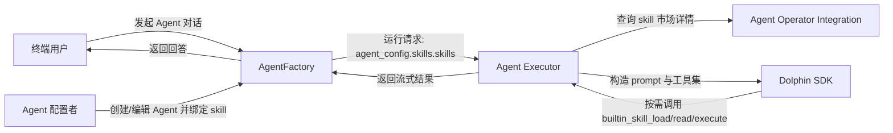
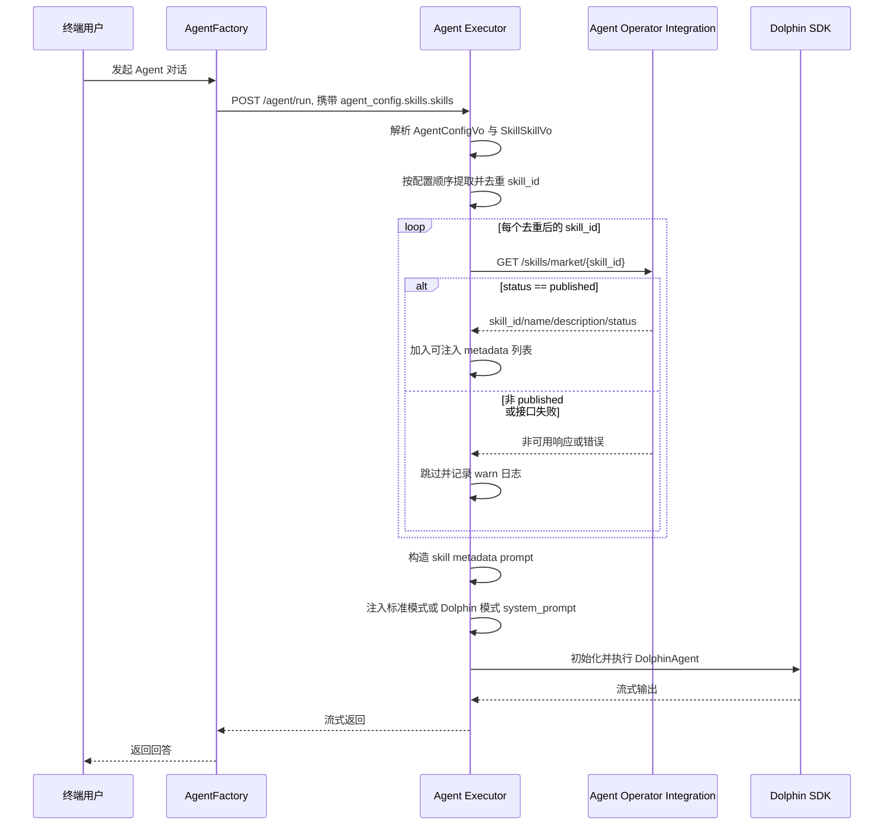
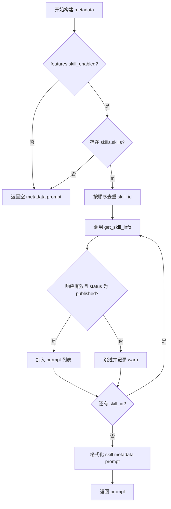

# 🏗️ Design Doc: Agent绑定Skill元数据注入

> 状态: Draft  
> 负责人: 待确认  
> Reviewers: 待确认  
> 关联 PRD: Agent绑定Skill元数据注入-prd.md  

---

# 📌 1. 概述（Overview）

## 1.1 背景

- 当前现状：
  - AgentFactory 已支持在 Agent 配置中保存 `skills.skills[].skill_id`，并在运行请求中透传给 Agent Executor。
  - Agent Executor 已支持内置 skill contract tools：`builtin_skill_load`、`builtin_skill_read_file`、`builtin_skill_execute_script`。
  - Agent Executor 当前只注入通用 skill 工具使用规则，未把当前 Agent 绑定的 skill 元数据注入系统提示词。

- 存在问题：
  - 模型运行时缺少绑定 skill 清单，无法稳定知道当前 Agent 可使用哪些 skill。
  - 已绑定 skill 与内置 skill 工具之间缺少运行时提示词连接，模型需要外部上下文提供 `skill_id` 才能有效调用。
  - 自定义 Dolphin 模式下 `/explore` 的 `system_prompt` 由配置语句决定，需要单独处理注入位置。

- 业务 / 技术背景：
  - 首版只覆盖 Agent Executor 后端运行时能力，不改 AgentFactory 配置保存链路和前端页面。
  - 注入内容限定为 `skill_id`、`name`、`description`，完整 `SKILL.md` 仍由 `builtin_skill_load(skill_id)` 按需加载。
  - skill 元数据来源为 Agent Operator Integration 私有接口 `GET /skills/market/{skill_id}`。

---

## 1.2 目标

- 标准模式下，当 Agent 配置绑定 `published` skill 时，Executor 生成的 `/explore system_prompt` 包含该 skill 的 `skill_id/name/description`。
- Dolphin 模式下，对可安全识别的 `/explore` 语句完成 `system_prompt` 注入或补齐。
- metadata 获取失败、无权限、404、非 `published` 状态时跳过该 skill，不中断 Agent 运行。
- 单次 Agent 运行内对重复 `skill_id` 去重，保证同一 `skill_id` 最多查询和注入一次。
- 保持现有 `SkillLoadTool`、`SkillReadTool`、`SkillExecuteTool` 的工具契约不变。

---

## 1.3 非目标（Out of Scope）

- 不改 AgentFactory 的 Agent 创建、编辑、保存 API。
- 不改前端配置页面和用户可见交互。
- 不注入完整 `SKILL.md`、文件清单、脚本清单、下载 URL、依赖信息或 `extend_info`。
- 不新增跨请求全局缓存、TTL、缓存失效机制。
- 不新增数据库表、Redis Key 或持久化结构。
- 不新增业务转化率指标和前端埋点。

---

## 1.4 术语说明（Optional）

| 术语 | 说明 |
|------|------|
| AgentFactory | 管理 Agent 配置的 Go 服务，负责保存绑定 skill 的配置关系。 |
| Agent Executor | 执行 Agent 的 Python 服务，负责构造 Dolphin prompt、注册工具并调用 Dolphin SDK。 |
| Agent Operator Integration | 提供工具、MCP、skill 市场详情和 skill 执行相关内部 API 的服务。 |
| 绑定 skill | Agent 配置中 `skills.skills[]` 表达的 skill 绑定项，首版只使用 `skill_id`。 |
| skill metadata | 从 skill 市场详情接口读取的 `skill_id`、`name`、`description`、`status`。 |
| 标准模式 | `agent_config.is_dolphin_mode == false`，Executor 自动生成 `/explore` Dolphin 语句。 |
| Dolphin 模式 | `agent_config.is_dolphin_mode == true`，使用配置中的 `pre_dolphin`、`dolphin`、`post_dolphin`。 |

---

# 🏗️ 2. 整体设计（HLD）

> 本章节关注系统“怎么搭建”，不涉及具体实现细节

---

## 🌍 2.1 系统上下文（C4 - Level 1）

### 参与者
- 用户：终端用户通过 Agent 对话入口发起运行请求。
- 外部系统：无第三方外部系统。
- 第三方服务：无。
- 内部系统：AgentFactory、Agent Executor、Agent Operator Integration、Dolphin SDK。

### 系统关系



---

## 🧱 2.2 容器架构（C4 - Level 2）

| 容器 | 技术栈 | 职责 |
|------|--------|------|
| AgentFactory | Go | 管理 Agent 配置，运行时将 Agent 配置和输入转发给 Agent Executor。 |
| Agent Executor API | FastAPI / Python | 接收 Agent 运行请求，构造 `AgentConfigVo`、`AgentInputVo` 和请求上下文。 |
| Agent Executor Core | Python | 构造 LLM 配置、skill metadata prompt、Dolphin prompt、工具集并调用 Dolphin SDK。 |
| Agent Operator Integration | HTTP API | 提供 `GET /skills/market/{skill_id}` 返回 skill 市场详情。 |
| Dolphin SDK | Python Library | 解析 Dolphin 语句，执行 `/explore` 和工具调用。 |

---

### 容器交互

```mermaid
flowchart TB
    subgraph factory[AgentFactory]
        AFRun[Agent 运行服务]
        AFConfig[Agent 配置数据]
    end

    subgraph executor[Agent Executor]
        Router[run_agent_v2 路由]
        Core[agent_core_v2 / run_dolphin]
        Prompt[PromptBuilder]
        Metadata[SkillMetadataBuilder]
        Tools[build_tools / skill_contract_tools]
    end

    subgraph oi[Agent Operator Integration]
        SkillMarket[Skill 市场详情 API]
    end

    subgraph sdk[Dolphin SDK]
        Explore[/explore 执行]
        ToolCall[工具调用]
    end

    AFConfig --> AFRun
    AFRun -->|agent_config + agent_input| Router
    Router --> Core
    Core --> Metadata
    Metadata -->|GET /skills/market/{skill_id}| SkillMarket
    Metadata --> Prompt
    Core --> Tools
    Prompt --> Explore
    Tools --> ToolCall
```

---

## 🧩 2.3 组件设计（C4 - Level 3）

### Agent Executor 组件

| 组件 | 职责 |
|------|------|
| `AgentConfigVo` | 解析 Agent 配置，补齐 `skills.skills[]` 强类型字段。 |
| `SkillSkillVo` | 表达绑定 skill 项，首版字段为 `skill_id`。 |
| `AgentOperatorIntegrationService.get_skill_info` | 调用 operator-integration skill 市场详情接口，并在失败时返回 `None`。 |
| `SkillMetadataBuilder` | 从 `AgentConfigVo.skills.skills` 提取 skill_id、请求内去重、查询详情、过滤状态、生成 prompt 片段。 |
| `PromptBuilder` | 接收 skill metadata prompt，标准模式直接组合系统提示词，Dolphin 模式改写 `/explore` 的 `system_prompt`。 |
| `run_dolphin` | 在构造 Dolphin prompt 前调用 metadata builder，并将结果传给 `PromptBuilder`。 |
| `build_tools` | 保持现有逻辑，继续注册 built-in skill contract tools。 |

```mermaid
flowchart LR
    Run[run_dolphin] --> Meta[SkillMetadataBuilder]
    Meta --> Config[AgentConfigVo.skills.skills]
    Meta --> OIClient[AgentOperatorIntegrationService.get_skill_info]
    OIClient --> OIAPI[GET /skills/market/{skill_id}]
    Meta --> PromptText[skill metadata prompt]
    Run --> PB[PromptBuilder]
    PromptText --> PB
    PB --> Standard[标准模式 /explore system_prompt]
    PB --> Dolphin[自定义 Dolphin /explore system_prompt]
    Run --> Tools[build_tools]
    Tools --> Builtin[builtin_skill_load/read_file/execute_script]
```

---

## 🔄 2.4 数据流（Data Flow）

### 主流程



### 子流程（可选）



---

## ⚖️ 2.5 关键设计决策（Design Decisions）

| 决策 | 说明 |
|------|------|
| 使用 `AgentOperatorIntegrationService` 而不是 `AgentFactoryService` 查询 skill 信息 | `/skills/market/{skill_id}` 属于 operator-integration internal-v1 API，放在现有 operator-integration 客户端中符合服务边界。 |
| 只注入 `skill_id/name/description` | 控制 token 成本和信息暴露范围，完整 skill 内容由 `builtin_skill_load(skill_id)` 按需加载。 |
| 仅注入 `published` 状态 skill | 保证注入给模型的 skill 是运行时可用能力，避免 offline/unpublish 引导模型调用不可用 skill。 |
| metadata 获取失败时跳过 | 该能力是增强型提示词注入，不能因单个 skill 异常影响 Agent 主流程可用性。 |
| 请求内去重，不做全局缓存 | 避免引入跨请求一致性和 TTL 设计；首版优先保证实现简单、行为可预测。 |
| Dolphin 模式采用保守改写 | 自定义 Dolphin 语句表达力高，无法安全识别的 explore 保持原样，降低语法破坏风险。 |
| 复用 `features.skill_enabled` 总开关 | 与现有 built-in skill tools 和 `_SKILL_USAGE_RULES` 行为保持一致。 |

---

## 🚀 2.6 部署架构（Deployment）

- 部署环境：现有 Agent Backend 部署环境，Helm values 中已有 `agentExecutor.skillEnabled` 配置。
- 拓扑结构：不新增服务、不新增存储、不新增网络入口；只更新 Agent Executor 镜像或代码包。
- 扩展策略：沿用 Agent Executor 现有水平扩展策略；metadata 查询为每次请求内短链路 HTTP 调用。
- 回滚边界：回滚 Agent Executor 版本即可恢复到不注入绑定 skill metadata 的行为。

```mermaid
flowchart LR
    subgraph k8s[Kubernetes 集群]
        AFPod[agent-factory Pod]
        AEPod[agent-executor Pod]
        OIPod[agent-operator-integration Pod]
    end

    AFPod -->|内部 HTTP: Agent Run| AEPod
    AEPod -->|内部 HTTP: /skills/market/{skill_id}| OIPod
```

---

## 🔐 2.7 非功能设计

### 性能
- 对 `skills.skills[].skill_id` 做请求内有序去重，同一运行请求中同一 skill 只查询一次。
- 不下载 `SKILL.md`，不读取文件清单，降低运行前 token 和 I/O 成本。
- metadata 查询串行执行即可满足首版实现；如后续绑定 skill 数量显著增加，再评估并发查询和限流。

### 可用性
- `get_skill_info` 非 200、异常、响应结构不符合预期时返回 `None`，上层跳过失败项。
- operator-integration 整体不可用时，Agent 仍按无绑定 metadata 的原流程运行。
- Dolphin 模式单个 `/explore` 注入失败不影响其他 `/explore` 和整体 Agent 运行。

### 安全
- 复用现有请求头机制向 operator-integration 传递身份和业务域信息。
- 不注入 `dependencies`、`extend_info`、下载 URL、文件路径、脚本命令和沙箱执行信息。
- 非 `published` skill 不注入给模型。

### 可观测性
- tracing：在 metadata builder 和 prompt builder 中记录 Agent ID、Agent Run ID、skill_id、可注入数量。
- logging：记录 skill 详情获取失败、状态跳过、Dolphin 注入跳过、注入成功摘要。
- metrics：首版不新增指标，后续根据运营分析需求补充。

---

# 🔧 3. 详细设计（LLD）

> 本章节关注“如何实现”，开发可直接参考

---

## 🌐 3.1 API 设计

### 查询 Skill 市场详情

**Endpoint:** `GET /api/agent-operator-integration/internal-v1/skills/market/{skill_id}`

**所属客户端:** `agent-executor/app/driven/dip/agent_operator_integration_service.py`

**方法签名:**

```python
async def get_skill_info(self, skill_id: str) -> dict | None:
    ...
```

**Request:**

```http
GET /api/agent-operator-integration/internal-v1/skills/market/{skill_id}
x-business-domain: {business_domain_id}
x-account-id: {account_id}
x-account-type: {account_type}
```

**Response:**

```json
{
  "code": 0,
  "msg": "success",
  "data": {
    "skill_id": "skill-123",
    "name": "文档总结",
    "description": "用于读取文档并生成结构化总结",
    "version": "1.0.0",
    "status": "published",
    "source": "market",
    "dependencies": {},
    "extend_info": {},
    "category": "system",
    "category_name": "系统"
  }
}
```

**Executor 使用字段:**

| 字段 | 是否必需 | 说明 |
|------|----------|------|
| `skill_id` | 是 | 缺失时跳过该 skill。 |
| `name` | 否 | 可为空，不伪造默认名称。 |
| `description` | 否 | 可为空，不伪造默认描述。 |
| `status` | 是 | 仅 `published` 可注入。 |

**失败返回:**

- HTTP 非 200：记录错误日志，返回 `None`。
- 网络异常：记录错误日志，返回 `None`。
- JSON 解析异常：记录错误日志，返回 `None`。
- `data` 缺失：记录 warn 日志，返回 `None`。

---

## 🗂️ 3.2 数据模型

### `SkillVo`

| 字段 | 类型 | 说明 |
|------|------|------|
| `tools` | `list[ToolSkillVo]` | 既有工具技能配置。 |
| `agents` | `list[AgentSkillVo]` | 既有 Agent 技能配置。 |
| `mcps` | `list[McpSkillVo]` | 既有 MCP 配置。 |
| `skills` | `list[SkillSkillVo]` | 新增绑定 skill 配置。 |

### `SkillSkillVo`

| 字段 | 类型 | 说明 |
|------|------|------|
| `skill_id` | `str` | 绑定 skill 的唯一标识，空值在构建 metadata 时跳过。 |

### `SkillMetadata`

| 字段 | 类型 | 说明 |
|------|------|------|
| `skill_id` | `str` | skill 唯一标识。 |
| `name` | `str` | skill 名称。 |
| `description` | `str` | skill 描述。 |
| `status` | `str` | skill 状态，首版仅接受 `published`。 |

### `SkillMetadataBuildResult`

| 字段 | 类型 | 说明 |
|------|------|------|
| `items` | `list[SkillMetadata]` | 可注入的 skill metadata 列表。 |
| `prompt` | `str` | 格式化后的系统提示词片段。 |
| `skipped_count` | `int` | 被跳过的 skill 数量，仅用于日志和 tracing。 |

---

## 💾 3.3 存储设计

- 存储类型：无新增存储。
- 数据分布：skill metadata 只存在于单次 Agent 运行内存中，不落库、不写 Redis。
- 索引设计：无新增索引。
- 一致性策略：每次 Agent 运行从 operator-integration 读取当前 skill 市场详情，确保不受跨请求缓存陈旧数据影响。

---

## 🔁 3.4 核心流程（详细）

### 标准模式注入流程

1. `run_dolphin` 完成 `build_llm_config` 后，调用 `SkillMetadataBuilder.build(agent_config, headers)`。
2. `SkillMetadataBuilder` 检查 `Config.features.skill_enabled`：
   - 为 `false` 时返回空 prompt。
   - 为 `true` 时继续处理。
3. 读取 `agent_config.skills.skills`：
   - `skills` 或 `skills.skills` 为空时返回空 prompt。
   - 跳过空 `skill_id`。
   - 使用 `seen_skill_ids` 保持顺序去重。
4. 针对每个去重后的 `skill_id`：
   - 设置或复用 `AgentOperatorIntegrationService` 的请求头。
   - 调用 `get_skill_info(skill_id)`。
   - 返回为空时记录 warn 并跳过。
   - `status != "published"` 时记录 warn 并跳过。
   - 缺少 `skill_id` 时记录 warn 并跳过。
   - 加入 `SkillMetadata` 列表。
5. 将 metadata 列表格式化为 prompt：
   - 无可注入项时返回空 prompt。
   - 有可注入项时生成 `## Bound Agent Skills` 片段。
6. `run_dolphin` 创建 `PromptBuilder(config, temp_files, skill_metadata_prompt=prompt)`。
7. `PromptBuilder.build()` 在标准模式下组合：
   - `_SKILL_USAGE_RULES`
   - `{__BUILTIN_SKILL_RULES__}`
   - `skill_metadata_prompt`
   - 用户或 plan mode 系统提示词
8. 使用 `json.dumps(..., ensure_ascii=False)` 转义组合后的 system prompt，构造 `/explore`。

### Dolphin 模式注入流程

1. `PromptBuilder.build()` 拼接启用的 `pre_dolphin`、`agent_config.dolphin`、启用的 `post_dolphin`。
2. 当 `Config.features.skill_enabled == true` 且 `skill_metadata_prompt` 非空时，调用 `inject_skill_metadata_to_dolphin_prompt(dolphin_prompt, skill_metadata_prompt)`。
3. 注入函数扫描 `/explore/(` 块：
   - 识别匹配的参数括号范围。
   - 在参数列表内查找顶层 `system_prompt=`。
4. 若存在 `system_prompt`：
   - 对字符串字面量形式的 system prompt，解析原值并 prepend metadata。
   - 重新使用 `json.dumps(..., ensure_ascii=False)` 输出字符串。
5. 若不存在 `system_prompt`：
   - 在参数列表开头补入 `system_prompt=<metadata_json_string>`。
6. 若无法识别括号边界、字符串边界或顶层参数：
   - 保持原 `/explore` 块不变。
   - 记录 warn 日志。

```mermaid
flowchart TD
    Start[开始处理 Dolphin Prompt] --> HasMeta{metadata prompt 非空?}
    HasMeta -- 否 --> ReturnOriginal[返回原 prompt]
    HasMeta -- 是 --> Scan[扫描 /explore/( 参数块]
    Scan --> Found{找到可识别 explore?}
    Found -- 否 --> ReturnOriginal
    Found -- 是 --> HasSP{存在 system_prompt?}
    HasSP -- 是 --> SafeString{system_prompt 是安全字符串?}
    SafeString -- 是 --> Prepend[prepend metadata 并重写字符串]
    SafeString -- 否 --> Skip[保持原块并记录 warn]
    HasSP -- 否 --> Insert[补入 system_prompt 参数]
    Prepend --> Next{还有 explore?}
    Insert --> Next
    Skip --> Next
    Next -- 是 --> Scan
    Next -- 否 --> ReturnNew[返回新 prompt]
```

---

## 🧠 3.5 关键逻辑设计

### Metadata Builder
- 输入：`AgentConfigVo`、请求 headers、`Config.features.skill_enabled`。
- 输出：格式化后的 `skill_metadata_prompt`。
- 去重规则：
  - 使用 `set` 记录已处理 `skill_id`。
  - 遍历顺序以配置顺序为准。
  - 空字符串、`None` 和非字符串值统一跳过。
- 状态规则：
  - 仅 `status == "published"` 注入。
  - `offline`、`unpublish`、空状态均跳过。
- 日志规则：
  - 成功注入记录数量和 skill_id 列表。
  - 跳过项记录 skill_id 和原因，不记录敏感 header。

### Prompt 片段格式

```text
## Bound Agent Skills

The agent is configured with these skills. Use builtin_skill_load(skill_id) before using a skill.

- skill_id: skill-123
  name: 文档总结
  description: 用于读取文档并生成结构化总结
```

### 标准模式组合顺序
- 有用户系统提示词：
  1. `_SKILL_USAGE_RULES`
  2. `{__BUILTIN_SKILL_RULES__}`
  3. `skill_metadata_prompt`
  4. 用户系统提示词或 plan mode 包装后的系统提示词
- 无用户系统提示词：
  1. `_SKILL_USAGE_RULES`
  2. `{__BUILTIN_SKILL_RULES__}`
  3. `skill_metadata_prompt`

### Dolphin 模式改写边界
- 只改写 `/explore/(...)` 参数块。
- 只处理字符串字面量或缺失的 `system_prompt`。
- 不处理表达式拼接、变量引用、嵌套复杂结构中的 system prompt。
- 无法安全改写时跳过，避免破坏用户自定义 Dolphin 语法。

---

## ❗ 3.6 错误处理

- 配置解析错误：
  - `skills` 或 `skills.skills` 结构异常时，按空绑定 skill 处理。
  - 记录 warn 日志，Agent 继续运行。
- skill 详情接口非 200：
  - `get_skill_info` 返回 `None`。
  - metadata builder 跳过该 skill。
- skill 详情接口异常：
  - 捕获异常，记录错误日志，返回 `None`。
- 响应结构缺失：
  - `data`、`skill_id` 或 `status` 缺失时跳过。
- 状态不可注入：
  - `status != "published"` 时跳过。
- prompt 格式化异常：
  - 返回空 metadata prompt，保留原 prompt 行为。
- Dolphin 注入失败：
  - 单个 `/explore` 注入失败时保持该块原样。
  - 不抛出异常到 Agent 运行主流程。

---

## ⚙️ 3.7 配置设计

| 配置项 | 默认值 | 说明 |
|--------|--------|------|
| `features.skill_enabled` | `true` | 既有 skill 能力总开关；为 `false` 时不注册内置 skill 工具，也不注入 skill metadata。 |
| `services.agent_operator_integration.host` | 环境配置 | operator-integration 服务地址，复用现有配置。 |
| `services.agent_operator_integration.port` | 环境配置 | operator-integration 服务端口，复用现有配置。 |

首版不新增配置项。Dolphin 注入能力随 `features.skill_enabled` 生效，避免出现工具未注册但 prompt 引导模型调用 skill 工具的状态。

---

## 📊 3.8 可观测性实现

- tracing：
  - `SkillMetadataBuilder.build` 增加内部 span。
  - span 属性：
    - `agent_id`
    - `agent_run_id`
    - `skill_metadata.bound_count`
    - `skill_metadata.injected_count`
    - `skill_metadata.skipped_count`
  - 单个 `skill_id` 可在 debug 日志中记录，tracing 中避免记录过长列表。

- metrics：
  - 首版不新增 metrics。
  - 后续可扩展 `skill_metadata_fetch_success_total`、`skill_metadata_fetch_skip_total`、`skill_metadata_injected_total`。

- logging：
  - `info`：metadata 注入成功，记录 injected_count 和 skill_id 列表。
  - `warn`：skill 跳过，记录 skill_id 和 skip_reason。
  - `warn`：Dolphin `/explore` 无法安全注入，记录 agent_id、agent_run_id 和原因。
  - `error`：operator-integration 调用异常，沿用 `get_error_log_json` 格式。

---

# ⚠️ 4. 风险与权衡（Risks & Trade-offs）

| 风险 | 影响 | 解决方案 |
|------|------|----------|
| Dolphin 自定义语法复杂，改写 `/explore` 存在语法破坏风险 | Agent 运行失败或行为变化 | 只处理可安全识别的字符串字面量和缺失参数；无法识别时保持原样并记录日志。 |
| 绑定 skill 数量多导致运行前 HTTP 调用增多 | 增加首包延迟 | 请求内去重；首版不做全局缓存，后续根据实际数量评估并发查询或 TTL 缓存。 |
| skill 描述质量不足 | 模型选择 skill 的准确性下降 | 首版仅提供 metadata 入口；完整使用规则仍由 `builtin_skill_load` 加载 `SKILL.md` 后获得。 |
| operator-integration 不可用 | metadata 无法注入 | 将 metadata 注入设计为增强能力，失败时跳过并继续 Agent 主流程。 |
| `features.skill_enabled` 被关闭 | prompt 注入和工具注册同时关闭 | 沿用总开关，避免 prompt 引导模型调用未注册工具。 |

---

# 🧪 5. 测试策略（Testing Strategy）

- 单元测试：
  - `SkillVo` 支持解析 `skills.skills[].skill_id`，并兼容 `tools/agents/mcps`。
  - `AgentOperatorIntegrationService.get_skill_info` 覆盖成功、非 200、异常、缺失 data。
  - `SkillMetadataBuilder` 覆盖空配置、空 skill_id、重复 skill_id、非 published、成功注入、接口失败跳过。
  - `PromptBuilder` 标准模式覆盖有用户 system prompt、无用户 system prompt、plan mode、`features.skill_enabled=false`。
  - Dolphin 注入函数覆盖已有 `system_prompt`、缺失 `system_prompt`、多个 `/explore`、无法安全解析。

- 集成测试：
  - 使用 mock operator-integration 响应，运行 Executor 单次 Agent 请求，断言生成 prompt 包含 metadata。
  - 使用 operator-integration 失败响应，断言 Agent 运行继续。

- 压测：
  - 首版不设置压测准入指标。
  - 测试环境记录绑定 1、5、10 个 skill 时 metadata 构建耗时，作为后续缓存或并发优化依据。

- 建议回归命令：
  - `uv run pytest test/unit/driven/dip/test_agent_operator_integration_service.py -v`
  - `uv run pytest test/unit/domain/vo/agentvo -v`
  - `uv run pytest test/unit/logic/agent_core_logic_v2/test_prompt_builder.py -v`
  - `uv run pytest test/unit/logic/agent_core_logic_v2/test_run_dolphin.py -v`

---

# 📅 6. 发布与回滚（Release Plan）

### 发布步骤
1. 完成代码实现和单元测试。
2. 在测试环境部署 Agent Executor。
3. 使用绑定 `published` skill 的 Agent 验证标准模式 prompt 注入。
4. 使用包含 `/explore` 的 Dolphin 模式 Agent 验证 prompt 注入。
5. 使用 404、403、非 `published` skill 验证失败跳过。
6. 观察 Executor 日志，确认注入数量、跳过原因和异常降级符合预期。
7. 随 Agent Executor 后端版本发布到目标环境。

### 回滚方案
- 回滚 Agent Executor 到上一版本。
- 如果只需要关闭能力，可将 `features.skill_enabled` 配置为 `false`，该操作会同时关闭内置 skill 工具和绑定 skill metadata 注入。
- 回滚不需要数据库迁移回滚，不涉及 AgentFactory 配置数据变更。

---

# 🔗 7. 附录（Appendix）

## 相关文档
- PRD: Agent绑定Skill元数据注入-prd.md
- 其他设计：待确认

## 参考资料
- operator-integration skill API: `/Users/guochenguang/project/kweaver/adp/execution-factory/operator-integration/docs/apis/api_private/skill.yaml`
- Agent Executor operator-integration 客户端: `agent-executor/app/driven/dip/agent_operator_integration_service.py`
- Agent Executor prompt 构建逻辑: `agent-executor/app/logic/agent_core_logic_v2/prompt_builder.py`
- Agent Executor skill contract tools: `agent-executor/app/common/tool_v2/skill_contract_tools.py`
- Agent Executor 运行入口: `agent-executor/app/logic/agent_core_logic_v2/run_dolphin.py`

---
