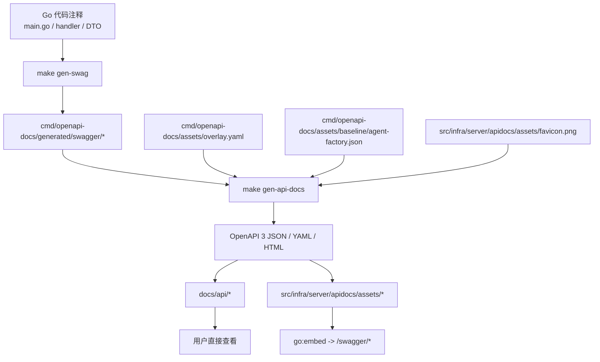

# Agent Factory Swagger / OpenAPI 生成链路

## 一句话结论

这套链路分两步：

1. `make gen-swag`
   - 从 Go 注释生成 Swagger 2.0 中间产物
2. `make gen-api-docs`
   - 把中间产物加工成最终 OpenAPI 3 文档，并同步运行时副本

## 流程图



## 每一步做什么

### 第一步：`make gen-swag`

对应命令：

```bash
go run github.com/swaggo/swag/cmd/swag@v1.16.6 init -g main.go -o cmd/openapi-docs/generated/swagger --parseDependency
```

输入来源：

- `main.go` 顶部的全局注释
- handler 方法上的 `@Summary` / `@Router` / `@Success` 等注释
- 请求响应结构体

输出：

- `../generated/swagger/swagger.json`
- `../generated/swagger/swagger.yaml`
- `../generated/swagger/docs.go`

### 第二步：`make gen-api-docs`

对应命令：

```bash
go run ./cmd/openapi-docs generate
```

输入：

- `../generated/swagger/swagger.json`
- `../assets/overlay.yaml`
- `../assets/baseline/agent-factory.json`
- `../../src/infra/server/apidocs/assets/favicon.png`

输出：

- `../../docs/api/agent-factory.json`
- `../../docs/api/agent-factory.yaml`
- `../../docs/api/agent-factory.html`
- `../../docs/api/favicon.png`
- `../../src/infra/server/apidocs/assets/*`

## 运行时怎么用

服务不会直接读取 `docs/api` 目录，而是读取运行时副本：

- `../../src/infra/server/apidocs/embed.go`
- `../../src/infra/server/httpserver/router_swagger.go`

`router_swagger.go` 暴露：

- `/swagger/index.html`
- `/swagger/doc.json`
- `/swagger/doc.yaml`
- `/swagger/favicon.png`

## 为什么要保留两套最终文件

### `docs/api/*`

给普通用户、仓库浏览者和文档维护者直接查看。

### `src/infra/server/apidocs/assets/*`

给运行时 `go:embed` 使用，避免把 Go 源文件放进 `docs/` 目录。

`favicon.png` 也遵循同样规则，所以当前最少保留 2 份，而不是 1 份：

- `docs/api/favicon.png`
- `src/infra/server/apidocs/assets/favicon.png`

## 校验点

`make validate-api-docs` 会检查：

1. OpenAPI JSON 能否通过 `kin-openapi` 校验
2. 路径数和 operation 数是否符合预期
3. HTML 是否包含 Scalar 所需标记
4. `docs/api/*` 与 `src/infra/server/apidocs/assets/*` 是否完全一致

## 相关文档

- 自动化维护说明：查看 [OPENAPI_AUTOMATION_GUIDE.md](./OPENAPI_AUTOMATION_GUIDE.md)
- CLI 入口说明：查看 [../README.md](../README.md)
- 对外使用说明：查看 [../../docs/api/README.md](../../docs/api/README.md)
