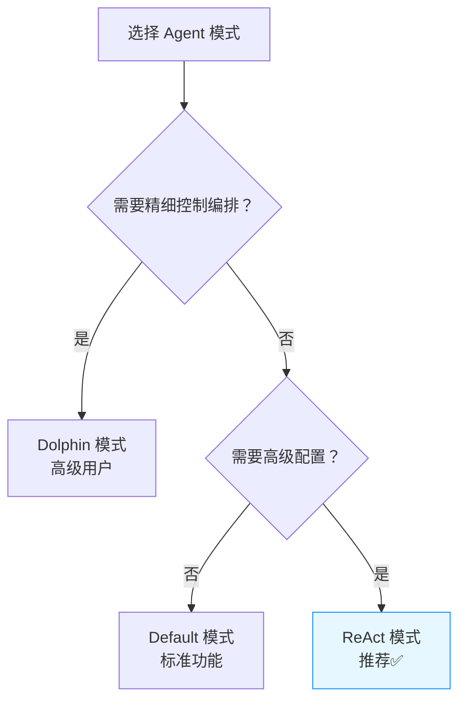

# Agent Mode 设计说明（简版）

## 1. 文档目的

本文面向产品经理、前端开发、测试等非后端实现人员，用于说明 `Agent Mode` 在 Agent Factory 后端中的对外能力变化，便于后续进行产品方案设计、前后端协议对接与测试设计。

本文只讨论 **agent-factory 后端能力**，不包含当前本地 `agent-web` 的试验性页面实现。

---

## 2. 背景

在原有 Agent 配置中，Dolphin 模式需要用户书写复杂的 Dolphin 语句，这对许多用户来说门槛过高，学习和使用成本较大。为了解决这一问题，我们引入了 ReAct 模式作为更低门槛的替代方案。

### 核心问题
- Dolphin 模式的 Dolphin 语句书写难度大，需要用户掌握特定的语法
- 新用户上手困难，影响 Agent 的使用效率
- 缺乏开箱即用的智能模式

### 解决方案
- **新增 ReAct 模式**：无需书写 Dolphin 语句，大幅降低使用门槛
- **保留 Dolphin 模式**：满足高级用户的精细控制需求
- **统一模式表达**：通过 `config.mode` 字段明确区分不同模式
- **兼容性保证**：原有的角色指令模式仍可正常使用，但新推荐使用 ReAct 模式
- **未来规划**：ReAct 模式包含 default 模式的所有能力，后续 default 仅用于兼容老数据，可能不再支持创建新的 Agent

本次调整的核心目标：

1. 用统一字段 `config.mode` 表达 Agent 模式
2. 为 `react` 模式引入明确的专属配置字段 `react_config`
3. 保留 Dolphin 模式的表达能力，并明确其相关字段含义
4. 新增一个专门创建 React Agent 的接口，便于前端/产品后续在交互层进行单独设计

---

## 3. 快速选择指南



## 4. 当前支持的 Agent Mode

### 4.1 模式概览

当前后端支持以下 3 种模式：

| mode | 推荐度 | 使用门槛 | 功能强度 | 主要使用场景 |
| --- | --- | --- | --- | --- |
| `react` | ⭐⭐⭐⭐⭐ | 低 | 中高 | 通用智能任务，平衡易用性与功能 |
| `default` | ⭐⭐⭐ | 极低 | 中等 | 标准智能任务，基础功能完备 |
| `dolphin` | ⭐⭐⭐⭐ | 高 | 最强 | 复杂任务编排，精细控制 |

### 4.2 模式详细说明

1. **`react`（推荐）**
   - 表示 ReAct 模式
   - **优势**：无需书写 Dolphin 语句，开箱即用
   - **包含 default 模式的所有能力**：完全兼容 default 模式的功能
   - 使用 `system_prompt` 作为主提示词
   - 使用 `react_config` 进行模式配置（可选）
   - 适合所有智能任务场景，是未来的主要模式

2. `default`（兼容模式）
   - 表示普通 Agent 模式
   - 主要通过 `system_prompt` 驱动
   - **注意**：react 模式已包含 default 的所有能力
   - **仅用于兼容老数据**：后续可能不再支持创建新的 default 模式 Agent
   - 建议新创建的 Agent 直接使用 react 模式

3. `dolphin`
   - 表示 Dolphin 模式
   - **适合高级用户**，需要书写 Dolphin 语句
   - 主要依赖 `dolphin`、`pre_dolphin`、`post_dolphin`
   - 新增了 `is_use_tool_id_in_dolphin` 用于细化 Dolphin 配置
   - 适合需要精细控制的复杂任务

---

## 5. 配置字段变化

### 5.1 新增 / 明确的关键字段

| 字段 | 类型 | 说明 |
| --- | --- | --- |
| `config.mode` | string | Agent 主模式字段，取值为 `default` / `dolphin` / `react` |
| `config.react_config` | object | ReAct 模式专属配置 |
| `config.is_use_tool_id_in_dolphin` | int | Dolphin 模式下是否使用 tool id |

### 5.2 `react_config` 结构

当前后端定义的 `react_config` 结构如下：

```json
{
  "react_config": {
    "disable_history_in_a_conversation": false,
    "disable_llm_cache": false
  }
}
```

字段含义：

| 字段 | 类型 | 说明 |
| --- | --- | --- |
| `disable_history_in_a_conversation` | bool | 是否禁用单次会话中的历史记录 |
| `disable_llm_cache` | bool | 是否禁用 LLM 缓存 |

### 5.3 命名调整

对外协议统一使用 `react_config`。

此前的旧字段 `non_dolphin_mode_config` 已不再作为对外协议字段使用，后续前端和产品侧对接时，应只使用 `react_config`。

---

## 6. 对外接口变化

### 6.1 普通创建接口

路径：

```text
POST /api/agent-factory/v3/agent
```

说明：

1. 仍然是通用的 Agent 创建接口
2. 请求体继续使用统一的 `config` 结构
3. 可以创建 `default` / `dolphin` / `react` 三种模式的 Agent

---

### 6.2 React Agent 专用创建接口

路径：

```text
POST /api/agent-factory/v3/agent/react
```

说明：

1. 请求体与普通创建接口完全一致
2. 该接口仅用于创建 `react` 模式 Agent
3. 如果请求体中的 `config.mode` 不为 `react`，后端会直接返回 `400`

适用场景：

1. 前端希望为 React Agent 设计独立创建入口
2. 产品希望在交互层区分“通用创建”与“React 专项创建”

---

### 6.3 更新接口

路径：

```text
PUT /api/agent-factory/v3/agent/{agent_id}
```

说明：

1. 更新接口继续沿用统一的 `config` 结构
2. 更新时同样遵循 `mode` 与相关字段的校验规则

---

### 6.4 详情接口

路径：

```text
GET /api/agent-factory/v3/agent/{agent_id}
```

说明：

1. 详情接口中的 `config` 会直接返回后端当前的标准配置结构
2. 如果某些历史数据的 `mode` 为空，后端会在响应时补齐一个可识别的 `mode`
3. 对外响应统一使用 `react_config`

这意味着前端在读取详情时，可以稳定依赖 `config.mode` 做展示和编辑分流。

---

## 7. 关键业务规则

### 7.1 `react_config` 只允许出现在 `react` 模式

如果：

```json
{
  "config": {
    "mode": "default",
    "react_config": {
      "disable_llm_cache": true
    }
  }
}
```

则该请求会被后端判定为非法。

### 7.2 `plan_mode` 不能与 Dolphin 模式同时启用

如果 Agent 处于 Dolphin 模式，则不能启用 `plan_mode`。


### 7.4 详情接口会补齐空的 `mode`

对于历史数据或旧数据，如果存储中 `mode` 为空，后端会在详情返回时补出一个可识别值：

1. 如果当前数据表现为 Dolphin 模式，则返回 `dolphin`
2. 否则返回 `default`


### 7.5 模式迁移建议

考虑到可维护性和功能完整性：
- **新创建的 Agent**：建议直接使用 `react` 模式
- **现有的 default 模式 Agent**：可以继续正常使用，或考虑迁移到 react 模式以获得更好的功能支持
- **react 模式优势**：不仅包含 default 的所有能力，还提供了更多高级配置选项

---

## 8. 对前端与产品的对接建议

后续进行页面和交互方案设计时，建议优先确认以下事项：

1. 是否需要在 UI 上直接暴露三种 `mode` 的选择
2. `react` 模式是否需要单独的创建入口
3. `react_config` 的两个布尔开关在页面上的摆放位置与默认值
4. `default` / `react` / `dolphin` 三种模式下，哪些字段需要显示、隐藏或禁用
5. 编辑页如何根据详情接口返回的 `config.mode` 进行回填和展示切换

---

## 9. 建议前后端统一的协议认知

为避免后续联调歧义，建议统一采用以下约定：

1. `mode` 是 Agent 模式的唯一主表达字段
2. `react_config` 是 ReAct 模式的唯一专属配置字段
3. `POST /v3/agent/react` 是一个语义化更强的专用创建入口，但其请求体结构不区别于普通创建接口
4. 前端读取详情时，以 `config.mode` 作为页面渲染与校验分支的主依据

---

## 10. 未来可能扩展的其他模式

为了持续提升用户体验，我们正在考虑引入更多模式：

- **Prompt 模式**：纯 LLM 问答场景
- **Plan 模式**：任务规划与执行场景

这些模式的具体实现时间和功能细节将在后续确定，当前主要聚焦于 ReAct 模式的完善和推广。

---

## 11. 相关文档

1. 对外 API 文档说明：`docs/api/README.md`
2. 详细后端实现说明：`Agent Mode 后端实现说明（详细版）.md`
