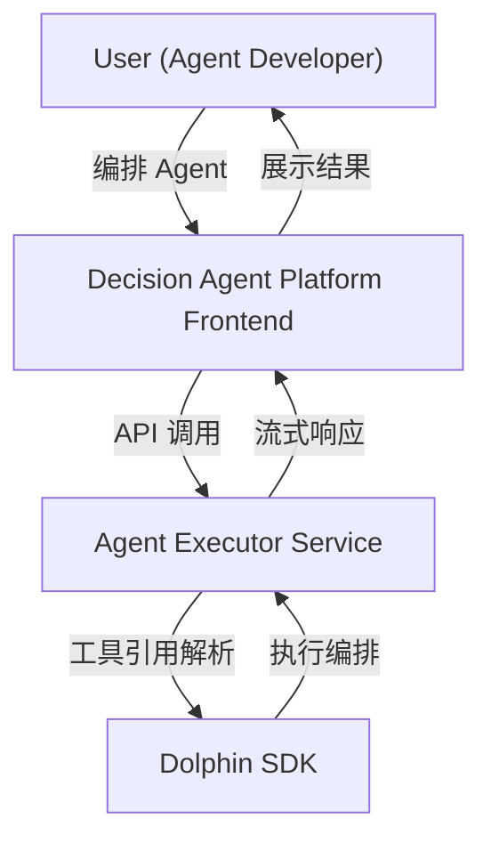
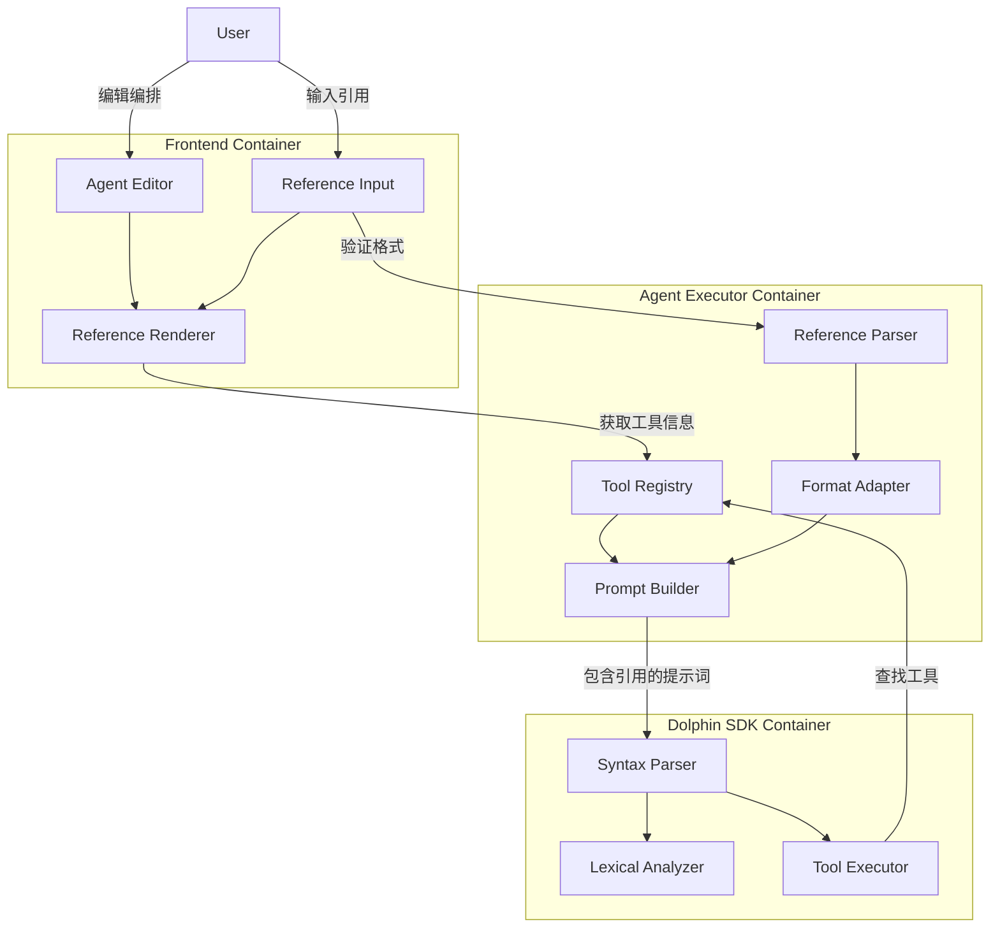
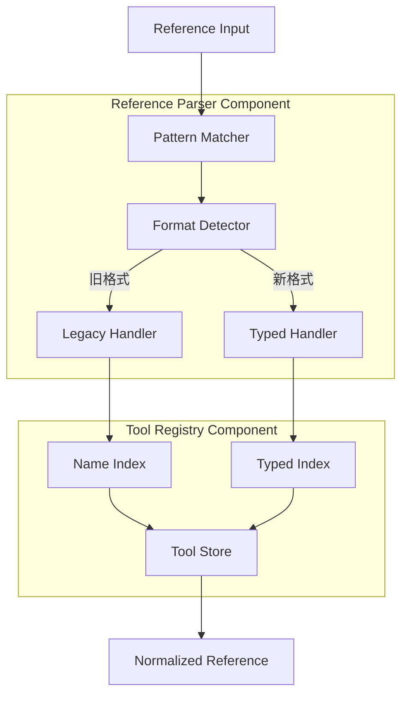
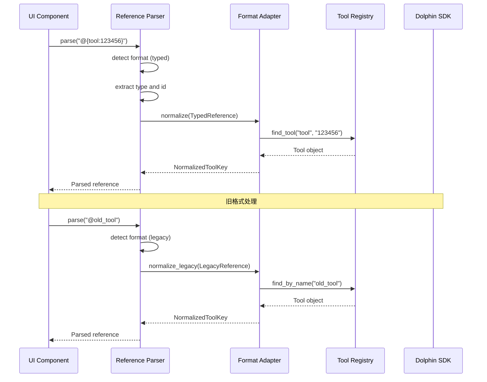
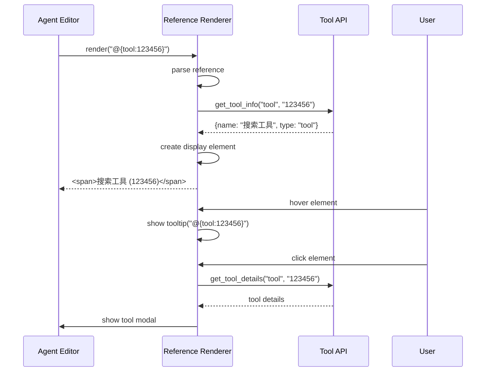
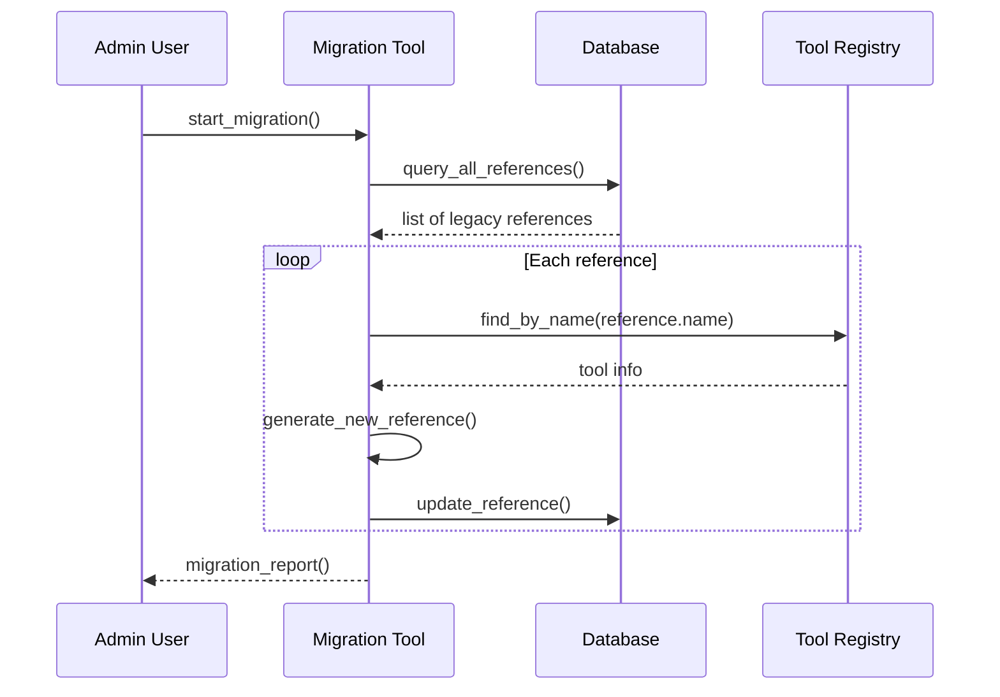

## 0. 目标与范围（再次明确）

### 0.1 核心目标
在 **Decision Agent Platform** 中实现 **工具引用格式改造**，用于：

1. 支持新的 @{tool_type:tool_id} 格式，提供稳定的工具引用
2. 保持对旧格式 @工具名称 的兼容性
3. 在 UI 层提供友好的展示和输入体验
4. 在 Dolphin SDK 层支持新格式的解析和执行

### 0.2 约束
+ 新格式必须符合 @{tool_type:tool_id} 规范
+ tool_type 仅限于：tool、agent、mcp
+ 保持向后兼容，支持平滑迁移
+ 性能不能低于现有实现
+ UI 层改动对用户透明

---

# 1. C4 架构设计（概念级）

## 1.1 Context 图



**系统边界说明**：

- **Decision Agent Platform Frontend**：负责 UI 展示、用户交互、格式渲染
- **Agent Executor Service**：负责工具管理、引用解析、编排执行
- **Dolphin SDK**：负责语法解析、语句执行、工具调用

---

## 1.2 Container 图



---

## 1.3 Component 图 - Reference Parser



---

# 2. 数据模型设计

## 2.1 工具引用模型

```python
from typing import TypedDict, Union, Optional
from enum import Enum

class ToolType(Enum):
    TOOL = "tool"
    AGENT = "agent"
    MCP = "mcp"

class TypedToolReference(TypedDict):
    """新格式引用模型"""
    type: ToolType
    tool_id: str
    raw: str  # 原始字符串 @{tool_type:tool_id}

class LegacyToolReference(TypedDict):
    """旧格式引用模型"""
    name: str
    raw: str  # 原始字符串 @tool_name

ToolReference = Union[TypedToolReference, LegacyToolReference]

class NormalizedToolKey(TypedDict):
    """标准化后的工具键"""
    type: ToolType
    tool_id: str
```

## 2.2 工具注册表模型

```python
class ToolRegistry:
    """双索引工具注册表"""
    def __init__(self):
        # 名称索引：支持旧格式查找
        self._name_index: Dict[str, Tool] = {}
        
        # 类型化索引：支持新格式查找
        self._typed_index: Dict[Tuple[ToolType, str], Tool] = {}
        
        # 反向索引：从工具到所有可能的引用
        self._reverse_index: Dict[Tool, List[ToolReference]] = {}
```

---

# 3. 接口设计

## 3.1 Reference Parser 接口

```python
class IReferenceParser(ABC):
    """引用解析器接口"""
    
    @abstractmethod
    def parse(self, reference: str) -> ToolReference:
        """解析引用字符串"""
        pass
    
    @abstractmethod
    def normalize(self, reference: ToolReference) -> NormalizedToolKey:
        """标准化引用"""
        pass
    
    @abstractmethod
    def is_supported(self, reference: str) -> bool:
        """检查是否支持该格式"""
        pass

class TypedReferenceParser(IReferenceParser):
    """新格式解析器"""
    PATTERN = re.compile(r"@\{(\w+):([^}]+)\}")
    
    def parse(self, reference: str) -> TypedToolReference:
        match = self.PATTERN.match(reference)
        if not match:
            raise ValueError(f"Invalid typed reference: {reference}")
        
        tool_type = ToolType(match.group(1))
        tool_id = match.group(2)
        
        return TypedToolReference(
            type=tool_type,
            tool_id=tool_id,
            raw=reference
        )

class LegacyReferenceParser(IReferenceParser):
    """旧格式解析器"""
    PATTERN = re.compile(r"@(\w+)")
    
    def parse(self, reference: str) -> LegacyToolReference:
        match = self.PATTERN.match(reference)
        if not match:
            raise ValueError(f"Invalid legacy reference: {reference}")
        
        return LegacyToolReference(
            name=match.group(1),
            raw=reference
        )
```

## 3.2 Format Adapter 接口

```python
class FormatAdapter:
    """格式适配器：统一新旧格式的处理"""
    
    def __init__(self):
        self._parsers = {
            'typed': TypedReferenceParser(),
            'legacy': LegacyReferenceParser()
        }
    
    def parse_and_normalize(self, reference: str) -> NormalizedToolKey:
        """解析并标准化引用"""
        # 尝试新格式解析
        if self._parsers['typed'].is_supported(reference):
            parsed = self._parsers['typed'].parse(reference)
            return self._parsers['typed'].normalize(parsed)
        
        # 回退到旧格式
        if self._parsers['legacy'].is_supported(reference):
            parsed = self._parsers['legacy'].parse(reference)
            return self._normalize_legacy(parsed)
        
        raise ValueError(f"Unsupported reference format: {reference}")
    
    def _normalize_legacy(self, reference: LegacyToolReference) -> NormalizedToolKey:
        """将旧格式标准化为新格式"""
        # 从工具注册表查找类型信息
        tool = self._registry.find_by_name(reference['name'])
        return NormalizedToolKey(
            type=tool.type,
            tool_id=tool.id
        )
```

## 3.3 UI 组件接口

```typescript
// React 组件接口
interface ToolReferenceRendererProps {
  reference: string;
  className?: string;
  showTooltip?: boolean;
  onClick?: (toolInfo: ToolInfo) => void;
}

interface ToolReferenceInputProps {
  value?: string;
  onChange: (value: string) => void;
  allowedTypes?: ToolType[];
  placeholder?: string;
  disabled?: boolean;
}

// 工具信息接口
interface ToolInfo {
  id: string;
  name: string;
  type: ToolType;
  description?: string;
}
```

---

# 4. 核心流程

## 4.1 引用解析流程



## 4.2 UI 渲染流程



## 4.3 格式迁移流程



---

# 5. 安全设计

## 5.1 输入验证
- 所有引用输入必须通过格式验证
- tool_type 必须在允许的枚举值内
- tool_id 不能包含特殊字符或路径遍历

## 5.2 权限控制
- 工具引用仅在当前 Agent 项目内有效
- 跨项目引用被明确禁止
- 敏感的工具 ID 在 UI 层脱敏展示

## 5.3 防护措施
```python
def validate_tool_reference(reference: str) -> bool:
    """验证工具引用的安全性"""
    # 长度限制
    if len(reference) > 100:
        return False
    
    # 格式验证
    if not re.match(r"^@\{\w+:[^}]+\}$", reference):
        return False
    
    # 路径遍历检查
    if ".." in reference or "/" in reference:
        return False
    
    return True
```

---

# 6. 部署与运维

## 6.1 配置管理
```yaml
# agent-executor.yaml
features:
  tool_reference:
    enable_typed_format: true
    migration_mode: "gradual"  # off | gradual | forced
    legacy_format_deadline: "2024-12-31"
```

## 6.2 监控指标
- 新旧格式使用比例
- 格式解析性能指标
- 迁移进度监控
- 错误率统计

## 6.3 运维工具
- 格式迁移脚本
- 引用一致性检查工具
- 性能基准测试工具

---

# 7. 测试策略

## 7.1 单元测试
```python
def test_reference_parser():
    # 测试新格式解析
    parser = TypedReferenceParser()
    ref = parser.parse("@{tool:123456}")
    assert ref['type'] == ToolType.TOOL
    assert ref['tool_id'] == "123456"
    
    # 测试旧格式解析
    legacy = LegacyReferenceParser()
    ref = legacy.parse("@old_tool")
    assert ref['name'] == "old_tool"

def test_format_adapter():
    # 测试格式适配
    adapter = FormatAdapter()
    
    # 新格式直接通过
    key = adapter.parse_and_normalize("@{tool:123456}")
    assert key['type'] == ToolType.TOOL
    
    # 旧格式需要转换
    key = adapter.parse_and_normalize("@old_tool")
    assert key['tool_id'] == "123456"  # 假设查找结果
```

## 7.2 集成测试
- UI 组件渲染测试
- Dolphin SDK 集成测试
- 端到端编排执行测试

## 7.3 性能测试
- 解析性能基准测试
- 大量引用场景测试
- 内存使用情况监控

---

# 8. 实施计划

## Phase 1: 基础设施（2 周）
- 实现 Reference Parser 组件
- 实现 Format Adapter
- 扩展 Tool Registry 支持双索引

## Phase 2: SDK 集成（1 周）
- 与 Dolphin SDK 团队协调
- 实现新格式解析支持
- 添加向后兼容逻辑

## Phase 3: UI 改造（2 周）
- 实现 Reference Renderer 组件
- 实现 Reference Input 组件
- 集成到 Agent Editor

## Phase 4: 迁移工具（1 周）
- 开发格式迁移脚本
- 实现迁移进度监控
- 准备运维文档

## Phase 5: 测试与上线（1 周）
- 完整测试验证
- 性能优化
- 灰度发布

---
