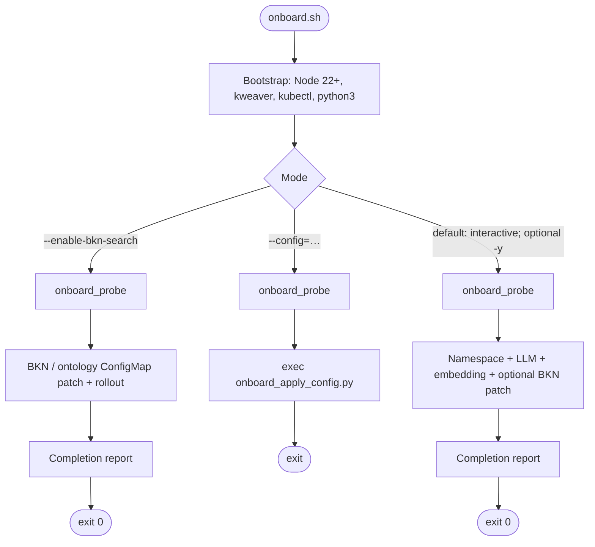
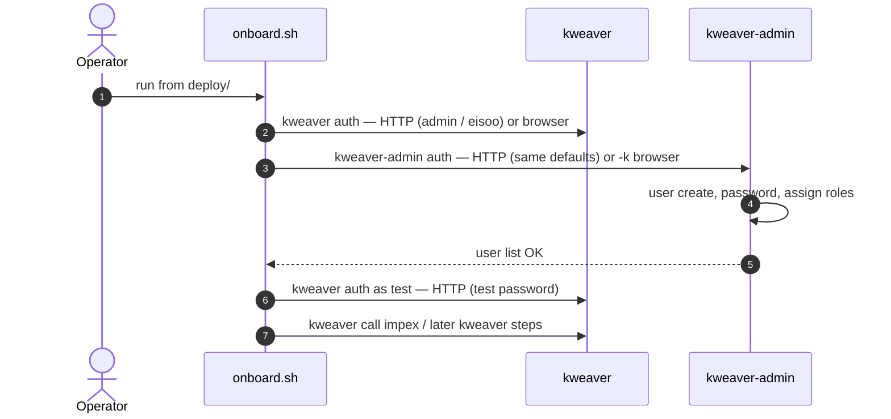

# 🚢 Ship and deploy

This page covers **prerequisites**, **install steps**, and **post-install checks** for KWeaver Core.

> Use the `deploy.sh` script under the `deploy/` directory from your product bundle or build tree.

---

## 🧱 Prerequisites

Prepare the host, network, and client tooling before you deploy.

### Host requirements

> Run installation as `root` or with `sudo`.

| Item | Minimum | Recommended |
| --- | --- | --- |
| OS | CentOS 8+, openEuler 23+ | CentOS 8+ |
| CPU | 16 cores | 16 cores |
| Memory | 48 GB | 64 GB |
| Disk | 200 GB | 500 GB |

### Host preparation (typical Linux)

```bash
# 1. Disable firewall (or open required ports per your policy)
systemctl stop firewalld && systemctl disable firewalld

# 2. Disable swap
swapoff -a && sed -i '/ swap / s/^/#/' /etc/fstab

# 3. SELinux permissive if needed
setenforce 0

# 4. Install container runtime (example: containerd)
# dnf install containerd.io   # adjust for your distro
```

> Exact steps depend on your OS; follow the deployment guide shipped with your release.

### Network access

The deploy scripts may need outbound access to mirrors and registries, for example:

| Domain | Purpose |
| --- | --- |
| `mirrors.aliyun.com` | RPM mirrors |
| `mirrors.tuna.tsinghua.edu.cn` | containerd RPM mirror |
| `registry.aliyuncs.com` | Kubernetes images |
| `swr.cn-east-3.myhuaweicloud.com` | KWeaver images |
| `repo.huaweicloud.com` | Helm binary |
| `kweaver-ai.github.io` | Helm chart repo |

### Client tooling (after deploy)

On your workstation (with network access to the cluster):

- **kubectl** — optional but useful for health checks
- **kweaver CLI** — install via npm package `@kweaver-ai/kweaver-sdk`

```bash
npm install -g @kweaver-ai/kweaver-sdk
# or: npx kweaver --help
```

> **Node.js 22+** is required. This matches the [`engines`](https://www.npmjs.com/package/@kweaver-ai/kweaver-sdk) field of `@kweaver-ai/kweaver-sdk` on npm (`node >= 22`); Node 18 will get `EBADENGINE` or runtime issues.

- **curl** — for raw HTTP API calls

---

## 📥 Enter the deploy directory

From your extracted bundle or repo:

```bash
cd deploy
chmod +x deploy.sh
```

> Adjust the path if your layout differs.

---

## 🚀 Install KWeaver Core

### Minimum install (recommended for first try)

Skips some optional modules (e.g. auth / business domain) for a lighter footprint:

```bash
./deploy.sh kweaver-core install --minimum
```

Equivalent flags:

```bash
./deploy.sh kweaver-core install --set auth.enabled=false --set businessDomain.enabled=false
```

### Full install

Includes auth and business-domain related components:

```bash
./deploy.sh kweaver-core install
```

> The script may prompt for **access address** and detect **API server address** automatically.

### Non-interactive install

```bash
./deploy.sh kweaver-core install \
  --access_address=<your-ip-or-domain> \
  --api_server_address=<nic-ip-for-k8s-api>
```

- `--access_address` — URL or IP clients use to reach KWeaver (ingress)
- `--api_server_address` — real NIC IP bound for the Kubernetes API server

### Custom ingress ports (optional)

```bash
export INGRESS_NGINX_HTTP_PORT=8080
export INGRESS_NGINX_HTTPS_PORT=8443
./deploy.sh kweaver-core install
```

### Useful commands

```bash
./deploy.sh kweaver-core status
./deploy.sh kweaver-core uninstall
./deploy.sh --help
```

### What gets installed

1. Single-node Kubernetes (if needed), storage, ingress
2. Data services: MariaDB, Redis, Kafka, ZooKeeper, OpenSearch (as defined by release manifests)
3. KWeaver Core application Helm charts

> For uninstall and cluster reset, follow the operations guide bundled with your release.

---

## Post-install: `onboard.sh`

After `deploy.sh kweaver-core install`, use **`deploy/onboard.sh`** on a machine with **Node 22+**, **`kubectl`** (cluster access), and **`kweaver`** (`npm i -g @kweaver-ai/kweaver-sdk`). Run from the `deploy/` directory:

```bash
cd deploy
bash ./onboard.sh --help
```

Typical flags:

| Flag | Meaning |
| --- | --- |
| *(none)* | Interactive: Node/kweaver install prompts (if needed), auth, then model/BKN prompts |
| `-y` / `--yes` | Auto-accept many prompts; still requires **full ISF** preconditions for test user + Context Loader (see below) |
| `--config=models.yaml` | Non-interactive: register models (and optional BKN) via YAML; see `deploy/conf/models.yaml.example` |
| `--enable-bkn-search` | BKN ConfigMap patch only (after probe) |
| `--skip-context-loader` | Skip ADP Context Loader toolbox import |

**Full ISF install (auth + business domain):** onboarding treats the cluster as “ISF” when related Helm releases or namespaces exist. Then the script expects, **in order**:

1. **`kweaver auth login`** — session in `~/.kweaver` (HTTP sign-in or browser; default access URL can be this host’s IP).
2. **`kweaver-admin`** on `PATH` — install with `npm i -g @kweaver-ai/kweaver-admin` if missing (script may offer this).
3. **`kweaver-admin auth login`** — **separate token store** from `kweaver`, but the **recommended path is the same HTTP sign-in** as step 1: user **`admin`**, password **`eisoo.com`** if the console is still on defaults (`-u` / `-p` / `--http-signin`); you can still choose a browser/device flow if you prefer. Required so `user list` works for creating user **`test`** and assigning **all roles** from `kweaver-admin role list`.
4. **User `test`** — create + password (default `111111` unless overridden) + role assignment. The script then runs **`kweaver auth login` as `test`** (HTTP) so the SDK session matches the business user for the next steps.
5. **Context Loader & model import** — `kweaver call` impex and interactive model registration use **`~/.kweaver` as `test`** (console `admin` often gets `403` on impex).

**Minimum install** (`--minimum`): only `kweaver auth` (often `--no-auth`); no `kweaver-admin` path.

At the end, an **English completion report** is printed unless `ONBOARD_NO_COMPLETION_REPORT=1`.

### `onboard.sh` flow (Mermaid)

**1) Entry: bootstrap, then one of three modes**



- **`onboard_probe` runs in all three modes** before BKN-only, YAML, or interactive model registration. On **ISF**, it includes **`kweaver-admin` HTTP auth (defaults like kweaver)**, **user `test`**, **`kweaver` relogin as `test`**, then **Context Loader** when applicable.
- **`-y`** does not set `--config`; it mainly auto-accepts **Node / npm -g** bootstrap and **ISF** `kweaver` / `kweaver-admin` **HTTP** auth defaults where applicable.

**2) What `onboard_probe` does (linear order; non-ISF steps are no-ops or skip quickly)**

```mermaid
flowchart TB
  subgraph probe["onboard_probe"]
    A["onboard_ensure_kweaver_auth\n(kweaver: HTTP default admin / eisoo or browser)"] --> B["kubectl: ns or target namespace"]
    B --> C["onboard_prepend_npm_global_bin_to_path"]
    C --> D["onboard_recommend_admin_cli (Helm / ns → ISF?)"]
    D --> E["onboard_ensure_kweaver_admin_for_isf\n(npm -g kweaver-admin on ISF if needed)"]
    E --> F["onboard_ensure_kweaver_admin_auth_for_isf\n(HTTP: same defaults as kweaver, or -k browser; -y: auto HTTP)"]
    F --> G1["onboard_offer_isf_test_user\ncreate or sync test + roles"]
    G1 --> G2["onboard_isf_relogin…\nkweaver auth as test (HTTP)"]
    G2 --> H["onboard_offer_context_loader_toolset\n(kweaver impex)"]
  end
```



On **minimum (non-ISF)** installs, the ISF-only steps do not require `kweaver-admin` and typically skip the **test** / **relogin** / impex gating; Context Loader may still run if the operator deployment exists.

**3) ISF full install: who talks to whom (user `test` + Context Loader impex)**



After **probe**, the default path continues with **Namespace + models + BKN** in this shell: **~/.kweaver** should already be **test** on ISF so those calls use the business user.

The admin CLI and the SDK use **separate** token files; both **default to the same HTTP account** for ISF. For impex, **`kweaver` must be signed in as `test`**, not the initial console `admin` session when the API returns 403.

---

## 🛡️ Administrator tool after a full install (kweaver-admin)

After a full install (with `auth.enabled=true` and `businessDomain.enabled=true`), platform-level operations — **users, organizations, roles, models, audit** — are managed via the standalone npm CLI [`@kweaver-ai/kweaver-admin`](https://github.com/kweaver-ai/kweaver-admin). It is complementary to the `kweaver` CLI from `kweaver-sdk`:

| CLI | Audience | Scope |
| --- | --- | --- |
| `kweaver` (`@kweaver-ai/kweaver-sdk`) | End users / Agents | BKN, Decision Agent, Action, Skill, query |
| `kweaver-admin` (`@kweaver-ai/kweaver-admin`) | Platform administrators | Users, organizations, roles, models, audit, raw HTTP |

**When to install:** after a full install (`./deploy.sh kweaver-core install` without `--minimum`). **On a `--minimum` install most `kweaver-admin` commands return 401 / 404 — that is expected, the relevant services are not deployed.**

**Backend services it talks to (from the kweaver-admin architecture doc):** `user-management` / `deploy-manager` / `deploy-auth` / `eacp` / `mf-model-manager` / OAuth2 (Hydra) — exactly the set enabled by a full install.

### 📥 Install

Requires **Node.js 22+** (same as [`@kweaver-ai/kweaver-sdk` on npm](https://www.npmjs.com/package/@kweaver-ai/kweaver-sdk)). Credentials are stored under `~/.kweaver-admin/platforms/`, isolated from `~/.kweaver/`.

```bash
npm install -g @kweaver-ai/kweaver-admin
kweaver-admin --version
kweaver-admin --help
```

### 🔑 Login

```bash
# Browser OAuth2 (skip TLS for self-signed certs)
kweaver-admin auth login https://<access-address> -k

# Username/password (CI / headless)
kweaver-admin auth login https://<access-address> -u <user> -p <password> -k

# Or via environment variables (CI / headless)
export KWEAVER_BASE_URL=https://<access-address>
export KWEAVER_ADMIN_TOKEN=<bearer-token>   # preferred; falls back to KWEAVER_TOKEN

# Inspect session and identity
kweaver-admin auth status
kweaver-admin auth whoami
kweaver-admin auth list
```

> The token stores of `kweaver-admin` and `kweaver` are independent — both can coexist on the same machine for separate admin / user identities.

### 🧰 Common admin tasks

#### Organizations (departments)

```bash
kweaver-admin org tree                # tree view of departments
kweaver-admin org list                # paginated list
kweaver-admin org create              # create a department
kweaver-admin org members <orgId>     # list members
```

#### Users

```bash
kweaver-admin user list
kweaver-admin user create --login alice            # default password 123456, forced change at first sign-in
kweaver-admin user reset-password -u alice         # admin reset
kweaver-admin user roles <userId>
kweaver-admin user assign-role <userId> <roleId>
kweaver-admin user revoke-role <userId> <roleId>
```

#### Roles

```bash
kweaver-admin role list
kweaver-admin role get <roleId>
kweaver-admin role add-member <roleId> -u alice
kweaver-admin role remove-member <roleId> -u alice
```

Always run **`role list` first** and use the **roleId** values from the output (role name strings such as `super_admin` / `normal_user` are described in [kweaver-admin role reference](https://github.com/kweaver-ai/kweaver-admin/blob/main/docs/product-specs/role-permission.md)). For **quick start or POC**, to avoid 403s from missing roles, often assign **every** role in `role list` to a new user with one `kweaver-admin user assign-role <userId> <roleId>` per entry. In **production**, grant least privilege; verify with `kweaver-admin user roles <userId>`.

#### Models (LLM / Embedding)

```bash
kweaver-admin llm list
kweaver-admin llm add
kweaver-admin llm test <modelId>

kweaver-admin small-model list
kweaver-admin small-model add
kweaver-admin small-model test <modelId>
```

> Equivalent to invoking `kweaver call /api/mf-model-manager/...` (see [Model management](model.md)); for day-to-day admin work the `kweaver-admin llm` / `small-model` subcommands offer better validation and output.

#### Audit

```bash
kweaver-admin audit list \
  --user alice --start 2026-04-01 --end 2026-04-30
```

#### Raw HTTP (with auth header)

```bash
kweaver-admin call /api/user-management/v1/management/users -X GET
kweaver-admin --json call /api/eacp/v1/... -X POST -d '{"...":"..."}'
```

### ⚠️ Things you must know

- **New users created via `user create` always start with the platform default password `123456`** and are forced to change it at first sign-in. This is documented upstream behavior of the ISF user store (`Usrm_AddUser` thrift does not accept a password parameter). Hand the account to the user over a secure channel; for lost-password rotation use `kweaver-admin user reset-password`.
- **Separation-of-duties built-in accounts** — `system / admin / security / audit` must not be casually modified; operators should use **individual accounts** rather than the shared `admin` for traceable audit logs.
- **First-login forced password change (error `401001017`)**: when `kweaver-admin auth login` hits this code, on a TTY the CLI guides you to set a new password and retries the login; in non-TTY contexts pass `--new-password '<new>'` to do it in one shot (same flow as the `kweaver` CLI; see also [`kweaver-admin/docs/SECURITY.md`](https://github.com/kweaver-ai/kweaver-admin/blob/main/docs/SECURITY.md)).
- **TLS:** `-k` / `--insecure` (or env var `KWEAVER_TLS_INSECURE=1`) is for development / self-signed certs only — never use in production.
- **Capabilities not exposed by the Web console — CLI is the primary path:** department writes (`Usrm_AddDepartment` / `Usrm_EditDepartment`), user updates (`Usrm_EditUser` fallback), user-role lookup (`role list` + `role members` fallback), etc. See [`kweaver-admin/docs/SECURITY.md`](https://github.com/kweaver-ai/kweaver-admin/blob/main/docs/SECURITY.md).

### 🤖 AI Agent Skill

`kweaver-admin` ships a progressive-disclosure skill so AI coding assistants (Cursor, Claude Code, …) can drive admin operations on your behalf:

```bash
npx skills add https://github.com/kweaver-ai/kweaver-admin --skill kweaver-admin
```

After installation, log in once with `kweaver-admin auth login https://<address> -k`, then ask in natural language (or `/kweaver-admin` slash):

```text
List all roles
Create user alice and assign every role from role list
Reset alice's password
Show alice's login audit for the last 7 days
Register an embedding model bge-m3 against https://api.siliconflow.cn
```

Skill source: [`skills/kweaver-admin/SKILL.md`](https://github.com/kweaver-ai/kweaver-admin/blob/main/skills/kweaver-admin/SKILL.md). It is independent from the `kweaver-core` / `create-bkn` skills (which target the `kweaver` CLI).

### 📖 Further reading

- [`kweaver-admin` repository README](https://github.com/kweaver-ai/kweaver-admin)
- [`ARCHITECTURE.md`](https://github.com/kweaver-ai/kweaver-admin/blob/main/ARCHITECTURE.md) — command tree and backend API mapping
- [`docs/SECURITY.md`](https://github.com/kweaver-ai/kweaver-admin/blob/main/docs/SECURITY.md) — tokens, TLS, audit and fallback routes
- [`skills/kweaver-admin/SKILL.md`](https://github.com/kweaver-ai/kweaver-admin/blob/main/skills/kweaver-admin/SKILL.md) — agent skill entry

---

## ✅ After install (check cluster and API)

When `deploy.sh kweaver-core install` finishes, confirm the cluster and that you can reach the platform.

### Kubernetes

```bash
kubectl get nodes
kubectl get pods -A
```

> Wait until core namespaces show `Running` / `Ready` for critical workloads.

### Deploy script status

```bash
./deploy.sh kweaver-core status
```

### CLI

```bash
kweaver auth login https://<access-address> -k
kweaver bkn list
```

> Use the same host as `--access_address` or the node IP from the installer. Omit `-k` when using a trusted TLS certificate.

### HTTP (optional)

```bash
curl -sk "https://<access-address>/health" || true
```

> Exact paths depend on your ingress and version; use OpenAPI from your environment for subsystem routes.

---

## 🧮 Optional: Etrino (dataview `--sql`)

On a **KWeaver Core–only** install, `kweaver dataview query <id>` without `--sql` usually works (paging against the view definition).

> **Ad-hoc SQL** via `kweaver dataview query --sql "..."` requires **`vega-calculate-coordinator`** in the cluster. That comes from the **Etrino** Helm stack: **`vega-hdfs`**, **`vega-calculate`** (includes the coordinator), and **`vega-metadata`**.

On a cluster where Core is already running:

```bash
./deploy.sh etrino install
./deploy.sh etrino status
./deploy.sh etrino uninstall
```

> Add `--config=/path/to/config.yaml` if needed. The flow adds the Helm repo alias **`myrepo`** (`https://kweaver-ai.github.io/helm-repo/`), labels nodes, prepares HDFS directories, and installs **`vega-hdfs` → `vega-calculate` → `vega-metadata`**. Ensure nodes have disk and resources; override `image.registry` / values when chart defaults do not match your registry.

> **If you install DIP anyway:** `./deploy.sh kweaver-dip install` runs the same Etrino installation flow after DIP charts, so you do not need to run it twice.

---

## 🧠 Configure models

KWeaver does not include pre-configured models by default. To use **semantic search** (`kweaver bkn search`) or **Decision Agent**, register an LLM and an Embedding model first.

> Full details: [Model management](model.md). Minimal registration example:

```bash
# Register an LLM (DeepSeek example)
kweaver call /api/mf-model-manager/v1/llm/add -d '{
  "model_name": "deepseek-chat",
  "model_series": "deepseek",
  "max_model_len": 8192,
  "model_config": {
    "api_key": "<your-api-key>",
    "api_model": "deepseek-chat",
    "api_url": "https://api.deepseek.com/chat/completions"
  }
}'

# Register an Embedding model
kweaver call /api/mf-model-manager/v1/small-model/add -d '{
  "model_name": "bge-m3",
  "model_type": "embedding",
  "model_config": {
    "api_url": "https://api.siliconflow.cn/v1/embeddings",
    "api_model": "BAAI/bge-m3",
    "api_key": "<your-api-key>"
  },
  "batch_size": 32,
  "max_tokens": 512,
  "embedding_dim": 1024
}'

# Verify
kweaver call '/api/mf-model-manager/v1/llm/list?page=1&size=50'
kweaver call '/api/mf-model-manager/v1/small-model/list?page=1&size=50'
```

> Enabling BKN semantic search also requires a ConfigMap change — see [Model management — Enable BKN semantic search](model.md#enable-bkn-semantic-search).

---

## 🔧 Troubleshooting

Use `kubectl` logs and deploy script output; follow the operations guide bundled with your release for a full checklist.

---

## 📖 Next steps

| Goal | Doc |
| --- | --- |
| First commands and BKN | [Quick start](quick-start.md) |
| Model registration | [Model management](model.md) |
| Enable BKN semantic search | [Enable BKN semantic search](model.md#enable-bkn-semantic-search) |
