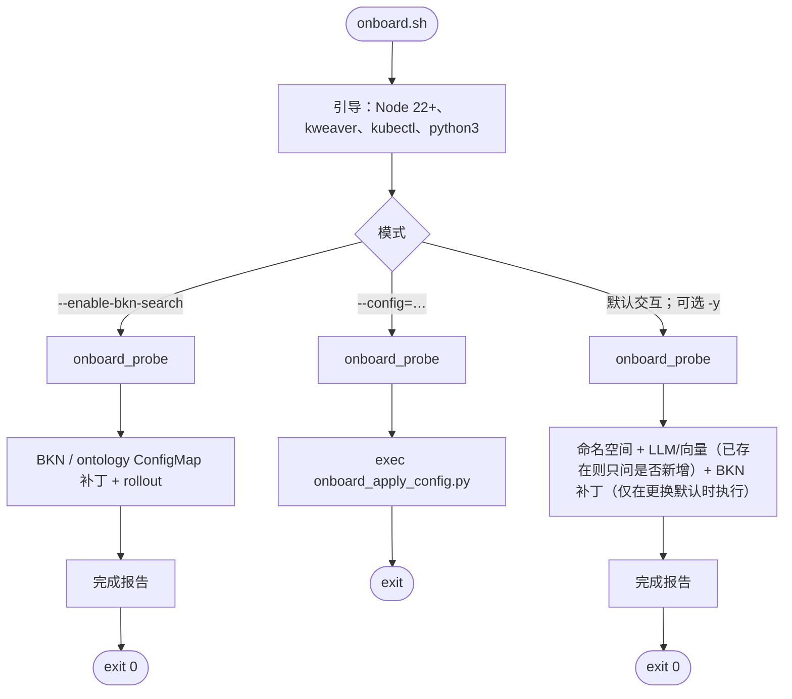
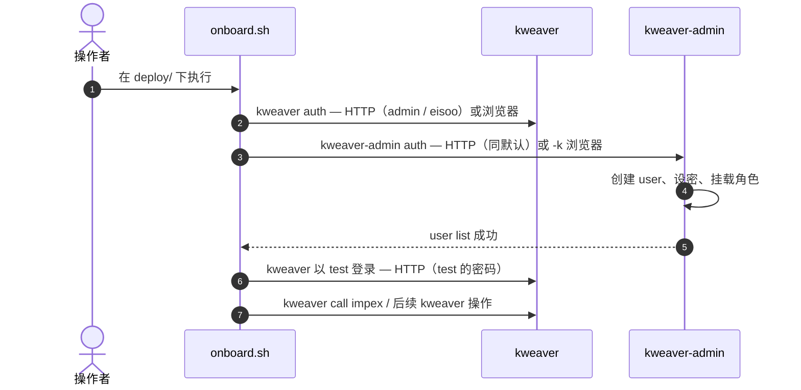

# 🚢 安装与部署

本页说明 KWeaver Core 的**环境要求**、**部署步骤**与**安装后检查**。

> **平台：** **Linux** 是完整安装（`preflight.sh`、k3s/kubeadm、数据服务等）的**推荐**目标环境。**macOS** 仅适合用 Docker + **kind** 做**本机开发/验证** —— 见 **[`deploy/dev/README.zh.md`](../../deploy/dev/README.zh.md)**（[English](../../deploy/dev/README.md)）与 `deploy/dev/mac.sh`（Mac 上不跑 `preflight.sh`，也与生产环境不对齐）。常见顺序：先起 **Docker Desktop**（或任意提供 Docker API 的引擎），再 **`bash ./dev/mac.sh cluster up`**，然后 **`bash ./dev/mac.sh kweaver-core install`**；当前 **`kweaver-core install` 会先执行 `ensure_data_services`**（与单独 **`data-services install`** 一致），除非设置 **`KWEAVER_SKIP_DATA_SERVICES_BUNDLE=true`**。

> 📌 安装通过产品包或源码中的 `deploy/` 目录下的 `deploy.sh` 脚本完成。

> **`deploy.sh` 全局参数**（`--distro=k3s|k8s`、`-y`、`--force-upgrade`、`--config=…` 等）只有写在**模块名之前**才会生效，例如 `bash ./deploy.sh --distro=k8s kweaver-core install --minimum`。写成 `... install --minimum --distro=k8s` **不会**按全局参数解析。可改用 `export KUBE_DISTRO=k8s` 再执行安装命令，或把 `--distro` 挪到前面（与 `-y`、`--force-upgrade` 一致）。

---

## 🧱 环境要求

部署前，请准备好主机、网络与客户端工具。

### 💻 主机要求

> ⚠️ 安装过程需以 `root` 或 `sudo` 执行。

| 项 | 最低 | 推荐 |
| --- | --- | --- |
| 🖥️ 操作系统 | **Ubuntu Server** **22.04 LTS** 及以上，或 **Rocky Linux / AlmaLinux / CentOS Stream** **8** 及以上，**openEuler** **23** 及以上 | **Ubuntu** **22.04 LTS**，或 RPM 系 **8+** |
| ⚙️ CPU | 16 核 | 16 核 |
| 🧠 内存 | 48 GB | 64 GB |
| 💾 磁盘 | 200 GB | 500 GB |

`deploy/preflight.sh` 与 `deploy.sh` **同时支持** **Ubuntu / Debian**（apt）与 **Rocky / Alma / CentOS Stream / openEuler**（dnf/yum），详见 `deploy/README.zh.md`。

### Git、Node.js、Python

| 工具 | 说明 |
| --- | --- |
| **Git** | `deploy.sh` / `preflight.sh` **不会**调用 `git`。只有从 **Git 仓库 clone** 开发/更新时才需要本机装 Git；使用**已解压的产品包**或构建产物时，**安装目标机可以不装 Git**。 |
| **Node.js** | **22+** 与 **`@kweaver-ai/kweaver-sdk`** 的 npm `engines`、`deploy/onboard.sh`、可选的 **`kweaver-admin`** 及 preflight 检查一致（环境变量 **`PREFLIGHT_KWEAVER_MIN_NODE_MAJOR`**，默认 **22**）。**仅起 K8s / Helm** 时，目标机**可以不装 Node**；缺 Node 或版本低于 22 时 preflight 多为 **[WARN]**（非阻塞），也可在**另一台已装 Node 22+ 的机器**上跑 `onboard.sh`，或通过 **`preflight.sh --fix`** 里与 Node 相关的可选项安装。详见下文 **客户端工具**。 |
| **Python** **3** | 日常跑 **`preflight` / `deploy.sh` 不强制**要求。若使用 **`deploy/preflight.sh --output=json`**（JSON 输出依赖 **`python3`**），则**必须**安装 Python 3。若目标机 **PATH 上已有 `python3`**，preflight 会检查其版本为 **CPython 3.6+**（与 `deploy/scripts/lib/onboard_*.py` 一致；可用 **`PREFLIGHT_MIN_PYTHON_MAJOR`** / **`PREFLIGHT_MIN_PYTHON_MINOR`** 覆盖，默认 **3** / **6**）。部分与 `kubectl` 相关的辅助解析在存在 `python3` 时也会使用。 |

**`deploy/scripts/lib/onboard_*.py`（供 `onboard.sh` 调用）**：实现上约定 **CPython 3.6 起至当前主线 3.x** 可调（兼容 CentOS 7 自带的 **3.6.x**；**3.5 及以下**不适用，因其缺少 f-string 等语法）。不向 **PyYAML 5.1 以后**才有的 `yaml.dump(..., sort_keys=...)` 等参数。维护者或 CI 可执行 **`bash deploy/scripts/lib/preflight_checks_test.sh`**，在存在 **`python3`** 时会对这两个文件做一次 **`py_compile`**；本机若有多个解释器，可 **`EXTRA_PYTHONS="python3.9 python3.12"`** 再跑一遍以覆盖多版本。

### 🛠️ 主机准备（典型 Linux）

```bash
# 1. 关闭防火墙（或按策略放行端口）
systemctl stop firewalld && systemctl disable firewalld

# 2. 关闭 swap
swapoff -a && sed -i '/ swap / s/^/#/' /etc/fstab

# 3. 按需将 SELinux 设为 permissive
setenforce 0

# 4. 安装容器运行时（示例：containerd）
# dnf install containerd.io   # 按发行版调整
```

> 💡 具体步骤因发行版而异；完整清单以随产品提供的部署说明为准。

### 🌐 网络访问

部署脚本可能需要访问外网镜像与仓库：

| 域名 | 用途 |
| --- | --- |
| `mirrors.aliyun.com` | RPM 镜像 |
| `mirrors.tuna.tsinghua.edu.cn` | containerd RPM 镜像 |
| `registry.aliyuncs.com` | Kubernetes 镜像 |
| `swr.cn-east-3.myhuaweicloud.com` | KWeaver 镜像 |
| `repo.huaweicloud.com` | Helm 二进制 |
| `kweaver-ai.github.io` | Helm Chart 仓库 |

### 🧰 客户端工具

在能访问集群的工作机上需要：

- 🔧 **kubectl** — 可选，用于集群健康检查
- 🚀 **kweaver CLI** — KWeaver 命令行（通过 npm 安装 `@kweaver-ai/kweaver-sdk`）

```bash
npm install -g @kweaver-ai/kweaver-sdk
# 或免安装直接运行：
npx kweaver --help
```

> 需要 **Node.js 22+**，与 npm 上 [`@kweaver-ai/kweaver-sdk`](https://www.npmjs.com/package/@kweaver-ai/kweaver-sdk) 的 `engines`（`node >= 22`）一致；使用 Node 18 会 `EBADENGINE` 或运行期报错。

- 🌐 **curl** — 直接调用 HTTP API

---

## 📥 进入 deploy 目录

在已解压的产品目录或构建环境中：

```bash
cd deploy
chmod +x deploy.sh
```

> ℹ️ 若目录名不同，请以实际发布包中的 `deploy` 路径为准。

---

## 🩺 装机前体检 / 修复：`preflight.sh`

在 `deploy.sh` 之前，建议先在**安装目标主机**上以 `root` / `sudo` 跑一次 **`deploy/preflight.sh`**：内核 / sysctl / containerd / `kubectl` / `helm` / `python3`（若在 PATH 上则要求 **≥3.6**）/ Node / `kweaver` CLI 等一次过；缺什么按需修（每项默认 y/N 询问，`-y` 全自动）。

```bash
sudo bash deploy/preflight.sh                # 仅检查（默认；仍需 root）
sudo bash deploy/preflight.sh --fix          # 检查 + 交互修复
sudo bash deploy/preflight.sh --fix -y       # 全部自动确认修复
sudo bash deploy/preflight.sh --list-fixes   # 预览将会执行哪些修复，不改任何东西
sudo bash deploy/preflight.sh --help         # 全部参数
```

常用参数：

| 参数 | 含义 |
| --- | --- |
| `--check-only` | 仅检查，不改系统（默认） |
| `--fix` | 检查 + 应用修复（K8s / sysctl / containerd / Helm / 防火墙 / SELinux / 系统调优 / sysctl 等）；同时按需提示安装 Node 22+ + `kweaver` / `kweaver-admin` |
| `-y` / `--yes` | **全部**修复项自动确认 |
| `-n` / `--no` | 全部修复项自动拒绝（仅查看风险描述，不改东西） |
| `--fix-allow=LIST` | 仅自动确认指定修复项（其余跳过），如 `k8s-pkgs-repo,k8s-bins,containerd-install,helm-v3,nofile-limits,nodejs-npm,kweaver-sdk`（旧名 `k8s-apt-source` 仍可作别名）。可用 `sudo bash deploy/preflight.sh --list-fixes` 查看本机当前可用的全部修复名 |
| `--role=target\|admin\|both` | `target` = 仅 `kubectl`/`helm`；`admin` = `kweaver` / Node / npm；`both`（默认）= 全部 |
| `--no-recheck` | 修复完不再重新跑一遍完整检查 |
| `--lenient` | 把「会阻塞 install + `--fix` 能搞定」的 `[FAIL]` 项（sysctl / 内核模块 / containerd / kubectl / helm / swap / apt 源损坏 / 缺 kubeadm 或 containerd 安装候选 / ulimit / inotify / vm.max_map_count / overlay）降回 `[WARN]`。等同 `PREFLIGHT_STRICT=false PREFLIGHT_STRICT_SOURCES=false`。 |
| `--skip=LIST` | 跳过指定检查项 |
| `--report=PATH` | 完整日志追加到该文件 |
| `--output=json` | 以 JSON 输出到 stdout（人类日志到 stderr，需 `python3`） |
| `--distro=k8s\|k3s` | 与 `deploy.sh` 对齐：**k8s**（默认，kubeadm 栈）走 kubeadm 向的严格检查；**k3s** 放宽 kubeadm 源/系统 containerd 等假设。等同 `KUBE_DISTRO`。在 **`deploy.sh`** 上 `--distro` 须写在**模块名之前**（见本页开头说明）。 |

常用环境变量：

| 变量 | 默认 | 作用 |
| --- | --- | --- |
| `KUBE_DISTRO` | `k3s` | 与 `deploy.sh` 共用：**`k3s`** 与 **`k8s`**（kubeadm 栈）。历史值 **`kubeadm`** 仍可作为 **`k8s`** 的别名。若不能把 `deploy.sh` 的 `--distro` 写在模块前，可改用本变量。 |
| `PREFLIGHT_STRICT` | `true` | 为 `true` 时，`--fix` 能修复的「阻塞 install」项以 `[FAIL]` 报告（让 `--check-only` 退出码为 `1`）；设 `false` 退回 `[WARN]`。 |
| `PREFLIGHT_STRICT_SOURCES` | `true` | 为 `true` 时，会额外验证 `apt-cache policy kubeadm` / `containerd.io` / `containerd`（以及 `dnf`/`yum` 等价命令）确实有安装候选——光 `apt-get update` 成功不算数。 |
| `PREFLIGHT_K8S_APT_MINOR` | 自动 | 锁定 `pkgs.k8s.io` minor 版本（如 `v1.28`）。否则从已装的 `kubeadm` 推断，回退 `v1.28`。 |

退出码：**0** 全 OK；**1** 有 FAIL；**2** 仅有 WARN（无 FAIL）。

> 每台新主机在跑 `deploy.sh kweaver-core install` 前都建议跑一次 preflight；可重复执行——已经满足的项会按 `OK` 报告并跳过。如果你**有意**在低配 lab 机器上跑（内存/磁盘低于推荐、没装 Docker CE 源等），用 `--lenient` 让报告依然能看，但不会因为这些项而阻塞 install。

### Preflight 报告：`Summary` 与 `Conclusion`

检查或修复结束时会打印 **Summary**（各状态计数）和 **Conclusion**（是否可视为「装机就绪」）。示例形态如下（具体数字与条目以你机器为准）：

```text
================================================================
  Summary
================================================================
  [OK]    …
  [WARN]  …
  [FAIL]  …
  [FIXED] …
  (initial [FAIL] before fix phase: …)

  Outstanding [FAIL] items:
    1. …（每条对应一项检查；说明里会写建议的修复名，如 system-tuning、kernel-limits …）
    …

[INFO] Hint: most install-blocking [FAIL] items are auto-fixable — re-run: sudo bash ./preflight.sh --fix
[INFO]       Need to bypass strict severity … ? sudo bash ./preflight.sh --check-only --lenient

================================================================
  Conclusion
================================================================
  No KWeaver releases detected, but preflight above is NOT all clear — fix that before treating deploy as ready.
  Typical loop:
    sudo bash ./preflight.sh --fix          # …（默认每项 y/N；加 -y 全自动）
    sudo bash ./preflight.sh --check-only   # 再检查直到关键 [FAIL] 消失（或配合 --lenient）
  Only then install:
    sudo bash ./deploy.sh kweaver-core install --minimum    # 体验 / 最小化
    sudo bash ./deploy.sh kweaver-core install              # 完整安装
  Finally: sudo bash ./onboard.sh from deploy/ (Linux；macOS dev 用普通 bash。Node 22+ + kweaver on PATH；sudo bash ./preflight.sh --fix helps …)
```

**说明：**

- **`[FIXED]` 为 0** 但一开始有 `[FAIL]`：常见于交互式 `--fix` 时**全部按了 Enter**，默认选项为 **「不应用该项修复」（N）**；需要 **`sudo bash deploy/preflight.sh --fix -y`**，或在每个提示处输入 **`y`**。
- **常见 Outstanding [FAIL] 类别**（与修复名大致对应）：`docker-disable`（与 k3s / containerd 冲突时停 Docker）、`system-tuning`（转发、swap、内核模块、`overlay` 等）、`kernel-limits`（`vm.max_map_count` / inotify）、`nofile-limits`（`ulimit -n`）、`k8s-pkgs-repo` + `k8s-bins`（Kubernetes 源与 `kubeadm`/`kubectl`）、`containerd-install`、`helm-v3`。RPM 系若 **`kubernetes.repo` 对 kube 包设置了 `exclude`**，安装侧需 **`--disableexcludes=kubernetes`**，preflight 与脚本的探测/安装语义已对齐）。
- **`--fix` 后务必再跑一次 `--check-only`**，确认关键项已为 `[OK]` 再执行 **`deploy.sh`**。

更细的故障条目与手动兜底见 **`deploy/README.zh.md` → Troubleshooting**。

---

## 🚀 安装 KWeaver Core

### ⚡ 最小化安装（首次体验推荐）

跳过部分可选模块（如认证、业务域），资源占用更小：

```bash
./deploy.sh kweaver-core install --minimum
```

等价写法：

```bash
./deploy.sh kweaver-core install \
  --set auth.enabled=false \
  --set businessDomain.enabled=false
```

### 📦 完整安装

包含认证与业务域等组件：

```bash
./deploy.sh kweaver-core install
```

> 💡 脚本可能交互式询问 **访问地址**，并自动探测 **API Server 地址**。

### 🤖 非交互安装

```bash
./deploy.sh kweaver-core install \
  --access_address=<你的IP或域名> \
  --api_server_address=<K8s API 绑定的网卡 IP>
```

- `--access_address` — 客户端访问 KWeaver（Ingress）所用的地址
- `--api_server_address` — Kubernetes API Server 绑定的真实网卡 IP

### 🔌 自定义 Ingress 端口（可选）

```bash
export INGRESS_NGINX_HTTP_PORT=8080
export INGRESS_NGINX_HTTPS_PORT=8443
./deploy.sh kweaver-core install
```

### 🧾 常用命令

```bash
./deploy.sh kweaver-core status
./deploy.sh kweaver-core uninstall
./deploy.sh --help
```

### 📋 安装内容概览

1. 单节点 Kubernetes（如需要）、存储、Ingress
2. 数据服务：MariaDB、Redis、Kafka、ZooKeeper、OpenSearch（以发布清单为准）
3. KWeaver Core 应用 Helm Chart

> ℹ️ 卸载与集群重置以随产品提供的部署说明为准。

---

## Post-install：`onboard.sh`（安装后引导）

在 `deploy.sh kweaver-core install` 之后，可在能访问集群的机器上运行 **`deploy/onboard.sh`**，需 **Node 22+**、**kubectl**、**kweaver**（`npm i -g @kweaver-ai/kweaver-sdk`）。在 **`deploy/`** 目录执行，**Linux 上需要 `sudo`**（与 `sudo deploy.sh` 对齐）：

```bash
cd deploy
sudo bash ./onboard.sh --help
```

> **为什么要 `sudo`？** `onboard.sh` 读安装期写下的 `$HOME/.kweaver-ai/config.yaml`（`sudo deploy.sh` 会写到 `/root/.kweaver-ai/`，权限 700），并把 `kweaver` 认证状态写到 `$HOME/.kweaver`。不加 `sudo` 时读到的是当前用户的 home——若该用户没有这个文件就会回退到仓库内模板 `deploy/conf/config.yaml`，**可能解析出和安装时不一致的 access URL**。命中此路径时脚本启动会打印黄色的 `[onboard][hint]`；可用 `ONBOARD_SUDO_HINT_DISABLED=1` 关闭。**macOS 开发路径**（`bash deploy/dev/mac.sh onboard`）**不要**加 `sudo`：Docker Desktop / `kind` / `$HOME` 都属于当前用户，`sudo` 会把它们重定向到 `/var/root` 并割裂安装与 onboard；`deploy.sh` 在 `Darwin` 上已跳过 root 检查。详见 [`deploy/dev/README.zh.md`](../../deploy/dev/README.zh.md) · [`deploy/dev/README.md`](../../deploy/dev/README.md)。

常用参数：

| 参数 | 含义 |
| --- | --- |
| 无参数 | 交互模式：按需引导安装 Node / `kweaver` / `kweaver-admin`，完成两个 CLI 的认证，再依次走模型 / BKN / Context Loader 提示 |
| `-y` / `--yes` | 全部自动：bootstrap、ISF 下 `kweaver` + `kweaver-admin` 的 HTTP 默认登录（`admin` / `eisoo.com`）、`test` 用户创建 + 角色同步、`kweaver` 以 `test` 重登、Context Loader 导入。会**跳过交互式模型注册**；如需非交互注册模型，请用 `--config=models.yaml`。 |
| `--config=xxx.yaml` | 非交互：按 YAML 注册模型与可选 BKN；参考 `deploy/conf/models.yaml.example` |
| `--enable-bkn-search` | 仅做 BKN ConfigMap 类操作（仍先走 probe） |
| `--skip-context-loader` | 跳过 ADP Context Loader 工具集导入 |

**全量 ISF（启用 auth + business domain）**：脚本根据 Helm/命名空间判断为 ISF 后，**会自动按以下 5 步执行**（你不需要手工逐条做——这里列出来只是让你知道脚本在干什么，以及某一步失败时该回到哪一步）：

1. **`kweaver auth login`**（`onboard_ensure_kweaver_auth`）— 会话写入 `~/.kweaver`。HTTP 默认 `admin` / `eisoo.com`（TTY 下也可改走浏览器 OAuth）；`-y` 模式直接走 HTTP 默认。
2. **`kweaver-admin` 在 PATH**（`onboard_ensure_kweaver_admin_for_isf`）— 缺则自动 `npm i -g @kweaver-ai/kweaver-admin`（交互提示，或 `-y` 时自动安装）。
3. **`kweaver-admin auth login`**（`onboard_ensure_kweaver_admin_auth_for_isf`）— 与 `kweaver` **token 文件独立**，但**用同一组控制台账密**（默认仍是 `admin` / `eisoo.com`）。命令是 `-u` / `-p` / `-k`（带上即走 HTTP `/oauth2/signin`，**没有** `--http-signin` 参数，该参数仅 **kweaver-sdk** 有）。TTY 下也支持浏览器 OAuth。
4. **业务用户 `test`**（`onboard_offer_isf_test_user`）— 创建 `test`，密码 `111111`（可用 `ONBOARD_TEST_USER_PASSWORD` 覆盖），把 `kweaver-admin role list` 中**所有**角色都挂上，然后 **`kweaver auth login` 为 `test`**，让 SDK 会话切到业务用户，供后续步骤使用。若 `test` 已存在，则只做角色同步。
5. **Context Loader + 模型注册**（`onboard_offer_context_loader_toolset` → `kweaver call impex`；随后是交互式或 YAML 模型注册）— 都使用**以 `test` 登录的 `kweaver`（`~/.kweaver`）**；仅 **admin** 的 `kweaver` 会话对 impex 常见 **403**。

任何一步失败脚本都会非零退出并打印清楚原因；修好之后重跑 `sudo bash deploy/onboard.sh`（Linux）/ `bash deploy/onboard.sh`（macOS dev）即可——已成功的步骤会被检测并跳过（重复运行幂等）。

**最小化安装**（`--minimum`）：通常只需 `kweaver`（常为 `--no-auth`）；上述 ISF 专属步骤 2–4 会被自动跳过，第 5 步的 Context Loader 仅在集群中确实有 operator deployment 时才执行。

结束前会打印 **英文** 完成报告（可用 `ONBOARD_NO_COMPLETION_REPORT=1` 关闭）。

### `onboard.sh` 流程（Mermaid）

**1）入口：环境检查后三选一**



- **三种模式都会先跑 `onboard_probe`**，再进入「仅 BKN」、YAML 或交互式注册。**全量 ISF** 时 probe 内含：**与 kweaver 同默认的 `kweaver-admin` HTTP 登录**、**用户 `test`**、**`kweaver` 以 `test` 重登**、再 **Context Loader**（条件满足时）。
- **`-y`** 不会自动等价于 `--config`；主要自动确认 **Node / npm -g**，以及在 **ISF 全量** 下 `kweaver` / `kweaver-admin` 的 **HTTP** 登录默认行为。`-y` 模式下不会跑交互式模型注册（如需非交互注册请使用 `--config=models.yaml`），完成报告里会列出平台上现有模型计数，方便确认。
- **可重复执行（已注册 / 已配置自动跳过）。** 交互式模型注册会先探测平台现状，再决定是否提问：
  - **大模型 LLM**：若平台已有任何 LLM，先问 `Register another LLM now? [y/N]`，默认 **否**；选否则跳过 LLM 提示。
  - **向量 / 小模型**：同样先问是否新增；如果你确实新增了 embedding，再追问是否设为 **BKN 默认**：
    - 平台已有默认时：`Set [<新模型>] as the new BKN default…? [y/N]`，默认 **否**（保留原默认）。
    - 平台尚无默认时：`Set [<新模型>] as the BKN default…? [Y/n]`，默认 **是**。
  - **BKN ConfigMap 补丁 + `bkn-backend` / `ontology-query` 滚动重启** 仅在 **默认 embedding 真的发生变化** 时执行；保持原默认时 ConfigMap 完全不动，也不会重启任何 deployment。
  - YAML 模式（`--config=models.yaml`）遵循同样的思路：每个模型若已存在则按名称跳过；当两个 ConfigMap 已经声明了相同的 `defaultSmallModelEnabled=true` / `defaultSmallModelName` 时，BKN 补丁与重启也会一并跳过。

**2）`onboard_probe` 执行顺序（非 ISF 时相关步骤会快速跳过或空操作）**

```mermaid
flowchart TB
  subgraph probe["onboard_probe"]
    A["onboard_ensure_kweaver_auth\n（kweaver：HTTP 默认 admin / eisoo 或浏览器）"] --> B["kubectl：命名空间或目标 namespace"]
    B --> C["onboard_prepend_npm_global_bin_to_path"]
    C --> D["onboard_recommend_admin_cli（Helm/命名空间 → 是否 ISF）"]
    D --> E["onboard_ensure_kweaver_admin_for_isf\n（ISF 时按需 npm -g 安装 kweaver-admin）"]
    E --> F["onboard_ensure_kweaver_admin_auth_for_isf\n（HTTP 与 kweaver 同默认；或 -k 浏览器；-y 自动 HTTP）"]
    F --> G1["onboard_offer_isf_test_user\n创建或同步 test 与角色"]
    G1 --> G2["onboard_isf_relogin…\nkweaver 以 test 登录（HTTP）"]
    G2 --> H["onboard_offer_context_loader_toolset\n（kweaver impex）"]
  end
```



**非全量 / 最小化**：通常不需要 `kweaver-admin` 的建用户与 **test 重登** 门禁；若集群仍有 operator，Context Loader 仍可能按条件执行。

**3）ISF 全量：双 CLI 与 impex 会话（序列图）**



**probe 之后**，默认模式会继续 **命名空间 + 模型 + BKN** 交互；在 ISF 上此时 **`~/.kweaver` 宜已为 `test`**，后续注册走业务用户。

`kweaver` 与 `kweaver-admin` **会话文件独立**；**ISF 下 HTTP 控制台默认与 kweaver 相同**。**impex 需 `kweaver` 的 `test` 会话**；仅 **admin** 的 kweaver 对 impex 常见 **403**。

---

## 🛡️ 完整安装后的管理员工具（kweaver-admin）

完整安装（启用 `auth.enabled=true` 与 `businessDomain.enabled=true`）后，平台的**用户、组织、角色、模型、审计**等管理操作通过独立的 npm CLI [`@kweaver-ai/kweaver-admin`](https://github.com/kweaver-ai/kweaver-admin) 完成。它与面向终端用户/Agent 的 `kweaver`（kweaver-sdk）互补：

| CLI | 受众 | 覆盖范围 |
| --- | --- | --- |
| `kweaver`（`@kweaver-ai/kweaver-sdk`） | 业务用户 / Agent | BKN、Decision Agent、Action、Skill、查询 |
| `kweaver-admin`（`@kweaver-ai/kweaver-admin`） | 平台管理员 | 用户、组织、角色、模型、审计、原始 HTTP |

**何时安装：** 完整安装之后（`./deploy.sh kweaver-core install` 不带 `--minimum`）。**最小化安装下大多数 `kweaver-admin` 命令会返回 401 / 404 — 属于部署裁剪，并非 CLI 故障。**

**后端依赖（来自 `kweaver-admin` 架构文档）：** `user-management` / `deploy-manager` / `deploy-auth` / `eacp` / `mf-model-manager` / OAuth2(Hydra) — 正好是完整安装才会启用的服务集合。

### 📥 安装

要求 **Node.js 22+**（与 npm 上 `@kweaver-ai/kweaver-sdk` 的 `engines` 一致）。凭据保存在 `~/.kweaver-admin/platforms/`，与 `~/.kweaver/` 隔离。

```bash
npm install -g @kweaver-ai/kweaver-admin
kweaver-admin --version
kweaver-admin --help
```

### 🔑 登录

```bash
# 浏览器 OAuth2（自签名证书加 -k）
kweaver-admin auth login https://<访问地址> -k

# 用户名/密码（CI 或无浏览器场景）
kweaver-admin auth login https://<访问地址> -u <用户名> -p <密码> -k

# 通过环境变量（CI / Headless）
export KWEAVER_BASE_URL=https://<访问地址>
export KWEAVER_ADMIN_TOKEN=<bearer-token>   # 优先；也可回退到 KWEAVER_TOKEN

# 查看会话状态与当前身份
kweaver-admin auth status
kweaver-admin auth whoami
kweaver-admin auth list
```

> `kweaver-admin` 与 `kweaver` 的 token 存储互不影响，可在同一台机器上同时持有管理员与业务身份。

### 🧰 常用管理任务

#### 组织（部门）

```bash
kweaver-admin org tree                # 树形列出部门
kweaver-admin org list                # 分页列出
kweaver-admin org create              # 新建部门
kweaver-admin org members <orgId>     # 查看成员
```

#### 用户

```bash
kweaver-admin user list
kweaver-admin user create --login alice            # 默认密码 123456，首次登录强制改密
kweaver-admin user reset-password -u alice         # 管理员重置密码
kweaver-admin user roles <userId>
kweaver-admin user assign-role <userId> <roleId>
kweaver-admin user revoke-role <userId> <roleId>
```

#### 角色

```bash
kweaver-admin role list
kweaver-admin role get <roleId>
kweaver-admin role add-member <roleId> -u alice
kweaver-admin role remove-member <roleId> -u alice
```

**赋权前务必先看 `role list`**，记下每条角色的 **roleId**（与名称如 `super_admin`、`normal_user` 等对应关系以你环境输出为准；参考 [kweaver-admin 角色说明](https://github.com/kweaver-ai/kweaver-admin/blob/main/docs/product-specs/role-permission.md)）。**快速开始/POC** 为减少「缺角色导致接口 403」，常对新用户**依次**执行 `kweaver-admin user assign-role <userId> <roleId>`，把 `role list` 中的角色**全部**挂到该用户上；**生产**请按最小权限只赋业务所需角色，并用 `kweaver-admin user roles <userId>` 复查。

#### 模型（LLM / Embedding）

```bash
kweaver-admin llm list
kweaver-admin llm add
kweaver-admin llm test <modelId>

kweaver-admin small-model list
kweaver-admin small-model add
kweaver-admin small-model test <modelId>
```

> 与 [`模型管理`](model.md) 中通过 `kweaver call /api/mf-model-manager/...` 的方式等价；推荐管理员日常用 `kweaver-admin llm` / `small-model` 子命令，参数校验与回显更友好。

#### 审计

```bash
kweaver-admin audit list \
  --user alice --start 2026-04-01 --end 2026-04-30
```

#### 原始 HTTP（带认证头）

```bash
kweaver-admin call /api/user-management/v1/management/users -X GET
kweaver-admin --json call /api/eacp/v1/... -X POST -d '{"...":"..."}'
```

### ⚠️ 必须知道

- **新建用户的默认密码固定为 `123456`**，首次登录强制改密 — 这是 ISF 用户存储的上游既定行为（`Usrm_AddUser` thrift 不接收密码参数）。请通过安全渠道把账号交给本人，由其首登时改密；后续忘/失密用 `kweaver-admin user reset-password`。
- **三权分立内置账号**：`system / admin / security / audit` 不可随意删改；操作员请使用**个人账号**而非共享 `admin`，便于审计追溯。
- **首次登录改密（错误码 401001017）**：`kweaver-admin auth login` 触发该错误时，TTY 下会引导改密并自动重试登录；非 TTY 下显式补充 `--new-password '<新密码>'` 一次性完成（与 `kweaver` CLI 行为一致，参见 [Info Security Fabric — 修改密码](isf.md#-修改密码)）。
- **TLS：** `-k` / `--insecure`（或环境变量 `KWEAVER_TLS_INSECURE=1`）仅用于开发/自签名证书场景，生产请使用受信任证书。
- **Web 控制台未暴露的能力，CLI 是首选路径**：例如部门写入（`Usrm_AddDepartment` / `Usrm_EditDepartment`）、用户更新（`Usrm_EditUser` 回退）、用户角色查询（`role list + role members` 回退）等，详见 [`kweaver-admin/docs/SECURITY.md`](https://github.com/kweaver-ai/kweaver-admin/blob/main/docs/SECURITY.md)。

### 🤖 AI Agent Skill

`kweaver-admin` 仓库自带渐进式（progressive disclosure）Skill，让 AI 编程助手（Cursor、Claude Code 等）代你执行管理员操作：

```bash
npx skills add https://github.com/kweaver-ai/kweaver-admin --skill kweaver-admin
```

安装后先用 `kweaver-admin auth login https://<访问地址> -k` 登录一次，然后用自然语言（也支持 `/kweaver-admin` 斜杠命令）指挥助手：

```text
列出所有角色
新建用户 alice，并把 role list 中的所有角色都赋给她
重置 alice 的密码
查看 alice 最近 7 天的登录审计
注册一个名为 bge-m3 的 Embedding 模型，base 是 https://api.siliconflow.cn
```

Skill 源文件：[`skills/kweaver-admin/SKILL.md`](https://github.com/kweaver-ai/kweaver-admin/blob/main/skills/kweaver-admin/SKILL.md)。它与 `kweaver` CLI 的 `kweaver-core` / `create-bkn` Skill 互补、相互独立。

### 📖 进一步阅读

- [`kweaver-admin` 仓库 README](https://github.com/kweaver-ai/kweaver-admin)
- [`ARCHITECTURE.md`](https://github.com/kweaver-ai/kweaver-admin/blob/main/ARCHITECTURE.md) — 命令树与后端 API 映射
- [`docs/SECURITY.md`](https://github.com/kweaver-ai/kweaver-admin/blob/main/docs/SECURITY.md) — Token、TLS、审计与 fallback 路径
- [`skills/kweaver-admin/SKILL.md`](https://github.com/kweaver-ai/kweaver-admin/blob/main/skills/kweaver-admin/SKILL.md) — Agent Skill 入口

---

## ✅ 安装完成后（检查集群与 API）

`deploy.sh kweaver-core install` 结束后，请确认集群正常且能访问平台。

### ☸️ Kubernetes 状态

```bash
kubectl get nodes
kubectl get pods -A
```

> 💡 等待核心命名空间中关键工作负载为 `Running` / `Ready`。

### 🩺 部署脚本状态

```bash
./deploy.sh kweaver-core status
```

### 🔑 CLI 登录与验证

```bash
kweaver auth login https://<访问地址> -k
kweaver bkn list
```

> `<访问地址>` 与 `--access_address` 或安装提示的节点地址一致；`-k` 用于自签名证书，正式证书可省略。

### 🌐 HTTP 健康检查（可选）

```bash
curl -sk "https://<访问地址>/health" || true
```

> ℹ️ 具体路径因 Ingress 与版本而异；子系统路由以环境中的 OpenAPI 为准。

---

## 🧮 可选：Etrino（数据视图自定义 SQL）

仅安装 **KWeaver Core** 时，`kweaver dataview query <id>` 不带 `--sql` 通常已可用（按视图定义分页查询等）。

> ⚠️ `kweaver dataview query --sql "..."` 自定义 SQL 依赖集群内的 `vega-calculate-coordinator`，由 **Etrino** 相关 Chart 提供（与 `vega-hdfs`、`vega-calculate`（内含 coordinator）、`vega-metadata` 一并部署）。

在已存在 Core 的集群上，使用 `deploy.sh` 的 `etrino` 子命令即可：

```bash
./deploy.sh etrino install
./deploy.sh etrino status
./deploy.sh etrino uninstall
```

> 💡 如需指定配置文件，可附加 `--config=/path/to/config.yaml`。安装会检查 Helm、为节点打标签、创建 HDFS 所需目录、添加 Helm 仓库别名 `myrepo`（`https://kweaver-ai.github.io/helm-repo/`），依次安装 `vega-hdfs → vega-calculate → vega-metadata`。请保证节点磁盘与资源足够，镜像仓库对你的环境可达（chart 默认镜像可能与 Core 所用仓库不同，必要时在 values 或 chart 升级中覆盖 `image.registry` 等）。

> 📌 **若仍会安装 DIP**：`./deploy.sh kweaver-dip install` 在完成 DIP 图表后也会执行同一套 Etrino 安装逻辑，无需重复安装。

---

## 🧠 配置模型

KWeaver 默认不包含预置模型。如需使用 **语义搜索**（`kweaver bkn search`）或 **Decision Agent**，需先注册 LLM 与 Embedding 小模型。

> 🔧 详细操作见 [模型管理](model.md)。以下为最小注册示例：

```bash
# 注册 LLM（以 DeepSeek 为例）
kweaver call /api/mf-model-manager/v1/llm/add -d '{
  "model_name": "deepseek-chat",
  "model_series": "deepseek",
  "max_model_len": 8192,
  "model_config": {
    "api_key": "<你的 API Key>",
    "api_model": "deepseek-chat",
    "api_url": "https://api.deepseek.com/chat/completions"
  }
}'

# 注册 Embedding 模型
kweaver call /api/mf-model-manager/v1/small-model/add -d '{
  "model_name": "bge-m3",
  "model_type": "embedding",
  "model_config": {
    "api_url": "https://api.siliconflow.cn/v1/embeddings",
    "api_model": "BAAI/bge-m3",
    "api_key": "<你的 API Key>"
  },
  "batch_size": 32,
  "max_tokens": 512,
  "embedding_dim": 1024
}'

# 验证
kweaver call '/api/mf-model-manager/v1/llm/list?page=1&size=50'
kweaver call '/api/mf-model-manager/v1/small-model/list?page=1&size=50'
```

> 🔧 启用 BKN 语义搜索还需修改 ConfigMap，见 [模型管理 — 启用 BKN 语义搜索](model.md#启用-bkn-语义搜索)。

---

## 🔧 故障排查

按症状索引（CoreDNS 不就绪、镜像拉不下来、Kubernetes apt / yum 源缺失或 404、`containerd` 装不上、严格模式 `[FAIL]` 项等）请看 [`deploy/README.zh.md` → Troubleshooting](https://github.com/kweaver-ai/kweaver-core/blob/main/deploy/README.zh.md#-troubleshooting)。

`preflight.sh` 报的 `[FAIL]` 大多数都能自动修：

```bash
sudo bash deploy/preflight.sh --fix -y                         # 全部自动确认修
sudo bash deploy/preflight.sh --fix --fix-allow=k8s-pkgs-repo # 只配置 / 迁移 K8s 源（也可用 k8s-apt-source）
sudo bash deploy/preflight.sh --fix --fix-allow=containerd-install
sudo bash deploy/preflight.sh --check-only --lenient           # 只看 WARN，不 FAIL（lab 机模式）
```

定位问题时还可以收集：

```bash
kubectl logs -n <namespace> <pod-name>
kubectl get events -A --sort-by=.lastTimestamp | tail -50
```

---

## 📖 下一步

| 目标 | 文档 |
| --- | --- |
| 🚀 上手第一条命令、首次创建 BKN | [快速开始](quick-start.md) |
| 🧠 模型注册、测试与管理 | [模型管理](model.md) |
| 🔧 启用 BKN 语义搜索（ConfigMap） | [启用 BKN 语义搜索](model.md#启用-bkn-语义搜索) |
