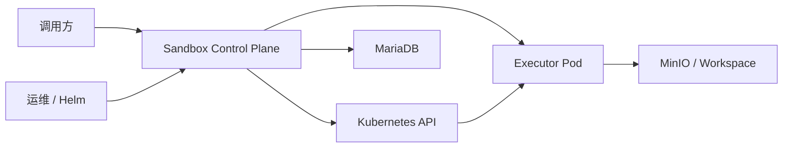
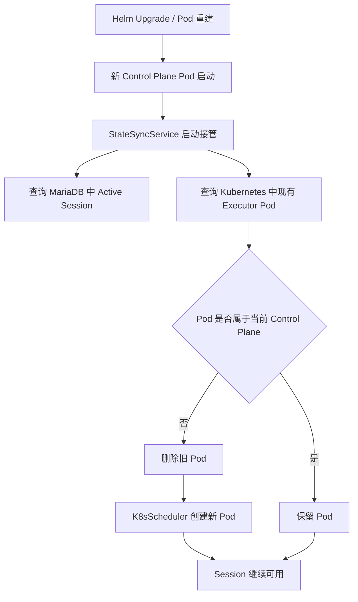
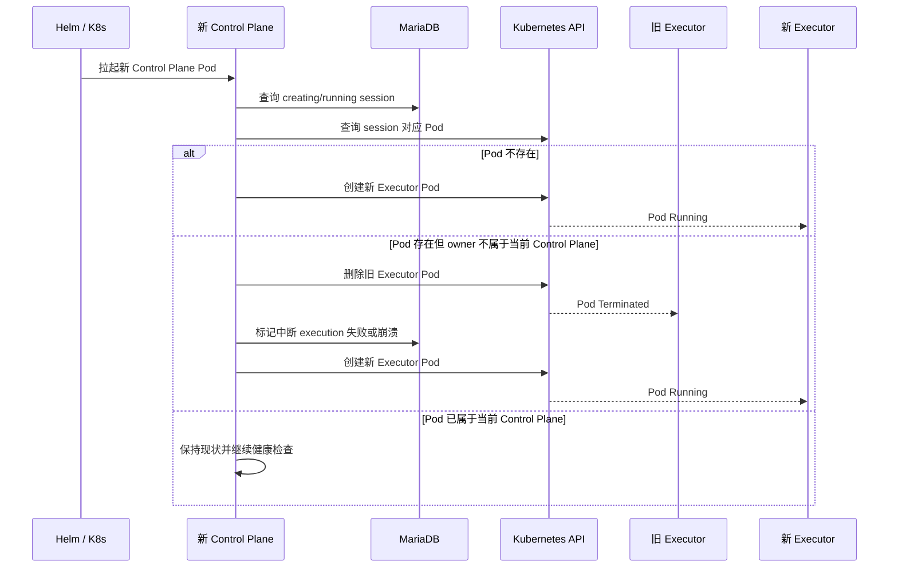
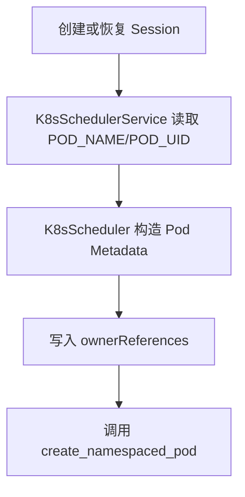

# 🏗️ Design Doc: Control Plane 与 Executor 生命周期绑定

> 状态: Draft  
> 负责人: 待确认  
> Reviewers: 待确认  
> 关联 PRD: ../../product/prd/control-plane-executor-lifecycle-binding-prd.md  

---

# 📌 1. 概述（Overview）

## 1.1 背景

- 当前现状：
  - `sandbox_control_plane` 在 Kubernetes 模式下通过 `create_namespaced_pod` 直接创建 executor Pod。
  - executor Pod 当前只有 labels/annotations，没有 `ownerReferences`。
  - `StateSyncService.sync_on_startup()` 当前只负责检查 `creating/running` session 的容器健康情况并尝试恢复，不负责 control plane 升级接管。
  - Helm chart 当前默认 `controlPlane.replicaCount=1`，适合采用单实例接管模型。

- 存在问题：
  - control plane Pod 升级、删除或崩溃后，历史 executor Pod 不会随之清理。
  - 历史 executor 持续使用旧镜像和旧配置，导致升级后 active session 仍运行在旧 executor 上。
  - active session 缺少“基础设施重建但 session 保留”的显式接管流程。
  - in-flight execution 在升级期间被中断后，当前缺少统一的状态回写机制。

- 业务 / 技术背景：
  - 产品要求 session 生命周期不受 control plane 升级或容器重建影响。
  - 基础设施重建允许中断正在运行的 execution，但不允许要求调用方重建 session。
  - 正常 session 终止、业务失败和清理逻辑必须保持与当前系统一致。

---

## 1.2 目标

- 为 Kubernetes executor Pod 增加与当前 control plane Pod 的 owner 绑定，实现自动回收。
- 在 control plane 启动阶段对所有 active session 执行统一接管。
- 对升级期间被中断的 execution 明确标记失败或崩溃，同时保留 session。
- 保持用户主动 terminate、业务失败、超时与现有清理语义不变。

---

## 1.3 非目标（Out of Scope）

- Docker 模式下的生命周期绑定。
- 多副本 control plane 的 leader election、并发接管和租约控制。
- in-flight execution 的无缝迁移、断点续跑或优雅 drain。
- 对外公开新增运维 API 来手动触发接管。

---

## 1.4 术语说明（Optional）

| 术语 | 说明 |
|------|------|
| Control Plane Pod | `sandbox_control_plane` Deployment 创建的运行实例 Pod |
| Executor Pod | 为某个 session 提供代码执行能力的运行时 Pod |
| Active Session | `creating` 或 `running` 状态的 session |
| 接管 | 新 control plane 启动后识别旧 executor 并重建到当前 control plane 名下的过程 |
| 历史 Executor | Pod 不存在 owner、owner 不属于当前 control plane，或 Pod 已不存在的 executor |

---

# 🏗️ 2. 整体设计（HLD）

> 本章节关注系统“怎么搭建”，不涉及具体实现细节

---

## 🌍 2.1 系统上下文（C4 - Level 1）

### 参与者
- 用户：通过上层业务系统或 Agent 使用 session 执行代码的终端调用方
- 外部系统：Kubernetes API Server、Helm、MariaDB、MinIO
- 第三方服务：无新增第三方服务，继续依赖 Kubernetes 原生 owner GC

### 系统关系

说明：

- 运维通过 Helm 触发 control plane 滚动升级。
- control plane 通过 Kubernetes API 创建和删除 executor Pod。
- executor Pod 由 Kubernetes owner GC 与 control plane Pod 建立基础设施生命周期关系。

---

## 🧱 2.2 容器架构（C4 - Level 2）

| 容器 | 技术栈 | 职责 |
|------|--------|------|
| Control Plane API | FastAPI | 启动状态同步、session 管理、executor 编排 |
| StateSyncService | Python Application Service | 启动接管、健康检查、恢复与状态协调 |
| K8sScheduler / K8sSchedulerService | Kubernetes Python Client | 构造并创建带 owner 的 executor Pod |
| Executor Pod | FastAPI + Runtime Executor | 执行代码、回调执行结果、承载 session 运行环境 |
| MariaDB | MariaDB | 存储 session、execution 和运行状态 |

---

### 容器交互

---

## 🧩 2.3 组件设计（C4 - Level 3）

### Control Plane 组件

| 组件 | 职责 |
|------|------|
| Helm Deployment 模板 | 通过 Downward API 注入 `POD_NAME`、`POD_UID` 到 control plane 容器 |
| `K8sSchedulerService` | 在创建 session executor 时向 `ContainerConfig` 传递当前 control plane owner 信息 |
| `K8sScheduler` | 构建带 `ownerReferences` 的 executor Pod 元数据 |
| `StateSyncService` | 启动时扫描 active session，判定 executor 归属并执行接管 |
| Session / Execution Repository | 读取和更新 session、execution 状态 |

---

## 🔄 2.4 数据流（Data Flow）

### 主流程

### 子流程（可选）

---

## ⚖️ 2.5 关键设计决策（Design Decisions）

| 决策 | 说明 |
|------|------|
| owner 绑定到 Pod 而不是 Deployment | 只有绑定当前 control plane Pod，才能在 Helm 滚动升级时自动清理旧 executor，直接解决旧镜像和旧配置残留问题 |
| 启动即全量接管 active session | 比按需懒重建更确定，升级完成后能尽快消除新旧 executor 混跑 |
| session 保持 active，execution 允许失败 | 满足“session 生命周期不受升级影响”的产品要求，同时避免实现无缝迁移的高复杂度 |
| 默认单副本 control plane | 当前 Helm 值就是单副本，实现简单且与现有部署假设一致 |
| 无 owner 的历史 Pod 视为旧 executor | 兼容已部署历史版本，避免旧 Pod 永久游离在新机制之外 |

---

## 🚀 2.6 部署架构（Deployment）

- 部署环境：K8s
- 拓扑结构：单副本 `sandbox_control_plane` Deployment + 多个 session 级 executor Pod
- 扩展策略：control plane 维持单副本；executor 按 session 水平扩展

部署要求：

1. Helm 模板为 control plane 容器注入 `POD_NAME` 和 `POD_UID`。
2. control plane 使用现有 ServiceAccount 访问 Pod `get/list/create/delete` 权限。
3. executor Pod 继续部署在同一 namespace，并使用现有 executor ServiceAccount。

---

## 🔐 2.7 非功能设计

### 性能
- 启动接管按 session 逐个处理，但实现上需避免单个失败阻塞全局。
- 对 Pod 查询与重建结果输出聚合统计，便于压测和优化。

### 可用性
- 旧 executor 自动回收，避免升级后集群长期残留旧实例。
- 新 control plane 启动后自动恢复 active session 的执行承载环境。

### 安全
- 不新增外部入口。
- 只复用现有 namespace 级 RBAC。
- owner 信息仅来自 Downward API，不接受外部传参。

### 可观测性
- tracing：沿用 control plane 启动状态同步链路
- logging：增加接管判定、删除旧 Pod、重建新 Pod、execution 中断处理日志
- metrics：增加接管扫描数、重建数、失败数、中断 execution 数

---

# 🔧 3. 详细设计（LLD）

> 本章节关注“如何实现”，开发可直接参考

---

## 🌐 3.1 API 设计

### 启动接管流程

**Endpoint:** `无新增对外 API`

**Request:**

    无

**Response:**

    无

实现说明：

- 复用 FastAPI lifespan 启动链路中已有的 `state_sync_service.sync_on_startup()`。
- 接口契约不变，对外 API 无新增字段要求。

---

## 🗂️ 3.2 数据模型

### Executor Owner 上下文

| 字段 | 类型 | 说明 |
|------|------|------|
| `owner_pod_name` | `str` | 当前 control plane Pod 名称，来自环境变量 `POD_NAME` |
| `owner_pod_uid` | `str` | 当前 control plane Pod UID，来自环境变量 `POD_UID` |

用途：

- 作为 `ContainerConfig` 内部扩展字段，或等价的调度器内部上下文对象。
- 仅 K8s 调度器路径消费，Docker 路径忽略。

### Executor Pod Metadata

| 字段 | 类型 | 说明 |
|------|------|------|
| `metadata.ownerReferences[]` | `list` | 指向当前 control plane Pod 的 owner 信息 |
| `metadata.labels.session_id` | `str` | Session 标识 |
| `metadata.labels.template_id` | `str` | 模板标识 |
| `metadata.annotations.control-plane-pod-name` | `str` | 创建该 executor 的 control plane Pod 名称 |
| `metadata.annotations.control-plane-pod-uid` | `str` | 创建该 executor 的 control plane Pod UID |

---

## 💾 3.3 存储设计

- 存储类型：DB + Kubernetes Metadata
- 数据分布：
  - session / execution 业务状态继续存储在 MariaDB
  - executor 归属关系存储在 Kubernetes Pod metadata 中
- 索引设计：
  - 无数据库 schema 变更为默认方案
  - 通过现有 session 主键和 container_id 查询定位 Pod

说明：

- 本期默认不新增数据库字段。
- owner 信息属于运行时基础设施态，不持久化到数据库。

---

## 🔁 3.4 核心流程（详细）

### 启动接管流程

1. FastAPI lifespan 启动阶段调用 `get_state_sync_service()`。
2. `StateSyncService.sync_on_startup()` 查询所有 `creating` 和 `running` session。
3. 对每个 session：
4. 若 `container_id` 为空，按现有恢复逻辑直接创建 executor。
5. 若 `container_id` 对应 Pod 不存在，按现有恢复逻辑直接创建 executor。
6. 若 Pod 存在且 ownerReferences 不包含当前 `POD_UID`，判定为旧 executor。
7. 删除旧 executor Pod。
8. 检查该 session 是否存在未结束 execution；若存在，将其标记为 failed/crashed。
9. 按当前模板镜像、control plane 配置和 session 资源配置重建 executor。
10. 更新 session 的 `container_id` 为新 Pod 名称，保持 session 为 active。
11. 若 Pod 已归属于当前 control plane 且容器健康，则不做重建。
12. 记录本次启动接管的统计信息并输出日志。

---

## 🧠 3.5 关键逻辑设计

### Owner 绑定逻辑
- 在 Helm control plane Deployment 中为主容器注入：
- `POD_NAME = metadata.name`
- `POD_UID = metadata.uid`
- `K8sSchedulerService.create_container_for_session()` 读取并校验这两个值。
- 缺失时直接报错，防止创建无 owner 的新 executor。
- `K8sScheduler` 在构造 `V1Pod.metadata` 时写入 `ownerReferences` 和归属 annotations。

### 启动接管判定逻辑
- active session 范围限定为 `creating` 和 `running`。
- Pod 不存在：视为需要重建。
- Pod 存在但 ownerReferences 为空：视为历史遗留旧 Pod，需要重建。
- Pod 存在且 ownerReferences 不含当前 `POD_UID`：视为旧 control plane 名下 Pod，需要删除并重建。
- Pod 存在且 ownerReferences 包含当前 `POD_UID`：仅做正常健康检查，不重复重建。

### 执行中断处理逻辑
- 当旧 Pod 被删除并且 session 存在未完成 execution 时，按升级中断原因将 execution 标记为 failed/crashed。
- 该标记只影响 execution，不把 session 变成 failed 或 terminated。
- 若 execution 已经完成并写回结果，则不再覆盖状态。

### 正常生命周期隔离逻辑
- 用户主动 terminate session 仍走现有 `SessionService.terminate_session` 与 cleanup 逻辑。
- 业务失败、timeout、orphan cleanup 不走启动接管分支。
- 启动接管读取 session 当前状态，若已进入终态则直接跳过。

---

## ❗ 3.6 错误处理

- 缺少 `POD_NAME` 或 `POD_UID`：K8s 模式创建 executor 直接报错，阻止产生无 owner Pod。
- 查询 Pod 失败：记录错误，保留该 session 在启动接管错误列表中，继续处理其他 session。
- 删除旧 Pod 失败：不继续重建，记录错误，避免同一 session 下出现并行 executor。
- 重建新 Pod 失败：保留 session 原业务态，记录错误，依赖后续健康检查或人工排查。
- execution 状态回写失败：记录错误，不阻断 executor 重建。

---

## ⚙️ 3.7 配置设计

| 配置项 | 默认值 | 说明 |
|--------|--------|------|
| `POD_NAME` | 无 | control plane 当前 Pod 名称，来自 Downward API |
| `POD_UID` | 无 | control plane 当前 Pod UID，来自 Downward API |
| `controlPlane.replicaCount` | `1` | 生命周期绑定和启动接管方案的部署前提 |
| `cleanup_interval_seconds` | 现有值 | 与本需求无直接变更，但继续负责终态和超时清理 |

---

## 📊 3.8 可观测性实现

- tracing：
  - 在 `sync_on_startup()` 内为“扫描 session”“判定 owner”“删除旧 Pod”“重建 executor”打关键 span
  - 中断 execution 状态更新单独记录子 span

- metrics：
  - `control_plane_takeover_sessions_total`
  - `control_plane_takeover_recreated_total`
  - `control_plane_takeover_skipped_total`
  - `control_plane_takeover_errors_total`
  - `control_plane_takeover_interrupted_executions_total`

- logging：
  - 结构化日志字段包含 `session_id`、`container_id`、`old_owner_uid`、`current_owner_uid`、`action`
  - 启动完成后输出一次总统计汇总日志

---

# ⚠️ 4. 风险与权衡（Risks & Trade-offs）

| 风险 | 影响 | 解决方案 |
|------|------|----------|
| 多副本 control plane 下并发接管 | 可能重复删除和重建同一 session executor | 当前版本显式限定单副本，并在文档和 Helm 配置中说明 |
| 启动接管耗时增加 | control plane 启动时间变长 | 先按现有同步模型落地，后续根据指标评估并发化或批处理 |
| 升级导致 in-flight execution 失败 | 上层业务可能感知到短暂失败 | 明确失败语义，要求调用方按 execution 维度重试 |
| 旧 Pod 删除失败导致新旧 executor 并存 | 可能出现重复执行风险 | 删除失败时不继续重建，优先保证单 session 单 executor |

---

# 🧪 5. 测试策略（Testing Strategy）

- 单元测试：`K8sScheduler` 构造 Pod 时正确写入 ownerReferences 与 annotations。
- 单元测试：K8s 模式缺少 `POD_NAME` 或 `POD_UID` 时创建 executor 失败。
- 单元测试：`StateSyncService.sync_on_startup()` 对 Pod 不存在、无 owner、owner 不匹配、owner 匹配四类情况做出正确处理。
- 单元测试：接管旧 executor 时会将未结束 execution 标记为 failed/crashed，但 session 保持 active。
- 单元测试：已 terminated 或 failed 的 session 不会被启动接管重建。
- 集成测试：模拟 control plane 重建后，active session 能被接管并在新 executor 上继续发起下一次执行。
- 集成测试：执行 `helm upgrade` 或等价 Pod 替换后，旧 executor Pod 最终被清理。
- 回归测试：用户主动终止 session、业务异常 failed、timeout 与 cleanup 逻辑不回归。

---

# 📅 6. 发布与回滚（Release Plan）

### 发布步骤
1. 更新 Helm 模板，注入 `POD_NAME` 和 `POD_UID`。
2. 发布 control plane 新版本到测试环境。
3. 在测试环境创建 active session，并执行一次 Helm 升级验证接管流程。
4. 验证旧 executor 自动回收、新 executor 重建、session 继续可用、execution 中断状态正确。
5. 灰度发布到生产环境并观察接管日志与指标。

### 回滚方案
- 回滚 control plane 镜像与 Helm 模板到旧版本。
- 回滚后新建 executor 将不再带 ownerReferences，但已接管成功的 session 仍可继续运行。
- 若出现异常，可人工删除残留 executor Pod，并依赖现有 session/cleanup 逻辑恢复到可控状态。

---

# 🔗 7. 附录（Appendix）

## 相关文档
- PRD: ../../product/prd/control-plane-executor-lifecycle-binding-prd.md
- 其他设计：../../design/modules/control-plane.md
- 其他设计：../../design/modules/executor.md

## 参考资料
- Kubernetes Pod Lifecycle and Garbage Collection
- 现有 `StateSyncService` 启动同步实现
- 现有 `K8sScheduler` Pod 创建实现

---
