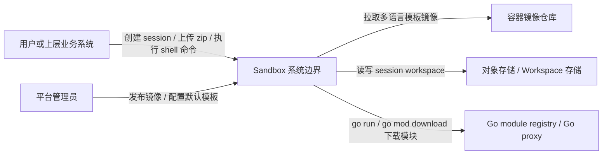
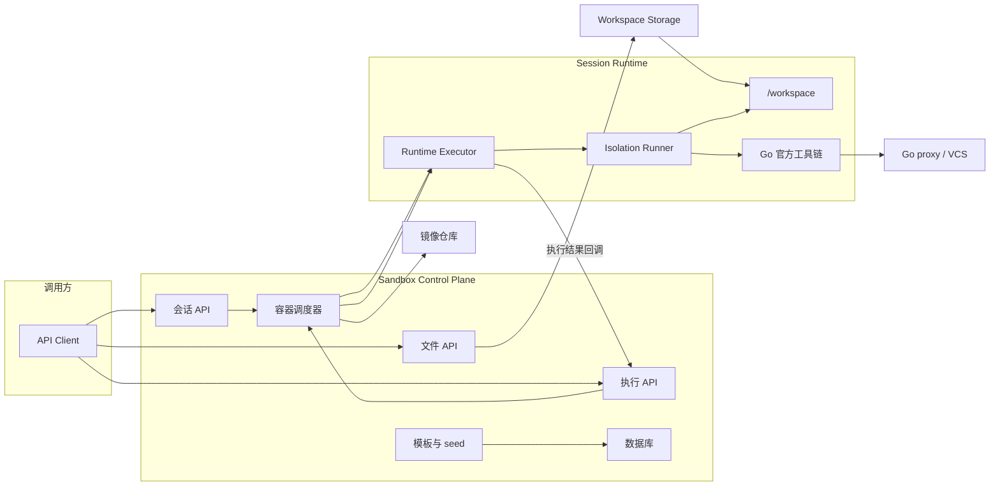
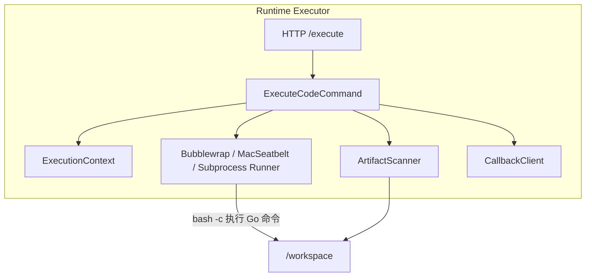
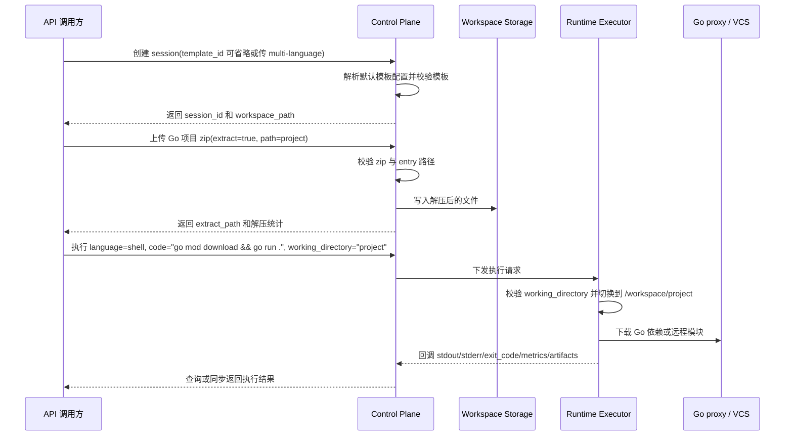
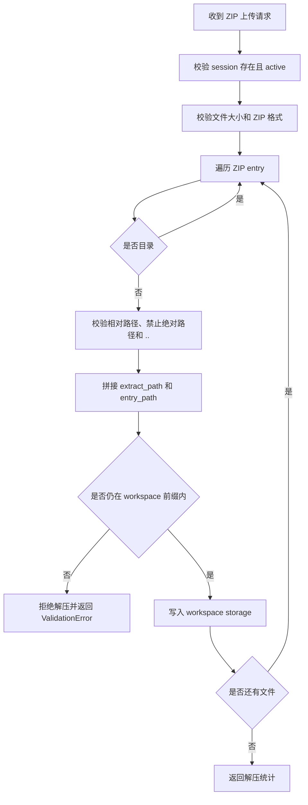
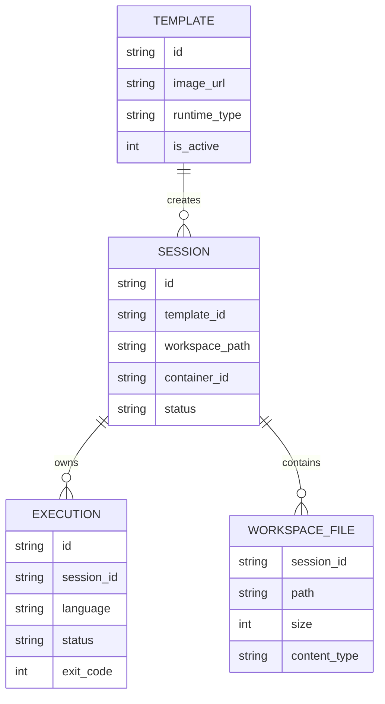

# 🏗️ Design Doc: Sandbox 多语言模板与 Go 运行能力

> 状态: Draft  
> 负责人: 待确认  
> Reviewers: 待确认  
> 关联 PRD: ./sandbox多语言go运行能力-prd.md  

---

# 📌 1. 概述（Overview）

## 1.1 背景

- 当前现状：
  - Sandbox Control Plane 已提供模板、会话、文件上传和代码执行 API。
  - Runtime Executor 已支持 `python`、`javascript`、`shell` 三类执行语言，并支持 `working_directory` 作为 workspace 根目录下的相对执行目录。
  - 文件服务已支持 `POST /api/v1/sessions/{session_id}/files/upload?extract=true` 上传并解压 ZIP 到 session workspace。
  - 默认模板 seed 当前以 `python-basic` 为主，并通过 `DEFAULT_TEMPLATE_IMAGE` 控制默认镜像地址。

- 存在问题：
  - 默认模板不具备统一的 Python、Go、Bash 复合运行能力。
  - Go 命令执行依赖模板中存在 Go 工具链，当前默认模板无法保证 `go version`、`go run`、`go mod download` 可用。
  - 文件上传、ZIP 解压、workspace 切换、依赖下载和命令执行已有局部能力，但缺少围绕 Go 项目的明确后端设计和验收链路。
  - 执行失败时需要更清晰地区分 workspace 校验、依赖下载和命令执行阶段，便于上层系统展示错误。

- 业务 / 技术背景：
  - PRD 要求新增可配置的默认多语言模板，至少覆盖 Python、Go、Bash。
  - PRD 明确不引入 Go 官方工具链以外的自定义 Go 执行包装工具，因此 Go 命令通过现有 `language=shell` 执行链路承载。

---

## 1.2 目标

- 新增多语言模板镜像，内置 Python、Golang、Bash，并可被注册为模板 `multi-language`。
- 通过配置项控制新建沙箱默认模板，使不同部署环境可选择启用或回退多语言模板。
- 保持现有执行 API 兼容，不新增 `go` language 枚举；Go 命令通过 `language=shell` 执行。
- 强化文件上传和 workspace 执行链路的设计约束，支持 Go 项目 ZIP 解压后执行 `go mod download` 和 `go run .`。
- 保证现有 Python/Bash 执行链路不回归。

---

## 1.3 非目标（Out of Scope）

- 不新增前端完整上传与执行 UI。
- 不新增 Go 专用执行器或自定义 Go wrapper 命令。
- 不支持 Python、Go、Bash 以外的新语言运行时。
- 不定义多租户计费、配额管理或高级审计策略。
- 不保证所有第三方 Go module 在受限网络环境下均可下载成功。

---

## 1.4 术语说明（Optional）

| 术语 | 说明 |
|------|------|
| Control Plane | Sandbox 控制面服务，负责模板、会话、执行记录、文件 API 和调度。 |
| Runtime Executor | 会话容器内的执行服务，负责在隔离环境中执行代码并回调结果。 |
| Template | 沙箱运行环境模板，包含镜像、运行时类型、默认资源和超时。 |
| 多语言模板 | 内置 Python、Go、Bash 的模板镜像，本设计中建议模板 ID 为 `multi-language`。 |
| Workspace | 每个 session 的工作目录，容器内挂载为 `/workspace`。 |
| Working Directory | 执行请求指定的 workspace 子目录，字段为 `working_directory`。 |
| Go 远程模块执行 | 使用 `go run <module>@<version>` 直接拉取、构建并执行 Go 模块命令。 |

---

# 🏗️ 2. 整体设计（HLD）

> 本章节关注系统“怎么搭建”，不涉及具体实现细节

---

## 🌍 2.1 系统上下文（C4 - Level 1）

### 参与者
- 用户：通过 API 上传 Go 项目、创建沙箱、执行命令并查看结果。
- 平台管理员：构建和发布多语言模板镜像，配置默认模板和网络策略。
- 外部系统：集成 Sandbox API 的上层业务系统。
- 第三方服务：容器镜像仓库、对象存储、Go module registry 或 Go proxy。

### 系统关系



---

## 🧱 2.2 容器架构（C4 - Level 2）

| 容器 | 技术栈 | 职责 |
|------|--------|------|
| Sandbox Web | React + TypeScript | 现有管理界面。本期不新增完整 UI，仅可继续调用既有 API。 |
| Sandbox Control Plane | FastAPI + SQLAlchemy | 模板注册、默认模板 seed、会话创建、文件上传、执行请求编排、执行结果持久化。 |
| Runtime Executor | FastAPI + Python | 在 session 容器中接收执行请求，通过隔离 runner 执行 shell/Python/JavaScript。 |
| Runtime Base Images | Dockerfile | 提供稳定的 `sandbox-python-executor-base` 和 `sandbox-multi-executor-base`，只包含系统依赖、语言运行时和工具链，不包含 executor 代码。 |
| Template Images | Dockerfile | 提供随项目 `VERSION` 发布的 `sandbox-template-python-basic`、`sandbox-template-multi-language` 等最终 executor/template 镜像。 |
| Workspace Storage | S3 或本地挂载 | 保存上传文件、ZIP 解压内容和执行产物。 |
| Go Module Source | Go proxy / VCS | 为 `go run <module>@<version>` 和 `go mod download` 提供模块下载来源。 |

---

### 容器交互



---

## 🧩 2.3 组件设计（C4 - Level 3）

### Sandbox Control Plane 组件

| 组件 | 职责 |
|------|------|
| Template Seed Provider | 定义默认模板列表，新增 `multi-language` 模板并读取默认模板配置。 |
| Template Repository | 持久化模板记录，保持 `python-basic` 等既有模板兼容。 |
| Session Service | 创建 session 时校验模板并传递镜像、资源、workspace 配置给调度器。 |
| File Service | 校验上传路径、ZIP 格式、ZIP entry 路径，并将解压内容写入 workspace 存储。 |
| Execution Service | 校验 session、创建执行记录，并将 `language=shell`、命令和 `working_directory` 下发到 executor。 |
| Scheduler | 定位 session 容器并转发执行请求到 Runtime Executor。 |

### Runtime Executor 组件

| 组件 | 职责 |
|------|------|
| Execute Endpoint | 接收 Control Plane 下发的执行请求，保留 `language`、`code`、`working_directory` 字段。 |
| ExecutionContext | 解析并校验工作目录，确保执行目录在 `/workspace` 内。 |
| Isolation Runner | 对 shell 命令使用 `bash -c` 执行，Go 命令作为 shell 内容运行。 |
| Artifact Scanner | 执行后扫描 workspace 产物并回调 Control Plane。 |
| Callback Client | 将执行状态、stdout、stderr、exit_code、metrics 和 artifacts 回传 Control Plane。 |



---

## 🔄 2.4 数据流（Data Flow）

### 主流程



### 子流程（可选）



---

## ⚖️ 2.5 关键设计决策（Design Decisions）

| 决策 | 说明 |
|------|------|
| Go 命令通过 `language=shell` 执行 | 现有 Control Plane 和 Executor 均只允许 `python/javascript/shell`，shell runner 已使用 `bash -c` 执行命令。复用该链路可避免 API 枚举扩展和多端兼容成本。 |
| 不引入 Go 专用 wrapper | PRD 明确使用 Go 官方工具链能力。Go 行为、错误输出和版本解析由 `go` 命令自身负责，Sandbox 只负责环境、workspace、安全和超时。 |
| 默认模板采用配置项控制 | 保留不同部署环境选择默认模板的能力，降低默认镜像切换对既有调用方的影响。 |
| 新增 `multi-language` 模板而不是覆盖 `python-basic` | 保留现有模板语义，降低回滚复杂度；默认模板配置可指向新模板。 |
| ZIP 解压继续在 Control Plane 文件服务中完成 | 现有文件服务已具备上传和解压能力，直接强化安全边界和返回结构即可满足本需求。 |
| `working_directory` 仅允许相对路径 | 现有请求模型和 Executor 上下文已采用该约束，可防止跳出 `/workspace`。 |

---

## 🚀 2.6 部署架构（Deployment）

- 部署环境：Docker Compose、本地 Docker、Kubernetes 均需支持。
- 拓扑结构：
  - Control Plane 作为 API 服务部署。
  - 每个 session 启动一个或多个 executor runtime 容器，workspace 挂载到 `/workspace`。
  - 多语言模板镜像从镜像仓库拉取。
  - workspace 文件保存在 S3 兼容存储或本地挂载中。
- 扩展策略：
  - Control Plane 可水平扩展，依赖共享数据库和对象存储。
  - Runtime Executor 随 session 容器扩展。
  - Go 模块下载缓存策略待确认；默认按镜像和容器环境使用 Go 官方缓存路径。

---

## 🔐 2.7 非功能设计

### 性能
- 基础命令 `go version`、`python --version`、`bash --version` 不依赖网络，应在普通执行超时内完成。
- `go run <module>@<version>` 首次执行受网络下载和编译影响，需要通过执行超时控制；目标耗时阈值待确认。
- ZIP 上传单文件大小维持现有 100MB 限制；解压后总大小和文件数量上限待确认。

### 可用性
- 默认模板配置错误时，session 创建阶段返回明确错误，不在执行阶段才暴露缺失镜像。
- 若 Go proxy 不可用，执行请求返回 Go 命令 stderr 和失败退出码，系统本身不重试远程模块下载。
- 旧请求不传 `working_directory` 时继续在 `/workspace` 执行。

### 安全
- 上传 path、ZIP entry path、`working_directory` 必须全部是 workspace 内相对路径。
- ZIP 解压禁止绝对路径、Windows 盘符、反斜杠路径、`..` 路径段和符号链接逃逸。
- 执行仍由现有 Bubblewrap、Mac Seatbelt 或开发环境 Subprocess runner 承载；生产环境不得使用无隔离的 Subprocess runner。

### 可观测性
- tracing：覆盖文件上传、ZIP 解压、执行提交、executor 执行和结果回调。
- logging：记录 session_id、execution_id、template_id、working_directory、执行阶段、退出码和错误摘要。
- metrics：记录模板启动成功率、ZIP 解压成功率、Go 命令执行成功率、执行耗时和失败阶段计数。

---

# 🔧 3. 详细设计（LLD）

> 本章节关注“如何实现”，开发可直接参考

---

## 🌐 3.1 API 设计

### 创建会话

**Endpoint:** `POST /api/v1/sessions`

**Request:**

```json
{
  "template_id": "multi-language",
  "timeout": 300,
  "cpu": "1",
  "memory": "512Mi",
  "disk": "1Gi",
  "env_vars": {}
}
```

**兼容策略：**
- 若调用方显式传入 `template_id`，继续使用请求中的模板。
- 若产品需要“未传 template_id 自动使用默认模板”，需将 `CreateSessionRequest.template_id` 从必填改为可选；该变更待确认。
- 若保持现有必填 API，则默认模板配置只影响 seed、管理端默认选择或上层调用方默认值。

---

### 上传并解压 Go 项目 ZIP

**Endpoint:** `POST /api/v1/sessions/{session_id}/files/upload?path=project&extract=true&overwrite=false`

**Request:**

```http
Content-Type: multipart/form-data

file=@go-project.zip
```

**Response:**

```json
{
  "session_id": "sess_xxx",
  "mode": "archive_extract",
  "extract_path": "project",
  "extracted_file_count": 42,
  "skipped_file_count": 0,
  "size": 102400
}
```

**实现约束：**
- 保持现有 `extract=true` 语义。
- `path` 作为解压目标目录，必须通过目录路径校验。
- 文件大小继续使用现有 100MB API 限制；更细的解压后总大小和文件数量上限待确认。

---

### 异步执行 Go 命令

**Endpoint:** `POST /api/v1/executions/sessions/{session_id}/execute`

**Request:**

```json
{
  "language": "shell",
  "code": "go mod download && go run .",
  "timeout": 300,
  "event": {},
  "working_directory": "project"
}
```

**Response:**

```json
{
  "execution_id": "exec_xxx",
  "session_id": "sess_xxx",
  "status": "pending",
  "created_at": 1777392000000
}
```

**说明：**
- 不新增 `language=go`。
- `working_directory` 复用现有字段，必须是相对 workspace 根目录的路径。
- 命令失败时，最终执行结果通过现有 execution 查询或回调结果体现。

---

### 同步执行远程 Go 模块命令

**Endpoint:** `POST /api/v1/executions/sessions/{session_id}/execute-sync`

**Request:**

```json
{
  "language": "shell",
  "code": "go run golang.org/x/tools/cmd/goimports@v0.28.0 .",
  "timeout": 600,
  "event": {},
  "working_directory": "project"
}
```

**Response:**

```json
{
  "id": "exec_xxx",
  "session_id": "sess_xxx",
  "status": "completed",
  "language": "shell",
  "output": "执行输出",
  "error": "",
  "exit_code": 0,
  "duration_ms": 12345,
  "artifacts": []
}
```

**错误返回策略：**
- API 参数校验失败返回 400 或 422。
- session 不存在返回 404。
- 同步等待超时返回 408。
- 命令自身失败不转换为 HTTP 5xx，按执行结果返回非 0 `exit_code` 和 stderr。

---

## 🗂️ 3.2 数据模型

### Template

| 字段 | 类型 | 说明 |
|------|------|------|
| id | string | 新增模板建议为 `multi-language`。 |
| name | string | 建议为 `Multi Language Basic`。 |
| image_url | string | 多语言模板镜像地址，通过环境变量或 seed 定义。 |
| runtime_type | string | 建议为 `multi` 或 `python3.11-go`，最终枚举值待确认。 |
| default_cpu_cores | decimal | 默认 CPU。 |
| default_memory_mb | int | 默认内存。 |
| default_disk_mb | int | 默认磁盘。 |
| default_timeout_sec | int | 默认执行超时。 |
| is_active | int | 是否可用。 |

### ExecuteCodeRequest

| 字段 | 类型 | 说明 |
|------|------|------|
| code | string | shell 模式下为 Go 命令，例如 `go mod download && go run .`。 |
| language | enum | 保持 `python/javascript/shell`；Go 使用 `shell`。 |
| timeout | int | 执行超时，建议 Go 远程模块命令使用 300 秒以上，具体默认待确认。 |
| event | object | shell 场景可为空。 |
| working_directory | string | 可选 workspace 相对目录，例如 `project`。 |

### FileUploadExtractResult

| 字段 | 类型 | 说明 |
|------|------|------|
| session_id | string | session ID。 |
| mode | string | `archive_extract`。 |
| extract_path | string | 解压目标目录。 |
| extracted_file_count | int | 成功写入文件数。 |
| skipped_file_count | int | 未覆盖时跳过的文件数。 |
| size | int | 原始 zip 字节数。 |

### ExecutionResult

| 字段 | 类型 | 说明 |
|------|------|------|
| status | string | completed、failed、timeout、crashed 等状态。 |
| stdout | string | 命令标准输出。 |
| stderr | string | 命令标准错误，Go 下载或编译失败信息保留在这里。 |
| exit_code | int | 进程退出码。 |
| execution_time_ms | float | 执行耗时。 |
| artifacts | list | 执行产生的 workspace 文件。 |
| error | string | 系统级错误摘要。 |
| metrics | object | 执行指标。 |



---

## 💾 3.3 存储设计

- 存储类型：
  - 模板、会话、执行记录使用现有关系数据库。
  - workspace 文件使用现有对象存储或本地挂载。
- 数据分布：
  - 每个 session 使用独立 workspace 前缀，例如 `s3://bucket/sessions/{session_id}`。
  - ZIP 解压文件写入该 session 前缀下的 `extract_path`。
- 索引设计：
  - 复用现有模板 `id` 主键、session `template_id` 索引、execution `session_id` 索引。
- 迁移策略：
  - 若仅新增 seed 模板和环境配置，不需要数据库 schema migration。
  - 若新增模板字段或默认模板配置持久化表，需要补充 migration；本设计默认不新增表字段。

---

## 🔁 3.4 核心流程（详细）

### 默认多语言模板注册与使用

1. 新增稳定 runtime base：`sandbox-python-executor-base:python3.11-v1` 和 `sandbox-multi-executor-base:go1.25-python3.11-v1`，base 只包含 Python、Go、Bash、git、curl、ca-certificates、Bubblewrap、s3fs 等基础依赖，不包含 executor 代码。
2. 基于稳定 runtime base 构建随项目 `VERSION` 发布的最终模板镜像，例如 `sandbox-template-multi-language:<VERSION>`，该镜像复制 executor 代码并安装 executor Python 依赖。
3. 在默认 seed 中新增模板 `multi-language`，`image_url` 读取 `DEFAULT_MULTI_LANGUAGE_TEMPLATE_IMAGE`，缺省为本地镜像名。
4. 新增或复用默认模板配置：
   - 镜像地址：`DEFAULT_MULTI_LANGUAGE_TEMPLATE_IMAGE`。
   - 默认模板 ID：`DEFAULT_TEMPLATE_ID`，建议默认值维持 `python-basic`，启用时配置为 `multi-language`。
5. 创建 session 时：
   - 若请求明确传入模板 ID，按请求模板创建。
   - 若支持可选模板 ID，则未传时读取 `DEFAULT_TEMPLATE_ID`。
6. session service 校验模板存在且 active 后，将模板镜像传给 scheduler。

### Go 远程模块执行

1. 调用方创建使用多语言模板的 session。
2. 调用方提交执行请求：
   - `language=shell`
   - `code=go run <module>@<version> ...`
   - `working_directory` 可选。
3. Control Plane 校验请求模型并创建 execution。
4. Scheduler 转发请求到 session 对应 executor。
5. Executor 构造 `ExecutionContext` 并解析工作目录。
6. Shell runner 通过 `bash -c` 执行命令。
7. Go 工具链根据模块路径和版本下载、构建、执行。
8. Executor 收集 stdout、stderr、exit_code、metrics 和 artifacts，并回调 Control Plane。

### 本地 Go 项目 ZIP 执行

1. 调用方上传 ZIP 到 `files/upload?path=project&extract=true`。
2. File Service 校验 session active、ZIP 格式、entry 路径和目标路径。
3. File Service 将文件逐个写入 workspace storage。
4. 调用方提交执行请求，`working_directory=project`。
5. Executor 校验 `/workspace/project` 存在且为目录。
6. 执行 `go mod download && go run .`。
7. 若 `go mod download` 失败，`bash -c` 因 `&&` 不执行 `go run .`，返回依赖下载阶段的 stderr。

---

## 🧠 3.5 关键逻辑设计

### Go 命令承载策略
- Go 命令全部作为 shell 脚本内容执行，不新增 `go` language。
- 推荐调用方使用显式命令：
  - `go version`
  - `go mod download`
  - `go run .`
  - `go run golang.org/x/tools/cmd/goimports@v0.28.0 .`
  - `go run github.com/golangci/golangci-lint/cmd/golangci-lint@v1.62.0 run`
- 远程模块版本解析交由 Go 官方工具链处理，Sandbox 不解析 `@version`。

### Workspace 路径规则
- `working_directory` 不允许为空字符串、绝对路径、反斜杠、Windows 盘符或 `..` 路径段。
- Executor 在执行前调用 `resolve_working_directory_path()`，要求目录存在且仍位于 workspace 根目录内。
- `working_directory` 不存在时返回执行失败，默认不自动创建；自动创建策略待确认。

### ZIP 安全规则
- 上传 API 维持 100MB 原始文件大小限制。
- ZIP entry 路径必须是相对路径。
- 禁止绝对路径、`..`、反斜杠路径、Windows 盘符和符号链接逃逸。
- 解压时默认 `overwrite=false`，已有文件计入 `skipped_file_count`。
- 解压后总大小、文件数量和单文件大小限制待确认；建议在设计评审后加入配置项。

### 默认模板配置规则
- 新增模板不删除 `python-basic`。
- 新增默认模板 ID 配置优先于镜像地址配置：
  - `DEFAULT_TEMPLATE_ID=multi-language` 控制新建 session 默认选哪条模板记录。
  - `DEFAULT_MULTI_LANGUAGE_TEMPLATE_IMAGE` 控制新增模板的镜像地址。
- 若保持现有 CreateSession API 必填 `template_id`，则 `DEFAULT_TEMPLATE_ID` 由上层调用方或前端默认值使用；Control Plane 不隐式补默认值。

---

## ❗ 3.6 错误处理

- 模板不存在：
  - 场景：`template_id=multi-language` 但 seed 未注册或被删除。
  - 处理：Control Plane 返回 404 或业务 ValidationError，提示模板不存在。
- 默认模板配置无效：
  - 场景：`DEFAULT_TEMPLATE_ID` 指向不存在模板。
  - 处理：启动 seed 或创建 session 时记录 error log；创建 session 返回明确错误。
- ZIP 非法：
  - 场景：非 ZIP 文件配合 `extract=true`，或 zipfile 解析失败。
  - 处理：返回 422 或 400，错误说明为 ZIP 格式非法。
- ZIP 路径逃逸：
  - 场景：entry 含 `../`、绝对路径、反斜杠或符号链接逃逸。
  - 处理：拒绝整个解压请求，返回 ValidationError。
- Workspace 非法：
  - 场景：`working_directory` 是绝对路径、包含 `..` 或指向不存在目录。
  - 处理：请求模型校验失败返回 422；executor 运行期目录不存在返回执行失败结果。
- Go 模块下载失败：
  - 场景：网络不可达、Go proxy 不可用、版本不存在。
  - 处理：保留 Go 命令 stderr 和非 0 exit_code，不转换为系统 5xx。
- 执行超时：
  - 场景：下载或编译超过 `timeout`。
  - 处理：Executor 标记 TIMEOUT，回调 timeout 结果。

---

## ⚙️ 3.7 配置设计

| 配置项 | 默认值 | 说明 |
|--------|--------|------|
| DEFAULT_TEMPLATE_ID | python-basic | 新建 session 的默认模板 ID。若 CreateSession 保持必填，则该配置供上层默认选择使用。 |
| DEFAULT_TEMPLATE_IMAGE | sandbox-template-python-basic:<VERSION> | 当前发布版本的 python-basic 最终模板镜像地址。 |
| DEFAULT_MULTI_LANGUAGE_TEMPLATE_IMAGE | sandbox-template-multi-language:<VERSION> | 当前发布版本的 multi-language 最终模板镜像地址。 |
| PYTHON_BASE_IMAGE_TAG | python3.11-v1 | 稳定 Python runtime base 镜像 tag，仅在 Python 或系统基础依赖变化时升级。 |
| MULTI_BASE_IMAGE_TAG | go1.25-python3.11-v1 | 稳定多语言 runtime base 镜像 tag，仅在 Go、Python、Bash 或系统基础依赖变化时升级。 |
| TEMPLATE_IMAGE_TAG | VERSION 文件内容 | 最终 executor/template 镜像 tag，随项目版本发布变化。 |
| GO_PROXY | 待确认 | Go 模块代理配置，可作为模板镜像环境变量或 runtime env 注入。 |
| GONOSUMDB | 待确认 | Go 校验数据库绕过配置，按企业网络策略决定。 |
| GOPRIVATE | 待确认 | 私有模块域名配置。 |
| GO_MODULE_DOWNLOAD_TIMEOUT_SEC | 待确认 | Go 依赖下载建议超时，当前可先复用执行 timeout。 |
| MAX_UPLOAD_FILE_SIZE_MB | 100 | 上传 ZIP 原始文件大小限制，当前 API 已硬编码 100MB，后续可配置化。 |
| MAX_EXTRACTED_FILE_COUNT | 待确认 | ZIP 解压文件数上限。 |
| MAX_EXTRACTED_TOTAL_SIZE_MB | 待确认 | ZIP 解压后总大小上限。 |

---

## 📊 3.8 可观测性实现

- tracing：
  - Control Plane `files.upload` span：记录 session_id、extract、path、size、result。
  - Control Plane `executions.submit` span：记录 session_id、execution_id、language、working_directory、timeout。
  - Executor `execution.run` span：记录 execution_id、runner、container_working_directory、exit_code、duration_ms。
  - Executor `execution.callback` span：记录回调成功或失败。

- metrics：
  - `sandbox_template_session_created_total{template_id}`：按模板统计 session 创建数。
  - `sandbox_file_zip_extract_total{status}`：统计 ZIP 解压成功和失败。
  - `sandbox_file_zip_extract_files_total`：统计解压文件数量。
  - `sandbox_execution_total{language,status}`：统计执行结果。
  - `sandbox_go_command_total{command_type,status}`：通过 shell 命令前缀分类统计 `go_version`、`go_mod_download`、`go_run_module`、`go_run_local`。
  - `sandbox_execution_duration_ms{language}`：统计执行耗时。

- logging：
  - 文件上传日志包含 session_id、path、extract、overwrite、size、extracted_file_count、skipped_file_count。
  - 执行日志包含 session_id、execution_id、language、working_directory、timeout、exit_code、duration_ms。
  - 错误日志包含阶段字段：`template_validation`、`zip_validation`、`workspace_validation`、`go_download`、`command_execution`、`callback`。

---

# ⚠️ 4. 风险与权衡（Risks & Trade-offs）

| 风险 | 影响 | 解决方案 |
|------|------|----------|
| Go 模块下载依赖外网或 Go proxy | 受限网络环境下远程模块命令会失败 | 通过 GO_PROXY/GOPRIVATE 等配置适配部署环境；执行结果保留 Go stderr。 |
| 多语言镜像体积增加 | 镜像拉取和 session 启动变慢 | 保留 `python-basic`，通过 `DEFAULT_TEMPLATE_ID` 灰度启用；镜像构建时清理 apt/cache。 |
| 不新增 `language=go` | API 语义上 Go 命令表现为 shell 执行 | 文档和示例明确 Go 使用 `language=shell`；后续如需 Go 专用语言枚举再单独评审。 |
| ZIP 解压扩大攻击面 | 路径逃逸或资源消耗风险 | 强化 entry 路径校验；保留 100MB 上传限制；补充文件数和解压后大小配置。 |
| 默认模板切换影响既有调用方 | 依赖旧镜像行为的调用方会出现运行环境差异 | 不覆盖 `python-basic`；默认模板通过配置启用并支持回滚。 |
| Go 缓存策略未定 | 首次执行耗时波动 | 第一阶段复用 Go 默认缓存；后续按性能数据决定是否持久化模块缓存。 |

---

# 🧪 5. 测试策略（Testing Strategy）

- 单元测试：
  - Control Plane：模板 seed 生成 `multi-language`；默认模板配置解析；`working_directory` 校验；ZIP entry 路径校验。
  - File Service：合法 ZIP 解压、非法 ZIP、路径逃逸、overwrite=false 跳过已有文件。
  - Executor：`ExecutionContext.resolve_working_directory_path()` 对根目录、合法子目录、不存在目录、逃逸路径的行为。
- 集成测试：
  - 使用多语言模板创建 session，并执行 `go version`、`python --version`、`bash --version`。
  - 上传 Go 项目 ZIP 到 `project`，执行 `go mod download && go run .`。
  - 执行远程模块命令 `go run golang.org/x/tools/cmd/goimports@v0.28.0 .`。
  - 回归现有 Python handler、shell 命令和未传 `working_directory` 的执行行为。
- 压测：
  - 本期不设硬性压测门槛；记录 Go 远程模块首次执行耗时、缓存后耗时和 ZIP 解压耗时作为基线。

---

# 📅 6. 发布与回滚（Release Plan）

### 发布步骤
1. 基础依赖变化时执行 `./images/build.sh --build-bases`，构建并推送稳定 runtime base 镜像。
2. 每次项目版本发布时执行 `./images/build.sh`，构建并推送 `sandbox-template-python-basic:<VERSION>` 和 `sandbox-template-multi-language:<VERSION>`。
3. 在测试环境注册或 seed `multi-language` 模板，保持 `python-basic` 不变。
4. 配置 `DEFAULT_MULTI_LANGUAGE_TEMPLATE_IMAGE` 指向当前发布版本的最终多语言模板镜像。
5. 在测试环境显式使用 `template_id=multi-language` 跑通验收用例。
6. 将 `DEFAULT_TEMPLATE_ID` 在灰度环境配置为 `multi-language`。
7. 观察 session 创建成功率、执行成功率、Go 命令失败率、镜像启动耗时。
8. 灰度稳定后推广到目标环境。

### 回滚方案
- 将 `DEFAULT_TEMPLATE_ID` 回滚为 `python-basic`。
- 保留 `multi-language` 模板记录但设置为非默认；如影响模板列表展示，可将其置为 inactive。
- 若最终模板镜像导致 executor 启动失败，回滚 `DEFAULT_MULTI_LANGUAGE_TEMPLATE_IMAGE` 到上一业务版本镜像 tag。
- 若 runtime base 变更导致系统依赖或语言运行时异常，回滚 `MULTI_BASE_IMAGE_TAG` 并重新构建最终模板镜像。
- API 层保持兼容，Go 命令通过 shell 执行，不需要客户端 schema 回滚。

---

# 🔗 7. 附录（Appendix）

## 相关文档
- PRD: ./sandbox多语言go运行能力-prd.md
- GitHub issue: https://github.com/kweaver-ai/kweaver-core/issues/203

## 参考资料
- Go command documentation: https://pkg.go.dev/cmd/go
- Go modules reference: https://go.dev/ref/mod

---
