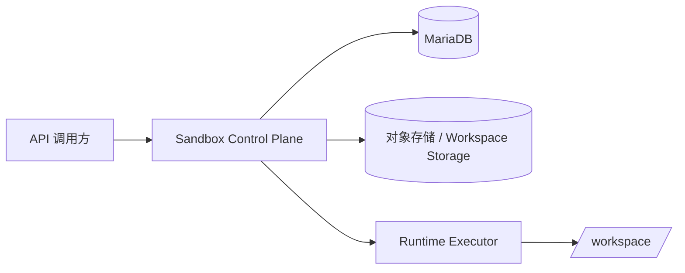
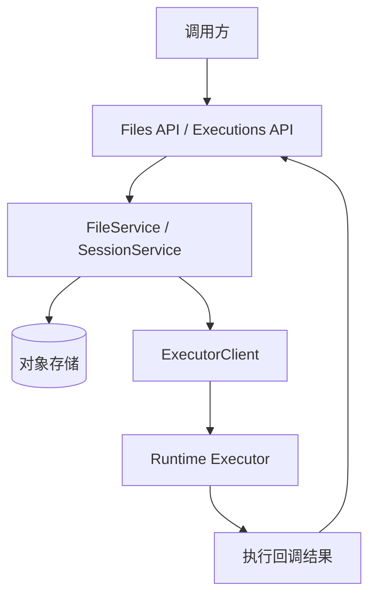
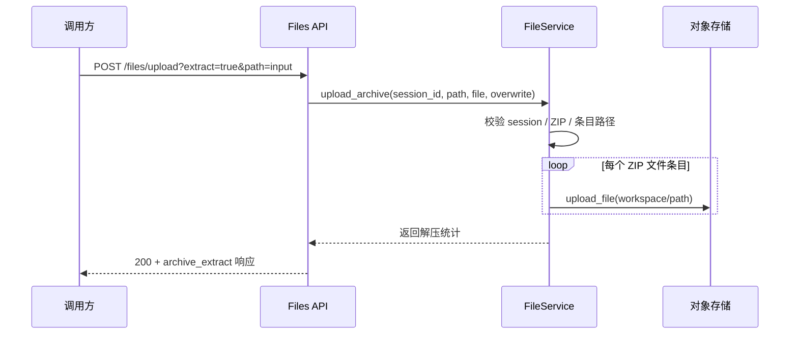
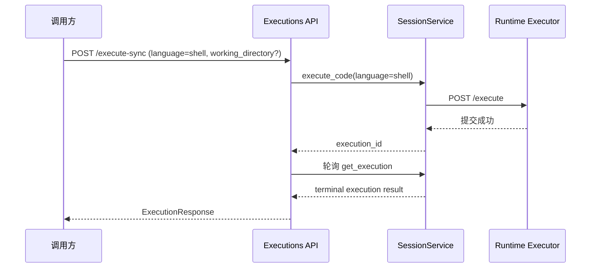

# 🏗️ Design Doc: 会话压缩包上传自动解压与 SHELL 执行

> 状态: Draft  
> 负责人: 待确认  
> Reviewers: 待确认  
> 关联 PRD: ../../product/prd/session-archive-upload-and-shell-execution-prd.md  

---

# 📌 1. 概述（Overview）

## 1.1 背景

- 当前现状：
  - `sandbox_control_plane/src/interfaces/rest/api/v1/files.py` 已暴露单文件上传接口，但只支持原样写入对象存储。
  - `sandbox_control_plane/src/application/services/file_service.py` 负责 session 校验与上传编排，但没有压缩包解压逻辑。
  - `sandbox_control_plane/src/interfaces/rest/api/v1/executions.py` 已暴露通用代码执行与同步执行接口。
  - 当前代码链路在枚举和执行分支上已出现 `shell` 支持痕迹，但对外 OpenAPI、请求描述、集成测试和正式产品语义尚未补齐，因此仍不能视为已正式支持 shell 脚本执行。

- 存在问题：
  - 多文件资源导入流程过长，调用方需要自行拆解 ZIP 并多次调用上传接口。
  - 现有执行接口对 `language=shell` 的语义没有正式定义，导致实现与文档脱节，调用方无法稳定依赖。
  - OpenAPI 未显式定义这两类能力，导致调用方和测试对接口能力理解不一致。

- 业务 / 技术背景：
  - 本期需求要求在现有接口能力上最小化扩展，不引入新的独立上传服务、独立 shell 路由或新的执行状态模型。
  - 现有 execution 链路、回调模型和 executor 隔离层已可复用，应优先补齐现有接口的 shell 正式支持能力。

---

## 1.2 目标

- 在现有文件上传接口上增加 ZIP 自动解压能力，保持单文件上传语义兼容。
- 改造现有执行接口，使 `/execute` 与 `/execute-sync` 正式支持 `language=shell`。
- shell 场景当前版本支持可选 `working_directory`，用于指定相对 workspace 根目录的执行目录。
- 对路径安全、覆盖策略、错误码和文档示例给出明确实现规则。
- 控制改动范围，优先在 control plane 完成协议适配和编排扩展，executor 仅做最小配合或复用。

---

## 1.3 非目标（Out of Scope）

- 不实现 `tar`、`tar.gz`、`7z` 等其他压缩格式。
- 不实现异步 ZIP 解压任务和解压进度查询。
- 不新增 SHELL 专用接口、流式输出接口或交互式终端。
- 不调整现有 sandbox 隔离架构和底层执行器协议的整体形态。

---

## 1.4 术语说明（Optional）

| 术语 | 说明 |
|------|------|
| ZIP 自动解压 | 调用方上传 ZIP 包并由 control plane 解析条目后写入 session workspace |
| SHELL 脚本执行 | 调用方通过现有执行接口传入 `language=shell` 和脚本内容 |
| working_directory | 相对 workspace 根目录的执行目录，仅在执行前设置 cwd，不改写脚本正文 |
| workspace | session 对应的工作目录，映射到对象存储路径和 executor 容器内 `/workspace` |
| overwrite | ZIP 解压时对已存在同路径文件的覆盖策略开关 |

---

# 🏗️ 2. 整体设计（HLD）

> 本章节关注系统“怎么搭建”，不涉及具体实现细节

---

## 🌍 2.1 系统上下文（C4 - Level 1）

### 参与者
- 用户：调用 sandbox REST API 的上层业务服务、AI Agent、数据处理服务
- 外部系统：对象存储、MariaDB
- 第三方服务：无新增第三方依赖

### 系统关系



说明：

- 调用方只访问 control plane，对象存储和 executor 仍位于平台内部边界。
- ZIP 自动解压主要发生在 control plane 编排层与对象存储之间。
- SHELL 脚本执行继续沿用 control plane 到 executor 的既有执行通道。

---

## 🧱 2.2 容器架构（C4 - Level 2）

| 容器 | 技术栈 | 职责 |
|------|--------|------|
| Sandbox Control Plane REST API | FastAPI | 扩展上传接口并修正现有执行接口的 shell 契约 |
| FileService | Python Application Service | session 校验、ZIP 解压编排、冲突策略处理 |
| Executor Client / SessionService | Python + httpx | 复用现有 execution 提交与同步轮询逻辑 |
| Runtime Executor | FastAPI + sandbox runner | 继续执行 shell 脚本并上报执行结果 |
| 对象存储 | S3-compatible | 保存 workspace 文件 |

### 容器交互



---

## 🧩 2.3 组件设计（C4 - Level 3）

### Control Plane 组件

| 组件 | 职责 |
|------|------|
| `interfaces.rest.api.v1.files` | 扩展上传参数、区分单文件与 ZIP 解压模式、映射错误码 |
| `application.services.file_service` | 实现 ZIP 校验、条目遍历、路径安全校验、覆盖策略和写入编排 |
| `interfaces.rest.schemas` | 定义新增请求/响应 schema 和 OpenAPI 描述 |
| `interfaces.rest.api.v1.executions` | 维持现有执行路由，修正 shell 请求契约、`working_directory` 和说明 |
| `application.commands.execute_code` | 继续作为通用执行命令载体，正式支持 `language=shell` 与 `working_directory` |
| `application.services.session_service` | 沿用执行创建、状态持久化和 executor 调用逻辑 |
| `infrastructure.executors.client` | 继续调用 executor `/execute`，无需新增内部 API |

### Runtime Executor 组件

| 组件 | 职责 |
|------|------|
| `interfaces.http.rest` | 保持 `/execute` 契约，接收 shell 脚本执行请求 |
| `infrastructure.isolation.code_wrapper` | 继续负责 shell 脚本包装 |
| `application.commands.execute_code` | 复用执行、心跳和结果上报主流程 |

---

## 🔄 2.4 数据流（Data Flow）

### 主流程



### 子流程（可选）



---

## ⚖️ 2.5 关键设计决策（Design Decisions）

| 决策 | 说明 |
|------|------|
| ZIP 能力复用现有 `/files/upload` | 兼容性最好，避免客户端按文件类型切换不同接口 |
| 解压逻辑放在 `FileService` | 压缩包语义属于应用层编排，不污染通用存储接口 |
| 首版仅支持 ZIP | 满足当前需求且安全/测试面可控 |
| SHELL 不新增专用接口 | 现有执行模型已能表达多语言脚本执行，新增接口会造成协议分叉 |
| SHELL 复用现有 execution 链路 | 降低实现成本，保持状态、回调和响应模型一致 |
| `working_directory` 作为通用执行增强先在 shell 场景落地 | 满足用户运行相对路径脚本的核心需求，避免强迫用户在脚本里手写 `cd` |
| 先补齐文档和测试，再对外承诺 shell 能力 | 当前主要缺口在产品契约和验证，不在执行主链路 |

---

## 🚀 2.6 部署架构（Deployment）

- 部署环境：K8s / Docker，沿用现有部署模式
- 拓扑结构：control plane 暴露 REST API，executor 运行在 session 对应运行节点或容器内部
- 扩展策略：不新增容器；通过现有 control plane 和 executor 实例水平扩展

---

## 🔐 2.7 非功能设计

### 性能
- ZIP 解压采用流式读取 ZIP 条目并逐文件上传，避免额外持久化中间文件到仓库。
- shell 场景复用现有同步轮询逻辑，不增加新轮询模型。

### 可用性
- 单文件上传和通用 `/execute-sync` 保持原有行为。
- 新增逻辑失败时不影响其他 API 路径。

### 安全
- ZIP 条目必须校验相对路径合法性，拒绝路径穿越和绝对路径。
- SHELL 脚本仍运行在现有 sandbox 隔离环境中。
- `working_directory` 仅允许相对 workspace 根目录的安全路径，不允许绝对路径、`..` 和 Windows 盘符路径。

### 可观测性
- tracing：沿用现有 control plane 与 executor tracing 点位
- logging：新增 ZIP 解压模式和 `language=shell` 相关日志字段
- metrics：补充 ZIP 解压请求量、失败量、shell 执行调用量和耗时分布

---

# 🔧 3. 详细设计（LLD）

> 本章节关注“如何实现”，开发可直接参考

---

## 🌐 3.1 API 设计

### ZIP 上传自动解压

**Endpoint:** `POST /api/v1/sessions/{session_id}/files/upload`

**Query 参数：**

- `path: string`，必填
- `extract: boolean = false`
- `overwrite: boolean = false`

**Request:**

```http
multipart/form-data
file=<binary>
```

**Response:**

```json
{
  "session_id": "sess_xxx",
  "mode": "archive_extract",
  "extract_path": "input",
  "extracted_file_count": 3,
  "skipped_file_count": 1,
  "size": 40960
}
```

说明：

- `extract=false` 时维持现有响应结构，并补充 `mode=file`。
- `extract=true` 时返回解压统计结构，不再返回单一 `file_path` 作为唯一结果。

### 现有执行接口支持 SHELL

**Endpoint:** `POST /api/v1/executions/sessions/{session_id}/execute`

**Request:**

```json
{
  "code": "pwd && ls -la",
  "language": "shell",
  "timeout": 30,
  "working_directory": "skill/mini-wiki"
}
```

**Response:**

```json
{
  "execution_id": "exec_20260408_abcd1234",
  "session_id": "sess_xxx",
  "status": "pending"
}
```

**Endpoint:** `POST /api/v1/executions/sessions/{session_id}/execute-sync`

**Request:**

```json
{
  "code": "pwd && ls -la",
  "language": "shell",
  "timeout": 30,
  "working_directory": "skill/mini-wiki"
}
```

**Response:**

```json
{
  "id": "exec_20260408_abcd1234",
  "session_id": "sess_xxx",
  "status": "completed",
  "language": "shell",
  "timeout": 30,
  "exit_code": 0,
  "stdout": "/workspace\n...",
  "stderr": "",
  "created_at": "2026-04-08T10:00:00Z",
  "started_at": "2026-04-08T10:00:01Z",
  "completed_at": "2026-04-08T10:00:02Z"
}
```

说明：

- shell 继续复用现有执行请求结构，在原有字段基础上新增 `working_directory`。
- 当 `language=shell` 时，`code` 表示 shell 脚本内容，而不是 Python handler。
- `working_directory` 为可选字段，表示相对 workspace 根目录的执行目录。
- `/execute` 保持异步语义，`/execute-sync` 保持同步语义。

错误码约定：

- `400`: ZIP 解析失败、路径非法
- `404`: session 不存在
- `408`: 同步执行超时
- `409`: 预留给全量冲突语义；本期默认以统计结果处理冲突，不强制返回 409
- `413`: 上传包超过大小限制
- `422`: 请求参数校验失败
- `503`: executor 不可达

---

## 🗂️ 3.2 数据模型

### UploadArchiveResponse

| 字段 | 类型 | 说明 |
|------|------|------|
| `session_id` | string | session 标识 |
| `mode` | string | `file` 或 `archive_extract` |
| `file_path` | string \| null | 单文件上传返回 |
| `extract_path` | string \| null | 解压目标目录 |
| `extracted_file_count` | integer \| null | 成功写入文件数 |
| `skipped_file_count` | integer \| null | 冲突跳过文件数 |
| `size` | integer | 原始上传内容大小 |

### ExecuteCodeRequest shell 语义

| 字段 | 类型 | 说明 |
|------|------|------|
| `code` | string | 当 `language=shell` 时表示要执行的 shell 脚本内容 |
| `language` | string | 固定为 `shell` |
| `timeout` | integer | 执行超时，默认 30 秒 |
| `event` | object \| null | shell 场景下不使用，保持兼容但不作为能力承诺 |
| `working_directory` | string \| null | 相对 workspace 根目录的执行目录；未传则默认 `/workspace` |

---

## 💾 3.3 存储设计

- 存储类型：对象存储
- 数据分布：继续写入 `session.workspace_path` 对应的存储前缀
- 索引设计：无新增数据库索引和表结构变更

说明：

- ZIP 包自身不要求持久化保留为独立文件；本期设计按“解压写入结果文件”为主。
- 若实现阶段保留原 ZIP 文件用于审计，属于可选优化，不作为当前必需交付。

---

## 🔁 3.4 核心流程（详细）

### ZIP 上传并解压流程

1. REST 层读取上传文件内容并校验 100MB 限制。
2. 若 `extract=false`，调用现有 `upload_file` 路径。
3. 若 `extract=true`：
4. 校验文件扩展名或 content type 为 ZIP。
5. 在 `FileService` 中校验 session 存在且可用。
6. 用 `zipfile.ZipFile` 解析字节流。
7. 遍历每个条目，规范化相对路径并校验：
8. 拒绝空路径、绝对路径、`..`、Windows 盘符路径。
9. 组合目标路径 `session.workspace_path/path/entry_relative_path`。
10. 检查目标文件是否存在。
11. `overwrite=false` 且文件存在时跳过并累计 `skipped_file_count`。
12. 否则上传文件内容到存储并累计 `extracted_file_count`。
13. 返回统一响应结构。

### 现有执行接口 shell 流程

1. REST 层接收现有 `ExecuteCodeRequest`。
2. 当 `language=shell` 时，按 shell 脚本内容校验 `code` 非空、`timeout` 合法、`working_directory` 为安全相对路径。
3. control plane 创建 `ExecuteCodeCommand(session_id, code, language="shell", timeout, event_data={}, working_directory=...)`。
4. `SessionService` 生成 execution 并保存。
5. `ExecutorClient` 继续调用 executor `/execute`。
6. executor 根据 `working_directory` 计算实际 cwd：
   - 未传时使用 `/workspace`
   - 传入时使用 `/workspace/<working_directory>`
7. executor 在隔离层中走 `bash -c execution.code` 分支。
8. `/execute-sync` 沿用现有同步轮询逻辑返回 `ExecutionResponse`。

---

## 🧠 3.5 关键逻辑设计

### ZIP 路径安全校验
- 对每个 ZIP entry 使用 `PurePosixPath` 规范化。
- 任何包含 `..`、以 `/` 开头、带盘符前缀的 entry 直接判定非法。
- 解压目标 `path` 自身也必须是 workspace 相对路径。
- 发现非法条目时拒绝整个请求，避免部分写入造成不一致。

### 覆盖策略
- `overwrite=false`：
  - 目标文件已存在则跳过
  - 接口整体成功，返回跳过数
- `overwrite=true`：
  - 目标文件已存在时直接覆盖
- 本期不做跨文件事务回滚，按逐文件写入结果返回统计

### SHELL 执行语义
- 不新增命令包装层。
- 现有 shell 执行直接以 `bash -c execution.code` 运行。
- 文档需明确 `code` 在 shell 场景下的语义。
- shell 场景不承诺 `return_value`。
- 对用户脚本内容不做命令级解析或改写，兼容以下写法：
  - `bash run.sh`
  - `sh run.sh`
  - `python main.py`
  - `cd skill/mini-wiki && python main.py`
  - `bash run.sh && python tools/build.py`
  - `bash ls xx/xx/` 这类完整 shell 内容
  - `bash cd xx/xx/ & bash python xxx.py` 这类完整 shell 内容
- `working_directory` 只负责设置执行前 cwd，不替代 shell 自身的 `cd`、`&&`、管道等语义。

### 兼容性策略
- 原 `ExecuteCodeRequest` 结构保持不变，但文档语义需要按语言区分。
- 在现有请求结构上新增可选 `working_directory`，对旧客户端保持向后兼容。
- 原 `upload_file` 对调用方默认无行为变化。
- OpenAPI 中对新增字段和默认值明确标注，避免旧客户端误读。

---

## ❗ 3.6 错误处理

- `SessionNotFound`：返回 404
- `SessionInactive`：返回 400
- `FileTooLarge`：返回 413
- `InvalidArchiveType`：返回 422
- `InvalidArchiveEntryPath`：返回 400
- `ArchiveParseError`：返回 400
- `StorageWriteError`：返回 400 或 500，按现有存储错误映射
- `EmptyShellCode`：返回 422
- `InvalidWorkingDirectory`：返回 400 或 422，按现有参数校验错误语义处理
- `ExecutorTimeout`：返回 408
- `ExecutorUnavailable`：返回 503

---

## ⚙️ 3.7 配置设计

| 配置项 | 默认值 | 说明 |
|--------|--------|------|
| `upload_max_size_mb` | 100 | 上传文件与 ZIP 包大小上限 |
| `archive_extract_enabled` | true | 是否启用 ZIP 自动解压能力 |
| `execute_sync_timeout` | 300 | 现有同步执行接口默认超时 |
| `execute_sync_poll_interval` | 0.5 | 同步轮询间隔，沿用现有执行接口默认值 |
| `default_shell_working_directory` | `/workspace` | shell 场景未传 `working_directory` 时的默认执行目录 |

---

## 📊 3.8 可观测性实现

- tracing：
  - 在 `/files/upload` 增加 `extract`、`overwrite`、`mode` 标签
  - 在现有执行接口增加 `language=shell`、`has_working_directory` 标签

- metrics：
  - `sandbox_file_upload_archive_requests_total`
  - `sandbox_file_upload_archive_failures_total`
  - `sandbox_file_upload_archive_extracted_files_total`
  - `sandbox_execution_shell_requests_total`
  - `sandbox_execution_shell_duration_seconds`
  - `sandbox_execution_shell_timeouts_total`
  - `sandbox_execution_shell_working_directory_requests_total`

- logging：
  - ZIP 上传日志记录 `session_id`、`extract_path`、`extracted_file_count`、`skipped_file_count`
  - shell 执行日志记录 `session_id`、`execution_id`、`timeout`、`working_directory`
  - 日志不直接打印完整脚本内容，避免敏感信息扩散；默认仅打印长度和前缀摘要

---

# ⚠️ 4. 风险与权衡（Risks & Trade-offs）

| 风险 | 影响 | 解决方案 |
|------|------|----------|
| ZIP 文件条目数量极大 | 接口耗时上升 | 首版接受该权衡，通过上传大小限制和日志监控控制风险 |
| 冲突文件按跳过处理可能不符合部分调用方预期 | 调用方误以为全量成功 | 响应中返回明确统计，并在文档中清晰说明默认策略 |
| 现有代码中已有 shell 分支但未正式产品化 | 调用方误解平台能力边界 | 通过 OpenAPI、文档、集成测试和错误语义统一对外口径 |
| `working_directory` 处理不当可能造成路径越界或目录不存在 | 执行失败或安全风险 | 在 control plane 和 executor 双侧做路径规范化校验，并在执行前验证目录存在性 |
| 不新增数据库表导致无法记录每次解压明细 | 事后审计信息有限 | 本期不新增持久化审计模型，以日志和指标满足基础观测 |

---

# 🧪 5. 测试策略（Testing Strategy）

- 单元测试：
  - `FileService` 覆盖 ZIP 校验、路径安全、覆盖策略、冲突统计
  - 执行请求 schema 覆盖 shell 场景下的枚举、空脚本、默认值
  - shell 执行分支覆盖 `bash -c` 命令构建
  - `working_directory` 覆盖默认根目录、合法子目录、非法路径
  - 完整脚本内容覆盖 `bash run.sh`、`sh run.sh`、`cd ... && python ...`、`bash cd xx/xx/ & bash python xxx.py` 等写法

- 集成测试：
  - `/files/upload` 保持单文件上传兼容
  - 合法 ZIP 自动解压成功
  - 非法 ZIP、路径穿越、超大文件返回正确错误码
  - `/execute-sync` 在 `language=shell` 下成功返回 stdout/stderr/exit_code
  - `/execute-sync` 在 `language=shell` 且设置 `working_directory` 时，相对路径脚本执行成功
  - shell 内容原样执行，包含 `cd ... && ...` 写法时行为符合 shell 预期
  - 超时和 executor 不可达场景返回正确错误

- 压测：
  - 对 50MB 与 100MB 附近 ZIP 包进行上传与解压接口基准测试
  - 对高频 `language=shell` 同步执行调用验证 control plane 轮询负载可接受

---

# 📅 6. 发布与回滚（Release Plan）

### 发布步骤
1. 更新 OpenAPI、REST schema 和服务实现。
2. 补齐单元测试与集成测试。
3. 在测试环境验证 ZIP 解压和现有执行接口的 shell 链路。
4. 与调用方确认新接口契约后发布。

### 回滚方案
- 若 ZIP 自动解压出现问题，可将 `archive_extract_enabled` 关闭，仅保留原单文件上传。
- 若 shell 正式支持出现问题，可回滚 `language=shell` 的对外契约说明和相关实现修补，不影响其他语言执行。
- 若文档与实现不一致，以回滚代码或修正文档到同一版本为准，不带缺陷发布。

---

# 🔗 7. 附录（Appendix）

## 相关文档
- PRD: ../../product/prd/session-archive-upload-and-shell-execution-prd.md
- 其他设计：../../design/features/session-python-dependency-management.md

## 参考资料
- ../../api/rest/sandbox-openapi.json
- ../../api/rest/execute-sync-openapi.yaml
- `sandbox_control_plane/src/interfaces/rest/api/v1/files.py`
- `sandbox_control_plane/src/interfaces/rest/api/v1/executions.py`

---
