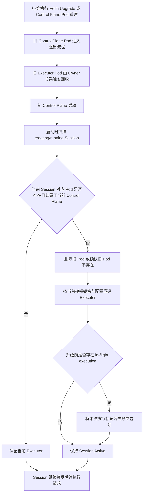

# 🧩 PRD: Control Plane 与 Executor 生命周期绑定

> 状态: Draft  
> 负责人: 待确认  
> 更新时间: 2026-04-13  

---

## 📌 1. 背景（Background）

- 当前现状：
  - Kubernetes 模式下，`sandbox_control_plane` 直接创建 executor Pod，但 executor Pod 与 control plane Pod 之间没有 owner 关系。
  - `helm upgrade` 或 control plane Pod 重建时，历史 executor Pod 不会自动回收，仍继续以旧镜像、旧环境变量、旧配置运行。
  - 如果 control plane Pod 被删除，历史 session 对应的 executor Pod 仍会残留在集群中，需要人工清理。
  - 系统已有 session 状态同步、健康检查和清理任务，但它们更偏向 session 业务态维护，不负责 control plane 升级接管。

- 存在问题：
  - 历史 executor 无法随 control plane 升级自动切换到新镜像和新配置，导致新版本发布后同一集群内长期存在新旧 executor 混跑。
  - control plane 实例被删除后，executor 残留会持续占用资源，增加运维清理成本。
  - active session 在 control plane 重建后缺少统一接管流程，导致 session 与 executor 归属关系不明确。
  - 正在执行中的任务在升级过程中被中断后，系统缺少面向调用方的一致状态语义。

- 触发原因 / 业务背景：
  - 平台已经进入 Helm 发布和滚动升级场景，control plane 升级频率提升。
  - 调用方要求 session 在平台升级或 control plane 重建后仍可继续使用，不接受因为基础设施重建导致 session 直接失效。
  - 运维侧希望把 executor 生命周期收敛到 control plane 实例，避免手动清理悬挂 Pod。

---

## 🎯 2. 目标（Objectives）

- 业务目标：
  - 在 Kubernetes 环境中，将 control plane 升级/重建后的历史 executor 残留数量降低到 0，人工清理次数降低到 0。
  - 将 active session 在 control plane 重建后的自动接管覆盖率提升到 100%。

- 产品目标：
  - `helm upgrade` 或 control plane Pod 重建后，历史 executor Pod 在旧 control plane Pod 删除后自动回收。
  - 新 control plane 启动后，对所有 active session 在一次启动接管流程内完成 executor 归属切换。
  - 因升级中断的 in-flight execution 明确标记为失败或崩溃，但 session 保持可继续使用。
  - 用户主动终止 session、以及业务异常导致的 failed 语义保持与当前系统一致，不出现回归。

---

## 👤 3. 用户与场景（Users & Scenarios）

### 3.1 用户角色

| 角色 | 描述 |
|------|------|
| 终端用户 | 通过上层业务或 Agent 使用 session 执行代码，希望升级后 session 仍可继续使用。 |
| 开发者 | 负责接入 sandbox API，希望 session 和 execution 状态在升级场景下可预测、可处理。 |
| 管理员 | 负责 Helm 发布和 Kubernetes 运维，希望升级后旧 executor 自动清理，无需手工排障。 |

---

### 3.2 用户故事（User Story）

- 作为平台运维，我希望 control plane 升级时旧 executor 自动回收，从而避免发布后残留旧版本 Pod。
- 作为 API 调用方，我希望 control plane 重建后 session 仍然存在并可继续使用，从而不需要重新创建业务上下文。
- 作为开发者，我希望升级期间被打断的执行结果有明确失败语义，从而能够在上层重试或补偿。

---

### 3.3 使用场景

- 场景1：平台执行 `helm upgrade`，旧 control plane Pod 被滚动替换，旧 executor 自动清理，新 control plane 接管 active session 并重建 executor。
- 场景2：control plane Pod 因节点驱逐、崩溃或人工删除而重建，新实例启动后自动接管已有 active session。
- 场景3：用户主动删除 session，系统按现有逻辑删除 executor、回收 session 资源，不受本需求影响。
- 场景4：session 内某次代码执行发生业务异常，execution/session 状态仍按现有 failed 逻辑处理，不因生命周期绑定机制改变。

---

## 📦 4. 需求范围（Scope）

### ✅ In Scope

- 为 Kubernetes 模式下创建的 executor Pod 增加与当前 control plane Pod 的生命周期绑定关系。
- 在 control plane 启动阶段增加 active session 全量接管流程。
- 对升级或重建期间中断的 in-flight execution 给出明确失败语义。
- 在接管过程中按当前模板镜像和最新 control plane 配置重建 executor。
- 补充日志、指标和验收用例，支持定位升级接管结果。

### ❌ Out of Scope

- Docker 本地模式下的容器生命周期绑定。
- 多副本 control plane 的并发接管、leader election 和租约协调。
- 正在运行中的 execution 无缝迁移、断点续跑或 drain 升级。
- 升级过程中保留旧 executor 直到其自然退出的延迟清退策略。

---

## ⚙️ 5. 功能需求（Functional Requirements）

### 5.1 功能结构

    Control Plane 升级接管
    ├── Executor 生命周期绑定
    ├── 启动时 Active Session 接管
    ├── 升级中断执行状态处理
    └── 监控与运维可观测性

---

### 5.2 详细功能

#### 【FR-1】Kubernetes Executor 生命周期绑定

**描述：**  
Kubernetes 模式下，control plane 创建 executor Pod 时，必须为该 Pod 建立到当前 control plane Pod 的 owner 关系，使 executor 的基础设施生命周期从属于 control plane 实例。

**用户价值：**  
解决 control plane 升级或删除后 executor 残留的问题，确保 executor 随 control plane 基础设施变更自动回收。

**交互流程：**
1. control plane Pod 启动并获取自身 Pod 标识信息。
2. 用户创建或恢复 session，control plane 发起 executor Pod 创建。
3. 系统在 executor Pod 元数据中写入当前 control plane Pod 的 owner 信息。
4. 当旧 control plane Pod 被 Kubernetes 删除时，其名下 executor Pod 由 Kubernetes 自动垃圾回收。

**业务规则：**
- 仅 Kubernetes 模式启用该能力。
- owner 必须绑定到当前 control plane Pod，而不是 Deployment。
- executor Pod 仍需保留 session 和模板相关标签，便于后续接管与排障。

**边界条件：**
- 当前版本仅支持单副本 control plane。
- 若缺少当前 Pod 标识信息，系统不得创建无法绑定 owner 的 executor Pod，需显式报错。

**异常处理：**
- owner 写入失败时，session 创建或恢复流程返回基础设施错误。
- Kubernetes 垃圾回收延迟时，接管流程仍需能够识别旧 executor 并主动删除。

---

#### 【FR-2】Control Plane 启动时接管 Active Session

**描述：**  
control plane 在启动阶段必须扫描所有 active session，并根据当前 control plane 实例接管这些 session 对应的 executor。

**用户价值：**  
保证 control plane 升级或重建后，已有 session 仍然可用，不需要调用方重建业务上下文。

**交互流程：**
1. 新 control plane 启动并完成基础依赖初始化。
2. 系统扫描数据库中 `creating` 和 `running` 状态的 session。
3. 系统读取每个 session 当前关联的 executor Pod。
4. 若 Pod 不存在、无 owner 或 owner 不属于当前 control plane，则删除旧 Pod 并重建新 executor。
5. 若 Pod 已属于当前 control plane 且状态健康，则保持现状。
6. 接管完成后，session 继续保持 active，可接受后续执行请求。

**业务规则：**
- 接管触发方式固定为 control plane 启动即全量执行。
- 无 owner 的历史 executor 视为旧 Pod，必须纳入接管。
- 重建 executor 时必须使用当前模板镜像和当前 control plane 配置。
- session 业务状态不因升级接管直接变为 terminated。

**边界条件：**
- 仅对 `creating`、`running` 状态的 session 执行接管。
- 已 `terminated`、`failed`、`timeout` 的 session 继续沿用现有清理逻辑。

**异常处理：**
- 单个 session 接管失败时，记录错误并继续处理其他 session。
- 启动接管出现部分失败时，control plane 仍可启动成功，但需输出错误日志和统计信息。

---

#### 【FR-3】升级期间 in-flight execution 状态处理

**描述：**  
如果 control plane 升级或重建导致旧 executor 被删除，旧 executor 上未完成的 execution 必须被标记为失败或崩溃，但对应 session 仍然保留。

**用户价值：**  
调用方可以明确识别“本次执行因基础设施升级中断”，并对单次执行做重试或补偿，而不影响 session 复用。

**交互流程：**
1. 升级或重建触发旧 control plane Pod 退出。
2. 旧 executor 被 Kubernetes GC 或被新 control plane 主动删除。
3. 未完成的 execution 无法继续运行。
4. 系统将该 execution 标记为失败或崩溃。
5. 新 executor 重建完成后，session 继续接受新的执行请求。

**业务规则：**
- session 保持 active，不因升级中断而被终止。
- 本期不支持运行中任务无缝迁移或续跑。
- 本次 execution 的失败原因需要能与普通业务代码失败区分，具体错误文案待确认。

**边界条件：**
- 若 execution 在旧 executor 删除前已经成功上报结果，则不得重复标记失败。
- 若 session 当前无 in-flight execution，则仅进行 executor 接管。

**异常处理：**
- 状态回写失败时，系统记录错误并通过后续状态同步兜底。
- 如 execution 无法精确定位，至少保证 session 可继续被接管和使用。

---

#### 【FR-4】正常 Session 终止与失败语义保持不变

**描述：**  
新增生命周期绑定能力后，用户主动终止 session、以及业务异常导致 session failed 的既有行为保持不变。

**用户价值：**  
避免此次基础设施改造改变调用方对现有 API 的使用预期。

**交互流程：**
1. 用户主动删除 session，系统执行现有 terminate 和资源清理流程。
2. 业务执行异常导致 session 或 execution 失败，系统沿用现有失败语义。
3. 周期性 idle/expired/orphan 清理任务继续按现有策略运行。

**业务规则：**
- 生命周期绑定只覆盖 control plane 升级或重建接管场景。
- 现有 session 删除、失败、超时、清理逻辑不调整产品语义。

**边界条件：**
- 新增逻辑不得把正常失败场景误判为升级接管场景。
- 正常 session 终止后不得被启动接管流程重新拉起 executor。

**异常处理：**
- 如接管流程与现有清理流程发生冲突，以 session 当前终态为准，不再重建 executor。

---

## 🔄 6. 用户流程（User Flow）

    运维执行 Helm 升级 → 旧 Control Plane Pod 退出 → 旧 Executor Pod 自动回收 → 新 Control Plane 启动 → 扫描 Active Session → 重建需要接管的 Executor → Session 继续可用

---

## 🎨 7. 交互与体验（UX/UI）

### 7.1 页面 / 模块
- Session 查询接口返回的 session 状态与 execution 状态
- 运维日志与监控面板
- 待确认：是否需要在 Web 控制台展示“因升级中断”的专门状态提示

### 7.2 交互规则
- 点击行为：本需求无新增前端操作入口。
- 状态变化：升级期间可能出现“单次 execution failed/crashed，但 session 仍为 active”的状态组合。
- 提示文案：调用方通过查询接口或日志识别“执行因基础设施升级中断”，具体文案待确认。

---

## 🚀 8. 非功能需求（Non-functional Requirements）

### 8.1 性能
- control plane 启动接管流程应支持在 1 分钟内完成 100 个 active session 的扫描与分批重建，具体压测基线待确认。
- 单个 session 的接管判定和重建不应阻塞其他 session 的处理。

### 8.2 可用性
- control plane 单实例重建后，系统需自动恢复 active session 的可用性。
- 升级后不允许长期存在无法被任何 control plane 接管的 executor Pod。

### 8.3 安全
- 仅 control plane 使用的 ServiceAccount 有权创建、查询和删除 executor Pod。
- 不新增对外暴露的高权限管理接口。

### 8.4 可观测性
- 支持 tracing
- 支持日志
- 支持指标监控
- 必须输出接管统计：扫描总数、重建数、跳过数、失败数

---

## 📊 9. 埋点与分析（Analytics）

| 事件 | 目的 |
|------|------|
| `control_plane_session_takeover_started` | 统计一次启动接管任务的开始次数与触发来源 |
| `control_plane_session_takeover_completed` | 统计接管结果，包括扫描数、重建数、失败数 |
| `executor_recreated_after_control_plane_restart` | 统计 executor 因升级或重建被接管重建的次数 |
| `execution_interrupted_by_executor_takeover` | 统计升级期间被中断的 execution 数量 |

---

## ⚠️ 10. 风险与依赖（Risks & Dependencies）

### 风险
- 单副本前提若被打破，多实例可能并发接管同一 session。
- 启动即全量接管会增加 control plane 启动耗时。
- in-flight execution 失败后，上层调用方若未做好幂等或重试，可能产生业务影响。
- Kubernetes 垃圾回收或 Pod 删除存在短暂延迟，可能导致启动接管时遇到旧 Pod 残留。

### 依赖
- 外部系统：Kubernetes API Server、Helm 发布流程、MariaDB、MinIO
- 内部服务：`sandbox_control_plane`、`runtime/executor`

---

## 📅 11. 发布计划（Release Plan）

| 阶段 | 时间 | 内容 |
|------|------|------|
| 需求评审 | 待确认 | 评审 session 语义与升级中断处理 |
| 开发 | 待确认 | 实现 owner 绑定、启动接管、状态更新与监控 |
| 测试 | 待确认 | 覆盖升级、重建、删除、正常终止和异常失败回归 |
| 发布 | 待确认 | 先在测试环境验证 Helm 升级，再灰度到生产 |

---

## ✅ 12. 验收标准（Acceptance Criteria）

    Given Kubernetes 模式下存在 active session
    When 运维执行 helm upgrade 导致 control plane Pod 滚动替换
    Then 旧 control plane 名下的 executor Pod 被自动回收，且新 control plane 启动后可以接管这些 session

    Given 某个 running session 在 control plane 重建时存在 in-flight execution
    When 旧 executor 被删除并由新实例重建
    Then 本次 execution 被标记为失败或崩溃，且 session 仍保持可继续使用

    Given 用户主动删除一个 session
    When 系统执行现有 terminate 流程
    Then executor 被清理且 session 进入终态，不会被启动接管流程重新拉起

    Given 某个 session 因业务执行异常进入 failed
    When 后续 control plane 启动执行接管扫描
    Then 该 session 不会被当作 active session 重建 executor

---

## 🔗 附录（Optional）

- 相关文档：
  - [实现设计文档](../../design/features/control-plane-executor-lifecycle-binding-design.md)
  - [Control Plane 模块说明](../../design/modules/control-plane.md)
  - [Executor 模块说明](../../design/modules/executor.md)

- 参考资料：
  - [Kubernetes Pod 生命周期与垃圾回收机制](https://kubernetes.io/docs/concepts/workloads/pods/pod-lifecycle/)
  - [现有 Session Python 依赖管理 PRD](./session-python-dependency-management.md)

---
