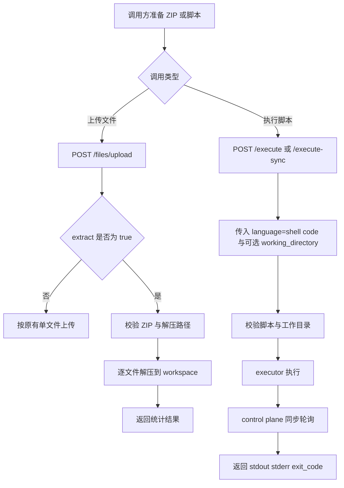

# 🧩 PRD: 会话压缩包上传自动解压与 SHELL 执行

> 状态: Draft  
> 负责人: 待确认  
> 更新时间: 2026-04-08  

---

## 📌 1. 背景（Background）

- 当前现状：
  - `sandbox_control_plane` 已提供 `POST /api/v1/sessions/{session_id}/files/upload`，仅支持单文件上传到 session workspace。
  - 当前上传接口没有压缩包语义，上传 ZIP 后仍只会以原始文件形式保存。
  - 平台已提供通用代码执行接口 `POST /api/v1/executions/sessions/{session_id}/execute` 和 `execute-sync`，但当前对外契约仍按 Python Lambda handler 语义描述，尚不能作为正式的 shell 脚本执行能力对外发布。
  - 现有 OpenAPI 文档 `docs/api/rest/sandbox-openapi.json` 未对压缩包自动解压和“现有执行接口支持 shell 脚本”进行正式定义。

- 存在问题：
  - 调用方上传项目模板、依赖资源包、测试数据集时，需要自行拆包并多次上传，接入成本高。
  - 上层业务通常需要执行 `pwd`、`ls -la`、`bash run.sh` 这类 shell 命令或脚本，但平台当前未把现有执行接口正式定义为 shell 执行能力，调用方无法稳定依赖。
  - 缺少压缩包路径安全、覆盖策略、错误码等产品化约束，调用方难以稳定依赖该能力。
  - 文档与实现能力之间存在空白，评审、开发、测试缺少统一基线。

- 触发原因 / 业务背景：
  - 近期需求明确要求在当前上传文件能力基础上支持“上传压缩包并自动解压”。
  - 近期需求明确要求支持 SHELL 脚本执行。
  - 经过方案分析，优先选择改造现有执行代码接口支持 `language=shell`，而不是新增专用接口。
  - 需要以最小破坏方式扩展现有 API，降低上层业务迁移和接入成本。

---

## 🎯 2. 目标（Objectives）

- 业务目标：
  - 将“上传多文件资源到 sandbox”的调用步骤从“调用方本地解压 + 多次上传”缩减为“一次上传 + 服务端解压”。
  - 将现有执行接口补齐为正式可用的 SHELL 脚本执行能力，减少调用方为了 shell 场景额外适配新接口的成本。

- 产品目标：
  - 在不下线现有上传和通用执行接口的前提下，新增能力对现有调用方零破坏。
  - ZIP 自动解压能力首版成功覆盖常见项目资源导入场景，支持嵌套目录解压。
  - 现有 `/execute` 与 `/execute-sync` 正式支持 `language=shell`，并补齐文档、错误语义和测试覆盖。
  - shell 场景首版支持可选 `working_directory`，让调用方可按 workspace 相对目录运行脚本和命令。
  - 上传和执行相关错误需通过明确状态码和错误信息暴露，便于调用方自动处理。

---

## 👤 3. 用户与场景（Users & Scenarios）

### 3.1 用户角色

| 角色 | 描述 |
|------|------|
| 终端用户 | 不直接调用 API，但依赖上层 Agent/平台把代码、资源或命令下发到 sandbox |
| 开发者 | 集成 sandbox API 的后端服务、AI Agent、数据处理服务开发者 |
| 管理员 | 维护平台能力边界、审核 API 变更、保障稳定性和安全性的平台维护者 |

---

### 3.2 用户故事（User Story）

- 作为调用 sandbox API 的开发者，我希望一次上传 ZIP 压缩包后由平台自动解压到 workspace，从而减少文件拆分和多次上传的接入复杂度。
- 作为调用 sandbox API 的开发者，我希望通过现有执行接口提交 shell 脚本并拿到 stdout、stderr 和 exit code，从而快速驱动诊断、脚本执行和任务编排。
- 作为调用 sandbox API 的开发者，我希望在执行 shell 时指定 `working_directory`，从而直接使用相对工作区的相对脚本路径，而不必总是在脚本里手写 `cd`。
- 作为平台维护者，我希望压缩包解压和 SHELL 命令执行都有明确的安全边界和错误语义，从而让能力可控、可测试、可审计。

---

### 3.3 使用场景

- 场景1：调用方将包含脚本、配置和输入数据的 ZIP 包上传到指定 session，并自动解压到 `workspace/input/` 目录后再执行任务。
- 场景2：调用方上传一个 ZIP 数据包到 workspace，随后调用现有 `execute-sync` 接口并传入 `language=shell` 运行 `bash scripts/run.sh`。
- 场景3：调用方希望在调试 session 时通过现有执行接口快速执行 `pwd && ls -la`，同步查看目录状态和运行结果。
- 场景4：调用方希望在 `skill/mini-wiki/` 目录下执行 `bash run.sh` 或 `python main.py`，因此在请求中传入 `working_directory=skill/mini-wiki`。
- 场景5：调用方传入的 shell 内容本身包含完整命令串，例如 `bash run.sh && python tools/build.py`、`sh run.sh`、`cd xx/xx && python main.py`，平台应按原样交给 shell 执行。
- 场景6：调用方传入的 shell 内容本身带有 `bash` 或 `sh` 前缀，甚至是 `bash ls xx/xx/`、`bash cd xx/xx/ & bash python xxx.py` 这类完整内容，平台不应做命令级改写，而应按原样交给 shell。
- 场景7：调用方误传非法 ZIP、非法 `working_directory`，或压缩包内包含路径穿越文件，平台应直接拒绝并返回明确错误。

---

## 📦 4. 需求范围（Scope）

### ✅ In Scope

- 扩展现有 `POST /api/v1/sessions/{session_id}/files/upload`，支持通过参数开启 ZIP 自动解压。
- 首版仅支持 ZIP 格式，不支持 `tar`、`tar.gz`、`7z`。
- 支持将 ZIP 包解压到调用方指定的 workspace 相对目录。
- 支持覆盖策略控制：允许覆盖或跳过冲突文件。
- 改造现有 `POST /api/v1/executions/sessions/{session_id}/execute` 与 `execute-sync`，正式支持 `language=shell`。
- 在现有执行请求模型中增加可选 `working_directory`，用于指定相对 workspace 根目录的执行目录。
- 复用现有 execution 生命周期和返回模型，避免引入第二套执行结果结构。
- 更新 OpenAPI 文档、请求示例、错误码说明和测试验收基线。

### ❌ Out of Scope

- 不新增独立的“压缩包异步解压任务”模型。
- 不支持多种压缩格式自动识别和解压。
- 不新增 SHELL 专用接口。
- 不支持交互式 shell、长连接终端、流式 stdout/stderr 返回。
- 不对用户传入的 shell 内容做命令级解析、改写或自动拆分。
- 不在本期实现基于用户身份的命令级权限模型或细粒度命令白名单。

---

## ⚙️ 5. 功能需求（Functional Requirements）

### 5.1 功能结构

    文件管理增强
    ├── 单文件上传（兼容保留）
    ├── ZIP 上传自动解压
    └── 解压覆盖策略与安全校验
    执行能力增强
    ├── 通用代码执行
    └── 现有执行接口正式支持 SHELL 脚本

---

### 5.2 详细功能

#### 【FR-1】ZIP 上传自动解压

**描述：**  
在现有上传文件接口上增加压缩包语义。调用方上传 ZIP 并显式声明解压后，平台将 ZIP 中的文件写入指定 session workspace 目录。

**用户价值：**  
减少调用方拆包、逐文件上传和目录重建的工作量，提升接入效率。

**交互流程：**
1. 调用方请求 `POST /api/v1/sessions/{session_id}/files/upload`。
2. 传入 `extract=true`，并通过 `path` 指定解压目标目录。
3. 平台校验 session 状态、文件大小、文件类型和 ZIP 合法性。
4. 平台逐条解析 ZIP 内容并写入 workspace。
5. 平台返回解压模式、目标路径、解压文件数、跳过文件数和原始上传包大小。

**业务规则：**
- 首版仅支持 ZIP。
- `extract=false` 时保持现有单文件上传语义不变。
- `extract=true` 时，`path` 表示目标目录而非单文件路径。
- ZIP 内嵌套目录结构需保留。
- 100MB 为上传包大小上限。

**边界条件：**
- 空 ZIP 允许上传，但返回解压文件数为 0。
- 目录条目可忽略，不作为错误。
- ZIP 中文件过多但总包大小未超限时，按正常流程处理。

**异常处理：**
- 非 ZIP 文件但传入 `extract=true` 返回参数校验错误。
- ZIP 损坏或无法解析返回上传失败错误。
- session 不存在或不可用时拒绝上传。
- 路径越界、绝对路径、盘符路径等非法条目直接拒绝整个解压请求。

---

#### 【FR-2】解压覆盖策略

**描述：**  
平台在 ZIP 解压时支持通过请求参数控制是否覆盖已存在文件。

**用户价值：**  
让调用方可以在“保守导入”和“强制替换”之间做出明确选择，避免隐式覆盖造成结果不可控。

**交互流程：**
1. 调用方在上传请求中传入 `overwrite`。
2. 平台在逐文件写入前判断目标文件是否存在。
3. 若 `overwrite=false`，冲突文件跳过并累计。
4. 若 `overwrite=true`，冲突文件覆盖写入。
5. 平台返回成功结果和冲突处理统计。

**业务规则：**
- 默认 `overwrite=false`。
- 冲突文件跳过时，非冲突文件仍继续解压。
- 返回结果中需体现 `skipped_file_count`。

**边界条件：**
- 所有文件都冲突时，接口仍可返回成功，但解压文件数为 0、跳过数大于 0。
- 同名文件位于不同目录时按完整相对路径判断，不视为冲突。

**异常处理：**
- 当底层存储写入失败时返回上传失败。
- 当调用方依赖“必须全部覆盖成功”时，本期通过结果统计判断，不额外增加事务回滚。

---

#### 【FR-3】现有执行接口支持 SHELL 脚本

**描述：**  
改造现有执行代码接口，使调用方通过现有 `/execute` 和 `/execute-sync` 提交 `language=shell` 与脚本内容时，可以作为正式能力使用。

**用户价值：**  
避免新增接口带来的接入分叉，让 shell 场景与其他语言共享一致的执行模型和结果结构。

**交互流程：**
1. 调用方向现有 `/execute` 或 `/execute-sync` 提交请求。
2. 请求体传入 `language=shell`，`code` 表示 shell 脚本内容。
3. 调用方可选传 `working_directory`，表示相对 workspace 根目录的执行目录。
4. 平台校验 session 状态、脚本内容、超时参数和 `working_directory` 合法性。
5. executor 以 workspace 根目录或指定子目录作为 cwd 执行脚本并回传结果。
6. 对于 `/execute-sync`，平台同步轮询到终态后返回 `stdout`、`stderr`、`exit_code`、`status` 等字段。

**业务规则：**
- 不新增新的路由路径。
- `language=shell` 时，`code` 字段语义为 shell 脚本内容。
- `working_directory` 为可选字段；未传时默认使用 workspace 根目录。
- `working_directory` 仅允许 workspace 相对路径，不允许绝对路径、`..` 或 Windows 盘符路径。
- `/execute` 保持异步提交语义，`/execute-sync` 保持同步返回语义。
- 返回结构与现有 `ExecutionResponse` 保持一致。
- `return_value` 对 shell 场景不做要求，可为空。
- 平台对 shell 内容不做命令级解析或重写，完整内容按原样交给 shell 执行。

**边界条件：**
- 空脚本不允许提交。
- 脚本长度需受限，避免超过现有执行链路可承载范围。
- shell 场景不要求 AWS Lambda handler 格式。
- `working_directory` 对目录不存在、不可达或非法路径需返回明确错误。
- 兼容完整 shell 内容写法，例如 `bash run.sh`、`sh run.sh`、`bash ls xx/xx/`、`cd xx/xx && python xxx.py`、`bash cd xx/xx/ & bash python xxx.py`。

**异常处理：**
- 同步执行超时返回 408。
- session 不存在、不可用或 executor 不可达时返回相应错误。
- shell 脚本非零退出码按现有 execution 失败语义返回。
- `working_directory` 非法时返回参数校验错误，不触发实际执行。

---

#### 【FR-4】OpenAPI 与文档对齐

**描述：**  
将新增参数、现有执行接口的 shell 语义、响应字段、错误码和示例更新到 `docs/api/rest/sandbox-openapi.json`，并同步完善相关 REST 文档。

**用户价值：**  
让调用方、测试和评审团队基于同一份接口契约协作，减少口径不一致。

**交互流程：**
1. 研发更新 OpenAPI schema。
2. 文档中补充 ZIP 上传与 `language=shell` 的脚本执行示例。
3. QA 和接入方按更新后的文档执行验证。

**业务规则：**
- 原有接口兼容行为必须保留。
- 新增能力必须在文档中显式标明默认值和错误语义。

**边界条件：**
- 若实现细节晚于文档落地，文档以产品规则为准，不保留模糊描述。

**异常处理：**
- 若最终实现与文档不一致，视为交付缺陷，需要在发布前修正。

---

## 🔄 6. 用户流程（User Flow）

    调用方上传 ZIP → 平台校验 → 自动解压到 workspace → 调用方调用现有 execute/execute-sync 并传 language=shell 与可选 working_directory → 平台返回执行结果

---

## 🎨 7. 交互与体验（UX/UI）

### 7.1 页面 / 模块
- 无新增前端页面，本期面向 REST API 调用方。
- 影响模块包括 OpenAPI 文档、API 客户端、自动化测试脚本。

### 7.2 交互规则
- 点击行为：不涉及 UI 点击行为。
- 状态变化：调用方需感知 `success / validation_error / timeout / failed`。
- 提示文案：错误消息需包含非法路径、非 ZIP、解压失败、命令为空、工作目录非法等明确原因。

---

## 🚀 8. 非功能需求（Non-functional Requirements）

### 8.1 性能
- 单次上传请求在 100MB 限制内完成接收和解压。
- `/execute-sync` 的 shell 场景默认在现有超时模型内完成，超时按现有 execution 模型返回。
- 不额外引入新的轮询或异步状态表。

### 8.2 可用性
- 复用现有 control plane 与 executor 部署拓扑，不新增独立服务。
- 新能力异常不影响现有单文件上传和通用执行接口可用性。

### 8.3 安全
- 解压时必须防止路径穿越、绝对路径写入。
- 本期继续依赖现有 sandbox 隔离环境，不扩大容器外部访问能力。
- `working_directory` 必须限制在 workspace 根目录内，避免目录越界执行。

### 8.4 可观测性
- 支持 tracing
- 支持日志
- 支持指标监控

---

## 📊 9. 埋点与分析（Analytics）

| 事件 | 目的 |
|------|------|
| `file_upload_archive_extract_started` | 统计 ZIP 解压请求量 |
| `file_upload_archive_extract_completed` | 统计解压成功率、解压文件数和跳过文件数 |
| `file_upload_archive_extract_failed` | 统计 ZIP 非法、路径越界、写入失败等错误类型 |
| `execution_shell_started` | 统计 `language=shell` 调用量 |
| `execution_shell_completed` | 统计 shell 执行成功率、耗时和退出码分布 |
| `execution_shell_timeout` | 监控 shell 执行超时情况 |
| `execution_shell_working_directory_used` | 统计 shell 调用中 `working_directory` 的使用率 |

---

## ⚠️ 10. 风险与依赖（Risks & Dependencies）

### 风险
- ZIP 解压为逐文件写入模式，极端大文件数场景可能拉长接口处理时长。
- `overwrite=false` 时的“部分成功”语义需要测试和调用方明确理解。
- 现有执行接口虽然具备 shell 分支，但若不修正文档和测试，调用方仍会误判平台并不支持 shell。
- `working_directory` 若缺少严格校验，可能导致路径越界或用户误以为平台会自动改写脚本路径。

### 依赖
- 外部系统：无新增外部系统依赖。
- 内部服务：依赖 `sandbox_control_plane`、`runtime/executor`、现有存储服务和执行回调链路。

---

## 📅 11. 发布计划（Release Plan）

| 阶段 | 时间 | 内容 |
|------|------|------|
| 需求评审 | 待确认 | 评审 PRD、OpenAPI 变更范围、错误语义 |
| 开发 | 待确认 | control plane、executor、OpenAPI、测试用例实现 |
| 测试 | 待确认 | 单元测试、API 集成测试、回归验证 |
| 发布 | 待确认 | 随 sandbox API 版本迭代发布 |

---

## ✅ 12. 验收标准（Acceptance Criteria）

Given session 处于可用状态且调用方上传合法 ZIP  
When 调用 `POST /api/v1/sessions/{session_id}/files/upload?path=input&extract=true`  
Then 平台将 ZIP 内容解压到 `input/` 目录，并返回解压统计结果

Given 调用方上传普通文件且未传 `extract=true`  
When 调用现有上传接口  
Then 平台保持原有单文件上传行为不变

Given 调用方上传的 ZIP 中包含 `../` 或绝对路径条目  
When 平台执行解压校验  
Then 请求被拒绝，且不会向 workspace 写入任何文件

Given workspace 中已存在同名文件且调用方传入 `overwrite=false`  
When 平台解压 ZIP  
Then 已存在文件保持不变，响应中返回跳过文件数

Given 调用方提交 `language=shell` 且 `code="pwd && ls -la"`  
When 调用 `POST /api/v1/executions/sessions/{session_id}/execute-sync`  
Then 平台同步返回 `stdout`、`stderr`、`exit_code` 和 execution 终态

Given 调用方提交 `language=shell` 且 `code="bash run.sh"`，并传入 `working_directory="skill/mini-wiki"`  
When 调用现有执行接口  
Then 平台以 `workspace/skill/mini-wiki` 作为 cwd 执行脚本，并允许脚本内使用相对路径

Given 调用方提交 `language=shell` 且 `code="cd xx/xx && python xxx.py"`  
When 调用现有执行接口  
Then 平台应按原样将完整 shell 内容交给 shell 执行，不做命令级解析或重写

Given 调用方提交 `language=shell` 且 `code="bash ls xx/xx/ & bash python xxx.py"`  
When 调用现有执行接口  
Then 平台应按原样将完整 shell 内容交给 shell 执行，不因存在 `bash` 或 `sh` 前缀而改写请求

Given 调用方提交空脚本  
When 调用现有执行接口且 `language=shell`  
Then 平台返回参数校验错误，不触发实际执行

Given 调用方提交非法 `working_directory`  
When 调用现有执行接口且 `language=shell`  
Then 平台返回参数校验错误，不触发实际执行

Given shell 脚本执行超过超时阈值  
When control plane 轮询执行结果  
Then 接口返回同步超时错误，执行状态按现有 execution 语义记录

---

## 🔗 附录（Optional）

- 相关文档：
  - [实现设计文档](../../design/features/session-archive-upload-and-shell-execution-design.md)
  - [REST OpenAPI 基线](../../api/rest/sandbox-openapi.json)

- 参考资料：
  - [execute-sync OpenAPI 专项文档](../../api/rest/execute-sync-openapi.yaml)
  - [Session Python 依赖管理 PRD](./session-python-dependency-management.md)

---
